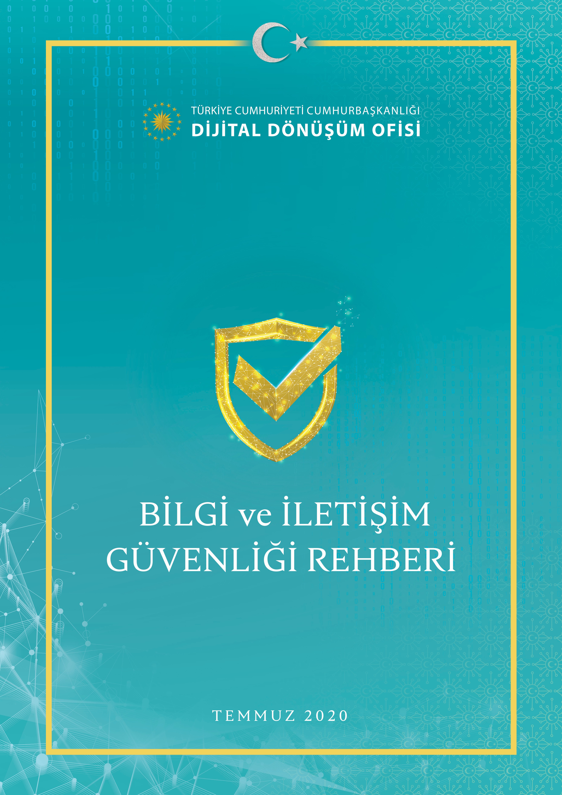
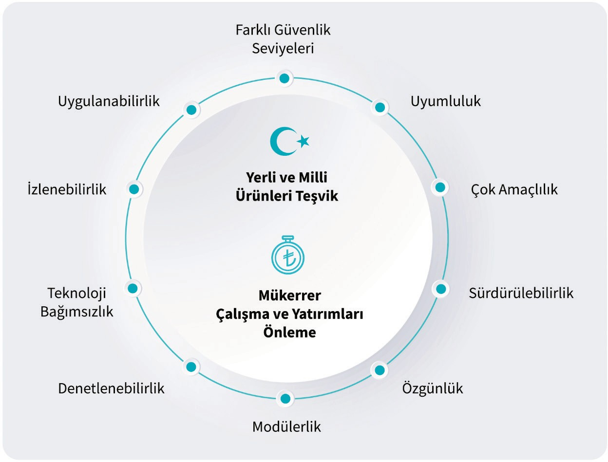
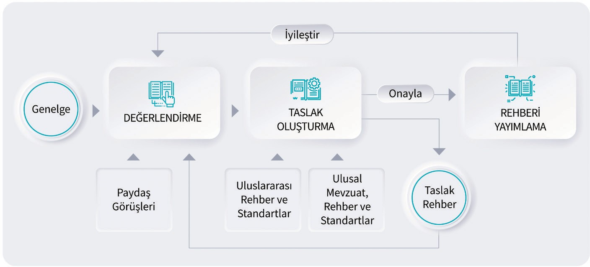
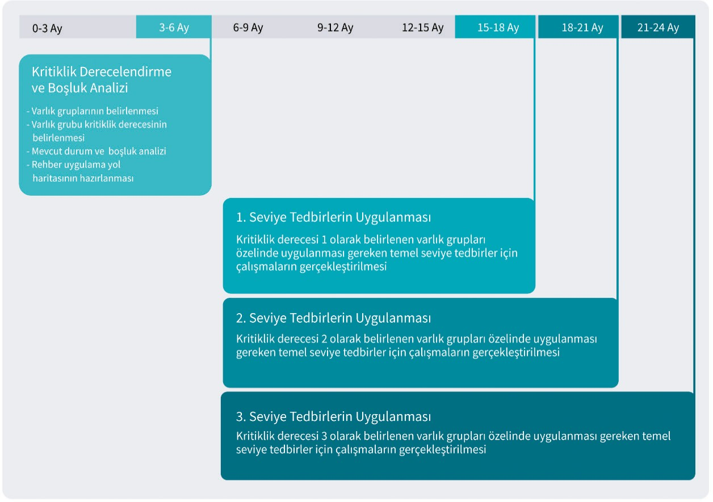
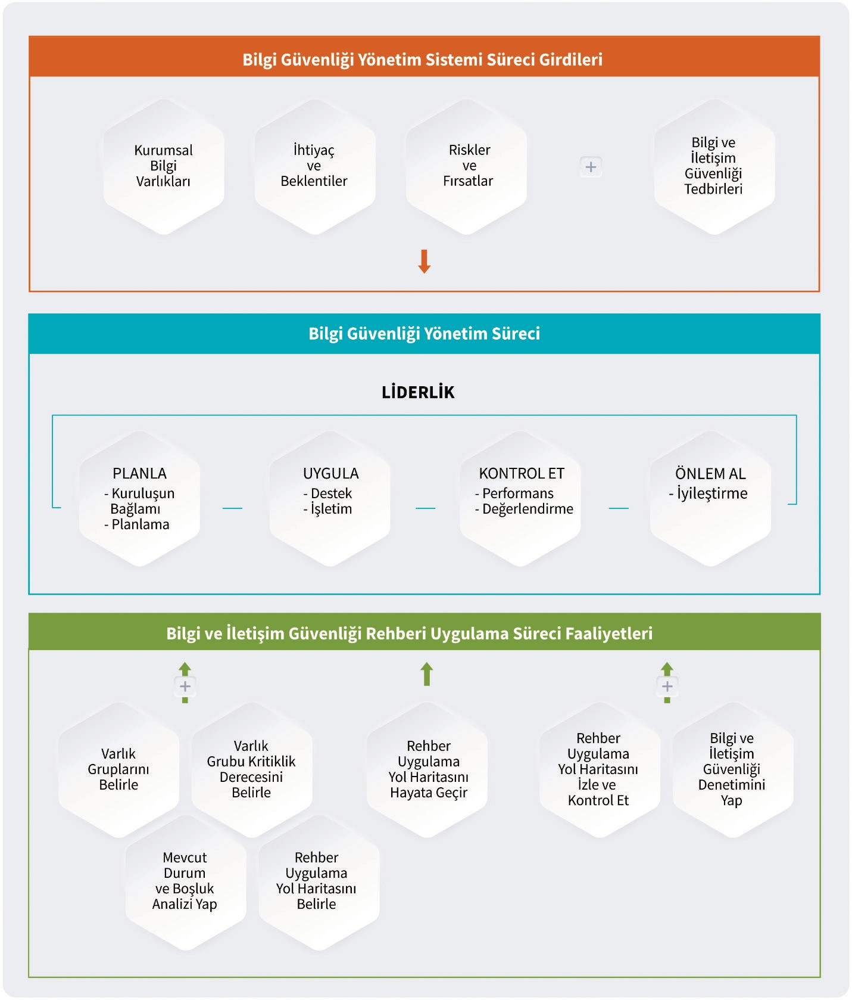
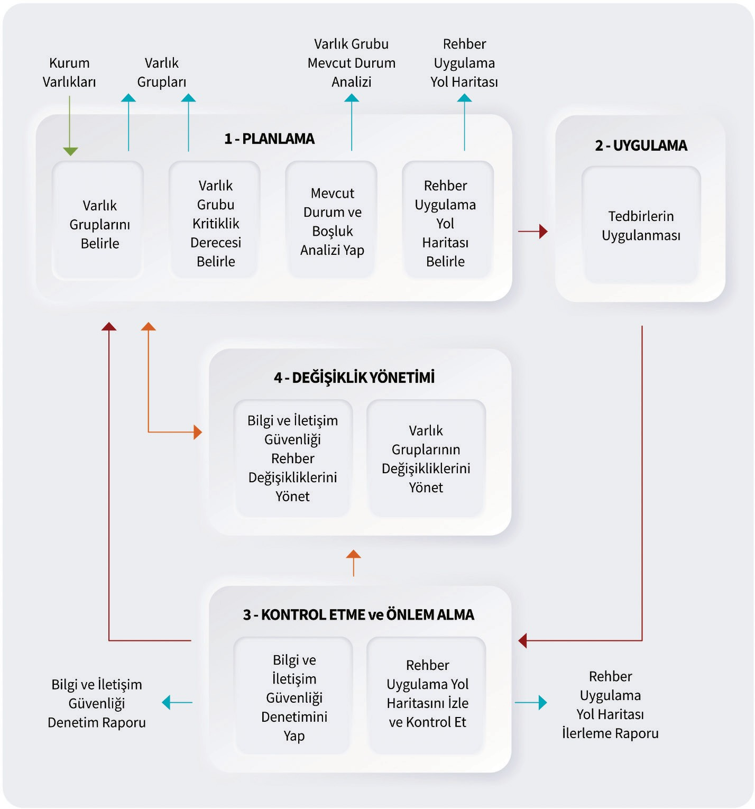
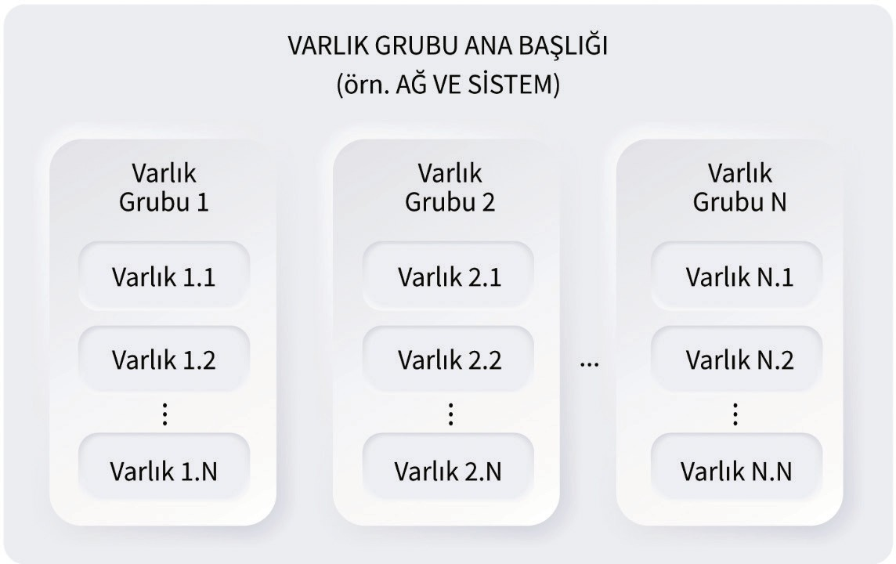
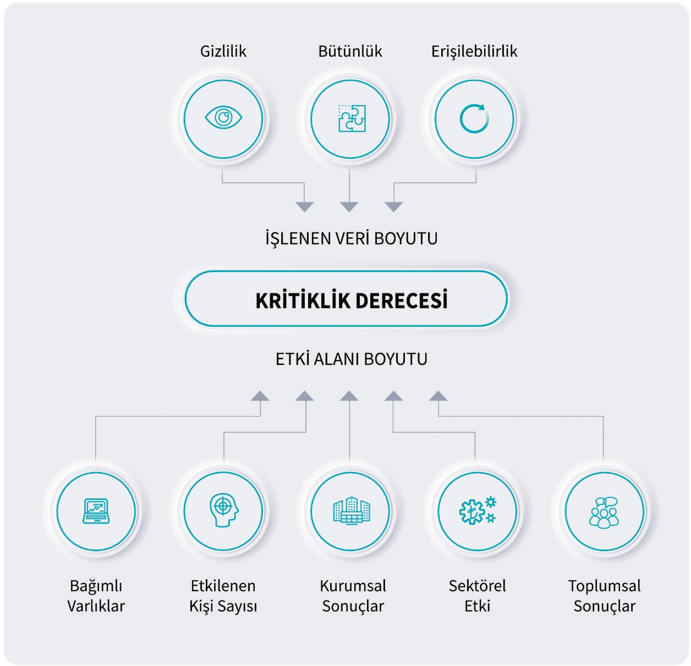
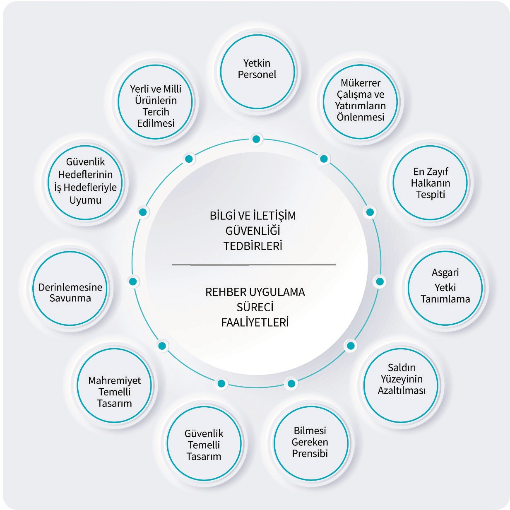

> **BELGE ADI:** Bilgi ve İletişim Güvenliği Rehberi
>
> **SÜRÜM NO:** 2020 / 1.0
>
> **SÜRÜM TARİHİ:** 10.07.2020
>
> **GİZLİLİK DERECESİ:** Tasnif Dışı

> <u>ht[tps://www](http://www.cbddo.gov.tr/bgrehber).cbddo[.gov.tr/bgrehber](http://www.cbddo.gov.tr/bgrehber)</u>
>
> *Bilgi ve İletişim Güvenliği Rehberi hakkındaki*
>
> *görüş ve öneriler aşağıda yer alan elektronik posta adresine
> iletilebilir.*
>
> **Elektronik Posta:** <bgrehber@cbddo.gov.tr>

> Cumhurbaşkanlığı Dijital Dönüşüm Ofisi tarafından hazırlanan Bilgi ve
> İletişim Güvenliği Rehberi, Creative Commons Atıf 4.0 Uluslararası
> lisansı ile lisanslanmıştır. Lisansın bir kopyası için
> <u>https://creativecommons.org/licenses/by/4.0/deed.tr</u> bağlantısı
> ziyaret edilebilir.

> **SUNUŞ**
>
> Günümüz dünyasında dijital teknolojilerin baş döndürücü bir hızla
> gelişimi, ekonomik ve sosyal hayatın yanında güvenlik tanım ve
> kavramlarını da etkileyerek geleceğe dönük güvenlik bakış açılarını
> kökten değiştirmiştir.
>
> Toplumların hayatına yön verebilme potansiyeli bulunan verinin dijital
> ortama taşınmasıyla, siber tehdit ve saldırıların doğası da
> değişmiştir. Geçmişte daha sade yöntemler, basit amaçlar ve belirli
> yetkinlikte kişiler tarafından gerçekleştirilen siber saldırılar artık
> devletler düzeyinde, otomatize edilmiş, daha sık, karmaşık, yıkıcı,
> tespiti zor ve hedef odaklı olmaya başlamıştır. Son dönemde yaşanan
> hadiseler, ülkenin sınırlarını korumak kadar ülkenin verisinin ve
> dijital altyapılarının korunmasının önemini bize göstermiştir.
>
> Şüphesiz dünyanın hiçbir yerinde bu alanda yüzde yüz güvenlikten
> bahsetmek mümkün değildir. Ancak insan, teknoloji, organizasyon
> yapısı, yasal düzenleme ile ulusal ve uluslararası işbirliği
> boyutlarının her birinde atılacak doğru ve bilinçli adımlarla yıkıcı
> etkilerden korunmak mümkündür. Bilgi sistemlerinde karşılaşılan
> güvenlik risklerinin azaltılması, etkisiz kılınması ve özellikle
> gizliliği, bütünlüğü veya erişilebilirliği bozulduğunda milli
> güvenliği tehdit edebilecek veya kamu düzeninin bozulmasına yol
> açabilecek kritik türdeki verilerin güvenliğinin sağlanması amacıyla,
> kamu kurumları ve kritik altyapı hizmeti veren işletmelerce uyulması
> gereken Bilgi ve İletişim Güvenliği tedbirlerini içeren, 06.07.2019
> tarih ve 30823 sayılı Resmi Gazete’de yayımlanarak yürürlüğe giren
> 2019/12 sayılı Cumhurbaşkanlığı Genelgesi yasal düzenleme boyutunda
> ülke çapında bilgi güvenliği seviyesini artırmaya yönelik önemli bir
> adım olmuştur.
>
> Genelgenin yürürlüğe girmesini müteakiben, Dijital Dönüşüm Ofisi
> Başkanlığı koordinasyonunda, Bilgi ve İletişim Güvenliği Rehberi
> hazırlama çalışmaları başlatılmıştır. Yaklaşık 1 yıl süren çalışmalar
> kapsamında; 5 günlük bir çalıştay gerçekleştirilmiş, 16 Bakanlık ile
> 51 Kurum ve Kuruluştan 240 uzmanın katkısı alınmış, 200 saati aşan
> 70’in üzerinde çalışma toplantısında 2660 görüş ve öneri
> değerlendirilmiş, ulusal ve uluslararası yayınlar incelenmiştir.
>
> Bilgi ve iletişim güvenliği alanında ülkemize özgün ilk referans
> doküman olma niteliği taşıyan ve geniş bir katılımla ilgili tüm
> paydaşların katkısı alınarak hazırlanan Bilgi ve İletişim Güvenliği
> Rehberi; ihtiyaçlar, gelişen teknoloji, değişen şartlar ile ulusal
> politika ve stratejiler göz önünde bulundurularak güncellenmeye devam
> edecektir.
>
> Güçlü ekonomiler için güçlü teknolojilerin önem kazandığı çağımızda
> bugünden atacağımız adımlar ve alacağımız önlemler yarının dünyasında
> teknolojiyi takip eden değil teknolojiye yön veren bir ülke
> olabilmemiz için oldukça önemlidir. Bu bağlamda Rehber, yerli ve milli
> siber güvenlik ürün ve çözümlerinin kullanımının yaygınlaştırılmasını
> sağlayarak üretim gücümüze destek olacak, siber güvenlik alanında
> dünya ile rekabet edebilecek teknoloji üretebilmenin önünü açacaktır.
>
> Rehber, bilgi ve iletişim güvenliği alanındaki büyük bir boşluğu
> doldurmakla birlikte, siber saldırılara karşı mukavemetimizi
> artıracak, bilgi güvenliği ve siber güvenlikte ülke seviyesinin
> uluslararası arenada yükselmesinde önemli bir rol alacaktır. Bunula
> birlikte ulusal verimizin güvenliğine, kritik altyapı ve
> sistemlerimizin sürdürülebilirliğine katkı sağlayacak, milli güvenlik
> stratejilerimiz ve hedeflerimizi gerçekleştirmek için doğru adımlarla
> yol almamızı sağlayacaktır.
>
> **Dr. Ali Taha KOÇ**
>
> **Dijital Dönüşüm Ofisi Başkanı**

# İÇİNDEKİLER

> **Sayfa**
>
> [**KISALTMALAR 5**](#kisaltmalar)
>
> [**TANIMLAR 7**](#tanimlar)
>
> [**GİRİŞ 11**](#giriş)
>
> [**Amaç ve
> Kapsam 11**](#amaç-ve-kapsam)
>
> [**Rehberin
> İçeriği ve Güncelleme Süreci
> 12**](#rehberin-içeriği-ve-güncelleme-süreci)
>
> [**Rehber
> Uyum Planı 13**](#rehber-uyum-planı)
>
> [**BİLGİ VE İLETİŞİM GÜVENLİĞİ
> REHBERİ UYGULAMA SÜRECİ
> 19**](#bilgi-ve-iletişim-güvenliği-rehberi-uygulama-süreci)
>
> [**Planlama
> 21**](#planlama)

1.  [Varlık Gruplarının Belirlenmesi
    21](#varlık-gruplarının-belirlenmesi)

2.  [Varlık Grubu Kritiklik Derecesinin Belirlenmesi
    24](#varlık-grubu-kritiklik-derecesinin-belirlenmesi)

3.  [Mevcut Durum ve Boşluk Analizi 27](#mevcut-durum-ve-boşluk-analizi)

4.  [Rehber Uygulama Yol Haritasının Hazırlanması
    29](#rehber-uygulama-yol-haritasının-hazırlanması)

> [**Uygulama
> 30**](#uygulama)
>
> [2.2.1. Bilgi ve İletişim Güvenliği Temel Prensipleri
> 30](#bilgi-ve-iletişim-güvenliği-temel-prensipleri)
>
> [**Kontrol
> Etme ve Önlem Alma 31**](#kontrol-etme-ve-önlem-alma)

1.  [Rehber Uygulama Yol Haritasının İzlenmesi ve Kontrol Edilmesi
    31](#rehber-uygulama-yol-haritasının-izlenmesi-ve-kontrol-edilmesi)

2.  [Bilgi ve İletişim Güvenliği Denetimi
    31](#bilgi-ve-iletişim-güvenliği-denetimi)

> [**Değişiklik
> Yönetimi 32**](#değişiklik-yönetimi)

1.  [Rehber Değişikliklerinin Yönetilmesi
    32](#rehber-değişikliklerinin-yönetilmesi)

2.  [Varlık Gruplarının Değişikliklerinin Yönetilmesi
    32](#varlık-gruplarının-değişikliklerinin-yönetilmesi)

> [**VARLIK GRUPLARINA YÖNELİK GÜVENLİK
> TEDBİRLERİ 35**](#varlik-gruplarina-yönelik-güvenlik-tedbirleri)
>
> [**Ağ ve
> Sistem Güvenliği 35**](#ağ-ve-sistem-güvenliği)

1.  [Donanım Varlıklarının Envanter Yönetimi
    36](#donanım-varlıklarının-envanter-yönetimi)

2.  [Yazılım Varlıklarının Envanter Yönetimi
    38](#yazılım-varlıklarının-envanter-yönetimi)

3.  [Tehdit ve Zafiyet Yönetimi 40](#tehdit-ve-zafiyet-yönetimi)

4.  [E-Posta Sunucusu ve İstemcisi Güvenliği
    44](#e-posta-sunucusu-ve-istemcisi-güvenliği)

5.  [Zararlı Yazılımlardan Korunma 47](#zararlı-yazılımlardan-korunma)

6.  [Ağ Güvenliği 49](#ağ-güvenliği)

7.  [Veri Sızıntısı Önleme 57](#veri-sızıntısı-önleme)

8.  [İz ve Denetim Kayıtlarının Tutulması ve İzlenmesi
    59](#iz-ve-denetim-kayıtlarının-tutulması-ve-izlenmesi)

9.  [Sanallaştırma Güvenliği 61](#sanallaştırma-güvenliği)

10. [Siber Güvenlik Olay Yönetimi 64](#siber-güvenlik-olay-yönetimi)

11. [Sızma Testleri ve Güvenlik Denetimleri
    66](#sızma-testleri-ve-güvenlik-denetimleri)

12. [Kimlik Doğrulama ve Erişim Yönetimi
    68](#kimlik-doğrulama-ve-erişim-yönetimi)

13. [Felaket Kurtarma ve İş Sürekliliği Yönetimi
    74](#felaket-kurtarma-ve-iş-sürekliliği-yönetimi)

14. [Uzaktan Çalışma 79](#uzaktan-çalışma)

> [**Uygulama
> ve Veri Güvenliği 84**](#uygulama-ve-veri-güvenliği)

1.  [Kimlik Doğrulama 84](#kimlik-doğrulama)

1

2.  [Oturum Yönetimi 89](#oturum-yönetimi)

3.  [Yetkilendirme 91](#yetkilendirme)

4.  [Dosyaların ve Kaynakların Güvenliği
    92](#dosyaların-ve-kaynakların-güvenliği)

5.  [Güvenli Kurulum ve Yapılandırma
    95](#güvenli-kurulum-ve-yapılandırma)

6.  [Güvenli Yazılım Geliştirme 98](#güvenli-yazılım-geliştirme)

7.  [Veri Tabanı ve Kayıt Yönetimi 100](#veri-tabanı-ve-kayıt-yönetimi)

8.  [Hata Ele Alma ve Kayıt Yönetimi
    104](#hata-ele-alma-ve-kayıt-yönetimi)

9.  [İletişim Güvenliği 106](#iletişim-güvenliği)

10. [Kötücül İşlemleri Engelleme 107](#kötücül-işlemleri-engelleme)

11. [Dış Sistem Entegrasyonlarının Güvenliği
    111](#dış-sistem-entegrasyonlarının-güvenliği)

[Taşınabilir
Cihaz ve Ortam Güvenliği 114](#taşınabilir-cihaz-ve-ortam-güvenliği)

1.  [Akıllı Telefon ve Tablet Güvenliği
    114](#akıllı-telefon-ve-tablet-güvenliği)

2.  [Taşınabilir Bilgisayar Güvenliği
    118](#taşınabilir-bilgisayar-güvenliği)

3.  [Taşınabilir Ortam Güvenliği (CD/DVD, Taşınabilir Bellek Ortamları)
    120](#taşınabilir-ortam-güvenliği-cddvd-taşınabilir-bellek-ortamları)

[Nesnelerin
İnterneti (IoT) Cihazlarının Güvenliği
121](#nesnelerin-interneti-iot-cihazlarının-güvenliği)

1.  [Ağ Servisleri ve İletişimi 121](#bookmark67)

2.  [Dâhili Veri Depolama 123](#dâhili-veri-depolama)

3.  [Kimlik Doğrulama ve Yetkilendirme
    124](#kimlik-doğrulama-ve-yetkilendirme)

4.  [API ve Bağlantı Güvenliği 125](#api-ve-bağlantı-güvenliği)

5.  [Diğer Güvenlik Tedbirleri 126](#diğer-güvenlik-tedbirleri)

[Personel
Güvenliği 128](#personel-güvenliği)

1.  [Genel Güvenlik Tedbirleri 128](#bookmark73)

2.  [Eğitim ve Farkındalık Faaliyetleri
    131](#eğitim-ve-farkındalık-faaliyetleri)

3.  [Tedarikçi İlişkileri Güvenliği
    132](#tedarikçi-ilişkileri-güvenliği)

[Fiziksel
Mekânların Güvenliği 134](#fiziksel-mekânların-güvenliği)

1.  [Genel Güvenlik Tedbirleri 135](#genel-güvenlik-tedbirleri-1)

2.  [Sistem Odası/Veri Merkezine Yönelik Güvenlik Tedbirleri
    141](#sistem-odasıveri-merkezine-yönelik-güvenlik-tedbirleri)

3.  [Elektromanyetik Bilgi Kaçaklarından Korunma Yöntemleri (TEMPEST)
    146](#elektromanyetik-bilgi-kaçaklarından-korunma-yöntemleri-tempest)

[UYGULAMA VE TEKNOLOJİ ALANLARINA
YÖNELİK GÜVENLİK TEDBİRLERİ
149](#uygulama-ve-teknoloji-alanlarina-yönelik-güvenlik-tedbirleri)

[Kişisel
Verilerin Güvenliği 149](#kişisel-verilerin-güvenliği)

1.  [Kayıt Yönetimi 149](#kayıt-yönetimi)

2.  [Erişim Kayıtları Yönetimi 152](#erişim-kayıtları-yönetimi)

3.  [Yetkilendirme 153](#yetkilendirme-1)

4.  [Şifreleme 155](#şifreleme)

5.  [Yedekleme, Silme, Yok Etme ve Anonim Hale Getirme
    156](#yedekleme-silme-yok-etme-ve-anonim-hale-getirme)

6.  [Aydınlatma Yönetimi 157](#aydınlatma-yönetimi)

7.  [Açık Rıza Yönetimi 158](#açık-rıza-yönetimi)

8.  [Kişisel Veri Yönetim Sürecinin İşletilmesi
    160](#kişisel-veri-yönetim-sürecinin-işletilmesi)

[Anlık
Mesajlaşma Güvenliği 161](#anlık-mesajlaşma-güvenliği)

[4.2.1. Genel Güvenlik Tedbirleri 161](#bookmark91)

[Bulut Bilişim
Güvenliği 163](#bulut-bilişim-güvenliği)

[4.3.1. Genel Güvenlik Tedbirleri 164](#genel-güvenlik-tedbirleri-3)

[Kripto
Uygulamaları Güvenliği 168](#kripto-uygulamaları-güvenliği)

1.  [Kriptografik Algoritmalar ve Kullanımı
    168](#kriptografik-algoritmalar-ve-kullanımı)

2.  [Şifreleme ve Anahtar Yönetimi 170](#şifreleme-ve-anahtar-yönetimi)

3.  [Kriptografik Uygulamalar 176](#kriptografik-uygulamalar)

[Kritik
Altyapılar Güvenliği 178](#kritik-altyapılar-güvenliği)

1.  [Genel Güvenlik Tedbirleri 178](#genel-güvenlik-tedbirleri-4)

2.  [Enerji Sektörü Özelinde Güvenlik Tedbirleri
    179](#enerji-sektörü-özelinde-güvenlik-tedbirleri)

3.  [Elektronik Haberleşme Sektörü Özelinde Güvenlik Tedbirleri
    182](#elektronik-haberleşme-sektörü-özelinde-güvenlik-tedbirleri)

[Yeni
Geliştirmeler ve Tedarik 185](#yeni-geliştirmeler-ve-tedarik)

[4.6.1. Genel Güvenlik Tedbirleri 185](#genel-güvenlik-tedbirleri-5)

[SIKILAŞTIRMA TEDBİRLERİ
189](#sikilaştirma-tedbirleri)

[İşletim
Sistemi Sıkılaştırma Tedbirleri
189](#işletim-sistemi-sıkılaştırma-tedbirleri)

1.  [Genel Sıkılaştırma Tedbirleri 189](#genel-sıkılaştırma-tedbirleri)

2.  [Linux İşletim Sistemi Sıkılaştırma Tedbirleri
    193](#linux-işletim-sistemi-sıkılaştırma-tedbirleri)

3.  [Windows İşletim Sistemi Sıkılaştırma Tedbirleri
    196](#windows-işletim-sistemi-sıkılaştırma-tedbirleri)

[Veri Tabanı
Sıkılaştırma Tedbirleri 198](#veri-tabanı-sıkılaştırma-tedbirleri)

[5.2.1. Genel Sıkılaştırma Tedbirleri 198](#bookmark110)

[Sunucu
Sıkılaştırma Tedbirleri 202](#sunucu-sıkılaştırma-tedbirleri)

1.  [Web Sunucusu Sıkılaştırma Tedbirleri
    203](#web-sunucusu-sıkılaştırma-tedbirleri)

2.  [Sanallaştırma Sunucusu Sıkılaştırma Tedbirleri
    207](#sanallaştırma-sunucusu-sıkılaştırma-tedbirleri)

[KAYNAKÇA 210](#kaynakça)

[EKLER 211](#ekler)

[EK-A: GENELGE MADDELERİ EŞLEŞTİRME TABLOSU 211](#_bookmark116)

[EK-B: ULUSLARARASI STANDARTLAR VE YAYIMLI KILAVUZLAR EŞLEŞTİRME TABLOSU
215](#ek-b-uluslararasi-standartlar-ve-yayimli-kilavuzlar-eşleştirme-tablosu)

[EK-C: BİLGİ VE İLETİŞİM GÜVENLİĞİ REHBERİ UYGULAMA SÜRECİ
KAPSAMINDA](#_bookmark118)

[KULLANILACAK FORMLAR, ŞABLONLAR VE ÖRNEK DOKÜMANLAR 217](#_bookmark118)

[EK-C.1: VARLIK GRUBU KRİTİKLİK DERECELENDİRME ANKETİ
217](#ek-c.1-varlik-grubu-kritiklik-derecelendirme-anketi)

[EK-C.2: VARLIK GRUBU VE KRİTİKLİK DERECESİ TANIMLAMA FORMU
223](#ek-c.2-varlik-grubu-ve-kritiklik-derecesi-tanimlama-formu)

[EK-C.3: MEVCUT DURUM VE BOŞLUK ANALİZ FORMU
224](#ek-c.3-mevcut-durum-ve-boşluk-analiz-formu)

[EK-C.4: REHBER UYGULAMA YOL HARİTASI BELİRLEME FORMU
226](#ek-c.4-rehber-uygulama-yol-haritasi-belirleme-formu)

[EK-C.5: TELAFİ EDİCİ KONTROL KAYIT FORMU
227](#ek-c.5-telafi-edici-kontrol-kayit-formu)

[EK-C.6: TAAHHÜTNAME ÖRNEĞİ 228](#ek-c.6-taahhütname-örneği)

# ŞEKİLLER

> [Şekil 1. Bilgi ve İletişim Güvenliği Rehberinin Hedefleri
> 12](#_bookmark4)
>
> [Şekil 2. Rehber Güncelleme Süreci 13](#_bookmark6)
>
> [Şekil 3. Rehber Uyum Planı 13](#_bookmark8)
>
> [Şekil 4. Rehber ve Bilgi Güvenliği Yönetim Sistemi İlişkisi
> 14](#_bookmark9)
>
> [Şekil 5. Bilgi ve İletişim Güvenliği Rehberi Uygulama Süreci
> 19](#_bookmark11)
>
> [Şekil 6. Varlıklar, Varlık Grupları ve Varlık Ana Başlıkları
> 22](#_bookmark16)
>
> [Şekil 7. Kritiklik Derecesi Belirlemek için Kullanılan Boyutlar
> 24](#_bookmark18)
>
> [Şekil 8. Temel Prensipler 30](#_bookmark27)

# TABLOLAR

> [Tablo 1. SAM Rolleri Açıklamaları 20](#_bookmark12)
>
> [Tablo 2. Bilgi ve İletişim Güvenliği Rehberi Uygulama Süreci için
> Sorumluluk Atama Matrisi 20](#_bookmark13)
>
> [Tablo 3. Anket Puanına Karşılık Gelen Kritiklik Derecesi
> 25](#_bookmark19)
>
> [Tablo 4. Varlık Grubu Kritiklik Derecesinin Belirlenmesi
> 26](#_bookmark20)
>
> [Tablo 5. Alt Varlık Gruplarının Kritiklik Derecesinin Belirlenmesi
> 26](#_bookmark21)
>
> [Tablo 6. Varlık Gruplarına Yönelik Tedbir Uygulanabilirlik Örnek
> Çalışması 27](#_bookmark22)

# KISALTMALAR

<table>
<colgroup>
<col style="width: 13%" />
<col style="width: 86%" />
</colgroup>
<thead>
<tr class="header">
<th><blockquote>

<strong>Kısaltma</strong>

</blockquote></th>
<th><blockquote>

<strong>Açıklama</strong>

</blockquote></th>
</tr>
</thead>
<tbody>
<tr class="odd">
<td><blockquote>

API

</blockquote></td>
<td><blockquote>

Application Programming Interface / Uygulama Programlama Arayüzü

</blockquote></td>
</tr>
<tr class="even">
<td><blockquote>

ASLR

</blockquote></td>
<td><blockquote>

Address Space Layout Randomization / Adres Alanı Düzeni Rastgele
Seçimi

</blockquote></td>
</tr>
<tr class="odd">
<td><blockquote>

BDDK

</blockquote></td>
<td><blockquote>

Bankacılık Düzenleme ve Denetleme Kurumu

</blockquote></td>
</tr>
<tr class="even">
<td><blockquote>

BT

</blockquote></td>
<td><blockquote>

Bilgi Teknolojisi

</blockquote></td>
</tr>
<tr class="odd">
<td><blockquote>

BTK

</blockquote></td>
<td><blockquote>

Bilgi Teknolojileri ve İletişim Kurumu

</blockquote></td>
</tr>
<tr class="even">
<td><blockquote>

CAPTCHA

</blockquote></td>
<td><blockquote>

Completely Automated Public Turing Test to Tell Computers and Humans
Apart / İnsan ve Bilgisayar Ayrımı Amaçlı Tam Otomatik Genel Turing
Test

</blockquote></td>
</tr>
<tr class="odd">
<td><blockquote>

COMSEC

</blockquote></td>
<td><blockquote>

Communication Security / Haberleşme Güvenliği

</blockquote></td>
</tr>
<tr class="even">
<td><blockquote>

CORS

</blockquote></td>
<td><blockquote>

Cross-Origin Resource Sharing / Kökler Arası Kaynak Paylaşımı

</blockquote></td>
</tr>
<tr class="odd">
<td><blockquote>

CSRF

</blockquote></td>
<td><blockquote>

Cross-Site Request Forgery / Siteler Arası İstek Sahteciliği

</blockquote></td>
</tr>
<tr class="even">
<td><blockquote>

DEP

</blockquote></td>
<td><blockquote>

Data Execution Prevention / Veri Yürütme Engellemesi

</blockquote></td>
</tr>
<tr class="odd">
<td><blockquote>

DDO

</blockquote></td>
<td><blockquote>

Cumhurbaşkanlığı Dijital Dönüşüm Ofisi

</blockquote></td>
</tr>
<tr class="even">
<td><blockquote>

DHCP

</blockquote></td>
<td><blockquote>

Dynamic Host Configuration Protocol / Dinamik Bilgisayar Yapılandırma
Protokolü

</blockquote></td>
</tr>
<tr class="odd">
<td><blockquote>

DKIM

</blockquote></td>
<td><blockquote>

Domain Keys Identified Mail / Alan Adı Anahtarıyla Tanımlanmış
E-Posta

</blockquote></td>
</tr>
<tr class="even">
<td><blockquote>

DMZ

</blockquote></td>
<td><blockquote>

Demilitarized Zone / Sivil Bölge

</blockquote></td>
</tr>
<tr class="odd">
<td><blockquote>

DNS

</blockquote></td>
<td><blockquote>

Domain Name System / Alan Adı Sistemi

</blockquote></td>
</tr>
<tr class="even">
<td><blockquote>

DoS

</blockquote></td>
<td><blockquote>

Denial of Service / Hizmet Engelleme

</blockquote></td>
</tr>
<tr class="odd">
<td><blockquote>

DDoS

</blockquote></td>
<td><blockquote>

Distributed Denial of Service / Dağıtık Hizmet Engelleme

</blockquote></td>
</tr>
<tr class="even">
<td><blockquote>

EAP

</blockquote></td>
<td><blockquote>

Extensible Authentication Protocol / Genişletilebilir Kimlik
Doğrulama Protokolü

</blockquote></td>
</tr>
<tr class="odd">
<td><blockquote>

EBYS

</blockquote></td>
<td><blockquote>

Elektronik Belge Yönetim Sistemi

</blockquote></td>
</tr>
<tr class="even">
<td><blockquote>

EKS

</blockquote></td>
<td><blockquote>

Endüstriyel Kontrol Sistemi

</blockquote></td>
</tr>
<tr class="odd">
<td><blockquote>

EPDK

</blockquote></td>
<td><blockquote>

Enerji Piyasası Düzenleme Kurumu

</blockquote></td>
</tr>
<tr class="even">
<td><blockquote>

FTP

</blockquote></td>
<td><blockquote>

File Transfer Protocol / Dosya Transfer Protokolü

</blockquote></td>
</tr>
<tr class="odd">
<td><blockquote>

G2B

</blockquote></td>
<td><blockquote>

Government to Business / Devletten Kuruma

</blockquote></td>
</tr>
<tr class="even">
<td><blockquote>

G2G

</blockquote></td>
<td><blockquote>

Government to Government / Devletten Devlete

</blockquote></td>
</tr>
<tr class="odd">
<td><blockquote>

GPS

</blockquote></td>
<td><blockquote>

Global Positioning System / Küresel Konumlama Sistemi

</blockquote></td>
</tr>
<tr class="even">
<td><blockquote>

HDD

</blockquote></td>
<td><blockquote>

Hard Disk Drive / Sabit Disk Sürücüsü

</blockquote></td>
</tr>
<tr class="odd">
<td><blockquote>

HIDS

</blockquote></td>
<td><blockquote>

Host Intrusion Detection System / Bilgisayar Tabanlı Saldırı Tespit
Sistemi

</blockquote></td>
</tr>
<tr class="even">
<td><blockquote>

HIPS

</blockquote></td>
<td><blockquote>

Host Intrusion Prevention System / Bilgisayar Tabanlı Saldırı Önleme
Sistemi

</blockquote></td>
</tr>
<tr class="odd">
<td><blockquote>

HMI

</blockquote></td>
<td><blockquote>

Human Machine Interface / Makine ile İnsan Arasında Bilgi Aktarımı
Sağlayan Arayüz

</blockquote></td>
</tr>
<tr class="even">
<td><blockquote>

HSTS

</blockquote></td>
<td><blockquote>

HTTP Strict Transport Security / HTTP Sıkı Aktarım Güvenliği

</blockquote></td>
</tr>
<tr class="odd">
<td><blockquote>

HSM

</blockquote></td>
<td><blockquote>

Hardware Security Module / Donanımsal Güvenlik Modülü

</blockquote></td>
</tr>
<tr class="even">
<td><blockquote>

HTML

</blockquote></td>
<td><blockquote>

Hypertext Markup Language / Standart Metin İşaretleme Dili

</blockquote></td>
</tr>
<tr class="odd">
<td><blockquote>

HTTP

</blockquote></td>
<td><blockquote>

Hypertext Transfer Protocol / Bağlantılı Metin Aktarım Protokolü

</blockquote></td>
</tr>
<tr class="even">
<td><blockquote>

HTTPS

</blockquote></td>
<td><blockquote>

Hypertext Transfer Protocol Secure / Güvenli Bağlantılı Metin Aktarım
Protokolü

</blockquote></td>
</tr>
<tr class="odd">
<td><blockquote>

IEC

</blockquote></td>
<td><blockquote>

International Electrotechnical Commission / Uluslararası
Elektroteknik Komisyonu

</blockquote></td>
</tr>
<tr class="even">
<td><blockquote>

IED

</blockquote></td>
<td><blockquote>

Intelligent Electronic Device / Akıllı Elektronik Cihaz

</blockquote></td>
</tr>
<tr class="odd">
<td><blockquote>

IMAPs

</blockquote></td>
<td><blockquote>

Internet Message Access Protocol Secure / Güvenli İnternet Mesaj
Erişim Protokolü

</blockquote></td>
</tr>
<tr class="even">
<td><blockquote>

IoT

</blockquote></td>
<td><blockquote>

Internet of Things / Nesnelerin İnterneti

</blockquote></td>
</tr>
<tr class="odd">
<td><blockquote>

IP

</blockquote></td>
<td><blockquote>

Internet Protocol / İnternet Protokolü

</blockquote></td>
</tr>
<tr class="even">
<td><blockquote>

IPS

</blockquote></td>
<td><blockquote>

Intrusion Prevention System / Saldırı Önleme Sistemi

</blockquote></td>
</tr>
<tr class="odd">
<td><blockquote>

IPSec

</blockquote></td>
<td><blockquote>

IP Security / İnternet Protokolü Güvenliği

</blockquote></td>
</tr>
<tr class="even">
<td><blockquote>

ISO

</blockquote></td>
<td><blockquote>

International Organization for Standardization / Uluslararası
Standartlar Örgütü

</blockquote></td>
</tr>
<tr class="odd">
<td><blockquote>

LAN

</blockquote></td>
<td><blockquote>

Local Area Network / Yerel Ağ Bağlantısı

</blockquote></td>
</tr>
<tr class="even">
<td><blockquote>

LDAP

</blockquote></td>
<td><blockquote>

Lightweight Directory Access Protocol / Hafif Dizin Erişim
Protokolü

</blockquote></td>
</tr>
<tr class="odd">
<td><blockquote>

LUN

</blockquote></td>
<td><blockquote>

Logical Unit Number / Mantıksal Birim Numarası

</blockquote></td>
</tr>
<tr class="even">
<td><blockquote>

MAC

</blockquote></td>
<td><blockquote>

Media Access Control Address / Ortam Erişim Kontrol Adresi

</blockquote></td>
</tr>
<tr class="odd">
<td><blockquote>

MMS

</blockquote></td>
<td><blockquote>

Manufacturing Message Specification / Üretim Mesaj Spesifikasyonu

</blockquote></td>
</tr>
</tbody>
</table>

<table>
<colgroup>
<col style="width: 13%" />
<col style="width: 86%" />
</colgroup>
<thead>
<tr class="header">
<th><blockquote>

<strong>Kısaltma</strong>

</blockquote></th>
<th><blockquote>

<strong>Açıklama</strong>

</blockquote></th>
</tr>
</thead>
<tbody>
<tr class="odd">
<td><blockquote>

NAC

</blockquote></td>
<td><blockquote>

Network Access Control / Ağ Erişim Kontrolü

</blockquote></td>
</tr>
<tr class="even">
<td><blockquote>

NES

</blockquote></td>
<td><blockquote>

Nitelikli Elektronik Sertifika

</blockquote></td>
</tr>
<tr class="odd">
<td><blockquote>

NFC

</blockquote></td>
<td><blockquote>

Near Field Communication / Yakın Alan İletişimi

</blockquote></td>
</tr>
<tr class="even">
<td><blockquote>

NTP

</blockquote></td>
<td><blockquote>

Network Time Protocol / Ağ Zaman Protokolü

</blockquote></td>
</tr>
<tr class="odd">
<td><blockquote>

OCSP

</blockquote></td>
<td><blockquote>

Online Certificate Status Protocol / Çevrimiçi Sertifika Durum
Protokolü

</blockquote></td>
</tr>
<tr class="even">
<td><blockquote>

OT

</blockquote></td>
<td><blockquote>

Operasyonel Teknolojiler

</blockquote></td>
</tr>
<tr class="odd">
<td><blockquote>

PCMCIA

</blockquote></td>
<td><blockquote>

Personal Computer Memory Card International Association / Kişisel
Bilgisayar Bellek Kartı Uluslararası Birliği

</blockquote></td>
</tr>
<tr class="even">
<td><blockquote>

PLC

</blockquote></td>
<td><blockquote>

Programmable Logic Controller / Programlanabilir Mantıksal
Denetleyici

</blockquote></td>
</tr>
<tr class="odd">
<td><blockquote>

PoC

</blockquote></td>
<td><blockquote>

Proof of Concept / Demo ve Kavram İspatı

</blockquote></td>
</tr>
<tr class="even">
<td><blockquote>

POP3

</blockquote></td>
<td><blockquote>

Post Office Protocol / Posta İleti Protokolü

</blockquote></td>
</tr>
<tr class="odd">
<td><blockquote>

PRNG

</blockquote></td>
<td><blockquote>

Pseudo Random Numerator Generator / Varsayımsal Rastsal Sayı
Üreteci

</blockquote></td>
</tr>
<tr class="even">
<td><blockquote>

SAM

</blockquote></td>
<td><blockquote>

Sorumluluk Atama Matrisi

</blockquote></td>
</tr>
<tr class="odd">
<td><blockquote>

REST

</blockquote></td>
<td><blockquote>

Representational State Transfer / Temsili Durum Transferi

</blockquote></td>
</tr>
<tr class="even">
<td><blockquote>

RTU

</blockquote></td>
<td><blockquote>

Remote Terminal Unit / Uzak Terminal Ünitesi

</blockquote></td>
</tr>
<tr class="odd">
<td><blockquote>

SAN

</blockquote></td>
<td><blockquote>

Storage Area Network / Depolama Alanı Ağı

</blockquote></td>
</tr>
<tr class="even">
<td><blockquote>

SCADA

</blockquote></td>
<td><blockquote>

Supervisory Control And Data Acquisition / Merkezi Kontrol ve Veri
Toplama

</blockquote></td>
</tr>
<tr class="odd">
<td><blockquote>

SCAP

</blockquote></td>
<td><blockquote>

Security Content Automation Protocol / Güvenlik İçeriği Otomasyon
Protokolü

</blockquote></td>
</tr>
<tr class="even">
<td><blockquote>

SFTP

</blockquote></td>
<td><blockquote>

Secure File Transfer Protocol / Güvenli Dosya Transfer Protokolü

</blockquote></td>
</tr>
<tr class="odd">
<td><blockquote>

SMB

</blockquote></td>
<td><blockquote>

Server Message Block / Sunucu İleti Bloğu

</blockquote></td>
</tr>
<tr class="even">
<td><blockquote>

SMS

</blockquote></td>
<td><blockquote>

Short Message Service / Kısa Mesaj Hizmeti

</blockquote></td>
</tr>
<tr class="odd">
<td><blockquote>

SMTP

</blockquote></td>
<td><blockquote>

Simple Mail Transfer Protocol / Basit Posta Aktarım Protokolü

</blockquote></td>
</tr>
<tr class="even">
<td><blockquote>

SMTPS

</blockquote></td>
<td><blockquote>

Secure Simple Mail Transfer Protocol / Güvenli Basit Posta Aktarım
Protokolü

</blockquote></td>
</tr>
<tr class="odd">
<td><blockquote>

SOME

</blockquote></td>
<td><blockquote>

Siber Olaylara Müdahale Ekibi

</blockquote></td>
</tr>
<tr class="even">
<td><blockquote>

SPF

</blockquote></td>
<td><blockquote>

Sender Policy Framework / Gönderen Politika Çerçevesi

</blockquote></td>
</tr>
<tr class="odd">
<td><blockquote>

SPK

</blockquote></td>
<td><blockquote>

Sermaye Piyasası Kurulu

</blockquote></td>
</tr>
<tr class="even">
<td><blockquote>

SQL

</blockquote></td>
<td><blockquote>

Structured Query Language / Yapısal Sorgulama Dili

</blockquote></td>
</tr>
<tr class="odd">
<td><blockquote>

SSD

</blockquote></td>
<td><blockquote>

Solid State Disk / Katı Hal Sürücüsü

</blockquote></td>
</tr>
<tr class="even">
<td><blockquote>

SSH

</blockquote></td>
<td><blockquote>

Secure Shell / Güvenli Kabuk

</blockquote></td>
</tr>
<tr class="odd">
<td><blockquote>

SSL

</blockquote></td>
<td><blockquote>

Secure Sockets Layer / Güvenli Soket Katmanı

</blockquote></td>
</tr>
<tr class="even">
<td><blockquote>

TCP

</blockquote></td>
<td><blockquote>

Transmission Control Protocol / Gönderi Kontrol Protokolü

</blockquote></td>
</tr>
<tr class="odd">
<td><blockquote>

TEE

</blockquote></td>
<td><blockquote>

Trusted Execution Environment / Güvenilir İşletim Ortamı

</blockquote></td>
</tr>
<tr class="even">
<td><blockquote>

TEMPEST

</blockquote></td>
<td><blockquote>

Telecommunications Electronics Material Protected from Emanating
Spurious Transmissions / Elektromanyetik İletimlerin Yayılımından
Korunan Telekomünikasyon Elektronik Malzemesi

</blockquote></td>
</tr>
<tr class="odd">
<td><blockquote>

TLS

</blockquote></td>
<td><blockquote>

Transport Layer Security / Taşıma Katmanı Güvenliği

</blockquote></td>
</tr>
<tr class="even">
<td><blockquote>

TRNG

</blockquote></td>
<td><blockquote>

True Random Number Generator / Gerçek Rassal Sayı Üreteci

</blockquote></td>
</tr>
<tr class="odd">
<td><blockquote>

TRSM

</blockquote></td>
<td><blockquote>

Tamper Resistant Security Module / Kurcalamaya Dayanıklı Güvenlik
Modülü

</blockquote></td>
</tr>
<tr class="even">
<td><blockquote>

TS

</blockquote></td>
<td><blockquote>

Türk Standardı

</blockquote></td>
</tr>
<tr class="odd">
<td><blockquote>

UDP

</blockquote></td>
<td><blockquote>

User Datagram Protocol / Kullanıcı Veri Bloğu Protokolü

</blockquote></td>
</tr>
<tr class="even">
<td><blockquote>

UPS

</blockquote></td>
<td><blockquote>

Uninterruptible Power Supply / Kesintisiz Güç Kaynağı

</blockquote></td>
</tr>
<tr class="odd">
<td><blockquote>

URL

</blockquote></td>
<td><blockquote>

Uniform Resource Locator / Tek Düzen Kaynak Konum Belirleyicisi

</blockquote></td>
</tr>
<tr class="even">
<td><blockquote>

USB

</blockquote></td>
<td><blockquote>

Universal Serial Bus / Evrensel Seri Veri Yolu

</blockquote></td>
</tr>
<tr class="odd">
<td><blockquote>

USOM

</blockquote></td>
<td><blockquote>

Ulusal Siber Olaylara Müdahale Merkezi

</blockquote></td>
</tr>
<tr class="even">
<td><blockquote>

VLAN

</blockquote></td>
<td><blockquote>

Virtual Local Area Network / Sanal Yerel Alan Ağı

</blockquote></td>
</tr>
<tr class="odd">
<td><blockquote>

VPN

</blockquote></td>
<td><blockquote>

Virtual Private Network / Sanal Özel Ağ

</blockquote></td>
</tr>
<tr class="even">
<td><blockquote>

WAF

</blockquote></td>
<td><blockquote>

Web Application Firewall / Uygulama Güvenlik Duvarı

</blockquote></td>
</tr>
<tr class="odd">
<td><blockquote>

WebDAV

</blockquote></td>
<td><blockquote>

Web Distributed Authoring and Versioning / Web Dağıtımlı Yayın ve
Sürümleme

</blockquote></td>
</tr>
<tr class="even">
<td><blockquote>

WiFi

</blockquote></td>
<td><blockquote>

Wireless Fidelity / Kablosuz Bağlantı Alanı

</blockquote></td>
</tr>
<tr class="odd">
<td><blockquote>

XML

</blockquote></td>
<td><blockquote>

Extensible Markup Language / Genişletilebilir İşaretleme Dili

</blockquote></td>
</tr>
<tr class="even">
<td><blockquote>

XSS

</blockquote></td>
<td><blockquote>

Cross Site Scripting / Siteler Arası Betik Çalıştırma

</blockquote></td>
</tr>
</tbody>
</table>

# TANIMLAR

<table>
<colgroup>
<col style="width: 25%" />
<col style="width: 74%" />
</colgroup>
<thead>
<tr class="header">
<th><blockquote>

Tanım

</blockquote></th>
<th><blockquote>

Açıklama

</blockquote></th>
</tr>
</thead>
<tbody>
<tr class="odd">
<td><blockquote>

Delfi Metodu

</blockquote></td>
<td><blockquote>

Bir karar alma durumuna ilişkin uzman görüşlerinin sistematik ve
etkileşimli bir şekilde ele alınmasını sağlayan bir yöntem

</blockquote></td>
</tr>
<tr class="even">
<td><blockquote>

Denetim Kaydı

</blockquote></td>
<td><blockquote>

Bir bilgi varlığına kimin eriştiğini veya erişmeye çalıştığını ve
erişim sağlayan kullanıcının hangi işlemleri gerçekleştirdiğini gösteren
kayıtlar

</blockquote></td>
</tr>
<tr class="odd">
<td><blockquote>

Genelge

</blockquote></td>
<td><blockquote>

06.07.2019 Tarihli ve 30823 Sayılı Resmi Gazete’de yayımlanan 2019/12
Sayılı Cumhurbaşkanlığı Genelgesi

</blockquote></td>
</tr>
<tr class="even">
<td><blockquote>

Gizlilik Dereceli Bilgi/Veri

</blockquote></td>
<td><blockquote>

Bilmesi gereken kişiler dışındakilere açıklanması veya verilmesi,
millî güvenlik ve ülke menfaatleri bakımından sakıncalı görülen ve haiz
olduğu önem derecelerine göre “ÇOK GİZLİ”, “GİZLİ”, “ÖZEL” veya “HİZMETE
ÖZEL” şeklinde sınıflandırılan bilgi/veri

</blockquote></td>
</tr>
<tr class="odd">
<td><blockquote>

İlgili Kişi

</blockquote></td>
<td><blockquote>

6698 sayılı Kişisel Verilerin Korunması Kanunu ile tanımlanan kişisel
verisi işlenen gerçek kişi

</blockquote></td>
</tr>
<tr class="even">
<td><blockquote>

İz Kaydı

</blockquote></td>
<td><blockquote>

Operasyonel bir işlemin başlangıcından bitişine kadar adım adım takip
edilmesini sağlayacak kayıtlar

</blockquote></td>
</tr>
<tr class="odd">
<td><blockquote>

Kritik Bilgi/Veri

</blockquote></td>
<td><ul>
<li>
Güvenlik zafiyeti oluşması durumunda yasal yaptırımlara neden
olabilecek, içeriğinin yetkisiz personel veya kişiler tarafından
görülmesinin kuruma çok ciddi maddi veya manevi zarar vereceği her türlü
bilgi/veri,
</li>
<li>
Kritiklik derecesi 3 olarak hesaplanan varlıkların işlediği
veriler,
</li>
<li>
24.03.2016 tarihli ve 6698 sayılı Kişisel Verilerin Korunması
Kanunu ile tanımlanan özel nitelikli kişisel veriler
</li>
</ul></td>
</tr>
<tr class="even">
<td><blockquote>

Kurum

</blockquote></td>
<td><blockquote>

Kamu kurum ve kuruluşları ile kritik altyapı niteliğinde hizmet veren
işletmeler

</blockquote></td>
</tr>
<tr class="odd">
<td><blockquote>

Kurumsal SOME Kurulum ve Yönetim Rehberi

</blockquote></td>
<td><blockquote>

Ulaştırma ve Altyapı Bakanlığı tarafından yayımlanmış en güncel
“Kurumsal SOME Kurulum ve Yönetim Rehberi” dokümanı

</blockquote></td>
</tr>
<tr class="even">
<td><blockquote>

Rehber

</blockquote></td>
<td><blockquote>

Bilgi ve İletişim Güvenliği Rehberi

</blockquote></td>
</tr>
<tr class="odd">
<td><blockquote>

Varlık

</blockquote></td>
<td><blockquote>

Elektronik ve/veya fiziksel ortamlarda yer alan; iletişim yoluyla
aktarılabilen bilgiyi içeren; kurumun iş süreçleri açısından değer
taşıyan tüm bilgi ve bilgi işleme olanakları, bilgiyi kullanan ve
taşıyan personel ile bilgiyi barındıran fiziksel mekânlar

</blockquote></td>
</tr>
<tr class="even">
<td><blockquote>

Varlık Grubu

</blockquote></td>
<td><blockquote>

Varlıkların içerdiği verinin kritikliği göz önünde bulundurularak,
aynı grup altında değerlendirilmek üzere sınıflandırılan varlıklar
bütünü

</blockquote></td>
</tr>
<tr class="odd">
<td><blockquote>

Varlık Grubu Ana Başlığı

</blockquote></td>
<td><blockquote>

Her varlık grubunun özelliği dikkate alınarak yapılan
sınıflandırma

</blockquote></td>
</tr>
<tr class="even">
<td><blockquote>

Kritik Altyapı

</blockquote></td>
<td><blockquote>

İşlediği bilgi/verinin gizliliği, bütünlüğü veya erişilebilirliği
bozulduğunda can kaybına, büyük ölçekli ekonomik zarara, ulusal güvenlik
açıklarına veya kamu düzeninin bozulmasına yol açabilecek bilişim
sistemlerini barındıran altyapılar

</blockquote></td>
</tr>
<tr class="odd">
<td><blockquote>

Kritik Altyapı Sektörleri

</blockquote></td>
<td><blockquote>

Ulusal Siber Güvenlik Stratejisinde belirlenen kritik altyapı
sektörleri

</blockquote></td>
</tr>
</tbody>
</table>

1\. BÖLÜM

# GİRİŞ

> Kamu kurum ve kuruluşları ile kritik altyapı niteliğinde hizmet veren
> işletmelerin bilgi ve iletişim güvenliği kapsamında genel olarak
> alması gereken tedbirleri belirlemek için 06.07.2019 tarih ve 30823
> sayılı Resmi Gazete’de Bilgi ve İletişim Güvenliği Tedbirleri konulu
> 2019/12 sayılı Cumhurbaşkanlığı Genelgesi yayımlanmıştır. Yayımlanan
> Genelge doğrultusunda Cumhurbaşkanlığı Dijital Dönüşüm Ofisi
> koordinasyonunda paydaşların katılımıyla Bilgi ve İletişim Güvenliği
> Rehberi hazırlanmıştır.
>
> Genelge kapsamında yer alan maddelerin Rehberde yer alan tedbirlerle
> eşleştirilmesini gösteren tablo EK-A’da sunulmuştur.

## Amaç ve Kapsam

> Rehberin temel amacı; bilgi güvenliği risklerinin azaltılması, ortadan
> kaldırılması ve özellikle gizliliği, bütünlüğü veya erişilebilirliği
> bozulduğunda milli güvenliği tehdit edebilecek veya kamu düzeninin
> bozulmasına yol açabilecek kritik bilgi/verinin güvenliğinin
> sağlanması için asgari güvenlik tedbirlerinin belirlenmesi ve
> belirlenen tedbirlerin uygulanması için yürütülecek faaliyetlerin
> tanımlanmasıdır.
>
> Rehber, bilgi işlem birimi barındıran veya bilgi işlem hizmetlerini
> sözleşmeler çerçevesinde üçüncü taraflardan alan, devlet teşkilatı
> içerisinde yer alan kurum ve kuruluşlar ile kritik altyapı hizmeti
> veren işletmeleri kapsamaktadır.
>
> Rehberin uygulanması sonucu elde edilmesi beklenenler
> somutlaştırılarak 12 hedef tanımlanmıştır. Şekil 1’de gösterilen
> hedefler aşağıda listelenmiştir:

1.  Yerli ve milli ürün kullanımının teşvik edilmesi

2.  Rehberi uygulayacak kurum ve kuruluşlarda yapılacak mükerrer
    çalışmaların ve yatırımların önüne geçilmesi

3.  Güvenlik tedbirlerinin üç seviyeli olacak şekilde derecelendirilmesi
    ve varlık gruplarına güvenlik dereceleri ile uyumlu asgari güvenlik
    tedbirlerinin uygulanması

4.  Rehberin güvenlik tedbirleri ile ilgili detayların
    izlenebilirliğinin sağlanacak şekilde yapılandırılması

5.  Güvenlik tedbirlerinin ürün ve teknoloji bağımsız olarak
    uygulanabilir olması

6.  Güvenlik tedbirlerinin uygulanıp uygulanmadığının denetlenebilmesi

7.  Güvenlik tedbirlerinin birbirinden bağımsız şekilde
    uygulanabilirliğini sağlayacak şekilde gruplandırılması ve rehberin
    modülerliğinin sağlanması

8.  Tedbirlerin teknik olarak tüm kurum ve kuruluşlar tarafından
    uygulanabilir olması

9.  İhtiyaçlar, gelişen ve değişen şartlar dikkate alınarak rehberin
    sürdürülebilirliğinin sağlanması

10. Rehberin format ve içeriğinin özgün olması

11. Rehberin hem güvenlik tedbirlerini uygulayacak personele hem de bu
    tedbirlerin uygulanıp uygulanmadığını kontrol edecek denetçilere
    hitap etmesi

12. Rehber içeriğinin bilgi güvenliği çerçevesinde oluşturulmuş mevzuat
    ve rehberler ile ulusal/uluslararası standartlara uyumlu olması

>  style="width:5.70535in;height:4.34958in" />
>
> Şekil 1. Bilgi ve İletişim
> Güvenliği Rehberinin Hedefleri

## Rehberin İçeriği ve Güncelleme Süreci

> Rehberin içeriği; amaç ve hedefler doğrultusunda, ulusal/uluslararası
> standartlar ve rehberler, iyi uygulama örnekleri ile güncel mevzuat
> göz önünde bulundurularak oluşturulmuştur. EK-B’de rehber içeriğinin
> uluslararası standartlar ve yayımlı kılavuzlar ile eşleştirilmesini
> gösteren tablo yer almaktadır. Rehberin içeriği aşağıda listelenen
> dört ana bölümden oluşmaktadır:

- **Bilgi ve İletişim Güvenliği Rehberi Uygulama Süreci:** Rehberde yer
  alan tedbirlerin uygulanabilmesini sağlamak amacı ile rehber uygulama
  süreci tanımlanmıştır. Rehber uygulama süreci, bilgi güvenliği yönetim
  süreçlerine alternatif olarak uygulanacak bir süreç olarak
  hazırlanmamış olup mevcut bilgi güvenliği yönetim süreçlerine teknik
  olarak katkı sağlayacak tedbirleri ve faaliyetleri içermektedir.
  Kurumlar rehber uygulama süreci ile tanımlanan faaliyetleri, mevcut
  bilgi güvenliği yönetim süreçleri kapsamında ve uyarlama yaparak
  yürütmelidir.

- **Varlık Gruplarına Yönelik Güvenlik Tedbirleri:** Tanımlanan her bir
  varlık grubuna dâhil olduğu ana başlığa göre uygulanacak olan asgari
  güvenlik tedbirleri belirlenmiş ve detaylandırılmıştır.

- **Uygulama ve Teknoloji Alanlarına Yönelik Güvenlik Tedbirleri:**
  Varlık grupları özelinde tanımlanan güvenlik tedbirlerine ek olarak,
  uygulama ve teknoloji alanlarına özel güvenlik tedbirleri tanımlanmış
  ve detaylandırılmıştır. Her bir varlık grubu için ilgili uygulama ve
  teknoloji alanları belirlenmeli ve belirlenen alanlar için tanımlanan
  güvenlik tedbirleri de ilgili varlık gruplarına uygulanmalıdır.

- **Sıkılaştırma Tedbirleri:** İşletim sistemi, veri tabanı ve sunucular
  için sıkılaştırma tedbirlerini içermektedir.

>  style="width:6.45594in;height:2.92875in" />Rehber, yaşayan bir doküman
> olacak şekilde; ihtiyaçlar, gelişen teknoloji ve değişen şartlar göz
> önünde bulundurularak sürekli güncellenecektir. Rehberin güncellenmesi
> için Şekil 2’de tanımlanan sürecin işletilmesi planlanmaktadır.
> Rehberin eski sürümlerine ve güncel sürümüne
> [<u>https://www.cbddo.gov.tr</u>](https://www.cbddo.gov.tr/)
> adresinden erişilebilir olması sağlanacaktır.
>
> Şekil 2. Rehber Güncelleme
> Süreci

## Rehber Uyum Planı

> Kamu kurum ve kuruluşları ile kritik altyapı niteliğinde hizmet veren
> işletmeler tarafından, Bilgi ve İletişim Güvenliği Rehberi Uygulama
> Süreci’nin ve tanımlanan güvenlik tedbirlerinin uyum planı
> çerçevesinde ele alınması gerekmektedir. Uyum planı kapsamında
> yapılacak çalışmalar ve zaman planlamaları Şekil 3’te yer almaktadır.
> Uygulama yol haritası, uyum planında tanımlanan zaman dilimleri
> çerçevesinde oluşturulmalıdır.

> Şekil 3. Rehber Uyum Planı
>
> Kurumlar rehber uygulama sürecini, yürüttükleri bilgi güvenliği
> yönetim süreçlerine entegre etmeli ve bilgi güvenliği risk yönetimi
> faaliyetleri kapsamında rehberde tanımlanan tedbirleri uygulamalıdır.
> Bilgi ve İletişim Güvenliği Rehberi Uygulama Süreci kapsamında
> gerçekleştirilmesi gereken çalışmalar ile Bilgi Güvenliği Yönetim
> Sistemi ana maddeleri arasındaki ilişki Şekil 4’te yer almaktadır.

> Şekil 4. Rehber ve Bilgi
> Güvenliği Yönetim Sistemi İlişkisi
>
> Rehberin 2. Bölümünde rehber uygulama süreci açıklanmıştır. Bu süreç
> kapsamında kullanılacak anket EK-C.1 olarak sunulmuştur. Bölüm 3’te
> varlık gruplarına yönelik tedbirlere, Bölüm 4’te de uygulama ve
> teknoloji alanına yönelik tedbirlere yer verilmiştir. Bölüm 3, 4 ve
> 5’te yer alan güvenlik tedbirleri açıklanırken tedbirler
> gruplandırılmış ve tedbir alt başlıkları oluşturulmuştur.
>
> Tedbir ana başlıkları; amacı, önemi ve uygulama adımları ile
> açıklanmış olup, tedbir alt başlıkları ise aşağıdaki başlıklarda
> detaylandırılmıştır:

- **Tedbirler:** Alınması gereken tedbirleri seviyelendirerek listeler.

- **Denetim Maddeleri:** Grupta yer alan güvenlik tedbirlerinin
  uygulanıp uygulanmadığının kontrolü için kullanılabilecek denetim
  yöntemlerini ve soru örneklerini içerir. Tedbir maddeleri özelinde
  tanımlanan denetim yöntem önerileri; mülakat, gözden geçirme, güvenlik
  denetimi, sızma testi ve kaynak kod analizi yöntemlerini içermektedir.
  Denetim yöntemlerine ilişkin açıklamalar aşağıda yer almaktadır.

  - Mülakat: Denetim yapılan birim kapsamında söz konusu çalışmaların
    nasıl gerçekleştirildiği bilgisinin ilgili kurum personeli ile yüz
    yüze görüşülerek edinilmesidir. Gerekli görülmesi durumunda
    dokümantasyon inceleme çalışması ile desteklenmektedir.

  - Gözden Geçirme: Denetim yapılan birim kapsamında söz konusu
    çalışmalara yönelik güvenlik gereksinimleri göz önünde
    bulundurularak detaylı ve sistematik olarak yapılan incelemedir.

  - Güvenlik Denetimi: Bilgi teknolojileri ve güvenlik sistemlerine ait
    kuralların, sıkılaştırma ve yapılandırma çalışmalarının teknik
    olarak denetlenmesidir. Gerekli görülmesi durumunda otomatik araç
    kullanımı ile desteklenmektedir.

  - Sızma Testi: Bilgi teknolojileri ve güvenlik sistemleri kapsamında
    güvenlik açıklarının tespit edilmesini sağlayan, yetkin kişiler
    tarafından ve yasalara uygun olarak gerçekleştirilen güvenlik
    testleridir.

  - Kaynak Kod Analizi: Güvenli yazılım geliştirme konusunda uzman
    kişiler tarafından kaynak kodların incelenmesi ve güvenlik
    açıklarının tespit edilmesini sağlayan denetim çalışmasıdır. Gerekli
    görülmesi durumunda otomatik araç kullanımı ile desteklenmektedir.

2\. BÖLÜM

# BİLGİ VE İLETİŞİM GÜVENLİĞİ REHBERİ UYGULAMA SÜRECİ

> Bilgi ve İletişim Güvenliği Rehberi Uygulama Süreci Şekil 5’te
> tanımlanmıştır. Süreç; planlama, uygulama, kontrol etme ve önlem alma
> ile değişiklik yönetimi alt süreçlerinden oluşmaktadır.

> Şekil 5. Bilgi ve
> İletişim Güvenliği Rehberi Uygulama Süreci
>
> Planlama kapsamında özet olarak; kurum varlıklarının gruplandırılması,
> gruplama sonucu elde edilen varlık gruplarının kritiklik
> derecelendirmesinin yapılması, bu varlık grubuna uygulanması gereken
> güvenlik tedbirlerinin mevcut durumunun analizi ve boşluk analizinin
> yapılarak yol haritasının hazırlanması faaliyetleri yürütülür. Yol
> haritasına uygun olarak yürütülecek çalışmalar uygulama alt sürecinde
> gerçekleştirilir. Rehber kapsamında yürütülen çalışmaların izlenmesi
> ve kontrolü faaliyetleri, kontrol etme ve önlem alma süreci kapsamında
> gerçekleştirilir. Kontrol etme ve önlem alma fazında ayrıca, rehberde
> yer alan tedbirlerin uygulanma durumunu tespit edebilmek için iç ve
> dış denetim faaliyetleri yürütülür. Rehberdeki güncellemelere uyum
> için yapılacak değişikliklerin belirlenmesi, kurum varlık gruplarında
> gerçekleşecek değişikliklerin (varlık grubu içeriğinin değişmesi, yeni
> varlık
>
> gruplarının tanımlanması, varlık grubu kritiklik derecesinin değişmesi
> vb.) rehberde tanımlanan tedbirlerle uyumunun sağlanması çalışmaları
> değişiklik yönetimi kapsamında ele alınır.
>
> Sonraki alt başlıklarda Şekil 5’te tanımlanan fazlar ve bu süreçler
> kapsamında yürütülecek faaliyetler açıklanmaktadır. Tablo 1’de SAM
> rollerine ilişkin kısaltmaların açıklamaları yer almaktadır. Alt
> süreçler kapsamında gerçekleştirilecek faaliyetler ve her bir faaliyet
> için örnek roller özelinde tanımlanmış sorumluluklar Tablo 2’deki SAM
> tablosu ile belirtilmektedir.
>
> Tablo 1. SAM Rolleri
> Açıklamaları

<table>
<colgroup>
<col style="width: 10%" />
<col style="width: 89%" />
</colgroup>
<thead>
<tr class="header">
<th><blockquote>

<strong>Kısaltma</strong>

</blockquote></th>
<th><blockquote>

<strong>Açıklaması</strong>

</blockquote></th>
</tr>
</thead>
<tbody>
<tr class="odd">
<td><blockquote>

S

</blockquote></td>
<td><blockquote>

Sorumlu: Görevi gerçekleştiren personel

</blockquote></td>
</tr>
<tr class="even">
<td><blockquote>

O

</blockquote></td>
<td><blockquote>

Onaylayan: Görevi durdurabilen, devam ettirebilen, son kararı
verebilen ve hesap veren personel

</blockquote></td>
</tr>
<tr class="odd">
<td><blockquote>

D

</blockquote></td>
<td><blockquote>

Danışılan: Görev yapılmadan önce bilgisine başvurulması gereken
personel

</blockquote></td>
</tr>
<tr class="even">
<td><blockquote>

B

</blockquote></td>
<td><blockquote>

Bilgilendirilen: Görev yapıldıktan sonra görevin bittiği konusunda
bilgilendirilen personel

</blockquote></td>
</tr>
</tbody>
</table>

> Tablo 2’de roller; iç paydaş ve dış paydaş olmak üzere iki kategori
> altında ele alınmakta olup, ilgili personelin üstlendiği veya o kişiye
> atanan görev olarak ifade edilmektedir. Alt süreçler doğrultusunda
> gerçekleştirilecek çalışmalar ise faaliyet olarak tanımlanmakta olup,
> her bir rolün faaliyetler özelinde tanımlanan sorumluluk ve yetki
> alanları yer almaktadır.
>
> Tablo 2. Bilgi ve
> İletişim Güvenliği Rehberi Uygulama Süreci için Sorumluluk Atama
> Matrisi

<table>
<colgroup>
<col style="width: 4%" />
<col style="width: 41%" />
<col style="width: 4%" />
<col style="width: 4%" />
<col style="width: 4%" />
<col style="width: 4%" />
<col style="width: 4%" />
<col style="width: 4%" />
<col style="width: 4%" />
<col style="width: 4%" />
<col style="width: 4%" />
<col style="width: 4%" />
<col style="width: 4%" />
<col style="width: 4%" />
<col style="width: 3%" />
</colgroup>
<thead>
<tr class="header">
<th rowspan="3"><blockquote>

<strong>No.</strong>

</blockquote></th>
<th rowspan="3"><blockquote>

<strong>FAALİYET ADI</strong>

</blockquote></th>
<th colspan="13"><blockquote>

<strong>ROL ADI</strong>

</blockquote></th>
</tr>
<tr class="odd">
<th colspan="8"><blockquote>

<strong>İÇ PAYDAŞLAR</strong>

</blockquote></th>
<th colspan="5"><blockquote>

<strong>DIŞ PAYDAŞLAR</strong>

</blockquote></th>
</tr>
<tr class="header">
<th><blockquote>

<strong>Kurumun En Üst Düzey Yöneticisi</strong>

</blockquote></th>
<th><blockquote>

<strong>Bilgi Güvenliği Yöneticisi</strong>

</blockquote></th>
<th><blockquote>

<strong>Bilgi Sistemleri Yöneticisi</strong>

</blockquote></th>
<th><blockquote>

<strong>İç Denetçi</strong>

</blockquote></th>
<th><blockquote>

<strong>İlgili Birim Yöneticileri</strong>

</blockquote></th>
<th><blockquote>

<strong>İlgili Birim Uzman Personeli</strong>

</blockquote></th>
<th><blockquote>

<strong>Kurumsal SOME Yöneticisi</strong>

</blockquote></th>
<th><blockquote>

<strong>Varlık Grubu Koordinatörü</strong>

</blockquote></th>
<th><blockquote>

<strong>Dış Denetim Personeli</strong>

</blockquote></th>
<th><blockquote>

<strong>DDO</strong>

</blockquote></th>
<th><blockquote>

<strong>Bağlı/İlgili/İlişkili Üst Kurum</strong>

</blockquote></th>
<th><blockquote>

<strong>İlgili Düzenleyici ve Denetleyici Kurum</strong>

</blockquote></th>
<th><blockquote>

<strong>Teknik Danışman</strong>

</blockquote></th>
</tr>
</thead>
<tbody>
<tr class="odd">
<td><blockquote>

1

</blockquote></td>
<td><blockquote>

Varlık Gruplarını Belirle

</blockquote></td>
<td><blockquote>

O

</blockquote></td>
<td><blockquote>

S

</blockquote></td>
<td><blockquote>

S

</blockquote></td>
<td><blockquote>

B

</blockquote></td>
<td><blockquote>

S

</blockquote></td>
<td><blockquote>

S

</blockquote></td>
<td><blockquote>

B

</blockquote></td>
<td><blockquote>

D

</blockquote></td>
<td></td>
<td></td>
<td></td>
<td></td>
<td><blockquote>

D

</blockquote></td>
</tr>
<tr class="even">
<td><blockquote>

2

</blockquote></td>
<td><blockquote>

Varlık Grubu Kritiklik Derecesi Belirle

</blockquote></td>
<td><blockquote>

O

</blockquote></td>
<td><blockquote>

S

</blockquote></td>
<td><blockquote>

S

</blockquote></td>
<td></td>
<td><blockquote>

S

</blockquote></td>
<td><blockquote>

S

</blockquote></td>
<td><blockquote>

B

</blockquote></td>
<td><blockquote>

D

</blockquote></td>
<td></td>
<td></td>
<td></td>
<td></td>
<td><blockquote>

D

</blockquote></td>
</tr>
<tr class="odd">
<td><blockquote>

3

</blockquote></td>
<td><blockquote>

Mevcut Durum ve Boşluk Analizi Yap

</blockquote></td>
<td><blockquote>

O

</blockquote></td>
<td><blockquote>

S

</blockquote></td>
<td><blockquote>

S

</blockquote></td>
<td><blockquote>

B

</blockquote></td>
<td><blockquote>

S

</blockquote></td>
<td><blockquote>

S

</blockquote></td>
<td><blockquote>

S

</blockquote></td>
<td><blockquote>

D

</blockquote></td>
<td></td>
<td></td>
<td></td>
<td></td>
<td><blockquote>

D

</blockquote></td>
</tr>
<tr class="even">
<td><blockquote>

4

</blockquote></td>
<td><blockquote>

Rehber Uygulama Yol Haritası Belirle

</blockquote></td>
<td><blockquote>

O

</blockquote></td>
<td><blockquote>

S

</blockquote></td>
<td><blockquote>

S

</blockquote></td>
<td></td>
<td><blockquote>

B

</blockquote></td>
<td><blockquote>

S

</blockquote></td>
<td><blockquote>

S

</blockquote></td>
<td><blockquote>

D

</blockquote></td>
<td></td>
<td></td>
<td></td>
<td></td>
<td><blockquote>

D

</blockquote></td>
</tr>
<tr class="odd">
<td><blockquote>

5

</blockquote></td>
<td><blockquote>

Rehber Uygulama Yol Haritasını Hayata Geçir

</blockquote></td>
<td><blockquote>

O

</blockquote></td>
<td><blockquote>

S

</blockquote></td>
<td><blockquote>

S

</blockquote></td>
<td></td>
<td><blockquote>

S

</blockquote></td>
<td><blockquote>

S

</blockquote></td>
<td><blockquote>

S

</blockquote></td>
<td><blockquote>

B

</blockquote></td>
<td></td>
<td></td>
<td></td>
<td></td>
<td></td>
</tr>
<tr class="even">
<td><blockquote>

6

</blockquote></td>
<td><blockquote>

Bilgi ve İletişim Güvenliği Denetimi Yap

</blockquote></td>
<td><blockquote>

O

</blockquote></td>
<td><blockquote>

B

</blockquote></td>
<td><blockquote>

B

</blockquote></td>
<td><blockquote>

S

</blockquote></td>
<td><blockquote>

B

</blockquote></td>
<td></td>
<td><blockquote>

B

</blockquote></td>
<td><blockquote>

D

</blockquote></td>
<td><blockquote>

S

</blockquote></td>
<td><blockquote>

S,B

</blockquote></td>
<td><blockquote>

B

</blockquote></td>
<td><blockquote>

B

</blockquote></td>
<td></td>
</tr>
<tr class="odd">
<td><blockquote>

7

</blockquote></td>
<td><blockquote>

Rehber Uygulama Yol Haritasını İzle ve Kontrol Et

</blockquote></td>
<td><blockquote>

O

</blockquote></td>
<td><blockquote>

S

</blockquote></td>
<td><blockquote>

S

</blockquote></td>
<td></td>
<td><blockquote>

S

</blockquote></td>
<td><blockquote>

S

</blockquote></td>
<td><blockquote>

S

</blockquote></td>
<td><blockquote>

B

</blockquote></td>
<td></td>
<td></td>
<td></td>
<td></td>
<td><blockquote>

D

</blockquote></td>
</tr>
<tr class="even">
<td><blockquote>

8

</blockquote></td>
<td><blockquote>

Bilgi ve İletişim Güvenliği Rehber Değişikliklerini Yönet

</blockquote></td>
<td><blockquote>

O

</blockquote></td>
<td><blockquote>

S

</blockquote></td>
<td><blockquote>

S

</blockquote></td>
<td><blockquote>

B

</blockquote></td>
<td><blockquote>

S

</blockquote></td>
<td><blockquote>

S

</blockquote></td>
<td><blockquote>

B

</blockquote></td>
<td><blockquote>

D

</blockquote></td>
<td></td>
<td></td>
<td></td>
<td></td>
<td><blockquote>

D

</blockquote></td>
</tr>
<tr class="odd">
<td><blockquote>

9

</blockquote></td>
<td><blockquote>

Varlık Gruplarının Değişikliklerini Yönet

</blockquote></td>
<td><blockquote>

O

</blockquote></td>
<td><blockquote>

S

</blockquote></td>
<td><blockquote>

S

</blockquote></td>
<td><blockquote>

B

</blockquote></td>
<td><blockquote>

S

</blockquote></td>
<td><blockquote>

S

</blockquote></td>
<td><blockquote>

B

</blockquote></td>
<td><blockquote>

D

</blockquote></td>
<td></td>
<td></td>
<td></td>
<td></td>
<td><blockquote>

D

</blockquote></td>
</tr>
</tbody>
</table>

> Tablo 2’de adı geçen rollerin açıklamaları aşağıda verilmiştir:
>
> **Kurumun En Üst Düzey Yöneticisi:** Kurum hiyerarşisinde bilgi
> güvenliğinin sağlanmasından ve yönetiminden sorumlu en üst mevkide yer
> alan kişi.
>
> **Bilgi Güvenliği Yöneticisi:** Kurumda bilgi güvenliğinin
> sağlanmasından ve yönetiminden sorumlu personel.
>
> **Bilgi Sistemleri Yöneticisi:** Kurumda bilgi sistemlerinin
> yönetiminden sorumlu personel/birim yöneticisi.
>
> **İç Denetçi:** Kurumda iç denetimi gerçekleştiren personel.
>
> **İlgili Birim Yöneticileri:** Kurumda, Rehber uygulama sürecinde yer
> alan aşamaları gerçekleştirme hususunda sorumluluk alacak birim
> yöneticileri.
>
> **İlgili Birim Uzman Personeli:** Rehber uygulama sürecinde yer alan
> aşamaları gerçekleştirme hususunda sorumluluk alacak birim personeli.
>
> **Kurumsal SOME Yöneticisi:** Kurumda bulunan siber olaylara müdahale
> ekibinin yöneticisi.
>
> **Varlık Grubu Koordinatörü:** Rehber uygulama sürecinde yer alan
> aşamalarda bilgi birikimine danışılan ve bu aşamaları koordine eden
> personel.
>
> **Dış Denetim Personeli:** Rehber uygulama sürecinin ve güvenlik
> tedbirlerinin kurumda uygulanıp uygulanmadığını denetleyen üçüncü
> taraf denetçiler.
>
> **DDO:** Cumhurbaşkanlığı Dijital Dönüşüm Ofisi
>
> **Bağlı/İlgili/İlişkili Üst Kurum:** Kurumun bağlı/ilgili/ilişkili
> olduğu üst kurum (Ör. Bakanlıklar).
>
> **İlgili Düzenleyici ve Denetleyici Kurum:** BDDK, EPDK, SPK ve BTK
> gibi düzenleyici/denetleyici kurumlar.
>
> **Teknik Danışman:** Rehber uygulama sürecinde bilgi birikimine
> danışılan üçüncü taraf personel.

## Planlama

### Varlık Gruplarının Belirlenmesi

> Rehber kapsamında yürütülen çalışmalarda varlıkların belirlenen
> başlıklar altında toplanarak gruplandırılması ve bu gruplar dikkate
> alınarak tedbirlerin uygulanması gerekmektedir. Rehber; elektronik
> ortamda yer alan bilgi/verinin depolandığı, aktarıldığı, işlendiği
> bilgi işleme olanakları, bilgi işleme olanaklarını kullanan personel
> ile bilgi işleme olanaklarını barındıran fiziksel ortamlara ilişkin
> varlıkları kapsamaktadır.
>
> Rehberde tanımlanan varlık grubu ana başlıkları aşağıda
> listelenmiştir:

- Ağ ve Sistemler

- Uygulamalar

- Taşınabilir Cihaz ve Ortamlar

- Nesnelerin İnterneti (IoT) Cihazları

- Fiziksel Mekânlar

- Personel

> Rehberde tanımlanan varlık grubu başlıkları, kurumların
> tanımlayacakları varlık grupları ve bilgi güvenliği kapsamında
> yönetilen varlıklar arasındaki ilişki Şekil 6’da tanımlanmıştır.
>
> 
>
> Şekil 6. Varlıklar,
> Varlık Grupları ve Varlık Ana Başlıkları
>
> Hâlihazırda, kurumlar tarafından bilgi güvenliği yönetim süreci
> kapsamında tüm varlıklar belirlenmekte ve bu varlıklar için alınması
> gereken güvenlik önlemleri uygulanmaktadır. Varlık grupları
> belirlenirken aşağıdaki hususların dikkate alınması önerilmektedir:

- Tüm kurumsal varlıkların hangi varlık grubu ana başlığı altında yer
  alacağının belirlenmesi

- Tüm kurumsal varlıkların mümkün olduğunca tek bir varlık grubunda yer
  almasının sağlanması (Birden fazla varlık grubu tarafından
  adreslenmesi gereken kurumsal varlıklar, kritiklik derecesi en yüksek
  olan varlık grubu üzerinden değerlendirilmeli ve dâhil edildiği tüm
  varlık grupları ile ilgili tedbir maddeleri kurumsal varlık için ele
  alınmalıdır.)

- Varlık gruplarının tanımlanması için kullanılacak alt kırılımların
  kurumsal ihtiyaçlar doğrultusunda belirlenmesi (kurum hizmet alanları,
  kurum organizasyon yapısı, teknolojiler, uluslararası iyi örnekler, BT
  altyapıları vb.)

- Aynı güvenlik izolasyonunda yer alan varlıkların mümkün olduğunca aynı
  varlık grubuna dâhil edilmesi

- Farklı güvenlik seviyesine sahip olması gereken varlıkların farklı
  varlık gruplarında olacak şekilde gruplandırılması

- Aynı seviyede güvenlik tedbirlerinin uygulanacağı düşünülen varlık
  gruplarının birleştirilerek varlık grubu sayısının azaltılması

- Her bir varlık grubu ana başlığı altında yer alan varlık gruplarının
  sayılarının yönetilebilecek sayıda olması

> Tanımlanan her bir varlık grubu için ilişkili uygulama ve teknoloji
> alanına yönelik güvenlik tedbiri ana başlıkları seçilir. Uygulama ve
> teknoloji alanı ana başlıkları altındaki tedbirler için ilgili varlık
> grubuna atanan kritiklik derecesi göz önünde bulundurulur. Aşağıda
> örnek bir kurumda varlık grubu belirleme çalışmaları sonucu elde
> edilebilecek varlık grubu listesi yer almaktadır:

- Ağ ve Sistem varlık grubu ana başlığı

  - Merkez bina açık ağ ve BT sistemi (1 adet)

  - Felaket kurtarma merkezi ağ ve BT sistemi (1 adet)

  - Kapalı ağ ve BT sistemi (1 adet)

  - Test ağ ve BT sistemi (1 adet)

  - OT sistemi (1 adet)

  - A tipi taşra ağ ve BT sistemi (5 adet)

  - B tipi taşra ağ ve BT sistemi (8 adet)

- Uygulama varlık grubu ana başlığı

  - E-devlet üzerinden erişilebilen G2G uygulama (5 adet)

  - Kritik veri işleyen G2B uygulama (15 adet)

  - Kritik veri işleyen kurum içi uygulama (20 adet)

  - Kritik veri işlemeyen kurum içi uygulama (60 adet)

- Taşınabilir Cihaz ve Ortam varlık grubu ana başlığı

  - İdari yöneticilerin kullandığı tablet ve cep telefonları (40 adet)

  - Sistem yöneticilerin kullandığı dizüstü bilgisayarlar (20 adet)

  - Yazılım geliştiricilerin kullandığı dizüstü bilgisayarlar (30 adet)

  - Personelin kullandığı taşınabilir ortamlar (USB cihazı) (400 adet)

- Nesnelerin İnterneti (IoT) Cihazları varlık grubu ana başlığı

  - Sistem odası kameraları (10 adet)

  - Ortam sensör cihazları (nem, gaz, sıcaklık) (30 adet)

- Fiziksel Mekânlar varlık grubu ana başlığı

  - Merkez bina veri merkezi (1 adet)

  - Felaket kurtarma merkezi (1 adet)

  - A tipi taşra veri merkezi (5 adet)

  - B tipi taşra veri merkezi (8 adet)

  - İdari yönetici odası (2 adet)

  - Sistem yöneticisi odası (3 adet)

  - Personel odası (100 adet)

- Personel varlık grubu ana başlığı

  - Üst yönetici (5 personel)

  - Birim yöneticisi ve daire başkanı (40 personel)

  - Sistem yöneticisi (20 personel)

  - Yazılım geliştirici (40 personel)

  - Son kullanıcı (1500 personel)

  - Altyüklenici personeli (10 personel)

### Varlık Grubu Kritiklik Derecesinin Belirlenmesi

> Varlık gruplarının belirlenmesinin ardından bu varlık gruplarının
> hangi kritiklik derecesine sahip olduğu belirlenmelidir. Her bir
> varlık grubunun kritiklik derecesi, işlenen verinin gizlilik, bütünlük
> ve erişilebilirlik açısından kritikliği ile oluşabilecek güvenlik
> ihlallerinin etki alanları dikkate alınarak belirlenecektir. Bu
> kapsamda kullanılacak boyutlar Şekil 7’de tanımlanmıştır.

> Şekil 7. Kritiklik
> Derecesi Belirlemek için Kullanılan Boyutlar
>
> Kritiklik derecesi belirleme boyutları aşağıda özetlenmiştir:

- İşlenen veri ile ilgili boyutlar

  - **Gizlilik**: Bilginin yetkisiz kişilerin erişimine karşı korunması

  - **Bütünlük**: Bilginin tam ve doğru olma durumunun korunması

  - **Erişilebilirlik**: Bilginin yetkili kişilerce ulaşılabilir ve
    kullanılabilir durumda olması

- Etki alanı ile ilgili boyutlar

  - **Bağımlı Varlıklar**: Varlık grubuna bağımlı olan diğer varlıklar
    üzerindeki etkisi

  - **Etkilenen Kişi Sayısı**: Bilgi güvenliği ihlal olayı meydana
    geldiğinde etkilenebilecek kişi sayısı

  - **Kurumsal Sonuçlar**: Bilgi güvenliği ihlal olayı meydana
    geldiğinde karşılaşılacak kurumsal durum

  - **Sektörel Etki**: Varlık grubunun hizmet verdiği sektöre etkisi

  - **Toplumsal Sonuçlar**: Bilgi güvenliği ihlal olayı meydana
    geldiğinde karşılaşılacak toplumsal durum

> Bu boyutlar dikkate alınarak bir anket formu oluşturulmuş ve EK-C.1’de
> sunulmuştur. Her bir varlık grubu için bu anket formu doldurularak
> ilgili varlık grubunun kritiklik derecesi belirlenmelidir. “Varlık
> Grubu Kritiklik Derecelendirme Anketi” olarak tanımlanan anket her bir
> varlık grubu özelinde rehber uyumluluk denetimi kapsamında kontrol
> edilecektir. İlgili varlık grubu için uygulanması gereken tedbir
> maddeleri, varlık grubu için belirlenmiş olan kritiklik derecesi göz
> önünde bulundurularak belirlenir.
>
> Varlık grubu kritiklik derecesi belirleme aşamasında aşağıdaki adımlar
> takip edilir:

- Her bir varlık grubu için EK-C.1’de yer alan anket formu ilgili
  paydaşların katılımı ile doldurulur. Anket çalışması kapsamında
  varlıkların sahipleri, sistem yöneticileri, geliştiriciler, kullanıcı
  temsilcileri, yöneticileri ve kurumun sahip olduğu en yetkin personel
  katılım sağlamalıdır. Anket doldurma çalışmalarında Delfi metodunun
  kullanılması önerilmektedir. Anket çalışması aşağıda yer alan Delfi
  metodu uygulama adımları izlenerek gerçekleştirilmelidir.

1.  Anketin uygulanacağı uzman kişiler belirlenir.

2.  Anket uzman kişiler tarafından doldurulur.

3.  Anket sonuçları değerlendirilir.

4.  Tüm katılımcılar bir fikir üzerinde ortak karar verene kadar anket
    uygulanmaya devam edilir ve 2. adıma dönülür.

5.  Tüm anket sonuçlarına göre uzlaşılan karar uygulanır.

    - Her varlık grubu için doldurulan anket sorularının cevapları için
      anket formunda yer alan puanlar toplanarak anket puanı hesaplanır.
      Tablo 3 kullanılarak anket puanına karşılık gelen kritiklik
      derecesi belirlenir. Belirlenen derece, varlık grubunun kritiklik
      derecesi olarak kullanılır.

> Tablo 3. Anket Puanına
> Karşılık Gelen Kritiklik Derecesi

<table>
<colgroup>
<col style="width: 50%" />
<col style="width: 49%" />
</colgroup>
<thead>
<tr class="header">
<th><blockquote>

<strong>Anket Puanı</strong>

</blockquote></th>
<th><blockquote>

<strong>Varlık Grubu Kritiklik Derecesi</strong>

</blockquote></th>
</tr>
</thead>
<tbody>
<tr class="odd">
<td><blockquote>

Anket puanı 18’den küçük ise

</blockquote></td>
<td><blockquote>

Derece 1

</blockquote></td>
</tr>
<tr class="even">
<td><blockquote>

Anket puanı 18 (dâhil) ile 28 arasında ise

</blockquote></td>
<td><blockquote>

Derece 2

</blockquote></td>
</tr>
<tr class="odd">
<td><blockquote>

Anket puanı 28 ve daha yüksek ise

</blockquote></td>
<td><blockquote>

Derece 3

</blockquote></td>
</tr>
</tbody>
</table>

- Varlık grubu içinde yer alan tüm varlıklara aynı güvenlik
  tedbirlerinin uygulanacağı dikkate alınarak anket sonuçları tekrar
  değerlendirilir. Gerekli görülmesi durumunda varlık grupları
  güncellenerek anket çalışmaları tekrarlanır.

- Kritiklik derecesi tanımlanan her bir varlık grubu için kritiklik
  dereceleri ile uygulama ve teknoloji alanlarına yönelik güvenlik
  tedbirlerinin uygulanma durumlarının kayıt altına alındığı EK-C.2’de
  yer alan form doldurulur.

> Aşağıdaki maddelerde kritiklik derecesinin belirlenmesi ile ilgili
> çeşitli örnekler verilmektedir.

- Tablo 4’te örnek iki varlık grubu için uygulanan anketler sonucunda
  elde edilen puanlar ve toplam anket puanları verilmiştir. Tablo 3
  kullanılarak varlık grubu 1’in kritiklik derecesinin “Derece 2” ve
  varlık grubu 2’nin kritiklik derecesinin “Derece 3” olduğu belirlenir.

> Tablo 4. Varlık Grubu
> Kritiklik Derecesinin Belirlenmesi

<table>
<colgroup>
<col style="width: 23%" />
<col style="width: 38%" />
<col style="width: 38%" />
</colgroup>
<thead>
<tr class="header">
<th><blockquote>

<strong>Anket Sorusu</strong>

</blockquote></th>
<th><blockquote>

<strong>Varlık Grubu 1 İçin Puan</strong>

</blockquote></th>
<th><blockquote>

<strong>Varlık Grubu 2 İçin Puan</strong>

</blockquote></th>
</tr>
</thead>
<tbody>
<tr class="odd">
<td><blockquote>

<strong>1. Soru</strong>

</blockquote></td>
<td><blockquote>

3

</blockquote></td>
<td><blockquote>

5

</blockquote></td>
</tr>
<tr class="even">
<td><blockquote>

<strong>2. Soru</strong>

</blockquote></td>
<td><blockquote>

3

</blockquote></td>
<td><blockquote>

5

</blockquote></td>
</tr>
<tr class="odd">
<td><blockquote>

<strong>3. Soru</strong>

</blockquote></td>
<td><blockquote>

3

</blockquote></td>
<td><blockquote>

5

</blockquote></td>
</tr>
<tr class="even">
<td><blockquote>

<strong>4. Soru</strong>

</blockquote></td>
<td><blockquote>

2

</blockquote></td>
<td><blockquote>

4

</blockquote></td>
</tr>
<tr class="odd">
<td><blockquote>

<strong>5. Soru</strong>

</blockquote></td>
<td><blockquote>

3

</blockquote></td>
<td><blockquote>

5

</blockquote></td>
</tr>
<tr class="even">
<td><blockquote>

<strong>6. Soru</strong>

</blockquote></td>
<td><blockquote>

3

</blockquote></td>
<td><blockquote>

3

</blockquote></td>
</tr>
<tr class="odd">
<td><blockquote>

<strong>7. Soru</strong>

</blockquote></td>
<td><blockquote>

3

</blockquote></td>
<td><blockquote>

5

</blockquote></td>
</tr>
<tr class="even">
<td><blockquote>

<strong>8. Soru</strong>

</blockquote></td>
<td><blockquote>

2

</blockquote></td>
<td><blockquote>

6

</blockquote></td>
</tr>
<tr class="odd">
<td></td>
<td><blockquote>

<strong>22 (Anket Puanı)</strong>

</blockquote></td>
<td><blockquote>

<strong>38 (Anket Puanı)</strong>

</blockquote></td>
</tr>
</tbody>
</table>

- Tablo 5’te örnek bir kuruma ait varlık gruplarının anket çalışmaları
  sonucunda elde edilen kritiklik derecelerine ve varlık grubu ana
  başlıklarına göre dağılımı gösterilmektedir.

> Tablo 5. Alt Varlık
> Gruplarının Kritiklik Derecesinin Belirlenmesi

<table>
<colgroup>
<col style="width: 47%" />
<col style="width: 13%" />
<col style="width: 13%" />
<col style="width: 13%" />
<col style="width: 11%" />
</colgroup>
<thead>
<tr class="header">
<th rowspan="2"><blockquote>

<strong>Varlık Grubu Ana Başlıkları</strong>

</blockquote></th>
<th colspan="4"><blockquote>

<strong>Varlık Grubu Sayıları</strong>

</blockquote></th>
</tr>
<tr class="odd">
<th><blockquote>

<strong>Derece 1</strong>

</blockquote></th>
<th><blockquote>

<strong>Derece 2</strong>

</blockquote></th>
<th><blockquote>

<strong>Derece 3</strong>

</blockquote></th>
<th><blockquote>

<strong>Toplam</strong>

</blockquote></th>
</tr>
</thead>
<tbody>
<tr class="odd">
<td><blockquote>

Ağ ve Sistemler

</blockquote></td>
<td><blockquote>

2

</blockquote></td>
<td><blockquote>

1

</blockquote></td>
<td><blockquote>

4

</blockquote></td>
<td><blockquote>

7

</blockquote></td>
</tr>
<tr class="even">
<td><blockquote>

Uygulamalar

</blockquote></td>
<td><blockquote>

-

</blockquote></td>
<td><blockquote>

2

</blockquote></td>
<td><blockquote>

2

</blockquote></td>
<td><blockquote>

4

</blockquote></td>
</tr>
<tr class="odd">
<td><blockquote>

Taşınabilir Cihaz ve Ortamlar

</blockquote></td>
<td><blockquote>

1

</blockquote></td>
<td><blockquote>

-

</blockquote></td>
<td><blockquote>

3

</blockquote></td>
<td><blockquote>

4

</blockquote></td>
</tr>
<tr class="even">
<td><blockquote>

Nesnelerin İnterneti (IoT) Cihazları

</blockquote></td>
<td><blockquote>

-

</blockquote></td>
<td><blockquote>

2

</blockquote></td>
<td><blockquote>

-

</blockquote></td>
<td><blockquote>

2

</blockquote></td>
</tr>
<tr class="odd">
<td><blockquote>

Fiziksel Mekânlar

</blockquote></td>
<td><blockquote>

2

</blockquote></td>
<td><blockquote>

3

</blockquote></td>
<td><blockquote>

3

</blockquote></td>
<td><blockquote>

8

</blockquote></td>
</tr>
<tr class="even">
<td><blockquote>

Personel

</blockquote></td>
<td><blockquote>

-

</blockquote></td>
<td><blockquote>

3

</blockquote></td>
<td><blockquote>

3

</blockquote></td>
<td><blockquote>

6

</blockquote></td>
</tr>
</tbody>
</table>

- Tablo 6’da varlık grubu 1, varlık grubu 2’ye ait varlık grupları ile
  uygulama ve teknoloji alanlarına ve sıkılaştırma tedbirlerine yönelik
  uygulanması gereken tedbir ana başlıkları ve tedbir maddeleri için
  ilgili seviyeler yer almaktadır.

> Tablo 6. Varlık
> Gruplarına Yönelik Tedbir Uygulanabilirlik Örnek Çalışması

<table>
<colgroup>
<col style="width: 8%" />
<col style="width: 6%" />
<col style="width: 7%" />
<col style="width: 6%" />
<col style="width: 7%" />
<col style="width: 6%" />
<col style="width: 8%" />
<col style="width: 7%" />
<col style="width: 8%" />
<col style="width: 8%" />
<col style="width: 8%" />
<col style="width: 8%" />
<col style="width: 7%" />
</colgroup>
<thead>
<tr class="header">
<th rowspan="2"><blockquote>

<strong>Varlık Grubu Ana Başlığı</strong>

</blockquote></th>
<th rowspan="2"><blockquote>

<strong>Varlık Grubu No</strong>

</blockquote></th>
<th rowspan="2"><blockquote>

<strong>Varlık Grubu Adı</strong>

</blockquote></th>
<th colspan="6"><blockquote>

<strong>Uygulama ve Teknoloji Alanlarına Yönelik Güvenlik
Tedbirleri</strong> (Her varlık grubu için aşağıdaki başlıkların
uygulanabilir (U) / Uygulanabilir Değil (UD) olduğunu belirtiniz.)

</blockquote></th>
<th colspan="3"><blockquote>

<strong>Sıkılaştırma Tedbirleri</strong> (Her varlık grubu için
aşağıdaki başlıkların uygulanabilir (U) /

Uygulanabilir Değil (UD) olduğunu

belirtiniz.)

</blockquote></th>
<th rowspan="2"><blockquote>

<strong>Kritiklik Derecesi (Derece 1/ Derece 2/ Derece
3)</strong>

</blockquote></th>
</tr>
<tr class="odd">
<th><blockquote>

<strong>Kişisel Verilerin Güvenliği</strong>

</blockquote></th>
<th><blockquote>

<strong>Anlık Mesajlaşma Güvenliği</strong>

</blockquote></th>
<th><blockquote>

<strong>Bulut Bilişim Güvenliği</strong>

</blockquote></th>
<th><blockquote>

<strong>Kripto Uygulamaları Güvenliği</strong>

</blockquote></th>
<th><blockquote>

<strong>Kritik Altyapılar Güvenliği</strong>

</blockquote></th>
<th><blockquote>

<strong>Yeni Geliştirmeler ve Tedarik</strong>

</blockquote></th>
<th><blockquote>

<strong>İşletim Sistemi Sıkılaştırma Tedbirleri</strong>

</blockquote></th>
<th><blockquote>

<strong>Veri Tabanı Sıkılaştırma Tedbirleri</strong>

</blockquote></th>
<th><blockquote>

<strong>Sunucu Sıkılaştırma Tedbirleri</strong>

</blockquote></th>
</tr>
</thead>
<tbody>
<tr class="odd">
<td></td>
<td></td>
<td><blockquote>

Kritik

</blockquote></td>
<td></td>
<td></td>
<td></td>
<td></td>
<td></td>
<td></td>
<td></td>
<td></td>
<td></td>
<td></td>
</tr>
<tr class="even">
<td></td>
<td><blockquote>

1

</blockquote></td>
<td><blockquote>

Verileri

İşlemeyen Kurum İçi

</blockquote></td>
<td><blockquote>

U

</blockquote></td>
<td><blockquote>

U

</blockquote></td>
<td><blockquote>

U

</blockquote></td>
<td>U</td>
<td><blockquote>

UD

</blockquote></td>
<td><blockquote>

U

</blockquote></td>
<td><blockquote>

U

</blockquote></td>
<td><blockquote>

UD

</blockquote></td>
<td>U</td>
<td><blockquote>

Derece 2

</blockquote></td>
</tr>
<tr class="odd">
<td></td>
<td></td>
<td><blockquote>

Uygulama

</blockquote></td>
<td></td>
<td></td>
<td></td>
<td></td>
<td></td>
<td></td>
<td></td>
<td></td>
<td></td>
<td></td>
</tr>
<tr class="even">
<td rowspan="2"><blockquote>

<strong>Uygulamalar</strong>

</blockquote></td>
<td></td>
<td></td>
<td></td>
<td></td>
<td></td>
<td></td>
<td></td>
<td></td>
<td></td>
<td></td>
<td></td>
<td></td>
</tr>
<tr class="odd">
<td></td>
<td></td>
<td></td>
<td></td>
<td></td>
<td></td>
<td></td>
<td></td>
<td></td>
<td></td>
<td></td>
<td></td>
</tr>
<tr class="even">
<td></td>
<td></td>
<td><blockquote>

Kritik

</blockquote></td>
<td></td>
<td></td>
<td></td>
<td></td>
<td></td>
<td></td>
<td></td>
<td></td>
<td></td>
<td></td>
</tr>
<tr class="odd">
<td></td>
<td><blockquote>

2

</blockquote></td>
<td><blockquote>

Verileri

İşleyen Kurum İçi

</blockquote></td>
<td><blockquote>

U

</blockquote></td>
<td><blockquote>

U

</blockquote></td>
<td><blockquote>

UD

</blockquote></td>
<td>U</td>
<td><blockquote>

UD

</blockquote></td>
<td><blockquote>

U

</blockquote></td>
<td><blockquote>

U

</blockquote></td>
<td><blockquote>

UD

</blockquote></td>
<td>U</td>
<td><blockquote>

Derece 3

</blockquote></td>
</tr>
<tr class="even">
<td></td>
<td></td>
<td><blockquote>

Uygulama

</blockquote></td>
<td></td>
<td></td>
<td></td>
<td></td>
<td></td>
<td></td>
<td></td>
<td></td>
<td></td>
<td></td>
</tr>
</tbody>
</table>

### Mevcut Durum ve Boşluk Analizi

> Varlık gruplarının kritiklik dereceleri dikkate alınarak Bölüm 3, 4 ve
> 5’te yer alan güvenlik tedbirlerinin hangilerinin uygulanması
> gerektiğinin belirlenmesi ve belirlenen güvenlik tedbirlerine göre
> mevcut durumun tespiti için detaylı çalışma yapılmalıdır. Rehberde
> tanımlanan güvenlik tedbirleri aşağıda yer alan üç ana başlık altında
> sınıflandırılmıştır.
>
> Varlık gruplarına yönelik güvenlik tedbirleri ana başlıkları:

- Ağ ve Sistem Güvenliği

- Uygulama ve Veri Güvenliği

- Taşınabilir Cihaz ve Ortam Güvenliği

- Nesnelerin İnterneti (IoT) Cihazlarının Güvenliği

- Personel Güvenliği

- Fiziksel Mekânların Güvenliği

> Uygulama ve teknoloji alanlarına yönelik güvenlik tedbirleri ana
> başlıkları:

- Kişisel Verilerin Güvenliği

- Anlık Mesajlaşma Güvenliği

- Bulut Bilişim Güvenliği

- Kripto Uygulamaları Güvenliği

- Kritik Altyapılar Güvenliği

- Yeni Geliştirmeler ve Tedarik

> Sıkılaştırma faaliyetlerine yönelik güvenlik tedbirleri ana
> başlıkları:

- İşletim Sistemi Sıkılaştırma Tedbirleri

- Veri Tabanı Sıkılaştırma Tedbirleri

- Sunucu Sıkılaştırma Tedbirleri

> Bölüm 3, 4 ve 5 ana başlıklarının altında yer alan her bir güvenlik
> tedbiri temel, orta ve ileri seviye olarak derecelendirilmiştir.
> Varlık grubuna uygulanacak tedbirler aşağıdaki sınıflandırmaya göre
> belirlenir.

- **1. Seviye Tedbirler:** Kritiklik derecesi 1 olan varlık gruplarında
  yer alan tüm varlıklara temel seviye güvenlik tedbirleri uygulanır.

- **2. Seviye Tedbirler:** Kritiklik derecesi 2 olan varlık gruplarında
  yer alan tüm varlıklara temel seviye güvenlik tedbirlerine ek olarak
  orta seviye güvenlik tedbirleri uygulanır.

- **3. Seviye Tedbirler:** Kritiklik derecesi 3 olan varlık gruplarında
  yer alan tüm varlıklara temel ve orta seviye güvenlik tedbirlerine ek
  olarak ileri seviye güvenlik tedbirleri uygulanır.

> Her bir varlık grubu kapsamında mevcut durum tespiti için analiz
> çalışmaları gerçekleştirilir. Bu kapsamda aşağıdaki adımlar takip
> edilir:

- Her bir varlık grubu için öncelikle Bölüm 3’ten ilgili güvenlik
  tedbirleri ana başlığı (Ağ ve Sistem Güvenliği, Uygulama ve Veri
  Güvenliği, Personel Güvenliği vb.) seçilir. Seçilen başlıkta yer alan
  tedbirlerden varlık grubunun kritiklik derecesine uygun olan tedbirler
  belirlenir.

- Her varlık grubunda yer alan varlıklar dikkate alınarak Bölüm 4 ve
  5’te yer alan güvenlik tedbiri ana başlıkları (Bulut Bilişim
  Güvenliği, Kişisel Verilerin Güvenliği, İşletim Sistemi Sıkılaştırma,
  Veri Tabanı Sıkılaştırma vb.) seçilir. Seçilen başlıklarda yer alan
  tedbirlerden, varlık grubunun kritiklik derecesine uygun olan
  tedbirler belirlenir.

- Varlık grupları için belirlenen tüm tedbirler ile ilgili mevcut durum
  analiz edilir ve varlık grubu mevcut durum analiz raporu hazırlanır.
  Mevcut durum analizi çalışmaları kapsamında teknik çalışma, toplantı,
  otomatik araç ile durum tespiti, dokümantasyon inceleme vb.
  faaliyetler gerçekleştirilebilir. Varlık grubuna bir tedbirin
  uygulanıp uygulanmadığı tespit edilirken öncelikle aşağıdaki
  sınıflandırmaya göre uygulama durumuna karar verilir ve mevcut durum
  ile ilgili açıklayıcı bilgi yazılır.

  - Tedbir varlık grubunda yer alan tüm varlıklara uygulanmakta ise
    “tamamen”

  - Tedbir varlık grubunda yer alan varlıkların çoğuna uygulanmakta
    fakat bazı varlıklara kısmen uygulanmakta veya henüz uygulanmamakta
    ise “çoğunlukla”

  - Tedbir varlık grubunda yer alan bir kısım varlığa uygulanmakta veya
    tedbir kısmen uygulanmakta ise “kısmen”

  - Tedbir hiç uygulanmamakta ise “hiç”

  - Tedbirin teknik olarak uygulanma ihtimali bulunmuyorsa “uygulanamaz”

- Her bir varlık grubu için yapılan değerlendirmeler EK-C.3’te yer alan
  form ile kayıt altına alınır.

- Varlık grupları için hazırlanan mevcut durum analizi raporlarından
  faydalanılarak varlık grubunun kritiklik derecesi ile uyumlu tedbirler
  seçilir. Seçilen tedbirlerden uygulanmayan veya kısmen uygulananlar
  listelenerek boşluk analizi çalışması gerçekleştirilir.

> Örnek olarak, bir kurumda “kurum iç uygulamaları” olarak tanımlanan
> bir varlık grubunun kritiklik derecesinin “Derece 2” olduğu
> görülmüştür. Bu varlık grubu için mevcut durum analizi çalışması için
> aşağıdaki adımlar gerçekleştirilir:

- Bu varlık grubu Uygulama Varlık Grubu Ana Başlığı altında olduğu için
  Bölüm 3’ten “Uygulama ve Veri Güvenliği” başlığı seçilir. Bu başlık
  altında yer alan tüm tedbirlerden 1. ve 2. seviye tedbirler
  listelenir.

- Bu varlık grubunda yer alan uygulamalar kişisel veri işlediği ve bulut
  servisleri kullandığı düşünüldüğünde Bölüm 4’ten “Kişisel Verilerin
  Güvenliği” ve “Bulut Bilişim Güvenliği” başlıkları seçilir. Seçilen bu
  başlıklar altında yer alan tedbirlerden 1. ve 2. seviye tedbirler
  listelenir.

- Bu varlık grubunda yer alan uygulamaların; işletim sistemi, veri
  tabanı ve web sunucusu kullandığı düşünüldüğünde Bölüm 5’ten “İşletim
  Sistemi Sıkılaştırma Tedbirleri”, “Veri Tabanı Sıkılaştırma
  Tedbirleri” ve “Sunucu Sıkılaştırma Tedbirleri” başlığı seçilerek, bu
  başlıklar altında yer alan tedbirlerden 1. ve 2. seviye tedbirler
  listelenir.

- Önceki adımlarda belirlenen tedbirlerin tümü için mevcut durumuna
  karar verilir. Bu kapsamda her bir tedbirin varlık grubunda yer alan
  tüm varlıklara uygulanıp uygulanmadığı tespit edilerek raporlanır.
  Çalışma sonucunda varlık grubu mevcut durum analizi raporu hazırlanır.

- Varlık grupları için hazırlanan mevcut durum analiz raporlarından
  faydalanılarak boşluk analizi gerçekleştirilir. 1. ve 2. seviye
  tedbirleri içeren ilgili uygulama adımlarından gerçekleştirilmeyenler
  veya kısmen gerçekleştirilenler listelenerek raporlanır.

### Rehber Uygulama Yol Haritasının Hazırlanması

> Boşluk analizi sonucunda tespit edilen eksikliklerin giderilmesi için
> gereken faaliyetler belirlendikten sonra planlama yapılır. Planlamalar
> kapsamında ilgili tüm yasal, düzenleyici ve sözleşmeden doğan
> gereksinimler dikkate alınır.
>
> Rehber uygulama yol haritası kapsamında yapılacak çalışmalar
> belirlenir. Çalışmalar, aşağıdaki gruplarla sınırlı olmamakla birlikte
> şu şekilde gruplandırılabilir:

- Yetkinlik kazanımı ve eğitimler

- Ürün tedariki

- Hizmet alımı

- Danışmanlık

- Geliştirme / yeniden geliştirme

- Tasarlama / yeniden tasarlama

- Sıkılaştırma

- Sürüm güncelleme

- Dokümantasyon

- Kurumsal süreç iyileştirme

> Yapılacak çalışmalar belirlendikten sonra her çalışma için 2-3 aylık
> dönemler halinde hedefler belirlenir ve gerekli kaynak tahsisi
> (personel, bütçe, fiziksel ortam vb.) için planlama yapılır. Uygulama
> yol haritası kapsamında yapılan planlamalar EK-C.4’te yer alan form
> ile kayıt altına alınır.
>
> Kurum, boşluk analizi sonucunda uygulanması gereken ilave tedbirler
> kapsamındaki herhangi bir gereksinimi; üst yönetim tarafından
> onaylanmış teknik kısıtlamalar ve iş gereksinimlerinden dolayı
> rehberde tanımlandığı şekli ile karşılayamaması durumunda telafi edici
> kontroller uygulayabilir. Telafi edici kontroller, yerine
> uygulandıkları tedbir maddeleri ile aynı amaç ve etkiye sahip olmaları
> durumunda kullanılabilir olarak kabul edilecektir. Uygulanmasına karar
> verilen her bir telafi edici kontrol EK-C.5’te yer alan form ile kayıt
> altına alınmalıdır.
>
> Bilgi güvenliğinde en zayıf halkanın insan faktörü olduğu göz önünde
> bulundurulduğunda, hem güvenlik tedbirlerinin uygulanmasında hem de
> uygulanan güvenlik tedbirlerinin denetlenmesinde görev alacak kurum
> personelinin belirli bir yetkinliğe sahip olması önem arz etmektedir.
> Bu çerçevede, bilgi güvenliği ile ilgili eğitimler kaynaklar dâhilinde
> planlanmalı ve personelin gelişimi hakkında ışık tutacak ölçüm
> mekanizmaları hayata geçirilmelidir. Eğitimlerin sadece teorik bilgi
> vermekten ziyade, personelin ilgili alanda pratik becerisini
> arttıracak uygulamaları içermesi önemlidir. Bu kapsamda planlanacak
> eğitimlerde, laboratuvar ortamının bulunması ve bu ortamda
> katılımcıların öğrendikleri bilgiyi beceriye dönüştürmesi
> sağlanmalıdır.
>
> Rehberin uygulanması için yürütülecek çalışmalara dâhil olacak
> personele yetkinlik kazandırmak amacıyla rehberde bulunan uygulama
> adımları ve denetim tablolarının nasıl ele alınacağıyla ilgili olarak
> çeşitli uygulama çalıştaylarının düzenlenmesi veya bu kapsamda
> gerçekleştirilecek çalışmalara katılım sağlanması gerekmektedir.
>
> Bu kapsamda gerçekleştirilen tüm çalışmalar rehber uygulama yol
> haritası olarak dokümante edilecektir.

## Uygulama

> Rehber uygulama yol haritası, dönemsel olarak belirlenen hedefler
> dikkate alınarak planlanan şekilde kurum personeli tarafından hayata
> geçirilecektir. Bu kapsamda yol haritasında belirlenen tedarik, hizmet
> alımı, yeniden tasarım vb. tüm çalışmaların gerekli kaynak
> ihtiyaçlarının tahsis faaliyetleri önceliklendirilmelidir.

### Bilgi ve İletişim Güvenliği Temel Prensipleri

> Yol haritasının planlanması ve uygulanması aşamalarında
> gerçekleştirilecek tüm çalışmalarda Şekil 8’de yer alan temel
> prensipler dikkate alınmalıdır.

> Şekil 8. Temel Prensipler

- **Yetkin Personel:** Yol haritasını uygulayacak ve denetim
  faaliyetlerini yürütecek personel bilgi güvenliği, siber güvenlik veya
  kişisel verilerin korunması konularında temel eğitimleri almış
  olmalıdır.

- **Güvenlik Temelli Tasarım (Security by Design):** Güvenlik tasarım
  aşamasında dikkate alınmalı ve tasarım aşamasında güvenlik tasarımı
  yapılmalıdır.

- **Mahremiyet Temelli Tasarım (Privacy by Design):** Kişisel veri
  güvenliği tasarım aşamasında dikkate alınmalı ve tasarım aşamasında
  güvenlik tasarımı yapılmalıdır.

- **Derinlemesine Savunma (Defence in Depth):** Varlıkların güvenliği
  ihtiyaçlar dikkate alınarak birden fazla savunma katmanı ile
  sağlanmalıdır.

- **Saldırı Yüzeyinin Azaltılması:** Saldırıya maruz kalınabilecek
  alanların en aza indirilmesi sağlanmalıdır.

- **Asgari Yetki Tanımlama:** Bir işin gerçekleştirilmesi için yeterli
  ve en az yetkiyle çalıştırılması sağlanmalıdır.

- **En Zayıf Halkanın Tespiti:** Yapılan çalışmalarda ve tasarımlarda en
  zayıf halkanın tespit edilerek güçlendirilmesi için planlama
  yapılmalıdır.

- **Güvenlik Hedeflerinin İş Hedefleriyle Uyumu:** Güvenlik hedefleriyle
  iş hedeflerinin birbirleriyle uyumu sağlanmalıdır.

- **Yerli ve Milli Ürünlerin Tercih Edilmesi:** İhtiyaç duyulan güvenlik
  gereksinimlerinin karşılanması durumunda yerli ve milli ürünler tercih
  edilmelidir.

- **Mükerrer Çalışma ve Yatırımların Önlenmesi:** Mükerrer çalışma ve
  yatırımların önüne geçilecek şekilde çalışmalar yürütülmelidir.

- **Bilmesi Gereken Prensibi:** Herhangi bir konu veya işi, görev ve
  sorumlulukları gereği; öğrenme, inceleme, gereğini yerine getirme ve
  koruma sorumluluğu bulunanlar yetkileri düzeyinde bilgi sahibi
  olmalıdır.

## Kontrol Etme ve Önlem Alma

### Rehber Uygulama Yol Haritasının İzlenmesi ve Kontrol Edilmesi

> Rehber uygulama yol haritası çalışmalarının ilerleme durumlarının
> takibi ve hazırlanan plandan sapmaların tespit edilerek gerekli
> önlemlerin alınması ile ilgili faaliyetlerin yürütülmesi
> gerekmektedir. Ayrıca uygulama yol haritası çalışmaları yürütülürken
> karşılaşılacak sorun ve risklerin yönetimi de gerçekleştirilmelidir.
>
> Dönem sonlarında uygulama yol haritasında yürütülen çalışmalar,
> planlanan hedeflerden sapmalar, sorun ve riskler, alınan önlemler
> hakkında bilgileri içeren yol haritası ilerleme raporları
> hazırlanmalıdır.

### Bilgi ve İletişim Güvenliği Denetimi

> Rehberin uygulanmasına ilişkin denetimler, gerekli mekanizmalar
> oluşturularak, yılda en az bir kez olmak üzere iç denetim yolu ile
> gerçekleştirilir. Denetim faaliyetleri Cumhurbaşkanlığı Dijital
> Dönüşüm Ofisi tarafından hazırlanan ve
> [<u>https://www.cbddo.gov.tr</u>](https://www.cbddo.gov.tr/) adresinde
> yayımlanan Bilgi ve İletişim Güvenliği Denetim Rehberi esas alınarak
> yürütülür.

## Değişiklik Yönetimi

### Rehber Değişikliklerinin Yönetilmesi

> Bilgi ve İletişim Güvenliği Rehberi; ihtiyaçlar, gelişen teknoloji,
> değişen şartlar ile Ulusal Siber Güvenlik Stratejisi ve Eylem
> Planlarında yapılacak değişiklikler göz önünde bulundurularak
> güncellenecektir. Cumhurbaşkanlığı Dijital Dönüşüm Ofisi tarafından
> rehberde yapılacak değişiklikler sürekli izlenerek kurum tarafından
> mevcut rehber uygulama yol haritası güncellenir veya yeni bir yol
> haritası hazırlanması için çalışmalar yürütülür.

### Varlık Gruplarının Değişikliklerinin Yönetilmesi

> Kurumun varlık grupları ile uygulama ve teknoloji alanlarında
> oluşabilecek değişiklikler aşağıdakilerle sınırlı olmamakla birlikte
> sürekli izlenmelidir.

- Yeni varlık gruplarının oluşturulması

- Varlık gruplarında yer alan varlıkların değişmesi

- Mevcut varlık grupları yerine farklı varlık gruplarının tanımlanması

- Varlık gruplarının kritiklik derecelerinin değişmesi

- Varlık gruplarına uygulanacak uygulama ve teknoloji alanlarının
  değişmesi

- Varlık gruplarını etkileyen mevzuat, standart veya ikincil
  düzenlemelerin değişmesi

> Kurumsal ihtiyaçlar ve gelişmeler dikkate alınarak varlık grupları ile
> uygulama ve teknoloji ya da sıkılaştırma tedbirleri kapsamında
> gerçekleşecek bir değişiklik tespit edildiğinde tekrar planlama
> yapılarak yeni yol haritasının oluşturulması veya mevcut yol
> haritasının güncellenmesi gerekmektedir.

3\. BÖLÜM

# VARLIK GRUPLARINA YÖNELİK GÜVENLİK TEDBİRLERİ

> Varlık grubuna yönelik güvenlik tedbirleri, varlık grubu ana başlık
> gruplarına uygun olarak başlıklara ayrılarak tanımlanmıştır. Rehberde
> tanımlanan varlık grubu ana başlıkları ve varlık gruplarında yer
> alabilecek örnek varlıklar aşağıda listelenmiştir:

- Ağ ve Sistemler: Kurumsal ağ, sunucu, donanım, güvenlik cihazı, kimlik
  yönetim ve doğrulama sistemi, veri sızıntısı önleme sistemi vb.
  varlıkların oluşturduğu mantıksal / fiziksel gruplar

- Uygulamalar: Kurumsal olarak geliştirilen veya tedarik edilen
  yazılımların oluşturduğu mantıksal gruplar

- Taşınabilir Cihaz ve Ortamlar: Kurumsal olarak kullanılan taşınabilir
  dizüstü bilgisayar, tablet, telefon vb. cihazlar ile taşınabilir ortam
  (CD, USB disk vb.) grupları

- Nesnelerin İnterneti (IoT) Cihazları: Kurumsal ortamlarda kullanılan
  sensör, kamera vb. cihaz grupları

- Personel: Kurum bünyesinde görev yapan personel / uzman grupları

- Fiziksel Mekânlar: Bilgi güvenliği kapsamında yönetilen kurumsal
  sunucu odası, felaket kurtarma merkezi, personel odası vb. fiziksel
  mekânların grupları

## Ağ ve Sistem Güvenliği

### Amaç

> Bu güvenlik tedbiri ana başlığının amacı, ağ ve sistem güvenliği
> çerçevesinde ele alınan tedbir listeleri ve denetim sorularını
> belirlemektir. “Ağ ve Sistem Güvenliği” ana başlığı kapsamında ele
> alınan güvenlik tedbirleri alt başlıkları aşağıda yer almaktadır.

- Donanım Varlıklarının Envanter Yönetimi

- Yazılım Varlıklarının Envanter Yönetimi

- Tehdit ve Zafiyet Yönetimi

- E-Posta Sunucusu ve İstemcisi Güvenliği

- Zararlı Yazılımlardan Korunma

- Ağ Güvenliği

- Veri Sızıntısı Önleme

- İz ve Denetim Kayıtlarının Tutulması ve İzlenmesi

- Sanallaştırma Güvenliği

- Siber Güvenlik Olay Yönetimi

- Sızma Testleri ve Güvenlik Denetimleri

- Kimlik Doğrulama ve Erişim Yönetimi

- Felaket Kurtarma ve İş Sürekliliği Yönetimi

- Uzaktan Çalışma

### Donanım Varlıklarının Envanter Yönetimi

> Tedbirler

<table>
<colgroup>
<col style="width: 10%" />
<col style="width: 10%" />
<col style="width: 30%" />
<col style="width: 48%" />
</colgroup>
<thead>
<tr class="header">
<th><blockquote>

<strong>Tedbir No.</strong>

</blockquote></th>
<th><blockquote>

<strong>Tedbir Seviyesi</strong>

</blockquote></th>
<th><blockquote>

<strong>Tedbir Adı</strong>

</blockquote></th>
<th><blockquote>

<strong>Tedbir Tanımı</strong>

</blockquote></th>
</tr>
</thead>
<tbody>
<tr class="odd">
<td><blockquote>

3.1.1.1

</blockquote></td>
<td>1</td>
<td><blockquote>

Donanım Envanterinin Yönetimi

</blockquote></td>
<td><blockquote>

Veri saklama, işleme ve iletme yeteneği olan tüm donanımların güncel
bir envanteri tutulmalı, yalnızca yetkilendirilmiş personelin varlık
envanterine erişimi mümkün kılınmalıdır.

</blockquote></td>
</tr>
<tr class="even">
<td><blockquote>

3.1.1.2

</blockquote></td>
<td>1</td>
<td><blockquote>

Donanım Envanter İçeriğinin Yönetimi

</blockquote></td>
<td><blockquote>

Donanım envanteri en az; her bir donanımın ağ adresini, donanım
adresini, makine adını, seri numarasını, markasını, modelini, destek
alınan tedarikçi sözleşme bilgilerini (bakım süresi, kapsamı vb.),
donanımın sorumlusunu, sorumlu kişinin birimini ve donanımın kurum
tarafından onaylı olup olmadığı bilgisini içermelidir.

Donanım envanter içeriğinde yapılan değişiklikler kayıt altına
alınmalıdır.

</blockquote></td>
</tr>
<tr class="odd">
<td><blockquote>

3.1.1.3

</blockquote></td>
<td>1</td>
<td><blockquote>

Donanım Envanterine Kaydedilmemiş Donanımların Yönetimi

</blockquote></td>
<td><blockquote>

Yeni tedarik edilen ya da ağa yeni bağlanacak donanımların, donanım
varlık envanterine kaydı yapılmadan kurum ağına bağlanmamasına yönelik
politika ve prosedürler oluşturulmalı ve uygulanmalıdır.

</blockquote></td>
</tr>
<tr class="even">
<td><blockquote>

3.1.1.4

</blockquote></td>
<td>2</td>
<td><blockquote>

Aktif Keşif Araçlarının Kullanılması

</blockquote></td>
<td><blockquote>

Kurum ağına bağlı cihazları tanımlamak ve donanım varlık
envanterindeki değişiklikleri takip etmek için aktif keşif araçları
kullanılmalıdır.

</blockquote></td>
</tr>
<tr class="odd">
<td><blockquote>

3.1.1.5

</blockquote></td>
<td>2</td>
<td><blockquote>

DHCP Kayıt Mekanizması ile Yeni Donanımların Tespiti

</blockquote></td>
<td><blockquote>

Kurumun donanım envanterini güncel tutmak için tüm DHCP sunucularında
ya da IP adres yönetim araçlarında kayıt mekanizmasının kullanımı
sağlanmalıdır.

</blockquote></td>
</tr>
<tr class="even">
<td><blockquote>

3.1.1.6

</blockquote></td>
<td>2</td>
<td><blockquote>

Kullanım Ömrünü Tamamlayan Cihazların Veri Depolama Üniteleri

</blockquote></td>
<td><blockquote>

Kullanım ömrünü tamamlayan cihazların veri depolama üniteleri (HDD,
SSD, USB, disk, harici bellek vb.) güvenli bir şekilde imha edilmelidir.
Kurum içinde tekrar kullanılması durumunda ise veri kurtarmaya imkân
sağlamayacak şekilde güvenli silme işlemine tabi tutulduktan sonra
kullanıma alınmalıdır.

</blockquote></td>
</tr>
<tr class="odd">
<td><blockquote>

3.1.1.7

</blockquote></td>
<td>2</td>
<td><blockquote>

Kurum Ağı Bağlantı Noktalarında Kimlik Denetimi Yapılması

</blockquote></td>
<td><blockquote>

Sadece onaylı donanımların kurum ağına bağlanabilmesi için, 802.1x
standardı veya NAC çözümleri kullanılarak kurum ağına bağlanan cihazlara
kimlik denetimi yapılmalıdır.

</blockquote></td>
</tr>
<tr class="even">
<td><blockquote>

3.1.1.8

</blockquote></td>
<td>3</td>
<td><blockquote>

Donanım Varlıklarının Kimlik Denetimi için İstemci Sertifikalarının
Kullanılması

</blockquote></td>
<td><blockquote>

Destekleyen cihazlarda, kurumun güvenli ağlarına bağlanan donanım
varlıklarının kimlik denetimi için istemci sertifikaları
kullanılmalıdır. Sertifika, yetkilendirilmiş personel tarafından güvenli
alanda oluşturulmalıdır. Sertifikanın anahtar uzunluğu, tipi (NES/NES
olmayan) ve oluşturulma yöntemi bilgi güvenliği gereksinimleri
doğrultusunda seçilmelidir. Oluşturulan sertifika güvenli alanda
saklanmalı ve sertifika yaşam döngüsünün takibi yapılmalıdır.

</blockquote></td>
</tr>
</tbody>
</table>

<table>
<colgroup>
<col style="width: 10%" />
<col style="width: 10%" />
<col style="width: 30%" />
<col style="width: 49%" />
</colgroup>
<thead>
<tr class="header">
<th><blockquote>

<strong>Tedbir No.</strong>

</blockquote></th>
<th><blockquote>

<strong>Tedbir Seviyesi</strong>

</blockquote></th>
<th><blockquote>

<strong>Tedbir Adı</strong>

</blockquote></th>
<th><blockquote>

<strong>Tedbir Tanımı</strong>

</blockquote></th>
</tr>
</thead>
<tbody>
<tr class="odd">
<td><blockquote>

3.1.1.9

</blockquote></td>
<td>3</td>
<td><blockquote>

Sabit Disk Güvenliği

</blockquote></td>
<td><blockquote>

Kurum tarafından satın alınan kullanıcı bilgisayarlarına ait sabit
diskler, veri kurtarmaya imkân sağlamayacak şekilde güvenli silme
işlemine tabi tutulduktan sonra sistemlere dâhil edilmelidir.

</blockquote></td>
</tr>
</tbody>
</table>

> Denetim Maddeleri

<table>
<colgroup>
<col style="width: 10%" />
<col style="width: 22%" />
<col style="width: 18%" />
<col style="width: 49%" />
</colgroup>
<thead>
<tr class="header">
<th><blockquote>

<strong>Tedbir No.</strong>

</blockquote></th>
<th><blockquote>

<strong>Tedbir Adı</strong>

</blockquote></th>
<th><blockquote>

<strong>Denetim Yöntem Önerileri</strong>

</blockquote></th>
<th><blockquote>

<strong>Denetim Soru Önerileri</strong>

</blockquote></th>
</tr>
</thead>
<tbody>
<tr class="odd">
<td><blockquote>

3.1.1.1

</blockquote></td>
<td><blockquote>

Donanım Envanterinin Yönetimi

</blockquote></td>
<td><blockquote>

Mülakat, Gözden Geçirme

</blockquote></td>
<td><blockquote>

Kurum bünyesinde detaylı ve güncel bir donanım envanteri tutulmakta
mıdır?

Envanter yönetim süreci tanımlanmış mıdır?

Donanım envanterine hangi personelin erişim yetkisi
bulunmaktadır?

</blockquote></td>
</tr>
<tr class="even">
<td><blockquote>

3.1.1.2

</blockquote></td>
<td><blockquote>

Donanım Envanter İçeriğinin Yönetimi

</blockquote></td>
<td><blockquote>

Mülakat, Gözden Geçirme

</blockquote></td>
<td><blockquote>

Donanım envanterinde; her bir donanım için ağ adresi, donanım adresi,
makine adı, seri numarası, marka, model, donanımın sorumlusu ve
donanımın kurum tarafından onaylı olup olmadığı bilgisi tutulmakta
mıdır?

Donanım envanterinde yer alan varlıklara ait hangi bilgiler
detaylandırılmaktadır?

Donanım envanter içeriğinde yapılan değişiklikler kayıt altına
alınmakta mıdır?

</blockquote></td>
</tr>
<tr class="odd">
<td><blockquote>

3.1.1.3

</blockquote></td>
<td><blockquote>

Donanım Envanterine Kaydedilmemiş Donanımların Yönetimi

</blockquote></td>
<td><blockquote>

Mülakat, Güvenlik Denetimi

</blockquote></td>
<td><blockquote>

Donanım varlık envanterine kaydedilmemiş olan donanımlar kurum ağına
nasıl bağlanmaktadır?

Donanım envanterinde yer almayan donanımların yönetimi ile ilgili
politika/prosedür bulunmakta mıdır?

İlgili politika/prosedürler uygulanmakta mıdır?

</blockquote></td>
</tr>
<tr class="even">
<td><blockquote>

3.1.1.4

</blockquote></td>
<td><blockquote>

Aktif Keşif Araçlarının Kullanılması

</blockquote></td>
<td><blockquote>

Mülakat, Gözden Geçirme, Güvenlik Denetimi

</blockquote></td>
<td><blockquote>

Kurumda, ağa bağlanılan cihazları tanımak ve donanım envanterindeki
değişiklikleri takip etmek amacıyla aktif keşif araçları kullanılmakta
mıdır?

Aktif keşif araçları ile keşif işlemi en son ne zaman
yapılmıştır?

Keşif sonuçları nasıl analiz edilmektedir? Keşif sonuçları nasıl
saklanmaktadır?

</blockquote></td>
</tr>
<tr class="odd">
<td><blockquote>

3.1.1.5

</blockquote></td>
<td><blockquote>

DHCP Kayıt Mekanizması ile Yeni Donanımların Tespiti

</blockquote></td>
<td><blockquote>

Mülakat, Güvenlik Denetimi

</blockquote></td>
<td><blockquote>

Kuruma ait DHCP sunucularında kayıt tutulmakta mıdır?

Tespit edilen yeni donanımlar, donanım envanterine kontrollü olarak
eklenmekte midir?

Varsa IP adres yönetimi aracında ilgili kayıt tutulmakta mıdır?

</blockquote></td>
</tr>
</tbody>
</table>

<table>
<colgroup>
<col style="width: 10%" />
<col style="width: 22%" />
<col style="width: 18%" />
<col style="width: 49%" />
</colgroup>
<thead>
<tr class="header">
<th><blockquote>

<strong>Tedbir No.</strong>

</blockquote></th>
<th><blockquote>

<strong>Tedbir Adı</strong>

</blockquote></th>
<th><blockquote>

<strong>Denetim Yöntem Önerileri</strong>

</blockquote></th>
<th><blockquote>

<strong>Denetim Soru Önerileri</strong>

</blockquote></th>
</tr>
</thead>
<tbody>
<tr class="odd">
<td><blockquote>

3.1.1.6

</blockquote></td>
<td><blockquote>

Kullanım Ömrünü Tamamlayan Cihazların Veri Depolama Üniteleri

</blockquote></td>
<td><blockquote>

Mülakat, Gözden Geçirme

</blockquote></td>
<td><blockquote>

Kullanım ömrünü tamamlayan cihazların imha edilmesine veya tekrar
kullanılmasına yönelik bir politika/prosedür tanımlanmış mıdır?

İlgili politika/prosedür uygulanmakta mıdır?

Cihazların veri depolama ünitelerini güvenli silmek amacıyla hangi
yöntemler kullanılmaktadır?

Kullanım ömrünü tamamlayan cihazların veri depolama ünitelerini imha
etmek için hangi yöntemler kullanılmaktadır?

</blockquote></td>
</tr>
<tr class="even">
<td><blockquote>

3.1.1.7

</blockquote></td>
<td><blockquote>

Kurum Ağı Bağlantı Noktalarında Kimlik Denetimi Yapılması

</blockquote></td>
<td><blockquote>

Mülakat, Sızma Testi

</blockquote></td>
<td><blockquote>

Port seviyesinde erişim kontrolü yapılmakta mıdır?

Kurum ağına bağlanan cihazlar için 802.1x veya NAC çözümleri
kullanılarak kimlik denetimi yapılmakta mıdır?

</blockquote></td>
</tr>
<tr class="odd">
<td><blockquote>

3.1.1.8

</blockquote></td>
<td><blockquote>

Donanım Varlıklarının Kimlik Denetimi için İstemci Sertifikalarının
Kullanılması

</blockquote></td>
<td><blockquote>

Mülakat, Gözden Geçirme, Güvenlik Denetimi

</blockquote></td>
<td><blockquote>

Kuruma ait güvenli ağlara bağlanan hangi donanımlar için istemci
sertifikası ile kimlik doğrulaması yapılmaktadır?

Sertifika, yetkilendirilmiş personel tarafından güvenli bir alanda
oluşturulmakta mıdır?

Sertifikanın anahtar uzunluğu, tipi (NES/NES olmayan) ve oluşturulma
yöntemi seçilirken bilgi güvenliği gereksinimleri dikkate alınmakta
mıdır?

Oluşturulan sertifika güvenli alanda saklanmakta mıdır? Sertifika
yaşam döngüsünün takibi yapılmakta mıdır?

</blockquote></td>
</tr>
<tr class="even">
<td><blockquote>

3.1.1.9

</blockquote></td>
<td><blockquote>

Sabit Disk Güvenliği

</blockquote></td>
<td><blockquote>

Mülakat, Gözden Geçirme

</blockquote></td>
<td><blockquote>

Kurum tarafından temin edilen ve kullanıcı bilgisayarlarında
kullanılması planlanan sabit diskleri sisteme dâhil etmek amacıyla bir
süreç tanımlanmış ve uygulanmakta mıdır?

Temin edilen sabit diskler, sisteme dâhil edilmeden önce hangi
güvenli silme işlemlerine tabi tutulmaktadır?

</blockquote></td>
</tr>
</tbody>
</table>

### Yazılım Varlıklarının Envanter Yönetimi

> Tedbirler

<table>
<colgroup>
<col style="width: 10%" />
<col style="width: 10%" />
<col style="width: 30%" />
<col style="width: 48%" />
</colgroup>
<thead>
<tr class="header">
<th><blockquote>

<strong>Tedbir No.</strong>

</blockquote></th>
<th><blockquote>

<strong>Tedbir Seviyesi</strong>

</blockquote></th>
<th><blockquote>

<strong>Tedbir Adı</strong>

</blockquote></th>
<th><blockquote>

<strong>Tedbir Tanımı</strong>

</blockquote></th>
</tr>
</thead>
<tbody>
<tr class="odd">
<td><blockquote>

3.1.2.1

</blockquote></td>
<td>1</td>
<td><blockquote>

Yazılım Envanterinin Yönetimi

</blockquote></td>
<td><blockquote>

Kurumda kullanılan tüm yazılımların (işletim sistemleri, donanım
yazılımları, üçüncü parti yazılımlar, uygulama yazılımları vb.) güncel
bir listesi tutulmalı ve listeye yalnızca yetkilendirilmiş personelin
erişimi mümkün kılınmalıdır.

</blockquote></td>
</tr>
</tbody>
</table>

<table>
<colgroup>
<col style="width: 10%" />
<col style="width: 10%" />
<col style="width: 30%" />
<col style="width: 48%" />
</colgroup>
<thead>
<tr class="header">
<th><blockquote>

<strong>Tedbir No.</strong>

</blockquote></th>
<th><blockquote>

<strong>Tedbir Seviyesi</strong>

</blockquote></th>
<th><blockquote>

<strong>Tedbir Adı</strong>

</blockquote></th>
<th><blockquote>

<strong>Tedbir Tanımı</strong>

</blockquote></th>
</tr>
</thead>
<tbody>
<tr class="odd">
<td><blockquote>

3.1.2.2

</blockquote></td>
<td>1</td>
<td><blockquote>

Yazılım Envanter İçeriğinin Yönetimi

</blockquote></td>
<td><blockquote>

Yazılım envanter yönetim araçlarında, kurum tarafından
yetkilendirilen işletim sistemleri dâhil olmak üzere en az; yazılımların
adı, sürümü, yayımcısı, destek alınan tedarikçi sözleşme bilgileri
(bakım süresi, kapsamı vb.), lisans bilgileri ve edinim tarihi
bilgileri, yazılımın yüklendiği donanımlar kayıt altına alınmalı ve
izlenebilir olmalıdır. Yazılım envanter içeriğinde yapılan değişiklikler
kayıt altına alınmalıdır.

</blockquote></td>
</tr>
<tr class="even">
<td><blockquote>

3.1.2.3

</blockquote></td>
<td>1</td>
<td><blockquote>

Yazılımın Üreticisi Tarafından Desteklenmesi

</blockquote></td>
<td><blockquote>

Kurumun onaylı yazılım envanterine yalnızca üreticisi tarafından
desteklenen yazılımlar dâhil edilmelidir. Yazılım envanterinde kayıtlı
olan yazılımlar için güncelleme desteği devamlılığı sağlanmalıdır.
Üreticisi tarafından sunulan destek hizmeti sona ermiş ancak iş
gereksinimleri sebebi ile kullanılması gereken yazılımlar, yazılım
envanterinde “üretici tarafından desteklenmeyen” olarak
etiketlenmelidir.

</blockquote></td>
</tr>
<tr class="odd">
<td><blockquote>

3.1.2.4

</blockquote></td>
<td>1</td>
<td><blockquote>

Yazılım Envanterine Kaydedilmemiş Yazılımların Yönetimi

</blockquote></td>
<td><blockquote>

Kurum tarafından onaylanmayan yazılımların kullanılmasına yönelik
politika ve prosedürler oluşturulmalı ve uygulanmalıdır.

</blockquote></td>
</tr>
<tr class="even">
<td><blockquote>

3.1.2.5

</blockquote></td>
<td>2</td>
<td><blockquote>

Yazılım Envanteri Yönetim Araçlarının Kullanımı

</blockquote></td>
<td><blockquote>

Kurum sistemlerindeki tüm yazılımlar için envanter yönetim araçları
kullanılmalıdır. Söz konusu envanter yönetim araçları, yazılımların
mevcut durumları ile ilgili raporlama yeteneğine sahip olmalıdır.

</blockquote></td>
</tr>
<tr class="odd">
<td><blockquote>

3.1.2.6

</blockquote></td>
<td>3</td>
<td><blockquote>

Yazılım ve Donanım Envanterinin Entegre Edilmesi

</blockquote></td>
<td><blockquote>

Yazılım ve donanım envanteri birbirleri ile entegre edilmelidir.
Entegre edilen envanter merkezi olarak yönetilmelidir.

</blockquote></td>
</tr>
<tr class="even">
<td><blockquote>

3.1.2.7

</blockquote></td>
<td>3</td>
<td><blockquote>

Beyaz Liste Yönetimi

</blockquote></td>
<td><blockquote>

Kurum uygulama beyaz liste yönetimi yazılımı kullanmalıdır. Uygulama
tarafından en az aşağıda yer alan kısıtlamalar devreye alınmalıdır.

Yalnızca onaylı yazılım kütüphanelerinin (* .dll, * .ocx, * .so vb.)
yüklenmesi

Yalnızca onaylı ve dijital olarak imzalanmış betik dosyalarının (*
.ps1, * .py, makrolar vb.) çalıştırılması.

</blockquote></td>
</tr>
</tbody>
</table>

> Denetim Maddeleri

<table>
<colgroup>
<col style="width: 10%" />
<col style="width: 22%" />
<col style="width: 18%" />
<col style="width: 49%" />
</colgroup>
<thead>
<tr class="header">
<th><blockquote>

<strong>Tedbir No.</strong>

</blockquote></th>
<th><blockquote>

<strong>Tedbir Adı</strong>

</blockquote></th>
<th><blockquote>

<strong>Denetim Yöntem Önerileri</strong>

</blockquote></th>
<th><blockquote>

<strong>Denetim Soru Önerileri</strong>

</blockquote></th>
</tr>
</thead>
<tbody>
<tr class="odd">
<td><blockquote>

3.1.2.1

</blockquote></td>
<td><blockquote>

Yazılım Envanterinin Yönetimi

</blockquote></td>
<td><blockquote>

Mülakat, Gözden Geçirme

</blockquote></td>
<td><blockquote>

Kurum bünyesinde detaylı ve güncel bir yazılım envanteri tutulmakta
mıdır?

Envanter yönetim süreci tanımlanmış mıdır?

Yazılım envanterine hangi personelin erişim yetkisi
bulunmaktadır?

</blockquote></td>
</tr>
</tbody>
</table>

<table>
<colgroup>
<col style="width: 10%" />
<col style="width: 22%" />
<col style="width: 18%" />
<col style="width: 49%" />
</colgroup>
<thead>
<tr class="header">
<th><blockquote>

<strong>Tedbir No.</strong>

</blockquote></th>
<th><blockquote>

<strong>Tedbir Adı</strong>

</blockquote></th>
<th><blockquote>

<strong>Denetim Yöntem Önerileri</strong>

</blockquote></th>
<th><blockquote>

<strong>Denetim Soru Önerileri</strong>

</blockquote></th>
</tr>
</thead>
<tbody>
<tr class="odd">
<td><blockquote>

3.1.2.2

</blockquote></td>
<td><blockquote>

Yazılım Envanter İçeriğinin Yönetimi

</blockquote></td>
<td><blockquote>

Mülakat, Gözden Geçirme

</blockquote></td>
<td><blockquote>

Yazılım envanterinde yazılımlara ait isim, versiyon, lisans bilgileri
ve edinim tarihi gibi bilgiler tutulmakta mıdır?

Yazılım envanterinde, yazılımların yüklü olduğu donanım veya
sanallaştırma ortamının kaydı tutulmakta mıdır?

Yazılım envanter içeriğinde yapılan değişiklikler kayıt altına
alınmakta mıdır?

</blockquote></td>
</tr>
<tr class="even">
<td><blockquote>

3.1.2.3

</blockquote></td>
<td><blockquote>

Yazılımın Üreticisi Tarafından Desteklenmesi

</blockquote></td>
<td><blockquote>

Mülakat, Gözden Geçirme

</blockquote></td>
<td><blockquote>

Kurumda kullanılan yazılımların üretici tarafından desteklendiği
takip edilmekte midir?

Desteklenmeyen yazılımlar envanterde yer almakta mıdır?

Desteklenmeyen yazılımlar envanterde nasıl etiketlenmektedir?

</blockquote></td>
</tr>
<tr class="odd">
<td><blockquote>

3.1.2.4

</blockquote></td>
<td><blockquote>

Yazılım Envanterine Kaydedilmemiş Yazılımların Yönetimi

</blockquote></td>
<td><blockquote>

Mülakat, Gözden Geçirme

</blockquote></td>
<td><blockquote>

Kurum tarafından onaylanmayan yazılımların kullanımı ile ilgili süreç
ve sistem bulunmakta mıdır?

</blockquote></td>
</tr>
<tr class="even">
<td><blockquote>

3.1.2.5

</blockquote></td>
<td><blockquote>

Yazılım Envanteri Yönetim Araçlarının Kullanımı

</blockquote></td>
<td><blockquote>

Mülakat, Gözden Geçirme

</blockquote></td>
<td><blockquote>

Kurumda kullanılan yazılımların envanterini otomatik olarak
oluşturmak için hangi yazılım envanter araçları kullanılmaktadır?

Kullanılan yazılım envanteri yönetim aracı hangi özelliklere
sahiptir?

</blockquote></td>
</tr>
<tr class="odd">
<td><blockquote>

3.1.2.6

</blockquote></td>
<td><blockquote>

Yazılım ve Donanım Envanterinin Entegre Edilmesi

</blockquote></td>
<td><blockquote>

Mülakat, Gözden Geçirme

</blockquote></td>
<td><blockquote>

Yazılım envanter sistemi ve donanım envanter sistemi entegre
midir?

</blockquote></td>
</tr>
<tr class="even">
<td><blockquote>

3.1.2.7

</blockquote></td>
<td><blockquote>

Beyaz Liste Yönetimi

</blockquote></td>
<td><blockquote>

Mülakat, Güvenlik Denetimi, Sızma Testi

</blockquote></td>
<td><blockquote>

Uygulama beyaz liste yönetimi için yazılım kullanılmakta mıdır?

Beyaz liste yazılımı, *.dll, *.ocx gibi sadece onaylı kütüphanelerin
yüklenmesine ya da *.ps1, *.py gibi sadece onaylı betiklerin çalışmasına
olanak sağlamakta mıdır?

</blockquote></td>
</tr>
</tbody>
</table>

### Tehdit ve Zafiyet Yönetimi

> Tedbirler

<table>
<colgroup>
<col style="width: 10%" />
<col style="width: 10%" />
<col style="width: 30%" />
<col style="width: 48%" />
</colgroup>
<thead>
<tr class="header">
<th><blockquote>

<strong>Tedbir No.</strong>

</blockquote></th>
<th><blockquote>

<strong>Tedbir Seviyesi</strong>

</blockquote></th>
<th><blockquote>

<strong>Tedbir Adı</strong>

</blockquote></th>
<th><blockquote>

<strong>Tedbir Tanımı</strong>

</blockquote></th>
</tr>
</thead>
<tbody>
<tr class="odd">
<td><blockquote>

3.1.3.1

</blockquote></td>
<td>1</td>
<td><blockquote>

Yazılım Güncelleme Araçlarının Kullanımı

</blockquote></td>
<td><blockquote>

Tüm sistemlerdeki yazılımların, mevcut iş gereksinimlerini
karşılayacak ve yazılım üreticisi tarafından sağlanan en kararlı ve
güncel güvenlik sürümleri ile çalıştırılmakta olduğu otomatik yazılım
güncelleme araçları kullanılarak kontrol edilmelidir. Otomatik yazılım
güncelleme araçlarının kullanılamadığı durumlarda uzman personel
tarafından manuel olarak gerekli kontroller periyodik olarak
yapılmalıdır.

</blockquote></td>
</tr>
</tbody>
</table>

<table>
<colgroup>
<col style="width: 10%" />
<col style="width: 10%" />
<col style="width: 30%" />
<col style="width: 48%" />
</colgroup>
<thead>
<tr class="header">
<th><blockquote>

<strong>Tedbir No.</strong>

</blockquote></th>
<th><blockquote>

<strong>Tedbir Seviyesi</strong>

</blockquote></th>
<th><blockquote>

<strong>Tedbir Adı</strong>

</blockquote></th>
<th><blockquote>

<strong>Tedbir Tanımı</strong>

</blockquote></th>
</tr>
</thead>
<tbody>
<tr class="odd">
<td><blockquote>

3.1.3.2

</blockquote></td>
<td>1</td>
<td><blockquote>

Zararlı Yazılımların Engellenmesi

</blockquote></td>
<td><blockquote>

Zararlı yazılımların kuruma ait ve/veya kurum tarafından yönetilen
kullanıcı uç nokta cihazları ve altyapı bileşenleri üzerinde
çalışmasını, kaydedilmesini ve aktarılmasını engellemek için
politikalar/prosedürler tanımlanmalı ve işletilmelidir.

Personelin beyaz listede bulunan uygulamalar haricinde uygulama
kurmasının engellenmesine yönelik politika/prosedür oluşturulmalıdır.
Politika/prosedürün uygulanmasını temin etmek üzere gerekli teknolojik
altyapılar ve uyarı mekanizmaları aktif edilmelidir.

</blockquote></td>
</tr>
<tr class="even">
<td><blockquote>

3.1.3.3

</blockquote></td>
<td>1</td>
<td><blockquote>

Zafiyet/Yama Yönetimi

</blockquote></td>
<td><blockquote>

Kurumsal uygulamaların, kurum ağının ve sistem bileşenlerinin
güvenlik açıklarının zamanında tespit edilmesi için uygulanacak
politikalar ve süreçler tanımlanmalıdır.

Zafiyet ve yama yönetimine ilişkin değişiklikler, tanımlanmış
değişiklik yönetimi süreci üzerinden kontrollü olarak
gerçekleştirilmelidir.

</blockquote></td>
</tr>
<tr class="odd">
<td><blockquote>

3.1.3.4

</blockquote></td>
<td>1</td>
<td><blockquote>

Yüksek ve Üzeri Seviyede Zafiyet İçeren Sunucu/Uygulamaların
Yalıtılması

</blockquote></td>
<td><blockquote>

Yüksek ve üzeri seviyede zafiyet barındıran sunucu ve uygulamalar,
diğer sistemlerden fiziksel ya da mantıksal olarak izole edilmelidir.
İzolasyon yapılamadığı durumlarda söz konusu sunucu ve uygulamalarda
katmanlı güvenlik prensibine uygun şekilde güvenliğin artırılması
sağlanmalıdır.

</blockquote></td>
</tr>
<tr class="even">
<td><blockquote>

3.1.3.5

</blockquote></td>
<td>1</td>
<td><blockquote>

Son Kullanıcıların Yetkisiz Program Ekleme/Kaldırma İşlemlerinin
Engellenmesi

</blockquote></td>
<td><blockquote>

Son kullanıcıların, güvenlik sıkılaştırmaları kapsamında kurum
tarafından uygulanması gerekli görülen konfigürasyonlara müdahale
etmemesi ve beyaz listede bulunan programlar haricinde program
kurmalarının engellenmesi için son kullanıcı hesaplarının yerel yönetici
yetkileri kaldırılmalıdır.

Bk. Tedbir No: 5.1.3.4

</blockquote></td>
</tr>
<tr class="odd">
<td><blockquote>

3.1.3.6

</blockquote></td>
<td>1</td>
<td><blockquote>

Güvenlik Açıkları için Risk Analizi Tabanlı Önceliklendirme

</blockquote></td>
<td><blockquote>

Tespit edilen güvenlik açıklarının giderilmesi için hazırlanan
aksiyon planına yönelik önceliklendirme risk analizi tabanlı
yapılmalıdır.

</blockquote></td>
</tr>
<tr class="even">
<td><blockquote>

3.1.3.7

</blockquote></td>
<td>1</td>
<td><blockquote>

Güvenlik Sıkılaştırmalarının Yapılması

</blockquote></td>
<td><blockquote>

Kurumsal uygulamalar (web, DNS, e-posta, FTP vb. ile diğer
uygulamalar) ve kurum ağındaki bileşenler, işletim sisteminin ve paket
yazılımların kurulumuyla gelen varsayılan güvenlik ayarlarıyla
kullanılmamalıdır. Kullanıma alınmadan önce bilgi güvenliği
gereksinimleri dikkate alınarak gerekli güvenlik sıkılaştırmaları
yapılmalıdır.

Bk. Bölüm 5

</blockquote></td>
</tr>
<tr class="odd">
<td><blockquote>

3.1.3.8

</blockquote></td>
<td>2</td>
<td><blockquote>

İşletim Sistemi Yama Yönetimi Araçlarının Kullanımı

</blockquote></td>
<td><blockquote>

Güvenlik güncellemeleri başta olmak üzere işletim sistemlerine
yönelik güncellemelerin ve yamaların üreticisi tarafından bildirilen en
kararlı, güncel ve güvenilir sürüm dikkate alınarak yapıldığı, otomatik
yazılım güncelleme araçları ile kontrol edilmelidir.

</blockquote></td>
</tr>
</tbody>
</table>

<table>
<colgroup>
<col style="width: 10%" />
<col style="width: 10%" />
<col style="width: 30%" />
<col style="width: 48%" />
</colgroup>
<thead>
<tr class="header">
<th><blockquote>

<strong>Tedbir No.</strong>

</blockquote></th>
<th><blockquote>

<strong>Tedbir Seviyesi</strong>

</blockquote></th>
<th><blockquote>

<strong>Tedbir Adı</strong>

</blockquote></th>
<th><blockquote>

<strong>Tedbir Tanımı</strong>

</blockquote></th>
</tr>
</thead>
<tbody>
<tr class="odd">
<td><blockquote>

3.1.3.9

</blockquote></td>
<td>2</td>
<td><blockquote>

Zafiyet Tarama Araçlarının Kullanımı

</blockquote></td>
<td><blockquote>

Kurum ağında yer alan tüm sistemler (test sistemleri de dâhil olmak
üzere) güvenlik içeriği otomasyon protokolü (SCAP) uyumlu güvenlik
zafiyeti tarama aracı kullanılarak periyodik olarak taranmalıdır.

Güvenlik taramaları için oluşturulan hesaplar farklı bir amaç için
kullanılmamalı, en az yetki ve bilmesi gereken prensibi doğrultusunda
yetkilendirme yapılarak ilgili erişim kayıtları tutulmalıdır.

Güvenlik taramaları için oluşturulan hesaplar düzenli olarak kontrol
edilmeli ve izlenmelidir.

Zafiyet tarama araçları, güvenlik açıklarına yönelik yapılan
doğrulama faaliyetleri öncesi ve sonrası durumu içerecek şekilde
raporlama yapmalıdır.

Üretilen raporların güvenliği sağlanmalı ve raporlara sadece yetkili
personel erişim sağlamalıdır.

</blockquote></td>
</tr>
<tr class="even">
<td><blockquote>

3.1.3.10

</blockquote></td>
<td>2</td>
<td><blockquote>

Aktif Portların, Servislerin ve Protokollerin Varlık Envanterinde
Tutulması

</blockquote></td>
<td><blockquote>

Aktif bağlantı portları, servisler ve protokoller donanım ve yazılım
varlık envanterinde yer alan varlıklar ile eşleştirilmelidir. Kurum
sistemlerinin tümünü kapsayacak şekilde port, servis ve protokol
taramaları gerçekleştirilmeli, açık ve kullanımına ihtiyaç olmayan
portların tespit edilmesi durumunda alarm üreten mekanizmalar devreye
alınmalıdır.

</blockquote></td>
</tr>
</tbody>
</table>

> Denetim Maddeleri

<table>
<colgroup>
<col style="width: 10%" />
<col style="width: 22%" />
<col style="width: 18%" />
<col style="width: 49%" />
</colgroup>
<thead>
<tr class="header">
<th><blockquote>

<strong>Tedbir No.</strong>

</blockquote></th>
<th><blockquote>

<strong>Tedbir Adı</strong>

</blockquote></th>
<th><blockquote>

<strong>Denetim Yöntem Önerileri</strong>

</blockquote></th>
<th><blockquote>

<strong>Denetim Soru Önerileri</strong>

</blockquote></th>
</tr>
</thead>
<tbody>
<tr class="odd">
<td><blockquote>

3.1.3.1

</blockquote></td>
<td><blockquote>

Yazılım Güncelleme Araçlarının Kullanımı

</blockquote></td>
<td><blockquote>

Mülakat, Güvenlik Denetimi

</blockquote></td>
<td><blockquote>

Kurumda kullanılan yazılımların güvenlik güncellemeleri zamanında
yapılmakta mıdır?

Bu güncellemelerin devreye alınıp alınmadığı, yazılım güncelleme
araçları vasıtasıyla otomatik olarak kontrol edilmekte midir?

Yazılım güncelleme araçlarının kullanılmadığı durumlarda
güncellemelere yönelik kontroller nasıl yapılmaktadır?

</blockquote></td>
</tr>
<tr class="even">
<td><blockquote>

3.1.3.2

</blockquote></td>
<td><blockquote>

Zararlı Yazılımların Engellenmesi

</blockquote></td>
<td><blockquote>

Mülakat, Gözden Geçirme, Güvenlik Denetimi

</blockquote></td>
<td><blockquote>

Zararlı yazılımların engellenmesi ve beyaz liste denetim yöntemi için
nasıl bir süreç işletilmektedir?

Beyaz liste nasıl oluşturulmuştur? Kullanıcıların yazılım yükleme
yetkisi var mıdır?

Kurum bilgi sistemleri altyapısında zararlı yazılımları engellemek
için hangi mekanizma/yöntemler kullanılmaktadır?

Kurum bilgi sistemleri altyapı bileşenlerinde hangi sıkılaştırma
önlemleri devreye alınmaktadır?

</blockquote></td>
</tr>
</tbody>
</table>

<table>
<colgroup>
<col style="width: 10%" />
<col style="width: 22%" />
<col style="width: 18%" />
<col style="width: 49%" />
</colgroup>
<thead>
<tr class="header">
<th><blockquote>

<strong>Tedbir No.</strong>

</blockquote></th>
<th><blockquote>

<strong>Tedbir Adı</strong>

</blockquote></th>
<th><blockquote>

<strong>Denetim Yöntem Önerileri</strong>

</blockquote></th>
<th><blockquote>

<strong>Denetim Soru Önerileri</strong>

</blockquote></th>
</tr>
</thead>
<tbody>
<tr class="odd">
<td><blockquote>

3.1.3.3

</blockquote></td>
<td><blockquote>

Zafiyet/Yama Yönetimi

</blockquote></td>
<td><blockquote>

Mülakat, Gözden Geçirme

</blockquote></td>
<td><blockquote>

Zafiyet ve yama yönetimine ilişkin politikalar/süreçler tanımlanmış
mıdır?

İlgili politika/süreçler işletilmekte midir?

Zafiyet ve yama yönetimine ilişkin değişiklikler nasıl ele
alınmaktadır?

</blockquote></td>
</tr>
<tr class="even">
<td><blockquote>

3.1.3.4

</blockquote></td>
<td><blockquote>

Yüksek ve Üzeri Seviyede Zafiyet İçeren Sunucu/Uygulamaların
Yalıtılması

</blockquote></td>
<td><blockquote>

Mülakat, Güvenlik Denetimi

</blockquote></td>
<td><blockquote>

Yüksek ve üzeri seviyede zafiyet içeren sunucu ve uygulamalar diğer
sistemlerden fiziksel ve/veya mantıksal olarak izole edilmekte
midir?

Yüksek ve üzeri seviyede zafiyet içeren sunucu ve uygulamaların diğer
sistemlerden fiziksel ve/veya mantıksal olarak izole edilememesi
durumunda hangi önlemler alınmaktadır?

</blockquote></td>
</tr>
<tr class="odd">
<td><blockquote>

3.1.3.5

</blockquote></td>
<td><blockquote>

Son Kullanıcıların Yetkisiz Program Ekleme/Kaldırma İşlemlerinin
Engellenmesi

</blockquote></td>
<td><blockquote>

Mülakat, Güvenlik Denetimi

</blockquote></td>
<td><blockquote>

Program ekleme, kaldırma ve konfigürasyon işlemleri nasıl
yapılmaktadır?

Yerel yönetici hakkına sahip olan hesaplar nasıl yönetilmektedir?

</blockquote></td>
</tr>
<tr class="even">
<td><blockquote>

3.1.3.6

</blockquote></td>
<td><blockquote>

Güvenlik Açıkları için Risk Analizi Tabanlı Önceliklendirme

</blockquote></td>
<td><blockquote>

Mülakat, Gözden Geçirme

</blockquote></td>
<td><blockquote>

Tespit edilen güvenlik açıklarının giderilmesi ile ilgili aksiyon
planlamaları kapsamında önceliklendirme nasıl yapılmaktadır?

</blockquote></td>
</tr>
<tr class="odd">
<td><blockquote>

3.1.3.7

</blockquote></td>
<td><blockquote>

Güvenlik Sıkılaştırmalarının Yapılması

</blockquote></td>
<td><blockquote>

Mülakat, Güvenlik Denetimi, Sızma Testi

</blockquote></td>
<td><blockquote>

Güvenli olarak kabul edilmeyen ve/veya varsayılan konfigürasyon ile
çalışan kurumsal uygulama var mıdır?

Kurumsal uygulamaları ve kurum ağındaki diğer bileşenleri devreye
alma sürecinde nasıl bir sıkılaştırma süreci izlenmektedir?

</blockquote></td>
</tr>
<tr class="even">
<td><blockquote>

3.1.3.8

</blockquote></td>
<td><blockquote>

İşletim Sistemi Yama Yönetimi Araçlarının Kullanımı

</blockquote></td>
<td><blockquote>

Mülakat, Güvenlik Denetimi

</blockquote></td>
<td><blockquote>

Kurumda kullanılan işletim sistemlerinin kritik güvenlik
güncellemeleri/yamaları zamanında yapılmakta mıdır?

Bu güncellemeler/yamalar yazılım güncelleme araçları vasıtasıyla
otomatik olarak takip edilmekte midir?

</blockquote></td>
</tr>
<tr class="odd">
<td><blockquote>

3.1.3.9

</blockquote></td>
<td><blockquote>

Zafiyet Tarama Araçlarının Kullanımı

</blockquote></td>
<td><blockquote>

Mülakat, Güvenlik Denetimi

</blockquote></td>
<td><blockquote>

Kurumdaki sistemler düzenli olarak zafiyet taramalarından
geçirilmekte midir?

Güvenlik taramaları için oluşturulan hesaplar taramalar dışında başka
faaliyetler için kullanılmakta mıdır?

Bu hesapların yetkileri sadece belirli IP adreslerinden gerekli
makinelere bağlanabilecek şekilde kısıtlanmış mıdır?

Bu hesaplar düzenli olarak kontrol edilmekte midir?

Geçmişte tespit edilen zafiyetlerin giderilip giderilmediği sonraki
taramalarda kontrol edilmekte midir?

Zafiyet tarama raporları nasıl muhafaza edilmektedir?

</blockquote></td>
</tr>
</tbody>
</table>

<table>
<colgroup>
<col style="width: 10%" />
<col style="width: 22%" />
<col style="width: 18%" />
<col style="width: 49%" />
</colgroup>
<thead>
<tr class="header">
<th><blockquote>

<strong>Tedbir No.</strong>

</blockquote></th>
<th><blockquote>

<strong>Tedbir Adı</strong>

</blockquote></th>
<th><blockquote>

<strong>Denetim Yöntem Önerileri</strong>

</blockquote></th>
<th><blockquote>

<strong>Denetim Soru Önerileri</strong>

</blockquote></th>
</tr>
</thead>
<tbody>
<tr class="odd">
<td><blockquote>

3.1.3.10

</blockquote></td>
<td><blockquote>

Aktif Portların, Servislerin ve Protokollerin Varlık Envanterinde
Tutulması

</blockquote></td>
<td><blockquote>

Mülakat, Güvenlik Denetimi, Sızma Testi

</blockquote></td>
<td><blockquote>

Aktif bağlantı portları, servisleri ve protokolleri varlık
envanterindeki donanım ve yazılım varlıklarıyla eşleştirilmekte
midir?

Kuruma ait sistemlerde kullanımına ihtiyaç olmayan ve onaylanmamış
servislerin, port ve protokollerin çalışıp çalışmadığı kontrol edilmekte
midir?

Kullanımına ihtiyaç olmayan portların tespiti için düzenli tarama
yapılmakta mıdır?

</blockquote></td>
</tr>
</tbody>
</table>

### E-Posta Sunucusu ve İstemcisi Güvenliği

> Tedbirler

<table>
<colgroup>
<col style="width: 10%" />
<col style="width: 10%" />
<col style="width: 30%" />
<col style="width: 48%" />
</colgroup>
<thead>
<tr class="header">
<th><blockquote>

<strong>Tedbir No.</strong>

</blockquote></th>
<th><blockquote>

<strong>Tedbir Seviyesi</strong>

</blockquote></th>
<th><blockquote>

<strong>Tedbir Adı</strong>

</blockquote></th>
<th><blockquote>

<strong>Tedbir Tanımı</strong>

</blockquote></th>
</tr>
</thead>
<tbody>
<tr class="odd">
<td><blockquote>

3.1.4.1

</blockquote></td>
<td>1</td>
<td><blockquote>

Tekrar Yayınlama (Relay) İşleminin Engellenmesi

</blockquote></td>
<td><blockquote>

Tekrar yayınlama (relay) işlemine, belirlenen IP adresleri dışında
izin verilmemeli ve e-posta hizmet protokollerinden kullanılmayanlar
kapatılmalıdır.

</blockquote></td>
</tr>
<tr class="even">
<td><blockquote>

3.1.4.2

</blockquote></td>
<td>1</td>
<td><blockquote>

SMTP Kimlik Doğrulaması Kullanımı

</blockquote></td>
<td><blockquote>

E-posta gönderiminde kullanıcı adı ve parola kullanılarak kimlik
doğrulaması yapılmalıdır.

</blockquote></td>
</tr>
<tr class="odd">
<td><blockquote>

3.1.4.3

</blockquote></td>
<td>1</td>
<td><blockquote>

Kurum Tarafından Onaylanan İnternet Tarayıcıları ve E-Posta
İstemcilerinin Kullanımı

</blockquote></td>
<td><blockquote>

Kurum tarafından onaylanmış, üretici tarafından desteği devam eden
kararlı ve güncel sürüme sahip internet tarayıcıları ile e-posta
istemcileri kullanılmalıdır.

</blockquote></td>
</tr>
<tr class="even">
<td><blockquote>

3.1.4.4

</blockquote></td>
<td>1</td>
<td><blockquote>

E-posta İçeriğindeki Zararlı Bağlantılara (URL) Erişimin
Engellenmesi

</blockquote></td>
<td><blockquote>

E-posta içeriğindeki zararlı bağlantılara erişim engellenmelidir.

</blockquote></td>
</tr>
<tr class="odd">
<td><blockquote>

3.1.4.5

</blockquote></td>
<td>1</td>
<td><blockquote>

İstenmeyen E-posta (Spam) Koruması

</blockquote></td>
<td><blockquote>

Spam e-postaları engellemek üzere DNS tabanlı filtreleme ve kara
liste yöntemleri uygulanmalıdır.

</blockquote></td>
</tr>
<tr class="even">
<td><blockquote>

3.1.4.6

</blockquote></td>
<td>1</td>
<td><blockquote>

Servis Dışı Bırakma Saldırıları (DoS) Koruması

</blockquote></td>
<td><blockquote>

E-posta bombardımanı ve bağlantı temelli servis dışı bırakma
saldırılarına karşı SMTP sunucusunda bağlantı sayısı sınırlama vb.
yöntemler ile koruma sağlanmalıdır.

</blockquote></td>
</tr>
<tr class="odd">
<td><blockquote>

3.1.4.7

</blockquote></td>
<td>1</td>
<td><blockquote>

E-posta İçerik Kontrollerinin Yapılması

</blockquote></td>
<td><blockquote>

Gelen/giden tüm e-posta hesaplarına ait içerikler, istenmeyen
e-postalar ve e-posta ile yayılabilecek zararlı yazılımlara karşı
güvenliği sağlamak amacıyla SMTP Gateway vb. sistemler kullanılarak
kontrol edilmelidir.

</blockquote></td>
</tr>
<tr class="even">
<td><blockquote>

3.1.4.8

</blockquote></td>
<td>1</td>
<td><blockquote>

Sahte ya da Değiştirilmiş E- Postaların Engellenmesi

</blockquote></td>
<td><blockquote>

Sahte ya da bütünlüğü bozulmuş e-postaların geçerli etki alanlarına
sızma ihtimalini azaltmak için SPF, DKIM vb. teknoloji ve standartlar
kullanılmalıdır.

</blockquote></td>
</tr>
<tr class="odd">
<td><blockquote>

3.1.4.9

</blockquote></td>
<td>1</td>
<td><blockquote>

Risk İçeren İzinsiz ve/veya Çalıştırılabilir Dosya Türlerinin
Engellenmesi

</blockquote></td>
<td><blockquote>

Kurum politikaları ile belirlenmiş olan risk içeren izinsiz ve/veya
çalıştırılabilir dosya türleri içeren e-posta veya e- posta ekleri
engellenmelidir.

</blockquote></td>
</tr>
</tbody>
</table>

<table>
<colgroup>
<col style="width: 10%" />
<col style="width: 10%" />
<col style="width: 30%" />
<col style="width: 48%" />
</colgroup>
<thead>
<tr class="header">
<th><blockquote>

<strong>Tedbir No.</strong>

</blockquote></th>
<th><blockquote>

<strong>Tedbir Seviyesi</strong>

</blockquote></th>
<th><blockquote>

<strong>Tedbir Adı</strong>

</blockquote></th>
<th><blockquote>

<strong>Tedbir Tanımı</strong>

</blockquote></th>
</tr>
</thead>
<tbody>
<tr class="odd">
<td><blockquote>

3.1.4.10

</blockquote></td>
<td>1</td>
<td><blockquote>

Zararlı Yazılımdan Korunma Uygulamalarının Kullanılması

</blockquote></td>
<td><blockquote>

Bk. Tedbir No: 3.1.5.1

</blockquote></td>
</tr>
<tr class="even">
<td><blockquote>

3.1.4.11

</blockquote></td>
<td>1</td>
<td><blockquote>

Güvenlik Sıkılaştırmalarının Yapılması

</blockquote></td>
<td><blockquote>

E-posta sunucuları, varsayılan ayarlarıyla kullanılmamalı ve
kullanıma alınmadan önce tüm sunucuların güvenlik sıkılaştırmaları
yapılmalıdır.

Bk. Bölüm 5

</blockquote></td>
</tr>
<tr class="odd">
<td><blockquote>

3.1.4.12

</blockquote></td>
<td>1</td>
<td><blockquote>

E-Posta İletişim Güvenliğinin Sağlanması

</blockquote></td>
<td><blockquote>

İstemci ve e-posta sunucuları arasındaki iletişimde bilinen zafiyet
içermeyen güvenilir SSL/TLS sürümleri ile birlikte güvenli e-posta
iletişim protokolleri (SMTPs, POP3s, IMAPs, HTTPs vb.)
kullanılmalıdır.

Bk. Tedbir No: 3.2.9.1

</blockquote></td>
</tr>
<tr class="even">
<td><blockquote>

3.1.4.13

</blockquote></td>
<td>1</td>
<td><blockquote>

E-Posta Sunucu Mimarisi

</blockquote></td>
<td><blockquote>

E-posta sunucuları internetten gelebilecek her türlü saldırıları
önlemek üzere katmanlı güvenlik tasarımı prensiplerine göre
yapılandırılmalıdır.

</blockquote></td>
</tr>
<tr class="odd">
<td><blockquote>

3.1.4.14

</blockquote></td>
<td>1</td>
<td><blockquote>

Üçüncü Taraflardan Temin Edilen E-Posta Hizmetleri

</blockquote></td>
<td><blockquote>

Üçüncü taraflardan temin edilen e-posta hizmetlerinin güvenliği
garanti altına alınmalıdır.

Bk. Bölüm 4.3

</blockquote></td>
</tr>
<tr class="even">
<td><blockquote>

3.1.4.15

</blockquote></td>
<td>2</td>
<td><blockquote>

Onaylı İnternet Tarayıcısı ve E- Posta İstemcisi Eklentilerinin
Kullanımı

</blockquote></td>
<td><blockquote>

Sadece kurum tarafından onaylı internet tarayıcısı ve e- posta
istemcisi eklentileri kullanılmalıdır.

</blockquote></td>
</tr>
<tr class="odd">
<td><blockquote>

3.1.4.16

</blockquote></td>
<td>2</td>
<td><blockquote>

E-Posta İstemcilerinde Betik Kodlarının Kullanımını Sınırlama

</blockquote></td>
<td><blockquote>

E-posta istemcilerinde sadece kurum tarafından izin verilen betik
kodları çalıştırılmalıdır.

</blockquote></td>
</tr>
<tr class="even">
<td><blockquote>

3.1.4.17

</blockquote></td>
<td>2</td>
<td><blockquote>

E-Posta Alışverişlerinin Şifreli ve İmzalı Yapılması

</blockquote></td>
<td><blockquote>

Kurum politikalarına göre gizlilik dereceli bilgi/veri içeren e-posta
alışverişleri şifreli ve imzalı olarak yapılmalıdır. E- posta
alışverişleri şifreli ve imzalı olarak yapıldığı durumda kullanılan
sertifikalar kuruma özel olarak üretilmelidir.

</blockquote></td>
</tr>
<tr class="odd">
<td><blockquote>

3.1.4.18

</blockquote></td>
<td>2</td>
<td><blockquote>

E-Posta Sunucularına Uzaktan Erişim

</blockquote></td>
<td><blockquote>

E-posta sunucularına uzaktan yapılacak erişimlerde çok faktörlü
kimlik doğrulama mekanizmaları kullanılmalıdır.

</blockquote></td>
</tr>
<tr class="even">
<td><blockquote>

3.1.4.19

</blockquote></td>
<td>3</td>
<td><blockquote>

E-Posta Eklerinin Kum Havuzlarında Çalıştırılması

</blockquote></td>
<td><blockquote>

Kuruma dışarıdan gelen e-posta ekleri çok katmanlı güvenlik
analizinden (içerik analizi, beyaz liste/kara liste, imza tabanlı
anti-virüs, anti-malware taramaları vb.) geçirilmelidir. Bu aşamadan
sonra hala kategorilendirilmemiş e-posta ekleri kum havuzunda
çalıştırılmalıdır. Kum havuzu çözümlerinde dosyalar yurt içinde yerleşik
olan sunucularda taranmalıdır.

</blockquote></td>
</tr>
</tbody>
</table>

> Denetim Maddeleri

<table>
<colgroup>
<col style="width: 10%" />
<col style="width: 22%" />
<col style="width: 18%" />
<col style="width: 49%" />
</colgroup>
<thead>
<tr class="header">
<th><blockquote>

<strong>Tedbir No.</strong>

</blockquote></th>
<th><blockquote>

<strong>Tedbir Adı</strong>

</blockquote></th>
<th><blockquote>

<strong>Denetim Yöntem Önerileri</strong>

</blockquote></th>
<th><blockquote>

<strong>Denetim Soru Önerileri</strong>

</blockquote></th>
</tr>
</thead>
<tbody>
<tr class="odd">
<td><blockquote>

3.1.4.1

</blockquote></td>
<td><blockquote>

Tekrar Yayınlama (Relay) İşleminin Engellenmesi

</blockquote></td>
<td><blockquote>

Mülakat, Güvenlik Denetimi

</blockquote></td>
<td><blockquote>

E-posta tekrar yayınlama (relay) işlemine belirli IP adresleri
dışında izin verilmekte midir?

İzin verilen IP adreslerinden oluşan liste düzenli olarak kontrol
edilmekte ve güncellenmekte midir?

E-posta hizmet protokollerinden kullanılmayanlar kapatılmakta
mıdır?

</blockquote></td>
</tr>
<tr class="even">
<td><blockquote>

3.1.4.2

</blockquote></td>
<td><blockquote>

SMTP Kimlik Doğrulaması Kullanımı

</blockquote></td>
<td><blockquote>

Mülakat, Güvenlik Denetimi

</blockquote></td>
<td><blockquote>

E-posta gönderiminde kimlik doğrulaması yapılmakta mıdır?

</blockquote></td>
</tr>
<tr class="odd">
<td><blockquote>

3.1.4.3

</blockquote></td>
<td><blockquote>

Kurum Tarafından Onaylanan İnternet Tarayıcıları ve E-Posta
İstemcilerinin Kullanımı

</blockquote></td>
<td><blockquote>

Mülakat, Güvenlik Denetimi

</blockquote></td>
<td><blockquote>

Kurumda kullanılan internet tarayıcıları ve e-posta istemcileri
üretici tarafından desteklenmekte midir?

Üretici tarafından desteği devam eden internet tarayıcıları ve
e-posta istemcileri harici yazılımların kullanılması gerektiği durumlar
nasıl yönetilmektedir?

</blockquote></td>
</tr>
<tr class="even">
<td><blockquote>

3.1.4.4

</blockquote></td>
<td><blockquote>

E-Posta İçeriğindeki Zararlı Bağlantılara (URL) Erişimin
Engellenmesi

</blockquote></td>
<td><blockquote>

Güvenlik Denetimi

</blockquote></td>
<td><blockquote>

Zararlı bağlantılara erişimi engellemek için hangi önlemler
alınmaktadır?

</blockquote></td>
</tr>
<tr class="odd">
<td><blockquote>

3.1.4.5

</blockquote></td>
<td><blockquote>

İstenmeyen E-Posta (Spam) Koruması

</blockquote></td>
<td><blockquote>

Güvenlik Denetimi

</blockquote></td>
<td><blockquote>

Spam e-postaları engellemek üzere DNS tabanlı filtreleme ve kara
liste kullanılmakta mıdır?

</blockquote></td>
</tr>
<tr class="even">
<td><blockquote>

3.1.4.6

</blockquote></td>
<td><blockquote>

Servis Dışı Bırakma Saldırıları (DoS) Koruması

</blockquote></td>
<td><blockquote>

Güvenlik Denetimi

</blockquote></td>
<td><blockquote>

E-posta bombardımanı ve bağlantı temelli servis dışı bırakma
saldırıları nasıl engellenmektedir?

</blockquote></td>
</tr>
<tr class="odd">
<td><blockquote>

3.1.4.7

</blockquote></td>
<td><blockquote>

E-Posta İçerik Kontrollerinin Yapılması

</blockquote></td>
<td><blockquote>

Güvenlik Denetimi

</blockquote></td>
<td><blockquote>

Gelen/giden tüm e-posta içerikleri nasıl kontrol edilmektedir?

</blockquote></td>
</tr>
<tr class="even">
<td><blockquote>

3.1.4.8

</blockquote></td>
<td><blockquote>

Sahte ya da Değiştirilmiş E-Postaların Engellenmesi

</blockquote></td>
<td><blockquote>

Mülakat, Güvenlik Denetimi

</blockquote></td>
<td><blockquote>

Sahte ya da bütünlüğü bozulmuş e-postaların geçerli etki alanlarına
sızma ihtimalini azaltmak için hangi kontroller uygulanmaktadır?

</blockquote></td>
</tr>
<tr class="odd">
<td><blockquote>

3.1.4.9

</blockquote></td>
<td><blockquote>

Risk İçeren İzinsiz ve/veya Çalıştırılabilir Dosya Türlerinin
Engellenmesi

</blockquote></td>
<td><blockquote>

Mülakat, Güvenlik Denetimi

</blockquote></td>
<td><blockquote>

İzinsiz ve/veya çalıştırılabilir dosya türleri içeren e-posta
eklerine yönelik hangi kontroller uygulanmaktadır?

</blockquote></td>
</tr>
<tr class="even">
<td><blockquote>

3.1.4.10

</blockquote></td>
<td><blockquote>

Zararlı Yazılımdan Korunma Uygulamalarının Kullanılması

</blockquote></td>
<td><blockquote>

Mülakat, Güvenlik Denetimi

</blockquote></td>
<td><blockquote>

Bk. Denetim No: 3.1.5.1

</blockquote></td>
</tr>
<tr class="odd">
<td><blockquote>

3.1.4.11

</blockquote></td>
<td><blockquote>

Güvenlik Sıkılaştırmalarının Yapılması

</blockquote></td>
<td><blockquote>

Mülakat, Sızma Testi

</blockquote></td>
<td><blockquote>

E-posta sunucularına yönelik hangi güvenlik sıkılaştırma çalışmaları
yapılmaktadır?

</blockquote></td>
</tr>
</tbody>
</table>

<table>
<colgroup>
<col style="width: 10%" />
<col style="width: 22%" />
<col style="width: 18%" />
<col style="width: 49%" />
</colgroup>
<thead>
<tr class="header">
<th><blockquote>

<strong>Tedbir No.</strong>

</blockquote></th>
<th><blockquote>

<strong>Tedbir Adı</strong>

</blockquote></th>
<th><blockquote>

<strong>Denetim Yöntem Önerileri</strong>

</blockquote></th>
<th><blockquote>

<strong>Denetim Soru Önerileri</strong>

</blockquote></th>
</tr>
</thead>
<tbody>
<tr class="odd">
<td><blockquote>

3.1.4.12

</blockquote></td>
<td><blockquote>

E-Posta İletişim Güvenliğinin Sağlanması

</blockquote></td>
<td><blockquote>

Güvenlik Denetimi, Sızma Testi

</blockquote></td>
<td><blockquote>

İstemci ve e-posta sunucuları arasındaki iletişimde hangi protokoller
kullanılmaktadır?

</blockquote></td>
</tr>
<tr class="even">
<td><blockquote>

3.1.4.13

</blockquote></td>
<td><blockquote>

E-Posta Sunucu Mimarisi

</blockquote></td>
<td><blockquote>

Mülakat, Gözden Geçirme, Güvenlik Denetimi

</blockquote></td>
<td><blockquote>

E-posta sunucu yapılandırmaları kapsamında katmanlı güvenlik tasarımı
prensipleri dikkate alınmakta mıdır?

</blockquote></td>
</tr>
<tr class="odd">
<td><blockquote>

3.1.4.14

</blockquote></td>
<td><blockquote>

Üçüncü Taraflardan Temin Edilen E-Posta Hizmetleri

</blockquote></td>
<td><blockquote>

Mülakat, Gözden Geçirme, Güvenlik Denetimi

</blockquote></td>
<td><blockquote>

Üçüncü taraflardan temin edilen e-posta hizmetlerinin güvenliği
kapsamında hangi kontroller uygulanmaktadır?

</blockquote></td>
</tr>
<tr class="even">
<td><blockquote>

3.1.4.15

</blockquote></td>
<td><blockquote>

Onaylı İnternet Tarayıcısı ve E-Posta İstemcisi Eklentilerinin
Kullanımı

</blockquote></td>
<td><blockquote>

Mülakat, Güvenlik Denetimi

</blockquote></td>
<td><blockquote>

Kurum tarafından onaylanmamış internet tarayıcısı ve/veya e-posta
istemcisi eklentilerinin kullanılmasını engellemeye yönelik hangi
kontroller uygulanmaktadır?

</blockquote></td>
</tr>
<tr class="odd">
<td><blockquote>

3.1.4.16

</blockquote></td>
<td><blockquote>

E-Posta İstemcilerinde Betik Kodlarının Kullanımını Sınırlama

</blockquote></td>
<td><blockquote>

Mülakat, Güvenlik Denetimi

</blockquote></td>
<td><blockquote>

E-posta istemcilerinde betik kodlarının çalıştırılması
sınırlandırılmakta mıdır?

</blockquote></td>
</tr>
<tr class="even">
<td><blockquote>

3.1.4.17

</blockquote></td>
<td><blockquote>

E-posta Alışverişlerinin Şifreli ve İmzalı Yapılması

</blockquote></td>
<td><blockquote>

Mülakat, Güvenlik Denetimi, Sızma Testi

</blockquote></td>
<td><blockquote>

Kurum politikalarına göre gizlilik dereceli bilgi/veri içeren e-posta
alışverişleri şifreli ve imzalı olarak yapılmakta mıdır?

Şifreli ve imzalı e-posta alışverişleri için kullanılan sertifikalar
kuruma özel olarak üretilmekte midir?

</blockquote></td>
</tr>
<tr class="odd">
<td><blockquote>

3.1.4.18

</blockquote></td>
<td><blockquote>

E-Posta Sunucularına Uzaktan Erişim

</blockquote></td>
<td><blockquote>

Mülakat, Güvenlik Denetimi

</blockquote></td>
<td><blockquote>

E-posta sunucularına uzaktan yapılacak erişimler için hangi
kontroller uygulanmaktadır?

</blockquote></td>
</tr>
<tr class="even">
<td><blockquote>

3.1.4.19

</blockquote></td>
<td><blockquote>

E-Posta Eklerinin Kum Havuzlarında Çalıştırılması

</blockquote></td>
<td><blockquote>

Mülakat, Güvenlik Denetimi

</blockquote></td>
<td><blockquote>

Kuruma dışarıdan gelen e-posta eklerine yönelik hangi güvenlik
analizleri yapılmaktadır?

İlgili dosyalar nasıl ve nerede taranmaktadır?

</blockquote></td>
</tr>
</tbody>
</table>

### Zararlı Yazılımlardan Korunma

> Tedbirler

<table>
<colgroup>
<col style="width: 10%" />
<col style="width: 10%" />
<col style="width: 30%" />
<col style="width: 48%" />
</colgroup>
<thead>
<tr class="header">
<th><blockquote>

<strong>Tedbir No.</strong>

</blockquote></th>
<th><blockquote>

<strong>Tedbir Seviyesi</strong>

</blockquote></th>
<th><blockquote>

<strong>Tedbir Adı</strong>

</blockquote></th>
<th><blockquote>

<strong>Tedbir Tanımı</strong>

</blockquote></th>
</tr>
</thead>
<tbody>
<tr class="odd">
<td><blockquote>

3.1.5.1

</blockquote></td>
<td>1</td>
<td><blockquote>

Zararlı Yazılımdan Korunma Uygulamalarının Kullanılması ve Merkezi
Olarak Yönetilmesi

</blockquote></td>
<td><blockquote>

İstemci ve sunucu sistemlerinin tamamında zararlı yazılımdan korunma
uygulamaları kullanılmalı ve zararlı yazılımdan korunma uygulamalarında
en güncel yama dosyalarının bulunması ve imza veri tabanının güncel
olması sağlanmalıdır. Zararlı yazılımdan korunma uygulamalarına ait
politikalar merkezi olarak yönetilmelidir.

</blockquote></td>
</tr>
<tr class="even">
<td><blockquote>

3.1.5.2

</blockquote></td>
<td>1</td>
<td><blockquote>

Taşınabilir Disklerin Zararlı Yazılım Taramalarından Geçirilmesi

</blockquote></td>
<td><blockquote>

Kurumdaki tüm bilgisayarlar, taşınabilir diskleri otomatik olarak
zararlı yazılım taramasından geçirecek şekilde yapılandırılmalıdır.

</blockquote></td>
</tr>
</tbody>
</table>

<table>
<colgroup>
<col style="width: 10%" />
<col style="width: 10%" />
<col style="width: 30%" />
<col style="width: 48%" />
</colgroup>
<thead>
<tr class="header">
<th><blockquote>

<strong>Tedbir No.</strong>

</blockquote></th>
<th><blockquote>

<strong>Tedbir Seviyesi</strong>

</blockquote></th>
<th><blockquote>

<strong>Tedbir Adı</strong>

</blockquote></th>
<th><blockquote>

<strong>Tedbir Tanımı</strong>

</blockquote></th>
</tr>
</thead>
<tbody>
<tr class="odd">
<td><blockquote>

3.1.5.3

</blockquote></td>
<td>1</td>
<td><blockquote>

Cihazların Otomatik Kod Çalıştırmasına İzin Vermemesi

</blockquote></td>
<td><blockquote>

Kurumdaki tüm bilgisayarlar, taşınabilir ortamlarda otomatik kod
çalıştırılmasına izin vermeyecek şekilde yapılandırılmalıdır.

</blockquote></td>
</tr>
<tr class="even">
<td><blockquote>

3.1.5.4

</blockquote></td>
<td>1</td>
<td><blockquote>

Zararlı Yazılımdan Korunma Uygulamalarının Yapılandırılması ve Güncel
Tutulması

</blockquote></td>
<td><blockquote>

Zararlı yazılımlardan korunma uygulaması üretici veya ilgili kurum
tarafından önerilen şekilde yapılandırılmalı ve güncel tutulmalıdır.

</blockquote></td>
</tr>
<tr class="odd">
<td><blockquote>

3.1.5.5

</blockquote></td>
<td>1</td>
<td><blockquote>

İşletim Sistemlerinin Güvenlik Mekanizmalarının Etkinleştirilmesi

</blockquote></td>
<td><blockquote>

Bk. Tedbir No: 5.1.1.12

</blockquote></td>
</tr>
<tr class="even">
<td><blockquote>

3.1.5.6

</blockquote></td>
<td>2</td>
<td><blockquote>

Zararlı Yazılımdan Korunma Uygulamalarına Ait Kayıtların Merkezi
Olarak Tutulması

</blockquote></td>
<td><blockquote>

Tüm zararlı yazılım tespitleri, merkezi yönetim ve kayıt sunucularına
iletilmelidir.

</blockquote></td>
</tr>
<tr class="odd">
<td><blockquote>

3.1.5.7

</blockquote></td>
<td>3</td>
<td><blockquote>

DNS Sorgularının Kayıtlarının Tutulması

</blockquote></td>
<td><blockquote>

Zararlı IP adreslerine erişimin denetlenmesi için DNS sorguları kayıt
altına alınmalıdır.

</blockquote></td>
</tr>
<tr class="even">
<td><blockquote>

3.1.5.8

</blockquote></td>
<td>3</td>
<td><blockquote>

Komut Satırı Kayıtlarının Tutulması

</blockquote></td>
<td><blockquote>

Kurumda, kullanıcı tarafından PowerShell ve Bash gibi komut satırı
kullanılarak yapılan işlemler denetlenmeli ve merkezi olarak kayıt
altına alınmalıdır.

</blockquote></td>
</tr>
</tbody>
</table>

> Denetim Maddeleri

<table>
<colgroup>
<col style="width: 10%" />
<col style="width: 22%" />
<col style="width: 18%" />
<col style="width: 49%" />
</colgroup>
<thead>
<tr class="header">
<th><blockquote>

<strong>Tedbir No.</strong>

</blockquote></th>
<th><blockquote>

<strong>Tedbir Adı</strong>

</blockquote></th>
<th><blockquote>

<strong>Denetim Yöntem Önerileri</strong>

</blockquote></th>
<th><blockquote>

<strong>Denetim Soru Önerileri</strong>

</blockquote></th>
</tr>
</thead>
<tbody>
<tr class="odd">
<td><blockquote>

3.1.5.1

</blockquote></td>
<td><blockquote>

Zararlı Yazılımdan Korunma Uygulamalarının Kullanılması ve Merkezi
Olarak Yönetilmesi

</blockquote></td>
<td><blockquote>

Mülakat, Güvenlik Denetimi

</blockquote></td>
<td><blockquote>

Kurum bünyesinde hangi zararlı yazılımdan korunma uygulamaları
kullanılmaktadır?

Zararlı yazılımdan korunma uygulamalarına ait politikalar merkezi
olarak yönetilmekte midir?

</blockquote></td>
</tr>
<tr class="even">
<td><blockquote>

3.1.5.2

</blockquote></td>
<td><blockquote>

Taşınabilir Disklerin Zararlı Yazılım Taramalarından Geçirilmesi

</blockquote></td>
<td><blockquote>

Mülakat, Güvenlik Denetimi

</blockquote></td>
<td><blockquote>

Kurumdaki tüm bilgisayarlar taşınabilir diskleri otomatik olarak
zararlı yazılım taramasından geçirecek şekilde yapılandırılmakta
mıdır?

</blockquote></td>
</tr>
<tr class="odd">
<td><blockquote>

3.1.5.3

</blockquote></td>
<td><blockquote>

Cihazların Otomatik Kod Çalıştırmasına İzin Vermemesi

</blockquote></td>
<td><blockquote>

Mülakat, Güvenlik Denetimi

</blockquote></td>
<td><blockquote>

Kurumdaki tüm bilgisayarlar taşınabilir ortamlarda otomatik kod
çalıştırılmasına izin vermeyecek şekilde yapılandırılmakta mıdır?

</blockquote></td>
</tr>
<tr class="even">
<td><blockquote>

3.1.5.4

</blockquote></td>
<td><blockquote>

Zararlı Yazılımdan Korunma Uygulamalarının Yapılandırılması ve Güncel
Tutulması

</blockquote></td>
<td><blockquote>

Mülakat, Güvenlik Denetimi

</blockquote></td>
<td><blockquote>

Kurumda kullanılan zararlı yazılımdan korunma uygulamaları, üreticisi
veya ilgili kurum tarafından önerilen şekilde yapılandırılmış mıdır?

Yazılımın imza veri tabanı düzenli aralıklarla güncellenmekte
midir?

</blockquote></td>
</tr>
<tr class="odd">
<td><blockquote>

3.1.5.5

</blockquote></td>
<td><blockquote>

İşletim Sistemlerinin Güvenlik Mekanizmalarının Etkinleştirilmesi

</blockquote></td>
<td><blockquote>

Mülakat, Güvenlik Denetimi

</blockquote></td>
<td><blockquote>

Bk. Denetim No: 5.1.1.12

</blockquote></td>
</tr>
</tbody>
</table>

<table>
<colgroup>
<col style="width: 10%" />
<col style="width: 22%" />
<col style="width: 18%" />
<col style="width: 49%" />
</colgroup>
<thead>
<tr class="header">
<th><blockquote>

<strong>Tedbir No.</strong>

</blockquote></th>
<th><blockquote>

<strong>Tedbir Adı</strong>

</blockquote></th>
<th><blockquote>

<strong>Denetim Yöntem Önerileri</strong>

</blockquote></th>
<th><blockquote>

<strong>Denetim Soru Önerileri</strong>

</blockquote></th>
</tr>
</thead>
<tbody>
<tr class="odd">
<td><blockquote>

3.1.5.6

</blockquote></td>
<td><blockquote>

Zararlı Yazılımdan Korunma Uygulamalarına Ait Kayıtların Merkezi
Olarak Tutulması

</blockquote></td>
<td><blockquote>

Mülakat, Güvenlik Denetimi

</blockquote></td>
<td><blockquote>

Kurumda tespit edilen zararlı yazılım bilgileri merkezi yönetim ve
kayıt sunucularına iletilmekte midir?

</blockquote></td>
</tr>
<tr class="even">
<td><blockquote>

3.1.5.7

</blockquote></td>
<td><blockquote>

DNS Sorgularının Kayıtlarının Tutulması

</blockquote></td>
<td>Gözden Geçirme</td>
<td><blockquote>

Kurumda DNS sorguları kayıt edilmekte midir?

</blockquote></td>
</tr>
<tr class="odd">
<td><blockquote>

3.1.5.8

</blockquote></td>
<td><blockquote>

Komut Satırı Kayıtlarının Tutulması

</blockquote></td>
<td>Gözden Geçirme</td>
<td><blockquote>

Kurumda, PowerShell ve Bash gibi komut satırından yapılan şüpheli
işlemler denetlenmekte midir?

Bu işlemler merkezi olarak kayıt altına alınmakta mıdır?

</blockquote></td>
</tr>
</tbody>
</table>

### Ağ Güvenliği

> Tedbirler

<table>
<colgroup>
<col style="width: 10%" />
<col style="width: 10%" />
<col style="width: 30%" />
<col style="width: 49%" />
</colgroup>
<thead>
<tr class="header">
<th><blockquote>

<strong>Tedbir No.</strong>

</blockquote></th>
<th><blockquote>

<strong>Tedbir Seviyesi</strong>

</blockquote></th>
<th><blockquote>

<strong>Tedbir Adı</strong>

</blockquote></th>
<th><blockquote>

<strong>Tedbir Tanımı</strong>

</blockquote></th>
</tr>
</thead>
<tbody>
<tr class="odd">
<td><blockquote>

3.1.6.1

</blockquote></td>
<td>1</td>
<td><blockquote>

Ağ Topolojisi

</blockquote></td>
<td><blockquote>

Kurum ağlarına ait topolojiler güvenli bir şekilde tutulmalı ve
güncelliği kontrol edilmelidir.

</blockquote></td>
</tr>
<tr class="even">
<td><blockquote>

3.1.6.2

</blockquote></td>
<td>1</td>
<td><blockquote>

Ağ Cihazlarının Güvenli Konfigürasyonu

</blockquote></td>
<td><blockquote>

Ağ cihazları endüstri standartları, en iyi uygulamalar ve üretici
tavsiyelerine uygun olarak yapılandırılmalıdır.

Varsayılan parola ve kullanıcı adları değiştirilmelidir.

Ağ altyapısındaki cihazlar ağ üzerinden yönetilebilir olmalıdır.

Yönetimsel erişimlerde komut satırına, konsol erişimine parola ile
giriş sağlanmalıdır.

Güvenli protokoller ile yönetimsel işlemler
gerçekleştirilmelidir.

</blockquote></td>
</tr>
<tr class="odd">
<td><blockquote>

3.1.6.3

</blockquote></td>
<td>1</td>
<td><blockquote>

Ağ Cihazlarında Güvenlik Güncellemelerinin Yapılması

</blockquote></td>
<td><blockquote>

Tüm ağ cihazlarında güvenlikle ilgili güncellemelerin üretici
tarafından yayımlanan kararlı ve güncel sürümü kullanılmalıdır.

</blockquote></td>
</tr>
<tr class="even">
<td><blockquote>

3.1.6.4

</blockquote></td>
<td>1</td>
<td><blockquote>

Kara Liste veya Beyaz Liste Kullanımı

</blockquote></td>
<td><blockquote>

Kara liste veya beyaz liste kullanılarak varlıkların ağ erişimleri
sınırlandırılmalıdır.

</blockquote></td>
</tr>
<tr class="odd">
<td><blockquote>

3.1.6.5

</blockquote></td>
<td>1</td>
<td><blockquote>

İzin Verilmeyen Trafiğin Engellenmesi

</blockquote></td>
<td><blockquote>

Kurum ağ sınırlarından sadece izin verilen kaynaklardan izin verilen
hedeflere, izin verilen port ve protokoller ile trafiğin akışı
sağlanmalıdır.

</blockquote></td>
</tr>
</tbody>
</table>

<table>
<colgroup>
<col style="width: 10%" />
<col style="width: 10%" />
<col style="width: 30%" />
<col style="width: 49%" />
</colgroup>
<thead>
<tr class="header">
<th><blockquote>

<strong>Tedbir No.</strong>

</blockquote></th>
<th><blockquote>

<strong>Tedbir Seviyesi</strong>

</blockquote></th>
<th><blockquote>

<strong>Tedbir Adı</strong>

</blockquote></th>
<th><blockquote>

<strong>Tedbir Tanımı</strong>

</blockquote></th>
</tr>
</thead>
<tbody>
<tr class="odd">
<td><blockquote>

3.1.6.6

</blockquote></td>
<td>1</td>
<td><blockquote>

Ağların İzole Edilmesi

</blockquote></td>
<td><blockquote>

Kablolu ve kablosuz ağlar, bilgi güvenliği gereksinimleri
doğrultusunda katmanlara ayrılmalıdır.

Yalnızca yetkili sistemlerin, belirli sorumluluklarını yerine
getirmek amacıyla gerekli diğer sistemlerle iletişim kurabilmelerini
sağlamak için oluşturulan LAN/VLAN’lar arasında erişim denetimi
yapılmalıdır.

İstemcilerin yer aldığı ağlar ile sunucu/uygulamaların yer aldığı
ağlar ayrılmalıdır. Sunucu ağında istemci yer almamalıdır.

Yönetimsel işlemler için ayrı yönetim ağları kullanılmalıdır.

</blockquote></td>
</tr>
<tr class="even">
<td><blockquote>

3.1.6.7

</blockquote></td>
<td>1</td>
<td><blockquote>

DoS/DDoS Koruması

</blockquote></td>
<td><blockquote>

Kurumun internete açık hizmetleri için olası DoS/DDoS saldırılarına
karşı servis dışı kalmasını önlemek, iş sürekliliğini sağlamak amacıyla
en az aşağıdaki önlemler alınmalıdır.

</blockquote>
<ul>
<li>
Güvenlik ürünleri üzerinde DoS/DDoS saldırılarına özel
konfigürasyonların yapılması
</li>
<li>
DDoS engelleme sistemlerinin sınırları ve yeteneklerinin düzenli
aralıklarla test edilmesi ve sürekli
iyileştirilmesi/güncellenmesi
</li>
<li>
DDoS koruma için bir servis sağlayıcıdan hizmet temin edilmiş
ise; servis sağlayıcıdan yukarıdaki şartlara göre hizmet verildiğine
dair taahhüt alınması, tedarik şartname ve sözleşmelerinde bu hususların
belirtilmesi
</li>
</ul></td>
</tr>
<tr class="odd">
<td><blockquote>

3.1.6.8

</blockquote></td>
<td>1</td>
<td><blockquote>

İnternet Ortamından Kurum İçi Kaynaklara Erişim

</blockquote></td>
<td><blockquote>

İnternet ortamından kurum içi kaynaklara kontrol dışı erişim
engellenmelidir. İnternet ortamından kurum içi kaynaklara erişim gerekli
ise VPN teknolojileri kullanılmalıdır. Uzaktan erişimlerin kurum
politika ve prosedürlerine uygun olarak, kısıtlı süre ve yetkilerle
yapılması sağlanmalıdır.

</blockquote></td>
</tr>
<tr class="even">
<td><blockquote>

3.1.6.9

</blockquote></td>
<td>1</td>
<td><blockquote>

Kablosuz Erişim Noktalarının Envanterinin Tutulması

</blockquote></td>
<td><blockquote>

Kurum ağına bağlı yetkili kablosuz erişim noktalarının envanteri
tutulmalı ve güncelliği sağlanmalıdır.

</blockquote></td>
</tr>
<tr class="odd">
<td><blockquote>

3.1.6.10

</blockquote></td>
<td>1</td>
<td><blockquote>

Misafir Ağı Yönetimi

</blockquote></td>
<td><blockquote>

Kurum ağı ile fiziksel ve/veya mantıksal olarak izole edilmiş bir
misafir ağı oluşturulmalıdır. Misafirlerin, misafir ağına bağlanmaları
öncesinde kimlik bilgilerini doğrulayan mekanizmalar devreye alınmalı ve
misafirler tarafından misafir ağı üzerinden yapılan tüm erişimler kayıt
altına alınmalıdır. Misafir cihazlarının yalnızca misafir ağına
erişimleri mümkün kılınmalıdır.

</blockquote></td>
</tr>
<tr class="even">
<td><blockquote>

3.1.6.11

</blockquote></td>
<td>1</td>
<td><blockquote>

Yerel Güvenlik Duvarı Ayarlarının Yapılması

</blockquote></td>
<td><blockquote>

Tüm sunucu ve istemcilerde yerel güvenlik duvarı yapılandırılmalıdır.
Bu yapılandırma en az yetki prensibi göz önüne alınarak yapılmalıdır.
Yapılandırma varsayılan reddetme (default deny) kuralını içermelidir.
Tüm açık portlara ilişkin güvenlik duvarı kuralları yazılmalıdır.

</blockquote></td>
</tr>
<tr class="odd">
<td><blockquote>

3.1.6.12

</blockquote></td>
<td>1</td>
<td><blockquote>

IP Telefon Kullanımı

</blockquote></td>
<td><blockquote>

IP telefon kullanılması durumunda ilgili sistem, altyapı sağlayıcısı
veya kurum tarafından güvenlik duvarları ile korunmalıdır.

</blockquote></td>
</tr>
</tbody>
</table>

<table>
<colgroup>
<col style="width: 10%" />
<col style="width: 10%" />
<col style="width: 30%" />
<col style="width: 49%" />
</colgroup>
<thead>
<tr class="header">
<th><blockquote>

<strong>Tedbir No.</strong>

</blockquote></th>
<th><blockquote>

<strong>Tedbir Seviyesi</strong>

</blockquote></th>
<th><blockquote>

<strong>Tedbir Adı</strong>

</blockquote></th>
<th><blockquote>

<strong>Tedbir Tanımı</strong>

</blockquote></th>
</tr>
</thead>
<tbody>
<tr class="odd">
<td><blockquote>

3.1.6.13

</blockquote></td>
<td>1</td>
<td><blockquote>

IP Telefon Sistemlerine Ait İz Kayıtlarının Tutulması

</blockquote></td>
<td><blockquote>

IP telefon sistemlerinin iz kayıtları tutulmalıdır. İlgili kayıtlar
düzenli aralıklarla bir sunucuda yedeklenmelidir.

Bk. Tedbir No: 3.1.8.1

</blockquote></td>
</tr>
<tr class="even">
<td><blockquote>

3.1.6.14

</blockquote></td>
<td>1</td>
<td><blockquote>

IP Telefon Kullanımında Parola Politikası

</blockquote></td>
<td><blockquote>

IP telefon sisteminde kullanılacak parolalar güçlü olmalı ve
periyodik olarak güncellenmelidir.

Bk. Tedbir No: 3.2.1.8

</blockquote></td>
</tr>
<tr class="odd">
<td><blockquote>

3.1.6.15

</blockquote></td>
<td>2</td>
<td><blockquote>

Ağ Erişim Denetimleri

</blockquote></td>
<td><blockquote>

Bk. Tedbir No: 3.1.1.7

</blockquote></td>
</tr>
<tr class="even">
<td><blockquote>

3.1.6.16

</blockquote></td>
<td>2</td>
<td><blockquote>

Ağ Cihazlarına Ait Yapılandırmaların Dokümante Edilmesi

</blockquote></td>
<td><blockquote>

Kurum ağ cihazlarına ait güvenlik yapılandırmaları; ağ trafiğini
düzenleyen kurallara ait tanımlar, kullanılma amacı ve kuralı tanımlayan
kişi bilgisi yer alacak şekilde dokümante edilmeli ve güncelliği
sağlanmalıdır.

</blockquote></td>
</tr>
<tr class="odd">
<td><blockquote>

3.1.6.17

</blockquote></td>
<td>2</td>
<td><blockquote>

Ağ Paketlerinin Kaydedilmesi

</blockquote></td>
<td><blockquote>

Kurum tarafından gerekli görülen durumlarda, belirlenen kaynak(lar)
ve hedef(ler) arasındaki tüm ağ trafiğinin izlenebilmesi için (pcap vb.
formatlarda tüm ağ paketlerinin alınabilmesi) kayıt mekanizmaları
oluşturulmalıdır.

İhtiyaç duyulması durumunda (güvenlik ihlali, şüpheli ağ trafiği vb.)
bu mekanizmalar kullanılarak kurum tarafından belirlenen zaman
aralığında ilgili trafik kaydı incelenebilmelidir.

</blockquote></td>
</tr>
<tr class="even">
<td><blockquote>

3.1.6.18

</blockquote></td>
<td>2</td>
<td><blockquote>

Ağ Sınır Cihazlarında Kayıt Tutulması

</blockquote></td>
<td><blockquote>

Ağ sınır cihazlarındaki bağlantı trafiği, kullanıcı işlemleri gibi
bilgiler kayıt altına alınmalıdır.

</blockquote></td>
</tr>
<tr class="odd">
<td><blockquote>

3.1.6.19

</blockquote></td>
<td>2</td>
<td><blockquote>

Ağ Tabanlı Saldırı Tespit/Engelleme Sistemi Kullanımı

</blockquote></td>
<td><blockquote>

Saldırıları tespit etmek ve engellemek için ağ tabanlı saldırı tespit
ve engelleme sistemleri kullanılmalıdır.

</blockquote></td>
</tr>
<tr class="even">
<td><blockquote>

3.1.6.20

</blockquote></td>
<td>2</td>
<td><blockquote>

Uygulama Katmanında Filtreleme Yapılması

</blockquote></td>
<td><blockquote>

İnternetten gelen veya internete giden tüm ağ trafiği, yetkisiz
bağlantıları engellemek için uygulama katmanında filtreleme ve kimlik
doğrulaması yapılarak iletilmelidir.

</blockquote></td>
</tr>
<tr class="odd">
<td><blockquote>

3.1.6.21

</blockquote></td>
<td>2</td>
<td><blockquote>

Ağ Tabanlı URL Filtreleri Kullanımı

</blockquote></td>
<td><blockquote>

Kurumdaki sistemlerin, kurum tarafından onaylanmayan ve mevzuat
gereği erişimi yasak olan web sitelerine bağlanmasını engelleyen ağ
tabanlı URL filtreleri uygulanmalıdır.

</blockquote></td>
</tr>
<tr class="even">
<td><blockquote>

3.1.6.22

</blockquote></td>
<td>2</td>
<td><blockquote>

URL Kategori Hizmeti Kullanımı

</blockquote></td>
<td><blockquote>

URL sınıflandırma servisleri kullanılmalıdır. Bu servislerin
kullandığı listeler güncel tutulmalıdır. Kategorilendirilmemiş siteler
varsayılan olarak engellenmelidir.

</blockquote></td>
</tr>
<tr class="odd">
<td><blockquote>

3.1.6.23

</blockquote></td>
<td>2</td>
<td><blockquote>

URL’lerin Kayıt Altına Alınması

</blockquote></td>
<td><blockquote>

Potansiyel olarak zararlı etkinlikleri tanımlamak ve saldırıya
uğramış sistemlerin belirlenmesine yardımcı olmak için sistemlerden
gelen tüm isteklere ait URL’ler kaydedilmelidir.

</blockquote></td>
</tr>
</tbody>
</table>

<table>
<colgroup>
<col style="width: 10%" />
<col style="width: 10%" />
<col style="width: 30%" />
<col style="width: 49%" />
</colgroup>
<thead>
<tr class="header">
<th><blockquote>

<strong>Tedbir No.</strong>

</blockquote></th>
<th><blockquote>

<strong>Tedbir Seviyesi</strong>

</blockquote></th>
<th><blockquote>

<strong>Tedbir Adı</strong>

</blockquote></th>
<th><blockquote>

<strong>Tedbir Tanımı</strong>

</blockquote></th>
</tr>
</thead>
<tbody>
<tr class="odd">
<td><blockquote>

3.1.6.24

</blockquote></td>
<td>2</td>
<td><blockquote>

Kurum Ağına Bağlı Kablosuz Erişim Noktalarının Tespiti

</blockquote></td>
<td><blockquote>

Kurum ağına bağlı yetkisiz kablosuz erişim noktalarının tespit
edilmesini ve alarm üretilmesini sağlayan ağ tabanlı keşif araçları
kullanılmalıdır.

</blockquote></td>
</tr>
<tr class="even">
<td><blockquote>

3.1.6.25

</blockquote></td>
<td>2</td>
<td><blockquote>

İstemcilerin Kablosuz Ağ Erişimlerinin Sınırlandırılması

</blockquote></td>
<td><blockquote>

İstemciler, iş gereksinimleri doğrultusunda yalnızca yetkilendirilmiş
kablosuz ağlara erişim sağlamalıdır.

</blockquote></td>
</tr>
<tr class="odd">
<td><blockquote>

3.1.6.26

</blockquote></td>
<td>2</td>
<td><blockquote>

Eşler Arası Kablosuz Ağ Erişiminin Engellenmesi

</blockquote></td>
<td><blockquote>

Eşler arası (Peer to Peer) kablosuz ağ erişimine olanak sağlayan
yöntemler (ad hoc yöntemi vb.) engellenmelidir.

</blockquote></td>
</tr>
<tr class="even">
<td><blockquote>

3.1.6.27

</blockquote></td>
<td>2</td>
<td><blockquote>

Kablosuz Çevre Birimleri Aracılığı ile Yapılan Erişimin
Engellenmesi

</blockquote></td>
<td><blockquote>

Cihazların, kablosuz çevre birimleri aracılığı ile yapacakları
yetkisiz erişimler (bluetooth, NFC vb.) engellenmelidir.

</blockquote></td>
</tr>
<tr class="odd">
<td><blockquote>

3.1.6.28

</blockquote></td>
<td>2</td>
<td><blockquote>

Uygulama Seviyesi Saldırıların Engellenmesi

</blockquote></td>
<td><blockquote>

Kurum ağının uygulama seviyesi saldırılara karşı korunması için
gerekli yapılar (WAF, IPS, DDoS vb.) uygun şekilde konumlandırılmalı,
test edilmeli ve sürekli iyileştirilmelidir.

Bu amaçla bir servis sağlayıcıdan hizmet temin edilmiş ise; servis
sağlayıcıdan yukarıdaki şartlara göre hizmet verildiğine dair taahhüt
alınmalı, tedarik şartname ve sözleşmelerinde bu hususlar
belirtilmelidir.

</blockquote></td>
</tr>
<tr class="even">
<td><blockquote>

3.1.6.29

</blockquote></td>
<td>2</td>
<td><blockquote>

IP Telefon Erişim Kontrol Listeleri

</blockquote></td>
<td><blockquote>

IP telefon sistemlerinde erişim kontrol listeleri kullanılmalı ve
kimlik sahteciliği saldırılarına karşı önlem alınmalıdır.

</blockquote></td>
</tr>
<tr class="odd">
<td><blockquote>

3.1.6.30

</blockquote></td>
<td>3</td>
<td><blockquote>

Ağ Cihazlarının Yapılandırma Yönetimi

</blockquote></td>
<td><blockquote>

Ağ cihazı mevcut yapılandırmaları, onaylanmış ve olması gereken
güvenlik yapılandırma içerikleri ile karşılaştırılmalı ve herhangi bir
uyumsuzluk tespit edildiğinde alarm üreten mekanizmalar devreye
alınmalıdır.

</blockquote></td>
</tr>
<tr class="even">
<td><blockquote>

3.1.6.31

</blockquote></td>
<td>3</td>
<td><blockquote>

Ağ Cihazlarının Yönetimi

</blockquote></td>
<td><blockquote>

Ağ cihazlarının yönetimi, çok faktörlü kimlik doğrulama mekanizmaları
kullanılarak şifreli ağ trafiği üzerinden yapılmalıdır. Ağ yönetimi için
gerekli işlemler, bu amaç için tahsis edilen ve internet erişimi olmayan
makineler üzerinden yapılmalıdır.

</blockquote></td>
</tr>
<tr class="odd">
<td><blockquote>

3.1.6.32

</blockquote></td>
<td>3</td>
<td><blockquote>

Kuruma Uzaktan Bağlanan Cihazların Yönetimi

</blockquote></td>
<td><blockquote>

Kuruma uzaktan bağlanacak cihazların; zararlı yazılımdan korunma,
işletim sistemi ve uygulama güncelliği vb. hususlar kapsamında kurum
politikalarına uygunluğu güvenli uzaktan bağlantı sağlayan sistemler
üzerinden (VPN vb.) kontrol edilmelidir. Kurum politikasına uymayan
cihazlara bağlantı izni verilmemelidir.

</blockquote></td>
</tr>
<tr class="even">
<td><blockquote>

3.1.6.33

</blockquote></td>
<td>3</td>
<td><blockquote>

Kripto Ağ Cihazlarının Kullanımı

</blockquote></td>
<td><blockquote>

Kritik ağ ortamları arasındaki iletişim için kripto ağ cihazları
kullanılmalıdır.

</blockquote></td>
</tr>
<tr class="odd">
<td><blockquote>

3.1.6.34

</blockquote></td>
<td>3</td>
<td><blockquote>

Kablosuz İletişim Güvenliği

</blockquote></td>
<td><blockquote>

Kritik veri kablosuz ağ üzerinde taşınırken çok faktörlü kimlik
doğrulaması gerektiren kimlik doğrulama protokollerinin (EAP/TLS vb.)
bilinen zafiyet içermeyen güvenilir sürümleri kullanılmalıdır.

</blockquote></td>
</tr>
</tbody>
</table>

<table>
<colgroup>
<col style="width: 10%" />
<col style="width: 10%" />
<col style="width: 30%" />
<col style="width: 49%" />
</colgroup>
<thead>
<tr class="header">
<th><blockquote>

<strong>Tedbir No.</strong>

</blockquote></th>
<th><blockquote>

<strong>Tedbir Seviyesi</strong>

</blockquote></th>
<th><blockquote>

<strong>Tedbir Adı</strong>

</blockquote></th>
<th><blockquote>

<strong>Tedbir Tanımı</strong>

</blockquote></th>
</tr>
</thead>
<tbody>
<tr class="odd">
<td><blockquote>

3.1.6.35

</blockquote></td>
<td>3</td>
<td><blockquote>

Kablosuz Çevre Birimleri Kullanımının Engellenmesi

</blockquote></td>
<td><blockquote>

Kritik veri işleyen, internete herhangi bir erişimi bulunmayan kapalı
ağlarda kablosuz fare ve klavye gibi çevre birimlerinin kullanılması
engellenmelidir.

</blockquote></td>
</tr>
<tr class="even">
<td><blockquote>

3.1.6.36

</blockquote></td>
<td>3</td>
<td><blockquote>

Veri Transferi

</blockquote></td>
<td><blockquote>

Düzenli veri aktarımı ihtiyacı bulunan kritik seviyeli ağlarda veri
diyotu, hava boşluğu şeklinde çalışan güvenli aktarım yöntemleri
üzerinden tek yönlü veri aktarımı yapılmalıdır.

</blockquote></td>
</tr>
</tbody>
</table>

> Denetim Maddeleri

<table>
<colgroup>
<col style="width: 10%" />
<col style="width: 22%" />
<col style="width: 18%" />
<col style="width: 49%" />
</colgroup>
<thead>
<tr class="header">
<th><blockquote>

<strong>Tedbir No.</strong>

</blockquote></th>
<th><blockquote>

<strong>Tedbir Adı</strong>

</blockquote></th>
<th><blockquote>

<strong>Denetim Yöntem Önerileri</strong>

</blockquote></th>
<th><blockquote>

<strong>Denetim Soru Önerileri</strong>

</blockquote></th>
</tr>
</thead>
<tbody>
<tr class="odd">
<td><blockquote>

3.1.6.1

</blockquote></td>
<td><blockquote>

Ağ Topolojisi

</blockquote></td>
<td><blockquote>

Gözden Geçirme

</blockquote></td>
<td><blockquote>

Kurum ağlarına ait topolojiler tutulmakta mıdır?

Kurum ağlarının fiziksel ve mantıksal topolojileri dokümante
edilmekte midir? Mevcut donanım ve yazılım envanteri ile ağ topolojileri
eşleşmekte midir?

</blockquote></td>
</tr>
<tr class="even">
<td><blockquote>

3.1.6.2

</blockquote></td>
<td><blockquote>

Ağ Cihazlarının Güvenli Konfigürasyonu

</blockquote></td>
<td><blockquote>

Mülakat, Güvenlik Denetimi, Sızma Testi

</blockquote></td>
<td><blockquote>

Ağ cihazları endüstri standartları, en iyi uygulamalar ve üretici
tavsiyelerine uygun olarak yapılandırılmakta mıdır?

Varsayılan parola ve kullanıcı adları kullanılmakta mıdır?

Ağ altyapısındaki cihazların tamamı ağ üzerinden yönetilebilmekte
midir?

Komut satırı ve konsol erişimi nasıl sağlanmaktadır? Cihazların
yönetimi nasıl yapılmaktadır?

Cihazlara nasıl erişim sağlanmaktadır?

</blockquote></td>
</tr>
<tr class="odd">
<td><blockquote>

3.1.6.3

</blockquote></td>
<td><blockquote>

Ağ Cihazlarında Güvenlik Güncellemelerinin Yapılması

</blockquote></td>
<td><blockquote>

Mülakat, Güvenlik Denetimi

</blockquote></td>
<td><blockquote>

Ağ cihazları üzerinde üretici tarafından yayımlanmış kararlı ve
güncel sürümlerin kullanıldığına dair kontroller nasıl
yapılmaktadır?

</blockquote></td>
</tr>
<tr class="even">
<td><blockquote>

3.1.6.4

</blockquote></td>
<td><blockquote>

Kara Liste veya Beyaz Liste Kullanımı

</blockquote></td>
<td><blockquote>

Mülakat, Güvenlik Denetimi

</blockquote></td>
<td><blockquote>

IP/MAC adresleri ve/veya TCP/UDP portları için beyaz liste/kara liste
yapısı kullanılmakta mıdır?

</blockquote></td>
</tr>
<tr class="odd">
<td><blockquote>

3.1.6.5

</blockquote></td>
<td><blockquote>

İzin Verilmeyen Trafiğin Engellenmesi

</blockquote></td>
<td><blockquote>

Mülakat, Güvenlik Denetimi

</blockquote></td>
<td><blockquote>

Kurum ağ sınırlarından akan trafiğin erişim denetimi nasıl
sağlanmaktadır?

</blockquote></td>
</tr>
<tr class="even">
<td><blockquote>

3.1.6.6

</blockquote></td>
<td><blockquote>

Ağların İzole Edilmesi

</blockquote></td>
<td><blockquote>

Mülakat, Güvenlik Denetimi

</blockquote></td>
<td><blockquote>

Kurum ağları, bilgi güvenliği gereksinimleri doğrultusunda katmanlara
ayrılmakta mıdır?

Kurum ağlarına yönelik erişim denetimi nasıl yapılmaktadır?

Sunucuların bulunduğu ağlar ile istemcilerin bulunduğu ağlar
birbirinden ayrılmakta mıdır?

Yönetimsel işlemler için ayrı yönetim ağları kullanılmakta mıdır?

</blockquote></td>
</tr>
<tr class="odd">
<td><blockquote>

3.1.6.7

</blockquote></td>
<td><blockquote>

DoS/DDoS Koruması

</blockquote></td>
<td><blockquote>

Mülakat, Gözden Geçirme, Güvenlik Denetimi

</blockquote></td>
<td><blockquote>

Kurumun internete açık hizmetleri için olası DoS/DDoS saldırılarını
engellemek amacıyla hangi önlemler alınmaktadır?

</blockquote></td>
</tr>
</tbody>
</table>

<table>
<colgroup>
<col style="width: 10%" />
<col style="width: 22%" />
<col style="width: 18%" />
<col style="width: 49%" />
</colgroup>
<thead>
<tr class="header">
<th><blockquote>

<strong>Tedbir No.</strong>

</blockquote></th>
<th><blockquote>

<strong>Tedbir Adı</strong>

</blockquote></th>
<th><blockquote>

<strong>Denetim Yöntem Önerileri</strong>

</blockquote></th>
<th><blockquote>

<strong>Denetim Soru Önerileri</strong>

</blockquote></th>
</tr>
</thead>
<tbody>
<tr class="odd">
<td><blockquote>

3.1.6.8

</blockquote></td>
<td><blockquote>

İnternet Ortamından Kurum İçi Kaynaklara Erişim

</blockquote></td>
<td><blockquote>

Mülakat, Güvenlik Denetimi

</blockquote></td>
<td><blockquote>

İnternet ortamından kurum içi kaynaklara erişilmekte midir?

İnternet ortamından kurum içi kaynaklara erişim için VPN
teknolojileri kullanılmakta mıdır?

</blockquote></td>
</tr>
<tr class="even">
<td><blockquote>

3.1.6.9

</blockquote></td>
<td><blockquote>

Kablosuz Erişim Noktalarının Envanterinin Tutulması

</blockquote></td>
<td><blockquote>

Mülakat, Gözden Geçirme

</blockquote></td>
<td><blockquote>

Kurum ağına bağlı yetkili kablosuz erişim noktalarının envanteri
tutulmakta mıdır?

Envanter içeriğinde hangi bilgiler yer almaktadır?

</blockquote></td>
</tr>
<tr class="odd">
<td><blockquote>

3.1.6.10

</blockquote></td>
<td><blockquote>

Misafir Ağı Yönetimi

</blockquote></td>
<td><blockquote>

Mülakat, Güvenlik Denetimi

</blockquote></td>
<td><blockquote>

Kurum ağı ile fiziksel ve/veya mantıksal olarak izole edilmiş bir
misafir ağı oluşturulmuş mudur?

Misafirlerin, misafir ağına bağlanmaları öncesinde kimlik bilgilerini
doğrulayan mekanizmalar devreye alınmış mıdır?

</blockquote></td>
</tr>
<tr class="even">
<td><blockquote>

3.1.6.11

</blockquote></td>
<td><blockquote>

Yerel Güvenlik Duvarı Ayarlarının Yapılması

</blockquote></td>
<td><blockquote>

Mülakat, Güvenlik Denetimi

</blockquote></td>
<td><blockquote>

Kurum sunucu ve istemcilerinde güvenlik duvarı kullanılmakta
mıdır?

İzin verilenler dışındaki tüm bağlantılar varsayılan olarak
reddedilmekte midir?

</blockquote></td>
</tr>
<tr class="odd">
<td><blockquote>

3.1.6.12

</blockquote></td>
<td><blockquote>

IP Telefon Kullanımı

</blockquote></td>
<td><blockquote>

Mülakat, Güvenlik Denetimi

</blockquote></td>
<td><blockquote>

Sistem güvenlik duvarlarıyla korunmakta mıdır? Erişim kısıtlaması
yapılmış mıdır?

</blockquote></td>
</tr>
<tr class="even">
<td><blockquote>

3.1.6.13

</blockquote></td>
<td><blockquote>

IP Telefon Sistemlerine Ait İz Kayıtlarının Tutulması

</blockquote></td>
<td><blockquote>

Mülakat, Güvenlik Denetimi

</blockquote></td>
<td><blockquote>

IP telefon sistemlerine ait iz kayıtları tutulmakta mıdır? İlgili
kayıtlar düzenli aralıklarla yedeklenmekte midir? Alınan iz kayıtları
hangi bilgileri içermektedir?

</blockquote></td>
</tr>
<tr class="odd">
<td><blockquote>

3.1.6.14

</blockquote></td>
<td><blockquote>

IP Telefon Kullanımında Parola Politikası

</blockquote></td>
<td><blockquote>

Mülakat, Güvenlik Denetimi

</blockquote></td>
<td><blockquote>

IP telefon sisteminde kullanılacak parolalar için nasıl bir politika
tanımlanmıştır?

Parolalar periyodik olarak yenilenmekte midir?

</blockquote></td>
</tr>
<tr class="even">
<td><blockquote>

3.1.6.15

</blockquote></td>
<td><blockquote>

Ağ Erişim Denetimleri

</blockquote></td>
<td><blockquote>

Mülakat, Güvenlik Denetimi

</blockquote></td>
<td><blockquote>

Bk. Denetim No: 3.1.1.7

</blockquote></td>
</tr>
<tr class="odd">
<td><blockquote>

3.1.6.16

</blockquote></td>
<td><blockquote>

Ağ Cihazlarına Ait Yapılandırmaların Dokümante Edilmesi

</blockquote></td>
<td>Mülakat</td>
<td><blockquote>

Kurum ağ cihazlarına ait güvenlik yapılandırmaları hangi bilgileri
içerecek şekilde dokümante edilmektedir?

Kurum ağ cihazlarına ait yapılandırmalar için güncellik kontrolü
nasıl yapılmaktadır?

</blockquote></td>
</tr>
<tr class="even">
<td><blockquote>

3.1.6.17

</blockquote></td>
<td><blockquote>

Ağ Paketlerinin Kaydedilmesi

</blockquote></td>
<td>Mülakat</td>
<td><blockquote>

Kurum tarafından gerekli görülen durumlarda, belirlenen kaynak(lar)
ve hedef(ler) arasındaki ağ trafiğinin izlenebilmesi için kayıt
mekanizmaları oluşturulmuş mudur?

</blockquote></td>
</tr>
<tr class="odd">
<td><blockquote>

3.1.6.18

</blockquote></td>
<td><blockquote>

Ağ Sınır Cihazlarında Kayıt Tutulması

</blockquote></td>
<td>Mülakat</td>
<td><blockquote>

Kurum bünyesinde yer alan ağ sınır cihazlarına ait hangi bilgiler
kayıt altına alınmaktadır?

</blockquote></td>
</tr>
</tbody>
</table>

<table>
<colgroup>
<col style="width: 10%" />
<col style="width: 22%" />
<col style="width: 18%" />
<col style="width: 49%" />
</colgroup>
<thead>
<tr class="header">
<th><blockquote>

<strong>Tedbir No.</strong>

</blockquote></th>
<th><blockquote>

<strong>Tedbir Adı</strong>

</blockquote></th>
<th><blockquote>

<strong>Denetim Yöntem Önerileri</strong>

</blockquote></th>
<th><blockquote>

<strong>Denetim Soru Önerileri</strong>

</blockquote></th>
</tr>
</thead>
<tbody>
<tr class="odd">
<td><blockquote>

3.1.6.19

</blockquote></td>
<td><blockquote>

Ağ Tabanlı Saldırı Tespit/Engelleme Sistemi Kullanımı

</blockquote></td>
<td><blockquote>

Mülakat, Güvenlik Denetimi

</blockquote></td>
<td><blockquote>

Ağ tabanlı saldırı tespit ve engelleme sistemleri kullanılmakta
mıdır?

</blockquote></td>
</tr>
<tr class="even">
<td><blockquote>

3.1.6.20

</blockquote></td>
<td><blockquote>

Uygulama Katmanında Filtreleme Yapılması

</blockquote></td>
<td><blockquote>

Mülakat, Güvenlik Denetimi

</blockquote></td>
<td><blockquote>

İnternetten gelen veya internete giden tüm ağ trafiği, yetkisiz
bağlantıları engellemek amacıyla uygulama katmanında filtreleme ve
kimlik doğrulaması yapılarak iletilmekte midir?

</blockquote></td>
</tr>
<tr class="odd">
<td><blockquote>

3.1.6.21

</blockquote></td>
<td><blockquote>

Ağ Tabanlı URL Filtreleri Kullanımı

</blockquote></td>
<td><blockquote>

Mülakat, Sızma Testi

</blockquote></td>
<td><blockquote>

Kurumda tüm sistemler için ağ tabanlı URL filtreleme yapılmakta
mıdır?

</blockquote></td>
</tr>
<tr class="even">
<td><blockquote>

3.1.6.22

</blockquote></td>
<td><blockquote>

URL Kategori Hizmeti Kullanımı

</blockquote></td>
<td><blockquote>

Mülakat, Sızma Testi

</blockquote></td>
<td><blockquote>

Kurumda URL sınıflandırma servisi kullanılmakta mıdır?

Bu servislerden alınan listeler periyodik olarak güncellenmekte
midir?

Kategorilendirilmemiş siteler varsayılan olarak engellenmekte
midir?

</blockquote></td>
</tr>
<tr class="odd">
<td><blockquote>

3.1.6.23

</blockquote></td>
<td><blockquote>

URL’lerin Kayıt Altına Alınması

</blockquote></td>
<td><blockquote>

Mülakat, Güvenlik Denetimi

</blockquote></td>
<td><blockquote>

Kurumdaki sistemlerden gelen tüm isteklere ait URL’ler kayıt altına
alınmakta mıdır?

</blockquote></td>
</tr>
<tr class="even">
<td><blockquote>

3.1.6.24

</blockquote></td>
<td><blockquote>

Kurum Ağına Bağlı Kablosuz Erişim Noktalarının Tespiti

</blockquote></td>
<td><blockquote>

Mülakat, Güvenlik Denetimi

</blockquote></td>
<td><blockquote>

Kurum ağına bağlı yetkisiz kablosuz erişim noktalarını tespit etmek
için hangi kontroller uygulanmaktadır?

</blockquote></td>
</tr>
<tr class="odd">
<td><blockquote>

3.1.6.25

</blockquote></td>
<td><blockquote>

İstemcilerin Kablosuz Ağ Erişimlerinin Sınırlandırılması

</blockquote></td>
<td><blockquote>

Mülakat, Güvenlik Denetimi

</blockquote></td>
<td><blockquote>

İstemcilerin yetkisiz kablosuz ağ noktalarına erişimi nasıl kontrol
edilmektedir?

</blockquote></td>
</tr>
<tr class="even">
<td><blockquote>

3.1.6.26

</blockquote></td>
<td><blockquote>

Eşler Arası Kablosuz Ağ Erişiminin Engellenmesi

</blockquote></td>
<td><blockquote>

Mülakat, Güvenlik Denetimi

</blockquote></td>
<td><blockquote>

Eşler arası (Peer to Peer) kablosuz ağ erişimi nasıl
engellenmektedir?

</blockquote></td>
</tr>
<tr class="odd">
<td><blockquote>

3.1.6.27

</blockquote></td>
<td><blockquote>

Kablosuz Çevre Birimleri Aracılığı ile Yapılan Erişimin
Engellenmesi

</blockquote></td>
<td><blockquote>

Mülakat, Güvenlik Denetimi

</blockquote></td>
<td><blockquote>

Cihazların, kablosuz çevre birimleri aracılığı ile yapacakları
yetkisiz erişimler nasıl engellenmektedir?

</blockquote></td>
</tr>
<tr class="even">
<td><blockquote>

3.1.6.28

</blockquote></td>
<td><blockquote>

Uygulama Seviyesi Saldırıların Engellenmesi

</blockquote></td>
<td><blockquote>

Mülakat, Güvenlik Denetimi

</blockquote></td>
<td><blockquote>

Kurum uygulamalarının uygulama seviyesi saldırılara karşı korunması
için hangi önlemler alınmaktadır?

Alınan önlemler kapsamında bir servis sağlayıcıdan destek alınmakta
ise, ilgili tedarik şartname ve sözleşmelerinde bilgi güvenliğine
yönelik hangi hususlar ele alınmaktadır?

</blockquote></td>
</tr>
<tr class="odd">
<td><blockquote>

3.1.6.29

</blockquote></td>
<td><blockquote>

IP Telefon Erişim Kontrol Listeleri

</blockquote></td>
<td><blockquote>

Mülakat, Güvenlik Denetimi

</blockquote></td>
<td><blockquote>

IP telefon sistemlerinde kimlik sahteciliği saldırılarına karşı hangi
önlemler alınmaktadır?

</blockquote></td>
</tr>
</tbody>
</table>

<table>
<colgroup>
<col style="width: 10%" />
<col style="width: 22%" />
<col style="width: 18%" />
<col style="width: 49%" />
</colgroup>
<thead>
<tr class="header">
<th><blockquote>

<strong>Tedbir No.</strong>

</blockquote></th>
<th><blockquote>

<strong>Tedbir Adı</strong>

</blockquote></th>
<th><blockquote>

<strong>Denetim Yöntem Önerileri</strong>

</blockquote></th>
<th><blockquote>

<strong>Denetim Soru Önerileri</strong>

</blockquote></th>
</tr>
</thead>
<tbody>
<tr class="odd">
<td><blockquote>

3.1.6.30

</blockquote></td>
<td><blockquote>

Ağ Cihazlarının Yapılandırma Yönetimi

</blockquote></td>
<td><blockquote>

Mülakat, Güvenlik Denetimi

</blockquote></td>
<td><blockquote>

Ağ cihazlarına yönelik yapılandırma işlemleri nasıl takip
edilmektedir?

Ağ cihazları mevcut yapılandırmaları periyodik olarak kontrol
edilmekte midir?

Ağ cihazı mevcut yapılandırmalarının, onaylanmış ve olması gereken
güvenlik yapılandırma içerikleri ile değişkenlik göstermesi durumunda
alarm üreten mekanizmalar devreye alınmakta mıdır?

</blockquote></td>
</tr>
<tr class="even">
<td><blockquote>

3.1.6.31

</blockquote></td>
<td><blockquote>

Ağ Cihazlarının Yönetimi

</blockquote></td>
<td><blockquote>

Mülakat, Güvenlik Denetimi

</blockquote></td>
<td><blockquote>

Ağ cihazlarının yönetimi kapsamında çok faktörlü kimlik doğrulama
mekanizmaları kullanılmakta mıdır?

Ağ cihazlarının yönetiminde güvenli iletişim protokolleri
kullanılmakta mıdır?

Ağ cihazlarını yönetmek için kullandığınız internete erişimi
bulunmayan ayrı bir bilgisayar mevcut mudur?

Bu bilgisayarlar ağ yönetimi dışında farklı amaçlar için de
kullanılmakta mıdır?

</blockquote></td>
</tr>
<tr class="odd">
<td><blockquote>

3.1.6.32

</blockquote></td>
<td><blockquote>

Kuruma Uzaktan Bağlanan Cihazların Yönetimi

</blockquote></td>
<td><blockquote>

Mülakat, Güvenlik Denetimi

</blockquote></td>
<td><blockquote>

Kuruma uzaktan bağlanacak cihazların uymaları gereken güvenlik
politikaları tanımlanmakta mıdır?

Kuruma uzaktan bağlanacak cihazların kurum politikalarına uygunluğu
cihaz bağlanmadan önce kontrol edilmekte midir?

Kurum politikalarına uymayan cihazlara bağlantı izni verilmekte
midir?

</blockquote></td>
</tr>
<tr class="even">
<td><blockquote>

3.1.6.33

</blockquote></td>
<td><blockquote>

Kripto Ağ Cihazlarının Kullanımı

</blockquote></td>
<td><blockquote>

Mülakat, Güvenlik Denetimi

</blockquote></td>
<td><blockquote>

Kritik ağ ortamları arasındaki iletişim için kripto ağ cihazları
kullanılmakta mıdır?

</blockquote></td>
</tr>
<tr class="odd">
<td><blockquote>

3.1.6.34

</blockquote></td>
<td><blockquote>

Kablosuz İletişim Güvenliği

</blockquote></td>
<td><blockquote>

Mülakat, Güvenlik Denetimi

</blockquote></td>
<td><blockquote>

Kritik veri kablosuz ağ üzerinde taşınırken hangi kimlik doğrulama
protokolleri kullanılmaktadır?

</blockquote></td>
</tr>
<tr class="even">
<td><blockquote>

3.1.6.35

</blockquote></td>
<td><blockquote>

Kablosuz Çevre Birimleri Kullanımının Engellenmesi

</blockquote></td>
<td><blockquote>

Mülakat, Güvenlik Denetimi

</blockquote></td>
<td><blockquote>

Kritik veri işleyen kapalı ağlarda, kablosuz fare ve klavye gibi
çevre birimlerinin kullanılması engellenmekte midir?

</blockquote></td>
</tr>
<tr class="odd">
<td><blockquote>

3.1.6.36

</blockquote></td>
<td><blockquote>

Veri Transferi

</blockquote></td>
<td><blockquote>

Mülakat, Güvenlik Denetimi, Sızma Testi

</blockquote></td>
<td><blockquote>

Kritik seviyeli ağlarda veri aktarımı hangi yöntemler ile
gerçekleştirilmektedir?

</blockquote></td>
</tr>
</tbody>
</table>

### Veri Sızıntısı Önleme

> Tedbirler

<table>
<colgroup>
<col style="width: 10%" />
<col style="width: 10%" />
<col style="width: 30%" />
<col style="width: 49%" />
</colgroup>
<thead>
<tr class="header">
<th><blockquote>

<strong>Tedbir No.</strong>

</blockquote></th>
<th><blockquote>

<strong>Tedbir Seviyesi</strong>

</blockquote></th>
<th><blockquote>

<strong>Tedbir Adı</strong>

</blockquote></th>
<th><blockquote>

<strong>Tedbir Tanımı</strong>

</blockquote></th>
</tr>
</thead>
<tbody>
<tr class="odd">
<td><blockquote>

3.1.7.1

</blockquote></td>
<td>1</td>
<td><blockquote>

Veri Sınıflandırma Politikasının Oluşturulması

</blockquote></td>
<td><blockquote>

Kurum verilerinin sistematik olarak kategorilere ayrılması ve
sınıflandırılması için politikalar oluşturulmalıdır.

</blockquote></td>
</tr>
<tr class="even">
<td><blockquote>

3.1.7.2

</blockquote></td>
<td>1</td>
<td><blockquote>

Servis Sağlayıcıdan Alınan Hizmetlerde Veri Güvenliği Hususları

</blockquote></td>
<td><blockquote>

Bulut servisleri kullanımı durumunda veri erişimi, muhafazası,
kullanımı kapsamındaki güvenlik hususları servis şartname ve
sözleşmelerinde belirtilmelidir.

</blockquote></td>
</tr>
<tr class="odd">
<td><blockquote>

3.1.7.3

</blockquote></td>
<td>1</td>
<td><blockquote>

Kritik Verinin Envanteri Yönetimi

</blockquote></td>
<td><blockquote>

Kurum bünyesinde veya dışında, kurumun teknoloji sistemleri
tarafından depolanan, işlenen veya iletilen tüm kritik verinin envanteri
tutulmalıdır.

</blockquote></td>
</tr>
<tr class="even">
<td><blockquote>

3.1.7.4

</blockquote></td>
<td>1</td>
<td><blockquote>

Düzenli Olarak Erişilmeyen Kritik Verinin ve Sistemlerin
Kaldırılması

</blockquote></td>
<td><blockquote>

Kurum tarafından düzenli olarak erişilmeyen kritik veri veya
sistemler ağdan çıkarılmalıdır. Bu sistemler ihtiyaç duyulmadığı
durumlarda ağ bağlantısı kesilmiş olarak tutulmalıdır.

</blockquote></td>
</tr>
<tr class="odd">
<td><blockquote>

3.1.7.5

</blockquote></td>
<td>1</td>
<td><blockquote>

Bulut Servislerinin Kullanımı

</blockquote></td>
<td><blockquote>

Bulut depolama ve bulut e-posta servisi kullanımında Bölüm 4.3’te
ifade edilen hususlar uygulanmalıdır.

Bk. Bölüm 4.3

</blockquote></td>
</tr>
<tr class="even">
<td><blockquote>

3.1.7.6

</blockquote></td>
<td>1</td>
<td><blockquote>

Taşınabilir Ortam Yönetimi

</blockquote></td>
<td><blockquote>

İş ihtiyaçları gereği taşınabilir ortamların kullanılması gerektiği
durumlarda, yalnızca kurum tarafından yetkilendirilmiş ve kurum
envanterine kayıt edilmiş taşınabilir ortamların kullanılmasına izin
verecek şekilde gerekli önlemler alınmalıdır.

Bk. Tedbir Başlık No: 3.3.3

</blockquote></td>
</tr>
<tr class="odd">
<td><blockquote>

3.1.7.7

</blockquote></td>
<td>1</td>
<td><blockquote>

Ağda Kritik Veri Taşınması

</blockquote></td>
<td><blockquote>

Ağda kritik verinin taşınmasında güvenli protokoller kullanılmalı
(VPN teknolojileri, SSL/TLS vb.) ve kritik veri şifreli olarak
taşınmalıdır.

</blockquote></td>
</tr>
<tr class="even">
<td><blockquote>

3.1.7.8

</blockquote></td>
<td>2</td>
<td><blockquote>

Ağ İçerisinde Veri Sızıntısı Önleme

</blockquote></td>
<td><blockquote>

Ağ içerisinde veri akışını kontrol etmek, izlemek ve izinsiz ağ
trafiğini takip etmek amacıyla ağ tabanlı veri sızıntısı önleme sistemi
kullanılmalıdır.

</blockquote></td>
</tr>
<tr class="odd">
<td><blockquote>

3.1.7.9

</blockquote></td>
<td>3</td>
<td><blockquote>

Durağan Veri Güvenliğinin Sağlanması

</blockquote></td>
<td><blockquote>

Durağan veri ortamlarında yer alan kritik veri, şifrelenerek muhafaza
edilmelidir. Depolanan kritik veri kimlik doğrulama mekanizması
gerektiren ikincil bir araç kullanarak şifrelenmelidir. Kritik veriyi
görüntülemek veya kritik veride değişiklik yapmak için gerçekleştirilen
tüm işlemler kayıt altına alınmalıdır.

</blockquote></td>
</tr>
<tr class="even">
<td><blockquote>

3.1.7.10

</blockquote></td>
<td>3</td>
<td><blockquote>

Taşınabilir Ortam Engelleme

</blockquote></td>
<td><blockquote>

Kritik sistemler taşınabilir depolama birimlerini desteklemeyecek
şekilde yapılandırılmalıdır.

Taşınabilir depolama birimleri takıldığında uyarı üretecek
mekanizmalar aktif edilmelidir. Bu uyarılar izlenmelidir.

</blockquote></td>
</tr>
</tbody>
</table>

> Denetim Maddeleri

<table>
<colgroup>
<col style="width: 10%" />
<col style="width: 22%" />
<col style="width: 18%" />
<col style="width: 49%" />
</colgroup>
<thead>
<tr class="header">
<th><blockquote>

<strong>Tedbir No.</strong>

</blockquote></th>
<th><blockquote>

<strong>Tedbir Adı</strong>

</blockquote></th>
<th><blockquote>

<strong>Denetim Yöntem Önerileri</strong>

</blockquote></th>
<th><blockquote>

<strong>Denetim Soru Önerileri</strong>

</blockquote></th>
</tr>
</thead>
<tbody>
<tr class="odd">
<td><blockquote>

3.1.7.1

</blockquote></td>
<td><blockquote>

Veri Sınıflandırma Politikasının Oluşturulması

</blockquote></td>
<td><blockquote>

Mülakat, Gözden Geçirme

</blockquote></td>
<td><blockquote>

Kurum verilerinin sistematik olarak kategorilere ayrılması ve
sınıflandırılması için politikalar mevcut mudur?

</blockquote></td>
</tr>
<tr class="even">
<td><blockquote>

3.1.7.2

</blockquote></td>
<td><blockquote>

Servis Sağlayıcıdan Alınan Hizmetlerde Veri Güvenliği Hususları

</blockquote></td>
<td><blockquote>

Mülakat, Gözden Geçirme

</blockquote></td>
<td><blockquote>

Servis sağlayıcının veri erişim, muhafaza ve kullanımındaki hizmet
koşulları ve veri güvenliği hususları sözleşme ve tedarik
şartnamelerinde nasıl ele alınmıştır?

</blockquote></td>
</tr>
<tr class="odd">
<td><blockquote>

3.1.7.3

</blockquote></td>
<td><blockquote>

Kritik Verinin Envanteri Yönetimi

</blockquote></td>
<td><blockquote>

Mülakat, Gözden Geçirme

</blockquote></td>
<td><blockquote>

Kuruma ait kritik verinin envanteri tutulmakta mıdır? Güncelliği
nasıl kontrol altına alınmaktadır?

</blockquote></td>
</tr>
<tr class="even">
<td><blockquote>

3.1.7.4

</blockquote></td>
<td><blockquote>

Düzenli Olarak Erişilmeyen Kritik Verinin ve Sistemlerin
Kaldırılması

</blockquote></td>
<td><blockquote>

Mülakat, Güvenlik Denetimi

</blockquote></td>
<td><blockquote>

Kurum tarafından düzenli olarak erişilmeyen kritik veri veya
sistemler kullanılmadıkları durumda ağa bağlı tutulmakta mıdır?

Bu veri veya sistemler ihtiyaç duyulana kadar izole bir ağda
tutulmakta mıdır?

</blockquote></td>
</tr>
<tr class="odd">
<td><blockquote>

3.1.7.5

</blockquote></td>
<td><blockquote>

Bulut Servislerinin Kullanımı

</blockquote></td>
<td><blockquote>

Mülakat, Güvenlik Denetimi

</blockquote></td>
<td><blockquote>

Bk. Bölüm 4.3

</blockquote></td>
</tr>
<tr class="even">
<td><blockquote>

3.1.7.6

</blockquote></td>
<td><blockquote>

Taşınabilir Ortam Yönetimi

</blockquote></td>
<td><blockquote>

Mülakat, Güvenlik Denetimi

</blockquote></td>
<td><blockquote>

Kurum bünyesinde sadece kurum tarafından yetkilendirilmiş taşınabilir
ortamların kullanımı nasıl kontrol altına alınmaktadır?

Kurum tarafından yetkilendirilmiş taşınabilir ortamların envanteri
tutulmakta mıdır?

</blockquote></td>
</tr>
<tr class="odd">
<td><blockquote>

3.1.7.7

</blockquote></td>
<td><blockquote>

Ağda Kritik Veri Taşınması

</blockquote></td>
<td><blockquote>

Mülakat, Güvenlik Denetimi

</blockquote></td>
<td><blockquote>

Ağda kritik veri nasıl taşınmaktadır?

</blockquote></td>
</tr>
<tr class="even">
<td><blockquote>

3.1.7.8

</blockquote></td>
<td><blockquote>

Ağ İçerisinde Veri Sızıntısı Önleme

</blockquote></td>
<td><blockquote>

Mülakat, Güvenlik Denetimi

</blockquote></td>
<td><blockquote>

Ağ içerisinde veri akışını kontrol etmek ve izlemek maksadıyla ağ
tabanlı veri sızıntısı önleme sistemi kullanılmakta mıdır?

Kritik verinin güvenlik politikalarına uyumsuz şekilde taşındığının
tespiti halinde nasıl bir aksiyon alınmaktadır?

</blockquote></td>
</tr>
<tr class="odd">
<td><blockquote>

3.1.7.9

</blockquote></td>
<td><blockquote>

Durağan Veri Güvenliğinin Sağlanması

</blockquote></td>
<td><blockquote>

Mülakat, Güvenlik Denetimi

</blockquote></td>
<td><blockquote>

Durağan veri ortamlarında yer alan kritik veri nasıl muhafaza
edilmektedir?

Kritik veriyi görüntülemek ve bu veri üzerinde değişiklik yapmak için
gerçekleştirilen işlemlere ait kayıtlar tutulmakta mıdır?

</blockquote></td>
</tr>
<tr class="even">
<td><blockquote>

3.1.7.10

</blockquote></td>
<td><blockquote>

Taşınabilir Ortam Engelleme

</blockquote></td>
<td><blockquote>

Mülakat, Güvenlik Denetimi

</blockquote></td>
<td><blockquote>

Kritik sistemler taşınabilir ortamları desteklemeyecek şekilde
yapılandırılmakta mıdır?

Kritik sistemler kapsamında taşınabilir ortamların engellenmesine
yönelik uyarı mekanizmaları devreye alınmakta mıdır?

</blockquote></td>
</tr>
</tbody>
</table>

### İz ve Denetim Kayıtlarının Tutulması ve İzlenmesi

> Tedbirler

<table>
<colgroup>
<col style="width: 10%" />
<col style="width: 10%" />
<col style="width: 30%" />
<col style="width: 49%" />
</colgroup>
<thead>
<tr class="header">
<th><blockquote>

<strong>Tedbir No.</strong>

</blockquote></th>
<th><blockquote>

<strong>Tedbir Seviyesi</strong>

</blockquote></th>
<th><blockquote>

<strong>Tedbir Adı</strong>

</blockquote></th>
<th><blockquote>

<strong>Tedbir Tanımı</strong>

</blockquote></th>
</tr>
</thead>
<tbody>
<tr class="odd">
<td><blockquote>

3.1.8.1

</blockquote></td>
<td>1</td>
<td><blockquote>

İz ve Denetim Kayıtlarının Tutulması

</blockquote></td>
<td><blockquote>

Tüm sistemlerde ve ağ cihazlarında kayıt mekanizması etkin olmalıdır.
Kayıtlar, bilgi güvenliği gereksinimleri ve ilgili mevzuat gereği kabul
edilebilir süre boyunca cihaz üzerinde veya harici sistemlerde
tutulmalı, yetkisiz erişime ve değişime karşı korunmalıdır. Kayıtlar,
muhafazaları için tanımlanan kabul edilebilir sürenin sona ermesi ile
birlikte güvenli bir şekilde yok edilmelidir.

</blockquote></td>
</tr>
<tr class="even">
<td><blockquote>

3.1.8.2

</blockquote></td>
<td>1</td>
<td><blockquote>

Denetim Kayıtlarının Yönetimi

</blockquote></td>
<td><blockquote>

Sistem yöneticisi, operatörler ve kullanıcıların faaliyetleri kayıt
altına alınmalı, kayıtlar korunmalı ve düzenli olarak gözden
geçirilmelidir.

</blockquote></td>
</tr>
<tr class="odd">
<td><blockquote>

3.1.8.3

</blockquote></td>
<td>1</td>
<td><blockquote>

Zaman Sunucusu Kullanımı

</blockquote></td>
<td><blockquote>

Kayıtlarda zaman damgalarının tutarlı olması için ağa bağlı tüm
sistemlerin (sunucular, iş istasyonları, güvenlik ürünleri, ağ aygıtları
vb.) düzenli olarak zaman bilgisinin alındığı; yedekli yapıda ve
senkronize zaman sunucusu kullanılmalıdır.

Bk. Tedbir No: 5.1.1.11

</blockquote></td>
</tr>
<tr class="even">
<td><blockquote>

3.1.8.4

</blockquote></td>
<td>1</td>
<td><blockquote>

Detaylı Kayıt Tutulması

</blockquote></td>
<td><blockquote>

Sistem iz kayıtları; olay açıklaması, olay kaynağı, olay zamanı,
kullanıcı/sistem bilgisi, kaynak adresleri, hedef adresleri ve işlem
detayları bilgilerini içerecek şekilde tutulmalı ve bütünlüğü zaman
damgası ile korunmalıdır.

</blockquote></td>
</tr>
<tr class="odd">
<td><blockquote>

3.1.8.5

</blockquote></td>
<td>1</td>
<td><blockquote>

Kayıtlar için Yeterli Depolama Alanı Tahsisi

</blockquote></td>
<td><blockquote>

Kayıt tutan sistemlerde yeterli depolama alanı tahsis edilmelidir.
Depolama alanı doluluk oranı düzenli olarak kontrol edilmelidir.

</blockquote></td>
</tr>
<tr class="even">
<td><blockquote>

3.1.8.6

</blockquote></td>
<td>2</td>
<td><blockquote>

Merkezi Kayıt Yönetimi

</blockquote></td>
<td><blockquote>

Analiz ve inceleme amacıyla kayıtlar merkezi bir kayıt yönetim
sisteminde toplanmalı ve düzenli olarak yetkili personel tarafından
gözden geçirilmelidir. Kayıt tutma veya gönderme işlemi sırasında hata
oluştuğunda uyarı mekanizmaları aktif edilmeli ve izlenmelidir.

</blockquote></td>
</tr>
<tr class="odd">
<td><blockquote>

3.1.8.7

</blockquote></td>
<td>2</td>
<td><blockquote>

Kayıt Analizi Araçları Kullanımı

</blockquote></td>
<td><blockquote>

Siber olayların korelasyon kuralları doğrultusunda tespiti ve detaylı
analizi için siber tehdit ve olay yönetim sistemleri veya kayıt analizi
araçları kullanılmalıdır.

</blockquote></td>
</tr>
<tr class="even">
<td><blockquote>

3.1.8.8

</blockquote></td>
<td>2</td>
<td><blockquote>

Siber Tehdit ve Olay Yönetim Sistemlerinin Düzenli
Yapılandırılması

</blockquote></td>
<td><blockquote>

Aksiyon alınabilecek olayların daha iyi tanımlanabilmesi ve gereksiz
olayların elenebilmesi amacıyla siber tehdit ve olay yönetim
sistemlerinin yapılandırması düzenli olarak gözden geçirilmelidir.
Kayıtlar düzenli olarak izlenmelidir.

Bk. Tedbir Başlık No: 3.1.10

</blockquote></td>
</tr>
</tbody>
</table>

> Denetim Maddeleri

<table>
<colgroup>
<col style="width: 10%" />
<col style="width: 22%" />
<col style="width: 18%" />
<col style="width: 49%" />
</colgroup>
<thead>
<tr class="header">
<th><blockquote>

<strong>Tedbir No.</strong>

</blockquote></th>
<th><blockquote>

<strong>Tedbir Adı</strong>

</blockquote></th>
<th><blockquote>

<strong>Denetim Yöntem Önerileri</strong>

</blockquote></th>
<th><blockquote>

<strong>Denetim Soru Önerileri</strong>

</blockquote></th>
</tr>
</thead>
<tbody>
<tr class="odd">
<td><blockquote>

3.1.8.1

</blockquote></td>
<td><blockquote>

İz ve Denetim Kayıtlarının Tutulması

</blockquote></td>
<td><blockquote>

Mülakat, Güvenlik Denetimi

</blockquote></td>
<td><blockquote>

Kurumun sistem ve ağ cihazlarının yüzde kaçında kayıt
tutulmaktadır?

Kayıtlar nasıl saklanmaktadır?

Kayıtlar için saklama süreleri tanımlanmış mıdır?

Saklama süresi sona eren kayıtlar güvenli şekilde imha edilmekte
midir?

Saklama süreleri ilgili varlığın tabi olduğu yasal mevzuata uygun
mudur?

</blockquote></td>
</tr>
<tr class="even">
<td><blockquote>

3.1.8.2

</blockquote></td>
<td><blockquote>

Denetim Kayıtlarının Yönetimi

</blockquote></td>
<td><blockquote>

Mülakat, Gözden Geçirme

</blockquote></td>
<td><blockquote>

Sistem yöneticisi, operatörler ve kullanıcıların faaliyetlerine
yönelik denetim kayıtları tutulmakta mıdır?

Tutulan kayıtlar düzenli olarak gözden geçirilmekte midir?

Denetim kayıtları üzerinde değişiklik yapılması engellenmekte
midir?

</blockquote></td>
</tr>
<tr class="odd">
<td><blockquote>

3.1.8.3

</blockquote></td>
<td><blockquote>

Zaman Sunucusu Kullanımı

</blockquote></td>
<td><blockquote>

Mülakat, Güvenlik Denetimi

</blockquote></td>
<td><blockquote>

Kurumda senkronize ve yedekli zaman sunucusu kullanılmakta mıdır?

</blockquote></td>
</tr>
<tr class="even">
<td><blockquote>

3.1.8.4

</blockquote></td>
<td><blockquote>

Detaylı Kayıt Tutulması

</blockquote></td>
<td><blockquote>

Mülakat, Güvenlik Denetimi

</blockquote></td>
<td><blockquote>

Kayıtlar en az; olay açıklaması, olay kaynağı, olay zamanı,
kullanıcı/sistem bilgisi, kaynak adresleri, hedef adresleri ve işlem
detayları bilgilerini içerecek şekilde tutulmakta mıdır?

Tutulan kayıtların bütünlüğü nasıl sağlanmaktadır?

</blockquote></td>
</tr>
<tr class="odd">
<td><blockquote>

3.1.8.5

</blockquote></td>
<td><blockquote>

Kayıtlar için Yeterli Depolama Alanı Tahsisi

</blockquote></td>
<td><blockquote>

Mülakat, Güvenlik Denetimi

</blockquote></td>
<td><blockquote>

Kayıtlar için yeterli depolama alanı sağlanmakta mıdır?

Depolama alanı doluluk oranı düzenli olarak takip edilmekte
midir?

</blockquote></td>
</tr>
<tr class="even">
<td><blockquote>

3.1.8.6

</blockquote></td>
<td><blockquote>

Merkezi Kayıt Yönetimi

</blockquote></td>
<td><blockquote>

Mülakat, Güvenlik Denetimi

</blockquote></td>
<td><blockquote>

Kayıtlar merkezi bir kayıt yönetim sistemi üzerinde toplanmakta
mıdır?

Kayıtlar yetkili personel tarafından düzenli olarak gözden
geçirilmekte midir?

Kayıt tutma ve gönderme işlemi sırasında oluşan hataları takip etmek
amacıyla uyarı mekanizması kullanılmakta mıdır?

</blockquote></td>
</tr>
<tr class="odd">
<td><blockquote>

3.1.8.7

</blockquote></td>
<td><blockquote>

Kayıt Analizi Araçları Kullanımı

</blockquote></td>
<td><blockquote>

Mülakat, Güvenlik Denetimi

</blockquote></td>
<td><blockquote>

Kurumda hangi siber tehdit ve olay yönetim sistemleri veya kayıt
analiz araçları kullanılmaktadır?

</blockquote></td>
</tr>
<tr class="even">
<td><blockquote>

3.1.8.8

</blockquote></td>
<td><blockquote>

Siber Tehdit ve Olay Yönetim Sistemlerinin Düzenli
Yapılandırılması

</blockquote></td>
<td><blockquote>

Mülakat, Güvenlik Denetimi

</blockquote></td>
<td><blockquote>

Siber tehdit ve olay yönetim sistemlerine ait yapılandırmalar hangi
aralıklarla gözden geçirilmektedir?

</blockquote></td>
</tr>
</tbody>
</table>

### Sanallaştırma Güvenliği

> Tedbirler

<table>
<colgroup>
<col style="width: 10%" />
<col style="width: 10%" />
<col style="width: 30%" />
<col style="width: 48%" />
</colgroup>
<thead>
<tr class="header">
<th><blockquote>

<strong>Tedbir No.</strong>

</blockquote></th>
<th><blockquote>

<strong>Tedbir Seviyesi</strong>

</blockquote></th>
<th><blockquote>

<strong>Tedbir Adı</strong>

</blockquote></th>
<th><blockquote>

<strong>Tedbir Tanımı</strong>

</blockquote></th>
</tr>
</thead>
<tbody>
<tr class="odd">
<td><blockquote>

3.1.9.1

</blockquote></td>
<td>1</td>
<td><blockquote>

Güncel Sürümlerin Kullanılması

</blockquote></td>
<td><blockquote>

Sanallaştırma ürünlerinin üretici tarafından desteği devam eden ve
kararlı sürümleri kullanılmalıdır. Bu ürünlerin güvenliği ile ilgili
duyurular takip edilmelidir.

</blockquote></td>
</tr>
<tr class="even">
<td><blockquote>

3.1.9.2

</blockquote></td>
<td>1</td>
<td><blockquote>

Kapasite Planlaması

</blockquote></td>
<td><blockquote>

Gelecekteki ihtiyaçlar, yasal yükümlülükler ve olası güvenlik
riskleri göz önünde bulundurularak sistem kaynaklarının planlaması
yapılmalı ve kaynaklar sürekli izlenmelidir. Kapasite artırımı için
kurumsal eşik değerleri tanımlanmalıdır.

</blockquote></td>
</tr>
<tr class="odd">
<td><blockquote>

3.1.9.3

</blockquote></td>
<td>1</td>
<td><blockquote>

Sanal Makinelerin Yönetilmesi

</blockquote></td>
<td><blockquote>

Sanallaştırma ortamında kullanılmayan sanal makineler kapatılmalı,
ağdan izole edilmeli ve sanal makine görev ömrünü tamamlayınca üzerinde
yer alan veriler güvenli silme yöntemleri ile imha edilmelidir.

</blockquote></td>
</tr>
<tr class="even">
<td><blockquote>

3.1.9.4

</blockquote></td>
<td>1</td>
<td><blockquote>

İşletim Sistemi Sıkılaştırmalarının ve Güvenlik Kontrollerinin
Yapılması

</blockquote></td>
<td><blockquote>

Kullanılmakta olan işletim sistemleri, iş gereksinimlerini karşılamak
için ihtiyaç duyulan bağlantı noktaları, protokoller ve servisleri
sağlayacak şekilde sıkılaştırılmalıdır. Zararlı yazılımdan korunma
uygulamaları kullanılmalı, dosya bütünlüğünü izleyecek ve kayıt tutacak
mekanizmalar devreye alınmalıdır.

Bk. Bölüm 5.1

</blockquote></td>
</tr>
<tr class="odd">
<td><blockquote>

3.1.9.5

</blockquote></td>
<td>1</td>
<td><blockquote>

Tedarik Edilen Sanallaştırma Hizmeti Ortam Güvenliğinin
Sağlanması

</blockquote></td>
<td><blockquote>

Sanallaştırma hizmetinin üçüncü taraflar aracılığıyla sunulması
durumunda, sanallaştırma ortamının güvenliği garanti altına
alınmalıdır.

Bk. Tedbir No: 3.5.3.3 Bk. Bölüm 4.3

</blockquote></td>
</tr>
<tr class="even">
<td><blockquote>

3.1.9.6

</blockquote></td>
<td>2</td>
<td><blockquote>

İmaj Bütünlüğünün Denetlenmesi ve İzlenmesi

</blockquote></td>
<td><blockquote>

Tüm sanal makine imajlarının bütünlüğünü denetleyecek ve izleyecek
mekanizmalar devreye alınmalıdır.

</blockquote></td>
</tr>
<tr class="odd">
<td><blockquote>

3.1.9.7

</blockquote></td>
<td>2</td>
<td><blockquote>

Sanal Ağ Güvenliği

</blockquote></td>
<td><blockquote>

Ağ ortamları ve sanal makineler, kurum tarafından belirlenen
kriterlere göre güvenilir ve güvenilmeyen bağlantılar arasındaki trafik
kısıtlanacak şekilde yapılandırılmalıdır.

Bu yapılandırmalar düzenli olarak gözden geçirilmeli; izin verilen
tüm servisler, protokoller, portlar dokümante edilmeli ve kullanım
gerekçesi gösterilmelidir.

Bk. Tedbir No: 3.1.6.6

</blockquote></td>
</tr>
<tr class="even">
<td><blockquote>

3.1.9.8

</blockquote></td>
<td>2</td>
<td><blockquote>

Operasyon ve Test Ortamlarının İzolasyonu

</blockquote></td>
<td><blockquote>

Operasyon ve test ortamları güvenlik duvarları, alan/bölge bazlı
kimlik doğrulama vb. yöntemler kullanılarak birbirinden ayrılmalı ve bu
ortamların yöneticileri için görevler ayrılığı prensibi
uygulanmalıdır.

</blockquote></td>
</tr>
<tr class="odd">
<td><blockquote>

3.1.9.9

</blockquote></td>
<td>2</td>
<td><blockquote>

Sanallaştırma Yönetim Ortamına Erişim

</blockquote></td>
<td><blockquote>

Sanallaştırma sistemleri yönetim arayüzlerine erişim, iş ihtiyaçları
doğrultusunda tanımlanan yetki ile güvenli bir şekilde yapılmalıdır.

</blockquote></td>
</tr>
</tbody>
</table>

<table>
<colgroup>
<col style="width: 10%" />
<col style="width: 10%" />
<col style="width: 30%" />
<col style="width: 48%" />
</colgroup>
<thead>
<tr class="header">
<th><blockquote>

<strong>Tedbir No.</strong>

</blockquote></th>
<th><blockquote>

<strong>Tedbir Seviyesi</strong>

</blockquote></th>
<th><blockquote>

<strong>Tedbir Adı</strong>

</blockquote></th>
<th><blockquote>

<strong>Tedbir Tanımı</strong>

</blockquote></th>
</tr>
</thead>
<tbody>
<tr class="odd">
<td><blockquote>

3.1.9.10

</blockquote></td>
<td>2</td>
<td><blockquote>

Sanallaştırma Ortamı Sertifika Yönetimi

</blockquote></td>
<td><blockquote>

Sanallaştırma ortamında kendinden imzalı sertifikalar yerine kuruma
ait ve yetkili otoriteden alınmış sertifikalar kullanılmalıdır.

</blockquote></td>
</tr>
<tr class="even">
<td><blockquote>

3.1.9.11

</blockquote></td>
<td>2</td>
<td><blockquote>

Sanal Makineler Arası Trafiğin Kontrol Edilmesi

</blockquote></td>
<td><blockquote>

Sanal makineler arasındaki trafik güvenlik kontrollerinden
geçirilmeli, olası zararlı trafiğin ağdaki diğer sanal ve fiziksel
makinelere ulaşmaması için gerekli önlemler alınmalıdır.

</blockquote></td>
</tr>
<tr class="odd">
<td><blockquote>

3.1.9.12

</blockquote></td>
<td>2</td>
<td><blockquote>

Depolama Ortamları ile İletişim Güvenliğinin Sağlanması

</blockquote></td>
<td><blockquote>

Sanallaştırma ortamları ile birlikte kullanılacak veya kurum
bünyesinde müstakil olarak kullanılacak depolama ortamları ile
iletişimin güvenliğinin sağlanmasında aşağıdaki hususlar dikkate
alınmalıdır.

</blockquote>
<ul>
<li>
Ağ dosya paylaşım servisleri, ayrılmış depolama ağlarında veya
yönlendirilemeyen ağlarda hizmet vermelidir.
</li>
<li>
Ağ dosya paylaşım servislerinde, eğer destekleniyorsa trafik
şifreli olmalı, uygun kimlik doğrulama protokolleri kullanılarak erişim
denetimi yapılmalı ve kayıtlar tutulmalıdır.
</li>
</ul></td>
</tr>
<tr class="even">
<td><blockquote>

3.1.9.13

</blockquote></td>
<td>2</td>
<td><blockquote>

Fiziksel Kaynakların İzole Edilmesi

</blockquote></td>
<td><blockquote>

Farklı güvenlik seviyesinde yer alan ağlarda kullanılan sanal
sistemlere ait kaynaklar fiziksel olarak izole edilmelidir.

</blockquote></td>
</tr>
</tbody>
</table>

> Denetim Maddeleri

<table>
<colgroup>
<col style="width: 10%" />
<col style="width: 22%" />
<col style="width: 18%" />
<col style="width: 49%" />
</colgroup>
<thead>
<tr class="header">
<th><blockquote>

<strong>Tedbir No.</strong>

</blockquote></th>
<th><blockquote>

<strong>Tedbir Adı</strong>

</blockquote></th>
<th><blockquote>

<strong>Denetim Yöntem Önerileri</strong>

</blockquote></th>
<th><blockquote>

<strong>Denetim Soru Önerileri</strong>

</blockquote></th>
</tr>
</thead>
<tbody>
<tr class="odd">
<td><blockquote>

3.1.9.1

</blockquote></td>
<td><blockquote>

Güncel Sürümlerin Kullanılması

</blockquote></td>
<td><blockquote>

Mülakat, Güvenlik Denetimi

</blockquote></td>
<td><blockquote>

Sanallaştırma ürünlerinin üretici tarafından desteği devam eden ve
kararlı sürümleri kullanılmakta mıdır?

Bu ürünlere yönelik sürüm değişiklikleri nasıl takip
edilmektedir?

</blockquote></td>
</tr>
<tr class="even">
<td><blockquote>

3.1.9.2

</blockquote></td>
<td><blockquote>

Kapasite Planlaması

</blockquote></td>
<td><blockquote>

Mülakat, Gözden Geçirme

</blockquote></td>
<td><blockquote>

Kaynaklara yönelik kapasite planlaması hangi kriterler göz önüne
alınarak yapılmaktadır?

Kapasite planları ne kadar sürede bir gözden geçirilmektedir?

</blockquote></td>
</tr>
<tr class="odd">
<td><blockquote>

3.1.9.3

</blockquote></td>
<td><blockquote>

Sanal Makinelerin Yönetilmesi

</blockquote></td>
<td><blockquote>

Mülakat, Güvenlik Denetimi

</blockquote></td>
<td><blockquote>

Sanallaştırma ortamında sanal makinelerin yaşam döngüsü nasıl
yönetilmektedir?

Kullanılmayan sanal makineler kapatılmakta mıdır?

Sanal makine görev ömrünü tamamlayınca üzerindeki veriler ile ilgili
nasıl aksiyon alınmaktadır?

</blockquote></td>
</tr>
</tbody>
</table>

<table>
<colgroup>
<col style="width: 10%" />
<col style="width: 22%" />
<col style="width: 18%" />
<col style="width: 49%" />
</colgroup>
<thead>
<tr class="header">
<th><blockquote>

<strong>Tedbir No.</strong>

</blockquote></th>
<th><blockquote>

<strong>Tedbir Adı</strong>

</blockquote></th>
<th><blockquote>

<strong>Denetim Yöntem Önerileri</strong>

</blockquote></th>
<th><blockquote>

<strong>Denetim Soru Önerileri</strong>

</blockquote></th>
</tr>
</thead>
<tbody>
<tr class="odd">
<td><blockquote>

3.1.9.4

</blockquote></td>
<td><blockquote>

İşletim Sistemi Sıkılaştırmalarının ve Güvenlik Kontrollerinin
Yapılması

</blockquote></td>
<td><blockquote>

Mülakat, Güvenlik Denetimi

</blockquote></td>
<td><blockquote>

İşletim sistemleri için güvenlik sıkılaştırmaları hangi sıklıkta
kontrol edilmektedir?

Zararlı yazılımdan korunma uygulamaları kullanılmakta mıdır?

İşletim sistemleri dosya bütünlüğü kontrolü yapmakta mıdır?

İşletim sistemleri seviyesinde gerçekleşen olayların kayıtları
tutulmakta mıdır?

</blockquote></td>
</tr>
<tr class="even">
<td><blockquote>

3.1.9.5

</blockquote></td>
<td><blockquote>

Tedarik Edilen Sanallaştırma Hizmeti Ortam Güvenliğinin
Sağlanması

</blockquote></td>
<td><blockquote>

Mülakat, Güvenlik Denetimi

</blockquote></td>
<td><blockquote>

Servis sağlayıcıdan hizmet koşulları ile ilgili taahhüt alınmış
mıdır?

Sözleşmelerde ve tedarik şartnamelerinde sanallaştırma güvenliği
hususları nasıl ele alınmaktadır?

</blockquote></td>
</tr>
<tr class="odd">
<td><blockquote>

3.1.9.6

</blockquote></td>
<td><blockquote>

İmaj Bütünlüğünün Denetlenmesi ve İzlenmesi

</blockquote></td>
<td><blockquote>

Mülakat, Güvenlik Denetimi

</blockquote></td>
<td><blockquote>

Kurumda sanal makine imajlarının bütünlüğü kontrol edilmekte
midir?

</blockquote></td>
</tr>
<tr class="even">
<td><blockquote>

3.1.9.7

</blockquote></td>
<td><blockquote>

Sanal Ağ Güvenliği

</blockquote></td>
<td><blockquote>

Mülakat, Güvenlik Denetimi

</blockquote></td>
<td><blockquote>

Kurumda kullanılan servisler, protokoller ve port numaraları
dokümante edilmekte midir?

Dokümante edilen bilgiler hangi hususları içermektedir?

Bu yapılandırmalar düzenli olarak gözden geçirilmekte midir?

</blockquote></td>
</tr>
<tr class="odd">
<td><blockquote>

3.1.9.8

</blockquote></td>
<td><blockquote>

Operasyon ve Test Ortamlarının İzolasyonu

</blockquote></td>
<td><blockquote>

Mülakat, Güvenlik Denetimi

</blockquote></td>
<td><blockquote>

Operasyon ve test ortamları birbirlerinden izole edilmiş midir?

Bu ortamların yönetimleri görevlerin ayrılığı prensibi göz önünde
bulundurularak yapılmakta mıdır?

</blockquote></td>
</tr>
<tr class="even">
<td><blockquote>

3.1.9.9

</blockquote></td>
<td><blockquote>

Sanallaştırma Yönetim Ortamına Erişim

</blockquote></td>
<td><blockquote>

Mülakat, Sızma Testi

</blockquote></td>
<td><blockquote>

Sanallaştırma sistemlerinin yönetimi kapsamında hangi erişim
kontrolleri uygulanmaktadır?

</blockquote></td>
</tr>
<tr class="odd">
<td><blockquote>

3.1.9.10

</blockquote></td>
<td><blockquote>

Sanallaştırma Ortamı Sertifika Yönetimi

</blockquote></td>
<td><blockquote>

Mülakat, Güvenlik Denetimi

</blockquote></td>
<td><blockquote>

Sanallaştırma ortamında kuruma ait ve yetkili otoriteden alınmış
sertifikalar kullanılmakta mıdır?

</blockquote></td>
</tr>
<tr class="even">
<td><blockquote>

3.1.9.11

</blockquote></td>
<td><blockquote>

Sanal Makineler Arası Trafiğin Kontrol Edilmesi

</blockquote></td>
<td><blockquote>

Mülakat, Güvenlik Denetimi

</blockquote></td>
<td><blockquote>

Sanal makineler arasındaki trafik kontrol edilmekte midir?

</blockquote></td>
</tr>
<tr class="odd">
<td><blockquote>

3.1.9.12

</blockquote></td>
<td><blockquote>

Depolama Ortamları ile İletişim Güvenliğinin Sağlanması

</blockquote></td>
<td><blockquote>

Mülakat, Güvenlik Denetimi

</blockquote></td>
<td><blockquote>

Depolama ortamları kullanılmakta mıdır? Sanallaştırma ortamı ile
depolama ortamları iletişim güvenliği nasıl sağlanmaktadır?

Ağ dosya paylaşım servisleri hangi ağlarda konumlandırılmıştır?

Ağ dosya paylaşım trafiği kritik veri içermekte midir? Ağ üzerindeki
trafik şifrelenmekte midir?

Erişim kayıtları tutulmakta mıdır?

</blockquote></td>
</tr>
</tbody>
</table>

<table>
<colgroup>
<col style="width: 10%" />
<col style="width: 22%" />
<col style="width: 18%" />
<col style="width: 49%" />
</colgroup>
<thead>
<tr class="header">
<th><blockquote>

<strong>Tedbir No.</strong>

</blockquote></th>
<th><blockquote>

<strong>Tedbir Adı</strong>

</blockquote></th>
<th><blockquote>

<strong>Denetim Yöntem Önerileri</strong>

</blockquote></th>
<th><blockquote>

<strong>Denetim Soru Önerileri</strong>

</blockquote></th>
</tr>
</thead>
<tbody>
<tr class="odd">
<td><blockquote>

3.1.9.13

</blockquote></td>
<td><blockquote>

Fiziksel Kaynakların İzole Edilmesi

</blockquote></td>
<td><blockquote>

Mülakat, Güvenlik Denetimi

</blockquote></td>
<td><blockquote>

Farklı güvenlik seviyesinde yer alan ağlarda kullanılan sanal
sistemlere ait kaynaklar fiziksel olarak izole edilmekte midir?

</blockquote></td>
</tr>
</tbody>
</table>

### Siber Güvenlik Olay Yönetimi

> Tedbirler

<table>
<colgroup>
<col style="width: 10%" />
<col style="width: 10%" />
<col style="width: 30%" />
<col style="width: 49%" />
</colgroup>
<thead>
<tr class="header">
<th><blockquote>

<strong>Tedbir No.</strong>

</blockquote></th>
<th><blockquote>

<strong>Tedbir Seviyesi</strong>

</blockquote></th>
<th><blockquote>

<strong>Tedbir Adı</strong>

</blockquote></th>
<th><blockquote>

<strong>Tedbir Tanımı</strong>

</blockquote></th>
</tr>
</thead>
<tbody>
<tr class="odd">
<td><blockquote>

3.1.10.1

</blockquote></td>
<td>1</td>
<td><blockquote>

Siber Olaylara Müdahale Planlarının Hazırlanması

</blockquote></td>
<td><blockquote>

Siber olaylara müdahale planları; uygulanması gereken akış, rol ve
sorumlulukları içerecek şekilde dokümante edilmelidir. Kurumsal SOME
Kurulum ve Yönetim Rehberi’ne uygun olarak çalışmalar
yürütülmelidir.

</blockquote></td>
</tr>
<tr class="even">
<td><blockquote>

3.1.10.2

</blockquote></td>
<td>1</td>
<td><blockquote>

Siber Olay Yönetimi Kapsamında Görev Alacak Personelin
Belirlenmesi

</blockquote></td>
<td><blockquote>

Siber olayların yönetimi aşamalarında görev alacak personelin rol ve
sorumlulukları tanımlanmalı, olay müdahale için gerekli teknik alt yapı
personele sağlanmalı ve belirlenen personel ilgili taraflara
bildirilmelidir.

Siber olay yönetimi kapsamında görev alacak personel Kurumsal SOME
Kurulum ve Yönetim Rehberi kriterlerine uygun olmalıdır.

</blockquote></td>
</tr>
<tr class="odd">
<td><blockquote>

3.1.10.3

</blockquote></td>
<td>1</td>
<td><blockquote>

İletişim Bilgileri Dokümanının Hazırlanması

</blockquote></td>
<td><blockquote>

Siber olay bildirimi yapılacak resmi kurumlara ilişkin iletişim
bilgileri dokümanı oluşturulmalı ve periyodik olarak gözden
geçirilmelidir. İletişim bilgileri dokümanı, iletişim kurulacak konu
kapsamında iletişim kurulacak kişileri tanımlamalıdır.

</blockquote></td>
</tr>
<tr class="even">
<td><blockquote>

3.1.10.4

</blockquote></td>
<td>1</td>
<td><blockquote>

Siber Tehdit Bildirimlerinin Yönetilmesi

</blockquote></td>
<td><blockquote>

Kurumlar siber olayların tespiti için gerekli altyapıları kurmalı,
USOM ve olası diğer siber tehdit istihbarat kaynaklarından alınan
bildirimler doğrultusunda gerekli önlemleri almalıdır.

</blockquote></td>
</tr>
<tr class="odd">
<td><blockquote>

3.1.10.5

</blockquote></td>
<td>1</td>
<td><blockquote>

Siber Olayların Raporlarının Standardize Edilmesi ve Yayınlanması

</blockquote></td>
<td><blockquote>

Siber olaylar ile ilgili bildirim süresi ve rapora yansıtılacak
bilgiler USOM tarafından belirlenen kriterler göz önünde bulundurularak
belirlenmeli ve standart hale getirilmelidir. Yaşanan siber olaya
ilişkin iş ve işlemlerin detaylı bir şekilde anlatıldığı siber olay
müdahale raporu, kurum standartlarına göre hazırlanmalı, üst yönetim,
USOM ve varsa bağlı olduğu Sektörel SOME’ye iletilmelidir.

</blockquote></td>
</tr>
<tr class="even">
<td><blockquote>

3.1.10.6

</blockquote></td>
<td>1</td>
<td><blockquote>

Üçüncü Taraflardan Alınan Siber Olay Yönetim Hizmetleri

</blockquote></td>
<td><blockquote>

Kurumların siber olay yönetimi kapsamındaki hizmetleri üçüncü
taraflardan alması durumunda hizmetin güvenliği garanti altına
alınmalıdır.

Bk. Tedbir No: 3.5.3.3 Bk. Bölüm 4.3

</blockquote></td>
</tr>
</tbody>
</table>

<table>
<colgroup>
<col style="width: 10%" />
<col style="width: 10%" />
<col style="width: 30%" />
<col style="width: 49%" />
</colgroup>
<thead>
<tr class="header">
<th><blockquote>

<strong>Tedbir No.</strong>

</blockquote></th>
<th><blockquote>

<strong>Tedbir Seviyesi</strong>

</blockquote></th>
<th><blockquote>

<strong>Tedbir Adı</strong>

</blockquote></th>
<th><blockquote>

<strong>Tedbir Tanımı</strong>

</blockquote></th>
</tr>
</thead>
<tbody>
<tr class="odd">
<td><blockquote>

3.1.10.7

</blockquote></td>
<td>2</td>
<td><blockquote>

SOME Personeli için Periyodik Siber Olay Tatbikatlarının
Yapılması

</blockquote></td>
<td><blockquote>

SOME personelinin, gerçek dünyadaki tehditlere cevap verme
konusundaki yeteneklerini arttırmak için rutin tatbikatlar planlanmalı
ve uygulanmalıdır. Tatbikatlar iletişim kanallarını, karar mekanizmasını
ve olaylara müdahale ekibinin teknik yeteneklerini test etmelidir.
Tatbikat sonrasında tatbikat sonuçları ve öğrenilmiş dersler
değerlendirilmeli ve kayıt altına alınmalıdır.

</blockquote></td>
</tr>
<tr class="even">
<td><blockquote>

3.1.10.8

</blockquote></td>
<td>3</td>
<td><blockquote>

Siber Olay Yönetimi Puanlama ve Önceliklendirme

</blockquote></td>
<td><blockquote>

Olaylar, kuruma potansiyel etkileri göz önünde bulundurularak
puanlanmalı ve olayların giderilmesi için hazırlanan aksiyon planında
önceliklendirme için risk temelli bir model kullanılmalıdır.

</blockquote></td>
</tr>
</tbody>
</table>

> Denetim Maddeleri

<table>
<colgroup>
<col style="width: 10%" />
<col style="width: 22%" />
<col style="width: 18%" />
<col style="width: 49%" />
</colgroup>
<thead>
<tr class="header">
<th><blockquote>

<strong>Tedbir No.</strong>

</blockquote></th>
<th><blockquote>

<strong>Tedbir Adı</strong>

</blockquote></th>
<th><blockquote>

<strong>Denetim Yöntem Önerileri</strong>

</blockquote></th>
<th><blockquote>

<strong>Denetim Soru Önerileri</strong>

</blockquote></th>
</tr>
</thead>
<tbody>
<tr class="odd">
<td><blockquote>

3.1.10.1

</blockquote></td>
<td><blockquote>

Siber Olaylara Müdahale Planlarının Hazırlanması

</blockquote></td>
<td><blockquote>

Mülakat, Gözden Geçirme

</blockquote></td>
<td><blockquote>

Siber olaylara müdahale planları; uygulanması gereken akış, rol ve
sorumlulukları içerecek şekilde dokümante edilmekte midir?

</blockquote></td>
</tr>
<tr class="even">
<td><blockquote>

3.1.10.2

</blockquote></td>
<td><blockquote>

Siber Olay Yönetimi Kapsamında Görev Alacak Personelin
Belirlenmesi

</blockquote></td>
<td><blockquote>

Mülakat, Gözden Geçirme

</blockquote></td>
<td><blockquote>

Siber olayların yönetimi aşamalarında görev alacak personel, rol ve
sorumlulukları ile birlikte tanımlanmakta mıdır?

Personele olay müdahale için gerekli teknik alt yapı sağlanmakta
mıdır?

Siber olay yönetimi kapsamında görev alacak personel Kurumsal SOME
Kurulum ve Yönetim Rehberi kriterlerine uygun olarak belirlenmekte
midir?

Görev alacak personel listesi periyodik olarak gözden geçirilmekte
midir?

</blockquote></td>
</tr>
<tr class="odd">
<td><blockquote>

3.1.10.3

</blockquote></td>
<td><blockquote>

İletişim Bilgileri Dokümanının Hazırlanması

</blockquote></td>
<td><blockquote>

Mülakat, Gözden Geçirme

</blockquote></td>
<td><blockquote>

Siber olay bildirimi yapılacak resmi kurumlara ilişkin iletişim
bilgileri dokümanı mevcut mudur?

İletişim bilgileri dokümanı periyodik olarak gözden geçirilmekte
midir?

</blockquote></td>
</tr>
<tr class="even">
<td><blockquote>

3.1.10.4

</blockquote></td>
<td><blockquote>

Siber Tehdit Bildirimlerinin Yönetilmesi

</blockquote></td>
<td><blockquote>

Mülakat

</blockquote></td>
<td><blockquote>

Siber tehdit bildirimlerinin takibi için hangi istihbarat
kaynaklarından yararlanılmaktadır?

</blockquote></td>
</tr>
<tr class="odd">
<td><blockquote>

3.1.10.5

</blockquote></td>
<td><blockquote>

Siber Olayların Raporlarının Standardize Edilmesi ve Yayınlanması

</blockquote></td>
<td><blockquote>

Mülakat, Gözden Geçirme

</blockquote></td>
<td><blockquote>

Siber olay bildirim süresi ve bildirimde verilecek bilgiler kurum
içinde standart mıdır?

Siber olaylara müdahale adımları detaylı bir şekilde raporlanmakta
mıdır?

</blockquote></td>
</tr>
</tbody>
</table>

<table>
<colgroup>
<col style="width: 10%" />
<col style="width: 22%" />
<col style="width: 18%" />
<col style="width: 49%" />
</colgroup>
<thead>
<tr class="header">
<th><blockquote>

<strong>Tedbir No.</strong>

</blockquote></th>
<th><blockquote>

<strong>Tedbir Adı</strong>

</blockquote></th>
<th><blockquote>

<strong>Denetim Yöntem Önerileri</strong>

</blockquote></th>
<th><blockquote>

<strong>Denetim Soru Önerileri</strong>

</blockquote></th>
</tr>
</thead>
<tbody>
<tr class="odd">
<td><blockquote>

3.1.10.6

</blockquote></td>
<td><blockquote>

Üçüncü Taraflardan Alınan Siber Olay Yönetim Hizmetleri

</blockquote></td>
<td><blockquote>

Mülakat, Güvenlik Denetimi

</blockquote></td>
<td><blockquote>

Siber olay yönetim hizmetlerinin tamamı kurum tarafından mı
karşılanmaktadır?

Üçüncü taraflardan alınan siber olay yönetim fonksiyonları
hangileridir?

Üçüncü tarafın söz konusu hizmetleri rehberin yönlendirdiği şekliyle
sağladığı denetlenmekte midir?

Sözleşme, teknik şartname vb. hizmet alım dokümanlarında bu hususlar
mevcut mudur?

Denetim kayıtları var mıdır?

</blockquote></td>
</tr>
<tr class="even">
<td><blockquote>

3.1.10.7

</blockquote></td>
<td><blockquote>

SOME Personeli için Periyodik Siber Olay Tatbikatlarının
Yapılması

</blockquote></td>
<td><blockquote>

Mülakat, Gözden Geçirme

</blockquote></td>
<td><blockquote>

Kurumda periyodik olarak siber olay tatbikatları yapılmakta
mıdır?

Tatbikat senaryoları dokümante edilmekte midir? Tatbikat ile hangi
yeterlilikler test edilmektedir?

Tatbikat sonrasında tatbikat sonuçları ve öğrenilmiş dersler
değerlendirilmekte ve kayıt altına alınmakta mıdır?

</blockquote></td>
</tr>
<tr class="odd">
<td><blockquote>

3.1.10.8

</blockquote></td>
<td><blockquote>

Siber Olay Yönetimi Puanlama ve Önceliklendirme

</blockquote></td>
<td><blockquote>

Mülakat

</blockquote></td>
<td><blockquote>

Siber olaylar, kuruma potansiyel etkileri göz önünde bulundurularak
puanlanmakta ve olayların giderilmesi için hazırlanan aksiyon planında
önceliklendirme risk temelli bir model kullanılarak yapılmakta
mıdır?

</blockquote></td>
</tr>
</tbody>
</table>

### Sızma Testleri ve Güvenlik Denetimleri

> Tedbirler

<table>
<colgroup>
<col style="width: 10%" />
<col style="width: 10%" />
<col style="width: 30%" />
<col style="width: 49%" />
</colgroup>
<thead>
<tr class="header">
<th><blockquote>

<strong>Tedbir No.</strong>

</blockquote></th>
<th><blockquote>

<strong>Tedbir Seviyesi</strong>

</blockquote></th>
<th><blockquote>

<strong>Tedbir Adı</strong>

</blockquote></th>
<th><blockquote>

<strong>Tedbir Tanımı</strong>

</blockquote></th>
</tr>
</thead>
<tbody>
<tr class="odd">
<td><blockquote>

3.1.11.1

</blockquote></td>
<td>1</td>
<td><blockquote>

Sızma Testleri ve Güvenlik Denetimlerinin Gerçekleştirilmesi

</blockquote></td>
<td><blockquote>

Kurum sistemlerinin güvenlik açıklarını ve saldırı yüzeyini
belirlemek için düzenli aralıklarla harici ve dâhili sızma testleri ve
güvenlik denetimleri gerçekleştirilmelidir.

Sızma testleri ve güvenlik denetimleri gerçekleştirilmeden önce testi
gerçekleştirecek taraftan, test süresince elde edilen hiçbir verinin
yetkisiz kişilere verilmemesi, aktarılmaması ve ifşa edilmemesine
yönelik taahhüt alınmalıdır.

Sızma testi ve güvenlik denetimi kapsamı tanımlanmalı ve dokümante
edilmelidir.

Sosyal mühendislik testleri de sızma testi kapsamına dâhil
edilmelidir.

</blockquote></td>
</tr>
<tr class="even">
<td><blockquote>

3.1.11.2

</blockquote></td>
<td>1</td>
<td><blockquote>

Sızma Testlerinin Kullanıcı Profillerine Göre Gerçekleştirilmesi

</blockquote></td>
<td><blockquote>

Sağlıklı ve gerçek hayata uygun bir sızma testi için testler
sırasında anonim kullanıcılar, misafir kullanıcılar, çalışanlar,
kurumdan hizmet alan kullanıcılar ve kuruma destek veren kullanıcılar
gibi farklı yetki seviyesindeki kullanıcı profilleri
kullanılmalıdır.

</blockquote></td>
</tr>
</tbody>
</table>

<table>
<colgroup>
<col style="width: 10%" />
<col style="width: 10%" />
<col style="width: 30%" />
<col style="width: 49%" />
</colgroup>
<thead>
<tr class="header">
<th><blockquote>

<strong>Tedbir No.</strong>

</blockquote></th>
<th><blockquote>

<strong>Tedbir Seviyesi</strong>

</blockquote></th>
<th><blockquote>

<strong>Tedbir Adı</strong>

</blockquote></th>
<th><blockquote>

<strong>Tedbir Tanımı</strong>

</blockquote></th>
</tr>
</thead>
<tbody>
<tr class="odd">
<td><blockquote>

3.1.11.3

</blockquote></td>
<td>1</td>
<td><blockquote>

Sızma Testi Gerçekleştirilemeyen Bileşenlerin Yönetimi

</blockquote></td>
<td><blockquote>

Operasyonel ortamda olup sızma testi yapılması mümkün olmayan veya
yüksek risk içeren sistemler için güvenlik denetimleri ve güvenlik
sıkılaştırmaları düzenli olarak yapılmalıdır.

</blockquote></td>
</tr>
<tr class="even">
<td><blockquote>

3.1.11.4

</blockquote></td>
<td>1</td>
<td><blockquote>

Sızma Testi için Oluşturulan Hesapların Yönetimi

</blockquote></td>
<td><blockquote>

Sızma testini gerçekleştirmek için kullanılan herhangi bir kullanıcı
veya sistem hesabı, yalnızca meşru amaçlar için kullanıldığından emin
olmak için kontrol edilmeli, izlenmeli, kayıt altına alınmalı ve test
bittikten sonra pasif hale getirilmelidir.

</blockquote></td>
</tr>
<tr class="odd">
<td><blockquote>

3.1.11.5

</blockquote></td>
<td>1</td>
<td><blockquote>

Doğrulama Testlerinin Yaptırılması

</blockquote></td>
<td><blockquote>

Kapatılan güvenlik açıklarına yönelik doğrulama testleri görevlerin
ayrılığı ilkesi doğrultusunda yapılmalıdır.

</blockquote></td>
</tr>
<tr class="even">
<td><blockquote>

3.1.11.6

</blockquote></td>
<td>1</td>
<td><blockquote>

Sızma Testi ve Güvenlik Denetimi Bulgularının Seviyelendirilmesi

</blockquote></td>
<td><blockquote>

Sızma testi ve güvenlik denetimi bulguları karşılaştırılabilir bir
puanlama yöntemi dikkate alınarak raporlanmalıdır.

</blockquote></td>
</tr>
<tr class="odd">
<td><blockquote>

3.1.11.7

</blockquote></td>
<td>2</td>
<td><blockquote>

Test Ortamlarının Hazırlanması

</blockquote></td>
<td><blockquote>

Canlı ortamda olup sızma testi yapılması mümkün olmayan ve/veya
yüksek risk içeren sistemler için gerçeğine benzer test ortamları
oluşturulmalıdır. Test ortamının oluşturulması mümkün olmayan her bir
bileşen için 3.1.11.3 numaralı tedbir maddesi uygulanmalıdır.

</blockquote></td>
</tr>
<tr class="even">
<td><blockquote>

3.1.11.8

</blockquote></td>
<td>2</td>
<td><blockquote>

Sızma Testleri ve Güvenlik Denetimlerinin Periyodu

</blockquote></td>
<td><blockquote>

Sızma testleri ve güvenlik denetimleri yılda en az 1 defa
yapılmalıdır.

</blockquote></td>
</tr>
<tr class="odd">
<td><blockquote>

3.1.11.9

</blockquote></td>
<td>3</td>
<td><blockquote>

Düzenli Kırmızı Takım Tatbikatlarının Yapılması

</blockquote></td>
<td><blockquote>

Siber saldırılara karşı kurumsal hazırlığı test etmek adına düzenli
kırmızı takım tatbikatları yapılmalı veya yaptırılmalıdır. Tatbikat
sonuçları kurum içi dokümante edilerek raporlanmalıdır. Rapor
sonuçlarına göre kurumda gerekli iyileştirmeler sağlanmalıdır.

</blockquote></td>
</tr>
<tr class="even">
<td><blockquote>

3.1.11.10

</blockquote></td>
<td>3</td>
<td><blockquote>

Kurum Ağına Eklenen Yazılımın ve Donanımın Kontrolü

</blockquote></td>
<td><blockquote>

Kurum ağına eklenecek donanıma veya yazılıma, ağa dâhil edilmeden
önce zafiyet taraması ve güvenlik denetimi yapılmalıdır.

</blockquote></td>
</tr>
</tbody>
</table>

> Denetim Maddeleri

<table>
<colgroup>
<col style="width: 10%" />
<col style="width: 22%" />
<col style="width: 18%" />
<col style="width: 49%" />
</colgroup>
<thead>
<tr class="header">
<th><blockquote>

<strong>Tedbir No.</strong>

</blockquote></th>
<th><blockquote>

<strong>Tedbir Adı</strong>

</blockquote></th>
<th><blockquote>

<strong>Denetim Yöntem Önerileri</strong>

</blockquote></th>
<th><blockquote>

<strong>Denetim Soru Önerileri</strong>

</blockquote></th>
</tr>
</thead>
<tbody>
<tr class="odd">
<td><blockquote>

3.1.11.1

</blockquote></td>
<td><blockquote>

Sızma Testleri ve Güvenlik Denetimlerinin Gerçekleştirilmesi

</blockquote></td>
<td><blockquote>

Mülakat, Gözden Geçirme

</blockquote></td>
<td><blockquote>

Kurum bünyesinde sızma testleri ve güvenlik denetimleri düzenli
olarak yapılmakta mıdır?

Sızma testi ve güvenlik denetimleri öncesinde testi gerçekleştirecek
taraftan test süresince elde edilen verilerin yetkisiz kişilere
verilmemesi, aktarılmaması ve ifşa edilmemesine yönelik taahhüt
alınmakta mıdır?

Sızma testi ve güvenlik denetimleri kapsamı tanımlanmakta ve
dokümante edilmekte midir?

Kurumda sızma testi yapılmadan önce tüm sistemler için zafiyet
taramaları yapılmakta mıdır?

</blockquote></td>
</tr>
</tbody>
</table>

<table>
<colgroup>
<col style="width: 10%" />
<col style="width: 22%" />
<col style="width: 18%" />
<col style="width: 49%" />
</colgroup>
<thead>
<tr class="header">
<th><blockquote>

<strong>Tedbir No.</strong>

</blockquote></th>
<th><blockquote>

<strong>Tedbir Adı</strong>

</blockquote></th>
<th><blockquote>

<strong>Denetim Yöntem Önerileri</strong>

</blockquote></th>
<th><blockquote>

<strong>Denetim Soru Önerileri</strong>

</blockquote></th>
</tr>
</thead>
<tbody>
<tr class="odd">
<td><blockquote>

3.1.11.2

</blockquote></td>
<td><blockquote>

Sızma Testlerinin Kullanıcı Profillerine Göre Gerçekleştirilmesi

</blockquote></td>
<td>Mülakat</td>
<td><blockquote>

Sızma testleri, farklı yetki seviyesindeki bütün kullanıcı
profillerini içerecek şekilde gerçekleştirilmekte midir?

</blockquote></td>
</tr>
<tr class="even">
<td><blockquote>

3.1.11.3

</blockquote></td>
<td><blockquote>

Sızma Testi Gerçekleştirilemeyen Bileşenlerin Yönetimi

</blockquote></td>
<td>Mülakat</td>
<td><blockquote>

Operasyonel ortamda olup sızma testi yapılması mümkün olmayan ve/veya
yüksek risk içeren sistemler için güvenlik denetimleri ve güvenlik
sıkılaştırmaları düzenli olarak yapılmakta mıdır?

</blockquote></td>
</tr>
<tr class="odd">
<td><blockquote>

3.1.11.4

</blockquote></td>
<td><blockquote>

Sızma Testi için Oluşturulan Hesapların Yönetimi

</blockquote></td>
<td><blockquote>

Mülakat, Güvenlik Denetimi

</blockquote></td>
<td><blockquote>

Kurumda sızma testi için kullanılan hesaplar kontrol edilmekte
midir?

Bu hesaplar test sonrasında pasif hale getirilmekte midir?

</blockquote></td>
</tr>
<tr class="even">
<td><blockquote>

3.1.11.5

</blockquote></td>
<td><blockquote>

Doğrulama Testlerinin Yaptırılması

</blockquote></td>
<td><blockquote>

Mülakat, Sızma Testi

</blockquote></td>
<td><blockquote>

Kapatılan güvenlik açıklarının doğrulama testleri yapılmakta
mıdır?

</blockquote></td>
</tr>
<tr class="odd">
<td><blockquote>

3.1.11.6

</blockquote></td>
<td><blockquote>

Sızma Testi ve Güvenlik Denetimi Bulgularının Seviyelendirilmesi

</blockquote></td>
<td><blockquote>

Mülakat, Gözden Geçirme

</blockquote></td>
<td><blockquote>

Sızma testi ve güvenlik denetimi bulguları standart bir şekilde
raporlanmakta mıdır?

</blockquote></td>
</tr>
<tr class="even">
<td><blockquote>

3.1.11.7

</blockquote></td>
<td><blockquote>

Test Ortamlarının Hazırlanması

</blockquote></td>
<td><blockquote>

Mülakat, Gözden Geçirme

</blockquote></td>
<td><blockquote>

Canlı ortamda olup test edilmesi sakıncalı sistemler için benzer test
ortamları oluşturulmakta mıdır?

Test ortamının oluşturulması mümkün olmayan bileşenler için nasıl bir
yol izlenmektedir?

</blockquote></td>
</tr>
<tr class="odd">
<td><blockquote>

3.1.11.8

</blockquote></td>
<td><blockquote>

Sızma Testleri ve Güvenlik Denetimlerinin Periyodu

</blockquote></td>
<td><blockquote>

Mülakat, Gözden Geçirme

</blockquote></td>
<td><blockquote>

Sızma testleri ve güvenlik denetimleri ne kadar sürede bir
gerçekleştirilmektedir?

</blockquote></td>
</tr>
<tr class="even">
<td><blockquote>

3.1.11.9

</blockquote></td>
<td><blockquote>

Düzenli Kırmızı Takım Tatbikatlarının Yapılması

</blockquote></td>
<td><blockquote>

Mülakat, Gözden Geçirme

</blockquote></td>
<td><blockquote>

Kurumda düzenli aralıklarla kırmızı takım tatbikatları yapılmakta
mıdır?

Tatbikat sonuçları kayıt altına alınmakta ve dokümante edilmekte
midir?

</blockquote></td>
</tr>
<tr class="odd">
<td><blockquote>

3.1.11.10

</blockquote></td>
<td><blockquote>

Kurum Ağına Eklenen Yazılımın ve Donanımın Kontrolü

</blockquote></td>
<td><blockquote>

Mülakat, Gözden Geçirme

</blockquote></td>
<td><blockquote>

Yazılım ve donanımlar kurum ağına dâhil edilmeden önce zafiyet
taraması ve güvenlik denetiminden geçmekte midir?

</blockquote></td>
</tr>
</tbody>
</table>

### Kimlik Doğrulama ve Erişim Yönetimi

> Tedbirler

<table>
<colgroup>
<col style="width: 10%" />
<col style="width: 10%" />
<col style="width: 30%" />
<col style="width: 49%" />
</colgroup>
<thead>
<tr class="header">
<th><blockquote>

<strong>Tedbir No.</strong>

</blockquote></th>
<th><blockquote>

<strong>Tedbir Seviyesi</strong>

</blockquote></th>
<th><blockquote>

<strong>Tedbir Adı</strong>

</blockquote></th>
<th><blockquote>

<strong>Tedbir Tanımı</strong>

</blockquote></th>
</tr>
</thead>
<tbody>
<tr class="odd">
<td><blockquote>

3.1.12.1

</blockquote></td>
<td>1</td>
<td><blockquote>

Erişim Kontrol Politikasının Oluşturulması ve Uygulanması

</blockquote></td>
<td><blockquote>

Erişim kontrol politikaları oluşturulmalı, uygulamaya alınmalı ve
güncelliği periyodik olarak kontrol edilmelidir. Kullanıcı (sistem
yöneticisi ve sisteme işlem amacıyla erişen kullanıcılar) hesap
işlemleri (açma, kapama, değişiklik) ve erişim talepleri tanımlı bir
süreç ile takip edilmeli ve kayıt altına alınmalıdır.

</blockquote></td>
</tr>
</tbody>
</table>

<table>
<colgroup>
<col style="width: 10%" />
<col style="width: 10%" />
<col style="width: 30%" />
<col style="width: 49%" />
</colgroup>
<thead>
<tr class="header">
<th><blockquote>

<strong>Tedbir No.</strong>

</blockquote></th>
<th><blockquote>

<strong>Tedbir Seviyesi</strong>

</blockquote></th>
<th><blockquote>

<strong>Tedbir Adı</strong>

</blockquote></th>
<th><blockquote>

<strong>Tedbir Tanımı</strong>

</blockquote></th>
</tr>
</thead>
<tbody>
<tr class="odd">
<td><blockquote>

3.1.12.2

</blockquote></td>
<td>1</td>
<td><blockquote>

Kullanıcı Hesaplarının Yönetimi

</blockquote></td>
<td><blockquote>

Her kullanıcı için kendine ait ve kendisini benzersiz olarak
tanımlayan bir kullanıcı hesabı tanımlanmalı, tüm kullanıcı hesaplarına
ait bir parola ataması yapılmalıdır. Kullanıcı hesaplarına ait parolalar
belirlenirken dikkat edilmesi gereken kurallar tanımlanmalı ve
uygulanmalıdır.

</blockquote></td>
</tr>
<tr class="even">
<td><blockquote>

3.1.12.3

</blockquote></td>
<td>1</td>
<td><blockquote>

Başarısız Oturum Açma Denemelerinin Yönetimi

</blockquote></td>
<td><blockquote>

Oturum açma mekanizmasına yapılacak saldırıları engellemek amacıyla
uygun güvenlik önlemleri (istek sınırlandırma, IP bloklama, CAPTCHA vb.)
alınmalıdır. Başarısız oturum açma denemeleri kayıt altına
alınmalıdır.

</blockquote></td>
</tr>
<tr class="odd">
<td><blockquote>

3.1.12.4

</blockquote></td>
<td>1</td>
<td><blockquote>

Varsayılan Kullanıcıların ve Parolaların Değiştirilmesi

</blockquote></td>
<td><blockquote>

Kurum bilgi sistemindeki herhangi bir varlıkta varsayılan kullanıcı
adı ve parolalar kullanılmamalıdır. Test ortamlarında kullanımda olan
tüm varsayılan kullanıcılar ve parolalar, canlıya alınmadan önce
silinmeli veya değiştirilmelidir.

</blockquote></td>
</tr>
<tr class="even">
<td><blockquote>

3.1.12.5

</blockquote></td>
<td>1</td>
<td><blockquote>

Yönetici Hesaplarının Kullanımı

</blockquote></td>
<td><blockquote>

Sistem yöneticilerinin yüksek haklar gerektiren işlemleri yapmak için
ayrı bir hesapları olmalıdır. Yönetici hesaplarıyla yapılan işlemler
için denetim kayıtları oluşturulmalıdır.

</blockquote></td>
</tr>
<tr class="odd">
<td><blockquote>

3.1.12.6

</blockquote></td>
<td>1</td>
<td><blockquote>

İşlem Yapılmayan Oturumların Sonlandırılması

</blockquote></td>
<td><blockquote>

İşlem yapılmayan oturumlar belirli bir süre sonra
sonlandırılmalıdır.

</blockquote></td>
</tr>
<tr class="even">
<td><blockquote>

3.1.12.7

</blockquote></td>
<td>1</td>
<td><blockquote>

Kimlik Doğrulama

</blockquote></td>
<td><blockquote>

Kurum kaynaklarına erişimlerde kimlik doğrulama mekanizmaları
kullanılmalıdır.

</blockquote></td>
</tr>
<tr class="odd">
<td><blockquote>

3.1.12.8

</blockquote></td>
<td>1</td>
<td><blockquote>

Kullanıcı Yetkilerinin Güncellenmesi

</blockquote></td>
<td><blockquote>

Sistem yöneticilerinin ve kullanıcılarının yetkileri düzenli olarak
gözden geçirilmeli, görev değişikliklerinde erişim yetkileri
güncellenmelidir. Bir personelin veya yüklenicinin sorumluluklarının
değişmesinden hemen sonra hesapları devre dışı bırakmak ve sistem
erişimini iptal etmek için süreç oluşturulmalı ve uygulanmalıdır. Bu
hesaplar devre dışı bırakılmalıdır.

</blockquote></td>
</tr>
</tbody>
</table>

<table>
<colgroup>
<col style="width: 10%" />
<col style="width: 10%" />
<col style="width: 30%" />
<col style="width: 49%" />
</colgroup>
<thead>
<tr class="header">
<th><blockquote>

<strong>Tedbir No.</strong>

</blockquote></th>
<th><blockquote>

<strong>Tedbir Seviyesi</strong>

</blockquote></th>
<th><blockquote>

<strong>Tedbir Adı</strong>

</blockquote></th>
<th><blockquote>

<strong>Tedbir Tanımı</strong>

</blockquote></th>
</tr>
</thead>
<tbody>
<tr class="odd">
<td><blockquote>

3.1.12.9

</blockquote></td>
<td>1</td>
<td><blockquote>

Kurum Dışı Paydaşların Uzaktan Erişimi

</blockquote></td>
<td><blockquote>

Kurum dışı paydaşların kurum kaynaklarına uzaktan erişimine, ilgili
kurum personelinin onayı dışında izin verilmemelidir. Uzaktan erişimin
gerçekleştiği durumlarda ise aşağıdaki kurallar uygulanmalıdır:

</blockquote>
<ul>
<li>
Erişim yetkisi sınırlı ve belirli bir süreyle tanımlanmalıdır.
Oturum zaman aşımı süresi belirlenmeli ve süre sonunda kullanıcı kimlik
doğrulamaya zorlanmalıdır.
</li>
<li>
Çok faktörlü kimlik doğrulama metotları aktif
edilmelidir.
</li>
<li>
Erişimin gerçekleştiği hedefler ile erişimin yapıldığı kaynaklar
için kısıtlama yapılmalıdır.
</li>
<li>
Erişimlere ilişkin iz kayıtları tutulmalıdır. Bk. Tedbir No:
3.1.8.1
</li>
<li>
Herhangi bir anomali ve ihlal durumuna karşın gerekli izleme ve
alarm mekanizmaları aktifleştirilmelidir.
</li>
<li>
Gerektiği durumlarda video kayıt ve personel gözetimi metotları
işletilmelidir.
</li>
<li>
Erişim yolu şifreli ve güvenli olmalıdır.
</li>
</ul></td>
</tr>
<tr class="even">
<td><blockquote>

3.1.12.10

</blockquote></td>
<td>2</td>
<td><blockquote>

Kullanılmayan Hesapların Devre Dışı Bırakılması

</blockquote></td>
<td><blockquote>

Belirli bir süre kullanılmayan, bir iş süreci veya kurum personeli
ile ilişkilendirilemeyen tüm hesaplar otomatik olarak devre dışı
bırakılmalıdır.

</blockquote></td>
</tr>
<tr class="odd">
<td><blockquote>

3.1.12.11

</blockquote></td>
<td>2</td>
<td><blockquote>

Yönetici Hesaplarının İşletimi

</blockquote></td>
<td><blockquote>

Etki alanı ve yerel hesaplar dâhil tüm yönetim hesaplarını yönetmek
için otomatik araçlar kullanılmalıdır. Kurumdaki sistemler bir yönetici
hesabı oluşturulduğunda veya silindiğinde kayıt tutacak ve alarm
oluşturacak şekilde yapılandırılmalıdır. Tüm yönetici hesap erişimleri
için çok faktörlü kimlik doğrulama ve şifreli kanallar
kullanılmalıdır.

Kurumdaki sistemler bir yönetici hesabından giriş denemesi
yapıldığında kayıt tutmalı ve giriş denemesi yapılması durumunda alarm
oluşturacak şekilde yapılandırılmalıdır.

</blockquote></td>
</tr>
<tr class="even">
<td><blockquote>

3.1.12.12

</blockquote></td>
<td>2</td>
<td><blockquote>

Betik Dillerinin Kullanımına Yönelik Erişimin Sınırlandırılması

</blockquote></td>
<td><blockquote>

Betik dosyası oluşturma araçlarına (PowerShell ve Python gibi)
erişim, yalnızca iş amaçları doğrultusunda bu özelliklere erişmesi
gereken hesaplar ile sınırlandırılmalıdır.

</blockquote></td>
</tr>
<tr class="odd">
<td><blockquote>

3.1.12.13

</blockquote></td>
<td>2</td>
<td><blockquote>

Kimlik Yönetim ve Doğrulama Sistemlerinin Envanterinin Tutulması

</blockquote></td>
<td><blockquote>

Yerel veya uzak servis sağlayıcılarında bulunanlar da dâhil olmak
üzere, kurumun tüm kimlik doğrulama sistemlerinin ve bu sistemlerle
entegre uygulamaların envanteri tutulmalıdır.

</blockquote></td>
</tr>
<tr class="even">
<td><blockquote>

3.1.12.14

</blockquote></td>
<td>2</td>
<td><blockquote>

Merkezi Kimlik Doğrulama

</blockquote></td>
<td><blockquote>

Kimlik doğrulama merkezi olarak yapılmalıdır. Merkezi kimlik yönetim
ve doğrulama sisteminin kullanılamadığı durumlarda, risk analizi
çalışması doğrultusunda telafi edici önlemler alınmalıdır.

</blockquote></td>
</tr>
</tbody>
</table>

<table>
<colgroup>
<col style="width: 10%" />
<col style="width: 10%" />
<col style="width: 30%" />
<col style="width: 49%" />
</colgroup>
<thead>
<tr class="header">
<th><blockquote>

<strong>Tedbir No.</strong>

</blockquote></th>
<th><blockquote>

<strong>Tedbir Seviyesi</strong>

</blockquote></th>
<th><blockquote>

<strong>Tedbir Adı</strong>

</blockquote></th>
<th><blockquote>

<strong>Tedbir Tanımı</strong>

</blockquote></th>
</tr>
</thead>
<tbody>
<tr class="odd">
<td><blockquote>

3.1.12.15

</blockquote></td>
<td>2</td>
<td><blockquote>

Çok Faktörlü Kimlik Doğrulama Yapılması

</blockquote></td>
<td><blockquote>

Kurum ağına dışarıdan yapılan erişimler çok faktörlü kimlik
doğrulaması ile sağlanmalıdır.

</blockquote></td>
</tr>
<tr class="even">
<td><blockquote>

3.1.12.16

</blockquote></td>
<td>2</td>
<td><blockquote>

Kimlik Doğrulama Bilgilerinin Güvenli Olarak Saklanması

</blockquote></td>
<td><blockquote>

Tüm kimlik doğrulama bilgileri güçlü kriptografik algoritmalar
kullanılarak saklanmalı ve şifreli kanallar kullanılarak
iletilmelidir.

</blockquote></td>
</tr>
<tr class="odd">
<td><blockquote>

3.1.12.17

</blockquote></td>
<td>2</td>
<td><blockquote>

Servis Hesaplarının Yönetimi

</blockquote></td>
<td><blockquote>

Servis hesapları en az yetki prensibi göz önünde bulundurularak
oluşturulmalıdır. Kullanıcı veya yetkili hesaplar servis hesabı olarak
kullanılmamalıdır. Servis hesaplarının kurum içerisinde bir sahibi
olmalı ve periyodik olarak gözden geçirilmelidir.

</blockquote></td>
</tr>
<tr class="even">
<td><blockquote>

3.1.12.18

</blockquote></td>
<td>3</td>
<td><blockquote>

Hesap Giriş Davranışlarında Değişikliklerin Saptanması

</blockquote></td>
<td><blockquote>

Kullanıcı davranışları, kullanıcı rolü ve yetki seviyesi
değişiklikleri güvenlik ihlal durumlarına karşı izlenmeli ve alarm
mekanizmaları devreye alınmalıdır.

</blockquote></td>
</tr>
<tr class="odd">
<td><blockquote>

3.1.12.19

</blockquote></td>
<td>3</td>
<td><blockquote>

Oturum Kayıtlarının Tutulması

</blockquote></td>
<td><blockquote>

Gizlilik dereceli verilerin saklandığı/işlendiği sistemler üzerinde
sistem yönetimi amacıyla açılan oturumlar sırasında gerçekleştirilen
faaliyetler kayıt altına alınmalı ve alınan kayıtların doğrulaması
yapılmalıdır.

</blockquote></td>
</tr>
<tr class="even">
<td><blockquote>

3.1.12.20

</blockquote></td>
<td>3</td>
<td><blockquote>

Sistem Yöneticisi Görevlerinin Güvenliği

</blockquote></td>
<td><blockquote>

Tüm sistem yöneticisi görevleri belirli IP adresleri kullanılarak
yapılmalıdır. Yönetim işlemlerini gerçekleştiren sistem yöneticileri,
sadece yönetimsel haklar gerektiren işler için ilgili hesapları
kullanmalıdır. Yetkilendirmelerin senede en az 1 kez olacak şekilde
gözden geçirilmesi, gereksinimi kalmamış yetkilerin geri alınması
sağlanmalıdır.

</blockquote></td>
</tr>
<tr class="odd">
<td><blockquote>

3.1.12.21

</blockquote></td>
<td>3</td>
<td><blockquote>

Veri ve Parola Güvenliğinin Sağlanması

</blockquote></td>
<td><blockquote>

Veri ve parolaların güvenliğinin sağlanması gerektiğinde otomatik
parola yönetim aracı (password vault) kullanılmalıdır.

</blockquote></td>
</tr>
</tbody>
</table>

> Denetim Maddeleri

<table>
<colgroup>
<col style="width: 10%" />
<col style="width: 22%" />
<col style="width: 18%" />
<col style="width: 49%" />
</colgroup>
<thead>
<tr class="header">
<th><blockquote>

<strong>Tedbir No.</strong>

</blockquote></th>
<th><blockquote>

<strong>Tedbir Adı</strong>

</blockquote></th>
<th><blockquote>

<strong>Denetim Yöntem Önerileri</strong>

</blockquote></th>
<th><blockquote>

<strong>Denetim Soru Önerileri</strong>

</blockquote></th>
</tr>
</thead>
<tbody>
<tr class="odd">
<td><blockquote>

3.1.12.1

</blockquote></td>
<td><blockquote>

Erişim Kontrol Politikasının Oluşturulması ve Uygulanması

</blockquote></td>
<td><blockquote>

Mülakat, Gözden Geçirme

</blockquote></td>
<td><blockquote>

Erişim kontrol politikaları oluşturulmakta mıdır?

Politika kapsamında kullanıcı hesap işlemleri ve erişim taleplerinin
yönetilmesine ilişkin nasıl bir süreç tanımlanmaktadır?

</blockquote></td>
</tr>
<tr class="even">
<td><blockquote>

3.1.12.2

</blockquote></td>
<td><blockquote>

Kullanıcı Hesaplarının Yönetimi

</blockquote></td>
<td><blockquote>

Mülakat, Güvenlik Denetimi

</blockquote></td>
<td><blockquote>

Kullanıcı hesaplarının yönetimine ilişkin hangi bilgi güvenliği
kontrolleri uygulanmaktadır?

</blockquote></td>
</tr>
<tr class="odd">
<td><blockquote>

3.1.12.3

</blockquote></td>
<td><blockquote>

Başarısız Oturum Açma Denemelerinin Yönetimi

</blockquote></td>
<td><blockquote>

Mülakat, Sızma Testi

</blockquote></td>
<td><blockquote>

Oturum açma mekanizmasına yapılacak saldırıları engellemek amacıyla
hangi güvenlik önlemleri alınmaktadır?

Başarısız oturum açma denemeleri kayıt altına alınmakta mıdır?

</blockquote></td>
</tr>
</tbody>
</table>

<table>
<colgroup>
<col style="width: 10%" />
<col style="width: 22%" />
<col style="width: 18%" />
<col style="width: 49%" />
</colgroup>
<thead>
<tr class="header">
<th><blockquote>

<strong>Tedbir No.</strong>

</blockquote></th>
<th><blockquote>

<strong>Tedbir Adı</strong>

</blockquote></th>
<th><blockquote>

<strong>Denetim Yöntem Önerileri</strong>

</blockquote></th>
<th><blockquote>

<strong>Denetim Soru Önerileri</strong>

</blockquote></th>
</tr>
</thead>
<tbody>
<tr class="odd">
<td><blockquote>

3.1.12.4

</blockquote></td>
<td><blockquote>

Varsayılan Kullanıcıların ve Parolaların Değiştirilmesi

</blockquote></td>
<td><blockquote>

Mülakat, Sızma Testi

</blockquote></td>
<td><blockquote>

Kurum bilgi sistemlerinde yer alan varlıkların varsayılan parolaları
değiştirilmekte midir?

Test çalışmalarında varsayılan parolalar değiştirilmekte midir?

Kullanılmayan varsayılan hesaplar silinmekte midir?

</blockquote></td>
</tr>
<tr class="even">
<td><blockquote>

3.1.12.5

</blockquote></td>
<td><blockquote>

Yönetici Hesaplarının Kullanımı

</blockquote></td>
<td><blockquote>

Mülakat, Sızma Testi

</blockquote></td>
<td><blockquote>

Kurumda sistem yöneticileri, yönetimsel işlemler için ayrı bir hesap
kullanmakta mıdır?

Yöneticiler hedef cihazlara nasıl erişim sağlamaktadırlar?

</blockquote></td>
</tr>
<tr class="odd">
<td><blockquote>

3.1.12.6

</blockquote></td>
<td><blockquote>

İşlem Yapılmayan Oturumların Sonlandırılması

</blockquote></td>
<td><blockquote>

Mülakat, Sızma Testi

</blockquote></td>
<td><blockquote>

İşlem yapılmayan oturumlar belirli bir süre sonra sonlandırılmakta
mıdır?

</blockquote></td>
</tr>
<tr class="even">
<td><blockquote>

3.1.12.7

</blockquote></td>
<td><blockquote>

Kimlik Doğrulama

</blockquote></td>
<td><blockquote>

Mülakat, Sızma Testi

</blockquote></td>
<td><blockquote>

Kurum kaynaklarına erişimlerde hangi kimlik doğrulama mekanizmaları
kullanılmaktadır?

</blockquote></td>
</tr>
<tr class="odd">
<td><blockquote>

3.1.12.8

</blockquote></td>
<td><blockquote>

Kullanıcı Yetkilerinin Güncellenmesi

</blockquote></td>
<td><blockquote>

Mülakat, Gözden Geçirme

</blockquote></td>
<td><blockquote>

Sistem yöneticilerinin ve kullanıcılarının hakları düzenli
aralıklarla gözden geçirilmekte midir?

Kimlik doğrulama sistemi tarafından düzenlenen tüm hesapların
envanteri tutulmakta mıdır?

Görevi sona eren hesaplar devre dışı bırakılmakta mıdır? Bu işlem
için otomatik bir süreç oluşturulmuş mudur?

Devre dışı bırakılan hesaplara yapılan erişim denemeleri izlenip,
kayıt altına alınmakta mıdır?

</blockquote></td>
</tr>
<tr class="even">
<td><blockquote>

3.1.12.9

</blockquote></td>
<td><blockquote>

Kurum Dışı Paydaşların Uzaktan Erişimi

</blockquote></td>
<td><blockquote>

Mülakat, Güvenlik Denetimi

</blockquote></td>
<td><blockquote>

Kurum dışı paydaşların kurum sistemlerine uzaktan erişimi kapsamında
hangi güvenlik kontrolleri uygulanmaktadır?

</blockquote></td>
</tr>
<tr class="odd">
<td><blockquote>

3.1.12.10

</blockquote></td>
<td><blockquote>

Kullanılmayan Hesapların Devre Dışı Bırakılması

</blockquote></td>
<td><blockquote>

Mülakat, Güvenlik Denetimi

</blockquote></td>
<td><blockquote>

Bir iş süreci veya kurum çalışanı ile ilişkilendirilemeyen tüm
hesaplar devre dışı bırakılmakta mıdır?

</blockquote></td>
</tr>
<tr class="even">
<td><blockquote>

3.1.12.11

</blockquote></td>
<td><blockquote>

Yönetici Hesaplarının İşletimi

</blockquote></td>
<td><blockquote>

Mülakat

</blockquote></td>
<td><blockquote>

Kurumda yönetim hesaplarının envanteri tutulmakta mıdır?

Bu işlem otomatik araçlarla mı yapılmaktadır? Yönetici hesap
erişimleri nasıl yapılmaktadır?

</blockquote></td>
</tr>
<tr class="odd">
<td><blockquote>

3.1.12.12

</blockquote></td>
<td><blockquote>

Betik Dillerinin Kullanımına Yönelik Erişimin Sınırlandırılması

</blockquote></td>
<td><blockquote>

Mülakat, Güvenlik Denetimi

</blockquote></td>
<td><blockquote>

Kurum bilgisayarlarında betik çalıştırma yetkisi hangi kullanıcılara
verilmektedir?

</blockquote></td>
</tr>
<tr class="even">
<td><blockquote>

3.1.12.13

</blockquote></td>
<td><blockquote>

Kimlik Yönetim ve Doğrulama Sistemlerinin Envanterinin Tutulması

</blockquote></td>
<td><blockquote>

Mülakat, Gözden Geçirme

</blockquote></td>
<td><blockquote>

Yerel veya uzak servis sağlayıcılarında bulunanlar da dâhil olmak
üzere, kurumun tüm kimlik sağlayıcılarının envanteri tutulmakta
mıdır?

</blockquote></td>
</tr>
<tr class="odd">
<td><blockquote>

3.1.12.14

</blockquote></td>
<td><blockquote>

Merkezi Kimlik Doğrulama

</blockquote></td>
<td><blockquote>

Mülakat, Güvenlik Denetimi, Sızma Testi

</blockquote></td>
<td><blockquote>

Kurum mümkün olan tüm durumlarda kimlik denetimini merkezi olarak
yapmakta mıdır?

</blockquote></td>
</tr>
</tbody>
</table>

<table>
<colgroup>
<col style="width: 10%" />
<col style="width: 22%" />
<col style="width: 18%" />
<col style="width: 49%" />
</colgroup>
<thead>
<tr class="header">
<th><blockquote>

<strong>Tedbir No.</strong>

</blockquote></th>
<th><blockquote>

<strong>Tedbir Adı</strong>

</blockquote></th>
<th><blockquote>

<strong>Denetim Yöntem Önerileri</strong>

</blockquote></th>
<th><blockquote>

<strong>Denetim Soru Önerileri</strong>

</blockquote></th>
</tr>
</thead>
<tbody>
<tr class="odd">
<td><blockquote>

3.1.12.15

</blockquote></td>
<td><blockquote>

Çok Faktörlü Kimlik Doğrulama Yapılması

</blockquote></td>
<td><blockquote>

Mülakat, Güvenlik Denetimi

</blockquote></td>
<td><blockquote>

Kurum tarafından yapılan kimlik denetimlerinde çok faktörlü kimlik
doğrulama mekanizmasının uygulanmadığı yerler var mıdır?

</blockquote></td>
</tr>
<tr class="even">
<td><blockquote>

3.1.12.16

</blockquote></td>
<td><blockquote>

Kimlik Doğrulama Bilgilerinin Güvenli Olarak Saklanması

</blockquote></td>
<td><blockquote>

Mülakat, Güvenlik Denetimi

</blockquote></td>
<td><blockquote>

Kimlik doğrulama bilgilerinin saklanmasına yönelik hangi güvenlik
önlemleri alınmaktadır?

Kurumun tüm kimlik doğrulama bilgileri şifreli kanallar üzerinden
iletilmekte midir?

Alınan önlemler yetkili kurumlarca test edilmiş midir?

</blockquote></td>
</tr>
<tr class="odd">
<td><blockquote>

3.1.12.17

</blockquote></td>
<td><blockquote>

Servis Hesaplarının Yönetimi

</blockquote></td>
<td><blockquote>

Mülakat, Güvenlik Denetimi

</blockquote></td>
<td><blockquote>

Servis hesapları erişim yetkileri nasıl tanımlanmaktadır?

Servis hesaplarına yönelik gözden geçirme süreci nasıl
işletilmektedir?

Kullanıcı veya yetkili hesaplar servis hesabı olarak kullanılmakta
mıdır?

</blockquote></td>
</tr>
<tr class="even">
<td><blockquote>

3.1.12.18

</blockquote></td>
<td><blockquote>

Hesap Giriş Davranışlarında Değişikliklerin Saptanması

</blockquote></td>
<td><blockquote>

Mülakat

</blockquote></td>
<td><blockquote>

Kullanıcı hesap giriş davranışları düzenli olarak izlenmekte
midir?

Kullanıcı rolü ve yetki seviyesi değişiklikleri gibi durumlarda alarm
oluşturulmakta mıdır?

</blockquote></td>
</tr>
<tr class="odd">
<td><blockquote>

3.1.12.19

</blockquote></td>
<td><blockquote>

Oturum Kayıtlarının Tutulması

</blockquote></td>
<td><blockquote>

Mülakat, Güvenlik Denetimi

</blockquote></td>
<td><blockquote>

Gizlilik dereceli verilerin saklandığı/işlendiği sistemler üzerinde
açılan oturumlar sırasında gerçekleştirilen faaliyetler kayıt altına
alınmakta mıdır?

Alınan kayıtların doğrulaması nasıl yapılmaktadır?

</blockquote></td>
</tr>
<tr class="even">
<td><blockquote>

3.1.12.20

</blockquote></td>
<td><blockquote>

Sistem Yöneticisi Görevlerinin Güvenliği

</blockquote></td>
<td><blockquote>

Mülakat, Güvenlik Denetimi

</blockquote></td>
<td><blockquote>

Tüm yönetimsel görevler yönetim dışı faaliyetler için kullanılmayan
belirli bilgisayarlar üzerinden mi yapılmaktadır?

Yetkilendirmeler periyodik olarak gözden geçirilmekte midir?

</blockquote></td>
</tr>
<tr class="odd">
<td><blockquote>

3.1.12.21

</blockquote></td>
<td><blockquote>

Veri ve Parola Güvenliğinin Sağlanması

</blockquote></td>
<td><blockquote>

Mülakat, Sızma Testi

</blockquote></td>
<td><blockquote>

Veri ve parolaların güvenliği için otomatik parola yönetim aracı
(password vault) kullanılmakta mıdır?

</blockquote></td>
</tr>
</tbody>
</table>

### Felaket Kurtarma ve İş Sürekliliği Yönetimi

> Tedbirler

<table>
<colgroup>
<col style="width: 10%" />
<col style="width: 10%" />
<col style="width: 30%" />
<col style="width: 49%" />
</colgroup>
<thead>
<tr class="header">
<th><blockquote>

<strong>Tedbir No.</strong>

</blockquote></th>
<th><blockquote>

<strong>Tedbir Seviyesi</strong>

</blockquote></th>
<th><blockquote>

<strong>Tedbir Adı</strong>

</blockquote></th>
<th><blockquote>

<strong>Tedbir Tanımı</strong>

</blockquote></th>
</tr>
</thead>
<tbody>
<tr class="odd">
<td><blockquote>

3.1.13.1

</blockquote></td>
<td>1</td>
<td><blockquote>

Yedekleme Planının Oluşturulması

</blockquote></td>
<td><blockquote>

Kurum bünyesinde iş süreçlerinde kullanılan ve iş süreçlerini
destekleyen tüm sistemler göz önünde bulundurularak yedekleme ihtiyacı
olan sistemler tespit edilmeli ve dokümante edilmiş bir yedekleme planı
üzerinden yedekleme yönetimi yapılmalıdır. Yedekleme planı en az
aşağıdaki başlıkları içerecek şekilde oluşturulmalıdır:

</blockquote>
<ul>
<li>
Yedeği alınan sistemler
</li>
<li>
Yedekleme işleminin adı
</li>
<li>
Yedekleme işlemi başlangıç tarih ve saat bilgisi
</li>
<li>
Yedekleme tipi
</li>
<li>
Yedekleme periyodu
</li>
<li>
Yedekleme süreçlerinde versiyonlama
</li>
</ul></td>
</tr>
<tr class="even">
<td><blockquote>

3.1.13.2

</blockquote></td>
<td>1</td>
<td><blockquote>

Yedekleme Planının Periyodik Olarak Gözden Geçirilmesi

</blockquote></td>
<td><blockquote>

Yedekleme planı, yedekleme ihtiyaçları göz önünde bulundurularak
yılda en az bir kere gözden geçirilmelidir. Bu gözden geçirme kapsamında
iş birimleri ile de görüşülerek yedekleme ihtiyacı ortadan kalkan
sistemler tespit edilmeli, yedekleme işleminden çıkarılmalı ve yedekleme
işleminde olmayan fakat dâhil edilmesi gereken sistemler tespit edilerek
yedekleme işlemine dâhil edilmelidir.

</blockquote></td>
</tr>
<tr class="odd">
<td><blockquote>

3.1.13.3

</blockquote></td>
<td>1</td>
<td><blockquote>

Yedekleme İşlemleri için İz Kayıtlarının Oluşturulması

</blockquote></td>
<td><blockquote>

Yedekleme işlemlerine ilişkin iz kayıtları oluşturulmalı, bu kayıtlar
bilgi güvenliği gereklilikleri ve ilgili mevzuat göz önünde
bulundurularak tanımlanmış süre kadar tutulmalı ve zaman damgası ile
korunmalıdır.

Bk. Tedbir No: 3.1.8.1

</blockquote></td>
</tr>
<tr class="even">
<td><blockquote>

3.1.13.4

</blockquote></td>
<td>1</td>
<td><blockquote>

Yedekten Geri Dönüş Testleri

</blockquote></td>
<td><blockquote>

Yedekleme ortamlarının çalıştığından ve geri dönülebilir olduğundan
emin olmak adına; kapsamdaki sistemlerin, uygulamaların ve verinin
yedekleri düzenli olarak geri dönüş testlerine tabi tutulmalı ve
gerçekleştirilen geri dönüş testlerine yönelik kayıtlar
oluşturulmalıdır. Bu kayıtlar en az aşağıdaki bilgileri içermelidir:

</blockquote>
<ul>
<li>
Testin gerçekleştirildiği gün ve saat bilgisi
</li>
<li>
Testi yapılan sistemler
</li>
<li>
Testin gerçekleştirildiğini kanıtlayan ekran görüntüleri
</li>
<li>
Testin başarılı sonuçlanıp sonuçlanmadığı
</li>
<li>
Test sırasında karşılaşılan sorunlar ve çıkarılan
dersler.
</li>
</ul></td>
</tr>
</tbody>
</table>

<table>
<colgroup>
<col style="width: 10%" />
<col style="width: 10%" />
<col style="width: 30%" />
<col style="width: 49%" />
</colgroup>
<thead>
<tr class="header">
<th><blockquote>

<strong>Tedbir No.</strong>

</blockquote></th>
<th><blockquote>

<strong>Tedbir Seviyesi</strong>

</blockquote></th>
<th><blockquote>

<strong>Tedbir Adı</strong>

</blockquote></th>
<th><blockquote>

<strong>Tedbir Tanımı</strong>

</blockquote></th>
</tr>
</thead>
<tbody>
<tr class="odd">
<td><blockquote>

3.1.13.5

</blockquote></td>
<td>1</td>
<td><blockquote>

Yedekleme Medyalarının Saklanması, Güvenliği ve İmhası

</blockquote></td>
<td><blockquote>

Yedekleme medyalarının envanteri tutulmalı ve envanter periyodik
olarak gözden geçirilmelidir.

Yedekleme medyaları, fiziksel olarak güvenli ve yedek alınan bölgeden
farklı bir konumda saklanmalıdır.

Yedeklenen verinin; ana sistemlerin bulunduğu ortamla benzer riskleri
içermeyen başka bir ortamda saklandığı teyit edilmelidir.

Yedeklenen veri tesis/yerleşke dışına taşınırken güvenliğinin
sağlandığı ve bulunduğu ortamın fiziksel ve mantıksal güvenliğinin
sağlanmış olduğu teyit edilmelidir.

Yedekler kullanım süresinin sona ermesi sonrasında
ulusal/uluslararası standartlara uygun olarak güvenli bir şekilde imha
edilmeli ve imha kayıtları tutulmalıdır.

</blockquote></td>
</tr>
<tr class="even">
<td><blockquote>

3.1.13.6

</blockquote></td>
<td>2</td>
<td><blockquote>

İş Sürekliliği Kapsamının Tanımlanması

</blockquote></td>
<td><blockquote>

Kurumun faaliyet alanı ile yasal ya da sözleşmelerden doğan
yükümlülükleri de göz önünde bulundurularak iş sürekliliği çalışmaları
kapsamında ele alınması gereken hizmetler, birimler ve lokasyonlar
tanımlanmalıdır.

</blockquote></td>
</tr>
<tr class="odd">
<td><blockquote>

3.1.13.7

</blockquote></td>
<td>2</td>
<td><blockquote>

İş Sürekliliği Planlarının Hazırlanması

</blockquote></td>
<td><blockquote>

Kapsam dâhilinde yer alan hizmetler, birimler ve lokasyonlar göz
önünde bulundurularak iş sürekliliği planları hazırlanmalı ve belirli
aralıklarla gözden geçirilmelidir.

</blockquote></td>
</tr>
<tr class="even">
<td><blockquote>

3.1.13.8

</blockquote></td>
<td>2</td>
<td><blockquote>

İş Sürekliliği Kapsamında Rol ve Sorumlulukların Tanımlanması

</blockquote></td>
<td><blockquote>

İş sürekliliği kapsamında olan tüm paydaşların ve süreç içinde yer
alacak personelin görev ve sorumlulukları dokümante edilmeli ve ilgili
taraflara bildirilmelidir.

</blockquote></td>
</tr>
<tr class="odd">
<td><blockquote>

3.1.13.9

</blockquote></td>
<td>2</td>
<td><blockquote>

İş Sürekliliği Çalışmalarında Üçüncü Taraf Hizmetlerin Dikkate
Alınması

</blockquote></td>
<td><blockquote>

İş sürekliliği planları kapsamında; hizmet alınan üçüncü tarafların
rol ve sorumlulukları ile birlikte tedarik edilen hizmetlerin süreklilik
kriterleri de dikkate alınmalıdır.

</blockquote></td>
</tr>
<tr class="even">
<td><blockquote>

3.1.13.10

</blockquote></td>
<td>2</td>
<td><blockquote>

İş Sürekliliği Planlarının Test Edilmesi

</blockquote></td>
<td><blockquote>

Süreklilik yönetimi dâhilinde tüm planlar kurum tarafından belirlenen
periyotlarda test edilmeli ve test sonuçları kayıt altına
alınmalıdır.

</blockquote></td>
</tr>
<tr class="odd">
<td><blockquote>

3.1.13.11

</blockquote></td>
<td>2</td>
<td><blockquote>

İş Sürekliliği Planlarının Güvenli Muhafazası

</blockquote></td>
<td><blockquote>

Süreklilik yönetimi dâhilindeki planların, acil durum müdahale
prosedürlerinin ve gerekli diğer dokümanların güncel versiyonlarının
kurumun yerleşkesi içinde ve mümkünse kurum binası dışında belirlenecek
bir yerde tutulması ve her türlü felaket senaryosu sırasında
erişilebilir olması sağlanmalıdır.

</blockquote></td>
</tr>
</tbody>
</table>

<table>
<colgroup>
<col style="width: 10%" />
<col style="width: 10%" />
<col style="width: 30%" />
<col style="width: 49%" />
</colgroup>
<thead>
<tr class="header">
<th><blockquote>

<strong>Tedbir No.</strong>

</blockquote></th>
<th><blockquote>

<strong>Tedbir Seviyesi</strong>

</blockquote></th>
<th><blockquote>

<strong>Tedbir Adı</strong>

</blockquote></th>
<th><blockquote>

<strong>Tedbir Tanımı</strong>

</blockquote></th>
</tr>
</thead>
<tbody>
<tr class="odd">
<td><blockquote>

3.1.13.12

</blockquote></td>
<td>2</td>
<td><blockquote>

Felaket Kurtarma Planlarının Hazırlanması

</blockquote></td>
<td><blockquote>

İş sürekliliği planları göz önünde bulundurularak kritik bilgi
sistemleri bileşenlerine yönelik felaket kurtarma planları
oluşturulmalıdır. Plan içerisinde aşağıdaki konular göz önünde
bulundurulmalıdır:

</blockquote>
<ul>
<li>
Felaket kurtarma planı yapılan yerleşkenin felaket kurtarma
merkezinde manuel olarak devreye alınması için gerekli minimum envanter
gereksinimi
</li>
<li>
Felaket sonrası normale dönüş planı kapsamında uygulanacak
adımlar
</li>
<li>
Felaket sonrası adı geçen servise ait verinin aktarma işlemi
tamamlandığında kabul edilebilir kayıp veri miktarı ve niteliği,
maksimum kesinti süresi ile yedekten geri dönüş süresi
</li>
</ul></td>
</tr>
<tr class="even">
<td><blockquote>

3.1.13.13

</blockquote></td>
<td>2</td>
<td><blockquote>

Felaket Kurtarma Planları Kapsamında Rol ve Sorumlulukların
Tanımlanması

</blockquote></td>
<td><blockquote>

Felaket kurtarma planlarının devreye alınması aşamasında yer alacak
tüm paydaşların ve süreç içinde yer alacak personelin görev ve
sorumlulukları dokümante edilmeli ve ilgili taraflara
bildirilmelidir.

</blockquote></td>
</tr>
<tr class="odd">
<td><blockquote>

3.1.13.14

</blockquote></td>
<td>2</td>
<td><blockquote>

Felaket Kurtarma Çalışmalarında Üçüncü Taraf Hizmetlerin Dikkate
Alınması

</blockquote></td>
<td><blockquote>

Felaket kurtarma planları kapsamında; hizmet alınan üçüncü tarafların
rol ve sorumlulukları ile tedarik edilen hizmetlerin sürekliliği dikkate
alınmalıdır.

</blockquote></td>
</tr>
<tr class="even">
<td><blockquote>

3.1.13.15

</blockquote></td>
<td>2</td>
<td><blockquote>

Felaket Kurtarma Planlarının Test Edilmesi

</blockquote></td>
<td><blockquote>

Felaket kurtarma çalışmaları dâhilindeki tüm planlar yılda en az bir
kez test edilmeli ve test sonuçları kayıt altına alınmalıdır.

</blockquote></td>
</tr>
<tr class="odd">
<td><blockquote>

3.1.13.16

</blockquote></td>
<td>2</td>
<td><blockquote>

Felaket Kurtarma Planlarının Güvenli Muhafazası

</blockquote></td>
<td><blockquote>

Felaket kurtarma çalışmaları dâhilindeki planların güncel
versiyonları her türlü felaket senaryosu sırasında erişilebilir
olmalıdır.

</blockquote></td>
</tr>
<tr class="even">
<td><blockquote>

3.1.13.17

</blockquote></td>
<td>3</td>
<td><blockquote>

Kritik Sistem Sürekliliğinin Sağlanması

</blockquote></td>
<td><blockquote>

Kurum tarafından kritik olarak belirlenen sistem, servis, uygulama ve
altyapının hizmet sürekliliğini sağlamak amacıyla gerekli yedeklilik
yapıları oluşturulmalıdır.

Hizmetler devreye alınırken yedeklilik testleri yapılmalıdır. Hizmet
seviye taahhütleri oluşturulmalı, ölçülmeli ve raporlanmalıdır.

</blockquote></td>
</tr>
<tr class="odd">
<td><blockquote>

3.1.13.18

</blockquote></td>
<td>3</td>
<td><blockquote>

Felaket Kurtarma Merkezi Oluşturulması

</blockquote></td>
<td><blockquote>

Herhangi bir felaket anında bilgi sistemleri işlevlerinin
sürdürülebilmesi için bir felaket kurtarma merkezi kurulmalıdır.

</blockquote></td>
</tr>
</tbody>
</table>

> Denetim Maddeleri

<table>
<colgroup>
<col style="width: 10%" />
<col style="width: 22%" />
<col style="width: 18%" />
<col style="width: 49%" />
</colgroup>
<thead>
<tr class="header">
<th><blockquote>

<strong>Tedbir No.</strong>

</blockquote></th>
<th><blockquote>

<strong>Tedbir Adı</strong>

</blockquote></th>
<th><blockquote>

<strong>Denetim Yöntem Önerileri</strong>

</blockquote></th>
<th><blockquote>

<strong>Denetim Soru Önerileri</strong>

</blockquote></th>
</tr>
</thead>
<tbody>
<tr class="odd">
<td><blockquote>

3.1.13.1

</blockquote></td>
<td><blockquote>

Yedekleme Planının Oluşturulması

</blockquote></td>
<td><blockquote>

Mülakat, Gözden Geçirme

</blockquote></td>
<td><blockquote>

Yedekleme ile ilgili nasıl bir süreç işletilmektedir? Yedeği alınacak
sistemler nasıl belirlenmektedir?

Yedekleme ihtiyaçlarının belirlenmesine yönelik hangi çalışmalar
yapılmaktadır?

Yedekleme planları oluşturulmakta mıdır? Yedeklemelerin hangi
sıklıkta alınacağı nasıl belirlenmektedir?

</blockquote></td>
</tr>
<tr class="even">
<td><blockquote>

3.1.13.2

</blockquote></td>
<td><blockquote>

Yedekleme Planının Periyodik Olarak Gözden Geçirilmesi

</blockquote></td>
<td><blockquote>

Mülakat, Gözden Geçirme

</blockquote></td>
<td><blockquote>

Yedekleme planları yılda en az bir kere gözden geçirilmekte
midir?

Yapılan gözden geçirmeler kayıt altına alınmakta mıdır?

Planların gözden geçirilmesi çalışmaları için iş birimlerinden geri
dönüş alınmakta mıdır?

</blockquote></td>
</tr>
<tr class="odd">
<td><blockquote>

3.1.13.3

</blockquote></td>
<td><blockquote>

Yedekleme İşlemleri için İz Kayıtlarının Oluşturulması

</blockquote></td>
<td><blockquote>

Mülakat, Gözden Geçirme

</blockquote></td>
<td><blockquote>

Yedekleme işlemlerine yönelik iz kayıtları tutulmakta mıdır?

İz kayıtları yedekleme işlemlerine yönelik hangi bilgileri
içermektedir?

İz kayıtları ne kadar süre tutulmaktadır?

İz kayıtları zaman damgası ile korunmakta mıdır?

</blockquote></td>
</tr>
<tr class="even">
<td><blockquote>

3.1.13.4

</blockquote></td>
<td><blockquote>

Yedekten Geri Dönüş Testleri

</blockquote></td>
<td><blockquote>

Mülakat, Gözden Geçirme

</blockquote></td>
<td><blockquote>

Yedekten geri dönüş testleri yapılmakta mıdır?

Geri dönüş testlerine yönelik bir zaman planı hazırlanmakta
mıdır?

Geri dönüş testlerinin kapsamı nasıl belirlenmektedir?

Geri dönüş testlerine yönelik oluşturulmuş kayıtlar nelerdir?

</blockquote></td>
</tr>
<tr class="odd">
<td><blockquote>

3.1.13.5

</blockquote></td>
<td><blockquote>

Yedekleme Medyalarının Saklanması, Güvenliği ve İmhası

</blockquote></td>
<td><blockquote>

Mülakat, Gözden Geçirme

</blockquote></td>
<td><blockquote>

Yedekleme medyalarına ait envanter bulunmakta mıdır? Envanter belirli
aralıklara gözden geçirilmekte midir?

Yedekleme sistemi, yedekleme ile ilgili kasetler ve sunucu nerede
bulunmaktadır?

Kullanım ömrünü tamamlamış olan yedekler nasıl imha edilmektedir?

</blockquote></td>
</tr>
<tr class="even">
<td><blockquote>

3.1.13.6

</blockquote></td>
<td><blockquote>

İş Sürekliliği Kapsamının Tanımlanması

</blockquote></td>
<td><blockquote>

Mülakat, Gözden Geçirme

</blockquote></td>
<td><blockquote>

Hangi sistemler iş sürekliliği planları kapsamında yer
almaktadır?

Kapsama alınacak sistemler nasıl belirlenmektedir?

</blockquote></td>
</tr>
<tr class="odd">
<td><blockquote>

3.1.13.7

</blockquote></td>
<td><blockquote>

İş Sürekliliği Planlarının Hazırlanması

</blockquote></td>
<td><blockquote>

Mülakat, Gözden Geçirme

</blockquote></td>
<td><blockquote>

İş sürekliliği ile ilgili planlar hazırlanmış ve belirli aralıklarla
gözden geçirilmekte midir?

</blockquote></td>
</tr>
</tbody>
</table>

<table>
<colgroup>
<col style="width: 10%" />
<col style="width: 22%" />
<col style="width: 18%" />
<col style="width: 49%" />
</colgroup>
<thead>
<tr class="header">
<th><blockquote>

<strong>Tedbir No.</strong>

</blockquote></th>
<th><blockquote>

<strong>Tedbir Adı</strong>

</blockquote></th>
<th><blockquote>

<strong>Denetim Yöntem Önerileri</strong>

</blockquote></th>
<th><blockquote>

<strong>Denetim Soru Önerileri</strong>

</blockquote></th>
</tr>
</thead>
<tbody>
<tr class="odd">
<td><blockquote>

3.1.13.8

</blockquote></td>
<td><blockquote>

İş Sürekliliği Kapsamında Rol ve Sorumlulukların Tanımlanması

</blockquote></td>
<td><blockquote>

Mülakat, Gözden Geçirme

</blockquote></td>
<td><blockquote>

İş sürekliliği planı hazırlanırken rol ve sorumluluklar tanımlanmakta
mıdır?

İş sürekliliği planlarında yer alan kilit personel kimlerdir?

Bu personelin bulunmaması durumunda yedek personel tanımlaması
yapılmış mıdır?

Acil durumlar için kimlerin aranacağına ve kimlerle iletişim
kurulacağına yönelik bir iletişim listesi var mıdır?

Bu liste hangi sıklıkla gözden geçirilmektedir?

</blockquote></td>
</tr>
<tr class="even">
<td><blockquote>

3.1.13.9

</blockquote></td>
<td><blockquote>

İş Sürekliliği Çalışmalarında Üçüncü Taraf Hizmetlerin Dikkate
Alınması

</blockquote></td>
<td><blockquote>

Mülakat, Gözden Geçirme

</blockquote></td>
<td><blockquote>

İş sürekliliği planlarında, üçüncü taraflardan alınan hizmetler de
değerlendirilmekte midir?

Bu kapsamda üçüncü tarafların rol ve sorumlulukları tanımlanmakta
mıdır?

</blockquote></td>
</tr>
<tr class="odd">
<td><blockquote>

3.1.13.10

</blockquote></td>
<td><blockquote>

İş Sürekliliği Planlarının Test Edilmesi

</blockquote></td>
<td><blockquote>

Mülakat, Gözden Geçirme

</blockquote></td>
<td><blockquote>

İş sürekliliği planlarına yönelik testler yapılmakta mıdır? Test
kayıtları tutulmakta mıdır?

Testler hangi aralıklarla gerçekleştirilmektedir?

</blockquote></td>
</tr>
<tr class="even">
<td><blockquote>

3.1.13.11

</blockquote></td>
<td><blockquote>

İş Sürekliliği Planlarının Güvenli Muhafazası

</blockquote></td>
<td><blockquote>

Mülakat, Gözden Geçirme

</blockquote></td>
<td><blockquote>

İş sürekliliği planları nerede muhafaza edilmektedir?

</blockquote></td>
</tr>
<tr class="odd">
<td><blockquote>

3.1.13.12

</blockquote></td>
<td><blockquote>

Felaket Kurtarma Planlarının Hazırlanması

</blockquote></td>
<td><blockquote>

Mülakat, Gözden Geçirme

</blockquote></td>
<td><blockquote>

Felaket kurtarma planları yazılı hale getirilmekte midir?

Felaket kurtarma planı içeriğinde hangi konular ele alınmaktadır?

</blockquote></td>
</tr>
<tr class="even">
<td><blockquote>

3.1.13.13

</blockquote></td>
<td><blockquote>

Felaket Kurtarma Planları Kapsamında Rol ve Sorumlulukların
Tanımlanması

</blockquote></td>
<td><blockquote>

Mülakat, Gözden Geçirme

</blockquote></td>
<td><blockquote>

Felaket kurtarma planları hazırlanırken rol ve sorumluluklar
tanımlanmakta mıdır?

Felaket kurtarma planlarında yer alan kilit personel ve bu personelin
bulunmaması durumunda yedeği olacak personel belirlenmiş midir?

Acil durumlar için kimlerin aranacağına ve kimlerle iletişim
kurulacağına yönelik bir iletişim listesi var mıdır?

Bu liste hangi aralıklarla güncellenmektedir?

</blockquote></td>
</tr>
<tr class="odd">
<td><blockquote>

3.1.13.14

</blockquote></td>
<td><blockquote>

Felaket Kurtarma Çalışmalarında Üçüncü Taraf Hizmetlerin Dikkate
Alınması

</blockquote></td>
<td><blockquote>

Mülakat, Gözden Geçirme

</blockquote></td>
<td><blockquote>

Felaket kurtarma planlarında, üçüncü taraflardan alınan hizmetler
değerlendirilmekte midir?

Bu kapsamda üçüncü tarafların rol ve sorumlulukları tanımlanmakta
mıdır?

</blockquote></td>
</tr>
<tr class="even">
<td><blockquote>

3.1.13.15

</blockquote></td>
<td><blockquote>

Felaket Kurtarma Planlarının Test Edilmesi

</blockquote></td>
<td><blockquote>

Mülakat, Gözden Geçirme

</blockquote></td>
<td><blockquote>

Felaket kurtarma planları periyodik olarak test edilmekte midir?

Test sonuçları kayıt altına alınmakta mıdır?

</blockquote></td>
</tr>
<tr class="odd">
<td><blockquote>

3.1.13.16

</blockquote></td>
<td><blockquote>

Felaket Kurtarma Planlarının Güvenli Muhafazası

</blockquote></td>
<td><blockquote>

Mülakat, Gözden Geçirme

</blockquote></td>
<td><blockquote>

Felaket kurtarma planları nerede muhafaza edilmektedir?

</blockquote></td>
</tr>
</tbody>
</table>

<table>
<colgroup>
<col style="width: 10%" />
<col style="width: 22%" />
<col style="width: 18%" />
<col style="width: 49%" />
</colgroup>
<thead>
<tr class="header">
<th><blockquote>

<strong>Tedbir No.</strong>

</blockquote></th>
<th><blockquote>

<strong>Tedbir Adı</strong>

</blockquote></th>
<th><blockquote>

<strong>Denetim Yöntem Önerileri</strong>

</blockquote></th>
<th><blockquote>

<strong>Denetim Soru Önerileri</strong>

</blockquote></th>
</tr>
</thead>
<tbody>
<tr class="odd">
<td><blockquote>

3.1.13.17

</blockquote></td>
<td><blockquote>

Kritik Sistem Sürekliliğinin Sağlanması

</blockquote></td>
<td><blockquote>

Mülakat, Gözden Geçirme, Güvenlik Denetimi

</blockquote></td>
<td><blockquote>

Üzerinde kritik veri bulunan, kritik servis sunulan, kurumlar
tarafından kritik olarak belirlenen altyapı ve sistemlerin hizmet
sürekliliği nasıl sağlanmaktadır?

Cihaz, enerji, personel, ağ vb. yedekliliği nasıl
kurgulanmaktadır?

Hizmetler devreye alınırken yedeklilik testleri yapılmakta mıdır?

Hizmet seviye taahhütleri var mıdır?

Hizmet seviyesi nasıl ve hangi aralıklarla ölçülmekte ve
raporlanmaktadır?

</blockquote></td>
</tr>
<tr class="even">
<td><blockquote>

3.1.13.18

</blockquote></td>
<td><blockquote>

Felaket Kurtarma Merkezi Oluşturulması

</blockquote></td>
<td><blockquote>

Mülakat, Gözden Geçirme

</blockquote></td>
<td><blockquote>

Felaket kurtarma merkezi var mıdır?

Felaket kurtarma merkezinin bilgi güvenliği kriterleri kurumun bilgi
güvenliği gereksinimlerini karşılamakta mıdır?

Felaket kurtarma merkezi, kurumun asıl sistemlerine göre nasıl
konumlandırılmıştır?

</blockquote></td>
</tr>
</tbody>
</table>

### Uzaktan Çalışma

> Tedbirler

<table>
<colgroup>
<col style="width: 10%" />
<col style="width: 10%" />
<col style="width: 30%" />
<col style="width: 49%" />
</colgroup>
<thead>
<tr class="header">
<th><blockquote>

<strong>Tedbir No.</strong>

</blockquote></th>
<th><blockquote>

<strong>Tedbir Seviyesi</strong>

</blockquote></th>
<th><blockquote>

<strong>Tedbir Adı</strong>

</blockquote></th>
<th><blockquote>

<strong>Tedbir Tanımı</strong>

</blockquote></th>
</tr>
</thead>
<tbody>
<tr class="odd">
<td><blockquote>

3.1.14.1

</blockquote></td>
<td>1</td>
<td><blockquote>

Uzaktan Çalışma Politikasının Hazırlanması ve Uygulanması

</blockquote></td>
<td><blockquote>

Kurum tarafından uzaktan çalışma faaliyetlerinde uygulanması gereken
şartları ve kısıtlamaları tanımlayan bir politika hazırlanmalı ve
uygulanmalıdır. Hazırlanan politika asgari olarak aşağıdaki hususları
içermelidir.

</blockquote>
<ul>
<li>
Önerilen uzaktan çalışma ortamı
</li>
<li>
Zararlı yazılımlardan korunma ve güvenlik duvarı
gereksinimleri
</li>
<li>
Yetkisiz erişimin engellenmesi
</li>
<li>
Kablosuz ağ hizmetlerinin kullanımı
</li>
<li>
Yedekleme gereksinimleri
</li>
<li>
Fiziksel güvenlik
</li>
<li>
Kişilere ait teçhizatlar üzerinde geliştirilen işlere ait fikri
mülkiyet hakları ile ilgili anlaşmazlıklar
</li>
<li>
Uzaktan çalışmanın sona ermesi durumunda; yetki ve erişim
haklarının iptali ve kullanılan teçhizatın iadesi
</li>
</ul></td>
</tr>
<tr class="even">
<td><blockquote>

3.1.14.2

</blockquote></td>
<td>1</td>
<td><blockquote>

Ekipman Güvenliğinin Sağlanması

</blockquote></td>
<td><blockquote>

Kurum personeli, uzaktan çalışma faaliyetlerinde yalnızca kurum
tarafından sağlanan ve/veya yapılandırma ayarları kurumun bilgi
güvenliği gereksinimlerine uygun olan cihazları kullanmalıdır.

</blockquote></td>
</tr>
</tbody>
</table>

<table>
<colgroup>
<col style="width: 10%" />
<col style="width: 10%" />
<col style="width: 30%" />
<col style="width: 49%" />
</colgroup>
<thead>
<tr class="header">
<th><blockquote>

<strong>Tedbir No.</strong>

</blockquote></th>
<th><blockquote>

<strong>Tedbir Seviyesi</strong>

</blockquote></th>
<th><blockquote>

<strong>Tedbir Adı</strong>

</blockquote></th>
<th><blockquote>

<strong>Tedbir Tanımı</strong>

</blockquote></th>
</tr>
</thead>
<tbody>
<tr class="odd">
<td><blockquote>

3.1.14.3

</blockquote></td>
<td>1</td>
<td><blockquote>

Dosya Paylaşımı

</blockquote></td>
<td><blockquote>

Uzaktan çalışma faaliyetlerinde, çalışma dosyalarını paylaşmak için
kurumsal kaynaklar kullanılmalıdır.

</blockquote></td>
</tr>
<tr class="even">
<td><blockquote>

3.1.14.4

</blockquote></td>
<td>1</td>
<td><blockquote>

Farkındalık Eğitimlerinin Verilmesi

</blockquote></td>
<td><blockquote>

Uzaktan çalışan kurum personeline özellikle güçlü parola kullanımı,
sosyal mühendislik ve kimlik avı/oltalama saldırıları gibi konularda
farkındalık eğitimleri verilmelidir.

Bk. Tedbir No: 3.5.2.1

</blockquote></td>
</tr>
<tr class="odd">
<td><blockquote>

3.1.14.5

</blockquote></td>
<td>1</td>
<td><blockquote>

Zararlı Yazılımdan Korunma Uygulamaları

</blockquote></td>
<td><blockquote>

Uzaktan çalışma kapsamında kurum bilgilerinin işleneceği cihazlarda
zararlı yazılımdan korunma uygulaması kullanılmalı ve zararlı yazılımdan
korunma uygulamalarında en güncel yama dosyalarının bulunması ve imza
veri tabanının güncel olması sağlanmalıdır.

Bk. Tedbir No: 3.1.5.1 Bk. Tedbir No: 3.1.5.4

</blockquote></td>
</tr>
<tr class="even">
<td><blockquote>

3.1.14.6

</blockquote></td>
<td>1</td>
<td><blockquote>

Güncel İşletim Sistemi ve Uygulamaların Kullanılması

</blockquote></td>
<td><blockquote>

Uzaktan çalışma kapsamında kurum bilgilerinin işleneceği cihazların
işletim sistemlerinin ve kullanılan uygulamaların güncel olması
sağlanmalı, güvenlik yamaları yüklü olmalıdır.

Bk. Bölüm 5.1

</blockquote></td>
</tr>
<tr class="odd">
<td><blockquote>

3.1.14.7

</blockquote></td>
<td>1</td>
<td><blockquote>

Kurum Kaynaklarına Uzaktan Erişim

</blockquote></td>
<td><blockquote>

Uzaktan çalışma kapsamında kurum kaynaklarına erişim VPN
teknolojileri ve çok faktörlü kimlik doğrulama ile sağlanmalıdır.
Erişimler kurum politikalarına göre en az yetki prensibine göre
sınırlandırılmalıdır.

Bk. Tedbir No: 3.1.6.8

</blockquote></td>
</tr>
<tr class="even">
<td><blockquote>

3.1.14.8

</blockquote></td>
<td>1</td>
<td><blockquote>

Video Konferans Uygulamalarının Kullanımı

</blockquote></td>
<td><blockquote>

Video konferans uygulamaları kurum içerisinde barındırılmalıdır.
Kurum içerisinde barındırılmayan üçüncü taraf bir uygulama kullanılacak
ise uygulama açık kaynak kodlu olmalıdır.

</blockquote></td>
</tr>
<tr class="odd">
<td><blockquote>

3.1.14.9

</blockquote></td>
<td>1</td>
<td><blockquote>

Güçlü Parola Kullanımı

</blockquote></td>
<td><blockquote>

Uzaktan çalışma kapsamında kurumun politikalarına uygun güçlü
parolaların kullanılması sağlanmalıdır.

</blockquote></td>
</tr>
<tr class="even">
<td><blockquote>

3.1.14.10

</blockquote></td>
<td>1</td>
<td><blockquote>

Güncel Video Konferans Uygulamalarının Kullanılması

</blockquote></td>
<td><blockquote>

Video konferans uygulamasının güncel olması ve uygulamada en güncel
yamaların yüklü olması sağlanmalıdır.

</blockquote></td>
</tr>
<tr class="odd">
<td><blockquote>

3.1.14.11

</blockquote></td>
<td>1</td>
<td><blockquote>

Video Konferans Görüşmelerine Yetkisiz Katılım

</blockquote></td>
<td><blockquote>

Video konferans görüşmelerine sadece toplantı bağlantı adresi
kullanılarak yapılabilecek yetkisiz erişimler engellenmelidir.

</blockquote></td>
</tr>
</tbody>
</table>

<table>
<colgroup>
<col style="width: 10%" />
<col style="width: 10%" />
<col style="width: 30%" />
<col style="width: 49%" />
</colgroup>
<thead>
<tr class="header">
<th><blockquote>

<strong>Tedbir No.</strong>

</blockquote></th>
<th><blockquote>

<strong>Tedbir Seviyesi</strong>

</blockquote></th>
<th><blockquote>

<strong>Tedbir Adı</strong>

</blockquote></th>
<th><blockquote>

<strong>Tedbir Tanımı</strong>

</blockquote></th>
</tr>
</thead>
<tbody>
<tr class="odd">
<td><blockquote>

3.1.14.12

</blockquote></td>
<td>1</td>
<td><blockquote>

Video Konferans Paylaşım İşlemleri ve Sohbet Özelliği

</blockquote></td>
<td><blockquote>

Video konferans uygulaması üzerinden toplantı sırasında toplantı
moderatörü/yardımcı moderatör onayı ile;

</blockquote>
<ul>
<li>
İstenilen kullanıcının ekran paylaşımı durdurulabilmeli,
</li>
<li>
Sohbet (chat) özelliği devre dışı bırakılabilmeli,
</li>
<li>
Dosya paylaşımı özelliği devre dışı bırakılabilmelidir.
</li>
</ul>
<blockquote>

Video konferans uygulaması üzerinden yapılacak dosya paylaşımlarında
dosya kontrolü yapılmalıdır. Dosya kontrolü yapılamıyorsa video
konferans uygulaması üzerinden dosya paylaşımı yapılması
engellenmelidir.

Bk. Tedbir No: 3.2.4.5

Video konferans uygulaması üzerinden yapılan görüşmeler (dosya
paylaşımı, ses, video, chat) uçtan uca şifreli olmalıdır.

</blockquote></td>
</tr>
<tr class="even">
<td><blockquote>

3.1.14.13

</blockquote></td>
<td>1</td>
<td><blockquote>

Video Konferans Katılımcı Yönetimi

</blockquote></td>
<td><blockquote>

Video konferans uygulaması üzerinden toplantıya erişimin toplantı
moderatöründen önce sağlanması engellenmelidir.

</blockquote></td>
</tr>
<tr class="odd">
<td><blockquote>

3.1.14.14

</blockquote></td>
<td>1</td>
<td><blockquote>

Video Konferans Toplantı Odası İsimlendirmeleri

</blockquote></td>
<td><blockquote>

Video konferans uygulaması üzerinde yapılan toplantılarda, toplantı
odası isimlendirmeleri karmaşık olarak oluşturulmalıdır.

</blockquote></td>
</tr>
<tr class="even">
<td><blockquote>

3.1.14.15

</blockquote></td>
<td>1</td>
<td><blockquote>

Kullanıcı Bilgisayarında Güvenlik Duvarının Aktif Olması

</blockquote></td>
<td><blockquote>

Uzaktan çalışan kullanıcı bilgisayarlarında güvenlik duvarı
yazılımları aktif durumda olmalıdır.

Bk. Tedbir No: 3.1.6.11

</blockquote></td>
</tr>
<tr class="odd">
<td><blockquote>

3.1.14.16

</blockquote></td>
<td>2</td>
<td><blockquote>

Bekleme Odası Özelliğinin Bulunması

</blockquote></td>
<td><blockquote>

Video konferans uygulaması bekleme odası özelliği içermelidir.
Katılımcılar, konferansı organize eden kişinin manuel onayı ile katılım
sağlamalıdır.

</blockquote></td>
</tr>
<tr class="even">
<td><blockquote>

3.1.14.17

</blockquote></td>
<td>3</td>
<td><blockquote>

Uç Nokta Seviyesinde Veri Sızıntısının Önlenmesi

</blockquote></td>
<td><blockquote>

Uzaktan çalışan kullanıcı bilgisayarlarında olası veri sızıntısını
engellemek amaçlı uç nokta seviyesinde veri sızıntısını önlemeye yönelik
güvenlik önlemleri alınmalıdır.

Bk. Tedbir Başlık No: 3.1.7

</blockquote></td>
</tr>
<tr class="odd">
<td><blockquote>

3.1.14.18

</blockquote></td>
<td>3</td>
<td><blockquote>

Erişimin Kurum Bilgisayarları ile Sınırlandırılması

</blockquote></td>
<td><blockquote>

Uzaktan çalışma kapsamında sadece kurum cihazları üzerinden erişim
sağlanmalıdır. VPN erişiminde kurum tarafından sağlanan cihazlar için
oluşturulan sertifikaların kullanılması sağlanmalıdır.

</blockquote></td>
</tr>
<tr class="even">
<td><blockquote>

3.1.14.19

</blockquote></td>
<td>3</td>
<td><blockquote>

Kuruma Uzaktan Bağlanan Cihazların Yönetimi

</blockquote></td>
<td><blockquote>

Bk. Tedbir No: 3.1.6.32

</blockquote></td>
</tr>
</tbody>
</table>

> Denetim Maddeleri

<table>
<colgroup>
<col style="width: 10%" />
<col style="width: 22%" />
<col style="width: 18%" />
<col style="width: 49%" />
</colgroup>
<thead>
<tr class="header">
<th><blockquote>

<strong>Tedbir No.</strong>

</blockquote></th>
<th><blockquote>

<strong>Tedbir Adı</strong>

</blockquote></th>
<th><blockquote>

<strong>Denetim Yöntem Önerileri</strong>

</blockquote></th>
<th><blockquote>

<strong>Denetim Soru Önerileri</strong>

</blockquote></th>
</tr>
</thead>
<tbody>
<tr class="odd">
<td><blockquote>

3.1.14.1

</blockquote></td>
<td><blockquote>

Uzaktan Çalışma Politikasının Hazırlanması ve Uygulanması

</blockquote></td>
<td><blockquote>

Mülakat, Gözden Geçirme

</blockquote></td>
<td><blockquote>

Kurum tarafından uzaktan çalışma faaliyetlerinde uygulanması gereken
şartları ve kısıtlamaları tanımlayan bir politika tanımlanmış mıdır?

İlgili politika uygulanmakta mıdır?

Uzaktan çalışma politikası kapsamında hangi konular ele
alınmaktadır?

</blockquote></td>
</tr>
<tr class="even">
<td><blockquote>

3.1.14.2

</blockquote></td>
<td><blockquote>

Ekipman Güvenliğinin Sağlanması

</blockquote></td>
<td><blockquote>

Mülakat, Güvenlik Denetimi

</blockquote></td>
<td><blockquote>

Kurum personeli tarafından uzaktan çalışma faaliyetlerinde
kullanılacak cihazlara yönelik tanımlanan bilgi güvenliği gereksinimleri
nelerdir?

Cihazlara yönelik tanımlanan bilgi güvenliği gereksinimlerine uyum
nasıl kontrol edilmektedir?

</blockquote></td>
</tr>
<tr class="odd">
<td><blockquote>

3.1.14.3

</blockquote></td>
<td><blockquote>

Dosya Paylaşımı

</blockquote></td>
<td><blockquote>

Mülakat, Güvenlik Denetimi

</blockquote></td>
<td><blockquote>

Uzaktan çalışma faaliyetlerinde çalışma dosyalarını paylaşmak
amacıyla hangi kaynaklar kullanılmaktadır?

</blockquote></td>
</tr>
<tr class="even">
<td><blockquote>

3.1.14.4

</blockquote></td>
<td><blockquote>

Farkındalık Eğitimlerinin Verilmesi

</blockquote></td>
<td><blockquote>

Mülakat

</blockquote></td>
<td><blockquote>

Bilgi güvenliği farkındalık eğitimleri kapsamında uzaktan çalışma
faaliyetleri ile ilgili hangi konular ele alınmaktadır?

</blockquote></td>
</tr>
<tr class="odd">
<td><blockquote>

3.1.14.5

</blockquote></td>
<td><blockquote>

Zararlı Yazılımdan Korunma Uygulamaları

</blockquote></td>
<td><blockquote>

Mülakat, Güvenlik Denetimi

</blockquote></td>
<td><blockquote>

Uzaktan çalışma kapsamında kullanılan cihazlarda hangi zararlı
yazılımdan korunma programları kullanılmaktadır?

Kullanımda olan zararlı yazılımdan korunma programları versiyonları
nelerdir?

Güncelleme durumu nasıl kontrol edilmektedir?

Zararlı yazılımdan korunma politikaları nasıl yönetilmektedir?

</blockquote></td>
</tr>
<tr class="even">
<td><blockquote>

3.1.14.6

</blockquote></td>
<td><blockquote>

Güncel İşletim Sistemi ve Uygulamaların Kullanılması

</blockquote></td>
<td><blockquote>

Mülakat, Güvenlik Denetimi

</blockquote></td>
<td><blockquote>

Uzaktan çalışma kapsamında kullanılan cihazlarda yer alan işletim
sistemlerine ait versiyonlar nedir?

Kullanılan uygulamalar güncel midir? Güncellik durumu nasıl takip
edilmektedir?

</blockquote></td>
</tr>
<tr class="odd">
<td><blockquote>

3.1.14.7

</blockquote></td>
<td><blockquote>

Kurum Kaynaklarına Uzaktan Erişim

</blockquote></td>
<td><blockquote>

Mülakat, Güvenlik Denetimi

</blockquote></td>
<td><blockquote>

Uzaktan çalışma kapsamında kurum kaynaklarına erişim nasıl
sağlanmaktadır?

Kullanıcı kimlik doğrulama nasıl yapılmaktadır? Erişimler
sınırlandırılmakta mıdır?

</blockquote></td>
</tr>
<tr class="even">
<td><blockquote>

3.1.14.8

</blockquote></td>
<td><blockquote>

Video Konferans Uygulamalarının Kullanımı

</blockquote></td>
<td><blockquote>

Mülakat, Güvenlik Denetimi

</blockquote></td>
<td><blockquote>

Kurum hangi video konferans uygulamasını kullanmaktadır?

Kurum içerisinde barındırılan video konferans uygulaması var
mıdır?

</blockquote></td>
</tr>
<tr class="odd">
<td><blockquote>

3.1.14.9

</blockquote></td>
<td><blockquote>

Güçlü Parola Kullanımı

</blockquote></td>
<td><blockquote>

Mülakat, Güvenlik Denetimi

</blockquote></td>
<td><blockquote>

Uzaktan çalışma kapsamında dikkate alınması gereken bir parola
politikası tanımlanmış mıdır?

Parola politikası hangi kurallara uyumu zorunlu kılmaktadır?

</blockquote></td>
</tr>
</tbody>
</table>

<table>
<colgroup>
<col style="width: 10%" />
<col style="width: 22%" />
<col style="width: 18%" />
<col style="width: 49%" />
</colgroup>
<thead>
<tr class="header">
<th><blockquote>

<strong>Tedbir No.</strong>

</blockquote></th>
<th><blockquote>

<strong>Tedbir Adı</strong>

</blockquote></th>
<th><blockquote>

<strong>Denetim Yöntem Önerileri</strong>

</blockquote></th>
<th><blockquote>

<strong>Denetim Soru Önerileri</strong>

</blockquote></th>
</tr>
</thead>
<tbody>
<tr class="odd">
<td><blockquote>

3.1.14.10

</blockquote></td>
<td><blockquote>

Güncel Video Konferans Uygulamalarının Kullanılması

</blockquote></td>
<td><blockquote>

Mülakat, Güvenlik Denetimi

</blockquote></td>
<td><blockquote>

Video konferans uygulaması güncel midir? Kontrolü nasıl
sağlanmaktadır?

</blockquote></td>
</tr>
<tr class="even">
<td><blockquote>

3.1.14.11

</blockquote></td>
<td><blockquote>

Video Konferans Görüşmelerine Yetkisiz Katılım

</blockquote></td>
<td><blockquote>

Mülakat, Güvenlik Denetimi

</blockquote></td>
<td><blockquote>

Video konferans görüşmelerine yetkisiz katılımı engellemek için hangi
kontroller uygulanmaktadır?

</blockquote></td>
</tr>
<tr class="odd">
<td><blockquote>

3.1.14.12

</blockquote></td>
<td><blockquote>

Video Konferans Paylaşım İşlemleri ve Sohbet Özelliği

</blockquote></td>
<td><blockquote>

Mülakat, Güvenlik Denetimi

</blockquote></td>
<td><blockquote>

Video konferans uygulaması üzerinden toplantı sırasında ekran
paylaşımlarının yönetimine ilişkin hangi işlemler yapılabilmektedir?

Video konferans uygulaması sohbet özelliği devre dışı
bırakılabilmekte midir?

Video konferans uygulaması üzerinden dosya paylaşımı özelliği devre
dışı bırakılabilmekte midir?

Video konferans uygulaması tarafından dosya paylaşım imkânının
sunulması durumunda, dosya kontrolü nasıl yapılmaktadır?

Video konferans uygulaması üzerinden yapılan görüşmeler uçtan uca
şifreli olarak sağlanmakta mıdır?

</blockquote></td>
</tr>
<tr class="even">
<td><blockquote>

3.1.14.13

</blockquote></td>
<td><blockquote>

Video Konferans Katılımcı Yönetimi

</blockquote></td>
<td><blockquote>

Mülakat, Güvenlik Denetimi

</blockquote></td>
<td><blockquote>

Video konferans uygulaması üzerinden katılımcıların toplantıya
erişimleri, ancak toplantı moderatörünün erişimi sonrasında olacak
şekilde ayarlanmakta mıdır?

</blockquote></td>
</tr>
<tr class="odd">
<td><blockquote>

3.1.14.14

</blockquote></td>
<td><blockquote>

Video Konferans Toplantı Odası İsimlendirmeleri

</blockquote></td>
<td><blockquote>

Mülakat, Güvenlik Denetimi

</blockquote></td>
<td><blockquote>

Video konferans uygulaması üzerinden oluşturulan toplantı odası
isimlendirmeleri karmaşık olarak oluşturulmakta mıdır?

</blockquote></td>
</tr>
<tr class="even">
<td><blockquote>

3.1.14.15

</blockquote></td>
<td><blockquote>

Kullanıcı Bilgisayarında Güvenlik Duvarının Aktif Olması

</blockquote></td>
<td><blockquote>

Mülakat, Güvenlik Denetimi

</blockquote></td>
<td><blockquote>

Uzaktan çalışan kullanıcı bilgisayarlarında güvenlik duvarı yazılım
aktif olarak kullanılmakta mıdır?

</blockquote></td>
</tr>
<tr class="odd">
<td><blockquote>

3.1.14.16

</blockquote></td>
<td><blockquote>

Bekleme Odası Özelliğinin Bulunması

</blockquote></td>
<td><blockquote>

Mülakat, Güvenlik Denetimi

</blockquote></td>
<td><blockquote>

Video konferans başladıktan sonra sadece yetkili kullanıcıların
katılımının sağlanabilmesi için hangi kontroller uygulanmaktadır?

</blockquote></td>
</tr>
<tr class="even">
<td><blockquote>

3.1.14.17

</blockquote></td>
<td><blockquote>

Uç Nokta Seviyesinde Veri Sızıntısının

Önlenmesi

</blockquote></td>
<td><blockquote>

Mülakat, Güvenlik Denetimi

</blockquote></td>
<td><blockquote>

Uzaktan çalışan kullanıcı bilgisayarlarında veri sızıntısı nasıl
önlenmektedir?

</blockquote></td>
</tr>
<tr class="odd">
<td><blockquote>

3.1.14.18

</blockquote></td>
<td><blockquote>

Erişimin Kurum Bilgisayarları ile Sınırlandırılması

</blockquote></td>
<td><blockquote>

Mülakat, Güvenlik Denetimi

</blockquote></td>
<td><blockquote>

Uzaktan çalışma kapsamında kurum cihazları dışında bir erişim imkânı
bulunmakta mıdır?

</blockquote></td>
</tr>
<tr class="even">
<td><blockquote>

3.1.14.19

</blockquote></td>
<td><blockquote>

Kuruma Uzaktan Bağlanan Cihazların Yönetimi

</blockquote></td>
<td><blockquote>

Mülakat, Güvenlik Denetimi

</blockquote></td>
<td><blockquote>

Bk. Denetim No: 3.1.6.32

</blockquote></td>
</tr>
</tbody>
</table>

## Uygulama ve Veri Güvenliği

### Amaç

> Bu güvenlik tedbiri ana başlığının amacı, uygulama ve veri güvenliği
> çerçevesinde ele alınan tedbir listeleri ve denetim sorularını
> belirlemektir. “Uygulama ve Veri Güvenliği” ana başlığı kapsamında ele
> alınan güvenlik tedbirleri alt başlıkları aşağıda yer almaktadır.

- Kimlik Doğrulama

- Oturum Yönetimi

- Yetkilendirme

- Dosyaların ve Kaynakların Güvenliği

- Güvenli Kurulum ve Yapılandırma

- Güvenli Yazılım Geliştirme

- Veri Tabanı ve Kayıt Yönetimi

- Hata Ele Alma ve Kayıt Yönetimi

- İletişim Güvenliği

- Kötücül İşlemleri Engelleme

- Dış Sistem Entegrasyonlarının Güvenliği

### Kimlik Doğrulama

> Tedbirler

<table>
<colgroup>
<col style="width: 10%" />
<col style="width: 10%" />
<col style="width: 30%" />
<col style="width: 49%" />
</colgroup>
<thead>
<tr class="header">
<th><blockquote>

<strong>Tedbir No.</strong>

</blockquote></th>
<th><blockquote>

<strong>Tedbir Seviyesi</strong>

</blockquote></th>
<th><blockquote>

<strong>Tedbir Adı</strong>

</blockquote></th>
<th><blockquote>

<strong>Tedbir Tanımı</strong>

</blockquote></th>
</tr>
</thead>
<tbody>
<tr class="odd">
<td><blockquote>

3.2.1.1

</blockquote></td>
<td>1</td>
<td><blockquote>

Kullanıcı Yönetiminin Yapılabilmesi

</blockquote></td>
<td><blockquote>

Uygulamalar kullanıcı hesaplarının yönetimini sağlayan arayüzlere
sahip olmalı ve bu arayüzlere yalnızca yetkili kullanıcıların
erişebilmesi sağlanmalıdır. Kullanıcı hesapları, geçici (belirli bir
süre, koşul vb. boyunca) veya kalıcı (aksi belirtilmedikçe sürekli)
olarak kilitlenebilmelidir. Kalıcı olarak kilitlenen hesap, üzerindeki
geçici kilit kaldırılsa dahi kilitli kalmalıdır.

</blockquote></td>
</tr>
<tr class="even">
<td><blockquote>

3.2.1.2

</blockquote></td>
<td>1</td>
<td><blockquote>

Ortak Hesap Kullanılmaması

</blockquote></td>
<td><blockquote>

Kullanıcı tanımlamaları, yapılan işlemlerin izlenebilirliğini
sağlayacak ve tekil olarak kişi veya sistemi işaret edecek şekilde
yapılmalıdır.

</blockquote></td>
</tr>
<tr class="odd">
<td><blockquote>

3.2.1.3

</blockquote></td>
<td>1</td>
<td><blockquote>

Kimlik Doğrulama İşlemleri için İz Kayıtlarının Oluşturulması

</blockquote></td>
<td><blockquote>

Tüm başarılı ve başarısız kimlik doğrulama girişimleri için özet veri
içerecek şekilde iz kaydı oluşturulmalıdır.

Bk. Tedbir No: 3.1.8.1

</blockquote></td>
</tr>
</tbody>
</table>

<table>
<colgroup>
<col style="width: 10%" />
<col style="width: 10%" />
<col style="width: 30%" />
<col style="width: 49%" />
</colgroup>
<thead>
<tr class="header">
<th><blockquote>

<strong>Tedbir No.</strong>

</blockquote></th>
<th><blockquote>

<strong>Tedbir Seviyesi</strong>

</blockquote></th>
<th><blockquote>

<strong>Tedbir Adı</strong>

</blockquote></th>
<th><blockquote>

<strong>Tedbir Tanımı</strong>

</blockquote></th>
</tr>
</thead>
<tbody>
<tr class="odd">
<td><blockquote>

3.2.1.4

</blockquote></td>
<td>1</td>
<td><blockquote>

Kimlik Doğrulama Bilgilerinin Güvenliği

</blockquote></td>
<td><blockquote>

Tüm parola alanlarında kullanıcı giriş yaparken kullanıcının parolası
varsayılan olarak maskelenmeli ve açık olarak görünmemelidir.

Unutulan parola işlevi ve diğer kurtarma yolları geçerli parolayı
açığa çıkarmamalı ve yeni parola kullanıcıya açık metin olarak
gönderilmemelidir.

Kimlik doğrulama bilgileri sadece güvenli kanallar üzerinden
taşınmalıdır.

Parola veya diğer kimlik doğrulama bilgileri açık metin olarak
saklanmamalıdır.

Bu bilgileri korumak için kaba kuvvet saldırılarına dayanıklı, güçlü
kriptografik yöntemler (şifreleme, tuzlama, özet alma)
kullanılmalıdır.

</blockquote></td>
</tr>
<tr class="even">
<td><blockquote>

3.2.1.5

</blockquote></td>
<td>1</td>
<td><blockquote>

İlk Parolanın Belirlenmesi

</blockquote></td>
<td><blockquote>

İlk parola belirleme işlemi kullanıcı tarafından yapılmayacak ise,
güvenli bir parola belirleme mekanizması ve üretilmiş bu parolaların
güvenli olarak taşınması için iletme mekanizması oluşturulmalıdır.
Ayrıca, bu parolalar ilk kullanımda değiştirilmeye zorlanmalıdır.

</blockquote></td>
</tr>
<tr class="odd">
<td><blockquote>

3.2.1.6

</blockquote></td>
<td>1</td>
<td><blockquote>

Varsayılan Kullanıcı Adı ve Parolaların Kullanılmaması

</blockquote></td>
<td><blockquote>

Tüm yazılım bileşenlerinde (veri tabanı, uygulama sunucu, paket
program vb.) varsayılan veya tahmin edilebilir kullanıcı adı ve
parolalar değiştirilmelidir. Bu gibi bilgilere sahip hesaplar
kaldırılarak kullanılmaması sağlanmalıdır.

Tahmin edilebilir bilgilere sahip veya varsayılan hesapların
kullanılmasının zorunluluk olduğu durumlarda ilgili parolalar
değiştirilerek kullanılmalı ve hesaplara ait her aktivite izlenmelidir.
Bu hesapların parolaları periyodik olarak veya her kullanım sonrasında
güncellenmelidir.

</blockquote></td>
</tr>
<tr class="even">
<td><blockquote>

3.2.1.7

</blockquote></td>
<td>1</td>
<td><blockquote>

Kaynak Kodda Kimlik Doğrulama Bilgilerinin Bulunmaması

</blockquote></td>
<td><blockquote>

Kaynak kodda veya kaynak kod depolarında gizli bilgiler, API
anahtarları ve parolalar yer almamalıdır. Kullanılan tüm kimlik
doğrulama bilgileri şifrelenmeli ve korunan bir yerde depolanmalıdır.
Açık anahtar altyapısı tabanlı kimlik doğrulama kullanılıyorsa özel
anahtara sadece yetkili kullanıcının erişimine izin verecek mekanizmalar
mevcut olmalıdır.

</blockquote></td>
</tr>
<tr class="odd">
<td><blockquote>

3.2.1.8

</blockquote></td>
<td>1</td>
<td><blockquote>

Parola Yönetimi

</blockquote></td>
<td><blockquote>

Parola giriş alanları uzun ve karmaşık bir parola girilmesini
engellememeli, parola cümle (deyimsel parola) kullanımına izin vermeli
ya da teşvik etmelidir. Kurumlar güvenlik gereksinimlerine göre parola
politikası belirlemelidir. Ayrıca parolalar için bir en uzun geçerlilik
süresi tanımlanmış olmalıdır.

Değişen parola fonksiyonu eski parolayı, yeni parolayı ve bir parola
onayını kapsamalıdır.

Kimlik doğrulama için bilgi sorgulayan sorular (gizli sorular)
kullanılmamalıdır.

</blockquote></td>
</tr>
</tbody>
</table>

<table>
<colgroup>
<col style="width: 10%" />
<col style="width: 10%" />
<col style="width: 30%" />
<col style="width: 49%" />
</colgroup>
<thead>
<tr class="header">
<th><blockquote>

<strong>Tedbir No.</strong>

</blockquote></th>
<th><blockquote>

<strong>Tedbir Seviyesi</strong>

</blockquote></th>
<th><blockquote>

<strong>Tedbir Adı</strong>

</blockquote></th>
<th><blockquote>

<strong>Tedbir Tanımı</strong>

</blockquote></th>
</tr>
</thead>
<tbody>
<tr class="odd">
<td><blockquote>

3.2.1.9

</blockquote></td>
<td>1</td>
<td><blockquote>

Kimlik Doğrulama Fonksiyonlarına Yapılacak Saldırılara Karşı Önlem
Alınması

</blockquote></td>
<td><blockquote>

Oturum açma, parola sıfırlama ya da hesap unutma gibi işlevler sıralı
denemelerle bilgi edinmeye olanak vermemelidir.

Kaba kuvvet saldırılarını önlemek amacıyla (istek sınırlandırma, IP
bloklama, CAPTCHA vb.) etkin güvenlik yöntemleri uygulanmalıdır.

Kimlik doğrulama işlemlerinin başarılı olup olmadığı paket boyutu
gibi değerler üzerinden anlaşılamamalıdır.

Hesaplara erişim için yeniden oynatma (replay) saldırılarına
dayanıklı bir kimlik doğrulama mekanizması kullanılmalıdır.

</blockquote></td>
</tr>
<tr class="even">
<td><blockquote>

3.2.1.10

</blockquote></td>
<td>2</td>
<td><blockquote>

Güçlü Kimlik Doğrulama Yöntemlerinin Desteklenmesi

</blockquote></td>
<td><blockquote>

Unutulan parolanın sıfırlaması kullanıcı adının unutulması vb.
durumlar için; kısa ileti, e-posta onayı, mobil onay, çevrimdışı onay
vb. yöntemler kullanılmalıdır. İlgili yöntemler kullanılırken sahip
olunan, bilinen ve biyometrik faktörlerin en az ikisinden
yararlanılmalıdır.

Hassas işlevler gerçekleştirilmeden önce, yeniden kimlik doğrulama,
daha güçlü bir mekanizmayla kimlik doğrulama, çok faktörlü kimlik
doğrulama veya işlem imzalama gibi yöntemler uygulanmalıdır.

Uygulamanın ilgili yönetim arayüzlerine yalnızca yetkili kullanıcılar
tarafından erişim sağlanmalıdır. Açık anahtar altyapısı tabanlı kimlik
doğrulama kullanılıyorsa sertifika yolu doğrulanmalı ve kullanıcının
sertifikası sistem üzerindeki geçerli kullanıcı veya grup bilgisi ile
eşleştirilmelidir.

</blockquote></td>
</tr>
<tr class="odd">
<td><blockquote>

3.2.1.11

</blockquote></td>
<td>2</td>
<td><blockquote>

Hesap Kurtarma Seçeneklerinin Güvenliği

</blockquote></td>
<td><blockquote>

Hesaba yeniden erişebilecek tüm hesap kimlik doğrulama işlevleri
(parola güncelleme, parolamı unuttum, devre dışı/kayıp simge (token),
süresi dolmuş parolanın güncellenmesi, yardım masası vb.) en az ana
kimlik doğrulama mekanizması kadar güvenli olmalıdır.

</blockquote></td>
</tr>
<tr class="even">
<td><blockquote>

3.2.1.12

</blockquote></td>
<td>2</td>
<td><blockquote>

Kullanılmayan Hesapların Tespiti

</blockquote></td>
<td><blockquote>

Uygulama, belirli bir süre boyunca hiç kullanılmamış olan hesapları
raporlayabilmelidir. Bu hesaplar pasif duruma getirilmeli veya
silinmelidir.

</blockquote></td>
</tr>
<tr class="odd">
<td><blockquote>

3.2.1.13

</blockquote></td>
<td>3</td>
<td><blockquote>

Merkezi Kimlik Doğrulama Mekanizmalarının Kullanılması

</blockquote></td>
<td><blockquote>

Kurumsal merkezi kimlik yönetim ve doğrulama sistemleri kullanılmalı
veya e-Devlet sistemi ile entegrasyon sağlanmalıdır.

</blockquote></td>
</tr>
</tbody>
</table>

> Denetim Maddeleri

<table>
<colgroup>
<col style="width: 10%" />
<col style="width: 22%" />
<col style="width: 18%" />
<col style="width: 49%" />
</colgroup>
<thead>
<tr class="header">
<th><blockquote>

<strong>Tedbir No.</strong>

</blockquote></th>
<th><blockquote>

<strong>Tedbir Adı</strong>

</blockquote></th>
<th><blockquote>

<strong>Denetim Yöntem Önerileri</strong>

</blockquote></th>
<th><blockquote>

<strong>Denetim Soru Önerileri</strong>

</blockquote></th>
</tr>
</thead>
<tbody>
<tr class="odd">
<td><blockquote>

3.2.1.1

</blockquote></td>
<td><blockquote>

Kullanıcı Yönetiminin Yapılabilmesi

</blockquote></td>
<td><blockquote>

Mülakat, Gözden Geçirme

</blockquote></td>
<td><blockquote>

Uygulamalarda kullanılan bir kimlik doğrulama mekanizması mevcut
mu?

Tasarım dokümanında kullanıcı yönetimi için süreç/işlev tanımlanmış
mı?

Uygulamalar, kullanıcı hesaplarını yönetmek için ilgili arayüzlere
sahip mi?

Kullanıcı hesapları geçici veya kalıcı olarak kilitlenebiliyor
mu?

Uygulamalar üzerinden geçici/kalıcı olarak kilitlenmiş hesaplar
tespit edilebiliyor mu?

</blockquote></td>
</tr>
<tr class="even">
<td><blockquote>

3.2.1.2

</blockquote></td>
<td><blockquote>

Ortak Hesap Kullanılmaması

</blockquote></td>
<td><blockquote>

Mülakat, Güvenlik Denetimi

</blockquote></td>
<td><blockquote>

Kullanıcıların yerine işlem yapan yazılımsal süreçler (web
servisleri, kurumsal yazılımlar vb.) kullanıcı olarak tanımlanabiliyor
mu?

Kullanıcıların yerine işlem yapan yazılımsal süreçlerin (web
servisleri, kurumsal yazılımlar vb.) gerçekleştirdiği işlemlerin kaydı
oluşturuluyor mu?

Aynı hesabın birden fazla kullanıcı tarafından kullanılmasını (ortak
hesap) önlemek adına tekil kullanıcılar tanımlanmakta mıdır?

</blockquote></td>
</tr>
<tr class="odd">
<td><blockquote>

3.2.1.3

</blockquote></td>
<td><blockquote>

Kimlik Doğrulama İşlemleri için İz Kayıtlarının Oluşturulması

</blockquote></td>
<td><blockquote>

Mülakat, Gözden Geçirme

</blockquote></td>
<td><blockquote>

Kullanıcıların oturum açma istekleri ve ilgili isteklere verilen
yanıtlar/işlem sonuçları kayıt altına alınıyor mu?

Şüpheli kimlik doğrulama işlemleri kayıt altına alınıyor mu?

İz ne kadar süre için saklanıyor?

</blockquote></td>
</tr>
<tr class="even">
<td><blockquote>

3.2.1.4

</blockquote></td>
<td><blockquote>

Kimlik Doğrulama Bilgilerinin Güvenliği

</blockquote></td>
<td><blockquote>

Mülakat, Gözden Geçirme, Kaynak Kod Analizi

</blockquote></td>
<td><blockquote>

Kullanıcı parolaları oluşturulurken veya güncellenirken giriş yapılan
parolalar nasıl görüntülenmektedir?

Parola sıfırlama süreci tasarım dokümanında tanımlanmış mıdır?

Parola sıfırlama işlemi kapsamında yeni parola nasıl
oluşturulmaktadır?

Parolalar veri tabanında hangi kriptografik yöntemler kullanılarak
saklanmaktadır?

Bu kriptografik yöntemler ulusal ve/veya uluslararası standartlar
tarafından güvenli kabul ediliyor mu?

Kritik bilgilerin taşınması esnasında ifşa olmaması için iletişimde
ne gibi önlemler alınmaktadır?

</blockquote></td>
</tr>
<tr class="odd">
<td><blockquote>

3.2.1.5

</blockquote></td>
<td><blockquote>

İlk Parolanın Belirlenmesi

</blockquote></td>
<td><blockquote>

Mülakat, Gözden Geçirme, Sızma Testi

</blockquote></td>
<td><blockquote>

Parola belirleme süreci tasarım dokümanında tanımlanmış mıdır?

Parola belirleme sürecinde ilk parolanın güvenli olarak
oluşturulmasında ve iletiminde hangi yöntemler kullanılmaktadır?

Kullanıcı, ilk parolasını kendisi oluşturmadığında ilgili parolayı
ilk kullanımda değiştirmeye zorlanıyor mu?

</blockquote></td>
</tr>
</tbody>
</table>

<table>
<colgroup>
<col style="width: 10%" />
<col style="width: 22%" />
<col style="width: 18%" />
<col style="width: 49%" />
</colgroup>
<thead>
<tr class="header">
<th><blockquote>

<strong>Tedbir No.</strong>

</blockquote></th>
<th><blockquote>

<strong>Tedbir Adı</strong>

</blockquote></th>
<th><blockquote>

<strong>Denetim Yöntem Önerileri</strong>

</blockquote></th>
<th><blockquote>

<strong>Denetim Soru Önerileri</strong>

</blockquote></th>
</tr>
</thead>
<tbody>
<tr class="odd">
<td><blockquote>

3.2.1.6

</blockquote></td>
<td><blockquote>

Varsayılan Kullanıcı Adı ve Parolaların Kullanılmaması

</blockquote></td>
<td><blockquote>

Mülakat, Güvenlik Denetimi

</blockquote></td>
<td><blockquote>

Uygulamaya erişim için varsayılan kullanıcılar tanımlanmış mıdır?

Uygulamanın kullandığı veri tabanı ve uygulama sunucularında
varsayılan kullanıcı bulunmakta mıdır?

Varsayılan kullanıcıların aktiviteleri izlenmekte midir? Parola
değişim periyodu politikada nasıl tanımlanmıştır?

</blockquote></td>
</tr>
<tr class="even">
<td><blockquote>

3.2.1.7

</blockquote></td>
<td><blockquote>

Kaynak Kodda Kimlik Doğrulama Bilgilerinin Bulunmaması

</blockquote></td>
<td><blockquote>

Mülakat, Gözden Geçirme, Kaynak Kod Analizi

</blockquote></td>
<td><blockquote>

Uygulama kodlarında herhangi bir kullanıcıya ait bilgiler (kullanıcı
adı, parola, anahtar vb.) yer almakta mıdır?

Uygulamanın diğer hizmetlere erişmek için kullandığı kimlik doğrulama
bilgileri nasıl depolanmakta ve kullanılmaktadır?

</blockquote></td>
</tr>
<tr class="odd">
<td><blockquote>

3.2.1.8

</blockquote></td>
<td><blockquote>

Parola Yönetimi

</blockquote></td>
<td><blockquote>

Mülakat, Gözden Geçirme, Sızma Testi

</blockquote></td>
<td><blockquote>

Uygulama hesaplarının parolalarında kullanmak üzere mevcut bir parola
politikası tanımlanmış mıdır?

Bu parola politikasının işletilmesini uygulama destekliyor mu?

Uygulama, parola değiştirme işlemi esnasında kullanıcının mevcut
parolası üzerinden doğrulama yapıyor mu?

Uygulamada, parola değiştirme işlemi esnasında yeni parolanın tekrar
girilmesi (parola onayı) istenerek istenmeyen/bilinmeyen bir değer ile
parolanın değiştirilmesi engelleniyor mu?

</blockquote></td>
</tr>
<tr class="even">
<td><blockquote>

3.2.1.9

</blockquote></td>
<td><blockquote>

Kimlik Doğrulama Fonksiyonlarına Yapılacak Saldırılara Karşı Önlem
Alınması

</blockquote></td>
<td><blockquote>

Mülakat, Güvenlik Denetimi, Sızma Testi

</blockquote></td>
<td><blockquote>

Uygulama yaygın kimlik doğrulama saldırılarına karşı (sürekli istek
gönderme, yeniden oynatma, şüpheli aktivitelere ait sürekli alarmlar
ürettirme vb.) zafiyet içermekte midir?

Araçlarla otomatik yapılan yaygın kimlik doğrulama saldırılarını
önlemek için hangi önlemler alınmıştır?

Bu saldırılara karşı neler yapılacağı dokümante edilmiş midir?

</blockquote></td>
</tr>
<tr class="odd">
<td><blockquote>

3.2.1.10

</blockquote></td>
<td><blockquote>

Güçlü Kimlik Doğrulama Yöntemlerinin Desteklenmesi

</blockquote></td>
<td><blockquote>

Mülakat, Güvenlik Denetimi, Sızma Testi

</blockquote></td>
<td><blockquote>

Uygulama kimlik doğrulamak için hangi ek güvenlik önlemlerini
kullanıcılarına sunmaktadır?

Kimlik doğrulama mekanizmalarında elektronik imza gibi güçlü
yöntemlerin kullanılabilmesi için seçenek sağlanıyor mu?

Uygulamanın yönetim arayüzlerine güvenilmeyen taraflarca erişilmesini
engellemek için kimlik doğrulama, yetkilendirme vb. mekanizmalar
tanımlanmış mı?

Kimlik doğrulama mekanizmasında kullanılan açık anahtar altyapısının
sertifika yolu doğrulanmakta mıdır?

Unutulan parola ve diğer kurtarma işlemleri nasıl
gerçekleştiriliyor?

</blockquote></td>
</tr>
</tbody>
</table>

<table>
<colgroup>
<col style="width: 10%" />
<col style="width: 22%" />
<col style="width: 18%" />
<col style="width: 49%" />
</colgroup>
<thead>
<tr class="header">
<th><blockquote>

<strong>Tedbir No.</strong>

</blockquote></th>
<th><blockquote>

<strong>Tedbir Adı</strong>

</blockquote></th>
<th><blockquote>

<strong>Denetim Yöntem Önerileri</strong>

</blockquote></th>
<th><blockquote>

<strong>Denetim Soru Önerileri</strong>

</blockquote></th>
</tr>
</thead>
<tbody>
<tr class="odd">
<td><blockquote>

3.2.1.11

</blockquote></td>
<td><blockquote>

Hesap Kurtarma Seçeneklerinin Güvenliği

</blockquote></td>
<td><blockquote>

Mülakat, Güvenlik Denetimi, Sızma Testi

</blockquote></td>
<td><blockquote>

Profil güncelleme, parolamı unuttum, devre dışı/kayıp simge (token),
süresi dolmuş parolanın güncellenmesi ve yardım masası ile hesap
kurtarma yöntemlerinin güvenliği nasıl sağlanmıştır?

Uygulama kullanıcı bilgilerinin değişmesi ile sonuçlanacak tüm
durumlar için iz kaydı oluşturmakta mıdır?

</blockquote></td>
</tr>
<tr class="even">
<td><blockquote>

3.2.1.12

</blockquote></td>
<td><blockquote>

Kullanılmayan Hesapların Tespiti

</blockquote></td>
<td><blockquote>

Mülakat, Güvenlik Denetimi

</blockquote></td>
<td><blockquote>

Uygulama, belirli bir süre boyunca hiç kullanılmamış olan hesapları
raporlayabilmekte midir?

Bu hesapların yönetimi için nasıl bir yol izlenmektedir?

</blockquote></td>
</tr>
<tr class="odd">
<td><blockquote>

3.2.1.13

</blockquote></td>
<td><blockquote>

Merkezi Kimlik Doğrulama Mekanizmalarının Kullanılması

</blockquote></td>
<td><blockquote>

Mülakat, Güvenlik Denetimi

</blockquote></td>
<td><blockquote>

Merkezi kimlik yönetim ve doğrulama sistemi kullanılıyor mu?

Kimlik doğrulama için E-Devlet sistemi ile entegrasyon sağlanmış
mıdır?

</blockquote></td>
</tr>
</tbody>
</table>

### Oturum Yönetimi

> Tedbirler

<table>
<colgroup>
<col style="width: 10%" />
<col style="width: 10%" />
<col style="width: 30%" />
<col style="width: 49%" />
</colgroup>
<thead>
<tr class="header">
<th><blockquote>

<strong>Tedbir No.</strong>

</blockquote></th>
<th><blockquote>

<strong>Tedbir Seviyesi</strong>

</blockquote></th>
<th><blockquote>

<strong>Tedbir Adı</strong>

</blockquote></th>
<th><blockquote>

<strong>Tedbir Tanımı</strong>

</blockquote></th>
</tr>
</thead>
<tbody>
<tr class="odd">
<td><blockquote>

3.2.2.1

</blockquote></td>
<td>1</td>
<td><blockquote>

Kimlik Doğrulama İşlemleri Sonrasında Yeni Bir Oturum ve Yeni Bir
Oturum Kimliğinin Üretilmesi

</blockquote></td>
<td><blockquote>

Tüm kimlik doğrulama ve yeniden kimlik doğrulama işlemleri sonucunda
yeni bir oturum ve yeni bir oturum kimliği üretilmelidir. Oturum
kimlikleri yeterince uzun olmalı, rastgele olmalı ve etkin oturumlar
içerisinde tekil olmalıdır. Oluşturulan oturum kimliği yalnızca bir kez
kullanılmalıdır.

</blockquote></td>
</tr>
<tr class="even">
<td><blockquote>

3.2.2.2

</blockquote></td>
<td>1</td>
<td><blockquote>

Oturum Kimliğinin Doğrulanması ve Güvenliğinin Sağlanması

</blockquote></td>
<td><blockquote>

Yalnızca uygulama tarafından üretilen oturum kimliklerinin uygulamada
aktif oturum kimliği olarak kullanıldığı doğrulanmalıdır. Oturum
kimliğinin URL, hata mesajları ve iz kayıtları içerisinde yer almaması
sağlanmalıdır. URL içerisinde oturum kimliğinin yeniden yazılması
engellenmelidir.

</blockquote></td>
</tr>
<tr class="odd">
<td><blockquote>

3.2.2.3

</blockquote></td>
<td>1</td>
<td><blockquote>

Kullanıcı Oturumlarının Sonlandırılması

</blockquote></td>
<td><blockquote>

Kimlik doğrulamayla erişilen tüm sayfalardan oturum kapatma işlevine
erişilebilmelidir. Buna ek olarak, oluşturulan oturum kimliğinin
geçerlilik süresi belirlenmelidir. İlgili süre sonunda, belirli süre
etkinlik olmadığında veya kullanıcı oturumu kapattığında oturum geçersiz
hale gelmelidir. İlgili sürelerin güncellenmesi sürecinde yetkilendirme
mekanizmasından faydalanılmalıdır. Ayrıca oturumun geçersiz olmasına
sebep olacak bilgilerin değişmesi durumunda (kullanıcı parolasının
güncellenmesi, yetkilerin güncellenmesi vb.) etkin oturumların
sonlandırılması sağlanmalıdır. Oturum sonlandığında istemci ve sunucuda
oturum ile ilgili tüm geçici depolama alanları ve çerezler uygulama
tarafından silinmelidir.

</blockquote></td>
</tr>
</tbody>
</table>

<table>
<colgroup>
<col style="width: 10%" />
<col style="width: 10%" />
<col style="width: 30%" />
<col style="width: 49%" />
</colgroup>
<thead>
<tr class="header">
<th><blockquote>

<strong>Tedbir No.</strong>

</blockquote></th>
<th><blockquote>

<strong>Tedbir Seviyesi</strong>

</blockquote></th>
<th><blockquote>

<strong>Tedbir Adı</strong>

</blockquote></th>
<th><blockquote>

<strong>Tedbir Tanımı</strong>

</blockquote></th>
</tr>
</thead>
<tbody>
<tr class="odd">
<td><blockquote>

3.2.2.4

</blockquote></td>
<td>1</td>
<td><blockquote>

Oturum Güvenlik Mekanizmalarının Kullanılması

</blockquote></td>
<td><blockquote>

Kullanılan çatının, programlama dilinin ve iletişim protokolünün
sağladığı oturum güvenlik mekanizmaları kullanılmalıdır.

Web uygulamalarının oturum çerezlerinde HTTPOnly, Secure, SameSite
vb. bayraklar kullanılmalıdır. Tanımlama bilgilerinde depolanan oturum
kimliklerinin yolları, uygulama için uygun kısıtlayıcı bir değere
ayarlanmalıdır.

</blockquote></td>
</tr>
<tr class="even">
<td><blockquote>

3.2.2.5

</blockquote></td>
<td>3</td>
<td><blockquote>

Kullanıcıların Aktif Oturumlarını Yönetebilmesi

</blockquote></td>
<td><blockquote>

Kullanıcılar uygulamadaki etkin oturumlarını görüntüleyebilmeli ve
aktif oturumlarından istediğini sonlandırabilmelidir.

</blockquote></td>
</tr>
</tbody>
</table>

> Denetim Maddeleri

<table>
<colgroup>
<col style="width: 10%" />
<col style="width: 22%" />
<col style="width: 18%" />
<col style="width: 49%" />
</colgroup>
<thead>
<tr class="header">
<th><blockquote>

<strong>Tedbir No.</strong>

</blockquote></th>
<th><blockquote>

<strong>Tedbir Adı</strong>

</blockquote></th>
<th><blockquote>

<strong>Denetim Yöntem Önerileri</strong>

</blockquote></th>
<th><blockquote>

<strong>Denetim Soru Önerileri</strong>

</blockquote></th>
</tr>
</thead>
<tbody>
<tr class="odd">
<td><blockquote>

3.2.2.1

</blockquote></td>
<td><blockquote>

Kimlik Doğrulama İşlemleri Sonrasında Yeni Bir Oturum ve Yeni Bir
Oturum Kimliğinin Üretilmesi

</blockquote></td>
<td><blockquote>

Mülakat, Gözden Geçirme, Sızma Testi

</blockquote></td>
<td><blockquote>

Yeni oturum açıldığında yeni bir kimlik (oturum anahtar değeri)
oluşturuluyor mu?

Kullanılan çatı ve geliştirme platformu, yeni oturum açıldığında yeni
kimlik (oturum anahtar değeri) oluşturulmasını destekliyor mu?

Kimlik doğrulama yapmak amacıyla kullanılan bileşenler üzerinde her
oturum açıldığında farklı bir kimliğin oluşturulduğunu kontrol için
sızma testi gerçekleştirildi mi?

</blockquote></td>
</tr>
<tr class="even">
<td><blockquote>

3.2.2.2

</blockquote></td>
<td><blockquote>

Oturum Kimliğinin Doğrulanması ve Güvenliğinin Sağlanması

</blockquote></td>
<td><blockquote>

Mülakat, Gözden Geçirme, Kaynak Kod Analizi

</blockquote></td>
<td><blockquote>

Uygulama tarafından üretilmemiş ancak farklı yöntemlerle/farklı
uygulamalarla oluşturulmuş oturum kimliklerinin sistemde kullanılamadığı
test edildi mi?

Uygulama, farklı yöntemlerle/farklı uygulamalarla oluşturulmuş oturum
kimliklerinin kullanıldığı durumda nasıl davranmaktadır?

Oturum kimliğinin güvenliğinin sağlanması için uygulama içerisinde
güvenlik önlemi tanımlanmış mıdır?

Hata mesajlarının ve iz kayıtlarının hangi bilgileri içereceği

/ içeremeyeceği tasarım dokümanında tanımlanmış mıdır?

</blockquote></td>
</tr>
<tr class="odd">
<td><blockquote>

3.2.2.3

</blockquote></td>
<td><blockquote>

Kullanıcı Oturumlarının Sonlandırılması

</blockquote></td>
<td><blockquote>

Mülakat, Gözden Geçirme, Sızma Testi

</blockquote></td>
<td><blockquote>

Kullanıcı oturumu kapattığında oturumun sonlandığı test edilmiş
midir?

İşlem yapılmadan beklenecek süre ve/veya oturum kimliğinin geçerlilik
süresi yetkisiz güncellenebiliyor mu?

Oluşturulan oturum kimliğinin geçerlilik süresi belirlenmiş midir?
İşlem yapılmadan beklenen geçerlilik süresi sonunda oturum
sonlandırılıyor mu?

Kullanıcı, oturumun geçersiz olmasına sebep olacak bilgilerini
değiştirdikten sonra etkin olan tüm oturumlarını sonlandırabiliyor
mu?

Oturum sonlandığında oturum ile ilgili tüm geçici depolama alanları
ve çerezler uygulama tarafından siliniyor mu?

</blockquote></td>
</tr>
</tbody>
</table>

<table>
<colgroup>
<col style="width: 10%" />
<col style="width: 22%" />
<col style="width: 18%" />
<col style="width: 49%" />
</colgroup>
<thead>
<tr class="header">
<th><blockquote>

<strong>Tedbir No.</strong>

</blockquote></th>
<th><blockquote>

<strong>Tedbir Adı</strong>

</blockquote></th>
<th><blockquote>

<strong>Denetim Yöntem Önerileri</strong>

</blockquote></th>
<th><blockquote>

<strong>Denetim Soru Önerileri</strong>

</blockquote></th>
</tr>
</thead>
<tbody>
<tr class="odd">
<td><blockquote>

3.2.2.4

</blockquote></td>
<td><blockquote>

Oturum Güvenlik Mekanizmalarının Kullanılması

</blockquote></td>
<td><blockquote>

Mülakat, Gözden Geçirme, Sızma Testi

</blockquote></td>
<td><blockquote>

Uygulamanın geliştirme platformunun hangi güvenlik mekanizmaları
kullanılmaktadır?

Veri taşıma için hangi protokoller (HTTP, FTP vb.)
kullanılmaktadır?

Bu protokollerin güvenliği için hangi önlemler alınmaktadır?

</blockquote></td>
</tr>
<tr class="even">
<td><blockquote>

3.2.2.5

</blockquote></td>
<td><blockquote>

Kullanıcıların Aktif Oturumlarını Yönetebilmesi

</blockquote></td>
<td><blockquote>

Mülakat, Güvenlik Denetimi

</blockquote></td>
<td><blockquote>

Uygulama arayüzleri kullanılarak etkin olan oturumlar
listelenebiliyor mu?

Uygulama arayüzleri kullanılarak etkin olan oturumlar
sonlandırılabiliyor mu?

</blockquote></td>
</tr>
</tbody>
</table>

### Yetkilendirme

> Tedbirler

<table>
<colgroup>
<col style="width: 10%" />
<col style="width: 10%" />
<col style="width: 30%" />
<col style="width: 49%" />
</colgroup>
<thead>
<tr class="header">
<th><blockquote>

<strong>Tedbir No.</strong>

</blockquote></th>
<th><blockquote>

<strong>Tedbir Seviyesi</strong>

</blockquote></th>
<th><blockquote>

<strong>Tedbir Adı</strong>

</blockquote></th>
<th><blockquote>

<strong>Tedbir Tanımı</strong>

</blockquote></th>
</tr>
</thead>
<tbody>
<tr class="odd">
<td><blockquote>

3.2.3.1

</blockquote></td>
<td>1</td>
<td><blockquote>

Yetki Denetimi

</blockquote></td>
<td><blockquote>

Kullanıcıların uygulamaya erişimlerini tanımlayan yetki matrisi
oluşturulmalı ve belirli aralıklarla güncellenmelidir. Kullanıcı sadece
yetkilendirildiği uygulama bileşenlerine ve kaynaklara erişebilmeli ve
bunları kullanabilmelidir. Uygulamaya yapılan her istek için yetki
denetimi kontrolü uygulanmalıdır.

</blockquote></td>
</tr>
<tr class="even">
<td><blockquote>

3.2.3.2

</blockquote></td>
<td>1</td>
<td><blockquote>

Kritik Veriye ve Kaynaklara Erişimlerin Kayıt Altına Alınması

</blockquote></td>
<td><blockquote>

Uygulama, yönettiği veriye ve kaynaklara erişimleri kayıt altına
alabilmek için denetim kayıtları üretebilmelidir.

Bk. Tedbir No: 3.1.8.1

</blockquote></td>
</tr>
<tr class="odd">
<td><blockquote>

3.2.3.3

</blockquote></td>
<td>1</td>
<td><blockquote>

En Az Yetki Prensibinin Uygulanması

</blockquote></td>
<td><blockquote>

Kullanıcılara verilecek yetkiler, yürütülen görevler ve ihtiyaçlar
doğrultusunda belirlenmelidir. En az yetki prensibine göre kullanıcının
gerçekleştirebileceği ilgili işlemler için gereken asgari yetkilerin
haricinde bir ayrıcalık tanımlanmamalıdır.

</blockquote></td>
</tr>
<tr class="even">
<td><blockquote>

3.2.3.4

</blockquote></td>
<td>3</td>
<td><blockquote>

İçerik Duyarlı ve Gelişmiş Erişim Denetimi

</blockquote></td>
<td><blockquote>

Uygulama içerik duyarlı (zaman, konum, IP adresi gibi öznitelikler)
erişim denetimi yapabilmelidir. Uygulama; fonksiyonlara, kaynaklara,
veriye erişim sürelerini, kullanım oranlarını veya kullanım sıklığını
sınırlandırabilmelidir.

</blockquote></td>
</tr>
</tbody>
</table>

> Denetim Maddeleri

<table>
<colgroup>
<col style="width: 10%" />
<col style="width: 22%" />
<col style="width: 18%" />
<col style="width: 49%" />
</colgroup>
<thead>
<tr class="header">
<th><blockquote>

<strong>Tedbir No.</strong>

</blockquote></th>
<th><blockquote>

<strong>Tedbir Adı</strong>

</blockquote></th>
<th><blockquote>

<strong>Denetim Yöntem Önerileri</strong>

</blockquote></th>
<th><blockquote>

<strong>Denetim Soru Önerileri</strong>

</blockquote></th>
</tr>
</thead>
<tbody>
<tr class="odd">
<td><blockquote>

3.2.3.1

</blockquote></td>
<td><blockquote>

Yetki Denetimi

</blockquote></td>
<td><blockquote>

Mülakat, Gözden Geçirme, Sızma Testi

</blockquote></td>
<td><blockquote>

Uygulamalara erişimi tanımlayan yetki matrisi oluşturulmuş ve belirli
aralıklara güncellenmekte midir?

Uygulamada kullanıcının yalnızca ilgili olduğu uygulama bileşenlerine
ve kaynaklara erişebilmesini sağlayacak bir yetkilendirme mekanizması
tanımlanmış mı?

Uygulamada kullanıcıların diğer kullanıcılara ait kritik bilgilere
erişmesini engellemek için nasıl bir yetkilendirme mekanizması
tanımlanmıştır?

Uygulamaya gelen her istek için yetki denetimi kontrolü yapılmakta
mıdır?

</blockquote></td>
</tr>
<tr class="even">
<td><blockquote>

3.2.3.2

</blockquote></td>
<td><blockquote>

Kritik Veriye ve Kaynaklara Erişimlerin Kayıt Altına Alınması

</blockquote></td>
<td><blockquote>

Mülakat, Gözden Geçirme, Sızma Testi

</blockquote></td>
<td><blockquote>

Veri akışı ve kaynaklara erişim için iz ve denetim kayıtları
oluşturuluyor mu? Kayıtlar hangi bilgileri içeriyor?

Kayıtlar kullanıcı arayüzünden sorgulanabiliyor mu? Kayıtlar
silinebiliyor veya değiştirilebiliyor mu?

Kayıtlar ne kadar süre ile saklanıyor?

</blockquote></td>
</tr>
<tr class="odd">
<td><blockquote>

3.2.3.3

</blockquote></td>
<td><blockquote>

En Az Yetki Prensibinin Uygulanması

</blockquote></td>
<td><blockquote>

Mülakat, Güvenlik Denetimi

</blockquote></td>
<td><blockquote>

Kullanıcılara verilen yetkiler, yürütülen görevler ve ihtiyaçlar
doğrultusunda mı belirlenmektedir?

</blockquote></td>
</tr>
<tr class="even">
<td><blockquote>

3.2.3.4

</blockquote></td>
<td><blockquote>

İçerik Duyarlı ve Gelişmiş Erişim Denetimi

</blockquote></td>
<td><blockquote>

Mülakat, Güvenlik Denetimi, Sızma Testi

</blockquote></td>
<td><blockquote>

Uygulamada yetkilendirmeler zaman, konum, kullanılan ağ, IP adresi
gibi özelliklere göre sınırlandırılabiliyor mu?

Uygulama yetkilendirme ile erişimleri erişim süresi, kullanım sıklığı
gibi parametrelere göre sınırlandırabiliyor mu?

Uygulama erişim denetleme mekanizmasında içeriğe duyarlı kontroller
ve yetkilendirmeler tanımlanabiliyor mu?

</blockquote></td>
</tr>
</tbody>
</table>

### Dosyaların ve Kaynakların Güvenliği

> Tedbirler

<table>
<colgroup>
<col style="width: 10%" />
<col style="width: 10%" />
<col style="width: 30%" />
<col style="width: 49%" />
</colgroup>
<thead>
<tr class="header">
<th><blockquote>

<strong>Tedbir No.</strong>

</blockquote></th>
<th><blockquote>

<strong>Tedbir Seviyesi</strong>

</blockquote></th>
<th><blockquote>

<strong>Tedbir Adı</strong>

</blockquote></th>
<th><blockquote>

<strong>Tedbir Tanımı</strong>

</blockquote></th>
</tr>
</thead>
<tbody>
<tr class="odd">
<td><blockquote>

3.2.4.1

</blockquote></td>
<td>1</td>
<td><blockquote>

Yapılandırma Dosyaları, Denetim Kayıtları, İz Kayıtları vb.
Bilgilerin Kullanıcı Verisiyle Aynı Konumda Depolanmaması

</blockquote></td>
<td><blockquote>

Uygulamanın sahip olduğu sistem ve yapılandırma dosyaları ile denetim
kayıtları ve iz kayıtları gibi bilgiler kullanıcı verisiyle aynı konumda
(dizin, sistem bölümü vb.) depolanmamalıdır.

Bk. Tedbir No: 3.1.8.1

</blockquote></td>
</tr>
</tbody>
</table>

<table>
<colgroup>
<col style="width: 10%" />
<col style="width: 10%" />
<col style="width: 30%" />
<col style="width: 49%" />
</colgroup>
<thead>
<tr class="header">
<th><blockquote>

<strong>Tedbir No.</strong>

</blockquote></th>
<th><blockquote>

<strong>Tedbir Seviyesi</strong>

</blockquote></th>
<th><blockquote>

<strong>Tedbir Adı</strong>

</blockquote></th>
<th><blockquote>

<strong>Tedbir Tanımı</strong>

</blockquote></th>
</tr>
</thead>
<tbody>
<tr class="odd">
<td><blockquote>

3.2.4.2

</blockquote></td>
<td>1</td>
<td><blockquote>

Uygulama Bileşenlerine Dış Kaynaklardan Erişimin Kısıtlanması

</blockquote></td>
<td><blockquote>

Uygulamanın bileşenlerinin çalıştığı sunuculardan (web sunucusu,
uygulama sunucusu vb.), kendi sınırları dışında bulunan / kendi
kontrolünde bulunmayan veya ilişkili olmayan kaynak ve sistemlere uzak
bağlantı ve erişim varsayılan olarak engellenmelidir. Aynı şekilde
uygulama bileşenlerinin bulunduğu sunuculara uzaktan erişim izni
kontrollü sağlanmalıdır.

</blockquote></td>
</tr>
<tr class="even">
<td><blockquote>

3.2.4.3

</blockquote></td>
<td>1</td>
<td><blockquote>

İstemci Ön Bellekleme İşlevinin Kritik Veri için Kapatılması

</blockquote></td>
<td><blockquote>

Tüm formlarda istemci tarafında yapılan ön bellekleme işlevselliği
kritik veri için kapatılmalıdır.

</blockquote></td>
</tr>
<tr class="odd">
<td><blockquote>

3.2.4.4

</blockquote></td>
<td>1</td>
<td><blockquote>

Uygulamanın Kullandığı Kaynakların Güvensiz Ortamlarda
Saklanmaması

</blockquote></td>
<td><blockquote>

Uygulama kullandığı veya ürettiği kayıtları (resimler, ofis
dosyaları, iz kayıtları vb.) güvensiz ortamlarda (ortak dizin, USB disk
vb.) saklamamalıdır.

</blockquote></td>
</tr>
<tr class="even">
<td><blockquote>

3.2.4.5

</blockquote></td>
<td>1</td>
<td><blockquote>

Güvenilmeyen Kaynaklardan Alınan Dosyaların Denetlenmesi

</blockquote></td>
<td><blockquote>

Güvenilmeyen kaynaklardan alınan dosyaların öncelikle türü ve içeriği
doğrulanmalı, güvenlik açığına sebep olabilecek bir içeriğe sahip olup
olmadığı kontrol edilmelidir. Bu dosyalar kısıtlı izinlerle uygulama ana
dizini dışında depolanmalıdır. Bu dosyaların çalıştırılmasına ve
çalıştırılan koda dâhil edilmesine (parametre, eklenti vb. olarak) izin
verilmemelidir.

</blockquote></td>
</tr>
<tr class="odd">
<td><blockquote>

3.2.4.6

</blockquote></td>
<td>1</td>
<td><blockquote>

Kaynaklara Erişimin Kısıtlanması

</blockquote></td>
<td><blockquote>

Kökler arası kaynak paylaşımında (CORS) güvenilmeyen kaynakların
uygulamanın verilerine erişmesi engellenmelidir. URL yeniden
yönlendirmelerinin sadece bilinen beyaz liste adreslerine yapılması,
bilinmeyen adreslere yönlendirme gerekiyorsa kullanıcının uyarılarak
onayının alınması sağlanmalıdır.

</blockquote></td>
</tr>
<tr class="even">
<td><blockquote>

3.2.4.7

</blockquote></td>
<td>2</td>
<td><blockquote>

Açık Kaynak Kod Tabanının Kurum Bünyesinde Tutulması

</blockquote></td>
<td><blockquote>

Açık kaynak kod tabanın zafiyete neden olacak şekilde
değiştirilmesini engellemek için kod tabanı kurum bünyesinde
barındırılmalıdır.

</blockquote></td>
</tr>
</tbody>
</table>

> Denetim Maddeleri

<table>
<colgroup>
<col style="width: 10%" />
<col style="width: 22%" />
<col style="width: 18%" />
<col style="width: 49%" />
</colgroup>
<thead>
<tr class="header">
<th><blockquote>

<strong>Tedbir No.</strong>

</blockquote></th>
<th><blockquote>

<strong>Tedbir Adı</strong>

</blockquote></th>
<th><blockquote>

<strong>Denetim Yöntem Önerileri</strong>

</blockquote></th>
<th><blockquote>

<strong>Denetim Soru Önerileri</strong>

</blockquote></th>
</tr>
</thead>
<tbody>
<tr class="odd">
<td><blockquote>

3.2.4.1

</blockquote></td>
<td><blockquote>

Yapılandırma Dosyaları, Denetim Kayıtları, İz Kayıtları vb.
Bilgilerin Kullanıcı Verisiyle Aynı Konumda Depolanmaması

</blockquote></td>
<td><blockquote>

Mülakat, Güvenlik Denetimi

</blockquote></td>
<td><blockquote>

Uygulamanın yapılandırmasını ve ayarlarını içeren bilgiler nerede
saklanmaktadır?

Uygulamanın ürettiği denetim kayıtları ve iz kayıtları nerede
saklanmaktadır?

Uygulamanın sahip olduğu yapılandırma dosyaları, denetim kayıtları ve
iz kayıtları gibi bilgiler kullanıcı verileri ile ayrı yerde mi
saklanıyor?

Uygulamanın yönettiği veri nerede saklanmaktadır?

</blockquote></td>
</tr>
</tbody>
</table>

<table>
<colgroup>
<col style="width: 10%" />
<col style="width: 22%" />
<col style="width: 18%" />
<col style="width: 49%" />
</colgroup>
<thead>
<tr class="header">
<th><blockquote>

<strong>Tedbir No.</strong>

</blockquote></th>
<th><blockquote>

<strong>Tedbir Adı</strong>

</blockquote></th>
<th><blockquote>

<strong>Denetim Yöntem Önerileri</strong>

</blockquote></th>
<th><blockquote>

<strong>Denetim Soru Önerileri</strong>

</blockquote></th>
</tr>
</thead>
<tbody>
<tr class="odd">
<td><blockquote>

3.2.4.2

</blockquote></td>
<td><blockquote>

Uygulama Bileşenlerine Dış Kaynaklardan Erişimin Kısıtlanması

</blockquote></td>
<td><blockquote>

Gözden Geçirme, Sızma Testi

</blockquote></td>
<td><blockquote>

Uygulamanın çalıştığı sunuculardan veri tabanına/dış kaynaklara
uzaktan bağlantı ve erişim sağlanabilmekte midir?

Uygulamanın çalıştığı sunuculardan uygulama ile ilişkili olmayan
kaynak ve sistemlere uzaktan bağlantı ve erişim engelleniyor mu?

Uygulama sunucularına her yerden uzak masaüstü ile erişilebilmekte
midir?

</blockquote></td>
</tr>
<tr class="even">
<td><blockquote>

3.2.4.3

</blockquote></td>
<td><blockquote>

İstemci Ön Bellekleme İşlevinin Kritik Veri için Kapatılması

</blockquote></td>
<td><blockquote>

Mülakat, Gözden Geçirme, Sızma Testi

</blockquote></td>
<td><blockquote>

İstemci tarafında önbellekte kritik bilgiler tutuluyor mu?

</blockquote></td>
</tr>
<tr class="odd">
<td><blockquote>

3.2.4.4

</blockquote></td>
<td><blockquote>

Uygulamanın Kullandığı Kaynakların Güvensiz Ortamlarda
Saklanmaması

</blockquote></td>
<td><blockquote>

Mülakat, Gözden Geçirme, Sızma Testi

</blockquote></td>
<td><blockquote>

Uygulamanın kullandığı kayıtların hangi ortamlarda saklanabileceği
tasarım dokümanında tanımlanmış mı?

</blockquote></td>
</tr>
<tr class="even">
<td><blockquote>

3.2.4.5

</blockquote></td>
<td><blockquote>

Güvenilmeyen Kaynaklardan Alınan Dosyaların Denetlenmesi

</blockquote></td>
<td><blockquote>

Mülakat, Gözden Geçirme, Sızma Testi

</blockquote></td>
<td><blockquote>

Kullanıcıdan ve güvenilmeyen kaynaklardan alınan dosyalar nerede
depolanmaktadır?

Bu dosyalar depolanmadan önce dosya türü nasıl doğrulanmaktadır ve
zararlı içeriğe sahip olup olmadığı nasıl kontrol edilmektedir?

Çalıştırılacak komutlara girdi olarak verilen dosyalar ile
çalıştırılan komutların ürettiği dosyaların içeriği saldırılara maruz
kalmamak için kullanılmadan önce denetleniyor mu?

Denetim yapılan ortamın güvenliği nasıl sağlanıyor?

</blockquote></td>
</tr>
<tr class="odd">
<td><blockquote>

3.2.4.6

</blockquote></td>
<td><blockquote>

Kaynaklara Erişimin Kısıtlanması

</blockquote></td>
<td><blockquote>

Gözden Geçirme, Sızma Testi

</blockquote></td>
<td><blockquote>

URL yeniden yönlendirme işleminden önce hangi kontroller
yapılıyor?

Yönlendirilebilir güvenilir URL adresleri listesi tutuluyor mu?

Listede olmayan adreslerle karşılaştığında uygulama nasıl karşılık
vermektedir?

Uygulamada kökler arası kaynak paylaşımında (CORS) güvenlik önlemleri
tanımlanmış mıdır?

</blockquote></td>
</tr>
<tr class="even">
<td><blockquote>

3.2.4.7

</blockquote></td>
<td><blockquote>

Açık Kaynak Kod Tabanının Kurum Bünyesinde Tutulması

</blockquote></td>
<td><blockquote>

Mülakat, Gözden Geçirme

</blockquote></td>
<td><blockquote>

Açık kaynaklı kod kullanarak yazılım geliştirilirken kod tabanı
geliştirme yapan kurum bünyesinde tutuluyor mu?

</blockquote></td>
</tr>
</tbody>
</table>

### Güvenli Kurulum ve Yapılandırma

> Tedbirler

<table>
<colgroup>
<col style="width: 10%" />
<col style="width: 10%" />
<col style="width: 30%" />
<col style="width: 49%" />
</colgroup>
<thead>
<tr class="header">
<th><blockquote>

<strong>Tedbir No.</strong>

</blockquote></th>
<th><blockquote>

<strong>Tedbir Seviyesi</strong>

</blockquote></th>
<th><blockquote>

<strong>Tedbir Adı</strong>

</blockquote></th>
<th><blockquote>

<strong>Tedbir Tanımı</strong>

</blockquote></th>
</tr>
</thead>
<tbody>
<tr class="odd">
<td><blockquote>

3.2.5.1

</blockquote></td>
<td>1</td>
<td><blockquote>

Uygulamada Güvenlik Güncellemeleri ve Yamaları Yüklenmiş Bileşenlerin
Kullanılması

</blockquote></td>
<td><blockquote>

Uygulama, güvenlik güncellemeleri ve yamaları yapılmış bileşenlerden
oluşmalıdır.

Bk. Tedbir No: 5.3.1.1

</blockquote></td>
</tr>
<tr class="even">
<td><blockquote>

3.2.5.2

</blockquote></td>
<td>1</td>
<td><blockquote>

Kaynak Paylaşım ve İçerik Güvenliği Sıkılaştırmaları

</blockquote></td>
<td><blockquote>

Uygulamanın güvenliğini artırmak ve istemci tarafında yer alan
kaynakların güvenliğini sağlamak amacıyla güvenli HTTP başlıkları
(X-Frame-Options, Content-Security-Policy vb.) kullanılmalıdır.
Uygulamanın diğer sistemler, uygulamalar veya kişiler ile paylaştığı
dosya, veri veya kaynaklar için erişim kontrolleri yapılmalıdır.

Bk. Tedbir No: 5.3.1.17

</blockquote></td>
</tr>
<tr class="odd">
<td><blockquote>

3.2.5.3

</blockquote></td>
<td>1</td>
<td><blockquote>

Kurulumların Korumalı ve Ayrıştırılmış Şekilde Yapılması

</blockquote></td>
<td><blockquote>

Uygulama kurulumları, korumalı ve ayrıştırılmış şekilde yapılmalıdır.
Bu kapsamda yöneticiler için hazırlanmış kullanıcı kılavuzları ürünlerin
güvenli kurulumları ve yapılandırılmaları ile ilgili talimatlar
içermelidir.

Uygulama çok katmanlı mimari (multitier architecture) kullanılarak
tasarlanmalı ve her katman için güvenlik mekanizmaları
oluşturulmalıdır.

Uygulamanın kullandığı veri tabanları ve kayıtlar, internetten
doğrudan erişilemeyecek şekilde yapılandırılmalıdır.

İnternete açık olarak çalışan sunucular (uygulama sunucusu, web
sunucu, e-posta sunucuları vb.) DMZ (DeMilitarized Zone) gibi ayrı bir
bölgede tutulmalıdır.

</blockquote></td>
</tr>
<tr class="even">
<td><blockquote>

3.2.5.4

</blockquote></td>
<td>1</td>
<td><blockquote>

Sunuculara ve Çalışma Ortamlarına Sadece Uygulamanın ve Yetkili
Kullanıcıların Erişebilmesi

</blockquote></td>
<td><blockquote>

Sunuculara ve çalışma ortamlarına (veri tabanı, dosya sistemi,
servisler vb.) sadece uygulamanın ve yetkili kullanıcıların
erişebileceği şekilde gerekli güvenlik yapılandırmaları
uygulanmalıdır.

</blockquote></td>
</tr>
<tr class="odd">
<td><blockquote>

3.2.5.5

</blockquote></td>
<td>1</td>
<td><blockquote>

Sunucular Arası İletişimde İhtiyaç Duyulan En Az Yetkiye Sahip
Hesapların Kullanılması

</blockquote></td>
<td><blockquote>

Uygulama sunucuları ve veri tabanı sunucuları gibi bileşenlerin
arasındaki iletişimde ihtiyaç duyulan en az yetkiye sahip hesaplar
kullanılmalıdır.

Bk. Tedbir No: 3.2.3.3

</blockquote></td>
</tr>
<tr class="even">
<td><blockquote>

3.2.5.6

</blockquote></td>
<td>1</td>
<td><blockquote>

İşletimdeki Sistemler Üzerinde Uygulama Kurulumu

</blockquote></td>
<td><blockquote>

İşletimdeki sistemler üzerine derleyiciler ve diğer geliştirme
araçları kurulmamalıdır.

</blockquote></td>
</tr>
<tr class="odd">
<td><blockquote>

3.2.5.7

</blockquote></td>
<td>2</td>
<td><blockquote>

Güvenli Derleme

</blockquote></td>
<td><blockquote>

Sistem seviyesinde erişimi olan diller ile geliştirilmiş uygulamalar,
güvenlik bayrakları (ASLR, DEP, hata ayıklama kapalı vb.) etkin olacak
şekilde derlenmelidir.

</blockquote></td>
</tr>
</tbody>
</table>

<table>
<colgroup>
<col style="width: 10%" />
<col style="width: 10%" />
<col style="width: 30%" />
<col style="width: 49%" />
</colgroup>
<thead>
<tr class="header">
<th><blockquote>

<strong>Tedbir No.</strong>

</blockquote></th>
<th><blockquote>

<strong>Tedbir Seviyesi</strong>

</blockquote></th>
<th><blockquote>

<strong>Tedbir Adı</strong>

</blockquote></th>
<th><blockquote>

<strong>Tedbir Tanımı</strong>

</blockquote></th>
</tr>
</thead>
<tbody>
<tr class="odd">
<td><blockquote>

3.2.5.8

</blockquote></td>
<td>2</td>
<td><blockquote>

Yapılandırma Değişikliklerinin İzlenmesi

</blockquote></td>
<td><blockquote>

Uygulama, yapılandırma değişiklikleri ile ilgili erişimleri
kısıtlamalı ve yapılandırma değişiklikleri için iz kayıtları
oluşturmalıdır. Çalışan uygulamanın kodlarının değiştirilmemesini
sağlayacak önlemler (kaynak kodun özetinin saklanması, kaynak kodun
konfigürasyon yönetim aracında bulunan sürüm numarasının (build number)
saklanması vb.) alınmalıdır.

Bk. Tedbir No: 3.1.8.1

</blockquote></td>
</tr>
<tr class="even">
<td><blockquote>

3.2.5.9

</blockquote></td>
<td>2</td>
<td><blockquote>

Sistem Kaynaklarının Azalması Durumunda Uyarı Verilmesi

</blockquote></td>
<td><blockquote>

Sistem kaynakların azalması durumunda yöneticiye uyarı verilebilecek
altyapı oluşturulmalıdır. Bu kapsamda ilgili altyapı, uyarı üretebilmeli
veya üretilmiş uyarıları yöneticiye iletebilmelidir.

</blockquote></td>
</tr>
<tr class="odd">
<td><blockquote>

3.2.5.10

</blockquote></td>
<td>2</td>
<td><blockquote>

Anahtarlar ve Parolaların Değiştirilebilir Olması

</blockquote></td>
<td><blockquote>

Tüm anahtar ve parolalar değiştirilebilir olmalıdır ve kurulum
esnasında oluşturulmalı veya değiştirilmelidir.

</blockquote></td>
</tr>
<tr class="even">
<td><blockquote>

3.2.5.11

</blockquote></td>
<td>3</td>
<td><blockquote>

Sunucular Arası İletişimin Şifreli Olması

</blockquote></td>
<td><blockquote>

Uygulama sunucuları ile bağlantı kurduğu sunucular arasındaki
iletişim şifreli olmalıdır.

</blockquote></td>
</tr>
</tbody>
</table>

> Denetim Maddeleri

<table>
<colgroup>
<col style="width: 10%" />
<col style="width: 22%" />
<col style="width: 18%" />
<col style="width: 49%" />
</colgroup>
<thead>
<tr class="header">
<th><blockquote>

<strong>Tedbir No.</strong>

</blockquote></th>
<th><blockquote>

<strong>Tedbir Adı</strong>

</blockquote></th>
<th><blockquote>

<strong>Denetim Yöntem Önerileri</strong>

</blockquote></th>
<th><blockquote>

<strong>Denetim Soru Önerileri</strong>

</blockquote></th>
</tr>
</thead>
<tbody>
<tr class="odd">
<td><blockquote>

3.2.5.1

</blockquote></td>
<td><blockquote>

Uygulamada Güvenlik Güncellemeleri ve Yamaları Yüklenmiş Bileşenlerin
Kullanılması

</blockquote></td>
<td><blockquote>

Mülakat, Gözden Geçirme

</blockquote></td>
<td><blockquote>

Belirli aralıklarla mevcut uygulama bileşenlerinin güncelliği kontrol
ediliyor mu?

Mevcut uygulama bileşenlerinin eski versiyona sahip olduğu tespit
edildiğinde ne gibi faaliyetler gerçekleştirilmektedir?

Bu faaliyetler dokümanlarda tanımlanmış mıdır?

</blockquote></td>
</tr>
<tr class="even">
<td><blockquote>

3.2.5.2

</blockquote></td>
<td><blockquote>

Kaynak Paylaşım ve İçerik Güvenliği Sıkılaştırmaları

</blockquote></td>
<td><blockquote>

Mülakat, Güvenlik Denetim, Sızma Testi

</blockquote></td>
<td><blockquote>

http güvenlik başlıkları kullanılıyor mu? CORS yapılandırması güvenli
mi?

</blockquote></td>
</tr>
<tr class="odd">
<td><blockquote>

3.2.5.3

</blockquote></td>
<td><blockquote>

Kurulumların Korumalı ve Ayrıştırılmış Şekilde Yapılması

</blockquote></td>
<td><blockquote>

Mülakat, Gözden Geçirme

</blockquote></td>
<td><blockquote>

Kurulumun yapıldığı sunucu ve ağların ayrıştırılmış ve korunaklı
olabilmesi için nasıl bir yöntem izlenmektedir?

Bu yöntem için adımlar tanımlanmış ve dokümante edilmiş midir?

Yöneticiler için hazırlanmış kullanıcı kılavuzları ürünlerin güvenli
kurulumları ve yapılandırılmaları ile ilgili talimatlar içeriyor mu?

İnternete açık olarak çalışan sunucuların çeşitli saldırılar
sonucunda ele geçirilmesi durumunda kurum yerel ağının ve ilgili ağda
bulunan diğer sunucuların güvenliğinin sağlanması için ne gibi önlemler
alınıyor?

Kurulum yapmaya yetkili kullanıcılar kimlerdir?

Sadece yetkili kullanıcılar mı uygulama kurulumlarını yapıyor?

</blockquote></td>
</tr>
</tbody>
</table>

<table>
<colgroup>
<col style="width: 10%" />
<col style="width: 22%" />
<col style="width: 18%" />
<col style="width: 49%" />
</colgroup>
<thead>
<tr class="header">
<th><blockquote>

<strong>Tedbir No.</strong>

</blockquote></th>
<th><blockquote>

<strong>Tedbir Adı</strong>

</blockquote></th>
<th><blockquote>

<strong>Denetim Yöntem Önerileri</strong>

</blockquote></th>
<th><blockquote>

<strong>Denetim Soru Önerileri</strong>

</blockquote></th>
</tr>
</thead>
<tbody>
<tr class="odd">
<td><blockquote>

3.2.5.4

</blockquote></td>
<td><blockquote>

Sunuculara ve Çalışma Ortamlarına Sadece Uygulamanın ve Yetkili
Kullanıcıların Erişebilmesi

</blockquote></td>
<td><blockquote>

Mülakat, Gözden Geçirme

</blockquote></td>
<td><blockquote>

Yalnızca uygulamanın ve yetkili kullanıcıların sunuculara ve çalışma
ortamlarına erişebileceği şekilde gerekli güvenlik yapılandırmaları
uygulanmış mıdır?

</blockquote></td>
</tr>
<tr class="even">
<td><blockquote>

3.2.5.5

</blockquote></td>
<td><blockquote>

Sunucular Arası İletişimde İhtiyaç Duyulan En Az Yetkiye Sahip
Hesapların Kullanılması

</blockquote></td>
<td><blockquote>

Mülakat, Gözden Geçirme, Sızma Testi

</blockquote></td>
<td><blockquote>

Uygulama ana bileşenleri (sunucular, servisler vb.) arası iletişimde
kullanılacak hesapların yetkileri ihtiyaç duyacağı en az yetkiye göre
yapılandırılmış mıdır?

</blockquote></td>
</tr>
<tr class="odd">
<td><blockquote>

3.2.5.6

</blockquote></td>
<td><blockquote>

İşletimdeki Sistemler Üzerinde Uygulama Kurulumu

</blockquote></td>
<td><blockquote>

Mülakat, Gözden Geçirme, Güvenlik Denetimi

</blockquote></td>
<td><blockquote>

İşletimdeki sistemler üzerinde derleyici veya geliştirme araçları
bulunmakta mıdır?

</blockquote></td>
</tr>
<tr class="even">
<td><blockquote>

3.2.5.7

</blockquote></td>
<td><blockquote>

Güvenli Derleme

</blockquote></td>
<td><blockquote>

Gözden Geçirme, Sızma Testi, Kaynak Kod Analizi

</blockquote></td>
<td><blockquote>

Derleme aşamasında kullanılan güvenlik bayrakları nelerdir?

</blockquote></td>
</tr>
<tr class="odd">
<td><blockquote>

3.2.5.8

</blockquote></td>
<td><blockquote>

Yapılandırma Değişikliklerinin İzlenmesi

</blockquote></td>
<td><blockquote>

Mülakat, Gözden Geçirme

</blockquote></td>
<td><blockquote>

Uygulamada yapılan yapılandırma değişiklikleri için iz kaydı (işletim
sistemi, ağ veya uygulama seviyesinde) tutuluyor mu?

Yapılandırma değişikliklerini yapabilecek kullanıcıların
yetkilendirmesine yönelik bir süreç tanımlanmış ve uygulanmakta
mıdır?

Bu yetkilere sahip olan kullanıcıların listesi periyodik olarak
gözden geçirilmekte midir?

</blockquote></td>
</tr>
<tr class="even">
<td><blockquote>

3.2.5.9

</blockquote></td>
<td><blockquote>

Sistem Kaynaklarının Azalması Durumunda Uyarı Verilmesi

</blockquote></td>
<td><blockquote>

Mülakat, Gözden Geçirme

</blockquote></td>
<td><blockquote>

Uygulamanın kullandığı mevcut sistem kaynakları takip edilebiliyor
mu?

Uygulamanın kullandığı mevcut sistem kaynaklarının belirli bir sınır
altına düşmesi durumunda yönetici/ilgili personel uygulama tarafından
otomatik olarak bilgilendiriliyor mu?

</blockquote></td>
</tr>
<tr class="odd">
<td><blockquote>

3.2.5.10

</blockquote></td>
<td><blockquote>

Anahtarlar ve Parolaların Değiştirilebilir Olması

</blockquote></td>
<td><blockquote>

Mülakat, Gözden Geçirme

</blockquote></td>
<td><blockquote>

Uygulamada kullanılan tüm parola, şifre ve anahtarlar uygulamanın
tekrar derlenmesi, kurulması vb. işlemlere ihtiyaç duyulmadan
değiştirilebiliyor mu?

</blockquote></td>
</tr>
<tr class="even">
<td><blockquote>

3.2.5.11

</blockquote></td>
<td><blockquote>

Sunucular Arası İletişimin Şifreli Olması

</blockquote></td>
<td><blockquote>

Mülakat, Gözden Geçirme, Sızma Testi

</blockquote></td>
<td><blockquote>

Uygulama sunucuları ve bağlantı kurduğu sunucular arasındaki
iletişimin güvenliği nasıl sağlanmaktadır?

</blockquote></td>
</tr>
</tbody>
</table>

### Güvenli Yazılım Geliştirme

> Tedbirler

<table>
<colgroup>
<col style="width: 10%" />
<col style="width: 10%" />
<col style="width: 30%" />
<col style="width: 49%" />
</colgroup>
<thead>
<tr class="header">
<th><blockquote>

<strong>Tedbir No.</strong>

</blockquote></th>
<th><blockquote>

<strong>Tedbir Seviyesi</strong>

</blockquote></th>
<th><blockquote>

<strong>Tedbir Adı</strong>

</blockquote></th>
<th><blockquote>

<strong>Tedbir Tanımı</strong>

</blockquote></th>
</tr>
</thead>
<tbody>
<tr class="odd">
<td><blockquote>

3.2.6.1

</blockquote></td>
<td>1</td>
<td><blockquote>

Güvenlik Gereksinimleri ve Tasarımı

</blockquote></td>
<td><blockquote>

Yazılım geliştirme sürecinde güvenlik gereksinimleri tanımlanmalı ve
bu gereksinimler göz önünde bulundurularak tasarım yapılmalıdır. Tedarik
edilen veya hizmet alımı ile geliştirilen uygulamaların teknik
şartnamelerinde güvenlik gereksinimlerine yer verilmelidir.

</blockquote></td>
</tr>
<tr class="even">
<td><blockquote>

3.2.6.2

</blockquote></td>
<td>1</td>
<td><blockquote>

Test ve Geliştirme Ortamında Gerçek Veri Kullanılmaması

</blockquote></td>
<td><blockquote>

Geliştirme ve/veya test ortamında kullanılacak veriler gerçek veri
olmamalıdır. Bu kapsamda, ilgili ortamlarda kullanılması için amaca
uygun veriler üretilmelidir.

</blockquote></td>
</tr>
<tr class="odd">
<td><blockquote>

3.2.6.3

</blockquote></td>
<td>1</td>
<td><blockquote>

Tedarik Edilen Uygulamalarda Kullanım Amacına Uygun Olmayan
Özellik/Arka Kapı Bulunmaması

</blockquote></td>
<td><blockquote>

Tedarik edilen veya hizmet alımı ile geliştirilen uygulamalar için
yazılımın kullanım amacına uygun olmayan bir özellik ve arka kapı
(kullanıcıların bilgisi/izni olmaksızın sistemlere erişim imkânı
sağlayan güvenlik zafiyeti) içermediğine/içermeyeceğine dair üretici
ve/veya tedarikçilerden imkânlar ölçüsünde taahhütname alınmalıdır.

Bk. EK-C.6: Taahhütname Örneği

</blockquote></td>
</tr>
<tr class="even">
<td><blockquote>

3.2.6.4

</blockquote></td>
<td>1</td>
<td><blockquote>

Arayüzün Türkçe Dil Desteğine Sahip Olması

</blockquote></td>
<td><blockquote>

Bk. Tedbir No: 4.6.1.4

</blockquote></td>
</tr>
<tr class="odd">
<td><blockquote>

3.2.6.5

</blockquote></td>
<td>1</td>
<td><blockquote>

Güncel İstemci ve Sunucu Teknolojilerinin Kullanılması

</blockquote></td>
<td><blockquote>

Üretici tarafından sunulan teknik desteği sona ermiş, güvenlik açığı
barındıran veya teknolojisi zaman aşımına uğramış sunucu veya istemci
teknolojileri kullanılmamalıdır.

</blockquote></td>
</tr>
<tr class="even">
<td><blockquote>

3.2.6.6

</blockquote></td>
<td>1</td>
<td><blockquote>

Uygulama Güvenlik Testlerinin Yapılması

</blockquote></td>
<td><blockquote>

Devreye alınan veya güncellenen uygulamalarda sızma testleri ve
uygulama güvenliği testleri yapılmalıdır. Tedarik edilen uygulamalar
üzerinde sızma testleri gerçekleştirilmelidir.

Bk. Tedbir Başlık No: 3.1.11

</blockquote></td>
</tr>
<tr class="odd">
<td><blockquote>

3.2.6.7

</blockquote></td>
<td>2</td>
<td><blockquote>

Kaynak Kod Güvenlik Analizlerinin Yapılması

</blockquote></td>
<td><blockquote>

Kurumun kaynak koduna sahip olduğu tüm uygulamalar devreye alım
öncesinde kaynak kod analizinden geçirilmelidir.

</blockquote></td>
</tr>
<tr class="even">
<td><blockquote>

3.2.6.8

</blockquote></td>
<td>2</td>
<td><blockquote>

Güvenli Yazılım Geliştirme Süreçlerinin Uygulanması

</blockquote></td>
<td><blockquote>

Güvenli yazılım geliştirme süreçleri ve olgunluk modellerinden
faydalanılarak kurumsal yazılım geliştirme süreçleri güncellenmeli ve
güvenli yazılım geliştirme yaşam döngüsü uygulanmalıdır.

</blockquote></td>
</tr>
</tbody>
</table>

> Denetim Maddeleri

<table>
<colgroup>
<col style="width: 10%" />
<col style="width: 22%" />
<col style="width: 18%" />
<col style="width: 49%" />
</colgroup>
<thead>
<tr class="header">
<th><blockquote>

<strong>Tedbir No.</strong>

</blockquote></th>
<th><blockquote>

<strong>Tedbir Adı</strong>

</blockquote></th>
<th><blockquote>

<strong>Denetim Yöntem Önerileri</strong>

</blockquote></th>
<th><blockquote>

<strong>Denetim Soru Önerileri</strong>

</blockquote></th>
</tr>
</thead>
<tbody>
<tr class="odd">
<td><blockquote>

3.2.6.1

</blockquote></td>
<td><blockquote>

Güvenlik Gereksinimleri ve Tasarımı

</blockquote></td>
<td><blockquote>

Mülakat, Gözden Geçirme

</blockquote></td>
<td><blockquote>

Tasarım, tanımlanmış yazılım güvenlik gereksinimlerine göre yapılmış
mı?

Yazılım güvenlik gereksinimleri, tedarik edilen veya hizmet alımı ile
geliştirilen uygulamaların teknik şartnamelerinde yer alıyor mu?

</blockquote></td>
</tr>
<tr class="even">
<td><blockquote>

3.2.6.2

</blockquote></td>
<td><blockquote>

Test ve Geliştirme Ortamında Gerçek Veri Kullanılmaması

</blockquote></td>
<td>Mülakat</td>
<td><blockquote>

Geliştirme ve/veya test ortamlarında kullanılan veriler hangi yöntem
ile / nasıl oluşturuldu?

Yazılım için geliştirme ve test süreçlerinde hangi veriler
kullanılıyor?

</blockquote></td>
</tr>
<tr class="odd">
<td><blockquote>

3.2.6.3

</blockquote></td>
<td><blockquote>

Tedarik Edilen Uygulamalarda Kullanım Amacına Uygun Olmayan
Özellik/Arka Kapı Bulunmaması

</blockquote></td>
<td><blockquote>

Mülakat, Gözden Geçirme

</blockquote></td>
<td><blockquote>

Tedarik edilen veya hizmet alımı ile geliştirilen uygulamaların;
yazılımın kullanım amacına uygun olmayan bir özellik ve arka kapı
içermediğine/içermeyeceğine dair üretici ve/veya tedarikçilerden
imkânlar ölçüsünde taahhütname alınıyor mu?

</blockquote></td>
</tr>
<tr class="even">
<td><blockquote>

3.2.6.4

</blockquote></td>
<td><blockquote>

Arayüzün Türkçe Dil Desteğine Sahip Olması

</blockquote></td>
<td>Mülakat</td>
<td><blockquote>

Bk. Denetim No: 4.6.1.4

</blockquote></td>
</tr>
<tr class="odd">
<td><blockquote>

3.2.6.5

</blockquote></td>
<td><blockquote>

Güncel İstemci ve Sunucu Teknolojilerinin Kullanılması

</blockquote></td>
<td><blockquote>

Mülakat, Gözden Geçirme

</blockquote></td>
<td><blockquote>

Belirli aralıklarla kullanılan istemci ve sunucu teknolojilerinin
mevcut sürümlerinin bilinen zafiyet içerip içermediği kontrol ediliyor
mu?

Mevcut istemci ve sunucu teknolojilerinin eski versiyona sahip olduğu
ya da kullanılan teknolojilerin bilinen zafiyet içerdiği tespit
edildiğinde ne gibi önlemler alınmaktadır?

</blockquote></td>
</tr>
<tr class="even">
<td><blockquote>

3.2.6.6

</blockquote></td>
<td><blockquote>

Uygulama Güvenlik Testlerinin Yapılması

</blockquote></td>
<td><blockquote>

Mülakat, Gözden Geçirme

</blockquote></td>
<td><blockquote>

Devreye alınan, güncellenen veya kaynak kodları ile tedarik edilen
uygulamalar için sızma testleri gerçekleştiriliyor mu?

İlgili testler neticesinde elde edilmiş sonuçlara göre
düzeltici/önleyici tedbirler alınıyor mu?

</blockquote></td>
</tr>
<tr class="odd">
<td><blockquote>

3.2.6.7

</blockquote></td>
<td><blockquote>

Kaynak Kod Güvenlik Analizlerinin Yapılması

</blockquote></td>
<td><blockquote>

Mülakat, Gözden Geçirme

</blockquote></td>
<td><blockquote>

Kurumun kaynak koduna sahip olduğu tüm uygulamalar devreye alım
öncesinde kaynak kod analizinden geçirilmekte midir?

</blockquote></td>
</tr>
<tr class="even">
<td><blockquote>

3.2.6.8

</blockquote></td>
<td><blockquote>

Güvenli Yazılım Geliştirme Süreçlerinin Uygulanması

</blockquote></td>
<td><blockquote>

Mülakat, Gözden Geçirme

</blockquote></td>
<td><blockquote>

Güvenli yazılım geliştirme süreçleri ve/veya olgunluk modelleri
uygulanıyor mu?

Kurumsal yazılım geliştirme süreçleri güvenli yazılım geliştirme
yaşam döngüsü süreçleri ve modellerinden faydalanılarak güncelleniyor
mu?

</blockquote></td>
</tr>
</tbody>
</table>

### Veri Tabanı ve Kayıt Yönetimi

> Tedbirler

<table>
<colgroup>
<col style="width: 10%" />
<col style="width: 10%" />
<col style="width: 30%" />
<col style="width: 49%" />
</colgroup>
<thead>
<tr class="header">
<th><blockquote>

<strong>Tedbir No.</strong>

</blockquote></th>
<th><blockquote>

<strong>Tedbir Seviyesi</strong>

</blockquote></th>
<th><blockquote>

<strong>Tedbir Adı</strong>

</blockquote></th>
<th><blockquote>

<strong>Tedbir Tanımı</strong>

</blockquote></th>
</tr>
</thead>
<tbody>
<tr class="odd">
<td><blockquote>

3.2.7.1

</blockquote></td>
<td>1</td>
<td><blockquote>

Ortak Hesap Kullanılmaması ve En Az Yetki Prensibinin Uygulanması

</blockquote></td>
<td><blockquote>

Her veri tabanı kullanıcısı (kullanıcı, yönetici, uygulama vb.) için
ayrı hesaplar tanımlanarak ortak hesap kullanılmamalıdır. En az
ayrıcalık ilkesi kapsamında, kullanıcılara veri tabanı üzerinde
gerçekleştirebilecekleri işlemler için gereken minimum yetkilerin
haricinde bir ayrıcalık tanımlanmamalıdır.

Bk. Tedbir No: 5.2.1.7

</blockquote></td>
</tr>
<tr class="even">
<td><blockquote>

3.2.7.2

</blockquote></td>
<td>1</td>
<td><blockquote>

Bulut Depolama Hizmetlerinde Kurumsal Verilerin Bulundurulmaması

</blockquote></td>
<td><blockquote>

Kurumların kendi özel sistemleri veya yurt içinde yerleşik kurum
kontrolündeki hizmet sağlayıcılar hariç olmak üzere kurumsal kritik
verilerin saklanması/depolanması amacıyla bulut depolama hizmetleri
kullanılmamalıdır.

Bk. Tedbir No: 4.3.1.1

</blockquote></td>
</tr>
<tr class="odd">
<td><blockquote>

3.2.7.3

</blockquote></td>
<td>1</td>
<td><blockquote>

Veri Tabanlarına ve Verinin Saklandığı Ortamlara Yalnızca Yetkili
Kullanıcıların Erişebilmesi

</blockquote></td>
<td><blockquote>

Veri tabanlarına ve verinin saklandığı ortamlara erişimin sadece
yetkili kullanıcılar tarafından gerçekleştirilebilmesi için ilgili
kaynaklar (güvenlik duvarı, işletim sistemi vb.) üzerinde yetkilendirme
ve ayarlar yapılmalıdır.

</blockquote></td>
</tr>
<tr class="even">
<td><blockquote>

3.2.7.4

</blockquote></td>
<td>1</td>
<td><blockquote>

Veri Tabanının Dışarıya Aktarımının Yetkili Kullanıcı Tarafından
Yapılması

</blockquote></td>
<td><blockquote>

Veri tabanının dışarıya aktarımı (dosya olarak kaydetme, yerel veya
uzak uygulamalara transfer etme vb.) sadece yetkili olan hesaplarla
yapılmalıdır.

</blockquote></td>
</tr>
<tr class="odd">
<td><blockquote>

3.2.7.5

</blockquote></td>
<td>1</td>
<td><blockquote>

Veri Tabanlarında Varsayılan Kullanıcı ve Parolaların
Kullanılmaması

</blockquote></td>
<td><blockquote>

Bk. Tedbir No: 5.2.1.3

</blockquote></td>
</tr>
<tr class="even">
<td><blockquote>

3.2.7.6

</blockquote></td>
<td>1</td>
<td><blockquote>

Veri Tabanı Kullanıcıları için Parola Politikalarının
Oluşturulması

</blockquote></td>
<td><blockquote>

Bk. Tedbir No: 5.2.1.4

</blockquote></td>
</tr>
<tr class="odd">
<td><blockquote>

3.2.7.7

</blockquote></td>
<td>1</td>
<td><blockquote>

Test ve Geliştirme Ortamında Kullanılan Veri Tabanı Üzerinde Gerçek
Veri Bulundurulmaması

</blockquote></td>
<td><blockquote>

Gerçek veri, test verisi olarak kullanılmamalıdır. Bu kapsamda
geliştirme ve/veya test ortamlarında bulunan veri tabanı, gerçek veri
barındırmamalıdır. Bunun yerine ilgili işlemler için özel üretilmiş
veriler kullanılmalıdır.

Bk. Tedbir No: 3.2.6.2

</blockquote></td>
</tr>
<tr class="even">
<td><blockquote>

3.2.7.8

</blockquote></td>
<td>1</td>
<td><blockquote>

Kullanıcıların Denetim Kayıtları Üzerinde Değişiklik Yapmasının
Engellenmesi

</blockquote></td>
<td><blockquote>

Kullanıcıların denetim kayıtları üzerinde değişiklik yapması
engellenmelidir. Bunun için kullanıcıların ilgili kaynaklar (tablo,
dosya vb.) üzerindeki yetkilerinin sınırlandırılması, kayıtların güvenli
olarak farklı bir lokasyona kopyalanması vb. yöntemler
kullanılabilir.

</blockquote></td>
</tr>
<tr class="odd">
<td><blockquote>

3.2.7.9

</blockquote></td>
<td>1</td>
<td><blockquote>

Veri Tabanı Versiyonunun Güncel ve Güvenlik Yamalarının Yüklü
Olması

</blockquote></td>
<td><blockquote>

Bk. Tedbir No: 5.2.1.1

</blockquote></td>
</tr>
<tr class="even">
<td><blockquote>

3.2.7.10

</blockquote></td>
<td>1</td>
<td><blockquote>

Veri Tabanı Üzerinde Özel Nitelikli Kişisel Verinin Açık Metin Olarak
Tutulmaması

</blockquote></td>
<td><blockquote>

Veri tabanı üzerinde yer alan özel nitelikli kişisel veriler açık
metin olarak tutulmamalıdır. İlgili bilgiler, ulusal ve/veya
uluslararası standartlar tarafından kabul görmüş kriptografik
yöntemlerden faydalanılarak saklanmalıdır.

</blockquote></td>
</tr>
</tbody>
</table>

<table>
<colgroup>
<col style="width: 10%" />
<col style="width: 10%" />
<col style="width: 30%" />
<col style="width: 49%" />
</colgroup>
<thead>
<tr class="header">
<th><blockquote>

<strong>Tedbir No.</strong>

</blockquote></th>
<th><blockquote>

<strong>Tedbir Seviyesi</strong>

</blockquote></th>
<th><blockquote>

<strong>Tedbir Adı</strong>

</blockquote></th>
<th><blockquote>

<strong>Tedbir Tanımı</strong>

</blockquote></th>
</tr>
</thead>
<tbody>
<tr class="odd">
<td><blockquote>

3.2.7.11

</blockquote></td>
<td>1</td>
<td><blockquote>

Veri Tabanına Yapılan Uzak Bağlantıların Güvenliğinin Sağlanması

</blockquote></td>
<td><blockquote>

Bk. Tedbir No: 5.2.1.5

</blockquote></td>
</tr>
<tr class="even">
<td><blockquote>

3.2.7.12

</blockquote></td>
<td>1</td>
<td><blockquote>

Ayrıcalıkların Roller ve/veya Profiller Üzerinden Verilmesi

</blockquote></td>
<td><blockquote>

Tüm ayrıcalıklar veri tabanının sunduğu imkânlar dâhilinde en az
yetki prensibine uyularak kullanıcılar yerine rollere ve/veya profillere
tanımlanmalıdır. Kullanıcılar için mümkün olduğunca varsayılan roller ve
profiller tercih edilmemeli, en uygun rol ve/veya profil ilgili
kullanıcıya atanmalıdır.

Bk. Tedbir No: 5.2.1.8

</blockquote></td>
</tr>
<tr class="odd">
<td><blockquote>

3.2.7.13

</blockquote></td>
<td>1</td>
<td><blockquote>

Veri Kurtarma Prosedürünün Hazırlanması

</blockquote></td>
<td><blockquote>

Verilerin yanlışlıkla silinmesine karşı verinin geri döndürülebilmesi
için veri tabanı yönetim sisteminin sağladığı yedekleme ve kurtarma
mekanizmaları önceden kurulmalıdır. Düzenli veri tabanı yedeği
alınmalıdır.

</blockquote></td>
</tr>
<tr class="even">
<td><blockquote>

3.2.7.14

</blockquote></td>
<td>1</td>
<td><blockquote>

Yedeklerin Güvenliğinin Sağlanması

</blockquote></td>
<td><blockquote>

Bk. Tedbir No: 5.2.1.11

</blockquote></td>
</tr>
<tr class="odd">
<td><blockquote>

3.2.7.15

</blockquote></td>
<td>1</td>
<td><blockquote>

Varsayılan Yapılandırmaların Kullanılmaması

</blockquote></td>
<td><blockquote>

Veri tabanlarında varsayılan güvensiz yapılandırmalar (iletişim
protokolü, ihtiyaç duyulmayan veri tabanı özellikleri, varsayılan olarak
güvensiz yapılandırılmış parametreler vb.) kullanılmamalıdır.

Bk. Tedbir No: 5.2.1.2

</blockquote></td>
</tr>
<tr class="even">
<td><blockquote>

3.2.7.16

</blockquote></td>
<td>2</td>
<td><blockquote>

Yetkili Kullanıcı İşlemlerinin Kaydedilmesi

</blockquote></td>
<td><blockquote>

Veri tabanı üzerinde yetkili kullanıcılar tarafından gerçekleştirilen
işlemler için denetim kayıtları oluşturulmalıdır. Bu kapsamda ilgili
denetim politikaları/prosedürleri kurum ihtiyaçları doğrultusunda
belirlenerek veri tabanı üzerinde uygulanmalıdır.

</blockquote></td>
</tr>
<tr class="odd">
<td><blockquote>

3.2.7.17

</blockquote></td>
<td>2</td>
<td><blockquote>

Kritik Tablolar ve Görüntüler Üzerindeki Yetkilerin Denetlenmesi

</blockquote></td>
<td><blockquote>

Kritik veri tabanı tabloları ve görüntüleri (view) üzerindeki
yetkiler periyodik olarak gözden geçirilmeli ve denetlenmelidir.

</blockquote></td>
</tr>
<tr class="even">
<td><blockquote>

3.2.7.18

</blockquote></td>
<td>3</td>
<td><blockquote>

Tüm Kullanıcı İşlemlerinin Kaydedilmesi

</blockquote></td>
<td><blockquote>

Veri tabanı üzerinde bulunan tüm kullanıcılar tarafından
gerçekleştirilen işlemler için denetim kayıtları oluşturulmalıdır. Bu
kapsamda ilgili denetim politikaları/prosedürleri kurum ihtiyaçları
doğrultusunda belirlenerek veri tabanı üzerinde uygulanmalıdır.

</blockquote></td>
</tr>
<tr class="odd">
<td><blockquote>

3.2.7.19

</blockquote></td>
<td>3</td>
<td><blockquote>

Saklama Gereksinimi Sona Eren Kritik Verinin Güvenli Silinmesi

</blockquote></td>
<td><blockquote>

Saklama gereksinimi sona eren kritik veri geri getirilemeyecek
şekilde silinmelidir.

</blockquote></td>
</tr>
<tr class="even">
<td><blockquote>

3.2.7.20

</blockquote></td>
<td>3</td>
<td><blockquote>

İşlenmesi Asıl Amaç Olmayan Verilerin Veri Tabanı Sunucusundan
Maskelenerek Sunulması

</blockquote></td>
<td><blockquote>

İşlenmesi asıl amaç olmadığı durumlarda maskelenmesine ihtiyaç
duyulan veriler dokümante edilerek belirlenmelidir. Bu kapsamda
dokümante edilmiş ilgili veriler, işlenmesi asıl amaç olmadığında
kullanıcının yetkisi doğrultusunda veri tabanı sunucusundan maskelenerek
sunulmalıdır.

</blockquote></td>
</tr>
<tr class="odd">
<td><blockquote>

3.2.7.21

</blockquote></td>
<td>3</td>
<td><blockquote>

Veri Tabanına Gönderilen Sorguların Kontrol Edilmesi

</blockquote></td>
<td><blockquote>

Veri tabanına gönderilen tüm sorgular içerik ve yazım açısından
denetlenmeli, olası enjeksiyon saldırıları engellenmelidir.

</blockquote></td>
</tr>
</tbody>
</table>

<table>
<colgroup>
<col style="width: 10%" />
<col style="width: 10%" />
<col style="width: 30%" />
<col style="width: 49%" />
</colgroup>
<thead>
<tr class="header">
<th><blockquote>

<strong>Tedbir No.</strong>

</blockquote></th>
<th><blockquote>

<strong>Tedbir Seviyesi</strong>

</blockquote></th>
<th><blockquote>

<strong>Tedbir Adı</strong>

</blockquote></th>
<th><blockquote>

<strong>Tedbir Tanımı</strong>

</blockquote></th>
</tr>
</thead>
<tbody>
<tr class="odd">
<td><blockquote>

3.2.7.22

</blockquote></td>
<td>3</td>
<td><blockquote>

Kritik Veri İçeren Veri Tabanı Sunucularında Durağan Verinin
Güvenliğinin Sağlanması

</blockquote></td>
<td><blockquote>

Bk. Tedbir No: 5.2.1.20

</blockquote></td>
</tr>
</tbody>
</table>

> Denetim Maddeleri

<table>
<colgroup>
<col style="width: 10%" />
<col style="width: 22%" />
<col style="width: 18%" />
<col style="width: 49%" />
</colgroup>
<thead>
<tr class="header">
<th><blockquote>

<strong>Tedbir No.</strong>

</blockquote></th>
<th><blockquote>

<strong>Tedbir Adı</strong>

</blockquote></th>
<th><blockquote>

<strong>Denetim Yöntem Önerileri</strong>

</blockquote></th>
<th><blockquote>

<strong>Denetim Soru Önerileri</strong>

</blockquote></th>
</tr>
</thead>
<tbody>
<tr class="odd">
<td><blockquote>

3.2.7.1

</blockquote></td>
<td><blockquote>

Ortak Hesap Kullanılmaması ve En Az Yetki Prensibinin Uygulanması

</blockquote></td>
<td><blockquote>

Mülakat, Sızma Testi

</blockquote></td>
<td><blockquote>

Her veri tabanı kullanıcısı için ayrı hesap tanımlanıyor mu?

Kullanıcılar üzerinde, veri tabanında gerçekleştirebilecekleri
işlemler için gereken minimum yetkilerin haricinde bir ayrıcalık mevcut
mu?

</blockquote></td>
</tr>
<tr class="even">
<td><blockquote>

3.2.7.2

</blockquote></td>
<td><blockquote>

Bulut Depolama Hizmetlerinde Kurumsal Verilerin Bulundurulmaması

</blockquote></td>
<td><blockquote>

Mülakat, Gözden Geçirme

</blockquote></td>
<td><blockquote>

Kurumların kendi özel sistemleri üzerinde veya yurt içinde yerleşik
hizmet sağlayıcılar hariç olmak üzere bulut depolama hizmetlerinde
veriler saklanmakta veya depolanmakta mıdır?

</blockquote></td>
</tr>
<tr class="odd">
<td><blockquote>

3.2.7.3

</blockquote></td>
<td><blockquote>

Veri Tabanlarına ve Verinin Saklandığı Ortamlara Yalnızca Yetkili
Kullanıcıların Erişebilmesi

</blockquote></td>
<td><blockquote>

Mülakat, Güvenlik Denetimi

</blockquote></td>
<td><blockquote>

Veri tabanlarına ve verinin saklandığı ortamlara erişimde
yetkilendirme mekanizması kullanılıyor mu?

</blockquote></td>
</tr>
<tr class="even">
<td><blockquote>

3.2.7.4

</blockquote></td>
<td><blockquote>

Veri Tabanının Dışarıya Aktarımının Yetkili Kullanıcı Tarafından
Yapılması

</blockquote></td>
<td><blockquote>

Mülakat, Güvenlik Denetimi

</blockquote></td>
<td><blockquote>

Hangi kullanıcılar veri tabanının dışarıya aktarımında
kullanılabilir?

Veri tabanının dışarıya aktarımında yetkilendirilmiş olan hesapların
hangileri olduğu periyodik denetleniyor mu?

</blockquote></td>
</tr>
<tr class="odd">
<td><blockquote>

3.2.7.5

</blockquote></td>
<td><blockquote>

Veri Tabanlarında Varsayılan Kullanıcı ve Parolaların
Kullanılmaması

</blockquote></td>
<td><blockquote>

Mülakat, Güvenlik Denetimi

</blockquote></td>
<td><blockquote>

Veri tabanında varsayılan hesaplar ve/veya varsayılan parolalar
kullanılıyor mu?

</blockquote></td>
</tr>
<tr class="even">
<td><blockquote>

3.2.7.6

</blockquote></td>
<td><blockquote>

Veri Tabanı Kullanıcıları için Parola Politikalarının
Oluşturulması

</blockquote></td>
<td><blockquote>

Mülakat, Güvenlik Denetimi

</blockquote></td>
<td><blockquote>

Veri tabanı kullanıcıları için parola politikaları tanımlanmış
mı?

</blockquote></td>
</tr>
<tr class="odd">
<td><blockquote>

3.2.7.7

</blockquote></td>
<td><blockquote>

Test ve Geliştirme Ortamında Kullanılan Veri Tabanı Üzerinde Gerçek
Veri Bulundurulmaması

</blockquote></td>
<td><blockquote>

Mülakat, Güvenlik Denetimi

</blockquote></td>
<td><blockquote>

Geliştirme ve/veya test ortamlarında bulunan veri tabanı, gerçek veri
barındırıyor mu?

İlgili ortamlarda kullanılan/kullanılacak veriler nasıl
oluşturulmaktadır?

</blockquote></td>
</tr>
<tr class="even">
<td><blockquote>

3.2.7.8

</blockquote></td>
<td><blockquote>

Kullanıcıların Denetim Kayıtları Üzerinde Değişiklik Yapmasının
Engellenmesi

</blockquote></td>
<td><blockquote>

Mülakat, Güvenlik Denetimi

</blockquote></td>
<td><blockquote>

Kullanıcıların denetim kayıtları üzerinde değişiklik yapabilmesinin
önüne geçmek adına hangi önlemler alınmaktadır?

</blockquote></td>
</tr>
</tbody>
</table>

<table>
<colgroup>
<col style="width: 10%" />
<col style="width: 22%" />
<col style="width: 18%" />
<col style="width: 49%" />
</colgroup>
<thead>
<tr class="header">
<th><blockquote>

<strong>Tedbir No.</strong>

</blockquote></th>
<th><blockquote>

<strong>Tedbir Adı</strong>

</blockquote></th>
<th><blockquote>

<strong>Denetim Yöntem Önerileri</strong>

</blockquote></th>
<th><blockquote>

<strong>Denetim Soru Önerileri</strong>

</blockquote></th>
</tr>
</thead>
<tbody>
<tr class="odd">
<td><blockquote>

3.2.7.9

</blockquote></td>
<td><blockquote>

Veri Tabanı Versiyonunun Güncel ve Güvenlik Yamalarının Yüklü
Olması

</blockquote></td>
<td><blockquote>

Mülakat, Sızma Testi

</blockquote></td>
<td><blockquote>

Veri tabanı için güncelleştirmeler ve güvenlik yamaları belirli
periyotlar ile kontrol edilerek uygulanıyor mu?

</blockquote></td>
</tr>
<tr class="even">
<td><blockquote>

3.2.7.10

</blockquote></td>
<td><blockquote>

Veri Tabanı Üzerinde Özel Nitelikli Kişisel Verinin Açık Metin Olarak
Tutulmaması

</blockquote></td>
<td><blockquote>

Mülakat, Gözden Geçirme

</blockquote></td>
<td><blockquote>

Veri tabanı üzerinde yer alan özel nitelikli kişisel veriler
kriptografik yöntemler kullanılarak saklanmakta mıdır?

</blockquote></td>
</tr>
<tr class="odd">
<td><blockquote>

3.2.7.11

</blockquote></td>
<td><blockquote>

Veri Tabanına Yapılan Uzak Bağlantıların Güvenliğinin Sağlanması

</blockquote></td>
<td><blockquote>

Mülakat, Güvenlik Denetimi

</blockquote></td>
<td><blockquote>

Veri tabanı sunucularına yapılan uzak bağlantıların güvenliği nasıl
sağlanıyor?

</blockquote></td>
</tr>
<tr class="even">
<td><blockquote>

3.2.7.12

</blockquote></td>
<td><blockquote>

Ayrıcalıkların Roller ve/veya Profiller Üzerinden Verilmesi

</blockquote></td>
<td><blockquote>

Mülakat, Güvenlik Denetimi

</blockquote></td>
<td><blockquote>

Kullanıcılara ayrıcalıklar doğrudan atanıyor mu? Varsayılan roller ve
profiller kullanılıyor mu?

</blockquote></td>
</tr>
<tr class="odd">
<td><blockquote>

3.2.7.13

</blockquote></td>
<td><blockquote>

Veri Kurtarma Prosedürünün Hazırlanması

</blockquote></td>
<td><blockquote>

Mülakat, Gözden Geçirme

</blockquote></td>
<td><blockquote>

Olası veri kayıplarına karşı nasıl bir önlem alınmıştır? Düzenli
olarak yedek alınmakta mıdır?

Yedekler nerede ve nasıl muhafaza edilmektedir?

</blockquote></td>
</tr>
<tr class="even">
<td><blockquote>

3.2.7.14

</blockquote></td>
<td><blockquote>

Yedeklerin Güvenliğinin Sağlanması

</blockquote></td>
<td><blockquote>

Mülakat, Gözden Geçirme, Sızma Testi

</blockquote></td>
<td><blockquote>

Yedek dosyalarına yetkisiz erişimleri engellemek adına hangi önlemler
alınmaktadır?

</blockquote></td>
</tr>
<tr class="odd">
<td><blockquote>

3.2.7.15

</blockquote></td>
<td><blockquote>

Varsayılan Yapılandırmaların Kullanılmaması

</blockquote></td>
<td><blockquote>

Mülakat, Güvenlik Denetimi

</blockquote></td>
<td><blockquote>

Veri tabanında, varsayılan güvensiz yapılandırmalar (iletişim
protokolü, ihtiyaç duyulmayan veri tabanı özellikleri, varsayılan olarak
güvensiz yapılandırılmış parametreler vb.) bilinen güvenli
değerler/yöntemler ile değiştirilerek oluşabilecek zafiyetlere karşı
önlemler alınıyor mu?

</blockquote></td>
</tr>
<tr class="even">
<td><blockquote>

3.2.7.16

</blockquote></td>
<td><blockquote>

Yetkili Kullanıcı İşlemlerinin Kaydedilmesi

</blockquote></td>
<td><blockquote>

Mülakat, Güvenlik Denetimi

</blockquote></td>
<td><blockquote>

Veri tabanı denetleme mekanizması aktif mi?

Veri tabanı denetim kayıtları, hangi denetim
politikaları/prosedürleri göz önünde bulundurularak
oluşturulmaktadır?

Veri tabanında yetkili kullanıcıların yaptığı işlemler kayıt altına
alınıyor mu?

</blockquote></td>
</tr>
<tr class="odd">
<td><blockquote>

3.2.7.17

</blockquote></td>
<td><blockquote>

Kritik Tablolar ve Görüntüler Üzerindeki Yetkilerin Denetlenmesi

</blockquote></td>
<td><blockquote>

Mülakat, Güvenlik Denetimi

</blockquote></td>
<td><blockquote>

Periyodik olarak kritik veri tabanı tabloları ve görüntüleri (view)
üzerinde yetkilere sahip olan kullanıcılar/roller analiz ediliyor
mu?

</blockquote></td>
</tr>
<tr class="even">
<td><blockquote>

3.2.7.18

</blockquote></td>
<td><blockquote>

Tüm Kullanıcı İşlemlerinin Kaydedilmesi

</blockquote></td>
<td><blockquote>

Mülakat, Gözden Geçirme, Güvenlik Denetimi

</blockquote></td>
<td><blockquote>

Veri tabanı denetleme mekanizması aktif mi?

Veri tabanı denetim kayıtları, hangi denetim
politikaları/prosedürleri göz önünde bulundurularak
oluşturulmaktadır?

Veri tabanında tüm kullanıcıların yaptığı işlemler kayıt altına
alınıyor mu?

</blockquote></td>
</tr>
</tbody>
</table>

<table>
<colgroup>
<col style="width: 10%" />
<col style="width: 22%" />
<col style="width: 18%" />
<col style="width: 49%" />
</colgroup>
<thead>
<tr class="header">
<th><blockquote>

<strong>Tedbir No.</strong>

</blockquote></th>
<th><blockquote>

<strong>Tedbir Adı</strong>

</blockquote></th>
<th><blockquote>

<strong>Denetim Yöntem Önerileri</strong>

</blockquote></th>
<th><blockquote>

<strong>Denetim Soru Önerileri</strong>

</blockquote></th>
</tr>
</thead>
<tbody>
<tr class="odd">
<td><blockquote>

3.2.7.19

</blockquote></td>
<td><blockquote>

Saklama Gereksinimi Sona Eren Kritik Verinin Güvenli Silinmesi

</blockquote></td>
<td><blockquote>

Mülakat, Gözden Geçirme

</blockquote></td>
<td><blockquote>

Kritik verinin kullanımları tamamlandığında üzerlerinde ne gibi
işlemlerin uygulanacağı tanımlanmış mıdır?

Tanımlanmış faaliyetler nasıl uygulanmaktadır?

</blockquote></td>
</tr>
<tr class="even">
<td><blockquote>

3.2.7.20

</blockquote></td>
<td><blockquote>

İşlenmesi Asıl Amaç Olmayan Verilerin Veri Tabanı Sunucusundan
Maskelenerek Sunulması

</blockquote></td>
<td><blockquote>

Mülakat, Sızma Testi

</blockquote></td>
<td><blockquote>

Hangi verilerin maskelenerek kullanılacağı dokümante edilmiş
midir?

Veri tabanı üzerinde bulunan ilgili veriler, işlenmesi asıl amaç
olmadığında kullanıcı yetkisi doğrultusunda maskelenerek sunulmakta
mıdır?

</blockquote></td>
</tr>
<tr class="odd">
<td><blockquote>

3.2.7.21

</blockquote></td>
<td><blockquote>

Veri Tabanına Gönderilen Sorguların Kontrol Edilmesi

</blockquote></td>
<td><blockquote>

Mülakat, Güvenlik Denetimi, Sızma Testi

</blockquote></td>
<td><blockquote>

Veri tabanına gönderilen tüm sorgular için uygulamadan bağımsız
olarak içerik ve yazım denetimi yapılmakta mıdır?

</blockquote></td>
</tr>
<tr class="even">
<td><blockquote>

3.2.7.22

</blockquote></td>
<td><blockquote>

Kritik Veri İçeren Veri Tabanı Sunucularında Durağan Verinin
Güvenliğinin Sağlanması

</blockquote></td>
<td><blockquote>

Mülakat, Güvenlik Denetimi

</blockquote></td>
<td><blockquote>

Kritik veri içeren veri tabanı sunucularında bulunan durağan verinin
güvenliğinin sağlanmasında hangi yöntemler kullanılmaktadır?

</blockquote></td>
</tr>
</tbody>
</table>

### Hata Ele Alma ve Kayıt Yönetimi

> Tedbirler

<table>
<colgroup>
<col style="width: 10%" />
<col style="width: 10%" />
<col style="width: 30%" />
<col style="width: 49%" />
</colgroup>
<thead>
<tr class="header">
<th><blockquote>

<strong>Tedbir No.</strong>

</blockquote></th>
<th><blockquote>

<strong>Tedbir Seviyesi</strong>

</blockquote></th>
<th><blockquote>

<strong>Tedbir Adı</strong>

</blockquote></th>
<th><blockquote>

<strong>Tedbir Tanımı</strong>

</blockquote></th>
</tr>
</thead>
<tbody>
<tr class="odd">
<td><blockquote>

3.2.8.1

</blockquote></td>
<td>1</td>
<td><blockquote>

Hataların Yakalanması ve Varsayılan Olarak Güvenli Duruma Geçmesi

</blockquote></td>
<td><blockquote>

Uygulamalar, tüm oluşabilecek hataları yakalayabilecek ve hata
durumlarında varsayılan olarak güvenli durumlara geçecek şekilde
tasarlanmış olmalıdır. Örneğin, yetkilendirme esnasında hata oluşması
durumunda uygulama ilgili işlemi durdurmalı ve kullanıcı
yetkilendirilmemelidir. Kimlik doğrulama işlemi sırasında hata ile
karşılaşıldığında ise kullanıcının uygulamaya girişi engellenmelidir.
Hata durumu ile ilgili detaylar kullanıcıya gösterilmemelidir.

</blockquote></td>
</tr>
<tr class="even">
<td><blockquote>

3.2.8.2

</blockquote></td>
<td>1</td>
<td><blockquote>

Hataların ve Tanımlanan Olayların İz Kayıtlarının
Oluşturulabilmesi

</blockquote></td>
<td><blockquote>

Uygulama, tanımlanan güvenlik olaylarının/işlemlerinin (yetki
değişiklikleri, kullanıcı değişiklikleri, kimlik doğrulama işlemleri)
başarılı ve başarısızlık durumları için iz kayıtları oluşturabilmelidir.
İz kaydı minimum şu bilgileri içermelidir:

</blockquote>
<ul>
<li>
İşlemi yapan kullanıcı (gerçek kişi veya yazılımsal süreç için
tanımlanmış kullanıcı) bilgisi
</li>
<li>
İşlem zamanı
</li>
<li>
Kaynak ve hedef sistem tanımlayıcı bilgileri (ip, sunucu adı
vb.)
</li>
<li>
İşlem özeti (başarılı işlem, başarısız işlem vb.) Bk. Tedbir No:
3.1.8.1
</li>
</ul></td>
</tr>
</tbody>
</table>

<table>
<colgroup>
<col style="width: 10%" />
<col style="width: 10%" />
<col style="width: 30%" />
<col style="width: 49%" />
</colgroup>
<thead>
<tr class="header">
<th><blockquote>

<strong>Tedbir No.</strong>

</blockquote></th>
<th><blockquote>

<strong>Tedbir Seviyesi</strong>

</blockquote></th>
<th><blockquote>

<strong>Tedbir Adı</strong>

</blockquote></th>
<th><blockquote>

<strong>Tedbir Tanımı</strong>

</blockquote></th>
</tr>
</thead>
<tbody>
<tr class="odd">
<td><blockquote>

3.2.8.3

</blockquote></td>
<td>1</td>
<td><blockquote>

Özel Nitelikli Kişisel Veri İçeren Hata Mesajının veya İz Kaydının
Üretilmemesi

</blockquote></td>
<td><blockquote>

Uygulama, özel nitelikli kişisel veri içeren hata mesajı veya iz
kaydı üretmemelidir.

</blockquote></td>
</tr>
<tr class="even">
<td><blockquote>

3.2.8.4

</blockquote></td>
<td>1</td>
<td><blockquote>

İz Kayıtlarında Olayların Zaman Bilgisinin Yer Alması

</blockquote></td>
<td><blockquote>

İz kayıtlarında olayların zaman sıralamasına ilişkin araştırma
yapılabilecek şekilde zaman bilgisi yer almalıdır.

Bk. Tedbir No: 3.1.8.3

</blockquote></td>
</tr>
<tr class="odd">
<td><blockquote>

3.2.8.5

</blockquote></td>
<td>1</td>
<td><blockquote>

İz Kayıtlarının Güvenliğinin Sağlanması

</blockquote></td>
<td><blockquote>

Uygulama, uygulama sunucusu ele geçirildiğinde iz kayıtlarının
güvenliğini sağlamak amacıyla değiştirilmesine veya silinmesine izin
vermemelidir.

Bk. Tedbir No: 3.1.8.1

</blockquote></td>
</tr>
<tr class="even">
<td><blockquote>

3.2.8.6

</blockquote></td>
<td>1</td>
<td><blockquote>

İz Kayıtlarının Saldırı Vektörü Olarak Kullanımının Engellenmesi

</blockquote></td>
<td><blockquote>

Kayıtların doğruluğunu sağlamak ve bütünlüğünün bozulmasını (log
forging) engellemek için iz kayıtları oluşturulurken kullanılan girdiler
üzerinde girdi denetimi yapılmalıdır. Kayıtlar görüntülenirken
oluşabilecek zafiyetlere (XSS vb.) karşı ise karakter kodlama ve
filtreleme gibi tedbirler uygulanmalıdır.

Bk. Tedbir No: 3.2.10.12

</blockquote></td>
</tr>
</tbody>
</table>

> Denetim Maddeleri

<table>
<colgroup>
<col style="width: 10%" />
<col style="width: 22%" />
<col style="width: 18%" />
<col style="width: 49%" />
</colgroup>
<thead>
<tr class="header">
<th><blockquote>

<strong>Tedbir No.</strong>

</blockquote></th>
<th><blockquote>

<strong>Tedbir Adı</strong>

</blockquote></th>
<th><blockquote>

<strong>Denetim Yöntem Önerileri</strong>

</blockquote></th>
<th><blockquote>

<strong>Denetim Soru Önerileri</strong>

</blockquote></th>
</tr>
</thead>
<tbody>
<tr class="odd">
<td><blockquote>

3.2.8.1

</blockquote></td>
<td><blockquote>

Hataların Yakalanması ve Varsayılan Olarak Güvenli Duruma Geçmesi

</blockquote></td>
<td><blockquote>

Mülakat, Sızma Testi

</blockquote></td>
<td><blockquote>

Uygulamalarda hata ile karşılaşılması durumunda takip edilecek
adımlar/faaliyetler tanımlanmış mıdır?

</blockquote></td>
</tr>
<tr class="even">
<td><blockquote>

3.2.8.2

</blockquote></td>
<td><blockquote>

Hataların ve Tanımlanan Olayların İz Kayıtlarının
Oluşturulabilmesi

</blockquote></td>
<td><blockquote>

Mülakat, Gözden Geçirme

</blockquote></td>
<td><blockquote>

Uygulama için önceden tanımlanan güvenlik olayları için hem başarılı
hem de başarısız işlemler kayıt altına alınabilmekte midir?

Oluşturulan iz kayıtlarında hangi bilgiler yer almaktadır?

</blockquote></td>
</tr>
<tr class="odd">
<td><blockquote>

3.2.8.3

</blockquote></td>
<td><blockquote>

Özel Nitelikli Kişisel Veri İçeren Hata Mesajının veya İz Kaydının
Üretilmemesi

</blockquote></td>
<td><blockquote>

Mülakat, Gözden Geçirme

</blockquote></td>
<td><blockquote>

Hata mesajlarının ve iz kayıtlarının hangi bilgileri içereceği
dokümante ediliyor mu?

Hata mesajlarının ve iz kayıtlarının içereceği bilgiler arasında
önceden tanımlanmış olan özel nitelikli kişisel veri bulunmakta
mıdır?

</blockquote></td>
</tr>
<tr class="even">
<td><blockquote>

3.2.8.4

</blockquote></td>
<td><blockquote>

İz Kayıtlarında Olayların Zaman Bilgisinin Yer Alması

</blockquote></td>
<td><blockquote>

Mülakat, Gözden Geçirme

</blockquote></td>
<td><blockquote>

Oluşturulan iz kayıtlarında doğru zaman bilgisi mevcut mudur?

Oluşturulan iz kayıtlarında kullanılan zaman bilgisi formatı/biçimi
tanımlanmış mıdır?

</blockquote></td>
</tr>
<tr class="odd">
<td><blockquote>

3.2.8.5

</blockquote></td>
<td><blockquote>

İz Kayıtlarının Güvenliğinin Sağlanması

</blockquote></td>
<td><blockquote>

Mülakat, Gözden Geçirme

</blockquote></td>
<td><blockquote>

İz kayıtlarının güvenliğinin sağlanması için uygulanabilir
adımlar/süreçler tasarım dokümanında tanımlanmış mı?

İz kayıtları için mevcut bir yetkilendirme mekanizması kullanılıyor
mu?

</blockquote></td>
</tr>
</tbody>
</table>

<table>
<colgroup>
<col style="width: 10%" />
<col style="width: 22%" />
<col style="width: 18%" />
<col style="width: 49%" />
</colgroup>
<thead>
<tr class="header">
<th><blockquote>

<strong>Tedbir No.</strong>

</blockquote></th>
<th><blockquote>

<strong>Tedbir Adı</strong>

</blockquote></th>
<th><blockquote>

<strong>Denetim Yöntem Önerileri</strong>

</blockquote></th>
<th><blockquote>

<strong>Denetim Soru Önerileri</strong>

</blockquote></th>
</tr>
</thead>
<tbody>
<tr class="odd">
<td><blockquote>

3.2.8.6

</blockquote></td>
<td><blockquote>

İz Kayıtlarının Saldırı Vektörü Olarak Kullanımının Engellenmesi

</blockquote></td>
<td><blockquote>

Mülakat, Gözden Geçirme, Sızma Testi

</blockquote></td>
<td><blockquote>

İz kayıtlarının veri yapısı ve veri sınırlaması tanımlanmış
mıdır?

İz kayıtlarında saldırı için kullanılabilecek kullanıcı girdisi
üzerinde girdi denetimi yapılmakta mıdır?

</blockquote></td>
</tr>
</tbody>
</table>

### İletişim Güvenliği

> Tedbirler

<table>
<colgroup>
<col style="width: 10%" />
<col style="width: 10%" />
<col style="width: 30%" />
<col style="width: 49%" />
</colgroup>
<thead>
<tr class="header">
<th><blockquote>

<strong>Tedbir No.</strong>

</blockquote></th>
<th><blockquote>

<strong>Tedbir Seviyesi</strong>

</blockquote></th>
<th><blockquote>

<strong>Tedbir Adı</strong>

</blockquote></th>
<th><blockquote>

<strong>Tedbir Tanımı</strong>

</blockquote></th>
</tr>
</thead>
<tbody>
<tr class="odd">
<td><blockquote>

3.2.9.1

</blockquote></td>
<td>1</td>
<td><blockquote>

SSL/TLS Protokolünün Güvenli Kullanılması

</blockquote></td>
<td><blockquote>

Kimlik doğrulaması yapılmış, kritik veri ya da işlevler içeren tüm
bağlantılar SSL/TLS protokolünün bilinen zafiyet içermeyen güvenilir
sürümü ile yapılmalıdır. Sertifikalarda ve sertifikanın tüm
hiyerarşisinde ulusal ve/veya uluslararası otoriteler tarafından güvenli
olarak kabul görmüş güçlü algoritmalar ve protokoller
kullanılmalıdır.

</blockquote></td>
</tr>
<tr class="even">
<td><blockquote>

3.2.9.2

</blockquote></td>
<td>1</td>
<td><blockquote>

Sertifika Denetimlerinin Yapılması

</blockquote></td>
<td><blockquote>

Güvenilen bir sertifika otoritesinden her Transport Layer Security
(TLS) sunucu sertifikasına bir güven zinciri oluşturulabilmeli ve
internet üzerinden erişilebilen her sunucu sertifikası geçerli
olmalıdır.

Uygulama, Çevrimiçi Sertifika Durum Protokolü Damgalama (OCSP
stapling) gibi yöntemlerle sertifika iptal denetimi gerçekleştirebilecek
şekilde yapılandırılmalıdır.

</blockquote></td>
</tr>
<tr class="odd">
<td><blockquote>

3.2.9.3

</blockquote></td>
<td>2</td>
<td><blockquote>

HSTS Kullanılması

</blockquote></td>
<td><blockquote>

Web sayfalarına gerçekleştirilecek bağlantıların ve kullanılacak
kaynakların güvenliği için HSTS kullanılmalıdır.

</blockquote></td>
</tr>
<tr class="even">
<td><blockquote>

3.2.9.4

</blockquote></td>
<td>3</td>
<td><blockquote>

Hatalı Sertifikaların Tespiti

</blockquote></td>
<td><blockquote>

Uygulama adına oluşturulabilecek hatalı sertifikalar için sertifika
şeffaflığı logları (Certificate Transparency Logs) üzerinde düzenli
olarak kontroller yapılmalıdır.

</blockquote></td>
</tr>
<tr class="odd">
<td><blockquote>

3.2.9.5

</blockquote></td>
<td>3</td>
<td><blockquote>

SSL/TLS Hata İz Kayıtları

</blockquote></td>
<td><blockquote>

SSL/TLS bağlantı hatası durumları için iz kaydı oluşturulmalıdır.

</blockquote></td>
</tr>
<tr class="even">
<td><blockquote>

3.2.9.6

</blockquote></td>
<td>3</td>
<td><blockquote>

Kritik Verinin Şifrelenmesi

</blockquote></td>
<td><blockquote>

Ulusal düzeyde kritik veri işleyen uygulamalar tarafından oluşturulan
trafikten kripto analiz yöntemleri ile bilginin ifşası için
yapılabilecek saldırılar engellenmelidir. Bu veri şifreli trafik
üzerinden ayrıca şifrelenerek taşınmalıdır.

</blockquote></td>
</tr>
<tr class="odd">
<td><blockquote>

3.2.9.7

</blockquote></td>
<td>3</td>
<td><blockquote>

Kurum Tarafından Onaylanmış Sertifikaların Kullanılması

</blockquote></td>
<td><blockquote>

Yazılımlarda kullanılmak üzere üretilmiş sertifikaların kaynağı
kontrol edilmelidir. Yazılımlarda sadece kurum tarafından belirlenen
kaynak/otorite tarafından üretilmiş sertifikaların kullanılması
sağlanmalıdır.

</blockquote></td>
</tr>
</tbody>
</table>

> Denetim Maddeleri

<table>
<colgroup>
<col style="width: 10%" />
<col style="width: 22%" />
<col style="width: 18%" />
<col style="width: 49%" />
</colgroup>
<thead>
<tr class="header">
<th><blockquote>

<strong>Tedbir No.</strong>

</blockquote></th>
<th><blockquote>

<strong>Tedbir Adı</strong>

</blockquote></th>
<th><blockquote>

<strong>Denetim Yöntem Önerileri</strong>

</blockquote></th>
<th><blockquote>

<strong>Denetim Soru Önerileri</strong>

</blockquote></th>
</tr>
</thead>
<tbody>
<tr class="odd">
<td><blockquote>

3.2.9.1

</blockquote></td>
<td><blockquote>

SSL/TLS Protokolünün Güvenli Kullanılması

</blockquote></td>
<td><blockquote>

Mülakat, Gözden Geçirme, Sızma Testi

</blockquote></td>
<td><blockquote>

Şifreli iletişim için hangi protokol versiyonu kullanılıyor?

Sertifikalarda kullanılabilecek algoritmalar ve protokoller
tanımlanmış mı?

Sertifikalarda kullanılan algoritmalar ve protokoller ulusal ve/veya
uluslararası otoriteler tarafından güvenli/uygulanabilir olarak kabul
ediliyor mu?

</blockquote></td>
</tr>
<tr class="even">
<td><blockquote>

3.2.9.2

</blockquote></td>
<td><blockquote>

Sertifika Denetimlerinin Yapılması

</blockquote></td>
<td><blockquote>

Mülakat, Gözden Geçirme

</blockquote></td>
<td><blockquote>

Mevcut sunucuların sertifikalarının geçerliliği belirli zamanlarda
kontrol ediliyor mu?

Otomatik olarak sertifika iptal denetimi gerçekleştirilebiliyor
mu?

</blockquote></td>
</tr>
<tr class="odd">
<td><blockquote>

3.2.9.3

</blockquote></td>
<td><blockquote>

HSTS Kullanılması

</blockquote></td>
<td><blockquote>

Mülakat, Güvenlik Denetimi, Sızma Testi

</blockquote></td>
<td><blockquote>

Gerçekleştirilecek bağlantıların ve kullanılacak kaynakların
güvenliği için HSTS kullanılıyor mu?

</blockquote></td>
</tr>
<tr class="even">
<td><blockquote>

3.2.9.4

</blockquote></td>
<td><blockquote>

Hatalı Sertifikaların Tespiti

</blockquote></td>
<td><blockquote>

Mülakat, Gözden Geçirme

</blockquote></td>
<td><blockquote>

Uygulama adına oluşturulabilecek hatalı sertifikalar için sertifika
şeffaflığı logları (Certificate Transparency Logs) üzerinde düzenli
olarak kontroller yapılıyor mu?

</blockquote></td>
</tr>
<tr class="odd">
<td><blockquote>

3.2.9.5

</blockquote></td>
<td><blockquote>

SSL/TLS Hata İz Kayıtları

</blockquote></td>
<td><blockquote>

Mülakat, Gözden Geçirme

</blockquote></td>
<td><blockquote>

SSL/TLS bağlantı hatası durumlarında iz kaydı oluşturuluyor mu?

</blockquote></td>
</tr>
<tr class="even">
<td><blockquote>

3.2.9.6

</blockquote></td>
<td><blockquote>

Kritik Verinin Şifrelenmesi

</blockquote></td>
<td><blockquote>

Mülakat, Gözden Geçirme, Sızma Testi

</blockquote></td>
<td><blockquote>

Ulusal düzeyde kritik uygulama verisinin taşınmasında ne gibi
güvenlik önlemleri alınıyor?

</blockquote></td>
</tr>
<tr class="odd">
<td><blockquote>

3.2.9.7

</blockquote></td>
<td><blockquote>

Kurum Tarafından Onaylanmış Sertifikaların Kullanılması

</blockquote></td>
<td><blockquote>

Mülakat, Gözden Geçirme

</blockquote></td>
<td><blockquote>

Kurum tarafından yetkilendirilmiş sertifika otoriteleri/üreticileri
belirlenmiş ve dokümante edilmiş midir?

Onaylı olmayan sertifikaların cihazlara ve yazılımı kurulumunu
engellemek amacıyla hangi yöntemler kullanılmaktadır?

Kurumda sertifika üretme/temin etme konusunda görevlendirilmiş
personel bulunmakta mıdır?

</blockquote></td>
</tr>
</tbody>
</table>

### Kötücül İşlemleri Engelleme

> Tedbirler

<table>
<colgroup>
<col style="width: 10%" />
<col style="width: 10%" />
<col style="width: 30%" />
<col style="width: 49%" />
</colgroup>
<thead>
<tr class="header">
<th><blockquote>

<strong>Tedbir No.</strong>

</blockquote></th>
<th><blockquote>

<strong>Tedbir Seviyesi</strong>

</blockquote></th>
<th><blockquote>

<strong>Tedbir Adı</strong>

</blockquote></th>
<th><blockquote>

<strong>Tedbir Tanımı</strong>

</blockquote></th>
</tr>
</thead>
<tbody>
<tr class="odd">
<td><blockquote>

3.2.10.1

</blockquote></td>
<td>1</td>
<td><blockquote>

Sunucu Tarafında Girdi Doğrulama Denetiminin Yapılması

</blockquote></td>
<td><blockquote>

Uygulama sunucu tarafında, kabul edilen her bir veri tipi için girdi
doğrulama denetimi yapmalıdır.

</blockquote></td>
</tr>
</tbody>
</table>

<table>
<colgroup>
<col style="width: 10%" />
<col style="width: 10%" />
<col style="width: 30%" />
<col style="width: 49%" />
</colgroup>
<thead>
<tr class="header">
<th><blockquote>

<strong>Tedbir No.</strong>

</blockquote></th>
<th><blockquote>

<strong>Tedbir Seviyesi</strong>

</blockquote></th>
<th><blockquote>

<strong>Tedbir Adı</strong>

</blockquote></th>
<th><blockquote>

<strong>Tedbir Tanımı</strong>

</blockquote></th>
</tr>
</thead>
<tbody>
<tr class="odd">
<td><blockquote>

3.2.10.2

</blockquote></td>
<td>1</td>
<td><blockquote>

Girdi Doğrulama Hataları için İz Kaydının Oluşturulması

</blockquote></td>
<td><blockquote>

Sistemlerde (sunucu, uygulama vb.) yapılan girdi doğrulama işlemi
sırasında oluşan hatalar için iz kayıtları oluşturulmalı ve ilgili istek
reddedilmelidir.

Bk. Tedbir No: 3.1.8.1

</blockquote></td>
</tr>
<tr class="even">
<td><blockquote>

3.2.10.3

</blockquote></td>
<td>1</td>
<td><blockquote>

Uygulamanın Yetkisiz Olarak Program Çalıştırmasının Engellenmesi

</blockquote></td>
<td><blockquote>

Uygulamanın fonksiyonel gereksinimlerini karşılamak amacıyla ihtiyaç
duyduğu programlar haricinde program/uygulama çalıştırması
engellenmelidir.

</blockquote></td>
</tr>
<tr class="odd">
<td><blockquote>

3.2.10.4

</blockquote></td>
<td>1</td>
<td><blockquote>

Kritik Bilgilerin Formlarda Bulunan Gizli Alanlarda Saklanmaması

</blockquote></td>
<td><blockquote>

Form yapısını kullanan uygulamalar, kritik bilgileri formlarda
bulunan gizli alanlarda saklamamalıdır.

</blockquote></td>
</tr>
<tr class="even">
<td><blockquote>

3.2.10.5

</blockquote></td>
<td>1</td>
<td><blockquote>

CSRF Saldırılarına Karşı Önlem Alınması

</blockquote></td>
<td><blockquote>

Siteler arası istek sahteciliği (CSRF) zafiyetine karşı gerekli
güvenlik önlemleri (CSRF token, SameSite bayrağı vb.) alınmalıdır.

</blockquote></td>
</tr>
<tr class="odd">
<td><blockquote>

3.2.10.6

</blockquote></td>
<td>1</td>
<td><blockquote>

Veri Tabanına Erişimde Kullanılan Dile Karşı Enjeksiyon
Saldırılarının Önlenmesi

</blockquote></td>
<td><blockquote>

Bütün veri tabanı sorguları, parametrik olarak yapılmalı ve veri
tabanına erişimde kullanılan dile karşı (SQL, NoSQL vb.) enjeksiyon
saldırılarını engelleyebilecek güvenlik önlemleri alınmalıdır.

</blockquote></td>
</tr>
<tr class="even">
<td><blockquote>

3.2.10.7

</blockquote></td>
<td>1</td>
<td><blockquote>

İşletim Sistemi Komut Enjeksiyonu Açıklarının Önlenmesi

</blockquote></td>
<td><blockquote>

İşletim sistemi komut enjeksiyonu açıklarına karşı güvenlik önlemleri
alınmalıdır.

</blockquote></td>
</tr>
<tr class="odd">
<td><blockquote>

3.2.10.8

</blockquote></td>
<td>1</td>
<td><blockquote>

Bellek Taşması Saldırılarının Önlenmesi

</blockquote></td>
<td><blockquote>

Uygulama ve uygulamanın çalışma ortamında bellek taşması
saldırılarına karşı önlem alınmalıdır.

</blockquote></td>
</tr>
<tr class="even">
<td><blockquote>

3.2.10.9

</blockquote></td>
<td>1</td>
<td><blockquote>

Dosya İçerme Açıklarının Önlenmesi

</blockquote></td>
<td><blockquote>

Uygulama, dosya yolunu girdi olarak alıyor ise uzak ya da yerel dosya
içerme açıklarını önleyici güvenlik denetimlerini yapmalıdır.

</blockquote></td>
</tr>
<tr class="odd">
<td><blockquote>

3.2.10.10

</blockquote></td>
<td>1</td>
<td><blockquote>

XML Tabanlı Saldırıların Önlenmesi

</blockquote></td>
<td><blockquote>

Uygulama, XML açıklarını (XPath sorgu saldırıları, XML harici öğe
saldırıları, XML enjeksiyonu vb.) önleyici güvenlik denetimlerini
yapmalıdır.

</blockquote></td>
</tr>
<tr class="even">
<td><blockquote>

3.2.10.11

</blockquote></td>
<td>1</td>
<td><blockquote>

Yapısal Olmayan Veri için Karakterlerin Denetlenmesi

</blockquote></td>
<td><blockquote>

Yapısal olmayan veriler (belirli bir formata/biçime sahip olmayan)
için izin verilen karakterler ve uzunluklar belirlenerek verinin
içeriğinde olabilecek olası zararlı karakterlere karşı girdi kontrolü
yapılmalıdır.

</blockquote></td>
</tr>
<tr class="odd">
<td><blockquote>

3.2.10.12

</blockquote></td>
<td>1</td>
<td><blockquote>

Girdi Denetimi Yapılması

</blockquote></td>
<td><blockquote>

HTML form alanlarının veri girdileri, REST çağrıları, HTTP üst
başlıkları, çerezler, toplu işlem dosyaları gibi veri girdileri için
doğrulama denetimi yapılmalıdır.

</blockquote></td>
</tr>
<tr class="even">
<td><blockquote>

3.2.10.13

</blockquote></td>
<td>1</td>
<td><blockquote>

Yüklenen Dosyaların Denetlenmesi

</blockquote></td>
<td><blockquote>

Bk. Tedbir No: 3.2.4.5

</blockquote></td>
</tr>
<tr class="odd">
<td><blockquote>

3.2.10.14

</blockquote></td>
<td>2</td>
<td><blockquote>

İsteklerin Öngörülmeyen Büyüklükte Olup Olmadığının Kontrol
Edilebilmesi

</blockquote></td>
<td><blockquote>

Uygulama sunucusuna gelen isteklerin öngörülmeyen bir sayıda ya da
büyüklükte olup olmadığı kontrol edilebilmelidir.

Bk. Tedbir No: 5.3.1.8

</blockquote></td>
</tr>
</tbody>
</table>

<table>
<colgroup>
<col style="width: 10%" />
<col style="width: 10%" />
<col style="width: 30%" />
<col style="width: 49%" />
</colgroup>
<thead>
<tr class="header">
<th><blockquote>

<strong>Tedbir No.</strong>

</blockquote></th>
<th><blockquote>

<strong>Tedbir Seviyesi</strong>

</blockquote></th>
<th><blockquote>

<strong>Tedbir Adı</strong>

</blockquote></th>
<th><blockquote>

<strong>Tedbir Tanımı</strong>

</blockquote></th>
</tr>
</thead>
<tbody>
<tr class="odd">
<td><blockquote>

3.2.10.15

</blockquote></td>
<td>3</td>
<td><blockquote>

TS ISO/IEC 19790-24759 Onaylı

Kriptografik Modüllerin ve Rastgele Sayı Üreteçlerinin
Kullanılması

</blockquote></td>
<td><blockquote>

Uygulamada şifreleme, anahtar değişimi, dijital imzalama veya özet
alma gibi fonksiyonlar bulunuyorsa TS ISO/IEC 19790-24759 onaylı
kriptografik modüller ve rastgele sayı üreteçleri kullanılmalıdır.

</blockquote></td>
</tr>
<tr class="even">
<td><blockquote>

3.2.10.16

</blockquote></td>
<td>3</td>
<td><blockquote>

Karakter Kodlamasının Tespiti

</blockquote></td>
<td><blockquote>

Girdi-çıktı denetimi yapılmadan önce veri üzerinde karakter kodlaması
(character encoding) yapılıp yapılmadığı tespit edilmelidir. Tespit
edilen kodlamaya göre denetimler gerçekleştirilmelidir.

</blockquote></td>
</tr>
<tr class="odd">
<td><blockquote>

3.2.10.17

</blockquote></td>
<td>3</td>
<td><blockquote>

Uygulama Seviyesi Servis Dışı Bırakma Saldırılarının Engellenmesi

</blockquote></td>
<td><blockquote>

Uygulamalara servis dışı bırakma saldırılarını önlemek için güvenlik
mekanizmaları (tasarım seviyesinde önlem, uygulama seviyesi DoS
çözümleri, web uygulama güvenlik duvarı kullanımı vb.) hayata
geçirilmelidir.

</blockquote></td>
</tr>
</tbody>
</table>

> Denetim Maddeleri

<table>
<colgroup>
<col style="width: 10%" />
<col style="width: 22%" />
<col style="width: 18%" />
<col style="width: 49%" />
</colgroup>
<thead>
<tr class="header">
<th><blockquote>

<strong>Tedbir No.</strong>

</blockquote></th>
<th><blockquote>

<strong>Tedbir Adı</strong>

</blockquote></th>
<th><blockquote>

<strong>Denetim Yöntem Önerileri</strong>

</blockquote></th>
<th><blockquote>

<strong>Denetim Soru Önerileri</strong>

</blockquote></th>
</tr>
</thead>
<tbody>
<tr class="odd">
<td><blockquote>

3.2.10.1

</blockquote></td>
<td><blockquote>

Sunucu Tarafında Girdi Doğrulama Denetiminin Yapılması

</blockquote></td>
<td><blockquote>

Mülakat, Gözden Geçirme, Sızma Testi

</blockquote></td>
<td><blockquote>

Uygulamada kullanılan mevcut bir girdi doğrulama mekanizması var
mı?

Girdi doğrulama mekanizması her veri tipi için kullanılıyor mu?

</blockquote></td>
</tr>
<tr class="even">
<td><blockquote>

3.2.10.2

</blockquote></td>
<td><blockquote>

Girdi Doğrulama Hataları İçin İz Kaydının Oluşturulması

</blockquote></td>
<td><blockquote>

Mülakat, Gözden Geçirme, Sızma Testi

</blockquote></td>
<td><blockquote>

Uygulamanın hata ile karşılaşması durumunda takip edeceği
adımlar/faaliyetler tasarım dokümanında tanımlanmış mı?

Girdi doğrulama işlemi esnasında karşılaşılan hatalar kayıt altına
alınıyor mu?

</blockquote></td>
</tr>
<tr class="odd">
<td><blockquote>

3.2.10.3

</blockquote></td>
<td><blockquote>

Uygulamanın Yetkisiz Olarak Program Çalıştırmasının Engellenmesi

</blockquote></td>
<td><blockquote>

Mülakat, Gözden Geçirme, Sızma Testi

</blockquote></td>
<td><blockquote>

Uygulamanın fonksiyonel gereksinimlerini karşılamak amacıyla ihtiyaç
duyduğu programlar haricinde program/uygulama çalıştırmaması
engelleniyor mu?

Program/uygulama çalıştırmaması amacıyla uygulanan
yöntem/mekanizmalar nelerdir?

</blockquote></td>
</tr>
<tr class="even">
<td><blockquote>

3.2.10.4

</blockquote></td>
<td><blockquote>

Kritik Bilgilerin Formlarda Bulunan Gizli Alanlarda Saklanmaması

</blockquote></td>
<td><blockquote>

Mülakat, Gözden Geçirme, Sızma Testi

</blockquote></td>
<td><blockquote>

Kritik bilgiler formlarda bulunan gizli alanlarda saklanıyor mu?

</blockquote></td>
</tr>
<tr class="odd">
<td><blockquote>

3.2.10.5

</blockquote></td>
<td><blockquote>

CSRF Saldırılarına Karşı Önlem Alınması

</blockquote></td>
<td><blockquote>

Mülakat, Gözden Geçirme, Sızma Testi

</blockquote></td>
<td><blockquote>

CSRF kaynaklı zafiyetleri önlemek için nelerin yapılacağı tasarım
dokümanında tanımlanmış mı?

CSRF kaynaklı zafiyetlere karşı açığın bulunup bulunmadığını tespit
etmek için analiz yapıldı mı?

Analizler sonucunda CSRF zafiyetlerine karşı açığı bulunan uygulama
için hangi önlemler alındı?

</blockquote></td>
</tr>
</tbody>
</table>

<table>
<colgroup>
<col style="width: 10%" />
<col style="width: 22%" />
<col style="width: 18%" />
<col style="width: 49%" />
</colgroup>
<thead>
<tr class="header">
<th><blockquote>

<strong>Tedbir No.</strong>

</blockquote></th>
<th><blockquote>

<strong>Tedbir Adı</strong>

</blockquote></th>
<th><blockquote>

<strong>Denetim Yöntem Önerileri</strong>

</blockquote></th>
<th><blockquote>

<strong>Denetim Soru Önerileri</strong>

</blockquote></th>
</tr>
</thead>
<tbody>
<tr class="odd">
<td><blockquote>

3.2.10.6

</blockquote></td>
<td><blockquote>

Veri Tabanına Erişimde Kullanılan Dile Karşı Enjeksiyon
Saldırılarının Önlenmesi

</blockquote></td>
<td><blockquote>

Mülakat, Sızma Testi, Kaynak Kod Analizi

</blockquote></td>
<td><blockquote>

Veri tabanı işlemleri için parametrik sorgular mı kullanılıyor?

Veri tabanına erişimde kullanılan dile karşı enjeksiyon saldırılarını
önlemek için nelerin yapılacağı tasarım dokümanında tanımlanmış mı?

Veri tabanına erişimde kullanılan dile karşı enjeksiyon saldırılarına
karşı zafiyetin bulunup bulunmadığını tespit etmek için analiz yapıldı
mı?

Analizler sonucunda veri tabanına erişimde kullanılan dile karşı
enjeksiyon saldırılarına karşı zafiyetli bulunan uygulama için hangi
önlemler alındı?

</blockquote></td>
</tr>
<tr class="even">
<td><blockquote>

3.2.10.7

</blockquote></td>
<td><blockquote>

İşletim Sistemi Komut Enjeksiyonu Açıklarının Önlenmesi

</blockquote></td>
<td><blockquote>

Mülakat, Sızma Testi, Kaynak Kod Analizi

</blockquote></td>
<td><blockquote>

Komut enjeksiyonu saldırılarını önlemek için nelerin yapılacağı
tasarım dokümanında tanımlanmış mı?

Komut enjeksiyonu saldırılarına karşı zafiyetin bulunup bulunmadığını
tespit etmek için analiz yapıldı mı?

Analizler sonucunda komut enjeksiyonu saldırılarına karşı zafiyetli
bulunan uygulama için hangi önlemler alındı?

</blockquote></td>
</tr>
<tr class="odd">
<td><blockquote>

3.2.10.8

</blockquote></td>
<td><blockquote>

Bellek Taşması Saldırılarının Önlenmesi

</blockquote></td>
<td><blockquote>

Mülakat, Sızma Testi, Kaynak Kod Analizi

</blockquote></td>
<td><blockquote>

Bellek taşması saldırılarını önlemek için nelerin yapılacağı tasarım
dokümanında tanımlanmış mı?

Bellek taşması saldırılarına karşı zafiyetin bulunup bulunmadığını
tespit etmek için analiz yapıldı mı?

Analizler sonucunda bellek taşması saldırılarına karşı zafiyetli
bulunan uygulama için hangi önlemler alındı?

</blockquote></td>
</tr>
<tr class="even">
<td><blockquote>

3.2.10.9

</blockquote></td>
<td><blockquote>

Dosya İçerme Açıklarının Önlenmesi

</blockquote></td>
<td><blockquote>

Mülakat, Sızma Testi, Kaynak Kod Analizi

</blockquote></td>
<td><blockquote>

Uzak ya da yerel dosya içerme saldırılarını önlemek için nelerin
yapılacağı tasarım dokümanında tanımlanmış mı?

Uzak ya da yerel dosya içerme saldırılarına karşı zafiyetin bulunup
bulunmadığını tespit etmek için analiz yapıldı mı?

Analizler sonucunda uzak ya da yerel dosya içerme saldırılarına karşı
zafiyetli bulunan uygulama için hangi önlemler alındı?

</blockquote></td>
</tr>
<tr class="odd">
<td><blockquote>

3.2.10.10

</blockquote></td>
<td><blockquote>

XML Tabanlı Saldırıların Önlenmesi

</blockquote></td>
<td><blockquote>

Mülakat, Sızma Testi, Kaynak Kod Analizi

</blockquote></td>
<td><blockquote>

XML açıklarını önlemek için nelerin yapılacağı tasarım dokümanında
tanımlanmış mı?

XML açıklarına karşı zafiyetin bulunup bulunmadığını tespit etmek
için analiz yapıldı mı?

Analizler sonucunda XML açıklarına karşı zafiyetli bulunan uygulama
için hangi önlemler alındı?

</blockquote></td>
</tr>
<tr class="even">
<td><blockquote>

3.2.10.11

</blockquote></td>
<td><blockquote>

Yapısal Olmayan Veri için Karakterlerin Denetlenmesi

</blockquote></td>
<td><blockquote>

Mülakat, Sızma Testi, Kaynak Kod Analizi

</blockquote></td>
<td><blockquote>

Uygulamada kullanılan mevcut bir girdi doğrulama mekanizması var
mı?

Mevcut girdi doğrulama mekanizması yapısal olmayan veri için
kullanılabiliyor mu?

Yapısal olmayan verinin girdi doğrulamasında hangi
faaliyetler/yöntemler uygulanıyor?

</blockquote></td>
</tr>
</tbody>
</table>

<table>
<colgroup>
<col style="width: 10%" />
<col style="width: 22%" />
<col style="width: 18%" />
<col style="width: 49%" />
</colgroup>
<thead>
<tr class="header">
<th><blockquote>

<strong>Tedbir No.</strong>

</blockquote></th>
<th><blockquote>

<strong>Tedbir Adı</strong>

</blockquote></th>
<th><blockquote>

<strong>Denetim Yöntem Önerileri</strong>

</blockquote></th>
<th><blockquote>

<strong>Denetim Soru Önerileri</strong>

</blockquote></th>
</tr>
</thead>
<tbody>
<tr class="odd">
<td><blockquote>

3.2.10.12

</blockquote></td>
<td><blockquote>

Girdi Denetimi Yapılması

</blockquote></td>
<td><blockquote>

Mülakat, Sızma Testi, Kaynak Kod Analizi

</blockquote></td>
<td><blockquote>

Uygulamada kullanılan mevcut bir girdi doğrulama mekanizması var
mı?

HTML girdilerinin işleme alınmadan önce kontrol edilmesi için girdi
doğrulama mekanizması kullanılıyor mu?

</blockquote></td>
</tr>
<tr class="even">
<td><blockquote>

3.2.10.13

</blockquote></td>
<td><blockquote>

Yüklenen Dosyaların Denetlenmesi

</blockquote></td>
<td><blockquote>

Mülakat, Gözden Geçirme, Sızma Testi

</blockquote></td>
<td><blockquote>

Bk. Denetim No: 3.2.4.5

</blockquote></td>
</tr>
<tr class="odd">
<td><blockquote>

3.2.10.14

</blockquote></td>
<td><blockquote>

İsteklerin Öngörülmeyen Büyüklükte Olup Olmadığının Kontrol
Edilebilmesi

</blockquote></td>
<td><blockquote>

Gözden Geçirme, Sızma Testi

</blockquote></td>
<td><blockquote>

Uygulamaya gelen isteklerin ve yüklenecek dosyaların üst sınır
büyüklükleri belirlenmiş midir?

Bu sınırlar uygulama tarafından kontrol edilmekte midir?

</blockquote></td>
</tr>
<tr class="even">
<td><blockquote>

3.2.10.15

</blockquote></td>
<td><blockquote>

TS ISO/IEC 19790-24759

Onaylı Kriptografik Modüllerin ve Rastgele Sayı Üreteçlerinin
Kullanılması

</blockquote></td>
<td><blockquote>

Mülakat, Güvenlik Denetimi, Sızma Testi

</blockquote></td>
<td><blockquote>

Kullanılan kriptografik modüller/rastgele sayı üreteçleri TS ISO/IEC
19790-24759 onaylı mıdır?

</blockquote></td>
</tr>
<tr class="odd">
<td><blockquote>

3.2.10.16

</blockquote></td>
<td><blockquote>

Karakter Kodlamasının Tespiti

</blockquote></td>
<td><blockquote>

Mülakat, Sızma Testi, Kaynak Kod Analizi

</blockquote></td>
<td><blockquote>

Girdi-çıktı denetimi yapılmadan önce gerçekleştirilecek faaliyetler
tasarım dokümanında tanımlanmakta mıdır?

Girdi-çıktı denetimi yapılmadan önce karakter kodlaması doğrulaması
yapılmakta mıdır?

</blockquote></td>
</tr>
<tr class="even">
<td><blockquote>

3.2.10.17

</blockquote></td>
<td><blockquote>

Uygulama Seviyesi Servis Dışı Bırakma Saldırılarının Engellenmesi

</blockquote></td>
<td><blockquote>

Mülakat, Güvenlik Denetimi, Sızma Testi

</blockquote></td>
<td><blockquote>

Uygulama seviyesinde oluşabilecek servis dışı bırakma saldırılarını
önlemek için hangi güvenlik mekanizmaları kullanılmaktadır?

</blockquote></td>
</tr>
</tbody>
</table>

### Dış Sistem Entegrasyonlarının Güvenliği

> Tedbirler

<table>
<colgroup>
<col style="width: 10%" />
<col style="width: 10%" />
<col style="width: 30%" />
<col style="width: 49%" />
</colgroup>
<thead>
<tr class="header">
<th><blockquote>

<strong>Tedbir No.</strong>

</blockquote></th>
<th><blockquote>

<strong>Tedbir Seviyesi</strong>

</blockquote></th>
<th><blockquote>

<strong>Tedbir Adı</strong>

</blockquote></th>
<th><blockquote>

<strong>Tedbir Tanımı</strong>

</blockquote></th>
</tr>
</thead>
<tbody>
<tr class="odd">
<td><blockquote>

3.2.11.1

</blockquote></td>
<td>1</td>
<td><blockquote>

Web Servislerinin Güvenli Protokol Üzerinden Sunulması

</blockquote></td>
<td><blockquote>

Dışarıya açılan web servisleri; iyi yapılandırılmış, bilinen zafiyet
içermeyen, güncel SSL/TLS versiyonlarını destekleyen bir protokol ile
sunacak şekilde tasarlanmalıdır.

Bk. Tedbir No: 3.2.9.1

</blockquote></td>
</tr>
<tr class="even">
<td><blockquote>

3.2.11.2

</blockquote></td>
<td>1</td>
<td><blockquote>

Web Servisi Yapılandırmalarının Yetkili Kullanıcılar Tarafından
Yapılması ve Yönetilmesi

</blockquote></td>
<td><blockquote>

Web Servisi yapılandırmaları (konumlandırma, açılacak servis
portlarının tahsisi, ağ yapılandırması vb.) yetkili kullanıcılar
tarafından yapılmalı ve yönetilmelidir. Varsayılan olarak
yapılandırmalar güvenliği en üst düzeyde sağlayacak şekilde
belirlenmelidir.

</blockquote></td>
</tr>
<tr class="odd">
<td><blockquote>

3.2.11.3

</blockquote></td>
<td>1</td>
<td><blockquote>

Web Servis Çağrılarında Kimlik Doğrulama ve Yetkilendirme
Kontrolü

</blockquote></td>
<td><blockquote>

Her servis çağrısı için kimlik doğrulama ve yetkilendirme kontrolü
yapılmalıdır.

</blockquote></td>
</tr>
</tbody>
</table>

<table>
<colgroup>
<col style="width: 10%" />
<col style="width: 10%" />
<col style="width: 30%" />
<col style="width: 49%" />
</colgroup>
<thead>
<tr class="header">
<th><blockquote>

<strong>Tedbir No.</strong>

</blockquote></th>
<th><blockquote>

<strong>Tedbir Seviyesi</strong>

</blockquote></th>
<th><blockquote>

<strong>Tedbir Adı</strong>

</blockquote></th>
<th><blockquote>

<strong>Tedbir Tanımı</strong>

</blockquote></th>
</tr>
</thead>
<tbody>
<tr class="odd">
<td><blockquote>

3.2.11.4

</blockquote></td>
<td>1</td>
<td><blockquote>

Sunulan Web Servislerin Girdi-Çıktı Denetimlerinin Yapılması

</blockquote></td>
<td><blockquote>

Sunulan web servisleri, girdi-çıktı denetimlerinin eksikliğinden
kaynaklı saldırı çeşitlerine (XSS, uzak kod çalıştırma vb.) karşı önlem
alacak şekilde geliştirilmeli ve konumlandırılmalıdır. Web servisi
geliştirme aşamasında bilinen zafiyet içeren bileşenler (çatı,
kütüphane, yazılım modülleri vb.) kullanılmamalıdır.

Bk. Tedbir Başlık No: 3.2.10

</blockquote></td>
</tr>
<tr class="even">
<td><blockquote>

3.2.11.5

</blockquote></td>
<td>1</td>
<td><blockquote>

Web Servis Yapılandırma ve Yönetim İşlemleri

</blockquote></td>
<td><blockquote>

Uygulama, web servis yapılandırma ve yönetim işlevlerine sadece
yetkili kullanıcıların erişebilmesini sağlamalıdır.

</blockquote></td>
</tr>
<tr class="odd">
<td><blockquote>

3.2.11.6

</blockquote></td>
<td>2</td>
<td><blockquote>

Entegre Olunan Sistemin Web Servislerinin Beklenen Şekilde
Çalıştığının Doğrulanması

</blockquote></td>
<td><blockquote>

Mevcut sistemde entegre olunan sistemden kaynaklanan hataların tolere
edilebilmesi için gerekli önlemler (eşik değerinin aşılması, veri
uyuşmazlığının olması vb. durumda uyarı mekanizmalarının aktif edilmesi)
alınmalıdır.

</blockquote></td>
</tr>
<tr class="even">
<td><blockquote>

3.2.11.7

</blockquote></td>
<td>2</td>
<td><blockquote>

Uygulamanın Kararlılığının Sağlanması

</blockquote></td>
<td><blockquote>

Uygulamanın entegre olunan sisteme ulaşamaması veya sistemin hata
dönmesi durumlarında, uygulama kararlı ve güvenli şekilde işlemlerini
devam ettirebilecek şekilde tasarlanmalıdır. Uygulama bu durumlarda
hizmet sürekliliğini sağlayacak fonksiyonlara sahip olmalıdır.

</blockquote></td>
</tr>
<tr class="odd">
<td><blockquote>

3.2.11.8

</blockquote></td>
<td>2</td>
<td><blockquote>

Web Servisi Çağrı Sayısının ve Kaynak Kullanımının
Sınırlandırılması

</blockquote></td>
<td><blockquote>

Kullanıcıların belirli bir süre içinde yapabilecekleri çağrı sayısı
ve maksimum kaynak kullanımı her bir kullanıcı için belirlenebilmelidir.
Sınır aşımında çağrılara cevap verilmemeli veya çağrılar
engellenmelidir.

</blockquote></td>
</tr>
<tr class="even">
<td><blockquote>

3.2.11.9

</blockquote></td>
<td>3</td>
<td><blockquote>

Dış Sistemler / Uygulamalar Arası Çağrıların Kayıt Altına
Alınması

</blockquote></td>
<td><blockquote>

Dış sistemler ve uygulamalar arasındaki çağrıların girdi
parametreleri ve sonuçları çağrıyı yapan ve sunan uygulamalar tarafından
kayıt altına alınmalıdır.

</blockquote></td>
</tr>
<tr class="odd">
<td><blockquote>

3.2.11.10

</blockquote></td>
<td>3</td>
<td><blockquote>

Kritik Altyapı Sistemleri ile Güvenli İletişimin Sağlanması

</blockquote></td>
<td><blockquote>

Kritik altyapı sistemleri ile entegrasyonda özel hatlar (kiralık hat,
özel güvenli ağ vb.) kullanılmalı ve yedekliliği için altyapı
hazırlanmalıdır.

</blockquote></td>
</tr>
</tbody>
</table>

> Denetim Maddeleri

<table>
<colgroup>
<col style="width: 10%" />
<col style="width: 22%" />
<col style="width: 18%" />
<col style="width: 49%" />
</colgroup>
<thead>
<tr class="header">
<th><blockquote>

<strong>Tedbir No.</strong>

</blockquote></th>
<th><blockquote>

<strong>Tedbir Adı</strong>

</blockquote></th>
<th><blockquote>

<strong>Denetim Yöntem Önerileri</strong>

</blockquote></th>
<th><blockquote>

<strong>Denetim Soru Önerileri</strong>

</blockquote></th>
</tr>
</thead>
<tbody>
<tr class="odd">
<td><blockquote>

3.2.11.1

</blockquote></td>
<td><blockquote>

Web Servislerinin Güvenli Protokol Üzerinden Sunulması

</blockquote></td>
<td><blockquote>

Mülakat, Gözden Geçirme, Sızma Testi

</blockquote></td>
<td><blockquote>

Güvenli iletişim için kullanılan mevcut SSL/TLS protokolü ilgili
zafiyet ve saldırılara karşı analiz edildi mi?

Güvenli iletişim için kullanılan mevcut SSL/TLS protokolü
yapılandırması ulusal ve/veya uluslararası otoriteler tarafından
güvenli/uygulanabilir olarak kabul ediliyor mu?

</blockquote></td>
</tr>
<tr class="even">
<td><blockquote>

3.2.11.2

</blockquote></td>
<td><blockquote>

Web Servisi Yapılandırmalarının Yetkili Kullanıcılar Tarafından
Yapılması ve Yönetilmesi

</blockquote></td>
<td><blockquote>

Mülakat, Gözden Geçirme

</blockquote></td>
<td><blockquote>

Web servis yapılandırma ve yönetim işlevleri için mevcut bir
yetkilendirme mekanizması kullanılıyor mu?

</blockquote></td>
</tr>
</tbody>
</table>

<table>
<colgroup>
<col style="width: 10%" />
<col style="width: 22%" />
<col style="width: 18%" />
<col style="width: 49%" />
</colgroup>
<thead>
<tr class="header">
<th><blockquote>

<strong>Tedbir No.</strong>

</blockquote></th>
<th><blockquote>

<strong>Tedbir Adı</strong>

</blockquote></th>
<th><blockquote>

<strong>Denetim Yöntem Önerileri</strong>

</blockquote></th>
<th><blockquote>

<strong>Denetim Soru Önerileri</strong>

</blockquote></th>
</tr>
</thead>
<tbody>
<tr class="odd">
<td><blockquote>

3.2.11.3

</blockquote></td>
<td><blockquote>

Web Servis Çağrılarında Kimlik Doğrulama ve Yetkilendirme
Kontrolü

</blockquote></td>
<td><blockquote>

Gözden Geçirme, Sızma Testi

</blockquote></td>
<td><blockquote>

Web servislerinde her çağrı için kimlik doğrulama ve yetkilendirme
kontrolü yapılıyor mu?

</blockquote></td>
</tr>
<tr class="even">
<td><blockquote>

3.2.11.4

</blockquote></td>
<td><blockquote>

Sunulan Web Servislerin Girdi-Çıktı Denetimlerinin Yapılması

</blockquote></td>
<td><blockquote>

Mülakat, Gözden Geçirme, Sızma Testi

</blockquote></td>
<td><blockquote>

Uygulamada kullanılan mevcut bir girdi-çıktı denetim mekanizması var
mı?

Mevcut girdi-çıktı denetim mekanizması web servis girdileri/çıktıları
için kullanılabiliyor mu?

Web servis girdileri/çıktıları için yapılan girdi-çıktı
denetimlerinde hangi faaliyetler/yöntemler uygulanıyor?

Yazılımda kullanılan bileşenler (çatı, kütüphane, yazılım modülleri
vb.) ve uygulanan yamalar bilinen zafiyet içeriyor mu?

</blockquote></td>
</tr>
<tr class="odd">
<td><blockquote>

3.2.11.5

</blockquote></td>
<td><blockquote>

Web Servis Yapılandırma ve Yönetim İşlemleri

</blockquote></td>
<td><blockquote>

Mülakat, Gözden Geçirme, Sızma Testi

</blockquote></td>
<td><blockquote>

Uygulama üzerinden sunulan web servis yapılandırma ve yönetim
işlevleri için mevcut bir yetkilendirme mekanizması kullanılıyor mu?

</blockquote></td>
</tr>
<tr class="even">
<td><blockquote>

3.2.11.6

</blockquote></td>
<td><blockquote>

Entegre Olunan Sistemin Web Servislerinin Beklenen Şekilde
Çalıştığının Doğrulanması

</blockquote></td>
<td><blockquote>

Mülakat, Gözden Geçirme, Sızma Testi

</blockquote></td>
<td><blockquote>

Entegre olunan sistemin web servislerinin beklenen şekilde
çalıştığının doğrulaması nasıl yapılıyor?

</blockquote></td>
</tr>
<tr class="odd">
<td><blockquote>

3.2.11.7

</blockquote></td>
<td><blockquote>

Uygulamanın Kararlılığının Sağlanması

</blockquote></td>
<td><blockquote>

Mülakat, Gözden Geçirme, Sızma Testi

</blockquote></td>
<td><blockquote>

Entegre olunan sistemin web servislerine ulaşılamaması veya web
servislerinin hata sonucu dönmesi durumlarında uygulamanın kararlılığı
nasıl sağlanıyor?

İlgili durumda ne gibi faaliyetlerin/süreçlerin uygulanacağı
tanımlanmış mı?

</blockquote></td>
</tr>
<tr class="even">
<td><blockquote>

3.2.11.8

</blockquote></td>
<td><blockquote>

Web Servisi Çağrı Sayısının ve Kaynak Kullanımının
Sınırlandırılması

</blockquote></td>
<td><blockquote>

Mülakat, Gözden Geçirme, Sızma Testi

</blockquote></td>
<td><blockquote>

Web servisi mevcut kaynaklarının kasıtlı olarak tüketilmesini
engellemek için ne gibi önlemler alınıyor?

</blockquote></td>
</tr>
<tr class="odd">
<td><blockquote>

3.2.11.9

</blockquote></td>
<td><blockquote>

Dış Sistemler / Uygulamalar Arası Çağrıların Kayıt Altına
Alınması

</blockquote></td>
<td><blockquote>

Mülakat, Gözden Geçirme

</blockquote></td>
<td><blockquote>

Dış sistemler / uygulamalar arası çağrılar kayıt altına alınıyor
mu?

İlgili çağrılar için tutulmuş kayıtlar üzerinde geçmişe dönük
analizler/denetimler gerçekleştiriliyor mu?

</blockquote></td>
</tr>
<tr class="even">
<td><blockquote>

3.2.11.10

</blockquote></td>
<td><blockquote>

Kritik Altyapı Sistemleri ile Güvenli İletişimin Sağlanması

</blockquote></td>
<td><blockquote>

Mülakat, Gözden Geçirme

</blockquote></td>
<td><blockquote>

Kritik altyapı sistemleri ile entegrasyonda hangi iletişim
altyapıları kullanılıyor?

</blockquote></td>
</tr>
</tbody>
</table>

## Taşınabilir Cihaz ve Ortam Güvenliği

### Amaç

> Bu güvenlik tedbiri ana başlığının amacı, taşınabilir cihaz ve ortam
> güvenliği çerçevesinde ele alınan tedbir listeleri ve denetim
> sorularını belirlemektir. “Taşınabilir Cihaz ve Ortam Güvenliği” ana
> başlığı kapsamında ele alınan güvenlik tedbirleri alt başlıkları
> aşağıda yer almaktadır.

- Akıllı Telefon ve Tablet Güvenliği

- Taşınabilir Bilgisayar Güvenliği

- Taşınabilir Ortam Güvenliği (CD/DVD, Taşınabilir Bellek Ortamları)

### Akıllı Telefon ve Tablet Güvenliği

> Tedbirler

<table>
<colgroup>
<col style="width: 10%" />
<col style="width: 10%" />
<col style="width: 30%" />
<col style="width: 49%" />
</colgroup>
<thead>
<tr class="header">
<th><blockquote>

<strong>Tedbir No.</strong>

</blockquote></th>
<th><blockquote>

<strong>Tedbir Seviyesi</strong>

</blockquote></th>
<th><blockquote>

<strong>Tedbir Adı</strong>

</blockquote></th>
<th><blockquote>

<strong>Tedbir Tanımı</strong>

</blockquote></th>
</tr>
</thead>
<tbody>
<tr class="odd">
<td><blockquote>

3.3.1.1

</blockquote></td>
<td>1</td>
<td><blockquote>

Akıllı Telefon ve Tabletlerin Kabul Edilebilir Kullanımı

</blockquote></td>
<td><blockquote>

Mobil cihazların kurum içinde kullanılabilmesi için taşınabilir
cihazların kullanımı, uygunluğu ve uzaktan yönetimi ile ilgili aşağıdaki
hususları içeren mobil cihaz kullanım politikası hazırlanmalı ve
uygulanmalıdır.

</blockquote>
<ul>
<li>
Fiziksel koruma ile ilgili gereksinimler,
</li>
<li>
Parola tanımlama,
</li>
<li>
Yazılım kurulum kısıtları,
</li>
<li>
İşletim sistemi ve uygulama güncelleme politikası
</li>
<li>
Uzaktan devre dışı bırakma, silme ya da kilitleme
</li>
<li>
Yedekleme
</li>
<li>
Bulut servislerinin kullanımı
</li>
<li>
Kablosuz ağların kullanımı
</li>
<li>
El değiştirme ve imha
</li>
</ul>
<blockquote>

Kurum, mobil cihaz üzerinden e-posta ve/veya VPN gibi kurumsal
servislere erişim izni vermeden önce politikayı çalışana tebliğ
etmelidir.

Gizlilik dereceli veya kurumsal mahremiyet içeren veri, doküman ve
belgeler kurumsal olarak yetkilendirilmemiş veya kişisel olarak
kullanılan cihazlarda bulundurulmamalıdır.

</blockquote></td>
</tr>
<tr class="even">
<td><blockquote>

3.3.1.2

</blockquote></td>
<td>1</td>
<td><blockquote>

Mobil Cihazlarda Jailbreak veya Rootlama İşleminin Yapılmaması

</blockquote></td>
<td><blockquote>

Kurum bünyesinde geliştirilen uygulamalar rootlanmış/jailbreak
yapılmış cihazlarda çalışmayı reddetmelidir.

Kurum tarafından sağlanan telefon ve tabletler üzerinde jailbreak
veya rootlama işlemi yapılmamalıdır.

</blockquote></td>
</tr>
<tr class="odd">
<td><blockquote>

3.3.1.3

</blockquote></td>
<td>1</td>
<td><blockquote>

Kullanıcılara Uygulama İzinleri Hakkında Eğitim Verilmesi

</blockquote></td>
<td><blockquote>

Mobil cihaz kullanıcılarına uygulamaların istedikleri izinler ve bu
izinlerin riskleri hakkında eğitim verilmelidir.

Bk. Tedbir No: 3.5.2.1

</blockquote></td>
</tr>
</tbody>
</table>

<table>
<colgroup>
<col style="width: 10%" />
<col style="width: 10%" />
<col style="width: 30%" />
<col style="width: 49%" />
</colgroup>
<thead>
<tr class="header">
<th><blockquote>

<strong>Tedbir No.</strong>

</blockquote></th>
<th><blockquote>

<strong>Tedbir Seviyesi</strong>

</blockquote></th>
<th><blockquote>

<strong>Tedbir Adı</strong>

</blockquote></th>
<th><blockquote>

<strong>Tedbir Tanımı</strong>

</blockquote></th>
</tr>
</thead>
<tbody>
<tr class="odd">
<td><blockquote>

3.3.1.4

</blockquote></td>
<td>1</td>
<td><blockquote>

Mobil Cihaz Envanterinin Tutulması

</blockquote></td>
<td><blockquote>

Kuruma ait mobil cihazların yazılım ve donanım envanteri
tutulmalıdır.

Bk. Tedbir No: 3.1.1.1 Bk. Tedbir No: 3.1.2.1

</blockquote></td>
</tr>
<tr class="even">
<td><blockquote>

3.3.1.5

</blockquote></td>
<td>1</td>
<td><blockquote>

Halka Açık Şarj İstasyonlarının Kullanılmaması

</blockquote></td>
<td><blockquote>

Çalışanlar mobil cihazlarını halka açık şarj istasyonlarında şarj
etmemeleri konusunda bilgilendirilmelidir.

</blockquote></td>
</tr>
<tr class="odd">
<td><blockquote>

3.3.1.6

</blockquote></td>
<td>2</td>
<td><blockquote>

Cihazın Uzaktan Fabrika Ayarlarına Döndürülmesi

</blockquote></td>
<td><blockquote>

Cihazı uzaktan fabrika ayarlarına döndürüp içindeki veriyi
silebilecek bir mekanizma kullanılmalıdır.

</blockquote></td>
</tr>
<tr class="even">
<td><blockquote>

3.3.1.7

</blockquote></td>
<td>2</td>
<td><blockquote>

Tamire Verilen Cihazlarda Bulunan Verinin Silinmesi

</blockquote></td>
<td><blockquote>

Onarım/tadilat için üçüncü kişilere (yetkisi servis vb.) verilecek
cihazlar fabrika ayarlarına döndürülmeli ve içindeki kurumsal veriler
silinmelidir. Cihaz içindeki veri silinemeyecek durumda ise cihaz imha
edilmelidir.

</blockquote></td>
</tr>
<tr class="odd">
<td><blockquote>

3.3.1.8

</blockquote></td>
<td>3</td>
<td><blockquote>

Güvenlik Yazılımlarının Yüklenmesi

</blockquote></td>
<td><blockquote>

Zararlı yazılımları tespit eden ve önleyen güvenlik uygulamaları
kullanılmalıdır.

</blockquote></td>
</tr>
<tr class="even">
<td><blockquote>

3.3.1.9

</blockquote></td>
<td>3</td>
<td><blockquote>

Taşınabilir Cihaz Yönetimi

</blockquote></td>
<td><blockquote>

Kritik veriye erişen kişisel ve kurumsal cihazlar uzaktan
yönetilebilmeli, cihazlara güvenlik politikaları uygulanabilmeli ve
gerek duyulduğunda politikalar uzaktan güncellenebilmelidir.

</blockquote></td>
</tr>
<tr class="odd">
<td><blockquote>

3.3.1.10

</blockquote></td>
<td>3</td>
<td><blockquote>

Taşınabilir Cihazların Ayrı Sistemlerde Kullanılması

</blockquote></td>
<td><blockquote>

Kritik seviyeli ağlarda kullanılan taşınabilir cihazlar, internete
bağlı veya kurum dışı sistemlerde kullanılmamalıdır.

</blockquote></td>
</tr>
<tr class="even">
<td><blockquote>

3.3.1.11

</blockquote></td>
<td>3</td>
<td><blockquote>

Parola Politikaları

</blockquote></td>
<td><blockquote>

Taşınabilir cihazlar için parola politikaları belirlenmeli ve ekran
kilitleri için bu politikanın uygulanması zorunlu tutulmalıdır.

</blockquote></td>
</tr>
<tr class="odd">
<td><blockquote>

3.3.1.12

</blockquote></td>
<td>3</td>
<td><blockquote>

Çok Sayıda Hatalı Giriş Denemesi Yapılması Halinde Cihaz İçindeki
Verinin Silinmesi

</blockquote></td>
<td><blockquote>

Kaba kuvvet saldırılarından korunmak için, kurum tarafından
belirlenecek sayıda hatalı giriş denemesi sonrası cihaz belleğinde
bulunan veriler silinmelidir.

</blockquote></td>
</tr>
<tr class="even">
<td><blockquote>

3.3.1.13

</blockquote></td>
<td>3</td>
<td><blockquote>

Desteklenen Cihaz Listesinin Oluşturulması

</blockquote></td>
<td><blockquote>

Kurum bünyesinde kullanılacak cihazların listesi çıkartılmalı ve bu
liste dışında bulunan cihazların kurum sistemlerine erişimi
engellenmelidir.

</blockquote></td>
</tr>
<tr class="odd">
<td><blockquote>

3.3.1.14

</blockquote></td>
<td>3</td>
<td><blockquote>

Güncel Olmayan Cihazların Sistemlere Erişiminin Engellenmesi

</blockquote></td>
<td><blockquote>

Güncelleme almayan veya bilinen zafiyete sahip olan işletim sistemi
veya uygulama barındıran cihazların kurum sistemlerine erişimi
engellenmelidir.

</blockquote></td>
</tr>
<tr class="even">
<td><blockquote>

3.3.1.15

</blockquote></td>
<td>3</td>
<td><blockquote>

Seyahat Kullanım Politikasının Tanımlanması

</blockquote></td>
<td><blockquote>

Yurt dışı seyahatleri sırasında kullanılacak cihazlar için bir
kullanım politikası hazırlanmalı, cihazlar seyahat sonrası bu politikaya
göre kontrol edilmelidir.

</blockquote></td>
</tr>
</tbody>
</table>

> Denetim Maddeleri

<table>
<colgroup>
<col style="width: 10%" />
<col style="width: 22%" />
<col style="width: 18%" />
<col style="width: 49%" />
</colgroup>
<thead>
<tr class="header">
<th><blockquote>

<strong>Tedbir No.</strong>

</blockquote></th>
<th><blockquote>

<strong>Tedbir Adı</strong>

</blockquote></th>
<th><blockquote>

<strong>Denetim Yöntem Önerileri</strong>

</blockquote></th>
<th><blockquote>

<strong>Denetim Soru Önerileri</strong>

</blockquote></th>
</tr>
</thead>
<tbody>
<tr class="odd">
<td><blockquote>

3.3.1.1

</blockquote></td>
<td><blockquote>

Akıllı Telefon ve Tabletlerin Kabul Edilebilir Kullanımı

</blockquote></td>
<td><blockquote>

Mülakat, Gözden Geçirme

</blockquote></td>
<td><blockquote>

Kurum verisine erişen kişisel cihazlar için tanımlanmış bir mobil
cihaz kullanım politikası var mıdır?

Politika içeriğinde aşağıdaki konular ele alınmakta mıdır?

</blockquote>
<ul>
<li>
İşletim sisteminin ve uygulamaların güncel tutulması gerektiği
belirtilmiş midir?
</li>
<li>
Güncelleme almayan cihazalar için ne gibi önlemler
tanımlanmıştır?
</li>
<li>
Hangi bulut servislerinin kullanılabileceği belirtilmiş
midir?
</li>
<li>
Kullanımda olmayan kablosuz teknolojilerin (wifi, hotspot,
airdrop vb.) kapalı tutulması gerektiği belirtilmiş midir?
</li>
<li>
Güvensiz kablosuz ağların (Otel, havalimanı vb.) kullanımına
kısıtlama getirilmiş midir?
</li>
<li>
Cihazlarda ekran kilidi olması zorunlu tutulmuş mudur?
</li>
<li>
Root ve Jailbreak yapılması yasaklanmış mıdır?
</li>
<li>
Uygulamaların hangi kaynaklardan kurulması gerektiği belirtilmiş
midir?
</li>
<li>
Uzaktan cihaz yönetimine izin veren fonksiyonların kullanımı ile
ilgili maddeler var mıdır?
</li>
</ul>
<blockquote>

Politika çalışanlara tebliğ edilmiş midir?

</blockquote></td>
</tr>
<tr class="even">
<td><blockquote>

3.3.1.2

</blockquote></td>
<td><blockquote>

Mobil Cihazlarda Jailbreak veya Rootlama İşleminin Yapılmaması

</blockquote></td>
<td><blockquote>

Mülakat, Güvenlik Denetimi

</blockquote></td>
<td><blockquote>

Kurum için geliştirilen uygulamalar root veya jailbreak yapılmış
cihazlarda çalışmayı reddetmekte midir?

Mobil cihaz kullanım politikasında root veya jailbreak yapılmış
cihazlar için hangi önlemler tanımlanmıştır?

</blockquote></td>
</tr>
<tr class="odd">
<td><blockquote>

3.3.1.3

</blockquote></td>
<td><blockquote>

Kullanıcılara Uygulama İzinleri Hakkında Eğitim Verilmesi

</blockquote></td>
<td>Mülakat</td>
<td><blockquote>

Kullanıcılara mobil cihaz güvenliği eğitimi verilmekte midir?

Genel farkındalık eğitimleri içinde mobil cihaz güvenliğinden
bahsedilmekte midir?

</blockquote></td>
</tr>
<tr class="even">
<td><blockquote>

3.3.1.4

</blockquote></td>
<td><blockquote>

Mobil Cihaz Envanterinin Tutulması

</blockquote></td>
<td><blockquote>

Mülakat, Gözden Geçirme

</blockquote></td>
<td><blockquote>

Kurumun sahibi olduğu cihazların yazılım ve donanım envanteri
tutulmakta mıdır?

</blockquote></td>
</tr>
<tr class="odd">
<td><blockquote>

3.3.1.5

</blockquote></td>
<td><blockquote>

Halka Açık Şarj İstasyonlarının Kullanılmaması

</blockquote></td>
<td><blockquote>

Mülakat, Güvenlik Denetimi

</blockquote></td>
<td><blockquote>

Mobil cihaz kullanım politikasında kullanıcılara halka açık şarj
istasyonlarını kullanmamaları gerektiği bildirilmiş midir?

</blockquote></td>
</tr>
<tr class="even">
<td><blockquote>

3.3.1.6

</blockquote></td>
<td><blockquote>

Cihazın Uzaktan Fabrika Ayarlarına Döndürülmesi

</blockquote></td>
<td>Mülakat</td>
<td><blockquote>

Mobil cihaz kullanım politikasında kurum çalışanlarının cihazlarını
uzaktan fabrika ayarlarına döndürmelerini sağlayacak ayarları yapmaları
istenmekte midir?

</blockquote></td>
</tr>
</tbody>
</table>

<table>
<colgroup>
<col style="width: 10%" />
<col style="width: 22%" />
<col style="width: 18%" />
<col style="width: 49%" />
</colgroup>
<thead>
<tr class="header">
<th><blockquote>

<strong>Tedbir No.</strong>

</blockquote></th>
<th><blockquote>

<strong>Tedbir Adı</strong>

</blockquote></th>
<th><blockquote>

<strong>Denetim Yöntem Önerileri</strong>

</blockquote></th>
<th><blockquote>

<strong>Denetim Soru Önerileri</strong>

</blockquote></th>
</tr>
</thead>
<tbody>
<tr class="odd">
<td><blockquote>

3.3.1.7

</blockquote></td>
<td><blockquote>

Tamire Verilen Cihazlarda Bulunan Verinin Silinmesi

</blockquote></td>
<td><blockquote>

Mülakat

</blockquote></td>
<td><blockquote>

Kuruma ait mobil cihazlar tamire verilmeden önce fabrika ayarlarına
döndürülmekte midir?

Fabrika ayarlarına döndürülemeyen cihazlar için imha prosedürü
tanımlanmış mıdır?

Mobil cihaz kullanım politikasında kullanıcılara kendi cihazlarını
fabrika ayarlarına döndürmeden üçüncü kişilere satmaması veya tamire
vermemesi gerektiği belirtilmiş midir?

</blockquote></td>
</tr>
<tr class="even">
<td><blockquote>

3.3.1.8

</blockquote></td>
<td><blockquote>

Güvenlik Yazılımlarının Yüklenmesi

</blockquote></td>
<td><blockquote>

Mülakat, Güvenlik Denetimi

</blockquote></td>
<td><blockquote>

Zararlı yazılımları tespit eden ve önleyen uygulamalar kullanılmakta
mıdır?

</blockquote></td>
</tr>
<tr class="odd">
<td><blockquote>

3.3.1.9

</blockquote></td>
<td><blockquote>

Taşınabilir Cihaz Yönetimi

</blockquote></td>
<td><blockquote>

Mülakat, Güvenlik Denetimi

</blockquote></td>
<td><blockquote>

Kurum kritik veriye erişen cihazlarını merkezi olarak yönetebilmekte
midir?

Mobil cihaz kullanım politikasında listelenen tedbirleri kapsayan bir
güvenlik politikası belirlenmiş midir?

Güvenlik politikası kritik veriye erişen cihazlara yüklenmiş
midir?

</blockquote></td>
</tr>
<tr class="even">
<td><blockquote>

3.3.1.10

</blockquote></td>
<td><blockquote>

Taşınabilir Cihazların Ayrı Sistemlerde Kullanılması

</blockquote></td>
<td><blockquote>

Mülakat, Güvenlik Denetimi

</blockquote></td>
<td><blockquote>

Kritik seviyeli ağlarda kullanılan taşınabilir cihazlar kurum dışı
veya internete bağlı ağlarda kullanılmakta mıdır?

</blockquote></td>
</tr>
<tr class="odd">
<td><blockquote>

3.3.1.11

</blockquote></td>
<td><blockquote>

Parola Politikaları

</blockquote></td>
<td><blockquote>

Mülakat, Güvenlik Denetimi

</blockquote></td>
<td><blockquote>

Kurumun güvenlik ihtiyaçlarına göre bir mobil cihaz parola politikası
belirlenmiş midir?

Politikanın kullanımı merkezi yönetim yazılımı ile zorunlu kılınmış
mıdır?

</blockquote></td>
</tr>
<tr class="even">
<td><blockquote>

3.3.1.12

</blockquote></td>
<td><blockquote>

Çok Sayıda Hatalı Giriş Denemesi Yapılması Halinde Cihaz İçindeki
Verinin Silinmesi

</blockquote></td>
<td><blockquote>

Mülakat, Güvenlik Denetimi

</blockquote></td>
<td><blockquote>

Kilit ekranında çok sayıda hatalı giriş denemesi yapılan cihazların
fabrika ayarlarına dönmesini sağlayan bir politika oluşturulmuş
mudur?

Politikanın kullanımı merkezi yönetim yazılımı ile zorunlu kılınmış
mıdır?

Mobil cihazlar kaç hatalı deneme sonrasında fabrika ayarlarına
dönecek şekilde yapılandırılmıştır?

</blockquote></td>
</tr>
<tr class="odd">
<td><blockquote>

3.3.1.13

</blockquote></td>
<td><blockquote>

Desteklenen Cihaz Listesinin Oluşturulması

</blockquote></td>
<td><blockquote>

Mülakat, Güvenlik Denetimi

</blockquote></td>
<td><blockquote>

Kurumda kullanılmasına izin verilen cihazların listesi oluşturulmuş
mudur?

Cihaz seçiminde hangi kriterler kullanılmıştır?

</blockquote></td>
</tr>
<tr class="even">
<td><blockquote>

3.3.1.14

</blockquote></td>
<td><blockquote>

Güncel Olmayan Cihazların Sistemlere Erişiminin Engellenmesi

</blockquote></td>
<td><blockquote>

Mülakat, Güvenlik Denetimi

</blockquote></td>
<td><blockquote>

Merkezi yönetim sistemi, güvenlik yamaları yüklenmemiş ya da üzerinde
kara listeye alınmış uygulama/uygulama sürümü barındıran cihazların
sisteme erişimini engelliyor mudur?

</blockquote></td>
</tr>
</tbody>
</table>

<table>
<colgroup>
<col style="width: 10%" />
<col style="width: 22%" />
<col style="width: 18%" />
<col style="width: 49%" />
</colgroup>
<thead>
<tr class="header">
<th><blockquote>

<strong>Tedbir No.</strong>

</blockquote></th>
<th><blockquote>

<strong>Tedbir Adı</strong>

</blockquote></th>
<th><blockquote>

<strong>Denetim Yöntem Önerileri</strong>

</blockquote></th>
<th><blockquote>

<strong>Denetim Soru Önerileri</strong>

</blockquote></th>
</tr>
</thead>
<tbody>
<tr class="odd">
<td><blockquote>

3.3.1.15

</blockquote></td>
<td><blockquote>

Seyahat Kullanım Politikasının Tanımlanması

</blockquote></td>
<td><blockquote>

Mülakat

</blockquote></td>
<td><blockquote>

Yurt dışı seyahatleri sırasında kullanılacak cihazlar için bir
kullanım politikası hazırlanmış mıdır?

Yurt dışına giden personelin yurda dönüşte mobil cihazları incelemeye
alınmakta mıdır?

İncelemeye alınan cihazlar için hangi kontroller uygulanmaktadır?

</blockquote></td>
</tr>
</tbody>
</table>

### Taşınabilir Bilgisayar Güvenliği

> Tedbirler

<table>
<colgroup>
<col style="width: 10%" />
<col style="width: 10%" />
<col style="width: 30%" />
<col style="width: 49%" />
</colgroup>
<thead>
<tr class="header">
<th><blockquote>

<strong>Tedbir No.</strong>

</blockquote></th>
<th><blockquote>

<strong>Tedbir Seviyesi</strong>

</blockquote></th>
<th><blockquote>

<strong>Tedbir Adı</strong>

</blockquote></th>
<th><blockquote>

<strong>Tedbir Tanımı</strong>

</blockquote></th>
</tr>
</thead>
<tbody>
<tr class="odd">
<td><blockquote>

3.3.2.1

</blockquote></td>
<td>1</td>
<td><blockquote>

Taşınabilir Bilgisayarların Kabul Edilebilir Kullanımı

</blockquote></td>
<td><blockquote>

Taşınabilir bilgisayarların kurum bünyesinde kullanılabilmesi için
taşınabilir bilgisayarların kullanımı, uygunluğu ve uzaktan yönetimi ile
ilgili aşağıdaki hususları içeren kullanım politikası hazırlanmalı ve
uygulanmalıdır.

</blockquote>
<ul>
<li>
Fiziksel koruma ile ilgili gereksinimler
</li>
<li>
Parola tanımlama
</li>
<li>
Yazılım kurulum kısıtları
</li>
<li>
İşletim sistemi ve uygulama güncelleme politikası
</li>
<li>
Yedekleme
</li>
<li>
Bulut servislerinin kullanımı
</li>
<li>
Kablosuz ağların kullanımı
</li>
<li>
El değiştirme ve imha
</li>
</ul>
<blockquote>

Kurum, taşınabilir bilgisayarın temini öncesinde politikayı çalışana
tebliğ etmelidir.

Gizlilik dereceli veya kurumsal mahremiyet içeren veri, doküman ve
belgeler kurumsal olarak yetkilendirilmemiş veya kişisel olarak
kullanılan cihazlarda bulundurulmamalıdır.

</blockquote></td>
</tr>
<tr class="even">
<td><blockquote>

3.3.2.2

</blockquote></td>
<td>1</td>
<td><blockquote>

Güvenlik Yazılımlarının Yüklenmesi

</blockquote></td>
<td><blockquote>

Zararlı yazılımları tespit eden ve önleyen güvenlik yazılımları
kullanılmalıdır.

Bk. Tedbir No: 3.1.5.1 Bk. Tedbir No: 3.1.5.4

</blockquote></td>
</tr>
<tr class="odd">
<td><blockquote>

3.3.2.3

</blockquote></td>
<td>1</td>
<td><blockquote>

Tamire Verilen Taşınabilir Bilgisayarlarda Bulunan Verinin
Silinmesi

</blockquote></td>
<td><blockquote>

Onarım/tadilat için üçüncü kişilere (yetkisi servis vb.) verilecek
taşınabilir bilgisayarlar fabrika ayarlarına döndürülmeli ve içindeki
kurumsal veriler güvenli yöntemler kullanılarak silinmelidir.

</blockquote></td>
</tr>
<tr class="even">
<td><blockquote>

3.3.2.4

</blockquote></td>
<td>2</td>
<td><blockquote>

Disk Şifreleme

</blockquote></td>
<td><blockquote>

Taşınabilir bilgisayarlara, çalınma ve kaybolma riskine karşı disk
şifreleme uygulanmalıdır. Kullanıcıların disk şifreleme özelliğini devre
dışı bırakmaları engellenmelidir.

</blockquote></td>
</tr>
</tbody>
</table>

<table>
<colgroup>
<col style="width: 10%" />
<col style="width: 10%" />
<col style="width: 30%" />
<col style="width: 49%" />
</colgroup>
<thead>
<tr class="header">
<th><blockquote>

<strong>Tedbir No.</strong>

</blockquote></th>
<th><blockquote>

<strong>Tedbir Seviyesi</strong>

</blockquote></th>
<th><blockquote>

<strong>Tedbir Adı</strong>

</blockquote></th>
<th><blockquote>

<strong>Tedbir Tanımı</strong>

</blockquote></th>
</tr>
</thead>
<tbody>
<tr class="odd">
<td><blockquote>

3.3.2.5

</blockquote></td>
<td>3</td>
<td><blockquote>

Harici Depolama Ortamlarına Erişimin Yönetimi

</blockquote></td>
<td><blockquote>

Taşınabilir bilgisayarlarda, harici depolama ortamlarına okuma ve
yazma izinleri varsayılan olarak devre dışı bırakılmalıdır. İş
gereksinimleri doğrultusunda gerekli onayların alınması durumunda okuma
ve yazma izinleri devreye alınmalı, yapılan işlemler izlenmelidir.

</blockquote></td>
</tr>
<tr class="even">
<td><blockquote>

3.3.2.6

</blockquote></td>
<td>3</td>
<td><blockquote>

Taşınabilir Bilgisayar Yönetimi

</blockquote></td>
<td><blockquote>

Taşınabilir bilgisayarlar uzaktan yönetilebilmeli, cihazlara güvenlik
politikaları uygulanabilmeli ve gerek duyulduğunda politikalar uzaktan
güncellenebilmelidir.

</blockquote></td>
</tr>
<tr class="odd">
<td><blockquote>

3.3.2.7

</blockquote></td>
<td>3</td>
<td><blockquote>

Güncel Olmayan Bilgisayarların Sistemlere Erişiminin Engellenmesi

</blockquote></td>
<td><blockquote>

Güncel olmayan işletim sistemi ve/veya güvenlik yazılımları
barındıran bilgisayarların kurum sistemlerine erişimi
engellenmelidir.

</blockquote></td>
</tr>
<tr class="even">
<td><blockquote>

3.3.2.8

</blockquote></td>
<td>3</td>
<td><blockquote>

Seyahat Kullanım Politikasının Tanımlanması

</blockquote></td>
<td><blockquote>

Yurt dışı seyahatleri sırasında kullanılacak bilgisayarlar için bir
kullanım politikası hazırlanmalı, bilgisayarlar seyahat sonrası bu
politikaya göre kontrol edilmelidir.

</blockquote></td>
</tr>
</tbody>
</table>

> Denetim Maddeleri

<table>
<colgroup>
<col style="width: 10%" />
<col style="width: 22%" />
<col style="width: 18%" />
<col style="width: 48%" />
</colgroup>
<thead>
<tr class="header">
<th><blockquote>

<strong>Tedbir No.</strong>

</blockquote></th>
<th><blockquote>

<strong>Tedbir Adı</strong>

</blockquote></th>
<th><blockquote>

<strong>Denetim Yöntem Önerileri</strong>

</blockquote></th>
<th><blockquote>

<strong>Denetim Soru Önerileri</strong>

</blockquote></th>
</tr>
</thead>
<tbody>
<tr class="odd">
<td><blockquote>

3.3.2.1

</blockquote></td>
<td><blockquote>

Taşınabilir Bilgisayarların Kabul Edilebilir Kullanımı

</blockquote></td>
<td><blockquote>

Mülakat

</blockquote></td>
<td><blockquote>

Kurum verisine erişen taşınabilir bilgisayarlar için tanımlanmış bir
kullanım politikası var mıdır?

Politika içeriğinde aşağıdaki konular ele alınmakta mıdır?

</blockquote>
<ul>
<li>
Fiziksel koruma ile ilgili gereksinimler
</li>
<li>
Parola tanımlama
</li>
<li>
Yazılım kurulum kısıtları
</li>
<li>
İşletim sistemi ve uygulama güncelleme politikası
</li>
<li>
Yedekleme
</li>
<li>
Bulut servislerinin kullanımı
</li>
<li>
Kablosuz ağların kullanımı
</li>
<li>
El değiştirme ve imha
</li>
</ul>
<blockquote>

Politika çalışanlara tebliğ edilmiş midir?

</blockquote></td>
</tr>
<tr class="even">
<td><blockquote>

3.3.2.2

</blockquote></td>
<td><blockquote>

Güvenlik Yazılımlarının Yüklenmesi

</blockquote></td>
<td><blockquote>

Mülakat, Güvenlik Denetimi

</blockquote></td>
<td><blockquote>

Taşınabilir bilgisayarlara hangi güvenlik yazılımları
kurulmaktadır?

</blockquote></td>
</tr>
<tr class="odd">
<td><blockquote>

3.3.2.3

</blockquote></td>
<td><blockquote>

Tamire Verilen Taşınabilir Bilgisayarlarda Bulunan Verinin
Silinmesi

</blockquote></td>
<td><blockquote>

Mülakat

</blockquote></td>
<td><blockquote>

Kuruma ait mobil cihazlar tamire verilmeden önce hangi güvenlik
önlemleri uygulanmaktadır?

</blockquote></td>
</tr>
<tr class="even">
<td><blockquote>

3.3.2.4

</blockquote></td>
<td><blockquote>

Disk Şifreleme

</blockquote></td>
<td><blockquote>

Mülakat, Güvenlik Denetimi

</blockquote></td>
<td><blockquote>

Taşınabilir bilgisayarlar için çalınma ve kaybolma riskine karşı ne
gibi önlemler alınmaktadır?

</blockquote></td>
</tr>
<tr class="odd">
<td><blockquote>

3.3.2.5

</blockquote></td>
<td><blockquote>

Harici Depolama Ortamlarına Erişimin Yönetimi

</blockquote></td>
<td><blockquote>

Mülakat, Güvenlik Denetimi

</blockquote></td>
<td><blockquote>

Kritik veriye erişim imkânı olan taşınabilir bilgisayarlarda, harici
depolama ortamlarını okuma ve yazma özellikleri devre dışı bırakılmış
mıdır?

</blockquote></td>
</tr>
</tbody>
</table>

<table>
<colgroup>
<col style="width: 10%" />
<col style="width: 22%" />
<col style="width: 18%" />
<col style="width: 48%" />
</colgroup>
<thead>
<tr class="header">
<th><blockquote>

<strong>Tedbir No.</strong>

</blockquote></th>
<th><blockquote>

<strong>Tedbir Adı</strong>

</blockquote></th>
<th><blockquote>

<strong>Denetim Yöntem Önerileri</strong>

</blockquote></th>
<th><blockquote>

<strong>Denetim Soru Önerileri</strong>

</blockquote></th>
</tr>
</thead>
<tbody>
<tr class="odd">
<td><blockquote>

3.3.2.6

</blockquote></td>
<td><blockquote>

Taşınabilir Bilgisayar Yönetimi

</blockquote></td>
<td><blockquote>

Mülakat, Güvenlik Denetimi

</blockquote></td>
<td><blockquote>

Kurum kritik veriye erişen cihazlarını merkezi olarak yönetebilmekte
midir?

Mobil cihaz kullanım politikasında listelenen tedbirleri kapsayan bir
güvenlik politikası oluşturulmuş mudur?

Güvenlik politikası kritik veriye erişen cihazlara yüklenmiş
midir?

</blockquote></td>
</tr>
<tr class="even">
<td><blockquote>

3.3.2.7

</blockquote></td>
<td><blockquote>

Güncel Olmayan Bilgisayarların Sistemlere Erişiminin Engellenmesi

</blockquote></td>
<td><blockquote>

Mülakat, Güvenlik Denetimi

</blockquote></td>
<td><blockquote>

Merkezi yönetim sistemi, güvenlik yamaları yüklenmemiş ya da üzerinde
kara listeye alınmış uygulama/uygulama sürümü barındıran taşınabilir
bilgisayarların sisteme erişimini engellemekte midir?

</blockquote></td>
</tr>
<tr class="odd">
<td><blockquote>

3.3.2.8

</blockquote></td>
<td><blockquote>

Seyahat Kullanım Politikasının Tanımlanması

</blockquote></td>
<td><blockquote>

Mülakat

</blockquote></td>
<td><blockquote>

Yurt dışı seyahatleri sırasında kullanılacak taşınabilir
bilgisayarlar için bir kullanım politikası hazırlanmış mıdır?

Yurt dışına giden personelin yurda dönüşte taşınabilir bilgisayarları
incelemeye alınmakta mıdır?

İncelemeye alınan bilgisayarlar için hangi kontroller
uygulanmaktadır?

</blockquote></td>
</tr>
</tbody>
</table>

### Taşınabilir Ortam Güvenliği (CD/DVD, Taşınabilir Bellek Ortamları)

> Tedbirler

<table>
<colgroup>
<col style="width: 10%" />
<col style="width: 10%" />
<col style="width: 30%" />
<col style="width: 49%" />
</colgroup>
<thead>
<tr class="header">
<th><blockquote>

<strong>Tedbir No.</strong>

</blockquote></th>
<th><blockquote>

<strong>Tedbir Seviyesi</strong>

</blockquote></th>
<th><blockquote>

<strong>Tedbir Adı</strong>

</blockquote></th>
<th><blockquote>

<strong>Tedbir Tanımı</strong>

</blockquote></th>
</tr>
</thead>
<tbody>
<tr class="odd">
<td><blockquote>

3.3.3.1

</blockquote></td>
<td>1</td>
<td><blockquote>

Taşınabilir Ortamların Kabul Edilebilir Kullanımı

</blockquote></td>
<td><blockquote>

Taşınabilir ortam yönetimine ilişkin en az fiziksel koruma ve saklama
ile ilgili gereksinimler, yedekleme, el değiştirme ve imha hususlarını
içeren kullanım politikası hazırlanmalı ve uygulanmalıdır.

</blockquote></td>
</tr>
<tr class="even">
<td><blockquote>

3.3.3.2

</blockquote></td>
<td>1</td>
<td><blockquote>

Taşınabilir Ortamların Saklama ve Kullanım Koşulları

</blockquote></td>
<td><blockquote>

Tüm taşınabilir ortamlar, olumsuz fiziksel etkilere karşı üretici
tarafından tavsiye edilen saklama ve kullanım koşullarına uyumlu olarak
kullanılmalıdır.

</blockquote></td>
</tr>
<tr class="odd">
<td><blockquote>

3.3.3.3

</blockquote></td>
<td>2</td>
<td><blockquote>

Taşınabilir Ortamların Barındırdığı Verilerin Güvenliği

</blockquote></td>
<td><blockquote>

Taşınabilir ortamlar üzerinde yer alan kritik bilgi/veri şifreli
olarak saklanmalıdır.

</blockquote></td>
</tr>
<tr class="even">
<td><blockquote>

3.3.3.4

</blockquote></td>
<td>2</td>
<td><blockquote>

Taşınabilir Ortamların Güvenli İmhası

</blockquote></td>
<td><blockquote>

Kullanım süresi dolmuş taşınabilir ortamlar veri sızıntılarını
önlemek amacıyla güvenli olarak imha edilmelidir.

</blockquote></td>
</tr>
<tr class="odd">
<td><blockquote>

3.3.3.5

</blockquote></td>
<td>2</td>
<td><blockquote>

Taşınabilir Ortam Bilgisinin Yedeklenmesi

</blockquote></td>
<td><blockquote>

Taşınabilir ortam içindeki bilgi/veri saklanması gereken süre göz
önünde bulundurularak güvenli şekilde yedeklenmelidir.

</blockquote></td>
</tr>
</tbody>
</table>

> Denetim Maddeleri

<table>
<colgroup>
<col style="width: 10%" />
<col style="width: 22%" />
<col style="width: 18%" />
<col style="width: 49%" />
</colgroup>
<thead>
<tr class="header">
<th><blockquote>

<strong>Tedbir No.</strong>

</blockquote></th>
<th><blockquote>

<strong>Tedbir Adı</strong>

</blockquote></th>
<th><blockquote>

<strong>Denetim Yöntem Önerileri</strong>

</blockquote></th>
<th><blockquote>

<strong>Denetim Soru Önerileri</strong>

</blockquote></th>
</tr>
</thead>
<tbody>
<tr class="odd">
<td><blockquote>

3.3.3.1

</blockquote></td>
<td><blockquote>

Taşınabilir Ortamların Kabul Edilebilir Kullanımı

</blockquote></td>
<td>Mülakat</td>
<td><blockquote>

Kurum verisini barındıran taşınabilir ortamlar için tanımlanmış bir
kullanım politikası var mıdır?

Kabul edilebilir kullanım politikası içeriğinde hangi konular ele
alınmaktadır?

Politika çalışanlara tebliğ edilmiş midir?

</blockquote></td>
</tr>
<tr class="even">
<td><blockquote>

3.3.3.2

</blockquote></td>
<td><blockquote>

Taşınabilir Ortamların Saklama ve Kullanım Koşulları

</blockquote></td>
<td>Mülakat</td>
<td><blockquote>

Taşınabilir ortamların güvenliğine yönelik hangi kontroller
uygulanmaktadır?

</blockquote></td>
</tr>
<tr class="odd">
<td><blockquote>

3.3.3.3

</blockquote></td>
<td><blockquote>

Taşınabilir Ortamların Barındırdığı Verilerin Güvenliği

</blockquote></td>
<td><blockquote>

Mülakat, Güvenlik Denetimi

</blockquote></td>
<td><blockquote>

Taşınabilir ortamların barındırdığı verilerin güvenliği nasıl
sağlanmaktadır?

</blockquote></td>
</tr>
<tr class="even">
<td><blockquote>

3.3.3.4

</blockquote></td>
<td><blockquote>

Taşınabilir Ortamların Güvenli İmhası

</blockquote></td>
<td><blockquote>

Mülakat, Güvenlik Denetimi

</blockquote></td>
<td><blockquote>

Taşınabilir ortamların imhasına yönelik nasıl bir prosedür
işletilmektedir?

</blockquote></td>
</tr>
<tr class="odd">
<td><blockquote>

3.3.3.5

</blockquote></td>
<td><blockquote>

Taşınabilir Ortam Bilgisinin Yedeklenmesi

</blockquote></td>
<td><blockquote>

Mülakat, Güvenlik Denetimi

</blockquote></td>
<td><blockquote>

Taşınabilir ortamların barındırdığı verilere yönelik yedekleme
prosedürü nasıl işletilmektedir?

</blockquote></td>
</tr>
</tbody>
</table>

## Nesnelerin İnterneti (IoT) Cihazlarının Güvenliği

### Amaç

> Bu güvenlik tedbiri ana başlığının amacı, nesnelerin interneti
> cihazlarının güvenliği çerçevesinde ele alınan tedbir listeleri ve
> denetim sorularını belirlemektir. “Nesnelerin İnterneti (IoT)
> Cihazlarının Güvenliği” ana başlığı kapsamında ele alınan güvenlik
> tedbirleri alt başlıkları aşağıda yer almaktadır.

- Ağ Servisleri ve İletişimi

- Dâhili Veri Depolama

- Kimlik Doğrulama ve Yetkilendirme

- API ve Bağlantı Güvenliği

- Diğer Güvenlik Tedbirleri

### Ağ Servisleri ve İletişimi

> Tedbirler

<table>
<colgroup>
<col style="width: 10%" />
<col style="width: 10%" />
<col style="width: 30%" />
<col style="width: 49%" />
</colgroup>
<thead>
<tr class="header">
<th><blockquote>

<strong>Tedbir No.</strong>

</blockquote></th>
<th><blockquote>

<strong>Tedbir Seviyesi</strong>

</blockquote></th>
<th><blockquote>

<strong>Tedbir Adı</strong>

</blockquote></th>
<th><blockquote>

<strong>Tedbir Tanımı</strong>

</blockquote></th>
</tr>
</thead>
<tbody>
<tr class="odd">
<td><blockquote>

3.4.1.1

</blockquote></td>
<td>1</td>
<td><blockquote>

Ağ Portlarının Kısıtlanması

</blockquote></td>
<td><blockquote>

Cihazlarda sadece ilgili fiziksel ve mantıksal portlar ile servisler
açık bırakılmalıdır.

</blockquote></td>
</tr>
<tr class="even">
<td><blockquote>

3.4.1.2

</blockquote></td>
<td>1</td>
<td><blockquote>

Ağ Servislerinin Güvenlik Kontrolleri

</blockquote></td>
<td><blockquote>

Gerekli tüm ağ servislerinin açıklara ve saldırılara karşı
kontrolleri periyodik olarak yapılmalıdır.

</blockquote></td>
</tr>
</tbody>
</table>

<table>
<colgroup>
<col style="width: 10%" />
<col style="width: 10%" />
<col style="width: 30%" />
<col style="width: 49%" />
</colgroup>
<thead>
<tr class="header">
<th><blockquote>

<strong>Tedbir No.</strong>

</blockquote></th>
<th><blockquote>

<strong>Tedbir Seviyesi</strong>

</blockquote></th>
<th><blockquote>

<strong>Tedbir Adı</strong>

</blockquote></th>
<th><blockquote>

<strong>Tedbir Tanımı</strong>

</blockquote></th>
</tr>
</thead>
<tbody>
<tr class="odd">
<td><blockquote>

3.4.1.3

</blockquote></td>
<td>1</td>
<td><blockquote>

Güvenli Yapılandırma

</blockquote></td>
<td><blockquote>

Cihaza yönelik aşağıda yer alan işlemlerin yapılması ve işlemler
sırasında gerekli tüm bilgilerin güvenli bir şekilde aktarılması
sağlanmalıdır.

</blockquote>
<ul>
<li>
Cihaz kurulumu
</li>
<li>
Konfigürasyon güncellemeleri
</li>
<li>
Sistem yazılımı güncellemeleri
</li>
<li>
İşletim sistemi ve kütüphane güncellemeleri
</li>
</ul>
<blockquote>

IoT cihazlarının kurulumu ve yapılandırılması, yeniden başlatma ve
kurtarma işlemleri vb. operasyonel ve yönetsel faaliyetlere ilişkin
işletim prosedürleri hazırlanmalıdır.

</blockquote></td>
</tr>
<tr class="even">
<td><blockquote>

3.4.1.4

</blockquote></td>
<td>1</td>
<td><blockquote>

Cihazın Güvenli İmhası veya Tekrar Kullanımı

</blockquote></td>
<td><blockquote>

Cihazın depolama ortamı içeren tüm parçaları elden çıkarılmadan veya
yeniden kullanılmadan önce, herhangi bir kritik veri ve/veya lisanslı
yazılım varsa kaldırılmasını veya güvenli şekilde üzerine yazılmasını
sağlamak için kontrol edilmelidir. Verinin ve veri içeren ortamların
güvenli imhası için işletilecek yöntemler verinin kritikliği göz önünde
bulundurularak sınıflandırılmalı, yazılı hale getirilmeli ve uygulamaya
alınmalıdır.

</blockquote></td>
</tr>
<tr class="odd">
<td><blockquote>

3.4.1.5

</blockquote></td>
<td>1</td>
<td><blockquote>

Yetkisiz Cihazların Kurum Ağına Bağlanmasının Engellenmesi

</blockquote></td>
<td><blockquote>

IoT cihazlarının izin alınmadan ağa bağlanmalarını ve yer
değiştirmelerini engellemek amacıyla gerekli önlemler alınmalıdır.

</blockquote></td>
</tr>
<tr class="even">
<td><blockquote>

3.4.1.6

</blockquote></td>
<td>2</td>
<td><blockquote>

Cihaz Güvenlik Duvarının Aktifleştirilmesi

</blockquote></td>
<td><blockquote>

Cihazlarda varsa güvenlik duvarı aktifleştirilmeli ve IoT
sistemlerini kritik BT sistemlerinden izole etmek için güvenlik
duvarları kullanılmalıdır.

</blockquote></td>
</tr>
<tr class="odd">
<td><blockquote>

3.4.1.7

</blockquote></td>
<td>2</td>
<td><blockquote>

Kablosuz Erişim Noktalarına Güvenli Bağlantı

</blockquote></td>
<td><blockquote>

Cihazların kablosuz erişim noktalarına bağlantıları güvenli erişim
protokolleri ile desteklenmelidir.

</blockquote></td>
</tr>
<tr class="even">
<td><blockquote>

3.4.1.8

</blockquote></td>
<td>2</td>
<td><blockquote>

Cihazların Merkezi Yönetimi

</blockquote></td>
<td><blockquote>

Cihazlar, merkezi bir yazılım üzerinden yönetilmelidir.

</blockquote></td>
</tr>
<tr class="odd">
<td><blockquote>

3.4.1.9

</blockquote></td>
<td>3</td>
<td><blockquote>

Ağ Üzerinden Gönderilen Verinin Şifrelenmesi

</blockquote></td>
<td><blockquote>

Cihazın ağ üzerinden veri gönderimi sırasında, kritik veri cihazın
desteklediği şifreleme algoritmalarıyla şifrelenmelidir.

</blockquote></td>
</tr>
</tbody>
</table>

> Denetim Maddeleri

<table>
<colgroup>
<col style="width: 10%" />
<col style="width: 22%" />
<col style="width: 18%" />
<col style="width: 49%" />
</colgroup>
<thead>
<tr class="header">
<th><blockquote>

<strong>Tedbir No.</strong>

</blockquote></th>
<th><blockquote>

<strong>Tedbir Adı</strong>

</blockquote></th>
<th><blockquote>

<strong>Denetim Yöntem Önerileri</strong>

</blockquote></th>
<th><blockquote>

<strong>Denetim Soru Önerileri</strong>

</blockquote></th>
</tr>
</thead>
<tbody>
<tr class="odd">
<td><blockquote>

3.4.1.1

</blockquote></td>
<td><blockquote>

Ağ Portlarının Kısıtlanması

</blockquote></td>
<td><blockquote>

Güvenlik Denetimi, Sızma Testi

</blockquote></td>
<td><blockquote>

Cihazlarda gerektiğinden fazla port açık mıdır?

Cihazın ağ portları ve servisleri internet üzerinden erişilebilir
midir?

</blockquote></td>
</tr>
<tr class="even">
<td><blockquote>

3.4.1.2

</blockquote></td>
<td><blockquote>

Ağ Servislerinin Güvenlik Kontrolleri

</blockquote></td>
<td><blockquote>

Mülakat, Gözden Geçirme

</blockquote></td>
<td><blockquote>

Ağ servisleri üzerinde zafiyet taramaları periyodik olarak yapılmakta
mıdır?

</blockquote></td>
</tr>
</tbody>
</table>

<table>
<colgroup>
<col style="width: 10%" />
<col style="width: 22%" />
<col style="width: 18%" />
<col style="width: 49%" />
</colgroup>
<thead>
<tr class="header">
<th><blockquote>

<strong>Tedbir No.</strong>

</blockquote></th>
<th><blockquote>

<strong>Tedbir Adı</strong>

</blockquote></th>
<th><blockquote>

<strong>Denetim Yöntem Önerileri</strong>

</blockquote></th>
<th><blockquote>

<strong>Denetim Soru Önerileri</strong>

</blockquote></th>
</tr>
</thead>
<tbody>
<tr class="odd">
<td><blockquote>

3.4.1.3

</blockquote></td>
<td><blockquote>

Güvenli Yapılandırma

</blockquote></td>
<td><blockquote>

Mülakat, Güvenlik Denetimi

</blockquote></td>
<td><blockquote>

Cihaz üzerine aktarılacak konfigürasyon verisinin güvenli bir şekilde
iletildiği nasıl garanti altına alınmaktadır?

IoT cihazlarının kurulumu ve yapılandırılması, yeniden başlatma ve
kurtarma işlemleri vb. operasyonel ve yönetsel faaliyetlere ilişkin
işletim prosedürleri hazırlanmakta mıdır?

</blockquote></td>
</tr>
<tr class="even">
<td><blockquote>

3.4.1.4

</blockquote></td>
<td><blockquote>

Cihazın Güvenli İmhası veya Tekrar Kullanımı

</blockquote></td>
<td><blockquote>

Mülakat, Gözden Geçirme

</blockquote></td>
<td><blockquote>

Verinin ve veri içeren ortamların güvenli imhası veya tekrar
kullanımı için işletilecek yöntemler yazılı hale getirilmiş ve
uygulanmakta mıdır?

İmha işleminde bilgilerin açığa çıkmaması ve başkalarının eline
geçmemesi için ne gibi önlemler alınmaktadır?

</blockquote></td>
</tr>
<tr class="odd">
<td><blockquote>

3.4.1.5

</blockquote></td>
<td><blockquote>

Yetkisiz Cihazların Kurum Ağına Bağlanmasının Engellenmesi

</blockquote></td>
<td><blockquote>

Mülakat, Güvenlik Denetimi, Sızma Testi

</blockquote></td>
<td><blockquote>

Yetkisiz cihazların kurum ağına bağlanmasını engellemek üzere ne gibi
önlemler alınmaktadır?

</blockquote></td>
</tr>
<tr class="even">
<td><blockquote>

3.4.1.6

</blockquote></td>
<td><blockquote>

Cihaz Güvenlik Duvarının Aktifleştirilmesi

</blockquote></td>
<td><blockquote>

Güvenlik Denetimi

</blockquote></td>
<td><blockquote>

Güvenlik duvarı imkânı olan cihazlarda, güvenlik duvarı aktif olarak
kullanılmakta mıdır?

Güvenlik duvarının konfigürasyonu yapılmış mıdır?

</blockquote></td>
</tr>
<tr class="odd">
<td><blockquote>

3.4.1.7

</blockquote></td>
<td><blockquote>

Kablosuz Erişim Noktalarına Güvenli Bağlantı

</blockquote></td>
<td><blockquote>

Güvenlik Denetimi

</blockquote></td>
<td><blockquote>

Cihazların kablosuz erişim noktalarına erişimleri güvenli erişim
protokolleri ile desteklenmekte midir?

</blockquote></td>
</tr>
<tr class="even">
<td><blockquote>

3.4.1.8

</blockquote></td>
<td><blockquote>

Cihazların Merkezi Yönetimi

</blockquote></td>
<td><blockquote>

Güvenlik Denetimi

</blockquote></td>
<td><blockquote>

Cihazların yönetilmesi için merkezi bir yazılım kullanılmakta
mıdır?

</blockquote></td>
</tr>
<tr class="odd">
<td><blockquote>

3.4.1.9

</blockquote></td>
<td><blockquote>

Ağ Üzerinden Gönderilen Verinin Şifrelenmesi

</blockquote></td>
<td><blockquote>

Mülakat, Güvenlik Denetimi

</blockquote></td>
<td><blockquote>

Cihazlardan gönderilen kritik veri şifreli gönderilmekte midir?

Kullanılan şifreleme algoritmaları nelerdir?

</blockquote></td>
</tr>
</tbody>
</table>

### Dâhili Veri Depolama

> Tedbirler

<table>
<colgroup>
<col style="width: 10%" />
<col style="width: 10%" />
<col style="width: 30%" />
<col style="width: 49%" />
</colgroup>
<thead>
<tr class="header">
<th><blockquote>

<strong>Tedbir No.</strong>

</blockquote></th>
<th><blockquote>

<strong>Tedbir Seviyesi</strong>

</blockquote></th>
<th><blockquote>

<strong>Tedbir Adı</strong>

</blockquote></th>
<th><blockquote>

<strong>Tedbir Tanımı</strong>

</blockquote></th>
</tr>
</thead>
<tbody>
<tr class="odd">
<td><blockquote>

3.4.2.1

</blockquote></td>
<td>1</td>
<td><blockquote>

Veri Yedekleme

</blockquote></td>
<td><blockquote>

Cihaz üzerinde yer alan veri, bilgi güvenliği ve yedekleme
ihtiyaçları doğrultusunda düzenli olarak yedeklenmelidir.

</blockquote></td>
</tr>
<tr class="even">
<td><blockquote>

3.4.2.2

</blockquote></td>
<td>1</td>
<td><blockquote>

Verilere Yetkili Erişim

</blockquote></td>
<td><blockquote>

IoT sistemlerinde depolanan verilerin güvenliğinin sağlanması için
yetkilendirme sağlanmalıdır.

</blockquote></td>
</tr>
</tbody>
</table>

<table>
<colgroup>
<col style="width: 10%" />
<col style="width: 10%" />
<col style="width: 30%" />
<col style="width: 49%" />
</colgroup>
<thead>
<tr class="header">
<th><blockquote>

<strong>Tedbir No.</strong>

</blockquote></th>
<th><blockquote>

<strong>Tedbir Seviyesi</strong>

</blockquote></th>
<th><blockquote>

<strong>Tedbir Adı</strong>

</blockquote></th>
<th><blockquote>

<strong>Tedbir Tanımı</strong>

</blockquote></th>
</tr>
</thead>
<tbody>
<tr class="odd">
<td><blockquote>

3.4.2.3

</blockquote></td>
<td>3</td>
<td><blockquote>

Kullanılan Cihazlardan Kritik Verinin Temizlenmesi

</blockquote></td>
<td><blockquote>

Bilgi güvenliği gereksinimleri göz önünde bulundurularak, kullanımına
ihtiyaç kalmayan veya farklı alanlarda kullanılacak cihazlar üzerindeki
kritik veri geri döndürülemeyecek şekilde silinmelidir. Kritik verinin
cihaz üzerinden güvenli silinmesinin mümkün olmadığı durumlarda cihaz
ulusal/uluslararası kabul görmüş yöntemlere uygun şekilde imha
edilmelidir.

Bk. Tedbir No: 3.4.1.4

</blockquote></td>
</tr>
</tbody>
</table>

> Denetim Maddeleri

<table>
<colgroup>
<col style="width: 10%" />
<col style="width: 22%" />
<col style="width: 18%" />
<col style="width: 49%" />
</colgroup>
<thead>
<tr class="header">
<th><blockquote>

<strong>Tedbir No.</strong>

</blockquote></th>
<th><blockquote>

<strong>Tedbir Adı</strong>

</blockquote></th>
<th><blockquote>

<strong>Denetim Yöntem Önerileri</strong>

</blockquote></th>
<th><blockquote>

<strong>Denetim Soru Önerileri</strong>

</blockquote></th>
</tr>
</thead>
<tbody>
<tr class="odd">
<td><blockquote>

3.4.2.1

</blockquote></td>
<td><blockquote>

Veri Yedekleme

</blockquote></td>
<td><blockquote>

Mülakat, Gözden Geçirme

</blockquote></td>
<td><blockquote>

Cihaz üzerinde yer alan veri hangi aralıklarla yedeklenmektedir?

Yedekleme periyotları kurumun bilgi güvenliği gereksinimleri ile
uyumlu mudur?

</blockquote></td>
</tr>
<tr class="even">
<td><blockquote>

3.4.2.2

</blockquote></td>
<td><blockquote>

Verilere Yetkili Erişim

</blockquote></td>
<td><blockquote>

Mülakat, Güvenlik Denetimi

</blockquote></td>
<td><blockquote>

IoT sistemlerinde depolanan verilerin güvenliğinin sağlanması için
erişim yetkilendirme sağlanmakta mıdır?

</blockquote></td>
</tr>
<tr class="odd">
<td><blockquote>

3.4.2.3

</blockquote></td>
<td><blockquote>

Kullanılan Cihazlardan Kritik Verinin Temizlenmesi

</blockquote></td>
<td><blockquote>

Mülakat, Gözden Geçirme, Güvenlik Denetimi

</blockquote></td>
<td><blockquote>

Kritik verilerin cihazlardan geri döndürülemeyecek şekilde silinmesi
amacıyla bir prosedür belirlenmiş ve uygulanmakta mıdır?

Cihaz üzerinden kritik verinin silinmesinin mümkün olmadığı
durumlarda hangi yöntemler uygulanmaktadır?

Cihazların imhasına yönelik tanımlanmış prosedür var mıdır?

İmha sürecinde hangi yöntemlerden faydalanılmaktadır?

</blockquote></td>
</tr>
</tbody>
</table>

### Kimlik Doğrulama ve Yetkilendirme

> Tedbirler

<table>
<colgroup>
<col style="width: 10%" />
<col style="width: 10%" />
<col style="width: 30%" />
<col style="width: 49%" />
</colgroup>
<thead>
<tr class="header">
<th><blockquote>

<strong>Tedbir No.</strong>

</blockquote></th>
<th><blockquote>

<strong>Tedbir Seviyesi</strong>

</blockquote></th>
<th><blockquote>

<strong>Tedbir Adı</strong>

</blockquote></th>
<th><blockquote>

<strong>Tedbir Tanımı</strong>

</blockquote></th>
</tr>
</thead>
<tbody>
<tr class="odd">
<td><blockquote>

3.4.3.1

</blockquote></td>
<td>1</td>
<td><blockquote>

Oturum Sonlandırma İşlemlerinin Aktifleştirilmesi

</blockquote></td>
<td><blockquote>

Sistemde tanımlı ise oturum sonlandırma işlemleri
aktifleştirilmelidir. Bilgi güvenliğini tehdit eden bir durumun ortaya
çıkması halinde oturum sonlandırma ve cihazı pasife alma işlemleri
uzaktan yapılabilmelidir.

</blockquote></td>
</tr>
<tr class="even">
<td><blockquote>

3.4.3.2

</blockquote></td>
<td>1</td>
<td><blockquote>

Kimlik Doğrulama Politikası

</blockquote></td>
<td><blockquote>

Güçlü kimlik doğrulama politikası tanımlanmalı ve uygulanmalıdır.
Cihazın içinde iletişim için kullanılan kimlik bilgileri güvenli bir
şekilde tutulmalıdır.

</blockquote></td>
</tr>
<tr class="odd">
<td><blockquote>

3.4.3.3

</blockquote></td>
<td>1</td>
<td><blockquote>

Kullanıcı Yetki Sınırlaması

</blockquote></td>
<td><blockquote>

Kullanıcı hesapları tekil olacak şekilde oluşturulmalı, bilgi
güvenliği gereksinimleri ve cihazın yetenekleri doğrultusunda erişim
yetkileri asgari düzeyde tanımlanmalıdır.

</blockquote></td>
</tr>
</tbody>
</table>

<table>
<colgroup>
<col style="width: 10%" />
<col style="width: 10%" />
<col style="width: 30%" />
<col style="width: 49%" />
</colgroup>
<thead>
<tr class="header">
<th><blockquote>

<strong>Tedbir No.</strong>

</blockquote></th>
<th><blockquote>

<strong>Tedbir Seviyesi</strong>

</blockquote></th>
<th><blockquote>

<strong>Tedbir Adı</strong>

</blockquote></th>
<th><blockquote>

<strong>Tedbir Tanımı</strong>

</blockquote></th>
</tr>
</thead>
<tbody>
<tr class="odd">
<td><blockquote>

3.4.3.4

</blockquote></td>
<td>1</td>
<td><blockquote>

Varsayılan Kimlik Doğrulama Bilgilerinin Değiştirilmesi

</blockquote></td>
<td><blockquote>

Ön tanımlı parolalar ve kullanıcı isimleri, kullanım öncesinde
mutlaka değiştirilmeli ve kullanılan parolaların güvenli bir alanda
muhafaza edilmesi sağlanmalıdır.

</blockquote></td>
</tr>
<tr class="even">
<td><blockquote>

3.4.3.5

</blockquote></td>
<td>1</td>
<td><blockquote>

Sıfırlama Mekanizmaları

</blockquote></td>
<td><blockquote>

Cihaz üzerinde sıfırlama mekanizması bulunmalı ve bu mekanizmaya
yetkisiz erişim engellenmelidir.

</blockquote></td>
</tr>
</tbody>
</table>

> Denetim Maddeleri

<table>
<colgroup>
<col style="width: 10%" />
<col style="width: 22%" />
<col style="width: 18%" />
<col style="width: 49%" />
</colgroup>
<thead>
<tr class="header">
<th><blockquote>

<strong>Tedbir No.</strong>

</blockquote></th>
<th><blockquote>

<strong>Tedbir Adı</strong>

</blockquote></th>
<th><blockquote>

<strong>Denetim Yöntem Önerileri</strong>

</blockquote></th>
<th><blockquote>

<strong>Denetim Soru Önerileri</strong>

</blockquote></th>
</tr>
</thead>
<tbody>
<tr class="odd">
<td><blockquote>

3.4.3.1

</blockquote></td>
<td><blockquote>

Oturum Sonlandırma İşlemlerinin Aktifleştirilmesi

</blockquote></td>
<td><blockquote>

Güvenlik Denetimi

</blockquote></td>
<td><blockquote>

Giriş yapılan hesaplarda isteğe bağlı veya otomatik olarak oturum
sonlandırılmakta mıdır?

Bilgi güvenliğini tehdit eden bir durumun ortaya çıkması halinde
oturum sonlandırma ve cihazı pasife alma işlemleri
gerçekleştirilebilmekte midir?

</blockquote></td>
</tr>
<tr class="even">
<td><blockquote>

3.4.3.2

</blockquote></td>
<td><blockquote>

Kimlik Doğrulama Politikası

</blockquote></td>
<td><blockquote>

Güvenlik Denetimi

</blockquote></td>
<td><blockquote>

Sistemde güçlü parola politikası aktif olarak kullanılmakta
mıdır?

Sistemde teknik olarak parola yenileme politikası mevcut ise aktif
midir?

Sistemde iki adımlı doğrulama mekanizması mevcut ise aktif midir?

</blockquote></td>
</tr>
<tr class="odd">
<td><blockquote>

3.4.3.3

</blockquote></td>
<td><blockquote>

Kullanıcı Yetki Sınırlaması

</blockquote></td>
<td><blockquote>

Güvenlik Denetimi

</blockquote></td>
<td><blockquote>

Sistemde kullanıcılar asgari düzeyde yetkiye sahip midir?

Kullanıcıları sorumlu tutacak şekilde her kullanıcıya özel bir
kullanıcı adı tanımlanmakta mıdır ve bu kullanıcı işlemlerinin kayıtları
tutulmakta mıdır?

</blockquote></td>
</tr>
<tr class="even">
<td><blockquote>

3.4.3.4

</blockquote></td>
<td><blockquote>

Varsayılan Kimlik Doğrulama Bilgilerinin Değiştirilmesi

</blockquote></td>
<td><blockquote>

Güvenlik Denetimi, Sızma Testi

</blockquote></td>
<td><blockquote>

Kurulum aşamasından sonra ön tanımlı parolalar değiştirilmekte
midir?

Parolalar nerede tutulmaktadır?

</blockquote></td>
</tr>
<tr class="odd">
<td><blockquote>

3.4.3.5

</blockquote></td>
<td><blockquote>

Sıfırlama Mekanizmaları

</blockquote></td>
<td><blockquote>

Güvenlik Denetimi

</blockquote></td>
<td><blockquote>

Cihaz üzerinde sıfırlama mekanizması bulunmakta mıdır? Bu mekanizmaya
yetkisiz erişim nasıl engellenmektedir?

</blockquote></td>
</tr>
</tbody>
</table>

### API ve Bağlantı Güvenliği

> Tedbirler

<table>
<colgroup>
<col style="width: 10%" />
<col style="width: 10%" />
<col style="width: 30%" />
<col style="width: 49%" />
</colgroup>
<thead>
<tr class="header">
<th><blockquote>

<strong>Tedbir No.</strong>

</blockquote></th>
<th><blockquote>

<strong>Tedbir Seviyesi</strong>

</blockquote></th>
<th><blockquote>

<strong>Tedbir Adı</strong>

</blockquote></th>
<th><blockquote>

<strong>Tedbir Tanımı</strong>

</blockquote></th>
</tr>
</thead>
<tbody>
<tr class="odd">
<td><blockquote>

3.4.4.1

</blockquote></td>
<td>1</td>
<td><blockquote>

Varsayılan Kimlik Doğrulama Bilgilerinin Değiştirilmesi

</blockquote></td>
<td><blockquote>

Sistemde yerel veya bulut tabanlı web uygulamalarının varsayılan
kimlik doğrulama bilgisi değiştirilmelidir.

Bk. Tedbir No: 3.2.1.6

</blockquote></td>
</tr>
<tr class="even">
<td><blockquote>

3.4.4.2

</blockquote></td>
<td>1</td>
<td><blockquote>

API ve Bağlantı Güvenliği

</blockquote></td>
<td><blockquote>

API ve bağlantılarda IP kısıtlaması yapılmalıdır.

</blockquote></td>
</tr>
</tbody>
</table>

<table>
<colgroup>
<col style="width: 10%" />
<col style="width: 10%" />
<col style="width: 30%" />
<col style="width: 49%" />
</colgroup>
<thead>
<tr class="header">
<th><blockquote>

<strong>Tedbir No.</strong>

</blockquote></th>
<th><blockquote>

<strong>Tedbir Seviyesi</strong>

</blockquote></th>
<th><blockquote>

<strong>Tedbir Adı</strong>

</blockquote></th>
<th><blockquote>

<strong>Tedbir Tanımı</strong>

</blockquote></th>
</tr>
</thead>
<tbody>
<tr class="odd">
<td><blockquote>

3.4.4.3

</blockquote></td>
<td>2</td>
<td><blockquote>

Web Uygulama Güvenlik Duvarı Kullanımı

</blockquote></td>
<td><blockquote>

Sistemde web uygulama güvenlik duvarı mevcut ise nesnelerin interneti
cihazları için aktifleştirilmelidir.

</blockquote></td>
</tr>
<tr class="even">
<td><blockquote>

3.4.4.4

</blockquote></td>
<td>2</td>
<td><blockquote>

Sistem API'lerinde Güvenli Haberleşme Protokolü Kullanımı

</blockquote></td>
<td><blockquote>

API'ler cihazın desteklediği bilinen zafiyet içermeyen güvenilir
sürüme sahip bir haberleşme protokolü üzerinden haberleşmelidir.

</blockquote></td>
</tr>
</tbody>
</table>

> Denetim Maddeleri

<table>
<colgroup>
<col style="width: 10%" />
<col style="width: 22%" />
<col style="width: 18%" />
<col style="width: 49%" />
</colgroup>
<thead>
<tr class="header">
<th><blockquote>

<strong>Tedbir No.</strong>

</blockquote></th>
<th><blockquote>

<strong>Tedbir Adı</strong>

</blockquote></th>
<th><blockquote>

<strong>Denetim Yöntem Önerileri</strong>

</blockquote></th>
<th><blockquote>

<strong>Denetim Soru Önerileri</strong>

</blockquote></th>
</tr>
</thead>
<tbody>
<tr class="odd">
<td><blockquote>

3.4.4.1

</blockquote></td>
<td><blockquote>

Varsayılan Kimlik Doğrulama Bilgilerinin Değiştirilmesi

</blockquote></td>
<td><blockquote>

Güvenlik Denetimi

</blockquote></td>
<td><blockquote>

Sistemde kullanılan yerel veya bulut tabanlı web uygulamalarına ait
varsayılan kimlik doğrulama bilgileri değiştirilmekte midir?

</blockquote></td>
</tr>
<tr class="even">
<td><blockquote>

3.4.4.2

</blockquote></td>
<td><blockquote>

API ve Bağlantı Güvenliği

</blockquote></td>
<td><blockquote>

Mülakat, Güvenlik Denetimi

</blockquote></td>
<td><blockquote>

API ve bağlantılarda IP kısıtlama yapılmakta mıdır?

</blockquote></td>
</tr>
<tr class="odd">
<td><blockquote>

3.4.4.3

</blockquote></td>
<td><blockquote>

Web Uygulama Güvenlik Duvarı Kullanımı

</blockquote></td>
<td><blockquote>

Mülakat, Güvenlik Denetimi

</blockquote></td>
<td><blockquote>

IoT sistemleri için web uygulama güvenlik duvarı kullanılmakta
mıdır?

</blockquote></td>
</tr>
<tr class="even">
<td><blockquote>

3.4.4.4

</blockquote></td>
<td><blockquote>

Sistem API'lerinde Güvenli Haberleşme Protokolü Kullanımı

</blockquote></td>
<td><blockquote>

Mülakat, Güvenlik Denetimi

</blockquote></td>
<td><blockquote>

Sistem API'leri cihazın desteklediği güvenli bir haberleşme protokolü
kullanmakta mıdır?

Kullanılan protokoller nelerdir?

</blockquote></td>
</tr>
</tbody>
</table>

### Diğer Güvenlik Tedbirleri

> Tedbirler

<table>
<colgroup>
<col style="width: 10%" />
<col style="width: 10%" />
<col style="width: 30%" />
<col style="width: 49%" />
</colgroup>
<thead>
<tr class="header">
<th><blockquote>

<strong>Tedbir No.</strong>

</blockquote></th>
<th><blockquote>

<strong>Tedbir Seviyesi</strong>

</blockquote></th>
<th><blockquote>

<strong>Tedbir Adı</strong>

</blockquote></th>
<th><blockquote>

<strong>Tedbir Tanımı</strong>

</blockquote></th>
</tr>
</thead>
<tbody>
<tr class="odd">
<td><blockquote>

3.4.5.1

</blockquote></td>
<td>1</td>
<td><blockquote>

Güncellemelerin Kontrolü

</blockquote></td>
<td><blockquote>

Sistemde varsa yeni güncelleme alma özelliği aktifleştirilmeli ve
güncellemeler güvenilir kaynaklardan periyodik olarak alınmalıdır.

</blockquote></td>
</tr>
<tr class="even">
<td><blockquote>

3.4.5.2

</blockquote></td>
<td>1</td>
<td><blockquote>

Cihazlara Fiziksel Erişimin Kısıtlanması

</blockquote></td>
<td><blockquote>

Cihazlara sadece yetkili kişiler fiziksel erişim sağlamalıdır.
Yetkisiz kişilerin fiziksel erişimini engelleyecek güvenlik tedbirleri
alınmalıdır.

</blockquote></td>
</tr>
<tr class="odd">
<td><blockquote>

3.4.5.3

</blockquote></td>
<td>3</td>
<td><blockquote>

Gömülü İşletim Sistemi İçin Kod Analiz Raporu Alınması

</blockquote></td>
<td><blockquote>

Gömülü işletim sistemi için mümkünse onaylanmış kod analiz raporu
alınmalıdır.

</blockquote></td>
</tr>
<tr class="even">
<td><blockquote>

3.4.5.4

</blockquote></td>
<td>3</td>
<td><blockquote>

Elektromanyetik Sızıntılara Karşı Güvenlik Önlemlerinin Alınması

</blockquote></td>
<td><blockquote>

Cihaza yönelik elektromanyetik sızıntılara karşı gerekli güvenlik
önlemleri alınmalıdır.

</blockquote></td>
</tr>
<tr class="odd">
<td><blockquote>

3.4.5.5

</blockquote></td>
<td>3</td>
<td><blockquote>

Tersine Mühendisliğe Karşı Koruma

</blockquote></td>
<td><blockquote>

Cihazın donanımı ve yazılımı tersine mühendisliği zorlaştıracak
şekilde tasarlanmış olmalı ve tersine mühendisliğe karşı
korunmalıdır.

</blockquote></td>
</tr>
</tbody>
</table>

<table>
<colgroup>
<col style="width: 10%" />
<col style="width: 10%" />
<col style="width: 30%" />
<col style="width: 49%" />
</colgroup>
<thead>
<tr class="header">
<th><blockquote>

<strong>Tedbir No.</strong>

</blockquote></th>
<th><blockquote>

<strong>Tedbir Seviyesi</strong>

</blockquote></th>
<th><blockquote>

<strong>Tedbir Adı</strong>

</blockquote></th>
<th><blockquote>

<strong>Tedbir Tanımı</strong>

</blockquote></th>
</tr>
</thead>
<tbody>
<tr class="odd">
<td><blockquote>

3.4.5.6

</blockquote></td>
<td>3</td>
<td><blockquote>

Güvenli Önyükleme

</blockquote></td>
<td><blockquote>

Cihaz güvenli önyükleme (secure boot) özelliğine sahip olmalıdır.

</blockquote></td>
</tr>
<tr class="even">
<td><blockquote>

3.4.5.7

</blockquote></td>
<td>3</td>
<td><blockquote>

Güncellemelerin Güvenilir Kanallar Üzerinden Yapılması

</blockquote></td>
<td><blockquote>

Dışarıdan cihaza gelen güncellemeler cihazın desteklediği ölçüde imza
doğrulaması yapılarak kontrol edilmelidir. Eğer cihaz güncelleme
kaynağının doğruluğunu kontrol edebilecek bir mekanizma desteklemiyorsa,
güncellemeler sadece yetkili kişiler tarafından fiziksel olarak
yapılmalıdır.

</blockquote></td>
</tr>
</tbody>
</table>

> Denetim Maddeleri

<table>
<colgroup>
<col style="width: 10%" />
<col style="width: 22%" />
<col style="width: 18%" />
<col style="width: 49%" />
</colgroup>
<thead>
<tr class="header">
<th><blockquote>

<strong>Tedbir No.</strong>

</blockquote></th>
<th><blockquote>

<strong>Tedbir Adı</strong>

</blockquote></th>
<th><blockquote>

<strong>Denetim Yöntem Önerileri</strong>

</blockquote></th>
<th><blockquote>

<strong>Denetim Soru Önerileri</strong>

</blockquote></th>
</tr>
</thead>
<tbody>
<tr class="odd">
<td><blockquote>

3.4.5.1

</blockquote></td>
<td><blockquote>

Güncellemelerin Kontrolü

</blockquote></td>
<td><blockquote>

Mülakat, Güvenlik Denetimi

</blockquote></td>
<td><blockquote>

Sistem üzerinde güncellemeler düzenli olarak alınmakta mıdır?

Güncellemelere yönelik kontroller nasıl yapılmaktadır?

</blockquote></td>
</tr>
<tr class="even">
<td><blockquote>

3.4.5.2

</blockquote></td>
<td><blockquote>

Cihazlara Fiziksel Erişimin Kısıtlanması

</blockquote></td>
<td><blockquote>

Mülakat, Güvenlik Denetimi

</blockquote></td>
<td><blockquote>

Cihazlara fiziksel erişim güvenliğini sağlamak için ne gibi önlemler
alınmaktadır?

Herhangi bir güvenlik ihlali durumunda işletilmesi planlanan eylem
planı bulunmakta mıdır?

</blockquote></td>
</tr>
<tr class="odd">
<td><blockquote>

3.4.5.3

</blockquote></td>
<td><blockquote>

Gömülü İşletim Sistemi İçin Kod Analiz Raporu Alınması

</blockquote></td>
<td><blockquote>

Güvenlik Denetimi

</blockquote></td>
<td><blockquote>

Gömülü işletim sistemi için onaylanmış kod analiz raporu alınmakta
mıdır?

</blockquote></td>
</tr>
<tr class="even">
<td><blockquote>

3.4.5.4

</blockquote></td>
<td><blockquote>

Elektromanyetik Sızıntılara Karşı Güvenlik Önlemlerinin Alınması

</blockquote></td>
<td><blockquote>

Güvelik Analizi

</blockquote></td>
<td><blockquote>

Cihaza yönelik elektromanyetik sızıntılara karşı hangi güvenlik
tedbirleri alınmaktadır?

</blockquote></td>
</tr>
<tr class="odd">
<td><blockquote>

3.4.5.5

</blockquote></td>
<td><blockquote>

Tersine Mühendisliğe Karşı Koruma

</blockquote></td>
<td><blockquote>

Güvenlik Denetimi

</blockquote></td>
<td><blockquote>

Cihazın tersine mühendisliğe karşı korumak amacıyla ne gibi önlemler
alınmaktadır?

Cihazın donanım ve yazılım bileşenleri tersine mühendisliği
zorlaştıracak şekilde tasarlanmış mıdır?

</blockquote></td>
</tr>
<tr class="even">
<td><blockquote>

3.4.5.6

</blockquote></td>
<td><blockquote>

Güvenli Önyükleme

</blockquote></td>
<td><blockquote>

Güvenlik Denetimi

</blockquote></td>
<td><blockquote>

Cihaz güvenli önyükleme (secure boot) özelliğine sahip midir?

</blockquote></td>
</tr>
<tr class="odd">
<td><blockquote>

3.4.5.7

</blockquote></td>
<td><blockquote>

Güncellemelerin Güvenilir Kanallar Üzerinden Yapılması

</blockquote></td>
<td><blockquote>

Mülakat, Güvenlik Denetimi

</blockquote></td>
<td><blockquote>

Cihaz güncellemeleri nasıl yapılmaktadır?

Güncelleme yapılmadan önce güncellemenin geldiği kaynak kontrol
edilmekte midir?

Eğer güncelleme kaynağı kontrol edilemiyorsa, güncellemeler sadece
fiziksel olarak yetkili kişiler tarafından mı yapılmaktadır?

</blockquote></td>
</tr>
</tbody>
</table>

## Personel Güvenliği

### Amaç

> Bu güvenlik tedbiri ana başlığının amacı, personel güvenliği
> çerçevesinde ele alınan tedbir listeleri ve denetim sorularını
> belirlemektir. “Personel Güvenliği” ana başlığı kapsamında ele alınan
> güvenlik tedbirleri alt başlıkları aşağıda yer almaktadır.

- Genel Güvenlik Tedbirleri

- Eğitim ve Farkındalık Faaliyetleri

- Tedarikçi İlişkileri
  Güvenliği

### Genel Güvenlik Tedbirleri

> Tedbirler

<table>
<colgroup>
<col style="width: 10%" />
<col style="width: 10%" />
<col style="width: 30%" />
<col style="width: 48%" />
</colgroup>
<thead>
<tr class="header">
<th><blockquote>

<strong>Tedbir No.</strong>

</blockquote></th>
<th><blockquote>

<strong>Tedbir Seviyesi</strong>

</blockquote></th>
<th><blockquote>

<strong>Tedbir Adı</strong>

</blockquote></th>
<th><blockquote>

<strong>Tedbir Tanımı</strong>

</blockquote></th>
</tr>
</thead>
<tbody>
<tr class="odd">
<td><blockquote>

3.5.1.1

</blockquote></td>
<td><blockquote>

1

</blockquote></td>
<td><blockquote>

Güvenlik Soruşturmalarının Yapılması

</blockquote></td>
<td><blockquote>

İşe alım aşamasında, yasal düzenlemeler ve iş gereksinimleri göz
önünde bulundurularak tüm aday personel için akademik bilgilerin ve
geçmiş iş tecrübelerinin doğruluğu, referanslar ve sahip olunan
sertifikaların geçerliliği kontrol edilmeli, adli sicil kaydı
sorgulaması yapılmalıdır.

</blockquote></td>
</tr>
<tr class="even">
<td><blockquote>

3.5.1.2

</blockquote></td>
<td><blockquote>

1

</blockquote></td>
<td><blockquote>

Varlıkların Kabul Edilebilir Kullanım Kurallarının Tanımlanması

</blockquote></td>
<td><blockquote>

Kurum varlıklarının kabul edilebilir kullanım politikası belirlenerek
kurum personelinin ve yüklenicilerin bu kurallara uyum sağlaması taahhüt
altına alınmalıdır.

</blockquote></td>
</tr>
<tr class="odd">
<td><blockquote>

3.5.1.3

</blockquote></td>
<td><blockquote>

1

</blockquote></td>
<td><blockquote>

Temiz Masa Temiz Ekran Politikasının Tanımlanması

</blockquote></td>
<td><blockquote>

Fiziksel ortam, taşınabilir bilgi/veri depolama ortamları ve diğer
bilgi işleme olanaklarını kapsayan temiz masa temiz ekran politikası
tanımlanmalı ve uygulanmalıdır.

</blockquote></td>
</tr>
<tr class="even">
<td><blockquote>

3.5.1.4

</blockquote></td>
<td><blockquote>

1

</blockquote></td>
<td><blockquote>

Sözleşmelerde Bilgi Güvenliği Hususlarının Yer Alması

</blockquote></td>
<td><blockquote>

Personel ve yüklenicilerin kurum varlıklarına erişimi sağlanmadan
önce, kendileriyle yapılan sözleşmelerde bilgi güvenliği sorumlulukları
belirtilmelidir.

</blockquote></td>
</tr>
<tr class="odd">
<td><blockquote>

3.5.1.5

</blockquote></td>
<td><blockquote>

1

</blockquote></td>
<td><blockquote>

Sosyal Medya Kullanım Politikasının Uygulanması

</blockquote></td>
<td><blockquote>

Sosyal medya kullanım politikası oluşturulmalı ve bu kapsamda
personel tarafından sosyal medya üzerinden gizlilik dereceli veri
paylaşımı ve haberleşme yapılmaması garanti altına alınmalıdır.

</blockquote></td>
</tr>
<tr class="even">
<td><blockquote>

3.5.1.6

</blockquote></td>
<td><blockquote>

1

</blockquote></td>
<td><blockquote>

Bilgi Güvenliği İhlal Olayına Yönelik Disiplin Sürecinin
Tanımlanması

</blockquote></td>
<td><blockquote>

Bilgi güvenliği ihlal olaylarını yönetmek amacıyla ilgili yasalar, iş
sözleşmeleri vb. unsurlar göz önünde bulundurularak bir disiplin süreci
tanımlanmalı ve uygulanmalıdır.

</blockquote></td>
</tr>
<tr class="odd">
<td><blockquote>

3.5.1.7

</blockquote></td>
<td><blockquote>

1

</blockquote></td>
<td><blockquote>

Rol, Sorumluluk ve Asgari Yetkinliklerin Tanımlanması

</blockquote></td>
<td><blockquote>

Kurum personeli tarafından gerçekleştirilen işin tanımı ve
gereklilikleri göz önünde bulundurularak, ilgili personelin kurum
bünyesindeki bilgi güvenliği rolü, sorumlulukları ve sahip olması
gereken asgari yetkinlikler tanımlanmalı ve yazılı hale
getirilmelidir.

</blockquote></td>
</tr>
</tbody>
</table>

<table>
<colgroup>
<col style="width: 10%" />
<col style="width: 10%" />
<col style="width: 30%" />
<col style="width: 48%" />
</colgroup>
<thead>
<tr class="header">
<th><blockquote>

<strong>Tedbir No.</strong>

</blockquote></th>
<th><blockquote>

<strong>Tedbir Seviyesi</strong>

</blockquote></th>
<th><blockquote>

<strong>Tedbir Adı</strong>

</blockquote></th>
<th><blockquote>

<strong>Tedbir Tanımı</strong>

</blockquote></th>
</tr>
</thead>
<tbody>
<tr class="odd">
<td><blockquote>

3.5.1.8

</blockquote></td>
<td><blockquote>

1

</blockquote></td>
<td><blockquote>

İstihdam Sorumluluklarının Sonlandırılması veya Değiştirilmesi

</blockquote></td>
<td><blockquote>

İstihdam sorumlulukları değişen personel/yükleniciye yeni bilgi
güvenliği sorumlulukları ve görevleri; istihdamı sonlandırılan
personel/yükleniciye ise istihdamın sona ermesinden sonra devam edecek
bilgi güvenliği sorumlulukları bildirilmelidir.

</blockquote></td>
</tr>
<tr class="even">
<td><blockquote>

3.5.1.9

</blockquote></td>
<td><blockquote>

1

</blockquote></td>
<td><blockquote>

Gizlilik ile İlgili Gereksinimlerin Personele Tebliğ Edilmesi

</blockquote></td>
<td><blockquote>

Kurumun bilgi güvenliği gereksinimleri göz önünde bulundurularak
personel veya yüklenicilerin uyması gereken politika, prosedür, talimat
gibi dokümanlar ilgili personel/yükleniciye tebliğ edilmelidir.

İlgili dokümanların içeriği bilgi güvenliği gereksinimlerinde
değişiklik olması durumunda güncellenmelidir.

</blockquote></td>
</tr>
</tbody>
</table>

> Denetim Maddeleri

<table>
<colgroup>
<col style="width: 10%" />
<col style="width: 22%" />
<col style="width: 18%" />
<col style="width: 49%" />
</colgroup>
<thead>
<tr class="header">
<th><blockquote>

<strong>Tedbir No.</strong>

</blockquote></th>
<th><blockquote>

<strong>Tedbir Adı</strong>

</blockquote></th>
<th><blockquote>

<strong>Denetim Yöntem Önerileri</strong>

</blockquote></th>
<th><blockquote>

<strong>Denetim Soru Önerileri</strong>

</blockquote></th>
</tr>
</thead>
<tbody>
<tr class="odd">
<td><blockquote>

3.5.1.1

</blockquote></td>
<td><blockquote>

Güvenlik Soruşturmalarının Yapılması

</blockquote></td>
<td><blockquote>

Mülakat, Gözden Geçirme

</blockquote></td>
<td><blockquote>

İşe başvuru yapan personel tarafından beyan edilen akademik
bilgilerin ve sertifikaların geçerliliği nasıl kontrol edilmektedir?

Doğrulama kontrolleri kapsamında adli sicil kaydı, geçmiş iş
tecrübeleri ve ilişkili referansların kontrolü yapılmakta mıdır?

Doğrulama kontrollerine yönelik değerlendirme sonuçları nasıl ve
nerede tutulmaktadır?

</blockquote></td>
</tr>
<tr class="even">
<td><blockquote>

3.5.1.2

</blockquote></td>
<td><blockquote>

Varlıkların Kabul Edilebilir Kullanım Kurallarının Tanımlanması

</blockquote></td>
<td><blockquote>

Mülakat, Gözden Geçirme

</blockquote></td>
<td><blockquote>

Varlıkların kabul edilebilir kullanım politikası belirlenmiş
midir?

Varlıkların kabul edilebilir kullanım politikası kurum personeli ve
yüklenicilere duyurulmuş mudur?

Kurum personeli ve yüklenicilerin varlıkların kabul edilebilir
kullanım politikasına uyum sağlamaları hususu taahhüt altına alınmış
mıdır?

</blockquote></td>
</tr>
<tr class="odd">
<td><blockquote>

3.5.1.3

</blockquote></td>
<td><blockquote>

Temiz Masa Temiz Ekran Politikasının Tanımlanması

</blockquote></td>
<td><blockquote>

Mülakat, Gözden Geçirme

</blockquote></td>
<td><blockquote>

Fiziksel ortam, taşınabilir bilgi/veri depolama ortamları ve diğer
bilgi işleme olanaklarını kapsayan temiz masa temiz ekran politikası
tanımlanmış mıdır?

Temiz masa temiz ekran politikası personel ve yüklenicilere nasıl
bildirilmektedir?

Temiz masa temiz ekran politikasının ihlal edilmesi durumunda
işletilecek süreç tanımlanmış mıdır?

</blockquote></td>
</tr>
<tr class="even">
<td><blockquote>

3.5.1.4

</blockquote></td>
<td><blockquote>

Sözleşmelerde Bilgi Güvenliği Hususlarının Yer Alması

</blockquote></td>
<td><blockquote>

Mülakat, Gözden Geçirme

</blockquote></td>
<td><blockquote>

İşe yeni başlayan personel ve yüklenicilerle yapılan sözleşme
içeriklerinde bilgi güvenliği hususları yer almakta mıdır?

Sözleşme içerikleri kapsamında bilgi güvenliği ile ilgili
gerekliliklerin yeterli düzeyde ele alındığının kontrolü düzenli olarak
yapılmakta mıdır?

</blockquote></td>
</tr>
</tbody>
</table>

<table>
<colgroup>
<col style="width: 10%" />
<col style="width: 22%" />
<col style="width: 18%" />
<col style="width: 49%" />
</colgroup>
<thead>
<tr class="header">
<th><blockquote>

<strong>Tedbir No.</strong>

</blockquote></th>
<th><blockquote>

<strong>Tedbir Adı</strong>

</blockquote></th>
<th><blockquote>

<strong>Denetim Yöntem Önerileri</strong>

</blockquote></th>
<th><blockquote>

<strong>Denetim Soru Önerileri</strong>

</blockquote></th>
</tr>
</thead>
<tbody>
<tr class="odd">
<td><blockquote>

3.5.1.5

</blockquote></td>
<td><blockquote>

Sosyal Medya Kullanım Politikasının Uygulanması

</blockquote></td>
<td><blockquote>

Mülakat, Gözden Geçirme

</blockquote></td>
<td><blockquote>

Sosyal medya kullanım politikası oluşturulmuş mudur?

Sosyal medya kullanım politikası içeriğinde hangi konular ele
alınmıştır?

Gizlilik dereceli verinin personel tarafından sosyal medya üzerinden
paylaşılmaması hususu nasıl garanti altına alınmaktadır?

</blockquote></td>
</tr>
<tr class="even">
<td><blockquote>

3.5.1.6

</blockquote></td>
<td><blockquote>

Bilgi Güvenliği İhlal Olayına Yönelik Disiplin Sürecinin
Tanımlanması

</blockquote></td>
<td><blockquote>

Mülakat, Gözden Geçirme

</blockquote></td>
<td><blockquote>

Bilgi güvenliği ihlal olayını gerçekleştiren personel/yükleniciye
yönelik ilgili yasalar, iş sözleşmeleri vb. unsurlar göz önünde
bulundurularak oluşturulmuş bir disiplin süreci var mıdır?

</blockquote></td>
</tr>
<tr class="odd">
<td><blockquote>

3.5.1.7

</blockquote></td>
<td><blockquote>

Rol, Sorumluluk ve Asgari Yetkinliklerin Tanımlanması

</blockquote></td>
<td><blockquote>

Mülakat, Gözden Geçirme

</blockquote></td>
<td><blockquote>

Kurum personeli tarafından gerçekleştirilen işin tanımı ve
gereklilikleri göz önünde bulundurularak, personelin kurum bünyesindeki
bilgi güvenliği rolü, sorumlulukları ve sahip olması gereken asgari
yetkinlikler tanımlanmakta mıdır?

</blockquote></td>
</tr>
<tr class="even">
<td><blockquote>

3.5.1.8

</blockquote></td>
<td><blockquote>

İstihdam Sorumluluklarının Sonlandırılması veya Değiştirilmesi

</blockquote></td>
<td><blockquote>

Mülakat, Gözden Geçirme

</blockquote></td>
<td><blockquote>

Personel ve yüklenici sözleşmelerinde, istihdamın sona ermesinden
sonra da geçerli olacak hükümlere yer verilmiş midir?

İstihdamın sonlandırılmasından sonra veya istihdam koşullarının
değiştirilmesinden sonra ilgili personele/yükleniciye, uymaları gereken
bilgi güvenliği sorumlulukları nasıl bildirilmektedir?

</blockquote></td>
</tr>
<tr class="odd">
<td><blockquote>

3.5.1.9

</blockquote></td>
<td><blockquote>

Gizlilik ile İlgili Gereksinimlerin Personele Tebliğ Edilmesi

</blockquote></td>
<td><blockquote>

Mülakat, Gözden Geçirme

</blockquote></td>
<td><blockquote>

Personel veya yüklenicilerin uyması gereken bilgi güvenliği
politikaları, prosedürleri, talimatları tanımlanarak tebliğ edilmiş
midir?

İlgili dokümanlar kurumun bilgi güvenliği gereksinimlerini
karşılamakta mıdır?

Bilgi güvenliği gereksinimlerinde herhangi bir değişiklik olması
durumunda dokümanlar güncellenmekte midir?

</blockquote></td>
</tr>
</tbody>
</table>

### Eğitim ve Farkındalık Faaliyetleri

> Tedbirler

<table>
<colgroup>
<col style="width: 10%" />
<col style="width: 10%" />
<col style="width: 30%" />
<col style="width: 49%" />
</colgroup>
<thead>
<tr class="header">
<th><blockquote>

<strong>Tedbir No.</strong>

</blockquote></th>
<th><blockquote>

<strong>Tedbir Seviyesi</strong>

</blockquote></th>
<th><blockquote>

<strong>Tedbir Adı</strong>

</blockquote></th>
<th><blockquote>

<strong>Tedbir Tanımı</strong>

</blockquote></th>
</tr>
</thead>
<tbody>
<tr class="odd">
<td><blockquote>

3.5.2.1

</blockquote></td>
<td>1</td>
<td><blockquote>

Farkındalık Eğitimleri Verilmesi

</blockquote></td>
<td><blockquote>

Tüm kurum personeline düzenli aralıklarla;

</blockquote>
<ul>
<li>
Bilgi güvenliği ve siber güvenlik temel kavramları,
</li>
<li>
Kurumsal bilgi güvenliği ve siber güvenlik politikaları,
</li>
<li>
Parola güvenliği,
</li>
<li>
E-posta kullanımında güvenlik,
</li>
<li>
İnternet kullanımında güvenlik,
</li>
<li>
Mobil güvenlik,
</li>
<li>
Fiziksel güvenlik,
</li>
<li>
Sosyal ağların riskleri ve güvenli kullanımı,
</li>
<li>
Kişisel verilerin güvenliği,
</li>
<li>
Bilinen ve yaygın kullanılan sosyal mühendislik yöntemleri ve bu
yöntemlere karşı alınacak önlemler,
</li>
<li>
Lisanslı ürün kullanımı
</li>
</ul>
<blockquote>

gibi temel ve güncel konuları içerecek şekilde bilgi güvenliği ve
siber güvenlik farkındalık eğitimleri verilmelidir. Farkındalık
eğitimlerinin etkinliğine yönelik ölçümler (eğitim öncesi ve sonrası
yazılı sınav, sosyal mühendislik saldırıları vb.) yapılmalı ve ölçüm
sonucu doğrultusunda aksiyonlar planlanmalıdır.

</blockquote></td>
</tr>
<tr class="even">
<td><blockquote>

3.5.2.2

</blockquote></td>
<td>1</td>
<td><blockquote>

Olayların Tespiti ve Raporlanmasına Yönelik Eğitimlerin Verilmesi

</blockquote></td>
<td><blockquote>

Bilgi güvenliği ve SOME personeline, siber olay veya bilgi güvenliği
ihlal olayı tespiti ve raporlanması konularında eğitim verilmelidir.

</blockquote></td>
</tr>
<tr class="odd">
<td><blockquote>

3.5.2.3

</blockquote></td>
<td>2</td>
<td><blockquote>

Yetenek İhtiyaç Analizi Yapılması

</blockquote></td>
<td><blockquote>

Bilgi güvenliği ve siber güvenlik alanında görev yapan personel için
yetenek ihtiyaç analizi yapılmalıdır. Yetenek ihtiyaç analizi çıktıları
doğrultusunda eğitim yol haritası çıkarılmalı ve uygulamaya
alınmalıdır.

</blockquote></td>
</tr>
</tbody>
</table>

> Denetim Maddeleri

<table>
<colgroup>
<col style="width: 10%" />
<col style="width: 22%" />
<col style="width: 18%" />
<col style="width: 49%" />
</colgroup>
<thead>
<tr class="header">
<th><blockquote>

<strong>Tedbir No.</strong>

</blockquote></th>
<th><blockquote>

<strong>Tedbir Adı</strong>

</blockquote></th>
<th><blockquote>

<strong>Denetim Yöntem Önerileri</strong>

</blockquote></th>
<th><blockquote>

<strong>Denetim Soru Önerileri</strong>

</blockquote></th>
</tr>
</thead>
<tbody>
<tr class="odd">
<td><blockquote>

3.5.2.1

</blockquote></td>
<td><blockquote>

Farkındalık Eğitimleri Verilmesi

</blockquote></td>
<td><blockquote>

Mülakat, Gözden Geçirme

</blockquote></td>
<td><blockquote>

Kurum personeline bilgi güvenliği ve siber güvenlik farkındalık
eğitimleri verilmekte midir?

Eğitim içeriğinde hangi konular ele alınmaktadır? Eğitim içerikleri
periyodik olarak güncellenmekte midir? Eğitimin etkinliği nasıl
değerlendirilmektedir?

</blockquote></td>
</tr>
</tbody>
</table>

<table>
<colgroup>
<col style="width: 10%" />
<col style="width: 22%" />
<col style="width: 18%" />
<col style="width: 49%" />
</colgroup>
<thead>
<tr class="header">
<th><blockquote>

<strong>Tedbir No.</strong>

</blockquote></th>
<th><blockquote>

<strong>Tedbir Adı</strong>

</blockquote></th>
<th><blockquote>

<strong>Denetim Yöntem Önerileri</strong>

</blockquote></th>
<th><blockquote>

<strong>Denetim Soru Önerileri</strong>

</blockquote></th>
</tr>
</thead>
<tbody>
<tr class="odd">
<td><blockquote>

3.5.2.2

</blockquote></td>
<td><blockquote>

Olayların Tespiti ve Raporlanmasına Yönelik Eğitimlerin Verilmesi

</blockquote></td>
<td><blockquote>

Mülakat

</blockquote></td>
<td><blockquote>

Bilgi güvenliği ve SOME personeline, siber olay veya bilgi güvenliği
ihlal olayı tespiti ve raporlamasının nasıl yapılacağına yönelik eğitim
verilmekte midir?

Verilen eğitimlerde hangi konular ele alınmaktadır?

</blockquote></td>
</tr>
<tr class="even">
<td><blockquote>

3.5.2.3

</blockquote></td>
<td><blockquote>

Yetenek İhtiyaç Analizi Yapılması

</blockquote></td>
<td><blockquote>

Mülakat, Gözden Geçirme

</blockquote></td>
<td><blockquote>

Bilgi güvenliği ve siber güvenlik alanında görev yapan personele
yönelik yetenek ihtiyaç analizleri yapılmakta mıdır?

Analiz sonuçları göz önünde bulundurularak personel için eğitim yol
haritası hazırlanmakta mıdır?

Eğitim yol haritası doğrultusunda kurum çalışanlarına düzenli olarak
eğitimler verilmekte midir?

</blockquote></td>
</tr>
</tbody>
</table>

### Tedarikçi İlişkileri Güvenliği

> Tedbirler

<table>
<colgroup>
<col style="width: 10%" />
<col style="width: 10%" />
<col style="width: 30%" />
<col style="width: 49%" />
</colgroup>
<thead>
<tr class="header">
<th><blockquote>

<strong>Tedbir No.</strong>

</blockquote></th>
<th><blockquote>

<strong>Tedbir Seviyesi</strong>

</blockquote></th>
<th><blockquote>

<strong>Tedbir Adı</strong>

</blockquote></th>
<th><blockquote>

<strong>Tedbir Tanımı</strong>

</blockquote></th>
</tr>
</thead>
<tbody>
<tr class="odd">
<td><blockquote>

3.5.3.1

</blockquote></td>
<td>1</td>
<td><blockquote>

Tedarikçi İlişkilerinde Bilgi Güvenliği Politikasının
Tanımlanması

</blockquote></td>
<td><blockquote>

Tedarikçiler tarafından erişilen kurum varlıklarının korunmasını
sağlamak, tedarikçilerin kurumun bilgi varlıklarına erişimi ile ilgili
riskleri azaltmak ve bilgi güvenliği gereksinimlerini karşılamak
amacıyla politika tanımlanmalı ve uygulanmalıdır.

</blockquote></td>
</tr>
<tr class="even">
<td><blockquote>

3.5.3.2

</blockquote></td>
<td>1</td>
<td><blockquote>

Demo ve Kavram İspatı Çalışmalarında Gizlilik Taahhütnamesi

</blockquote></td>
<td><blockquote>

Kurumun bilgi güvenliği gereksinimleri göz önünde bulundurularak
üçüncü taraflar ile yapılan demo ve kavram ispatı (PoC) çalışmalarında,
üçüncü tarafın sorumluluklarını içeren gizlilik taahhütnamesi
hazırlanmalı ve imza altına alınmalıdır. İlgili taahhütname içeriği
periyodik olarak gözden geçirilmelidir.

</blockquote></td>
</tr>
<tr class="odd">
<td><blockquote>

3.5.3.3

</blockquote></td>
<td>1</td>
<td><blockquote>

Tedarikçi Sözleşmelerinde Bilgi Güvenliğinin Ele Alınması

</blockquote></td>
<td><blockquote>

Kurum varlıklarına erişebilen, işletebilen, depolayabilen, iletebilen
veya kurumun bilgi teknolojileri altyapı bileşenlerini temin eden
tedarikçilerin her biri ile yapılacak sözleşmelere bilgi güvenliği
gereksinimleri eklenmelidir.

</blockquote></td>
</tr>
<tr class="even">
<td><blockquote>

3.5.3.4

</blockquote></td>
<td>1</td>
<td><blockquote>

Tedarik Zinciri Güvenliği

</blockquote></td>
<td><blockquote>

Yükleniciler ile yapılan sözleşmelerde, tedarik edilen bilgi ve
iletişim teknolojileri ürün ve hizmetleri için tedarik zinciri ile
ilişkili riskler göz önünde bulundurulmalı ve ilgili güvenlik
gereksinimleri sözleşme içeriklerine eklenmelidir. Bu kapsamda, birlikte
çalışılacak kişi ve/veya kuruluşlardan tedarik zinciri güvenliğinin
temin edileceğine dair yazılı belge alınmalıdır.

</blockquote></td>
</tr>
<tr class="odd">
<td><blockquote>

3.5.3.5

</blockquote></td>
<td>1</td>
<td><blockquote>

Kabul Kriterlerinin Belirlenmesi

</blockquote></td>
<td><blockquote>

Tedarik edilen ürünün istenilen güvenlik kriterleri dâhilinde teslim
edilmiş olduğunun doğrulanabilmesi için kabul kriterleri belirlenmeli,
izleme ve doğrulama metotları tanımlanmalı ve yüklenici ile üzerinde
anlaşılmalıdır.

</blockquote></td>
</tr>
</tbody>
</table>

<table>
<colgroup>
<col style="width: 10%" />
<col style="width: 10%" />
<col style="width: 30%" />
<col style="width: 49%" />
</colgroup>
<thead>
<tr class="header">
<th><blockquote>

<strong>Tedbir No.</strong>

</blockquote></th>
<th><blockquote>

<strong>Tedbir Seviyesi</strong>

</blockquote></th>
<th><blockquote>

<strong>Tedbir Adı</strong>

</blockquote></th>
<th><blockquote>

<strong>Tedbir Tanımı</strong>

</blockquote></th>
</tr>
</thead>
<tbody>
<tr class="odd">
<td><blockquote>

3.5.3.6

</blockquote></td>
<td>1</td>
<td><blockquote>

İletişim Metotlarının Belirlenmesi

</blockquote></td>
<td><blockquote>

Garanti süreci dâhil tedarik sürecinin tamamında bilgilendirme amaçlı
ya da olası herhangi bir anormal durum ile ilgili olarak kimler ile
nasıl iletişime geçileceği, hangi kuralların geçerli olacağı
tanımlanmalı ve yüklenici ile üzerinde anlaşılmalıdır.

</blockquote></td>
</tr>
<tr class="even">
<td><blockquote>

3.5.3.7

</blockquote></td>
<td>1</td>
<td><blockquote>

Yüklenici Tarafından Tedarik Edilen Ürün/Hizmet Değişikliklerinin
Yönetimi

</blockquote></td>
<td><blockquote>

Yüklenici tarafından sağlanan hizmet ve ürün tedariki kapsamında bir
değişiklik olması durumu göz önünde bulundurularak hizmet alınan
faaliyetin kritikliği ve riskleri gözden geçirilmelidir. Bu
değerlendirme hesaba katılarak, yüklenici ile yapılan sözleşmeye
gereklilikler yansıtılmalı, bu gibi değişiklik durumlarının nasıl ele
alınacağı net bir şekilde tanımlanmalıdır.

</blockquote></td>
</tr>
<tr class="odd">
<td><blockquote>

3.5.3.8

</blockquote></td>
<td>1</td>
<td><blockquote>

Ana Yüklenici ve Alt Yüklenici Sorumluluklarının Netleştirilmesi

</blockquote></td>
<td><blockquote>

Ana yüklenicinin, tedarik edilen ürün ve hizmetleri sunabilmek için
tedarik süresince bir alt yüklenici kullanması durumunda; ana yüklenici
ile alt yüklenici rol ve sorumluluklarının dokümante edildiği, bilgi
güvenliği gereksinimlerine tedarik sürecinin tamamında alt yüklenici
tarafından da uyulacağının taahhüdü ana yükleniciden alınmalıdır.

</blockquote></td>
</tr>
<tr class="even">
<td><blockquote>

3.5.3.9

</blockquote></td>
<td>1</td>
<td><blockquote>

Tedarikçi Hizmetlerinin İzlenmesi

</blockquote></td>
<td><blockquote>

Bilgi güvenliği şartlarının sağlandığını garanti altına almak
amacıyla tedarikçi hizmetleri düzenli aralıklarla gözden geçirilmeli ve
dokümante edilmelidir.

</blockquote></td>
</tr>
<tr class="odd">
<td><blockquote>

3.5.3.10

</blockquote></td>
<td>2</td>
<td><blockquote>

Tedarik Zinciri İzleme Sürecinin Oluşturulması

</blockquote></td>
<td><blockquote>

Yüklenici tarafından güvenlik gereksinimlerine uyumun garanti altına
alınması amacıyla; tedarik zinciri süresince, tedarik edilen
hizmet/ürüne yönelik kritik bileşenlerin durumunun izlenebilirliği
sağlanmalıdır.

</blockquote></td>
</tr>
</tbody>
</table>

> Denetim Maddeleri

<table>
<colgroup>
<col style="width: 10%" />
<col style="width: 22%" />
<col style="width: 18%" />
<col style="width: 48%" />
</colgroup>
<thead>
<tr class="header">
<th><blockquote>

<strong>Tedbir No.</strong>

</blockquote></th>
<th><blockquote>

<strong>Tedbir Adı</strong>

</blockquote></th>
<th><blockquote>

<strong>Denetim Yöntem Önerileri</strong>

</blockquote></th>
<th><blockquote>

<strong>Denetim Soru Önerileri</strong>

</blockquote></th>
</tr>
</thead>
<tbody>
<tr class="odd">
<td><blockquote>

3.5.3.1

</blockquote></td>
<td><blockquote>

Tedarikçi İlişkilerinde Bilgi Güvenliği Politikasının
Tanımlanması

</blockquote></td>
<td><blockquote>

Mülakat, Gözden Geçirme

</blockquote></td>
<td><blockquote>

Tedarikçi ilişkilerinde bilgi güvenliği gereksinimlerini karşılamak
amacıyla bir politika tanımlanmış mıdır?

Bilgi güvenliği politikası hangi hususları içermektedir?

</blockquote></td>
</tr>
<tr class="even">
<td><blockquote>

3.5.3.2

</blockquote></td>
<td><blockquote>

Demo ve Kavram İspatı Çalışmalarında Gizlilik Taahhütnamesi

</blockquote></td>
<td><blockquote>

Mülakat, Gözden Geçirme

</blockquote></td>
<td><blockquote>

Üçüncü taraflar ile yapılan demo ve kavram ispatı (PoC)
çalışmalarında, üçüncü taraflara gizlilik taahhütnamesi imzalatılmakta
mıdır?

Taahhütname kurumun bilgi güvenliği gereksinimlerine uygun olarak
hazırlanmış mıdır?

</blockquote></td>
</tr>
<tr class="odd">
<td><blockquote>

3.5.3.3

</blockquote></td>
<td><blockquote>

Tedarikçi Sözleşmelerinde Bilgi Güvenliğinin Ele Alınması

</blockquote></td>
<td><blockquote>

Mülakat, Gözden Geçirme

</blockquote></td>
<td><blockquote>

Tedarikçiler ile yapılan sözleşmelere bilgi güvenliği gereksinimleri
eklenmiş midir?

Sözleşmelerde yer alan bilgi güvenliği gereksinimleri hangi hususları
içermektedir?

</blockquote></td>
</tr>
<tr class="even">
<td><blockquote>

3.5.3.4

</blockquote></td>
<td><blockquote>

Tedarik Zinciri Güvenliği

</blockquote></td>
<td><blockquote>

Mülakat, Gözden Geçirme

</blockquote></td>
<td><blockquote>

Yükleniciler ile yapılan sözleşmelerde, tedarik zinciri güvenliğine
yönelik maddeler yer almakta mıdır?

</blockquote></td>
</tr>
</tbody>
</table>

<table>
<colgroup>
<col style="width: 10%" />
<col style="width: 22%" />
<col style="width: 18%" />
<col style="width: 48%" />
</colgroup>
<thead>
<tr class="header">
<th><blockquote>

<strong>Tedbir No.</strong>

</blockquote></th>
<th><blockquote>

<strong>Tedbir Adı</strong>

</blockquote></th>
<th><blockquote>

<strong>Denetim Yöntem Önerileri</strong>

</blockquote></th>
<th><blockquote>

<strong>Denetim Soru Önerileri</strong>

</blockquote></th>
</tr>
</thead>
<tbody>
<tr class="odd">
<td><blockquote>

3.5.3.5

</blockquote></td>
<td><blockquote>

Kabul Kriterlerinin Belirlenmesi

</blockquote></td>
<td><blockquote>

Mülakat, Gözden Geçirme

</blockquote></td>
<td><blockquote>

Tedarik edilecek ürüne yönelik kabul kriterleri belirlenmekte
midir?

Tedarik edilen ürünün istenilen güvenlik kriterleri ile uyumlu
şekilde teslim edilmiş olduğunun doğrulanabilmesi için nasıl bir yöntem
izlenmektedir?

</blockquote></td>
</tr>
<tr class="even">
<td><blockquote>

3.5.3.6

</blockquote></td>
<td><blockquote>

İletişim Metotlarının Belirlenmesi

</blockquote></td>
<td><blockquote>

Mülakat, Gözden Geçirme

</blockquote></td>
<td><blockquote>

Garanti süreci dâhil tedarik sürecinin tamamında olası herhangi bir
anormal durum ile ilgili nasıl iletişime geçileceği ve hangi kuralların
geçerli olacağı tanımlanmakta mıdır?

</blockquote></td>
</tr>
<tr class="odd">
<td><blockquote>

3.5.3.7

</blockquote></td>
<td><blockquote>

Yüklenici Tarafından Tedarik Edilen Ürün/Hizmet Değişikliklerinin
Yönetimi

</blockquote></td>
<td><blockquote>

Mülakat, Gözden Geçirme

</blockquote></td>
<td><blockquote>

Yüklenici tarafından sağlanan hizmet ve ürün tedarik süreci
kapsamında yaşanan değişikliklerin yönetimi nasıl yapılmaktadır?

Yüklenici ile yapılan sözleşmelerde ürün/hizmet değişikliklerinin
yönetimine ilişkin gereklilikler yer almakta mıdır?

</blockquote></td>
</tr>
<tr class="even">
<td><blockquote>

3.5.3.8

</blockquote></td>
<td><blockquote>

Ana Yüklenici ve Alt Yüklenici Sorumluluklarının Netleştirilmesi

</blockquote></td>
<td><blockquote>

Mülakat, Gözden Geçirme

</blockquote></td>
<td><blockquote>

Ana yüklenicinin, tedarik süresince alt yüklenici kullanması
durumunda; ilgili tüm tarafların rol ve sorumluluklarının tanımlandığı,
alt yüklenici tarafından bilgi güvenliği gerekliliklerinin yerine
getirileceğini garanti altına alan taahhüt ana yükleniciden alınmakta
mıdır?

</blockquote></td>
</tr>
<tr class="odd">
<td><blockquote>

3.5.3.9

</blockquote></td>
<td><blockquote>

Tedarikçi Hizmetlerinin İzlenmesi

</blockquote></td>
<td><blockquote>

Mülakat, Gözden Geçirme

</blockquote></td>
<td><blockquote>

Bilgi güvenliği şartlarının sağlandığını garanti altına almak
amacıyla tedarikçi hizmetleri düzenli aralıklarla gözden geçirilmekte
midir?

</blockquote></td>
</tr>
<tr class="even">
<td><blockquote>

3.5.3.10

</blockquote></td>
<td><blockquote>

Tedarik Zinciri İzleme Sürecinin Oluşturulması

</blockquote></td>
<td><blockquote>

Mülakat, Gözden Geçirme

</blockquote></td>
<td><blockquote>

Tedarik zinciri süresince, tedarik edilen hizmet/ürüne yönelik kritik
bileşenlerin durumu izlenebilmekte midir?

</blockquote></td>
</tr>
</tbody>
</table>

## Fiziksel Mekânların Güvenliği

### Amaç

> Bu güvenlik tedbiri ana başlığının amacı, fiziksel mekânların
> güvenliği çerçevesinde ele alınan tedbir listeleri ve denetim
> sorularını belirlemektir. “Fiziksel Mekânların Güvenliği” ana başlığı
> kapsamında ele alınan güvenlik tedbirleri alt başlıkları aşağıda yer
> almaktadır.

- Genel Güvenlik Tedbirleri

- Sistem Odası/Veri Merkezine Yönelik Güvenlik Tedbirleri

- Elektromanyetik Bilgi Kaçaklarından Korunma Yöntemleri (TEMPEST)

### Genel Güvenlik Tedbirleri

> Tedbirler

<table>
<colgroup>
<col style="width: 10%" />
<col style="width: 10%" />
<col style="width: 30%" />
<col style="width: 49%" />
</colgroup>
<thead>
<tr class="header">
<th><blockquote>

<strong>Tedbir No.</strong>

</blockquote></th>
<th><blockquote>

<strong>Tedbir Seviyesi</strong>

</blockquote></th>
<th><blockquote>

<strong>Tedbir Adı</strong>

</blockquote></th>
<th><blockquote>

<strong>Tedbir Tanımı</strong>

</blockquote></th>
</tr>
</thead>
<tbody>
<tr class="odd">
<td><blockquote>

3.6.1.1

</blockquote></td>
<td>1</td>
<td><blockquote>

Fiziksel Güvenlik Sınırı

</blockquote></td>
<td><blockquote>

Kritik bilgi ve bilgi işleme olanakları barındıran alanları korumak
için güvenlik sınırları tanımlanmalıdır. Kurum tesislerine girişte ve
çıkışta, güvenlik biriminin yer aldığı güvenlik kontrol noktası olmalı
ve kuruma fiziksel erişimler yalnızca yetkilendirilmiş personel ile
sınırlandırılmalıdır.

</blockquote></td>
</tr>
<tr class="even">
<td><blockquote>

3.6.1.2

</blockquote></td>
<td>1</td>
<td><blockquote>

Güvenlik Biriminin Yeterliliği

</blockquote></td>
<td><blockquote>

Tesisin büyüklüğü, bulunduğu coğrafi alan ve var olan izleme
sistemleri ile orantılı düzeyde ve bilgi seviyesinde güvenlik personeli
bulundurulmalıdır. Güvenlik personelinin görevini tam olarak yerine
getirip getirmediği düzenli olarak kontrol edilmelidir.

</blockquote></td>
</tr>
<tr class="odd">
<td><blockquote>

3.6.1.3

</blockquote></td>
<td>1</td>
<td><blockquote>

Fiziksel Giriş ve Çıkış Kontrolleri

</blockquote></td>
<td><blockquote>

Personelin fiziksel erişimini iş gereksinimleri doğrultusunda
sınırlayan, tüm giriş/çıkışları kayıt altına alan kimlik kontrol
mekanizması olmalıdır.

Personel ve araç giriş kontrolü, güvenlik birimi tarafından yapılmalı
ve kuruma giriş/çıkış noktaları sınırlı olmalıdır.

Yetkisiz kişilerin tesise giriş yapabileceği; otopark girişleri,
teslimat ve yükleme alanları gibi erişim noktaları ve olası diğer
noktalar kontrol edilmeli, mümkünse yetkisiz erişimi engellemek için
bilgi işleme olanaklarının bulunduğu alanlardan ayrılmalıdır.

</blockquote></td>
</tr>
<tr class="even">
<td><blockquote>

3.6.1.4

</blockquote></td>
<td>1</td>
<td><blockquote>

Dış Güvenlik Unsurlarının Kontrolü

</blockquote></td>
<td><blockquote>

Tüm dış güvenlik unsurları (Ör. demir parmaklık, tel örgü, duvarlar,
kamera sistemi, alarm sistemi vb.) düzenli olarak sabotaj, hasar veya
bozulmalara karşı kontrol edilmelidir.

Binalara ait bütün pencereler, kapılar, dış duvarlar ve güvenlik
altına alınması gereken yerler yeterli gözetleme ve kontrol tedbirleri
ile takip edilmelidir.

</blockquote></td>
</tr>
</tbody>
</table>

<table>
<colgroup>
<col style="width: 10%" />
<col style="width: 10%" />
<col style="width: 30%" />
<col style="width: 49%" />
</colgroup>
<thead>
<tr class="header">
<th><blockquote>

<strong>Tedbir No.</strong>

</blockquote></th>
<th><blockquote>

<strong>Tedbir Seviyesi</strong>

</blockquote></th>
<th><blockquote>

<strong>Tedbir Adı</strong>

</blockquote></th>
<th><blockquote>

<strong>Tedbir Tanımı</strong>

</blockquote></th>
</tr>
</thead>
<tbody>
<tr class="odd">
<td><blockquote>

3.6.1.5

</blockquote></td>
<td>1</td>
<td><blockquote>

Ziyaretçi Giriş Çıkış Kontrolleri

</blockquote></td>
<td><blockquote>

Ziyaretçilerin fiziksel erişimini iş gereksinimleri doğrultusunda
sınırlayan, giriş ve çıkışlarını kayıt altına alan kimlik kontrol
mekanizması olmalıdır.

En az aşağıda yer alan ziyaretçi karşılama tedbirleri
uygulanmalıdır:

</blockquote>
<ul>
<li>
Kuruma gelen ziyaretçilere yönelik kayıtlar; ad, soyad, geliş
amacı ve tarihi, refakat eden kişi bilgisi, giriş ve çıkış saati
bilgilerini içermek üzere tutulmalıdır.
</li>
<li>
Ziyaretçi tarafından sunulan resmi kimlik kartlarının güvenlik
birimi tarafından teyit edilmesi sonrasında ziyaretçi erişimi için giriş
kartı verilmelidir.
</li>
<li>
Ziyaretçilerin verilen giriş kartını tesis içerisinde bulunduğu
süre boyunca üzerinde görünür biçimde taşıması sağlanmalıdır.
</li>
<li>
Ziyaretçilerin tesis içerisinde refakatçi personel olmadan
dolaşmasına izin verilmemelidir.
</li>
<li>
Ziyaretçi taşıtlarının tesislere giriş ve çıkışı
izlenmelidir.
</li>
</ul></td>
</tr>
<tr class="even">
<td><blockquote>

3.6.1.6

</blockquote></td>
<td>1</td>
<td><blockquote>

Yetkisiz Fiziksel Erişim Durumunda İzlenecek Sürecin Tanımlanması

</blockquote></td>
<td><blockquote>

Tesislere yetkisiz girdiğinden şüphelenilen kişi ve araçların
tespiti, ihbarı ve gerekli müdahalenin gerçekleştirilmesi için
yöntemler, rol ve sorumluluklar tanımlanmalıdır. Bu kapsamda;

</blockquote>
<ul>
<li>
Şüpheli durumların nasıl bildirileceği tanımlanmalıdır. (Kurum
içi bir telefon numarası veya telsiz kanalının tahsis edilmesi ve bunun
tesislerde görülebilecek yerlerde duyurulması vb.),
</li>
<li>
Bu tip durumlara müdahalenin kim tarafından ve nasıl yapılacağı
belirlenmelidir.
</li>
</ul></td>
</tr>
<tr class="odd">
<td><blockquote>

3.6.1.7

</blockquote></td>
<td>1</td>
<td><blockquote>

Kablolama Güvenliği

</blockquote></td>
<td><blockquote>

Tüm kablolar yapısal kablo kanallarından geçirilmelidir. Karışmayı
engellemek için güç kabloları, haberleşme kablolarından mümkün mertebe
ayrılmalıdır. Kablolara yetkisiz aygıtların eklenmesine (fiziksel olarak
araya girme saldırılarına karşı) izin verilmemelidir.

</blockquote></td>
</tr>
</tbody>
</table>

<table>
<colgroup>
<col style="width: 10%" />
<col style="width: 10%" />
<col style="width: 30%" />
<col style="width: 49%" />
</colgroup>
<thead>
<tr class="header">
<th><blockquote>

<strong>Tedbir No.</strong>

</blockquote></th>
<th><blockquote>

<strong>Tedbir Seviyesi</strong>

</blockquote></th>
<th><blockquote>

<strong>Tedbir Adı</strong>

</blockquote></th>
<th><blockquote>

<strong>Tedbir Tanımı</strong>

</blockquote></th>
</tr>
</thead>
<tbody>
<tr class="odd">
<td><blockquote>

3.6.1.8

</blockquote></td>
<td>1</td>
<td><blockquote>

Dış ve Çevresel Tehditlere Karşı Koruma

</blockquote></td>
<td><blockquote>

Kurumun faaliyet gösterdiği binalar için depreme karşı dayanıklılık
testi yapılmış olmalı ve bu durum belgelendirilmelidir.

Kurumun faaliyet gösterdiği binalarda yangın söndürme sistemi
olanakları ve acil durumda aranacaklar listesi bulunmalıdır. Acil
durumda aranacaklar listesi periyodik olarak gözden geçirilmeli ve
herkes tarafından görülebilecek uygun yerlerde asılı olmalıdır.

Periyodik yangın ve deprem tatbikatları yapılmalı ve tatbikat
sonuçları kayıt altına alınmalıdır.

Su baskını ve yangın ihtimalini azaltmak için mutfak ve tuvaletlerin
kritik bilgi bulunan yerlere uzak olmasına dikkat edilmelidir.

Yangın, su baskını, duman tespiti için dedektörler konumlandırılmalı
ve merkezi bir uyarı sistemiyle 7/24 gözlenmelidir.

Periyodik olarak binanın topraklama kontrolleri yapılmalı ve kayıt
altına alınmalıdır.

Bina için yeterli koruma seviyesine sahip bir paratoner kullanılmalı,
paratonerin bakımları periyodik olarak yapılmalı ve bakım sonuçları
kayıt altına alınmalıdır.

Elektrik, su, gaz ve diğer destekleyici altyapı hizmetlerini kesmek
için kullanılan acil durum anahtarları ve vanalar acil çıkışların veya
ekipman odalarının yakınında konumlandırılmalıdır.

</blockquote></td>
</tr>
<tr class="even">
<td><blockquote>

3.6.1.9

</blockquote></td>
<td>1</td>
<td><blockquote>

Kamera Sistemleri

</blockquote></td>
<td><blockquote>

Kurum binasına giriş noktaları, bina içindeki koridorlar, bina
çevresi, sistem odası, veri merkezi, kontrollü erişim noktaları ve
güvenli alanlar kapalı devre kamera sistemi tarafından izlenip kayıt
altına alınmalıdır.

Kameralarla izlenmeyen noktalar tespit edilmeli ve periyodik olarak
kontrolü sağlanmalıdır.

Kamera kayıtlarına yalnızca yetkili personel erişmeli ve bu kayıtlar
ilgili sistem odası/veri merkezi haricinde güvenli bir ortamda
saklanmalıdır.

Kamera kayıtları bilgi güvenliği gereklilikleri göz önünde
bulundurularak belirlenmiş süre kadar muhafaza edilmelidir.

Kamera sistemleri, dış ağlara açık olmamalıdır.

</blockquote></td>
</tr>
<tr class="odd">
<td><blockquote>

3.6.1.10

</blockquote></td>
<td>2</td>
<td><blockquote>

Çalışma Alanlarının Güvenliği

</blockquote></td>
<td><blockquote>

Binalarda ziyaretçilerin kabul edileceği lobi ve toplantı odaları,
personelin çalışma alanlarından ayrı bir bölgede olmalıdır. İki bölge
arasındaki geçiş kontrollü olarak sağlanmalıdır.

Kritik veri, doküman ve belgelerin bulunduğu ve/veya görüşmelerin
gerçekleştirildiği çalışma odalarında/ortamlarında mobil cihazlar ve
veri transferi özelliğine sahip cihazlar bulundurulmamalıdır.

</blockquote></td>
</tr>
</tbody>
</table>

<table>
<colgroup>
<col style="width: 10%" />
<col style="width: 10%" />
<col style="width: 30%" />
<col style="width: 49%" />
</colgroup>
<thead>
<tr class="header">
<th><blockquote>

<strong>Tedbir No.</strong>

</blockquote></th>
<th><blockquote>

<strong>Tedbir Seviyesi</strong>

</blockquote></th>
<th><blockquote>

<strong>Tedbir Adı</strong>

</blockquote></th>
<th><blockquote>

<strong>Tedbir Tanımı</strong>

</blockquote></th>
</tr>
</thead>
<tbody>
<tr class="odd">
<td><blockquote>

3.6.1.11

</blockquote></td>
<td>2</td>
<td><blockquote>

Destekleyici Altyapı Hizmetleri

</blockquote></td>
<td><blockquote>

Çalışma alanlarına gelen elektrik enerji hattı yedekli olmalıdır.

Jeneratör ve UPS sistemleri bulunmalı, yedekliliği sağlanmalı ve
düzenli bakımı (akülerin kontrolü, yeterli mazot bulundurma vb.)
yapılmalıdır. Jeneratör ve UPS bakımı, onarımı ve testi için yapılan tüm
işlemler kayıt altına alınmalıdır.

</blockquote></td>
</tr>
<tr class="even">
<td><blockquote>

3.6.1.12

</blockquote></td>
<td>3</td>
<td><blockquote>

Fiziksel Güvenlik Sistemleri Verilerinin Siber Olay Tespitinde
Kullanılması

</blockquote></td>
<td><blockquote>

Kurumda yaşanabilecek siber olayların tespitine girdi sağlamak amacı
ile fiziksel güvenlik sistemlerinin desteklemesi durumunda alarm, hata
mesajları vb. kayıtlar siber olay tespit sistemlerine iletilmelidir.

Bk. Tedbir No: 3.6.2.13

</blockquote></td>
</tr>
<tr class="odd">
<td><blockquote>

3.6.1.13

</blockquote></td>
<td>3</td>
<td><blockquote>

Ziyaretçi Fiziksel Erişim Güvenliği

</blockquote></td>
<td><blockquote>

Ziyaretçi giriş ve çıkışı refakatçi ile sağlanmalıdır.

Ziyaretçi giriş kartı yalnızca ilgili alanlara erişim sağlayacak
şekilde tanımlanmalıdır.

Ziyaretçilerin tesis içerisinde refakatçi personel olmadan
dolaşmasına izin verilmemelidir.

Ziyaretçilerin giriş ve çıkışlarda üstleri ve eşyaları uygun
yöntemlerle (elle arama, x-ray vb.) aranmalıdır.

Ziyaretçilerin bilgisayar, cep telefonu, akıllı saat vb. elektronik
cihazları istisnai izne tabi olmalıdır. Bu cihazların kurum içerisine
alınmasına izin verilmeden önce, güvenlik birimi tarafından kuruma
girişi yapılacak cihazın seri numarası, marka, modeli ve hangi amaçla
kullanılacağı bilgileri kayıt altına alınmalıdır.

</blockquote></td>
</tr>
<tr class="even">
<td><blockquote>

3.6.1.14

</blockquote></td>
<td>3</td>
<td><blockquote>

Fiziksel Erişim Güvenliği

</blockquote></td>
<td><blockquote>

Personelin hangi bölgelere erişebileceği konusunda bir tanımlama
yapılmalıdır.

Emniyet ve güvenlik açısından önem taşıyan yerlere girişte güvenlik
birimine ek güvenlik önlemlerinin olması (kartlı giriş sistemi,
biyometrik veriler ile kimlik doğrulama sistemi vb.) sağlanmalıdır.

</blockquote></td>
</tr>
</tbody>
</table>

> Denetim Maddeleri

<table>
<colgroup>
<col style="width: 10%" />
<col style="width: 22%" />
<col style="width: 18%" />
<col style="width: 49%" />
</colgroup>
<thead>
<tr class="header">
<th><blockquote>

<strong>Tedbir No.</strong>

</blockquote></th>
<th><blockquote>

<strong>Tedbir Adı</strong>

</blockquote></th>
<th><blockquote>

<strong>Denetim Yöntem Önerileri</strong>

</blockquote></th>
<th><blockquote>

<strong>Denetim Soru Önerileri</strong>

</blockquote></th>
</tr>
</thead>
<tbody>
<tr class="odd">
<td><blockquote>

3.6.1.1

</blockquote></td>
<td><blockquote>

Fiziksel Güvenlik Sınırı

</blockquote></td>
<td><blockquote>

Mülakat, Gözden Geçirme

</blockquote></td>
<td><blockquote>

Kritik bilgi ve bilgi işleme olanakları barındıran alanları korumak
için güvenlik sınırları tanımlanmış mıdır?

Bu alanlara giriş ve çıkış noktalarında güvenlik kontrol mekanizması
bulunmakta mıdır?

</blockquote></td>
</tr>
</tbody>
</table>

<table>
<colgroup>
<col style="width: 10%" />
<col style="width: 22%" />
<col style="width: 18%" />
<col style="width: 49%" />
</colgroup>
<thead>
<tr class="header">
<th><blockquote>

<strong>Tedbir No.</strong>

</blockquote></th>
<th><blockquote>

<strong>Tedbir Adı</strong>

</blockquote></th>
<th><blockquote>

<strong>Denetim Yöntem Önerileri</strong>

</blockquote></th>
<th><blockquote>

<strong>Denetim Soru Önerileri</strong>

</blockquote></th>
</tr>
</thead>
<tbody>
<tr class="odd">
<td><blockquote>

3.6.1.2

</blockquote></td>
<td><blockquote>

Güvenlik Biriminin Yeterliliği

</blockquote></td>
<td><blockquote>

Mülakat, Gözden Geçirme

</blockquote></td>
<td><blockquote>

Tesis içerisinde güvenlik kontrollerini sağlayabilecek yetkinlikte ve
yeterli sayıda güvenlik personeli görevlendirilmekte midir?

Güvenlik birimi tarafından gerçekleştirilen işlemler periyodik olarak
denetlenmekte midir?

Güvenlik biriminde çalışan personel, bilgi güvenliği farkındalık
eğitimlerine katılım sağlamakta mıdır?

</blockquote></td>
</tr>
<tr class="even">
<td><blockquote>

3.6.1.3

</blockquote></td>
<td><blockquote>

Fiziksel Giriş ve Çıkış Kontrolleri

</blockquote></td>
<td><blockquote>

Mülakat, Gözden Geçirme

</blockquote></td>
<td><blockquote>

Kuruma fiziksel giriş/çıkış işlemlerinin güvenliği sağlamak için
hangi tedbirler alınmaktadır?

Kargo ve kurye gibi özel teslimat hizmeti veren tarafların kuruma
giriş yetkileri var mıdır?

Kargo ve kuryelerin kuruma giriş/çıkış faaliyetleri nasıl
gerçekleştirilmektedir?

Kurumda dağıtım ve yükleme ile ilgili belirlenmiş özel alanlar var
mıdır?

Bu alanlara girişler ve bu alanların kullanımı ile ilgili kontroller
nasıl yapılmaktadır?

</blockquote></td>
</tr>
<tr class="odd">
<td><blockquote>

3.6.1.4

</blockquote></td>
<td><blockquote>

Dış Güvenlik Unsurlarının Kontrolü

</blockquote></td>
<td><blockquote>

Mülakat, Gözden Geçirme

</blockquote></td>
<td><blockquote>

Binalara ait bütün pencereler, kapılar, dış duvarlar ve güvenlik
altına alınması gereken yerler gözetleme veya diğer güvenlik kontrolleri
ile takip edilmekte midir?

</blockquote></td>
</tr>
<tr class="even">
<td><blockquote>

3.6.1.5

</blockquote></td>
<td><blockquote>

Ziyaretçi Giriş Çıkış Kontrolleri

</blockquote></td>
<td><blockquote>

Mülakat, Gözden Geçirme

</blockquote></td>
<td><blockquote>

Binaya girişte ziyaretçi bilgileri kayıt altına alınmakta mıdır?

İlgili kayıtlar ne kadar süre saklanmaktadır?

Bu kayıtlara kimlerin erişim yetkisi bulunmaktadır?

Bina içerisindeki ziyaretçi hareketleri nasıl takip edilmektedir?

Otoparktan girişler nasıl kontrol edilmektedir?

Binaya giriş yapan kişilerin üzerinde ve araçlarında herhangi bir
sakıncalı, şüpheli, yanıcı ve patlayıcı madde bulunup bulunmadığı
yönünde tarama yapılmakta mıdır?

Bina girişi, otopark girişi gibi alanlarda güvenliği sağlamaya
yönelik hangi kontroller alınmaktadır?

</blockquote></td>
</tr>
<tr class="odd">
<td><blockquote>

3.6.1.6

</blockquote></td>
<td><blockquote>

Yetkisiz Fiziksel Erişim Durumunda İzlenecek Sürecin Tanımlanması

</blockquote></td>
<td><blockquote>

Mülakat, Gözden Geçirme

</blockquote></td>
<td><blockquote>

Yetkisiz giriş tespit edildiğinde izlenecek adımlar, bildirim
yapılacak kişiler ve bu tip durumlarda müdahalenin kim tarafından
gerçekleştirileceği tanımlanmış ve kurum içerisinde duyurulmuş
mudur?

</blockquote></td>
</tr>
<tr class="even">
<td><blockquote>

3.6.1.7

</blockquote></td>
<td><blockquote>

Kablolama Güvenliği

</blockquote></td>
<td><blockquote>

Mülakat, Gözden Geçirme

</blockquote></td>
<td><blockquote>

Kablolama güvenliğini sağlamak için hangi kontroller
uygulanmaktadır?

</blockquote></td>
</tr>
</tbody>
</table>

<table>
<colgroup>
<col style="width: 10%" />
<col style="width: 22%" />
<col style="width: 18%" />
<col style="width: 49%" />
</colgroup>
<thead>
<tr class="header">
<th><blockquote>

<strong>Tedbir No.</strong>

</blockquote></th>
<th><blockquote>

<strong>Tedbir Adı</strong>

</blockquote></th>
<th><blockquote>

<strong>Denetim Yöntem Önerileri</strong>

</blockquote></th>
<th><blockquote>

<strong>Denetim Soru Önerileri</strong>

</blockquote></th>
</tr>
</thead>
<tbody>
<tr class="odd">
<td><blockquote>

3.6.1.8

</blockquote></td>
<td><blockquote>

Dış ve Çevresel Tehditlere Karşı Koruma

</blockquote></td>
<td><blockquote>

Mülakat, Gözden Geçirme

</blockquote></td>
<td><blockquote>

Bina çevresinde güvenliği tehdit edebilecek yerler (petrol istasyonu,
yüksek voltaj elektrik dağıtım hatları, sıkıştırılmış gaz istasyonları
vb.) bulunmakta mıdır?

Yangın, sel, deprem, saldırı vb. felaket durumlarında kurum personeli
tarafından yapılması gerekenler tanımlanmış mıdır?

Acil durumlarda aranacaklar listesi oluşturulmuş mudur, oluşturulan
liste güncel midir?

Liste herkes tarafından görünür bir şekilde tutulmakta mıdır?

Paratoner ve topraklama ile ilgili periyodik kontroller yapılmakta
mıdır?

Yapılan kontroller kayıt altına alınmakta mıdır?

</blockquote></td>
</tr>
<tr class="even">
<td><blockquote>

3.6.1.9

</blockquote></td>
<td><blockquote>

Kamera Sistemleri

</blockquote></td>
<td><blockquote>

Mülakat, Gözden Geçirme

</blockquote></td>
<td><blockquote>

Kapalı devre kamera sistemi tesis edilmiş midir? Kameralarla
izlenmeyen noktalar tespit edilmekte ve periyodik olarak kontrolü
sağlanmakta mıdır?

Kamera sistemi tarafından hangi alanlar izlenmektedir? Kamera
kayıtları ne kadar süre tutulmaktadır?

Kamera kayıtları nerede muhafaza edilmektedir? Kamera kayıtlarına
kimler erişim sağlamaktadır?

</blockquote></td>
</tr>
<tr class="odd">
<td><blockquote>

3.6.1.10

</blockquote></td>
<td><blockquote>

Çalışma Alanlarının Güvenliği

</blockquote></td>
<td><blockquote>

Mülakat, Gözden Geçirme

</blockquote></td>
<td><blockquote>

Binalarda ziyaretçilerin kabul edileceği lobi ve toplantı odaları,
personelin çalışma alanlarından ayrı ve fiziksel erişimin kontrollü
olduğu bir bölgede midir?

Kritik veri, doküman ve belgelerin bulunduğu ve/veya görüşmelerin
gerçekleştirildiği çalışma odalarında/ortamlarında; mobil cihazlar ve
veri transferi özelliğine sahip cihazların olup olmadığına yönelik
kontrol yapılmakta mıdır?

</blockquote></td>
</tr>
<tr class="even">
<td><blockquote>

3.6.1.11

</blockquote></td>
<td><blockquote>

Destekleyici Altyapı Hizmetleri

</blockquote></td>
<td><blockquote>

Mülakat, Gözden Geçirme

</blockquote></td>
<td><blockquote>

Periyodik bakım listesinde hangi teçhizatlar bulunmaktadır?

Bakım kayıtları tutulmakta mıdır?

</blockquote></td>
</tr>
<tr class="odd">
<td><blockquote>

3.6.1.12

</blockquote></td>
<td><blockquote>

Fiziksel Güvenlik Sistemleri Verilerinin Siber Olay Tespitinde
Kullanılması

</blockquote></td>
<td><blockquote>

Mülakat, Güvenlik Denetimi

</blockquote></td>
<td><blockquote>

Fiziksel güvenlik sistemlerinin hangi kayıtları siber olay tespit
sistemlerine aktarılmaktadır?

Aktarılan kayıtlar aracılığıyla hangi senaryoların tespiti
sağlanmaktadır?

</blockquote></td>
</tr>
</tbody>
</table>

<table>
<colgroup>
<col style="width: 10%" />
<col style="width: 22%" />
<col style="width: 18%" />
<col style="width: 49%" />
</colgroup>
<thead>
<tr class="header">
<th><blockquote>

<strong>Tedbir No.</strong>

</blockquote></th>
<th><blockquote>

<strong>Tedbir Adı</strong>

</blockquote></th>
<th><blockquote>

<strong>Denetim Yöntem Önerileri</strong>

</blockquote></th>
<th><blockquote>

<strong>Denetim Soru Önerileri</strong>

</blockquote></th>
</tr>
</thead>
<tbody>
<tr class="odd">
<td><blockquote>

3.6.1.13

</blockquote></td>
<td><blockquote>

Ziyaretçi Fiziksel Erişim Güvenliği

</blockquote></td>
<td><blockquote>

Mülakat, Gözden Geçirme

</blockquote></td>
<td><blockquote>

Kurum bünyesinde işletilen bir ziyaretçi kabul prosedürü bulunmakta
mıdır?

Ziyaretçilerin kuruma giriş ve çıkışları refakatçi eşliğinde
sağlanmakta mıdır?

Ziyaretçiler giriş ve çıkışlarda uygun yöntemlerle aranmakta
mıdır?

Ziyaretçilerin bilgisayar, cep telefonu, akıllı saat vb. elektronik
cihazları kurum içerisine alınmadan önce yetkili kişilerden izin
alınmakta mıdır?

Kurum içerisine alınacak cihazların hangi bilgileri kayıt altına
alınmaktadır?

</blockquote></td>
</tr>
<tr class="even">
<td><blockquote>

3.6.1.14

</blockquote></td>
<td><blockquote>

Fiziksel Erişim Güvenliği

</blockquote></td>
<td><blockquote>

Mülakat, Gözden Geçirme

</blockquote></td>
<td><blockquote>

Personelin hangi bölgelere erişebileceği konusunda bir tanımlama
yapılmış mıdır?

Fiziksel erişim yetkileri hangi zaman aralıklarında, nasıl kontrol
edilmektedir?

Emniyet ve güvenlik açısından önem taşıyan yerlere girişte yeterli
seviyede güvenlik kontrolleri uygulanmakta mıdır?

</blockquote></td>
</tr>
</tbody>
</table>

### Sistem Odası/Veri Merkezine Yönelik Güvenlik Tedbirleri

> Tedbirler

<table>
<colgroup>
<col style="width: 10%" />
<col style="width: 10%" />
<col style="width: 30%" />
<col style="width: 49%" />
</colgroup>
<thead>
<tr class="header">
<th><blockquote>

<strong>Tedbir No.</strong>

</blockquote></th>
<th><blockquote>

<strong>Tedbir Seviyesi</strong>

</blockquote></th>
<th><blockquote>

<strong>Tedbir Adı</strong>

</blockquote></th>
<th><blockquote>

<strong>Tedbir Tanımı</strong>

</blockquote></th>
</tr>
</thead>
<tbody>
<tr class="odd">
<td><blockquote>

3.6.2.1

</blockquote></td>
<td>1</td>
<td><blockquote>

Sistem Odası/Veri Merkezi Güvenliği Politikası

</blockquote></td>
<td><blockquote>

Güvenli çalışma alanları oluşturmak amacıyla sistem odası/veri
merkezi güvenliği politikası oluşturulmalı ve periyodik olarak gözden
geçirilmelidir.

</blockquote></td>
</tr>
<tr class="even">
<td><blockquote>

3.6.2.2

</blockquote></td>
<td>1</td>
<td><blockquote>

Fiziksel Varlıkların Sistem Odası/Veri Merkezi Dışına Transferi

</blockquote></td>
<td><blockquote>

Sistem odası/veri merkezinde bulunan varlıkların sistem odası/veri
merkezi dışına transferi durumunda, bilgi güvenliği gereksinimleri
çerçevesinde gerekli onay ve yetkilendirme işlemleri
tamamlanmalıdır.

</blockquote></td>
</tr>
<tr class="odd">
<td><blockquote>

3.6.2.3

</blockquote></td>
<td>1</td>
<td><blockquote>

Güvenli Alan Yetkilendirmesinin Yapılması

</blockquote></td>
<td><blockquote>

Bilgi güvenliği kontrollerinin yeterli seviyede sağlanmasının büyük
öneme sahip olduğu, kilitlenmiş bir büro veya içinde birçok oda bulunan
alan, içinde kilitlenebilir dolaplar veya korumalar içeren fiziki bir
güvenlik çevresi olarak tanımlanan güvenli alanlarda çalışma için
yetkilendirme ve izleme prosedürleri oluşturulmalı, erişim kontrol
mekanizmaları devreye alınmalıdır. Güvenli alanlara erişim yetkileri
düzenli olarak gözden geçirilmelidir.

</blockquote></td>
</tr>
<tr class="even">
<td><blockquote>

3.6.2.4

</blockquote></td>
<td>1</td>
<td><blockquote>

Üçüncü Taraf Hizmetlerin Güvenliği

</blockquote></td>
<td><blockquote>

Güvenli alanlara veya kritik bilgi işleme ortamlarına; destek, bakım
gibi hizmetler için gelen üçüncü taraf personeline, yetkili kurum
personeli nezaretinde sınırlandırılmış şekilde erişim izni verilmelidir.
Ziyaretçilere yönelik; ad, soyad, geliş amacı ve tarihi, refakat eden
personel, giriş/çıkış saat bilgilerini içeren kayıt tutulmalıdır.

</blockquote></td>
</tr>
</tbody>
</table>

<table>
<colgroup>
<col style="width: 10%" />
<col style="width: 10%" />
<col style="width: 30%" />
<col style="width: 49%" />
</colgroup>
<thead>
<tr class="header">
<th><blockquote>

<strong>Tedbir No.</strong>

</blockquote></th>
<th><blockquote>

<strong>Tedbir Seviyesi</strong>

</blockquote></th>
<th><blockquote>

<strong>Tedbir Adı</strong>

</blockquote></th>
<th><blockquote>

<strong>Tedbir Tanımı</strong>

</blockquote></th>
</tr>
</thead>
<tbody>
<tr class="odd">
<td><blockquote>

3.6.2.5

</blockquote></td>
<td>1</td>
<td>Ortam Koşullarının Kontrolü</td>
<td><blockquote>

Sistem odası/veri merkezinde; su, elektrik, nem, sıcaklık ve duman
kontrolünü düzenli olarak yapacak sistemler devreye alınmalıdır. Bu
sistemlerin normal ve eşik değerleri belirlenmeli, bu eşik değerlerin
aşılması durumunda ilgili personele uyarı mesajlarının gönderileceği bir
alarm mekanizması kurulmalıdır. Ortam izleme sistemleri uzaktan izleme
ve denetim amacıyla dışarıya açık olarak kurulmamalıdır.

</blockquote></td>
</tr>
<tr class="even">
<td><blockquote>

3.6.2.6

</blockquote></td>
<td>1</td>
<td><blockquote>

Kamera Sistemleri

</blockquote></td>
<td><blockquote>

Bk. Tedbir No: 3.6.1.9

</blockquote></td>
</tr>
<tr class="odd">
<td><blockquote>

3.6.2.7

</blockquote></td>
<td>1</td>
<td>Destekleyici Altyapı Hizmetleri</td>
<td><blockquote>

Sistem odası/veri merkezine gelen elektrik enerji hattı yedekli
olmalıdır.

Elektrik kesintilerinde jeneratör devreye girinceye kadar sistem
odası beslemesi UPS tarafından sağlanmalı ve bu UPS sistemine başka
cihazlar bağlanmamalıdır. UPS’lerin periyodik bakım, ölçüm ve test
işlemleri gerçekleştirilmeli ve kayıt altına alınmalıdır.

Jeneratör(lerin) periyodik bakım, ölçüm ve test işlemleri
gerçekleştirilmeli ve kayıt altına alınmalıdır. Jeneratör yakıt deposu
her zaman dolu ve yedekli olmalıdır. Belli periyotlarda ve uzun süreli
jeneratör kullanımlarında düzenli olarak jeneratör yakıt durumu kontrol
edilerek kayıt altına alınmalıdır.

Sistem odası/veri merkezi destekleyici servisler arasında yer alan
UPS, jeneratör, klima vb. olanakların bakımları üreticileri tarafından
tavsiye edilen aralıklarda konusunda yetkin uzmanlar tarafından
yapılmalı ve ilgili tüm işlemler kayıt altına alınmalıdır.

Veri merkezi topraklama ölçümleri periyodik olarak yapılmalı ve
sonuçlar kayıt altına alınmalıdır.

</blockquote></td>
</tr>
<tr class="even">
<td><blockquote>

3.6.2.8

</blockquote></td>
<td>1</td>
<td><blockquote>

Dış ve Çevresel Tehditlere Karşı Koruma

</blockquote></td>
<td><blockquote>

Sistem odası/veri merkezi duvarları ve zemini neme ve aleve dayanıklı
yalıtım malzemeleri ile kapatılmalıdır.

Sistem odası/veri merkezi; ısı, nem ve hava yalıtımı için oda
içerisinde açıklık kalmayacak şekilde kapatılmalıdır.

Sistem odası/veri merkezi; yemekhane, su, havalandırma, atık su
gideri, sulu yangın söndürme, havalandırma kanalları ve üniteleri, doğal
gaz ve yanıcı bileşenlerin depolandığı yerler gibi risk teşkil edecek
noktalardan mümkün olabildiğince uzakta konumlandırılmalıdır.

Sistem odası/veri merkezinin depreme karşı dayanıklılık testi
yapılmış olmalı ve bu durum belgelendirilmelidir.

Veri merkezi yerleşkesinde, gerekli yıldırım koruma tertibatı
sağlanmalıdır.

Sistem odası/ veri merkezinde yanıcı, yakıcı, parlayıcı ve toz
oluşturan maddeler bulundurulmamalıdır.

</blockquote></td>
</tr>
</tbody>
</table>

<table>
<colgroup>
<col style="width: 10%" />
<col style="width: 10%" />
<col style="width: 30%" />
<col style="width: 49%" />
</colgroup>
<thead>
<tr class="header">
<th><blockquote>

<strong>Tedbir No.</strong>

</blockquote></th>
<th><blockquote>

<strong>Tedbir Seviyesi</strong>

</blockquote></th>
<th><blockquote>

<strong>Tedbir Adı</strong>

</blockquote></th>
<th><blockquote>

<strong>Tedbir Tanımı</strong>

</blockquote></th>
</tr>
</thead>
<tbody>
<tr class="odd">
<td><blockquote>

3.6.2.9

</blockquote></td>
<td>1</td>
<td><blockquote>

Donanım Bakımı ve Güvenliği

</blockquote></td>
<td><blockquote>

Bilgisayar, iletişim cihazları ve veri depolama donanımları kullanım
veya depolama amacıyla yerleştirilirken; donanım üreticisinin belirttiği
teknik standartlara uygun ortamlar sağlanmalıdır.

Donanım bakımları üreticileri tarafından tavsiye edilen aralıklarda
konusunda yetkin uzmanlar tarafından yapılmalı ve ilgili tüm işlemler
kayıt altına alınmalıdır.

</blockquote></td>
</tr>
<tr class="even">
<td><blockquote>

3.6.2.10

</blockquote></td>
<td>1</td>
<td><blockquote>

Kablolama Güvenliği

</blockquote></td>
<td><blockquote>

Kablolama düzgün ve kolay ayırt edilecek şekilde yapılmalı, bütün
kablolar tek tek etiketlenmeli ve kayıt altına alınmalıdır. Sistem/veri
merkezi odasında yer alan kablolar ayrı kablo kanalları içerisinden
geçirilmelidir.

</blockquote></td>
</tr>
<tr class="odd">
<td><blockquote>

3.6.2.11

</blockquote></td>
<td>1</td>
<td><blockquote>

Fiziksel Giriş Kontrolleri

</blockquote></td>
<td><blockquote>

Sistem odası/veri merkezine giriş ve çıkış işlemlerinde kimlik
doğrulama mekanizmaları kullanılmalıdır.

Sistem/veri merkezine gerçekleştirilen giriş/çıkışlar kayıt altına
alınmalıdır.

</blockquote></td>
</tr>
<tr class="even">
<td><blockquote>

3.6.2.12

</blockquote></td>
<td>2</td>
<td><blockquote>

Ortam Koşullarının Gerçek Zamanlı İzlenmesi

</blockquote></td>
<td><blockquote>

Sistem odası/veri merkezindeki su, nem, sıcaklık ve duman kontrolü
için üretilen veri gerçek zamanlı izlenebilmeli, merkezi izleme
sistemlerine güvenli bir protokolle aktarılabilmelidir.

</blockquote></td>
</tr>
<tr class="odd">
<td><blockquote>

3.6.2.13

</blockquote></td>
<td>2</td>
<td><blockquote>

Siber Olay Tespitinde İz Kayıtlarının Kullanılması

</blockquote></td>
<td><blockquote>

Siber olay tespitinde; gerekli olması durumunda, sistem odası/veri
merkezi fiziksel güvenlik ve ortam kontrolü yapılarına ait iz kayıtları,
girdi olarak kullanılabilmelidir.

</blockquote></td>
</tr>
<tr class="even">
<td><blockquote>

3.6.2.14

</blockquote></td>
<td>3</td>
<td><blockquote>

Kontrollü Erişim Noktalarının Oluşturulması

</blockquote></td>
<td><blockquote>

Kritik veriyi ve bilgi sistemlerini korumak adına kontrollü erişim
noktaları tanımlanmalı, yetkisiz erişimi engelleyecek önlemler
alınmalıdır.

</blockquote></td>
</tr>
<tr class="odd">
<td><blockquote>

3.6.2.15

</blockquote></td>
<td>3</td>
<td><blockquote>

İklimlendirme Kontrolü

</blockquote></td>
<td><blockquote>

Sistem odası/veri merkezinde yedekli olacak şekilde hassas kontrollü
klima bulunmalıdır. Klimalardan bir tanesi bekleme konumunda çalışmalı
ve diğer klima herhangi bir sebepten devre dışı kaldığında ya da gerekli
soğutmayı yapamadığında bekleme konumundaki klima otomatik olarak
devreye girmelidir.

Hassas kontrollü klimalar sistem odası/veri merkezi kapasitesine
uygun olarak seçilmeli, tam otomatik elektronik kontrollü olmalıdır.
Arızalara yönelik alarm üretebilmeli, enerjinin herhangi bir anda
kesilip gelmesiyle otomatik olarak devreye girebilmelidir.

Klimaların periyodik bakım, ölçüm ve test işlemleri
gerçekleştirilmeli ve kayıt altına alınmalıdır.

</blockquote></td>
</tr>
</tbody>
</table>

> Denetim Maddeleri

<table>
<colgroup>
<col style="width: 10%" />
<col style="width: 22%" />
<col style="width: 18%" />
<col style="width: 48%" />
</colgroup>
<thead>
<tr class="header">
<th><blockquote>

<strong>Tedbir No.</strong>

</blockquote></th>
<th><blockquote>

<strong>Tedbir Adı</strong>

</blockquote></th>
<th><blockquote>

<strong>Denetim Yöntem Önerileri</strong>

</blockquote></th>
<th><blockquote>

<strong>Denetim Soru Önerileri</strong>

</blockquote></th>
</tr>
</thead>
<tbody>
<tr class="odd">
<td><blockquote>

3.6.2.1

</blockquote></td>
<td><blockquote>

Sistem Odası/Veri Merkezi Güvenliği Politikası

</blockquote></td>
<td><blockquote>

Mülakat, Gözden Geçirme

</blockquote></td>
<td><blockquote>

Sistem odası/veri merkezi güvenliği politikası hazırlanmış mıdır?

Sistem odası/veri merkezi güvenliği politikası ne kadar sürede bir
gözden geçirilmektedir?

Sistem odası/veri merkezi güvenliği politikasının ihlali durumunda
nasıl bir yöntem izlenmektedir?

</blockquote></td>
</tr>
<tr class="even">
<td><blockquote>

3.6.2.2

</blockquote></td>
<td><blockquote>

Fiziksel Varlıkların Sistem Odası/Veri Merkezi Dışına Transferi

</blockquote></td>
<td><blockquote>

Mülakat, Gözden Geçirme

</blockquote></td>
<td><blockquote>

Sistem odası/veri merkezinde yer alan varlıkların sistem odası/veri
merkezi dışına transferi durumunda gerekli onay ve yetkilendirme işlemi
yapılmakta mıdır?

Sistem odası/veri merkezi dışına transfer edilen varlıklara ait kayıt
bulunmakta mıdır?

</blockquote></td>
</tr>
<tr class="odd">
<td><blockquote>

3.6.2.3

</blockquote></td>
<td><blockquote>

Güvenli Alan Yetkilendirmesinin Yapılması

</blockquote></td>
<td><blockquote>

Mülakat, Gözden Geçirme

</blockquote></td>
<td><blockquote>

Güvenli alanlar nasıl belirlenmektedir?

Güvenli alanlar için yetkilendirme mekanizması nasıl
işletilmektedir?

Güvenli alanlara giriş yetkisi olan personel yetkileri periyodik
olarak gözden geçirilmekte midir?

</blockquote></td>
</tr>
<tr class="even">
<td><blockquote>

3.6.2.4

</blockquote></td>
<td><blockquote>

Üçüncü Taraf Hizmetlerin Güvenliği

</blockquote></td>
<td><blockquote>

Mülakat, Gözden Geçirme

</blockquote></td>
<td><blockquote>

Destek, bakım gibi hizmetler için gelen üçüncü taraf personeline
refakat edilmekte midir?

Üçüncü taraf personeli tarafından yapılan işlemler kayıt altına
alınmakta mıdır?

</blockquote></td>
</tr>
<tr class="odd">
<td><blockquote>

3.6.2.5

</blockquote></td>
<td><blockquote>

Ortam Koşullarının Kontrolü

</blockquote></td>
<td><blockquote>

Mülakat, Gözden Geçirme

</blockquote></td>
<td><blockquote>

Sistem odası/veri merkezi nem, sıcaklık ve duman kontrolü nasıl
yapılmaktadır?

Merkezi izleme sistemi kullanılmakta mıdır?

</blockquote></td>
</tr>
<tr class="even">
<td><blockquote>

3.6.2.6

</blockquote></td>
<td><blockquote>

Kamera Sistemleri

</blockquote></td>
<td><blockquote>

Mülakat, Gözden Geçirme

</blockquote></td>
<td><blockquote>

Bk. Denetim No: 3.6.1.9

</blockquote></td>
</tr>
<tr class="odd">
<td><blockquote>

3.6.2.7

</blockquote></td>
<td><blockquote>

Destekleyici Altyapı Hizmetleri

</blockquote></td>
<td><blockquote>

Mülakat, Gözden Geçirme

</blockquote></td>
<td><blockquote>

Periyodik bakım listesinde hangi teçhizatlar bulunmaktadır?

Teçhizat bakımlarına yönelik yapılan işlemler ve sonuçları kayıt
altına alınmakta mıdır?

Topraklama ölçümleri ne kadar sıklıkta bir yaptırılmaktadır?

</blockquote></td>
</tr>
</tbody>
</table>

<table>
<colgroup>
<col style="width: 10%" />
<col style="width: 22%" />
<col style="width: 18%" />
<col style="width: 48%" />
</colgroup>
<thead>
<tr class="header">
<th><blockquote>

<strong>Tedbir No.</strong>

</blockquote></th>
<th><blockquote>

<strong>Tedbir Adı</strong>

</blockquote></th>
<th><blockquote>

<strong>Denetim Yöntem Önerileri</strong>

</blockquote></th>
<th><blockquote>

<strong>Denetim Soru Önerileri</strong>

</blockquote></th>
</tr>
</thead>
<tbody>
<tr class="odd">
<td><blockquote>

3.6.2.8

</blockquote></td>
<td><blockquote>

Dış ve Çevresel Tehditlere Karşı Koruma

</blockquote></td>
<td><blockquote>

Mülakat, Gözden Geçirme

</blockquote></td>
<td><blockquote>

Sistem odası/veri merkezi duvarları neme ve aleve dayanıklı malzeme
ile kaplanmış mıdır?

Sistem odası/veri merkezi; ısı, nem ve hava yalıtımı için oda
içerisinde açıklık kalmayacak şekilde yapılandırılmış mıdır?

Sistem odası/veri merkezi yerleşimi yapılırken hangi konular dikkate
alınmıştır?

Veri merkezi çevresinde güvenliği tehdit edebilecek alanlar
bulunmakta mıdır?

Veri merkezi yerleşkesinde, gerekli yıldırım koruma tertibatı
sağlanmakta mıdır?

</blockquote></td>
</tr>
<tr class="even">
<td><blockquote>

3.6.2.9

</blockquote></td>
<td><blockquote>

Donanım Bakımı ve Güvenliği

</blockquote></td>
<td><blockquote>

Mülakat, Gözden Geçirme

</blockquote></td>
<td><blockquote>

Bilgisayar, iletişim cihazları ve veri depolama donanımları, kullanım
veya depolama amacıyla yerleştirilirken; donanım üreticisinin belirttiği
teknik standartlara uygun ortamlar sağlanmakta mıdır?

Donanım bakımlarına yönelik yapılan işlemler kayıt altına alınmakta
mıdır?

</blockquote></td>
</tr>
<tr class="odd">
<td><blockquote>

3.6.2.10

</blockquote></td>
<td><blockquote>

Kablolama Güvenliği

</blockquote></td>
<td><blockquote>

Mülakat, Gözden Geçirme

</blockquote></td>
<td><blockquote>

Kablolama güvenliğini sağlamak için ne gibi kontroller
uygulanmaktadır?

</blockquote></td>
</tr>
<tr class="even">
<td><blockquote>

3.6.2.11

</blockquote></td>
<td><blockquote>

Fiziksel Giriş Kontrolleri

</blockquote></td>
<td><blockquote>

Mülakat, Gözden Geçirme

</blockquote></td>
<td><blockquote>

Sistem odasına/veri merkezine giriş ve çıkışlara yönelik güvenliği
sağlamak için hangi kontroller uygulanmaktadır?

Sistem odası/veri merkezine giriş ve çıkış kayıtları tutulmakta
mıdır?

Bu kayıtlar düzenli olarak gözden geçirilmekte midir?

</blockquote></td>
</tr>
<tr class="odd">
<td><blockquote>

3.6.2.12

</blockquote></td>
<td><blockquote>

Ortam Koşullarının Gerçek Zamanlı İzlenmesi

</blockquote></td>
<td><blockquote>

Mülakat, Gözden Geçirme

</blockquote></td>
<td><blockquote>

Sistem odası/veri merkezi su, nem, sıcaklık ve duman kontrolü için
üretilen veri gerçek zamanlı izlenebilmekte midir?

</blockquote></td>
</tr>
<tr class="even">
<td><blockquote>

3.6.2.13

</blockquote></td>
<td><blockquote>

Siber Olay Tespitinde İz Kayıtlarının Kullanılması

</blockquote></td>
<td><blockquote>

Mülakat, Gözden Geçirme

</blockquote></td>
<td><blockquote>

Sistem odası/veri merkezi fiziksel güvenlik ve ortam kontrolü
yapılarına ait iz kayıtları, siber olay tespitine girdi sağlayacak
şekilde tutulmakta mıdır?

</blockquote></td>
</tr>
<tr class="odd">
<td><blockquote>

3.6.2.14

</blockquote></td>
<td><blockquote>

Kontrollü Erişim Noktalarının Oluşturulması

</blockquote></td>
<td><blockquote>

Mülakat, Gözden Geçirme

</blockquote></td>
<td><blockquote>

Kontrollü erişim noktaları nasıl belirlenmektedir?

Kontrollü erişim noktaları için alınan güvenlik önlemleri
nelerdir?

</blockquote></td>
</tr>
<tr class="even">
<td><blockquote>

3.6.2.15

</blockquote></td>
<td><blockquote>

İklimlendirme Kontrolü

</blockquote></td>
<td><blockquote>

Mülakat, Gözden Geçirme

</blockquote></td>
<td><blockquote>

Sistem odası/veri merkezi iklimlendirmesi için ne tip klima
kullanılmaktadır?

Sistem odası/veri merkezinde kullanılan klimalar yedekli midir?

Klimaların periyodik olarak bakımları yapılmakta mıdır? Bakımlarına
yönelik kayıtlar tutulmakta mıdır?

</blockquote></td>
</tr>
</tbody>
</table>

### Elektromanyetik Bilgi Kaçaklarından Korunma Yöntemleri (TEMPEST)

> Tedbirler

<table>
<colgroup>
<col style="width: 10%" />
<col style="width: 10%" />
<col style="width: 30%" />
<col style="width: 49%" />
</colgroup>
<thead>
<tr class="header">
<th><blockquote>

<strong>Tedbir No.</strong>

</blockquote></th>
<th><blockquote>

<strong>Tedbir Seviyesi</strong>

</blockquote></th>
<th><blockquote>

<strong>Tedbir Adı</strong>

</blockquote></th>
<th><blockquote>

<strong>Tedbir Tanımı</strong>

</blockquote></th>
</tr>
</thead>
<tbody>
<tr class="odd">
<td><blockquote>

3.6.3.1

</blockquote></td>
<td>1</td>
<td><blockquote>

Sistem Odası/Veri Merkezi Cihaz Yerleşim Planı

</blockquote></td>
<td><blockquote>

Sistem odası/veri merkezinde kullanılan tüm gizlilik seviyeli bilgi
işleyen cihazların hangi odalarda/bölümlerde kullanıldığını gösteren bir
liste tutulmalıdır.

</blockquote></td>
</tr>
<tr class="even">
<td><blockquote>

3.6.3.2

</blockquote></td>
<td>2</td>
<td><blockquote>

Gizlilik Seviyeli Bilgi İşleyen Cihazların TEMPEST Onayı

</blockquote></td>
<td><blockquote>

Sistem odası/veri merkezinde kullanılan tüm gizlilik seviyeli bilgi
işleyen cihazların TEMPEST onayları olmalıdır. TEMPEST onayı bulunan
cihazların envanteri tutulmalıdır.

</blockquote></td>
</tr>
<tr class="odd">
<td><blockquote>

3.6.3.3

</blockquote></td>
<td>3</td>
<td><blockquote>

TEMPEST Tesisat Kurallarına Uyum

</blockquote></td>
<td><blockquote>

Sistem odası/veri merkezindeki cihazların bulunduğu
odalarda/bölümlerde elektromanyetik bilgi kaçaklarına karşı TEMPEST
tesisat kurallarına/ilgili mevzuatlara uygun önlemler alınmalıdır.

</blockquote></td>
</tr>
</tbody>
</table>

> Denetim Maddeleri

<table>
<colgroup>
<col style="width: 10%" />
<col style="width: 22%" />
<col style="width: 18%" />
<col style="width: 49%" />
</colgroup>
<thead>
<tr class="header">
<th><blockquote>

<strong>Tedbir No.</strong>

</blockquote></th>
<th><blockquote>

<strong>Tedbir Adı</strong>

</blockquote></th>
<th><blockquote>

<strong>Denetim Yöntem Önerileri</strong>

</blockquote></th>
<th><blockquote>

<strong>Denetim Soru Önerileri</strong>

</blockquote></th>
</tr>
</thead>
<tbody>
<tr class="odd">
<td><blockquote>

3.6.3.1

</blockquote></td>
<td><blockquote>

Sistem Odası/Veri Merkezi Cihaz Yerleşim Planı

</blockquote></td>
<td><blockquote>

Mülakat, Gözden Geçirme

</blockquote></td>
<td><blockquote>

Kurumda sistem odası/veri merkezinde kullanılan tüm gizlilik seviyeli
bilgi işleyen cihazların hangi odalarda/bölümlerde kullanıldığını
gösteren bir liste bulunmakta mıdır?

</blockquote></td>
</tr>
<tr class="even">
<td><blockquote>

3.6.3.2

</blockquote></td>
<td><blockquote>

Gizlilik Seviyeli Bilgi İşleyen Cihazların TEMPEST Onayı

</blockquote></td>
<td><blockquote>

Mülakat, Gözden Geçirme

</blockquote></td>
<td><blockquote>

Sistem odası/veri merkezinde kullanılan gizlilik seviyeli bilgi
işleyen cihazların TEMPEST onayları bulunmakta mıdır?

TEMPEST onayı bulunan cihazların envanteri tutulmakta mıdır?

</blockquote></td>
</tr>
<tr class="odd">
<td><blockquote>

3.6.3.3

</blockquote></td>
<td><blockquote>

TEMPEST Tesisat Kurallarına Uyum

</blockquote></td>
<td><blockquote>

Mülakat, Gözden Geçirme,

Güvenlik Denetimi

</blockquote></td>
<td><blockquote>

Sistem odası/veri merkezindeki cihazların bulunduğu
odalarda/bölümlerde elektromanyetik bilgi kaçaklarına karşı TEMPEST
tesisat kurallarına uygun önlemler alınmakta mıdır?

</blockquote></td>
</tr>
</tbody>
</table>

4\. BÖLÜM

# UYGULAMA VE TEKNOLOJİ ALANLARINA YÖNELİK GÜVENLİK TEDBİRLERİ

## Kişisel Verilerin Güvenliği

### Amaç

> Bu güvenlik tedbiri ana başlığının amacı, kişisel verilerin güvenliği
> çerçevesinde ele alınan tedbir listeleri ve denetim sorularını
> belirlemektir. “Kişisel Verilerin Güvenliği” ana başlığı kapsamında
> ele alınan güvenlik tedbirleri alt başlıkları aşağıda yer almaktadır.

- Kayıt Yönetimi

- Erişim Kayıtları Yönetimi

- Yetkilendirme

- Şifreleme

- Yedekleme, Silme, Yok Etme ve Anonim Hale Getirme

- Aydınlatma Yönetimi

- Açık Rıza Yönetimi

- Kişisel Veri Yönetim Sürecinin İşletilmesi

### Kayıt Yönetimi

> Tedbirler

<table>
<colgroup>
<col style="width: 10%" />
<col style="width: 10%" />
<col style="width: 30%" />
<col style="width: 49%" />
</colgroup>
<thead>
<tr class="header">
<th><blockquote>

<strong>Tedbir No.</strong>

</blockquote></th>
<th><blockquote>

<strong>Tedbir Seviyesi</strong>

</blockquote></th>
<th><blockquote>

<strong>Tedbir Adı</strong>

</blockquote></th>
<th><blockquote>

<strong>Tedbir Tanımı</strong>

</blockquote></th>
</tr>
</thead>
<tbody>
<tr class="odd">
<td><blockquote>

4.1.1.1

</blockquote></td>
<td>1</td>
<td><blockquote>

Kişisel Veri İşleme Envanterinin Hazırlanması ve Yönetimi

</blockquote></td>
<td><blockquote>

Veri sorumlularının iş süreçlerine bağlı olarak gerçekleştirdikleri
kişisel veri işleme faaliyetlerini;

</blockquote>
<ul>
<li>
Kişisel veri işleme amaçları ve hukuki dayanağını,
</li>
<li>
Veri kategorisini,
</li>
<li>
Aktarılan alıcı grubunu,
</li>
<li>
Kişisel verilerin işlendikleri amaçlar için gerekli olan azami
muhafaza edilme süresini,
</li>
<li>
Yabancı ülkelere aktarımı öngörülen kişisel verileri,
</li>
<li>
Veri güvenliğine ilişkin alınan tedbirleri
</li>
</ul>
<blockquote>

açıklayarak detaylandırdıkları kişisel veri envanteri oluşturulmalı
ve belirli periyotlarda güncellenmelidir. Hazırlanan envanter, Veri
Sorumluları Sicili Hakkında Yönetmelik’e uygun olmalıdır.

</blockquote></td>
</tr>
<tr class="even">
<td><blockquote>

4.1.1.2

</blockquote></td>
<td>1</td>
<td><blockquote>

Kişisel Veri Saklama ve İmha Politikasının Hazırlanması

</blockquote></td>
<td><blockquote>

Kişisel Verilerin Silinmesi, Yok Edilmesi veya Anonim Hale
Getirilmesi Hakkında Yönetmelik’e uygun olarak ve kurum tarafından
hazırlanan kişisel veri işleme envanteri göz önünde bulundurularak
kişisel veri saklama ve imha politikası hazırlanmalıdır.

</blockquote></td>
</tr>
<tr class="odd">
<td><blockquote>

4.1.1.3

</blockquote></td>
<td>1</td>
<td><blockquote>

Kişisel Verilerin Veri Tabanlarında Birincil Anahtar Olarak
Kullanılmaması

</blockquote></td>
<td><blockquote>

Veri tabanı tablolarının tasarımında kişisel veriler (T.C. kimlik
numarası, pasaport numarası vb.) birincil anahtar olarak
kullanılmamalıdır.

</blockquote></td>
</tr>
</tbody>
</table>

<table>
<colgroup>
<col style="width: 10%" />
<col style="width: 10%" />
<col style="width: 30%" />
<col style="width: 49%" />
</colgroup>
<thead>
<tr class="header">
<th><blockquote>

<strong>Tedbir No.</strong>

</blockquote></th>
<th><blockquote>

<strong>Tedbir Seviyesi</strong>

</blockquote></th>
<th><blockquote>

<strong>Tedbir Adı</strong>

</blockquote></th>
<th><blockquote>

<strong>Tedbir Tanımı</strong>

</blockquote></th>
</tr>
</thead>
<tbody>
<tr class="odd">
<td><blockquote>

4.1.1.4

</blockquote></td>
<td>1</td>
<td><blockquote>

Veri Tabanının Dışarıya Aktarımının Yetkili Kullanıcı Tarafından
Yapılması

</blockquote></td>
<td><blockquote>

Kişisel veri barındıran veri tabanının dışarıya aktarımı (dosya
olarak kaydetme, yerel veya uzak uygulamalara transfer etme vb.)
yalnızca yetkilendirilmiş kullanıcılar tarafından yapılmalıdır.

Bk. Tedbir No: 3.2.7.4

</blockquote></td>
</tr>
<tr class="even">
<td><blockquote>

4.1.1.5

</blockquote></td>
<td>1</td>
<td><blockquote>

Kişisel Verilerin Güvensiz Ortamlarda Saklanmaması

</blockquote></td>
<td><blockquote>

Kişisel veri barındıran kayıtlar (resimler, ofis dosyaları vb.)
güvensiz ortamlarda (yetkisiz erişim sağlanabilen ortak dizin, harici
bellek, disk vb.) saklanmamalıdır. Kayıtların saklanmasının zorunlu
olduğu durumlarda ulusal/uluslararası standartlar/otoriteler tarafından
kabul edilen güvenli yöntemlerden yararlanılmalıdır.

</blockquote></td>
</tr>
<tr class="odd">
<td><blockquote>

4.1.1.6

</blockquote></td>
<td>1</td>
<td><blockquote>

Kişisel Veri Üzerinde Girdi/Çıktı Denetimi Yapılması

</blockquote></td>
<td><blockquote>

Uygulamanın girdi olarak kullandığı kişisel veri üzerinde girdi/çıktı
doğrulama eksikliğinden kaynaklı zafiyetlere karşı güvenlik kontrolleri
uygulanmalıdır.

Bk. Tedbir Başlık No: 3.2.10

</blockquote></td>
</tr>
<tr class="even">
<td><blockquote>

4.1.1.7

</blockquote></td>
<td>1</td>
<td><blockquote>

Kişisel Verinin Gizli Alanlarda Saklanmaması

</blockquote></td>
<td><blockquote>

İlgili kişinin açık rızası olmadan kişisel veri web sayfalarının
gizli alanlarında saklanmamalıdır.

Kişisel veri, tarayıcı ön belleğinde (cache) saklanmamalıdır.

Uygulamada kullanılan çerezlerin kişisel veri içermesi zorunluluk ise
secure bayrağı (secure flag) kullanılmalıdır. Ayrıca, istemci tarafında
web depolama (web storage) özelliği ile kişisel veriler kayıt altına
alınmamalıdır.

</blockquote></td>
</tr>
<tr class="odd">
<td><blockquote>

4.1.1.8

</blockquote></td>
<td>1</td>
<td><blockquote>

Hata Mesajlarında Mahremiyetin Korunması

</blockquote></td>
<td><blockquote>

Bk. Tedbir No: 3.2.8.3

</blockquote></td>
</tr>
<tr class="even">
<td><blockquote>

4.1.1.9

</blockquote></td>
<td>1</td>
<td><blockquote>

Özel Nitelikli Kişisel Verinin Saklanması

</blockquote></td>
<td><blockquote>

Özel nitelikli kişisel veriyi barındıran kayıtlar ulusal/uluslararası
kabul görmüş güvenli yöntemlerle (şifreli metin olarak, güçlü şifreleme
algoritmaları kullanarak, disk seviyesinde şifreleme vb.)
saklanmalıdır.

Bk. Tedbir No: 3.2.7.10

</blockquote></td>
</tr>
<tr class="odd">
<td><blockquote>

4.1.1.10

</blockquote></td>
<td>1</td>
<td><blockquote>

Geçici Olarak Tutulan Kişisel Verinin Yok Edilmesi

</blockquote></td>
<td><blockquote>

İstemci ve sunucu uygulamalarında dosyalarda ve çerezlerde geçici
olarak tutulan kişisel verilerin işleme gereksinimi veya kanuni saklama
süresi sona erdiğinde güvenlik ihlali oluşturamayacak şekilde (geri
getirilemeyecek, tekrar elde edilemeyecek vb.) yok edilmelidir.

</blockquote></td>
</tr>
<tr class="even">
<td><blockquote>

4.1.1.11

</blockquote></td>
<td>2</td>
<td><blockquote>

Veri Tabanı Tasarımı

</blockquote></td>
<td><blockquote>

Veri tabanı tasarımı kişisel verilerin yedekleme, anonimleştirme ve
veri aktarımı işlemlerini kolaylaştıracak şekilde yapılmalıdır.

</blockquote></td>
</tr>
</tbody>
</table>

> Denetim Maddeleri

<table>
<colgroup>
<col style="width: 10%" />
<col style="width: 22%" />
<col style="width: 18%" />
<col style="width: 49%" />
</colgroup>
<thead>
<tr class="header">
<th><blockquote>

<strong>Tedbir No.</strong>

</blockquote></th>
<th><blockquote>

<strong>Tedbir Adı</strong>

</blockquote></th>
<th><blockquote>

<strong>Denetim Yöntem Önerileri</strong>

</blockquote></th>
<th><blockquote>

<strong>Denetim Soru Önerileri</strong>

</blockquote></th>
</tr>
</thead>
<tbody>
<tr class="odd">
<td><blockquote>

4.1.1.1

</blockquote></td>
<td><blockquote>

Kişisel Veri İşleme Envanterinin Hazırlanması ve Yönetimi

</blockquote></td>
<td><blockquote>

Mülakat, Gözden Geçirme

</blockquote></td>
<td><blockquote>

Veri Sorumluları Sicili Hakkında Yönetmelik’e uygun kişisel veri
işleme envanteri hazırlanmış mıdır?

Envanter belirli periyotlarda güncellenmekte midir?

</blockquote></td>
</tr>
<tr class="even">
<td><blockquote>

4.1.1.2

</blockquote></td>
<td><blockquote>

Kişisel Veri Saklama ve İmha Politikasının Hazırlanması

</blockquote></td>
<td><blockquote>

Mülakat, Gözden Geçirme

</blockquote></td>
<td><blockquote>

Kişisel Verilerin Silinmesi, Yok Edilmesi veya Anonim Hale
Getirilmesi Hakkında Yönetmelik’e uygun kişisel veri saklama ve imha
politikası hazırlanmış, ilgili taraflara duyurulmuş ve uygulanıyor
mu?

</blockquote></td>
</tr>
<tr class="odd">
<td><blockquote>

4.1.1.3

</blockquote></td>
<td><blockquote>

Kişisel Verilerin Veri Tabanlarında Birincil Anahtar Olarak
Kullanılmaması

</blockquote></td>
<td><blockquote>

Mülakat, Gözden Geçirme

</blockquote></td>
<td><blockquote>

Veri tabanı tablolarının tasarımında kişisel veriler (T.C. kimlik
numarası, pasaport numarası vb.) birincil anahtar olarak kullanılmakta
mıdır?

</blockquote></td>
</tr>
<tr class="even">
<td><blockquote>

4.1.1.4

</blockquote></td>
<td><blockquote>

Veri Tabanının Dışarıya Aktarımının Yetkili Kullanıcı Tarafından
Yapılması

</blockquote></td>
<td><blockquote>

Mülakat, Güvenlik Denetimi

</blockquote></td>
<td><blockquote>

Veri tabanı işlemlerinde kullanılan hesaplarda minimum yetki prensibi
uygulanmakta mıdır?

Veri tabanının kısmen/tamamen dışa aktarımı için hangi hesap(lar)
kullanılmaktadır?

</blockquote></td>
</tr>
<tr class="odd">
<td><blockquote>

4.1.1.5

</blockquote></td>
<td><blockquote>

Kişisel Verilerin Güvensiz Ortamlarda Saklanmaması

</blockquote></td>
<td><blockquote>

Mülakat, Gözden Geçirme, Güvenlik Denetimi

</blockquote></td>
<td><blockquote>

Kişisel verinin hangi ortamlarda saklanabileceği tanımlanmış
mıdır?

Tanımlanan ortamlarda ulusal/uluslararası standartlara uygun güvenlik
önlemleri alınmakta mıdır?

</blockquote></td>
</tr>
<tr class="even">
<td><blockquote>

4.1.1.6

</blockquote></td>
<td><blockquote>

Kişisel Veri Üzerinde Girdi/Çıktı Denetimi Yapılması

</blockquote></td>
<td><blockquote>

Mülakat, Gözden Geçirme, Sızma Testi

</blockquote></td>
<td><blockquote>

Uygulamanın girdi olarak kullandığı kişisel veri üzerinde girdi/çıktı
doğrulama eksikliğinden kaynaklı zafiyetlere karşı güvenlik kontrolleri
uygulanmakta mıdır?

</blockquote></td>
</tr>
<tr class="odd">
<td><blockquote>

4.1.1.7

</blockquote></td>
<td><blockquote>

Kişisel Verinin Gizli Alanlarda Saklanmaması

</blockquote></td>
<td><blockquote>

Mülakat, Gözden Geçirme, Sızma Testi

</blockquote></td>
<td><blockquote>

Kişisel veriler web sayfalarının gizli alanlarında ya da web depolama
özelliği üzerinde saklanmakta mıdır?

Kişisel veriler tarayıcı ön belleğinde saklanmakta mıdır?

Çerezlerde bulunan kişisel verinin güvenliği nasıl
sağlanmaktadır?

</blockquote></td>
</tr>
<tr class="even">
<td><blockquote>

4.1.1.8

</blockquote></td>
<td><blockquote>

Hata Mesajlarında Mahremiyetin Korunması

</blockquote></td>
<td><blockquote>

Mülakat, Gözden Geçirme

</blockquote></td>
<td><blockquote>

Hata mesajlarında mahremiyetin korunması amacı ile hangi önlemler
alınmaktadır?

</blockquote></td>
</tr>
<tr class="odd">
<td><blockquote>

4.1.1.9

</blockquote></td>
<td><blockquote>

Özel Nitelikli Kişisel Verinin Saklanması

</blockquote></td>
<td><blockquote>

Mülakat, Gözden Geçirme, Sızma Testi

</blockquote></td>
<td><blockquote>

Özel nitelikli kişisel veri barındıran kayıtların güvenliği için ne
gibi önlemler alınıyor?

Alınan önlemler ulusal ve/veya uluslararası kabul görmüş uygulamalar
mıdır?

</blockquote></td>
</tr>
<tr class="even">
<td><blockquote>

4.1.1.10

</blockquote></td>
<td><blockquote>

Geçici Olarak Tutulan Kişisel Verinin Yok Edilmesi

</blockquote></td>
<td><blockquote>

Mülakat, Gözden Geçirme, Sızma Testi

</blockquote></td>
<td><blockquote>

İstemci ve sunucu uygulamalarında kişisel verinin geçici kopyalarının
yok edilmesi (geri getirilemeyecek, tekrar elde edilemeyecek vb. şekilde
silme) amacıyla yöntemler/süreçler belirlenmiş midir?

Belirlenen yöntemler/süreçler uygulanmakta mıdır?

</blockquote></td>
</tr>
</tbody>
</table>

<table>
<colgroup>
<col style="width: 10%" />
<col style="width: 22%" />
<col style="width: 18%" />
<col style="width: 49%" />
</colgroup>
<thead>
<tr class="header">
<th><blockquote>

<strong>Tedbir No.</strong>

</blockquote></th>
<th><blockquote>

<strong>Tedbir Adı</strong>

</blockquote></th>
<th><blockquote>

<strong>Denetim Yöntem Önerileri</strong>

</blockquote></th>
<th><blockquote>

<strong>Denetim Soru Önerileri</strong>

</blockquote></th>
</tr>
</thead>
<tbody>
<tr class="odd">
<td><blockquote>

4.1.1.11

</blockquote></td>
<td><blockquote>

Veri Tabanı Tasarımı

</blockquote></td>
<td><blockquote>

Mülakat, Gözden Geçirme

</blockquote></td>
<td><blockquote>

Kişisel verilerin yedekleme, anonimleştirme ve veri aktarımı
işlemlerini kolaylaştırmak için veri tabanı tasarımında hangi adımlar
atılmıştır?

</blockquote></td>
</tr>
</tbody>
</table>

### Erişim Kayıtları Yönetimi

> Tedbirler

<table>
<colgroup>
<col style="width: 10%" />
<col style="width: 10%" />
<col style="width: 30%" />
<col style="width: 49%" />
</colgroup>
<thead>
<tr class="header">
<th><blockquote>

<strong>Tedbir No.</strong>

</blockquote></th>
<th><blockquote>

<strong>Tedbir Seviyesi</strong>

</blockquote></th>
<th><blockquote>

<strong>Tedbir Adı</strong>

</blockquote></th>
<th><blockquote>

<strong>Tedbir Tanımı</strong>

</blockquote></th>
</tr>
</thead>
<tbody>
<tr class="odd">
<td><blockquote>

4.1.2.1

</blockquote></td>
<td>1</td>
<td><blockquote>

Erişimlerin Kayıt Altına Alınması

</blockquote></td>
<td><blockquote>

Kişisel veri barındıran ortamlara yapılan başarılı ve başarısız
erişimler kayıt altına alınmalıdır.

</blockquote></td>
</tr>
<tr class="even">
<td><blockquote>

4.1.2.2

</blockquote></td>
<td>1</td>
<td><blockquote>

Erişim Kayıtlarının Arşivlenmesi

</blockquote></td>
<td><blockquote>

Kişisel verilere gerçekleştirilen erişim kayıtları, kurumun tabi
olduğu ilgili mevzuata ve ikincil düzenlemelere uygun şekilde
arşivlenmelidir.

</blockquote></td>
</tr>
<tr class="odd">
<td><blockquote>

4.1.2.3

</blockquote></td>
<td>1</td>
<td><blockquote>

Erişim Kayıtlarının Güvenliğinin Sağlanması

</blockquote></td>
<td><blockquote>

Kişisel veriye gerçekleştirilen erişim kayıtlarının yetkisiz
okunması, değiştirilmesi veya silinmesi önlenmelidir.

Bk. Tedbir No: 3.1.8.1

</blockquote></td>
</tr>
<tr class="even">
<td><blockquote>

4.1.2.4

</blockquote></td>
<td>1</td>
<td><blockquote>

Erişim Kayıtlarının Aktarımı

</blockquote></td>
<td><blockquote>

Kişisel veriye gerçekleştirilen erişim kayıtları dışarı ve içeri
aktarılabilir olmalıdır. Çalışan sistem üzerinde yapılacak içeri aktarma
işlemi mevcut kayıtları yok etmemeli veya değiştirmemelidir.

</blockquote></td>
</tr>
<tr class="odd">
<td><blockquote>

4.1.2.5

</blockquote></td>
<td>2</td>
<td><blockquote>

Yetkisiz Erişimlerin Tespiti

</blockquote></td>
<td><blockquote>

Kişisel veriye gerçekleştirilen yetkisiz işlemleri tespit edebilmek
için erişim kayıtları analiz edilmelidir.

</blockquote></td>
</tr>
<tr class="even">
<td><blockquote>

4.1.2.6

</blockquote></td>
<td>3</td>
<td><blockquote>

Erişim Kayıtlarında Özel Nitelikli Kişisel Veri Bulundurulmaması

</blockquote></td>
<td><blockquote>

Erişim kayıtları özel nitelikli kişisel veri barındırmamalıdır.
Kayıtlarda özel nitelikli kişisel verinin bulundurulmasının zorunlu
olduğu durumlarda, işlem detayının anlaşılabileceği şekilde kişisel
verilerin güvenliği maskeleme vb. yöntemler ile sağlanmalıdır.

Bk. Tedbir No: 3.2.8.3

</blockquote></td>
</tr>
</tbody>
</table>

> Denetim Maddeleri

<table>
<colgroup>
<col style="width: 10%" />
<col style="width: 22%" />
<col style="width: 18%" />
<col style="width: 49%" />
</colgroup>
<thead>
<tr class="header">
<th><blockquote>

<strong>Tedbir No.</strong>

</blockquote></th>
<th><blockquote>

<strong>Tedbir Adı</strong>

</blockquote></th>
<th><blockquote>

<strong>Denetim Yöntem Önerileri</strong>

</blockquote></th>
<th><blockquote>

<strong>Denetim Soru Önerileri</strong>

</blockquote></th>
</tr>
</thead>
<tbody>
<tr class="odd">
<td><blockquote>

4.1.2.1

</blockquote></td>
<td><blockquote>

Erişimlerin Kayıt Altına Alınması

</blockquote></td>
<td><blockquote>

Mülakat, Gözden Geçirme

</blockquote></td>
<td><blockquote>

Kişisel veri barındıran ortamlara yapılan başarılı ve başarısız
erişimler kayıt altına alınmakta mıdır?

Alınan kayıtlar hangi periyotlarda gözden geçirilmektedir?

</blockquote></td>
</tr>
<tr class="even">
<td><blockquote>

4.1.2.2

</blockquote></td>
<td><blockquote>

Erişim Kayıtlarının Arşivlenmesi

</blockquote></td>
<td><blockquote>

Mülakat, Gözden Geçirme

</blockquote></td>
<td><blockquote>

Kişisel verilere gerçekleştirilen erişim kayıtları ilgili mevzuatlara
ve ikincil düzenlemelere uygun şekilde arşivlenmekte midir?

</blockquote></td>
</tr>
</tbody>
</table>

<table>
<colgroup>
<col style="width: 10%" />
<col style="width: 22%" />
<col style="width: 18%" />
<col style="width: 49%" />
</colgroup>
<thead>
<tr class="header">
<th><blockquote>

<strong>Tedbir No.</strong>

</blockquote></th>
<th><blockquote>

<strong>Tedbir Adı</strong>

</blockquote></th>
<th><blockquote>

<strong>Denetim Yöntem Önerileri</strong>

</blockquote></th>
<th><blockquote>

<strong>Denetim Soru Önerileri</strong>

</blockquote></th>
</tr>
</thead>
<tbody>
<tr class="odd">
<td><blockquote>

4.1.2.3

</blockquote></td>
<td><blockquote>

Erişim Kayıtlarının Güvenliğinin Sağlanması

</blockquote></td>
<td><blockquote>

Mülakat, Gözden Geçirme

</blockquote></td>
<td><blockquote>

Kişisel veriye gerçekleştirilen erişim kayıtlarının güvenliği nasıl
sağlanmaktadır?

</blockquote></td>
</tr>
<tr class="even">
<td><blockquote>

4.1.2.4

</blockquote></td>
<td><blockquote>

Erişim Kayıtlarının Aktarımı

</blockquote></td>
<td><blockquote>

Mülakat, Gözden Geçirme

</blockquote></td>
<td><blockquote>

Erişim kayıtlarının dışarı/içeri aktarılması için bir mekanizma
mevcut mudur?

Erişim kayıtlarının dışarı/içeri aktarılması için kullanılan
mekanizmada mevcut kayıtların güvenliğini sağlamak için ne gibi önlemler
alınmaktadır?

</blockquote></td>
</tr>
<tr class="odd">
<td><blockquote>

4.1.2.5

</blockquote></td>
<td><blockquote>

Yetkisiz Erişimlerin Tespiti

</blockquote></td>
<td><blockquote>

Mülakat, Gözden Geçirme

</blockquote></td>
<td><blockquote>

Erişim kayıtları üzerinden yetkisiz işlemleri tespit edebilmek
amacıyla analiz faaliyetleri gerçekleştirilmekte midir?

</blockquote></td>
</tr>
<tr class="even">
<td><blockquote>

4.1.2.6

</blockquote></td>
<td><blockquote>

Erişim Kayıtlarında Özel Nitelikli Kişisel Veri Bulundurulmaması

</blockquote></td>
<td><blockquote>

Mülakat, Gözden Geçirme

</blockquote></td>
<td><blockquote>

Erişim kayıtlarının hangi bilgileri içereceği tanımlanmış mı? Erişim
kayıtları özel nitelikli kişisel veri barındırıyor mu?

</blockquote></td>
</tr>
</tbody>
</table>

### Yetkilendirme

> Tedbirler

<table>
<colgroup>
<col style="width: 10%" />
<col style="width: 10%" />
<col style="width: 30%" />
<col style="width: 49%" />
</colgroup>
<thead>
<tr class="header">
<th><blockquote>

<strong>Tedbir No.</strong>

</blockquote></th>
<th><blockquote>

<strong>Tedbir Seviyesi</strong>

</blockquote></th>
<th><blockquote>

<strong>Tedbir Adı</strong>

</blockquote></th>
<th><blockquote>

<strong>Tedbir Tanımı</strong>

</blockquote></th>
</tr>
</thead>
<tbody>
<tr class="odd">
<td><blockquote>

4.1.3.1

</blockquote></td>
<td>1</td>
<td><blockquote>

Yetkilendirme Mekanizmasının Kullanılması

</blockquote></td>
<td><blockquote>

Kullanıcıların sadece erişim yetki matrislerinde yetkilendirildiği
kişisel veriye erişmesi sağlanmalıdır.

Yetkisiz erişim durumunda veya beklenmeyen bir durum oluştuğunda
kişisel veriye erişim varsayılan olarak engellenmelidir.

Bk. Tedbir No: 3.2.3.1 Bk. Tedbir No: 3.2.8.1

</blockquote></td>
</tr>
<tr class="even">
<td><blockquote>

4.1.3.2

</blockquote></td>
<td>1</td>
<td><blockquote>

Kimlik Doğrulama Mekanizmasının Kullanılması

</blockquote></td>
<td><blockquote>

Kişisel veri barındıran tüm ortamlara (web sayfası, dosya vb.) erişim
için kimlik doğrulaması yapılmalıdır.

</blockquote></td>
</tr>
<tr class="odd">
<td><blockquote>

4.1.3.3

</blockquote></td>
<td>1</td>
<td><blockquote>

Erişimin Sınırlandırılması

</blockquote></td>
<td><blockquote>

Kişisel veri barındıran ortamlara (veri tabanı sunucusu, dosya
sunucusu vb.) sadece uygulamadan erişim sağlanmalı ve bu ortamlara
alternatif ve güvenli olmayan yöntemler (veri tabanı istemcileri ile
doğrudan erişim, güvenli olmayan protokoller ile erişim vb.) ile
yapılabilecek yetkisiz erişimler engellenmelidir.

</blockquote></td>
</tr>
<tr class="even">
<td><blockquote>

4.1.3.4

</blockquote></td>
<td>1</td>
<td><blockquote>

Erişim Denetim Politikalarının Oluşturulması

</blockquote></td>
<td><blockquote>

Kişisel verilerin bulunduğu ortamlar/kaynaklar belirlenmelidir.
Belirlenen ortamlar/kaynaklar için erişim denetim politikaları
oluşturulmalıdır. Bu politikalarda, kullanıcı rolleri ve erişim
yetkilerini açıklayan matris tanımlanmalıdır.

</blockquote></td>
</tr>
<tr class="odd">
<td><blockquote>

4.1.3.5

</blockquote></td>
<td>2</td>
<td><blockquote>

Çok Faktörlü Kimlik Doğrulama Mekanizmasının Kullanılması

</blockquote></td>
<td><blockquote>

Özel nitelikli kişisel verilerin tutulduğu ortamlara erişim için çok
faktörlü kimlik doğrulaması yapılmalıdır.

</blockquote></td>
</tr>
</tbody>
</table>

<table>
<colgroup>
<col style="width: 10%" />
<col style="width: 10%" />
<col style="width: 30%" />
<col style="width: 49%" />
</colgroup>
<thead>
<tr class="header">
<th><blockquote>

<strong>Tedbir No.</strong>

</blockquote></th>
<th><blockquote>

<strong>Tedbir Seviyesi</strong>

</blockquote></th>
<th><blockquote>

<strong>Tedbir Adı</strong>

</blockquote></th>
<th><blockquote>

<strong>Tedbir Tanımı</strong>

</blockquote></th>
</tr>
</thead>
<tbody>
<tr class="odd">
<td><blockquote>

4.1.3.6

</blockquote></td>
<td>2</td>
<td><blockquote>

Dış Sistemler / Uygulamalar Arası Veri Akışı için Erişimlerin
Doğrulanması

</blockquote></td>
<td><blockquote>

Dış sistemler/uygulamalar arası kişisel veri akışı için erişim
doğrulama kontrolü yapılmalıdır. Dış sistemler ve uygulamalar arasındaki
kişisel veri akışlarında erişim ile ilgili girdi parametreleri ve
sonuçlar kayıt altına alınmalıdır.

</blockquote></td>
</tr>
<tr class="even">
<td><blockquote>

4.1.3.7

</blockquote></td>
<td>3</td>
<td><blockquote>

Alt Bileşenler Arasında Veri Akışı için Erişimlerin Doğrulanması

</blockquote></td>
<td><blockquote>

Sistem içi kişisel verinin akışı için erişim doğrulama kontrolü
yapılmalıdır.

</blockquote></td>
</tr>
</tbody>
</table>

> Denetim Maddeleri

<table>
<colgroup>
<col style="width: 10%" />
<col style="width: 22%" />
<col style="width: 18%" />
<col style="width: 49%" />
</colgroup>
<thead>
<tr class="header">
<th><blockquote>

<strong>Tedbir No.</strong>

</blockquote></th>
<th><blockquote>

<strong>Tedbir Adı</strong>

</blockquote></th>
<th><blockquote>

<strong>Denetim Yöntem Önerileri</strong>

</blockquote></th>
<th><blockquote>

<strong>Denetim Soru Önerileri</strong>

</blockquote></th>
</tr>
</thead>
<tbody>
<tr class="odd">
<td><blockquote>

4.1.3.1

</blockquote></td>
<td><blockquote>

Yetkilendirme Mekanizmasının Kullanılması

</blockquote></td>
<td><blockquote>

Mülakat, Gözden Geçirme, Sızma Testi

</blockquote></td>
<td><blockquote>

Kişisel veriye erişim istekleri için yetkilendirme mekanizması
kullanılmakta mıdır?

Kişisel veriye erişim isteklerinde kullanılan yetkilendirme
mekanizmasında hangi kurallar uygulanmaktadır?

Kişisel veriye yetkisiz erişimi engellemek amacıyla hangi önlemler
alınmaktadır?

</blockquote></td>
</tr>
<tr class="even">
<td><blockquote>

4.1.3.2

</blockquote></td>
<td><blockquote>

Kimlik Doğrulama Mekanizmasının Kullanılması

</blockquote></td>
<td><blockquote>

Mülakat, Gözden Geçirme, Sızma Testi

</blockquote></td>
<td><blockquote>

Kişisel veri barındıran ortamlara (web sayfası, dosya vb.) erişimde
kimlik doğrulama mekanizması kullanılıyor mu?

</blockquote></td>
</tr>
<tr class="odd">
<td><blockquote>

4.1.3.3

</blockquote></td>
<td><blockquote>

Erişimin Sınırlandırılması

</blockquote></td>
<td><blockquote>

Mülakat, Gözden Geçirme, Sızma Testi

</blockquote></td>
<td><blockquote>

Kişisel veri barındıran ortamlara hangi yöntemlerle erişim
sağlanmaktadır?

Belirlenen yöntemler kullanılmadan gerçekleştirilmek istenen
erişimlerin engellenmesi amacıyla hangi önlemler alınmaktadır?

</blockquote></td>
</tr>
<tr class="even">
<td><blockquote>

4.1.3.4

</blockquote></td>
<td><blockquote>

Erişim Denetim Politikalarının Oluşturulması

</blockquote></td>
<td><blockquote>

Mülakat, Gözden Geçirme

</blockquote></td>
<td><blockquote>

Kişisel verilerin bulunduğu ortamlara/kaynaklara yapılacak erişimleri
denetlemek amacıyla politika oluşturulmuş mudur?

Belirlenen politika hangi hususları içermektedir?

</blockquote></td>
</tr>
<tr class="odd">
<td><blockquote>

4.1.3.5

</blockquote></td>
<td><blockquote>

Çok Faktörlü Kimlik Doğrulama Mekanizmasının Kullanılması

</blockquote></td>
<td><blockquote>

Mülakat, Gözden Geçirme, Sızma Testi

</blockquote></td>
<td><blockquote>

Özel nitelikli kişisel veri barındıran ortamlara erişim için
kullanılan kimlik doğrulama mekanizmaları nelerdir?

</blockquote></td>
</tr>
<tr class="even">
<td><blockquote>

4.1.3.6

</blockquote></td>
<td><blockquote>

Dış Sistemler / Uygulamalar Arası Veri Akışı için Erişimlerin
Doğrulanması

</blockquote></td>
<td><blockquote>

Mülakat, Gözden Geçirme, Sızma Testi

</blockquote></td>
<td><blockquote>

Dış sistemler/uygulamalar arası kişisel veri akışı için erişim
doğrulama kontrolü yapılmakta mıdır?

Erişim ile ilgili girdi parametreleri ve sonuçlar kayıt altına
alınmakta mıdır?

</blockquote></td>
</tr>
<tr class="odd">
<td><blockquote>

4.1.3.7

</blockquote></td>
<td><blockquote>

Alt Bileşenler Arasında Veri Akışı için Erişimlerin Doğrulanması

</blockquote></td>
<td><blockquote>

Mülakat, Gözden Geçirme, Sızma Testi

</blockquote></td>
<td><blockquote>

Sistem içi kişisel verinin akışı için erişim doğrulama kontrolü
yapılmakta mıdır?

</blockquote></td>
</tr>
</tbody>
</table>

### Şifreleme

> Tedbirler

<table>
<colgroup>
<col style="width: 10%" />
<col style="width: 10%" />
<col style="width: 30%" />
<col style="width: 49%" />
</colgroup>
<thead>
<tr class="header">
<th><blockquote>

<strong>Tedbir No.</strong>

</blockquote></th>
<th><blockquote>

<strong>Tedbir Seviyesi</strong>

</blockquote></th>
<th><blockquote>

<strong>Tedbir Adı</strong>

</blockquote></th>
<th><blockquote>

<strong>Tedbir Tanımı</strong>

</blockquote></th>
</tr>
</thead>
<tbody>
<tr class="odd">
<td><blockquote>

4.1.4.1

</blockquote></td>
<td>1</td>
<td><blockquote>

İletişimin Şifrelenmesi

</blockquote></td>
<td><blockquote>

Kişisel verinin paylaşımında sistemler (kurum uygulamaları, dış web
servisler) arası iletişim şifreli olarak gerçekleştirilmelidir.

Bk. Tedbir No: 3.2.9.1

</blockquote></td>
</tr>
<tr class="even">
<td><blockquote>

4.1.4.2

</blockquote></td>
<td>2</td>
<td><blockquote>

Verinin Maskelenmesi

</blockquote></td>
<td><blockquote>

Kişisel veri üzerinde işlem yapılması ana amaç olmayan durumlarda
(Adres bilgileri güncellenirken T.C. kimlik numarasının maskelenmesi,
hesap numarasına havale işleminde alıcının adının maskelenmesi vb.)
uygulama kişisel veriyi maskeleyerek göstermelidir.

</blockquote></td>
</tr>
<tr class="odd">
<td><blockquote>

4.1.4.3

</blockquote></td>
<td>2</td>
<td><blockquote>

Verinin Bütünlüğünün Korunması

</blockquote></td>
<td><blockquote>

Kişisel verinin yetkisiz bir şekilde değiştirilmesini engellemek için
uygun kriptografik yöntemler uygulanmalıdır.

</blockquote></td>
</tr>
<tr class="even">
<td><blockquote>

4.1.4.4

</blockquote></td>
<td>3</td>
<td><blockquote>

Sistemin Alt Bileşenleri Arasındaki İletişimin Şifreli Yapılması

</blockquote></td>
<td><blockquote>

Bk. Tedbir No: 3.2.5.11

</blockquote></td>
</tr>
</tbody>
</table>

> Denetim Maddeleri

<table>
<colgroup>
<col style="width: 10%" />
<col style="width: 22%" />
<col style="width: 18%" />
<col style="width: 49%" />
</colgroup>
<thead>
<tr class="header">
<th><blockquote>

<strong>Tedbir No.</strong>

</blockquote></th>
<th><blockquote>

<strong>Tedbir Adı</strong>

</blockquote></th>
<th><blockquote>

<strong>Denetim Yöntem Önerileri</strong>

</blockquote></th>
<th><blockquote>

<strong>Denetim Soru Önerileri</strong>

</blockquote></th>
</tr>
</thead>
<tbody>
<tr class="odd">
<td><blockquote>

4.1.4.1

</blockquote></td>
<td><blockquote>

İletişimin Şifrelenmesi

</blockquote></td>
<td><blockquote>

Mülakat, Gözden Geçirme, Sızma Testi

</blockquote></td>
<td><blockquote>

Kişisel verinin paylaşımında sistemler arası iletişim şifreli olarak
gerçekleştirilmekte midir?

</blockquote></td>
</tr>
<tr class="even">
<td><blockquote>

4.1.4.2

</blockquote></td>
<td><blockquote>

Verinin Maskelenmesi

</blockquote></td>
<td><blockquote>

Mülakat, Güvenlik Denetimi

</blockquote></td>
<td><blockquote>

Kişisel veri üzerinde işlem yapılması ana amaç olmayan durumlarda
verinin mahremiyeti için hangi önlemler alınmaktadır?

Alınan önlemlerde maskeleme yöntemleri kullanılmakta mıdır?

Kullanılan maskeleme yöntemleri nelerdir?

</blockquote></td>
</tr>
<tr class="odd">
<td><blockquote>

4.1.4.3

</blockquote></td>
<td><blockquote>

Verinin Bütünlüğünün Korunması

</blockquote></td>
<td><blockquote>

Mülakat, Gözden Geçirme

</blockquote></td>
<td><blockquote>

Kişisel verinin yetkisiz bir şekilde değiştirilmesini engellemek için
hangi yöntemler kullanılmaktadır?

Kullanılan yöntemlerde kriptografik kontroller yer almakta mıdır?

</blockquote></td>
</tr>
<tr class="even">
<td><blockquote>

4.1.4.4

</blockquote></td>
<td><blockquote>

Sistemin Alt Bileşenleri Arasındaki İletişimin Şifreli Yapılması

</blockquote></td>
<td><blockquote>

Mülakat, Gözden Geçirme, Sızma Testi

</blockquote></td>
<td><blockquote>

Bk. Denetim No: 3.2.5.11

</blockquote></td>
</tr>
</tbody>
</table>

### Yedekleme, Silme, Yok Etme ve Anonim Hale Getirme

> Tedbirler

<table>
<colgroup>
<col style="width: 10%" />
<col style="width: 10%" />
<col style="width: 30%" />
<col style="width: 49%" />
</colgroup>
<thead>
<tr class="header">
<th><blockquote>

<strong>Tedbir No.</strong>

</blockquote></th>
<th><blockquote>

<strong>Tedbir Seviyesi</strong>

</blockquote></th>
<th><blockquote>

<strong>Tedbir Adı</strong>

</blockquote></th>
<th><blockquote>

<strong>Tedbir Tanımı</strong>

</blockquote></th>
</tr>
</thead>
<tbody>
<tr class="odd">
<td><blockquote>

4.1.5.1

</blockquote></td>
<td>1</td>
<td><blockquote>

Sistem Yedeklerinin Yetkili Kullanıcılar Tarafından Alınması

</blockquote></td>
<td><blockquote>

Kişisel veri barındıran sistem yedeklerinin sadece yetkili
kullanıcılar tarafından alınması sağlanmalıdır.

İlgili yedekleme işlemlerine ait iz kayıtları tutulmalıdır. Bk.
Tedbir No: 3.1.8.1

</blockquote></td>
</tr>
<tr class="even">
<td><blockquote>

4.1.5.2

</blockquote></td>
<td>1</td>
<td><blockquote>

Kişisel Verilerin Silinmesi

</blockquote></td>
<td><blockquote>

Silme işlemine konu teşkil edecek kişisel verilerin belirlenerek, bu
verilere erişim yetkisi olan ilgili kullanıcıların tespit edilmesi ve
ilgili kullanıcıların erişim, geri getirme, tekrar kullanma gibi
yetkilerinin ortadan kaldırılması amacıyla gerekli süreçler tanımlanmalı
ve uygulanmalıdır.

</blockquote></td>
</tr>
<tr class="odd">
<td><blockquote>

4.1.5.3

</blockquote></td>
<td>1</td>
<td><blockquote>

Kişisel Verilerin Yok Edilmesi

</blockquote></td>
<td><blockquote>

İşleme süresi biten kişisel verilerin hiçbir şekilde erişilemez, geri
getirilemez ve tekrar kullanılamaz hale getirilmesi amacıyla gerekli
süreçler tanımlanmalı ve uygulanmalıdır.

</blockquote></td>
</tr>
<tr class="even">
<td><blockquote>

4.1.5.4

</blockquote></td>
<td>1</td>
<td><blockquote>

Kişisel Verilerin Anonim Hale Getirilmesi

</blockquote></td>
<td><blockquote>

Kişisel veri saklama ve imha politikası çerçevesinde, saklama süresi
dolan ve anonim hale getirilmesi uygun görülen kişisel veriler ile
gerçek ortam hariç test, eğitim ve geliştirme gibi ortamlarda
kullanılacak kişisel veriler ulusal/uluslararası standartlar/otoriteler
tarafından kabul görmüş yöntemlerle anonim hale getirilmelidir.

</blockquote></td>
</tr>
<tr class="odd">
<td><blockquote>

4.1.5.5

</blockquote></td>
<td>1</td>
<td><blockquote>

Kişisel Veri Barındıran Yedeklerin Güvenliğinin Sağlanması

</blockquote></td>
<td><blockquote>

Kişisel veriyi barındıran yedekler etkin güvenlik kontrollerinin
uygulandığı ortamlarda saklanmalıdır.

Kişisel veri barındıran yedeklerin yetkisiz okunması, değiştirilmesi
veya silinmesi engellenmelidir. Yedeklere yapılan erişimlerin iz
kayıtları tutulmalıdır.

Bk. Tedbir No: 3.1.8.1

</blockquote></td>
</tr>
<tr class="even">
<td><blockquote>

4.1.5.6

</blockquote></td>
<td>2</td>
<td><blockquote>

Kişisel Veri Barındıran Yedeklerin Yok Edilmesi

</blockquote></td>
<td><blockquote>

Kişisel veri barındıran yedeklerin güvenli şekilde yok edilmesi (geri
getirilemeyecek, tekrar elde edilemeyecek vb. şekilde silme) için
gerekli süreç tanımlanmalı ve uygulanmalıdır.

</blockquote></td>
</tr>
</tbody>
</table>

> Denetim Maddeleri

<table>
<colgroup>
<col style="width: 10%" />
<col style="width: 22%" />
<col style="width: 18%" />
<col style="width: 49%" />
</colgroup>
<thead>
<tr class="header">
<th><blockquote>

<strong>Tedbir No.</strong>

</blockquote></th>
<th><blockquote>

<strong>Tedbir Adı</strong>

</blockquote></th>
<th><blockquote>

<strong>Denetim Yöntem Önerileri</strong>

</blockquote></th>
<th><blockquote>

<strong>Denetim Soru Önerileri</strong>

</blockquote></th>
</tr>
</thead>
<tbody>
<tr class="odd">
<td><blockquote>

4.1.5.1

</blockquote></td>
<td><blockquote>

Sistem Yedeklerinin Yetkili Kullanıcılar Tarafından Alınması

</blockquote></td>
<td><blockquote>

Mülakat, Güvenlik Denetimi

</blockquote></td>
<td><blockquote>

Kişisel veri barından sistem yedeklerini almak amacıyla
yetkilendirilmiş kullanıcılar bulunmakta mıdır?

Yedekleme işlemlerine ait iz kayıtları tutulmakta mıdır? Tutulan
kayıtlar ne kadar süre ile muhafaza edilmektedir?

</blockquote></td>
</tr>
</tbody>
</table>

<table>
<colgroup>
<col style="width: 10%" />
<col style="width: 22%" />
<col style="width: 18%" />
<col style="width: 49%" />
</colgroup>
<thead>
<tr class="header">
<th><blockquote>

<strong>Tedbir No.</strong>

</blockquote></th>
<th><blockquote>

<strong>Tedbir Adı</strong>

</blockquote></th>
<th><blockquote>

<strong>Denetim Yöntem Önerileri</strong>

</blockquote></th>
<th><blockquote>

<strong>Denetim Soru Önerileri</strong>

</blockquote></th>
</tr>
</thead>
<tbody>
<tr class="odd">
<td><blockquote>

4.1.5.2

</blockquote></td>
<td><blockquote>

Kişisel Verilerin Silinmesi

</blockquote></td>
<td><blockquote>

Mülakat, Gözden Geçirme

</blockquote></td>
<td><blockquote>

Kişisel verilerin silinmesine yönelik süreç tanımlanmış ve
uygulanmakta mıdır?

</blockquote></td>
</tr>
<tr class="even">
<td><blockquote>

4.1.5.3

</blockquote></td>
<td><blockquote>

Kişisel Verilerin Yok Edilmesi

</blockquote></td>
<td><blockquote>

Mülakat, Gözden Geçirme

</blockquote></td>
<td><blockquote>

İşleme süresi biten kişisel veriler nasıl belirlenmektedir?

Kişisel verilerin saklanmasına ve imhasına yönelik politika
oluşturulmuş ve uygulanmakta mıdır?

</blockquote></td>
</tr>
<tr class="odd">
<td><blockquote>

4.1.5.4

</blockquote></td>
<td><blockquote>

Kişisel Verilerin Anonim Hale Getirilmesi

</blockquote></td>
<td><blockquote>

Mülakat, Gözden Geçirme, Sızma Testi

</blockquote></td>
<td><blockquote>

Anonim hale getirilmesi planlanan kişisel veriler nasıl
belirlenmektedir?

Kişisel verileri anonim hale getirmek amacıyla hangi yöntemlerden
faydalanılmaktadır?

Test, geliştirme vb. ortamlarda kullanılan kişisel veriler anonim
hale getirilmekte midir?

</blockquote></td>
</tr>
<tr class="even">
<td><blockquote>

4.1.5.5

</blockquote></td>
<td><blockquote>

Kişisel Veri Barındıran Yedeklerin Güvenliğinin Sağlanması

</blockquote></td>
<td><blockquote>

Mülakat, Gözden Geçirme

</blockquote></td>
<td><blockquote>

Kişisel veri barındıran yedeklerin güvenliğinin sağlanması için
uygulanacak faaliyetler/süreçler belirlenmiş midir?

Yedeklere yapılan erişimlerin iz kayıtları tutulmakta mıdır?

</blockquote></td>
</tr>
<tr class="odd">
<td><blockquote>

4.1.5.6

</blockquote></td>
<td><blockquote>

Kişisel Veri Barındıran Yedeklerin Yok Edilmesi

</blockquote></td>
<td><blockquote>

Mülakat, Gözden Geçirme, Güvenlik Denetimi

</blockquote></td>
<td><blockquote>

Kişisel veri barındıran yedeklerin güvenli şekilde yok edilmesi
amacıyla bir mekanizma/süreç uygulanmakta mıdır?

</blockquote></td>
</tr>
</tbody>
</table>

### Aydınlatma Yönetimi

> Tedbirler

<table>
<colgroup>
<col style="width: 10%" />
<col style="width: 10%" />
<col style="width: 30%" />
<col style="width: 49%" />
</colgroup>
<thead>
<tr class="header">
<th><blockquote>

<strong>Tedbir No.</strong>

</blockquote></th>
<th><blockquote>

<strong>Tedbir Seviyesi</strong>

</blockquote></th>
<th><blockquote>

<strong>Tedbir Adı</strong>

</blockquote></th>
<th><blockquote>

<strong>Tedbir Tanımı</strong>

</blockquote></th>
</tr>
</thead>
<tbody>
<tr class="odd">
<td><blockquote>

4.1.6.1

</blockquote></td>
<td>1</td>
<td><blockquote>

Aydınlatmanın Doğru Zamanda Yapılması

</blockquote></td>
<td><blockquote>

İlgili kişiden elde edilecek kişisel verilerle ilgili işleme
faaliyetine başlamadan önce ilgili kişinin talebine bağlı olmadan
aydınlatma yapılmalıdır.

Kişisel veri ilgili kişiden elde edilmiyorsa;

</blockquote>
<ul>
<li>
Kişisel verilerin elde edilmesinden itibaren makul bir süre
içerisinde,
</li>
<li>
Kişisel verilerin ilgili kişi ile iletişim amacıyla kullanılacak
olması durumunda, ilk iletişim kurulması esnasında,
</li>
<li>
Kişisel verilerin aktarılacak olması halinde, en geç kişisel
verilerin ilk kez aktarımının yapılacağı esnada
</li>
</ul>
<blockquote>

ilgili kişi aydınlatılmalıdır.

Aydınlatma ile ilgili yükümlülüğün yerine getirilmesi süreci
Aydınlatma Yükümlülüğünün Yerine Getirilmesinde Uyulacak Usul ve Esaslar
Hakkında Tebliğ’e uygun olarak yürütülmelidir.

</blockquote></td>
</tr>
<tr class="even">
<td><blockquote>

4.1.6.2

</blockquote></td>
<td>1</td>
<td><blockquote>

Aydınlatmanın Yerine Getirildiğinin İspat Edilmesi

</blockquote></td>
<td><blockquote>

Aydınlatma metninin ilgili kişi tarafından okunup anlaşıldığına dair
kayıtlar tutulmalıdır.

</blockquote></td>
</tr>
</tbody>
</table>

<table>
<colgroup>
<col style="width: 10%" />
<col style="width: 10%" />
<col style="width: 30%" />
<col style="width: 49%" />
</colgroup>
<thead>
<tr class="header">
<th><blockquote>

<strong>Tedbir No.</strong>

</blockquote></th>
<th><blockquote>

<strong>Tedbir Seviyesi</strong>

</blockquote></th>
<th><blockquote>

<strong>Tedbir Adı</strong>

</blockquote></th>
<th><blockquote>

<strong>Tedbir Tanımı</strong>

</blockquote></th>
</tr>
</thead>
<tbody>
<tr class="odd">
<td><blockquote>

4.1.6.3

</blockquote></td>
<td>2</td>
<td><blockquote>

Uygulama Üzerinden Aydınlatma Metninin Güncellenmesi

</blockquote></td>
<td><blockquote>

Aydınlatma metni, yetkili kullanıcılar tarafından uygulama üzerinden
güncellenebilmelidir. Aydınlatma metninin güncelleme işlemi öncesi
durumu kayıt altına alınmalıdır.

</blockquote></td>
</tr>
</tbody>
</table>

> Denetim Maddeleri

<table>
<colgroup>
<col style="width: 10%" />
<col style="width: 22%" />
<col style="width: 18%" />
<col style="width: 49%" />
</colgroup>
<thead>
<tr class="header">
<th><blockquote>

<strong>Tedbir No.</strong>

</blockquote></th>
<th><blockquote>

<strong>Tedbir Adı</strong>

</blockquote></th>
<th><blockquote>

<strong>Denetim Yöntem Önerileri</strong>

</blockquote></th>
<th><blockquote>

<strong>Denetim Soru Önerileri</strong>

</blockquote></th>
</tr>
</thead>
<tbody>
<tr class="odd">
<td><blockquote>

4.1.6.1

</blockquote></td>
<td><blockquote>

Aydınlatmanın Doğru Zamanda Yapılması

</blockquote></td>
<td><blockquote>

Mülakat, Gözden Geçirme

</blockquote></td>
<td><blockquote>

İlgili kişilere aydınlatmanın doğru zamanda yapılması amacıyla bir
süreç oluşturulmuş mudur?

</blockquote></td>
</tr>
<tr class="even">
<td><blockquote>

4.1.6.2

</blockquote></td>
<td><blockquote>

Aydınlatmanın Yerine Getirildiğinin İspat Edilmesi

</blockquote></td>
<td><blockquote>

Mülakat, Gözden Geçirme

</blockquote></td>
<td><blockquote>

Aydınlatmanın yerine getirildiğini ispat edecek bir mekanizma
oluşturulmuş mudur?

</blockquote></td>
</tr>
<tr class="odd">
<td><blockquote>

4.1.6.3

</blockquote></td>
<td><blockquote>

Uygulama Üzerinden Aydınlatma Metninin Güncellenmesi

</blockquote></td>
<td><blockquote>

Mülakat, Gözden Geçirme

</blockquote></td>
<td><blockquote>

Aydınlatma metni uygulama üzerinden güncellenebilmekte midir?

Aydınlatma metninin güncelleme işlemi öncesi durumu kayıt altına
alınmakta mıdır?

</blockquote></td>
</tr>
</tbody>
</table>

### Açık Rıza Yönetimi

> Tedbirler

<table>
<colgroup>
<col style="width: 10%" />
<col style="width: 10%" />
<col style="width: 30%" />
<col style="width: 49%" />
</colgroup>
<thead>
<tr class="header">
<th><blockquote>

<strong>Tedbir No.</strong>

</blockquote></th>
<th><blockquote>

<strong>Tedbir Seviyesi</strong>

</blockquote></th>
<th><blockquote>

<strong>Tedbir Adı</strong>

</blockquote></th>
<th><blockquote>

<strong>Tedbir Tanımı</strong>

</blockquote></th>
</tr>
</thead>
<tbody>
<tr class="odd">
<td><blockquote>

4.1.7.1

</blockquote></td>
<td>1</td>
<td><blockquote>

Açık Rıza Unsurlarının Belirlenmesi

</blockquote></td>
<td><blockquote>

Kişisel verilerin işlenmesi amacıyla açık rıza alınması gereken
durumlarda, kişisel veri işleme amacının açıkça ifade edildiği açık rıza
metni hazırlanmalı ve ilgili kişilere sunulmalıdır.

Kişisel verilerin yurt içi veya yurt dışı aktarımı söz konusu ise bu
husus açık rıza metninde ifade edilerek ayrı bir bölüm halinde
düzenlenmeli ve ilgili kişilerden ayrı bir açık rıza alınmalıdır.

Kişisel verilerin farklı işleme amaçları varsa her biri için ayrı
açık rıza alınmalıdır.

</blockquote></td>
</tr>
<tr class="even">
<td><blockquote>

4.1.7.2

</blockquote></td>
<td>1</td>
<td><blockquote>

Açık Rızanın Kayıt Altına Alınması

</blockquote></td>
<td><blockquote>

İlgili kişiden alınmış açık rızanın inkâr edilemezliğini sağlamak
amacıyla alınan açık rıza kayıt zaman damgası ile kayıt altına
alınmalıdır.

Bk. Tedbir No: 3.1.8.4

</blockquote></td>
</tr>
<tr class="odd">
<td><blockquote>

4.1.7.3

</blockquote></td>
<td>1</td>
<td><blockquote>

Açık Rıza Durumunun Sorgulanması

</blockquote></td>
<td><blockquote>

Açık rıza metninin onay tarihi ve onay durumu saklanmalıdır. İlgili
kişiye ait açık rıza durumu ilgili kişi ve yetkili kişi(ler) tarafından
görüntülenebilmelidir.

</blockquote></td>
</tr>
</tbody>
</table>

<table>
<colgroup>
<col style="width: 10%" />
<col style="width: 10%" />
<col style="width: 30%" />
<col style="width: 49%" />
</colgroup>
<thead>
<tr class="header">
<th><blockquote>

<strong>Tedbir No.</strong>

</blockquote></th>
<th><blockquote>

<strong>Tedbir Seviyesi</strong>

</blockquote></th>
<th><blockquote>

<strong>Tedbir Adı</strong>

</blockquote></th>
<th><blockquote>

<strong>Tedbir Tanımı</strong>

</blockquote></th>
</tr>
</thead>
<tbody>
<tr class="odd">
<td><blockquote>

4.1.7.4

</blockquote></td>
<td>3</td>
<td><blockquote>

Uygulama Üzerinden Açık Rıza Alınması

</blockquote></td>
<td><blockquote>

Özel nitelikli kişisel verinin işlenmesi ve kişisel verinin üçüncü
kişilere aktarılması durumunda açık rıza uygulama üzerinden alınmalı ve
açık rıza beyan durumu sorgulanabilmelidir.

</blockquote></td>
</tr>
<tr class="even">
<td><blockquote>

4.1.7.5

</blockquote></td>
<td>3</td>
<td><blockquote>

Açık Rıza Metninin Güncellenmesi

</blockquote></td>
<td><blockquote>

Uygulama üzerinde açık rıza metni yetkili kişiler tarafından
güncellenebilmelidir. Güncelleme öncesindeki açık rıza metinleri
saklanmalıdır. Güncellenen açık rıza metinleri için kullanıcılardan
tekrar açık rıza alınması sağlanmalıdır.

</blockquote></td>
</tr>
<tr class="odd">
<td><blockquote>

4.1.7.6

</blockquote></td>
<td>3</td>
<td><blockquote>

Açık Rıza ile İlgili Taleplerin Yönetilmesi

</blockquote></td>
<td><blockquote>

İlgili kişi, açık rızasını geri alma talebini uygulama üzerinden
gerçekleştirebilmelidir.

İlgili kişinin açık rızasını geri alma talebi veri sorumlusu
tarafından uygulanmalı ve ilgili kişinin açık rızasına dayanarak yapılan
veri işleme faaliyetleri durdurulmalıdır.

</blockquote></td>
</tr>
<tr class="even">
<td><blockquote>

4.1.7.7

</blockquote></td>
<td>3</td>
<td><blockquote>

Islak İmzalı Açık Rıza Metninin Saklanması

</blockquote></td>
<td><blockquote>

İlgili kişiden alınmış ıslak imzalı (fiziksel) açık rıza metninin
aslı ya da taranmış kopyası saklanmalıdır.

</blockquote></td>
</tr>
</tbody>
</table>

> Denetim Maddeleri

<table>
<colgroup>
<col style="width: 10%" />
<col style="width: 22%" />
<col style="width: 18%" />
<col style="width: 49%" />
</colgroup>
<thead>
<tr class="header">
<th><blockquote>

<strong>Tedbir No.</strong>

</blockquote></th>
<th><blockquote>

<strong>Tedbir Adı</strong>

</blockquote></th>
<th><blockquote>

<strong>Denetim Yöntem Önerileri</strong>

</blockquote></th>
<th><blockquote>

<strong>Denetim Soru Önerileri</strong>

</blockquote></th>
</tr>
</thead>
<tbody>
<tr class="odd">
<td><blockquote>

4.1.7.1

</blockquote></td>
<td><blockquote>

Açık Rıza Unsurlarının Belirlenmesi

</blockquote></td>
<td><blockquote>

Mülakat, Gözden Geçirme

</blockquote></td>
<td><blockquote>

Kişisel verilerin işlenmesi amacıyla açık rıza alınması gereken
durumlar belirlenmiş midir?

Açık rıza alınması amacıyla aydınlatma metni hazırlanarak ilgili
kişilere sunulmakta mıdır?

</blockquote></td>
</tr>
<tr class="even">
<td><blockquote>

4.1.7.2

</blockquote></td>
<td><blockquote>

Açık Rızanın Kayıt Altına Alınması

</blockquote></td>
<td><blockquote>

Mülakat, Gözden Geçirme

</blockquote></td>
<td><blockquote>

Açık rızanın kayıt altına alınması için bir mekanizma/süreç
işletilmekte midir?

</blockquote></td>
</tr>
<tr class="odd">
<td><blockquote>

4.1.7.3

</blockquote></td>
<td><blockquote>

Açık Rıza Durumunun Sorgulanması

</blockquote></td>
<td><blockquote>

Mülakat, Gözden Geçirme

</blockquote></td>
<td><blockquote>

İlgili kişiye ait açık rıza metninin onay durumu, onay tarihi
saklanmakta mıdır?

İlgili kişi tarafından açık rıza durumu sorgulanabilmekte midir?

Yetkili kişi(ler)ce hangi kullanıcılardan açık rıza alındığı
sorgulanabilmekte midir?

</blockquote></td>
</tr>
<tr class="even">
<td><blockquote>

4.1.7.4

</blockquote></td>
<td><blockquote>

Uygulama Üzerinden Açık Rıza Alınması

</blockquote></td>
<td><blockquote>

Mülakat, Gözden Geçirme

</blockquote></td>
<td><blockquote>

Uygulama üzerinden açık rızanın alınması ve açık rıza beyan durumunun
sorgulanması için bir mekanizma/süreç işletilmekte midir?

</blockquote></td>
</tr>
<tr class="odd">
<td><blockquote>

4.1.7.5

</blockquote></td>
<td><blockquote>

Açık Rıza Metninin Güncellenmesi

</blockquote></td>
<td><blockquote>

Mülakat, Gözden Geçirme

</blockquote></td>
<td><blockquote>

Uygulama üzerinde açık rıza metninin güncellenebilmesi için bir
mekanizma/süreç tanımlanmış mıdır?

Güncelleme öncesindeki açık rıza metinleri saklanmakta mıdır?

Güncellenen açık rıza metinleri için kullanıcılardan tekrar açık rıza
alınmakta mıdır?

</blockquote></td>
</tr>
</tbody>
</table>

<table>
<colgroup>
<col style="width: 10%" />
<col style="width: 22%" />
<col style="width: 18%" />
<col style="width: 49%" />
</colgroup>
<thead>
<tr class="header">
<th><blockquote>

<strong>Tedbir No.</strong>

</blockquote></th>
<th><blockquote>

<strong>Tedbir Adı</strong>

</blockquote></th>
<th><blockquote>

<strong>Denetim Yöntem Önerileri</strong>

</blockquote></th>
<th><blockquote>

<strong>Denetim Soru Önerileri</strong>

</blockquote></th>
</tr>
</thead>
<tbody>
<tr class="odd">
<td><blockquote>

4.1.7.6

</blockquote></td>
<td><blockquote>

Açık Rıza ile İlgili Taleplerin Yönetilmesi

</blockquote></td>
<td><blockquote>

Mülakat, Gözden Geçirme

</blockquote></td>
<td><blockquote>

Uygulama üzerinden açık rıza ile ilgili taleplerin yönetimi
sağlanabilmekte midir?

</blockquote></td>
</tr>
<tr class="even">
<td><blockquote>

4.1.7.7

</blockquote></td>
<td><blockquote>

Islak İmzalı Açık Rıza Metninin Saklanması

</blockquote></td>
<td><blockquote>

Mülakat, Gözden Geçirme

</blockquote></td>
<td><blockquote>

Islak imzalı açık rıza metinlerinin taranmış halinin saklanması
amacıyla bir süreç işletilmekte midir?

</blockquote></td>
</tr>
</tbody>
</table>

### Kişisel Veri Yönetim Sürecinin İşletilmesi

> Tedbirler

<table>
<colgroup>
<col style="width: 10%" />
<col style="width: 10%" />
<col style="width: 30%" />
<col style="width: 49%" />
</colgroup>
<thead>
<tr class="header">
<th><blockquote>

<strong>Tedbir No.</strong>

</blockquote></th>
<th><blockquote>

<strong>Tedbir Seviyesi</strong>

</blockquote></th>
<th><blockquote>

<strong>Tedbir Adı</strong>

</blockquote></th>
<th><blockquote>

<strong>Tedbir Tanımı</strong>

</blockquote></th>
</tr>
</thead>
<tbody>
<tr class="odd">
<td><blockquote>

4.1.8.1

</blockquote></td>
<td>1</td>
<td><blockquote>

İlgili Kişinin Başvuru Hakkının Yönetilmesi

</blockquote></td>
<td><blockquote>

İlgili kişinin veri sorumlusuna başvuruda bulunabilmesi ve bu
başvuruya süresinde cevap verilebilmesi için bir süreç oluşturulmalıdır.
Bu süreç Veri Sorumlusuna Başvuru Usul ve Esasları Hakkında Tebliğ’e
uygun olmalıdır.

</blockquote></td>
</tr>
<tr class="even">
<td><blockquote>

4.1.8.2

</blockquote></td>
<td>1</td>
<td><blockquote>

Kişisel Veriye Yapılan İşlemlerin Elde Edilmesi

</blockquote></td>
<td><blockquote>

İlgili kişinin, kişisel verisine yapılan işlemleri öğrenme talebine
istinaden veri sorumlusu tarafından bu işlemler elde edilmelidir.

Bk. Tedbir No: 4.1.8.1

</blockquote></td>
</tr>
<tr class="odd">
<td><blockquote>

4.1.8.3

</blockquote></td>
<td>1</td>
<td><blockquote>

Güncelleme, Anonimleştirme, Silme ve Yok Etme İşlemlerinin
Gerçekleştirilmesi

</blockquote></td>
<td><blockquote>

İlgili kişi tarafından talep edilen; güncelleme, anonimleştirme,
silme, yok etme işlemleri gerçekleştirilmelidir. Talep edilmesi
durumunda bu işlemler kişisel verinin aktarıldığı üçüncü taraflara da
iletilmelidir. Yapılacak işlemlerle ilgili bilgilendirme Veri
Sorumlusuna Başvuru Usul ve Esasları Hakkında Tebliğ’e uygun olarak
gerçekleştirilmelidir.

Bk. Tedbir No: 4.1.8.1

</blockquote></td>
</tr>
<tr class="even">
<td><blockquote>

4.1.8.4

</blockquote></td>
<td>1</td>
<td><blockquote>

Kişisel Verinin Aktarıldığı Üçüncü Tarafların Tespit Edilmesi

</blockquote></td>
<td><blockquote>

Kişisel verinin kimlere aktarıldığı, aktarılma amacı ve aktarılma
tarihine ait bilgiler kayıt altına alınmalı ve bu bilgiler talep
edilmesi durumunda ilgili kişiye bildirilmelidir.

Bk. Tedbir No: 4.1.8.1

</blockquote></td>
</tr>
<tr class="odd">
<td><blockquote>

4.1.8.5

</blockquote></td>
<td>2</td>
<td><blockquote>

Kişisel Verisi Etkilenen veya Etkilenmesi Muhtemel Kişilerin
Bilgilendirilmesi

</blockquote></td>
<td><blockquote>

Kişisel verinin kanuni olmayan yollarla başkaları tarafından ele
geçirilmesi, yayımlanması, ifşa edilmesi veya bütünlüğünün bozulması
durumunda ilgili kişi ve mevzuat gereği bilgilendirilmesi gereken kurum
ve kuruluşlar bilgilendirilmelidir. İlgili kişiye yapılacak bildirimler
uygun yöntemlerle (internet sayfası, e-posta, SMS vb.)
gerçekleştirilmelidir.

</blockquote></td>
</tr>
</tbody>
</table>

> Denetim Maddeleri

<table>
<colgroup>
<col style="width: 10%" />
<col style="width: 22%" />
<col style="width: 18%" />
<col style="width: 49%" />
</colgroup>
<thead>
<tr class="header">
<th><blockquote>

<strong>Tedbir No.</strong>

</blockquote></th>
<th><blockquote>

<strong>Tedbir Adı</strong>

</blockquote></th>
<th><blockquote>

<strong>Denetim Yöntem Önerileri</strong>

</blockquote></th>
<th><blockquote>

<strong>Denetim Soru Önerileri</strong>

</blockquote></th>
</tr>
</thead>
<tbody>
<tr class="odd">
<td><blockquote>

4.1.8.1

</blockquote></td>
<td><blockquote>

İlgili Kişinin Başvuru Hakkının Yönetilmesi

</blockquote></td>
<td><blockquote>

Mülakat, Gözden Geçirme

</blockquote></td>
<td><blockquote>

İlgili kişinin veri sorumlusuna başvuru hakkının yönetilmesi amacıyla
bir süreç işletilmekte midir?

Bu süreç yürürlükte olan ilgili mevzuata uygun mudur?

</blockquote></td>
</tr>
<tr class="even">
<td><blockquote>

4.1.8.2

</blockquote></td>
<td><blockquote>

Kişisel Veriye Yapılan İşlemlerin Elde Edilmesi

</blockquote></td>
<td><blockquote>

Mülakat, Gözden Geçirme

</blockquote></td>
<td><blockquote>

İlgili kişinin verisine yapılan işlemler kayıt altında tutulmakta
mıdır?

</blockquote></td>
</tr>
<tr class="odd">
<td><blockquote>

4.1.8.3

</blockquote></td>
<td><blockquote>

Güncelleme, Anonimleştirme, Silme ve Yok Etme İşlemlerinin
Gerçekleştirilmesi

</blockquote></td>
<td><blockquote>

Mülakat, Gözden Geçirme

</blockquote></td>
<td><blockquote>

İlgili kişi tarafından talep edilen güncelleme, anonimleştirme, silme
ve yok etme işlemlerinin yapılabilmesi amacıyla bir süreç işletilmekte
midir?

Tanımlanan süreç yürürlükte olan mevzuata uygun mudur?

</blockquote></td>
</tr>
<tr class="even">
<td><blockquote>

4.1.8.4

</blockquote></td>
<td><blockquote>

Kişisel Verinin Aktarıldığı Üçüncü Tarafların Tespit Edilmesi

</blockquote></td>
<td><blockquote>

Mülakat, Gözden Geçirme

</blockquote></td>
<td><blockquote>

Kişisel veriler üçüncü taraflara aktarıldığında aktarım işlemi ile
ilgili hangi bilgiler kayıt altına alınmaktadır?

</blockquote></td>
</tr>
<tr class="odd">
<td><blockquote>

4.1.8.5

</blockquote></td>
<td><blockquote>

Kişisel Verisi Etkilenen veya Etkilenmesi Muhtemel Kişilerin
Bilgilendirilmesi

</blockquote></td>
<td><blockquote>

Mülakat, Gözden Geçirme

</blockquote></td>
<td><blockquote>

Kişisel veri ihlalinin kamuoyuna, yetkili kurum ve kuruluşlar ile
ilgili kişiye bildirilmesi amacıyla bir süreç işletilmekte midir?

</blockquote></td>
</tr>
</tbody>
</table>

## Anlık Mesajlaşma Güvenliği

### Amaç

> Bu güvenlik tedbiri ana başlığının amacı, anlık mesajlaşma güvenliği
> çerçevesinde ele alınan tedbir listeleri ve denetim sorularını
> belirlemektir. “Anlık Mesajlaşma Güvenliği” ana başlığı kapsamında ele
> alınan güvenlik tedbirleri alt başlıkları aşağıda yer almaktadır.

- Genel Güvenlik Tedbirleri

### Genel Güvenlik Tedbirleri

> Tedbirler

<table>
<colgroup>
<col style="width: 10%" />
<col style="width: 10%" />
<col style="width: 30%" />
<col style="width: 49%" />
</colgroup>
<thead>
<tr class="header">
<th><blockquote>

<strong>Tedbir No.</strong>

</blockquote></th>
<th><blockquote>

<strong>Tedbir Seviyesi</strong>

</blockquote></th>
<th><blockquote>

<strong>Tedbir Adı</strong>

</blockquote></th>
<th><blockquote>

<strong>Tedbir Tanımı</strong>

</blockquote></th>
</tr>
</thead>
<tbody>
<tr class="odd">
<td><blockquote>

4.2.1.1

</blockquote></td>
<td>1</td>
<td><blockquote>

Mesajlaşma Uygulaması Seçimi

</blockquote></td>
<td><blockquote>

Kurumsal haberleşme amacıyla sunucuları kurum kontrolünde olan
mesajlaşma uygulamaları kullanılmalıdır. Kurumun kendine ait bir
haberleşme uygulaması yoksa mesajlaşma amacıyla sunucuları yurt içinde
bulunan yerli ve milli uygulamalar tercih edilmelidir.

</blockquote></td>
</tr>
<tr class="even">
<td><blockquote>

4.2.1.2

</blockquote></td>
<td>1</td>
<td><blockquote>

İletim Ortamı Güvenliği

</blockquote></td>
<td><blockquote>

Mesajlaşma uygulamasının iletim katmanı güvenliği, bilinen
zafiyetleri olmayan, güncel bir SSL/TLS sürümü ile sağlanmalıdır ve
uygulamada SSL Pinning kullanılmalıdır.

Bk. Tedbir No: 3.2.9.1

</blockquote></td>
</tr>
</tbody>
</table>

<table>
<colgroup>
<col style="width: 10%" />
<col style="width: 10%" />
<col style="width: 30%" />
<col style="width: 49%" />
</colgroup>
<thead>
<tr class="header">
<th><blockquote>

<strong>Tedbir No.</strong>

</blockquote></th>
<th><blockquote>

<strong>Tedbir Seviyesi</strong>

</blockquote></th>
<th><blockquote>

<strong>Tedbir Adı</strong>

</blockquote></th>
<th><blockquote>

<strong>Tedbir Tanımı</strong>

</blockquote></th>
</tr>
</thead>
<tbody>
<tr class="odd">
<td><blockquote>

4.2.1.3

</blockquote></td>
<td>1</td>
<td><blockquote>

Gizlilik Dereceli Veri Paylaşımı

</blockquote></td>
<td><blockquote>

Mevzuatta kodlu veya kriptolu haberleşmeye yetkilendirilmiş kurumlar
tarafından geliştirilen yerli mobil uygulamalar hariç olmak üzere mobil
uygulamalar üzerinden gizlilik dereceli veri paylaşımı ve haberleşme
yapılmamalıdır.

</blockquote></td>
</tr>
<tr class="even">
<td><blockquote>

4.2.1.4

</blockquote></td>
<td>1</td>
<td><blockquote>

Çoklu Cihaz Kullanımı

</blockquote></td>
<td><blockquote>

Uygulama birden fazla mobil cihaz üzerinde eş zamanlı olarak
çalışmamalıdır. Hesaba farklı bir mobil cihazdan giriş yapılmak
istendiğinde kullanıcı kimlik doğrulamaya zorlanmalı, başarılı kimlik
doğrulama sonrası uygulama sadece yeni giriş yapılan cihaz üzerinde
kullanılabilmelidir.

</blockquote></td>
</tr>
<tr class="odd">
<td><blockquote>

4.2.1.5

</blockquote></td>
<td>2</td>
<td><blockquote>

Uçtan Uca Şifreleme

</blockquote></td>
<td><blockquote>

Uygulamadan gönderilen tüm mesajlar ve uygulama kullanılarak yapılan
tüm sesli ve görüntülü aramalar uçtan uca şifrelenmelidir.

</blockquote></td>
</tr>
<tr class="even">
<td><blockquote>

4.2.1.6

</blockquote></td>
<td>2</td>
<td><blockquote>

Şifreleme Anahtarlarının Saklanması

</blockquote></td>
<td><blockquote>

Uygulama şifreleme için kullandığı anahtarları işletim sisteminin
güvenli depolama alanlarında (TEE, HSM, keystore, keychain vb.)
tutmalıdır.

</blockquote></td>
</tr>
<tr class="odd">
<td><blockquote>

4.2.1.7

</blockquote></td>
<td>2</td>
<td><blockquote>

Yönetim Arayüzüne Erişim

</blockquote></td>
<td><blockquote>

Mesajlaşma sistemlerine ait yönetim arayüzlerine yetkili tarafların
erişimi, yeterli en düşük haklarla güvenli bir şekilde yapılmalıdır.
Yönetim arayüzüne erişilerek yapılan işlemlere ait denetim izleri
tutulmalıdır.

Bk. Tedbir No: 3.1.8.1

</blockquote></td>
</tr>
<tr class="even">
<td><blockquote>

4.2.1.8

</blockquote></td>
<td>3</td>
<td><blockquote>

Cihaz Üzerindeki Verinin Şifrelenmesi

</blockquote></td>
<td><blockquote>

Uygulama cihaz üzerinde sakladığı tüm veriyi şifreli olarak
tutmalıdır.

</blockquote></td>
</tr>
<tr class="odd">
<td><blockquote>

4.2.1.9

</blockquote></td>
<td>3</td>
<td><blockquote>

Kritik Haberleşmenin Güvenliği

</blockquote></td>
<td><blockquote>

Kritik veri içeren her türlü sesli, yazılı ve görüntülü haberleşme
uygulamalarında, kaynak kodları kurum tarafından talep edildiğinde
denetlenebilen, işletmesi ve yönetimi yerel olarak yapılabilen yerli ve
milli uygulamalar tercih edilmelidir.

</blockquote></td>
</tr>
</tbody>
</table>

> Denetim Maddeleri

<table>
<colgroup>
<col style="width: 10%" />
<col style="width: 22%" />
<col style="width: 18%" />
<col style="width: 49%" />
</colgroup>
<thead>
<tr class="header">
<th><blockquote>

<strong>Tedbir No.</strong>

</blockquote></th>
<th><blockquote>

<strong>Denetim Adı</strong>

</blockquote></th>
<th><blockquote>

<strong>Denetim Yöntem Önerileri</strong>

</blockquote></th>
<th><blockquote>

<strong>Denetim Soru Önerileri</strong>

</blockquote></th>
</tr>
</thead>
<tbody>
<tr class="odd">
<td><blockquote>

4.2.1.1

</blockquote></td>
<td><blockquote>

Mesajlaşma Uygulaması Seçimi

</blockquote></td>
<td><blockquote>

Mülakat, Güvenlik Denetimi

</blockquote></td>
<td><blockquote>

Kurum içi mesajlaşma için hangi uygulama kullanılmaktadır?

</blockquote></td>
</tr>
<tr class="even">
<td><blockquote>

4.2.1.2

</blockquote></td>
<td><blockquote>

İletim Ortamı Güvenliği

</blockquote></td>
<td><blockquote>

Mülakat, Güvenlik Denetimi

</blockquote></td>
<td><blockquote>

Mesajlaşma sistemlerinde iletim ortamı güvenliği nasıl
sağlanmaktadır?

Kullanılan protokol ve sürümleri nelerdir? Bilinen ve yayımlanmış
zafiyetleri var mıdır?

Kullanılan algoritma takımları ve anahtarlar yeterli güvenlik
seviyesinde midir?

</blockquote></td>
</tr>
<tr class="odd">
<td><blockquote>

4.2.1.3

</blockquote></td>
<td><blockquote>

Gizlilik Dereceli Veri Paylaşımı

</blockquote></td>
<td><blockquote>

Mülakat, Güvenlik Denetimi

</blockquote></td>
<td><blockquote>

Mobil uygulamalar üzerinden gizlilik dereceli veri paylaşımı ve
haberleşmesi nasıl engellenmektedir?

</blockquote></td>
</tr>
</tbody>
</table>

<table>
<colgroup>
<col style="width: 10%" />
<col style="width: 22%" />
<col style="width: 18%" />
<col style="width: 49%" />
</colgroup>
<thead>
<tr class="header">
<th><blockquote>

<strong>Tedbir No.</strong>

</blockquote></th>
<th><blockquote>

<strong>Denetim Adı</strong>

</blockquote></th>
<th><blockquote>

<strong>Denetim Yöntem Önerileri</strong>

</blockquote></th>
<th><blockquote>

<strong>Denetim Soru Önerileri</strong>

</blockquote></th>
</tr>
</thead>
<tbody>
<tr class="odd">
<td><blockquote>

4.2.1.4

</blockquote></td>
<td><blockquote>

Çoklu Cihaz Kullanımı

</blockquote></td>
<td><blockquote>

Mülakat, Güvenlik Denetimi

</blockquote></td>
<td><blockquote>

Kullanıcı hesabına aynı anda birden fazla mobil cihaz üzerinden
erişilebiliyor mu?

Yeni cihaz üzerine kurulum yapılırken kimlik doğrulaması yapılıyor
mu?

</blockquote></td>
</tr>
<tr class="even">
<td><blockquote>

4.2.1.5

</blockquote></td>
<td><blockquote>

Uçtan Uca Şifreleme

</blockquote></td>
<td><blockquote>

Mülakat, Güvenlik Denetimi, Sızma Testi

</blockquote></td>
<td><blockquote>

Anlık mesajlaşma uygulaması mesajları uçtan uca şifrelemekte
midir?

</blockquote></td>
</tr>
<tr class="odd">
<td><blockquote>

4.2.1.6

</blockquote></td>
<td><blockquote>

Şifreleme Anahtarlarının Saklanması

</blockquote></td>
<td><blockquote>

Mülakat, Güvenlik Denetimi, Sızma Testi

</blockquote></td>
<td><blockquote>

Mesajlaşma uygulaması şifreleme anahtarlarını nasıl
saklamaktadır?

Anahtarlar cihazdan çıkartılabilir mi?

</blockquote></td>
</tr>
<tr class="even">
<td><blockquote>

4.2.1.7

</blockquote></td>
<td><blockquote>

Yönetim Arayüzüne Erişim

</blockquote></td>
<td><blockquote>

Mülakat, Güvenlik Denetimi, Sızma Testi

</blockquote></td>
<td><blockquote>

Mesajlaşma sistemleri yönetim arayüzlerine güvenli erişim nasıl
sağlanmaktadır?

Erişim yetkileri, bilgi güvenliği gereksinimleri doğrultusunda
bilmesi gereken prensibi göz önünde bulundurularak tanımlanmakta
mıdır?

Yönetim arayüzüne erişilerek gerçekleştirilen işlemler kayıt altına
alınmakta mıdır?

Eğer kullanılıyor ise kullanıcıların gizli anahtarı, biyometrik
bilgisi güvenli bir şekilde tutulmakta mıdır?

</blockquote></td>
</tr>
<tr class="odd">
<td><blockquote>

4.2.1.8

</blockquote></td>
<td><blockquote>

Cihaz Üzerindeki Verinin Şifrelenmesi

</blockquote></td>
<td><blockquote>

Güvenlik Denetimi, Sızma Testi

</blockquote></td>
<td><blockquote>

Uygulama çalıştığı cihaz üzerinde hangi bilgileri tutmaktadır?

Cihaz üzerinde tutulan veri şifreli olarak saklanmakta mıdır?

Şifreli veriyi çözmek için gerekli anahtar nerede saklanmaktadır?

</blockquote></td>
</tr>
<tr class="even">
<td><blockquote>

4.2.1.9

</blockquote></td>
<td><blockquote>

Kritik Haberleşmenin Güvenliği

</blockquote></td>
<td><blockquote>

Mülakat, Güvenlik Denetimi

</blockquote></td>
<td><blockquote>

Kritik veri iletimini sağlayan uygulamanın yönetimi ve işletimi yerel
olarak yapılmakta mıdır?

Kaynak kodları talep halinde denetlenebilmekte midir?

</blockquote></td>
</tr>
</tbody>
</table>

## Bulut Bilişim Güvenliği

### Amaç

> Bu güvenlik tedbiri ana başlığının amacı, bulut bilişim güvenliği
> çerçevesinde ele alınan tedbir listeleri ve denetim sorularını
> belirlemektir. “Bulut Bilişim Güvenliği” ana başlığı kapsamında ele
> alınan güvenlik tedbirleri alt başlıkları aşağıda yer almaktadır.

- Genel Güvenlik Tedbirleri

### Genel Güvenlik Tedbirleri

> Tedbirler

<table>
<colgroup>
<col style="width: 10%" />
<col style="width: 10%" />
<col style="width: 30%" />
<col style="width: 49%" />
</colgroup>
<thead>
<tr class="header">
<th><blockquote>

<strong>Tedbir No.</strong>

</blockquote></th>
<th><blockquote>

<strong>Tedbir Seviyesi</strong>

</blockquote></th>
<th><blockquote>

<strong>Tedbir Adı</strong>

</blockquote></th>
<th><blockquote>

<strong>Tedbir Tanımı</strong>

</blockquote></th>
</tr>
</thead>
<tbody>
<tr class="odd">
<td><blockquote>

4.3.1.1

</blockquote></td>
<td>1</td>
<td><blockquote>

Bulut Hizmeti Kullanımı

</blockquote></td>
<td><blockquote>

Kritik verilerin yurt içinde depolandığı ve yurt dışında
barındırılmayacağı garanti altına alınmalıdır. Kurumlara ait özel bulut
sistemleri haricinde, bulut servis sağlayıcılardan yer, sunucu veya
servis tabanlı bulut hizmeti kullanılacaksa,

</blockquote>
<ul>
<li>
Erişen personel, yetki ve yetkinlik düzeyleri
</li>
<li>
Erişim, işlem ve ağ trafiği iz kayıtlarının izlenmesi
</li>
<li>
Güncelleme durum alarmları
</li>
<li>
Siber olay alarmları
</li>
<li>
Performans ve kapasite göstergeleri
</li>
</ul>
<blockquote>

kurum tarafından kontrol edilmelidir.

</blockquote></td>
</tr>
<tr class="even">
<td><blockquote>

4.3.1.2

</blockquote></td>
<td>1</td>
<td><blockquote>

Hizmet Kapsamı ile Rol ve Sorumlulukların Belirlenmesi

</blockquote></td>
<td><blockquote>

Bulut bilişim hizmeti kapsamında hizmet alınan taraf ile hizmet alan
kurum arasında, karşılıklı yükümlülükleri ve gizlilik maddelerini içeren
bir sözleşme yapılmalıdır.

Alınan hizmetin kapsamı sözleşme içerisinde tam olarak belirtilmeli
ve hizmet kapsamında işlenen verinin kritikliği doğrultusunda yeterli
seviyede güvenlik önlemleri alınmalıdır.

İlgili sözleşmenin geçerlilik süresi belirlenmeli ve periyodik olarak
gözden geçirilmesi sağlanmalıdır.

Bk. Tedbir No: 3.5.3.1 Bk. Tedbir No: 3.5.3.3

</blockquote></td>
</tr>
<tr class="odd">
<td><blockquote>

4.3.1.3

</blockquote></td>
<td>1</td>
<td><blockquote>

Veri İletimi Güvenliği

</blockquote></td>
<td><blockquote>

Bulut bilişim kapsamında çalışan tüm sistemler arasındaki veri
trafiği zafiyet içermeyen güvenli ve güncel iletişim protokolleriyle
gerçekleştirilmelidir.

Bulut ortamına doğru veri iletimi sağlanırken iletimin tek yönlü
olması sağlanmalı, kurumsal ağ bulut ortamından gelecek tehditlere karşı
izole olmalıdır.

</blockquote></td>
</tr>
<tr class="even">
<td><blockquote>

4.3.1.4

</blockquote></td>
<td>1</td>
<td><blockquote>

Kaynakların İzole Edilmesi

</blockquote></td>
<td><blockquote>

Aynı bulut ortamını kullanan kurumların sistemleri ağ seviyesinde
birbirlerinden mantıksal ve/veya fiziksel olarak izole edilmelidir.
Kurumların yalnızca kendilerine ait veriye erişim imkânı
sağlanmalıdır.

</blockquote></td>
</tr>
<tr class="odd">
<td><blockquote>

4.3.1.5

</blockquote></td>
<td>1</td>
<td><blockquote>

İmajların İmha Edilmesi

</blockquote></td>
<td><blockquote>

Bulut hizmeti kapsamında, ihtiyaç olması durumunda şablon olarak
kullanılan imajların geri döndürülemeyecek şekilde silinmesine servis
sağlayıcı tarafından imkân tanınmalıdır.

</blockquote></td>
</tr>
<tr class="even">
<td><blockquote>

4.3.1.6

</blockquote></td>
<td>1</td>
<td><blockquote>

Sanal Makineye Ait Belleklerin İmhası

</blockquote></td>
<td><blockquote>

Bulut hizmeti kapsamında herhangi bir sanal makinenin hizmetinin
sonlandırılması durumunda, sanal makinenin bulut bilişim sunucularında
bulunan bellek bölgeleri otomatik olarak servis sağlayıcı tarafından
geri döndürülemeyecek şekilde silinmelidir.

</blockquote></td>
</tr>
</tbody>
</table>

<table>
<colgroup>
<col style="width: 10%" />
<col style="width: 10%" />
<col style="width: 30%" />
<col style="width: 49%" />
</colgroup>
<thead>
<tr class="header">
<th><blockquote>

<strong>Tedbir No.</strong>

</blockquote></th>
<th><blockquote>

<strong>Tedbir Seviyesi</strong>

</blockquote></th>
<th><blockquote>

<strong>Tedbir Adı</strong>

</blockquote></th>
<th><blockquote>

<strong>Tedbir Tanımı</strong>

</blockquote></th>
</tr>
</thead>
<tbody>
<tr class="odd">
<td><blockquote>

4.3.1.7

</blockquote></td>
<td>1</td>
<td><blockquote>

Bulut Ortamı Güvenliği

</blockquote></td>
<td><blockquote>

Servis sağlayıcılar kendi kaynaklarını DDoS saldırılarına karşı
koruyabilmeli ve kapasitesinin üzerinde gelen yüksek boyutlu DDoS
saldırılarına karşı iş ve hizmet sürekliliğini sağlayabilmelidir. Hizmet
alan taraf ile imzalanan sözleşme ve taahhütlerde bu husus yer
almalıdır.

Servis sağlayıcılar, servis verdikleri herhangi bir hizmet alanına
gelen bir siber saldırıdan (servis dışı bırakma, zararlı yazılım vb.)
veya saldırının sistemlerde oluşturabileceği performans problemlerinden
diğer hizmet alanlarının etkilenmemesi için güvenlik duvarı, saldırı
tespit sistemi gibi güvenlik önlemlerini almalıdır.

Servis sağlayıcıların verdikleri hizmetler ile ilgili hizmet seviye
taahhüt koşulları belirlenmeli, ölçülmeli ve raporlanabilmelidir.

Kurumlar, varlık gruplarının kritiklik derecesine uygun güvenlik
tedbirlerini uygulayan ve periyodik güvenlik denetimlerini
gerçekleştiren bulut hizmeti sağlayıcılarından hizmet almalıdır.

Operatörler tarafından sunuculara erişimde trafiğin yurt içinde
kalmasına yönelik tedbirler uygulanmalıdır.

Bulut hizmeti kullanımında kuruma ait şifreleme anahtarları hizmeti
alan kurum tarafından yönetilmelidir. Bulut yönetim arayüzü üzerinden
işlem yapmak için IPSec veya SSL VPN geçidi kullanılmalı ve bulut
yönetim arayüzüne erişim sadece bu kanallardan yapılmalıdır.

</blockquote></td>
</tr>
<tr class="even">
<td><blockquote>

4.3.1.8

</blockquote></td>
<td>1</td>
<td><blockquote>

Sanal Makineye Ait Disk Bölgelerinin İmhası

</blockquote></td>
<td><blockquote>

Bulut hizmeti kapsamında herhangi bir sanal makinenin hizmetinin
sonlandırılması durumunda, sanal makinenin bulut bilişim sunucularında
bulunan disk bölgeleri otomatik olarak servis sağlayıcı tarafından geri
döndürülemeyecek şekilde silinmelidir.

</blockquote></td>
</tr>
<tr class="odd">
<td><blockquote>

4.3.1.9

</blockquote></td>
<td>1</td>
<td><blockquote>

İş Sürekliliğinin Sağlanması

</blockquote></td>
<td><blockquote>

Bulut bilişim hizmeti sunacak servis sağlayıcı iş sürekliliğini
sağlamak amacıyla felaket kurtarma merkezi veya yedekleme mekanizmaları
ile ilgili yeterlilikleri kurumun bilgi güvenliği gereksinimlerine uygun
olarak sağlamalıdır.

Bk. Tedbir Başlık No: 3.1.13

</blockquote></td>
</tr>
<tr class="even">
<td><blockquote>

4.3.1.10

</blockquote></td>
<td>1</td>
<td><blockquote>

Erişim Yetkilerinin Yönetiminin Sağlanması

</blockquote></td>
<td><blockquote>

Bulut hizmet sağlayıcısının, hizmet alan kurumun sistemine giriş
yapması gerektiğinde önceden belirlenmiş kurum yetkililerinden onay
almalıdır. Yetkilendirme süreli olmalı ve sorun giderildiğinde erişim
yetkisi kaldırılmalıdır. Hizmet sağlayıcı bu süreçte yapılan tüm
işlemleri kayıt altına almalı ve bunları raporlamalıdır. Hizmet
sağlayıcının bu süreci sistem üzerinde yönetecek ve raporlayacak
özellikleri ve tanımlı süreçleri olmalıdır.

</blockquote></td>
</tr>
<tr class="odd">
<td><blockquote>

4.3.1.11

</blockquote></td>
<td>1</td>
<td><blockquote>

Hizmetin Sonlandırılması Hususları

</blockquote></td>
<td><blockquote>

Paylaşımlı/bulut ortamdan hizmet sağlayan servis sağlayıcılar
hizmetin sonlanması durumunda hizmet alan tarafa ait profil ayarları,
hizmet raporları vb. hizmete ilişkin tanımları silmelidir.

Bulut sistemlerde barındırılan veriler, kullanımının sonlandırılması
durumunda sistemlerden geri getirilemeyecek şekilde silinmelidir.

</blockquote></td>
</tr>
</tbody>
</table>

<table>
<colgroup>
<col style="width: 10%" />
<col style="width: 10%" />
<col style="width: 30%" />
<col style="width: 49%" />
</colgroup>
<thead>
<tr class="header">
<th><blockquote>

<strong>Tedbir No.</strong>

</blockquote></th>
<th><blockquote>

<strong>Tedbir Seviyesi</strong>

</blockquote></th>
<th><blockquote>

<strong>Tedbir Adı</strong>

</blockquote></th>
<th><blockquote>

<strong>Tedbir Tanımı</strong>

</blockquote></th>
</tr>
</thead>
<tbody>
<tr class="odd">
<td><blockquote>

4.3.1.12

</blockquote></td>
<td>2</td>
<td><blockquote>

Güvenli Veri Depolama Politikasının Uygulanması

</blockquote></td>
<td><blockquote>

Bulut bilişim hizmeti sunacak servis sağlayıcının veri güvenliğini
(ifşa, değiştirme, bozulma vb. durumlara karşı) sağlamak adına güvenli
veri depolama politikası bulunmalıdır.

</blockquote></td>
</tr>
<tr class="even">
<td><blockquote>

4.3.1.13

</blockquote></td>
<td>2</td>
<td><blockquote>

Bulut Ortamı İşlem Kayıtlarının Tutulması

</blockquote></td>
<td><blockquote>

Bulut sistemlerde gerçekleştirilen yönetimsel işlemler kayıt altına
alınmalı ve değişmezliği sağlanmalıdır.

Bk. Tedbir No: 3.1.8.1

</blockquote></td>
</tr>
<tr class="odd">
<td><blockquote>

4.3.1.14

</blockquote></td>
<td>3</td>
<td><blockquote>

Kaynakların Fiziksel Olarak İzole Edilmesi

</blockquote></td>
<td><blockquote>

Bulut sistemler üzerinde kuruma ait kritik veri bulundurulacaksa,
kritik veriler kurum dışı başka kaynaklar ile aynı fiziksel cihaz
üzerinde bulundurulmamalıdır.

</blockquote></td>
</tr>
</tbody>
</table>

> Denetim Maddeleri

<table>
<colgroup>
<col style="width: 10%" />
<col style="width: 22%" />
<col style="width: 18%" />
<col style="width: 49%" />
</colgroup>
<thead>
<tr class="header">
<th><blockquote>

<strong>Tedbir No.</strong>

</blockquote></th>
<th><blockquote>

<strong>Tedbir Adı</strong>

</blockquote></th>
<th><blockquote>

<strong>Denetim Yöntem Önerileri</strong>

</blockquote></th>
<th><blockquote>

<strong>Denetim Soru Önerileri</strong>

</blockquote></th>
</tr>
</thead>
<tbody>
<tr class="odd">
<td><blockquote>

4.3.1.1

</blockquote></td>
<td><blockquote>

Bulut Hizmeti Kullanımı

</blockquote></td>
<td><blockquote>

Mülakat, Gözden Geçirme

</blockquote></td>
<td><blockquote>

Kuruma ait hangi veriler bulut sistemler üzerinde tutulmaktadır?

Bulut hizmet sağlayıcı tarafından kuruma hangi kontroller
sağlanmaktadır?

</blockquote></td>
</tr>
<tr class="even">
<td><blockquote>

4.3.1.2

</blockquote></td>
<td><blockquote>

Hizmet Kapsamı ile Rol ve Sorumlulukların Belirlenmesi

</blockquote></td>
<td><blockquote>

Mülakat, Gözden Geçirme

</blockquote></td>
<td><blockquote>

Bulut bilişim hizmeti kapsamında, hizmet alınan taraf ile hizmet alan
kurum arasında, karşılıklı yükümlülükleri ve gizlilik maddelerini içeren
bir sözleşme var mıdır?

Sözleşme içeriği, geçerlilik süresi boyunca düzenli olarak gözden
geçirilmekte midir?

</blockquote></td>
</tr>
<tr class="odd">
<td><blockquote>

4.3.1.3

</blockquote></td>
<td><blockquote>

Veri İletimi Güvenliği

</blockquote></td>
<td><blockquote>

Mülakat, Güvenlik Denetimi

</blockquote></td>
<td><blockquote>

Bulut bilişim kapsamında çalışan sistemler arasındaki veri trafiği
için hangi şifreli iletim protokolü kullanılmaktadır?

Bulut ortamından kuruma yönelik trafiğe izin verilmekte midir?

</blockquote></td>
</tr>
<tr class="even">
<td><blockquote>

4.3.1.4

</blockquote></td>
<td><blockquote>

Kaynakların İzole Edilmesi

</blockquote></td>
<td><blockquote>

Mülakat, Güvenlik Denetimi

</blockquote></td>
<td><blockquote>

Aynı bulut ortamını kullanan kurumların sistemleri birbirlerinden
mantıksal ve/veya fiziksel olarak izole edilmekte midir?

</blockquote></td>
</tr>
<tr class="odd">
<td><blockquote>

4.3.1.5

</blockquote></td>
<td><blockquote>

İmajların İmha Edilmesi

</blockquote></td>
<td><blockquote>

Mülakat, Güvenlik Denetimi

</blockquote></td>
<td><blockquote>

Bulut hizmeti kapsamında, ihtiyaç olması durumunda şablon olarak
kullanılan imajlar geri döndürülemeyecek şekilde silinebilmekte
midir?

</blockquote></td>
</tr>
<tr class="even">
<td><blockquote>

4.3.1.6

</blockquote></td>
<td><blockquote>

Sanal Makineye Ait Belleklerin İmhası

</blockquote></td>
<td><blockquote>

Mülakat, Güvenlik Denetimi

</blockquote></td>
<td><blockquote>

Herhangi bir sanal makine hizmetinin sonlandırılması ile birlikte,
sanal makinenin bulut bilişim sunucularında bulunan bellek bölgeleri
servis sağlayıcı tarafından geri döndürülemeyecek şekilde otomatik
olarak silinmekte midir?

</blockquote></td>
</tr>
</tbody>
</table>

<table>
<colgroup>
<col style="width: 10%" />
<col style="width: 22%" />
<col style="width: 18%" />
<col style="width: 49%" />
</colgroup>
<thead>
<tr class="header">
<th><blockquote>

<strong>Tedbir No.</strong>

</blockquote></th>
<th><blockquote>

<strong>Tedbir Adı</strong>

</blockquote></th>
<th><blockquote>

<strong>Denetim Yöntem Önerileri</strong>

</blockquote></th>
<th><blockquote>

<strong>Denetim Soru Önerileri</strong>

</blockquote></th>
</tr>
</thead>
<tbody>
<tr class="odd">
<td><blockquote>

4.3.1.7

</blockquote></td>
<td><blockquote>

Bulut Ortamı Güvenliği

</blockquote></td>
<td><blockquote>

Mülakat, Güvenlik Denetimi, Sızma Testi

</blockquote></td>
<td><blockquote>

Bulut ortamı internet güvenliğine yönelik hangi uygulamalar
devrededir?

Alınan bulut hizmetlerinde varlık gruplarının kritiklik derecesine
uygun güvenlik tedbirlerinin tesis edildiği kontrol edilmekte midir?

Hizmet alınan servis sağlayıcı kendi kaynaklarını DDoS saldırılarına
karşı nasıl koruyabilmektedir, yüksek boyutlu DDoS saldırılarına karşı
iş ve hizmet sürekliliğini nasıl sağlanmaktadır?

Hizmet alan taraf ile imzalanan sözleşme ve taahhütlerde bu husus
nasıl yer almaktadır?

Hizmet alınan servis sağlayıcı, herhangi bir hizmet alanına gelen bir
siber saldırıdan ( servis dışı bırakma, zararlı yazılım vb.) veya
saldırının sistemlerde oluşturabileceği performans problemlerinden diğer
hizmet alanların etkilenmemesi için nasıl önlem almışlardır?

Hizmet alınan servis sağlayıcıların verdikleri hizmetler ile ilgili
hizmet seviye taahhüt koşulları net belirlenmiş, ölçülüyor ve
raporlanabiliyor durumda mıdır?

</blockquote></td>
</tr>
<tr class="even">
<td><blockquote>

4.3.1.8

</blockquote></td>
<td><blockquote>

Sanal Makineye Ait Disk Bölgelerinin İmhası

</blockquote></td>
<td><blockquote>

Mülakat, Güvenlik Denetimi

</blockquote></td>
<td><blockquote>

Bulut hizmeti kapsamında herhangi bir sanal makinenin hizmetinin
sonlandırılması durumunda, sanal makinenin bulut bilişim sunucularında
bulunan disk bölgeleri otomatik olarak servis sağlayıcı tarafından geri
döndürülemeyecek şekilde silinmekte midir?

</blockquote></td>
</tr>
<tr class="odd">
<td><blockquote>

4.3.1.9

</blockquote></td>
<td><blockquote>

İş Sürekliliğinin Sağlanması

</blockquote></td>
<td><blockquote>

Mülakat, Gözden Geçirme

</blockquote></td>
<td><blockquote>

Bulut bilişim hizmeti sunan servis sağlayıcı iş sürekliliğini
sağlamak amacıyla hangi kontrolleri uygulamaktadır?

Uygulanan kontroller kurumun bilgi güvenliği gereksinimleri ile
örtüşmekte midir?

</blockquote></td>
</tr>
<tr class="even">
<td><blockquote>

4.3.1.10

</blockquote></td>
<td><blockquote>

Erişim Yetkilerinin Yönetiminin Sağlanması

</blockquote></td>
<td><blockquote>

Mülakat, Gözden Geçirme

</blockquote></td>
<td><blockquote>

Bulut hizmet sağlayıcısının, hizmet alan kurumun sistemine giriş
yapması gerektiği durumlarda kurum tarafında onay alınması gereken
yetkililer belirlenmiş midir?

Bulut hizmet sağlayıcısı tarafından kurum sistemine erişilmesi
durumunda gerçekleştirilen tüm işlemler kayıt altına alınmakta
mıdır?

Alınan kayıtlara ilişkin bir rapor oluşturularak kurum ile
paylaşılmakta mıdır?

</blockquote></td>
</tr>
<tr class="odd">
<td><blockquote>

4.3.1.11

</blockquote></td>
<td><blockquote>

Hizmetin Sonlandırılması Hususları

</blockquote></td>
<td><blockquote>

Mülakat, Gözden Geçirme

</blockquote></td>
<td><blockquote>

Bulut hizmet sağlayıcıdan alınan hizmetin sonlandırılması durumunda
kuruma ait veriler sistemlerden geri getirilemeyecek şekilde silinmekte
midir?

Güvenli silme işlemi için hangi yöntemler kullanılmaktadır?

Bulut hizmet sağlayıcıdan alınan hizmetin sonlanması durumunda kuruma
ait profil ayarları, hizmet raporları vb. bilgilerin hizmet sağlayıcı
tarafından silindiği garanti altına alınmakta mıdır?

</blockquote></td>
</tr>
</tbody>
</table>

<table>
<colgroup>
<col style="width: 10%" />
<col style="width: 22%" />
<col style="width: 18%" />
<col style="width: 49%" />
</colgroup>
<thead>
<tr class="header">
<th><blockquote>

<strong>Tedbir No.</strong>

</blockquote></th>
<th><blockquote>

<strong>Tedbir Adı</strong>

</blockquote></th>
<th><blockquote>

<strong>Denetim Yöntem Önerileri</strong>

</blockquote></th>
<th><blockquote>

<strong>Denetim Soru Önerileri</strong>

</blockquote></th>
</tr>
</thead>
<tbody>
<tr class="odd">
<td><blockquote>

4.3.1.12

</blockquote></td>
<td><blockquote>

Güvenli Veri Depolama Politikasının Uygulanması

</blockquote></td>
<td><blockquote>

Mülakat, Gözden Geçirme

</blockquote></td>
<td><blockquote>

Bulut bilişim hizmet sağlayıcı tarafından güvenli veri depolama
politikası hazırlanmış mıdır?

Politika düzenli olarak gözden geçirilmekte midir? Politikanın ihlali
durumunda hangi prosedür işletilmektedir?

</blockquote></td>
</tr>
<tr class="even">
<td><blockquote>

4.3.1.13

</blockquote></td>
<td><blockquote>

Bulut Ortamı İşlem Kayıtlarının Tutulması

</blockquote></td>
<td><blockquote>

Mülakat, Gözden Geçirme

</blockquote></td>
<td><blockquote>

Bulut sistemler üzerinde gerçekleştirilen işlemler kayıt altına
alınmakta mıdır?

Kayıtların bütünlüğünü sağlamaya yönelik hangi kontroller
uygulanmaktadır?

</blockquote></td>
</tr>
<tr class="odd">
<td><blockquote>

4.3.1.14

</blockquote></td>
<td><blockquote>

Kaynakların Fiziksel Olarak İzole Edilmesi

</blockquote></td>
<td><blockquote>

Mülakat, Gözden Geçirme

</blockquote></td>
<td><blockquote>

Bulut sistemler üzerinde tutulan kuruma ait kritik verilerin kurum
dışı başka varlıklar ile aynı fiziksel cihazda bulundurulmaması garanti
altına alınmakta mıdır?

</blockquote></td>
</tr>
</tbody>
</table>

## Kripto Uygulamaları Güvenliği

### Amaç

> Bu güvenlik tedbiri ana başlığının amacı, kripto uygulamaları
> güvenliği çerçevesinde ele alınan tedbir listeleri ve denetim
> sorularını belirlemektir. “Kripto Uygulamaları Güvenliği” ana başlığı
> kapsamında ele alınan güvenlik tedbirleri alt başlıkları aşağıda yer
> almaktadır.

- Kriptografik Algoritmalar ve Kullanımı

- Şifreleme ve Anahtar Yönetimi

- Kriptografik Uygulamalar

### Kriptografik Algoritmalar ve Kullanımı

> Tedbirler

<table>
<colgroup>
<col style="width: 10%" />
<col style="width: 10%" />
<col style="width: 30%" />
<col style="width: 49%" />
</colgroup>
<thead>
<tr class="header">
<th><blockquote>

<strong>Tedbir No.</strong>

</blockquote></th>
<th><blockquote>

<strong>Tedbir Seviyesi</strong>

</blockquote></th>
<th><blockquote>

<strong>Tedbir Adı</strong>

</blockquote></th>
<th><blockquote>

<strong>Tedbir Tanımı</strong>

</blockquote></th>
</tr>
</thead>
<tbody>
<tr class="odd">
<td><blockquote>

4.4.1.1

</blockquote></td>
<td>1</td>
<td><blockquote>

Kriptografik Algoritma Tipinin Seçilmesi

</blockquote></td>
<td><blockquote>

Kriptografik algoritma seçimi; algoritma kullanım amacı, algoritmayı
kullanacak taraflar ve bu kapsamda işlenecek bilgi/verinin kritiklik
seviyesi göz önünde bulundurularak yapılmalıdır.

</blockquote></td>
</tr>
<tr class="even">
<td><blockquote>

4.4.1.2

</blockquote></td>
<td>1</td>
<td><blockquote>

Kripto Uygulama, Cihaz ve Sistemlerin Kriptografik Algoritma
Güvenliği

</blockquote></td>
<td><blockquote>

Kurum bünyesinde, standartlaştırılmış ve güvenli kriptografik
algoritma takımında yer alan algoritmaları barındıran uygulama, cihaz ve
sistemler kullanılmalıdır. Standartlaştırılmış ve güvenli kriptografik
algoritmalara yönelik endüstri standartları ve en iyi uygulama örnekleri
dikkate alınmalıdır. Standartlaştırılmış kriptografik algoritma
takımında yer almayan kriptografik algoritmaların kullanımının gerekmesi
durumunda kullanım öncesinde, yetkilendirilmiş kripto analiz
laboratuvarı tarafından yeterli güvenlik seviyesinde olup olmadıklarının
analizi ve değerlendirilmesi yapılmalıdır.

</blockquote></td>
</tr>
</tbody>
</table>

<table>
<colgroup>
<col style="width: 10%" />
<col style="width: 10%" />
<col style="width: 30%" />
<col style="width: 49%" />
</colgroup>
<thead>
<tr class="header">
<th><blockquote>

<strong>Tedbir No.</strong>

</blockquote></th>
<th><blockquote>

<strong>Tedbir Seviyesi</strong>

</blockquote></th>
<th><blockquote>

<strong>Tedbir Adı</strong>

</blockquote></th>
<th><blockquote>

<strong>Tedbir Tanımı</strong>

</blockquote></th>
</tr>
</thead>
<tbody>
<tr class="odd">
<td><blockquote>

4.4.1.3

</blockquote></td>
<td>1</td>
<td><blockquote>

Standart Kriptografik Algoritmaları İçeren Kripto Modüllerinin
Güvenliği

</blockquote></td>
<td><blockquote>

Kullanılacak standart kriptografik algoritmaları içeren kripto
modüllerinin uygun güvenlik hedefi veya koruma profili olan Ortak
Kriterlere ve/veya TS ISO/EC 19790 – 24759 standardına uygunluğu yetkili
laboratuvarlarca test edilmelidir. Bu testler sonucunda, kurum
varlıklarının kritiklik derecesine uygun kripto modüller
kullanılmalıdır.

</blockquote></td>
</tr>
<tr class="even">
<td><blockquote>

4.4.1.4

</blockquote></td>
<td>3</td>
<td><blockquote>

Milli Kriptografik Algoritmaların Gerçeklendiği Kripto Cihazlarının
Tedariki

</blockquote></td>
<td><blockquote>

Kritik bilgi/veri işleyen kurumların, kritiklik seviyesine uygun
tipte milli kriptografik algoritmaların gerçeklendiği cihazlar temin
edilmelidir. Yetkili kripto analiz laboratuvarından güvenli şekilde
kullanılabileceğine dair kripto analiz raporu bulunan milli kriptografik
algoritmaların donanımsal olarak gerçeklendiği bu kripto cihazların,
yetkili laboratuvar tarafından yapılan COMSEC güvenlik testlerinden
başarılı bir şekilde geçmiş olmaları gerekmektedir. COMSEC güvenlik
testlerine tabi tutulan kripto modüller için Ortak Kriter ve/veya TS
ISO/EC 19790 – 24759 standardına uyum gerekliliği bulunmamaktadır.

</blockquote></td>
</tr>
</tbody>
</table>

> Denetim Maddeleri

<table>
<colgroup>
<col style="width: 10%" />
<col style="width: 22%" />
<col style="width: 18%" />
<col style="width: 49%" />
</colgroup>
<thead>
<tr class="header">
<th><blockquote>

<strong>Tedbir No.</strong>

</blockquote></th>
<th><blockquote>

<strong>Tedbir Adı</strong>

</blockquote></th>
<th><blockquote>

<strong>Denetim Yöntem Önerileri</strong>

</blockquote></th>
<th><blockquote>

<strong>Denetim Soru Önerileri</strong>

</blockquote></th>
</tr>
</thead>
<tbody>
<tr class="odd">
<td><blockquote>

4.4.1.1

</blockquote></td>
<td><blockquote>

Kriptografik Algoritma Tipinin Seçilmesi

</blockquote></td>
<td><blockquote>

Mülakat, Gözden Geçirme

</blockquote></td>
<td><blockquote>

Kriptografik algoritma seçimi nasıl yapılmaktadır?

Kriptografik algoritma seçiminde varlık grubuna ait kritiklik
derecesi, kullanım amacı ve kullanım ortamı gereksinimleri dikkate
alınmakta mıdır?

</blockquote></td>
</tr>
<tr class="even">
<td><blockquote>

4.4.1.2

</blockquote></td>
<td><blockquote>

Kripto Uygulama, Cihaz ve Sistemlerin Kriptografik Algoritma
Güvenliği

</blockquote></td>
<td><blockquote>

Mülakat, Gözden Geçirme

</blockquote></td>
<td><blockquote>

Kripto uygulama, cihaz ve sistemler tarafından kullanılan
kriptografik algoritmalar standartlaştırılmış kriptografik algoritma
takımında yer almakta mıdır?

Standartlaştırılmış kriptografik algoritma takımında yer almayan
kriptografik algoritmaların kullanılmadan önce yetkilendirilmiş kripto
analiz laboratuvarı tarafından analiz ve değerlendirme işlemleri
yapılmakta mıdır?

Kripto algoritmalarının güvenlik seviyeleri düzenli aralıklarla
gözden geçirilmekte midir?

</blockquote></td>
</tr>
<tr class="odd">
<td><blockquote>

4.4.1.3

</blockquote></td>
<td><blockquote>

Standart Kriptografik Algoritmaları İçeren Kripto Modüllerinin
Güvenliği

</blockquote></td>
<td><blockquote>

Mülakat, Gözden Geçirme

</blockquote></td>
<td><blockquote>

Kullanılan kriptografik sistemde standart kriptografik algoritmaları
içeren kripto modüllerinin güvenliği Ortak Kriter ve/veya TS ISO/IEC
19790-24759 onaylı mıdır?

</blockquote></td>
</tr>
<tr class="even">
<td><blockquote>

4.4.1.4

</blockquote></td>
<td><blockquote>

Milli Kriptografik Algoritmaların Gerçeklendiği Kripto Cihazlarının
Tedariki

</blockquote></td>
<td><blockquote>

Mülakat, Gözden Geçirme

</blockquote></td>
<td><blockquote>

Milli kriptografik algoritmalar, milli üreticilerden tedarik edilen
cihazlarda mı gerçeklenmiştir?

Yetkili kripto analiz laboratuvarı tarafından hazırlanan, ilgili
cihazlarda kullanılan milli kriptografik algoritmaların güvenli bir
şekilde kullanılabileceğine dair kripto analiz raporu bulunmaktadır?

Bu algoritmaların gerçeklendiği kriptografik cihazlar, yetkili COMSEC
laboratuvarı tarafından uygulanan güvenlik testlerinden başarılı bir
şekilde geçmiş midir?

</blockquote></td>
</tr>
</tbody>
</table>

### Şifreleme ve Anahtar Yönetimi

> Tedbirler

<table>
<colgroup>
<col style="width: 10%" />
<col style="width: 10%" />
<col style="width: 30%" />
<col style="width: 49%" />
</colgroup>
<thead>
<tr class="header">
<th><blockquote>

<strong>Tedbir No.</strong>

</blockquote></th>
<th><blockquote>

<strong>Tedbir Seviyesi</strong>

</blockquote></th>
<th><blockquote>

<strong>Tedbir Adı</strong>

</blockquote></th>
<th><blockquote>

<strong>Tedbir Tanımı</strong>

</blockquote></th>
</tr>
</thead>
<tbody>
<tr class="odd">
<td><blockquote>

4.4.2.1

</blockquote></td>
<td>1</td>
<td><blockquote>

Kriptografik Anahtara İlişkin Güvenlik Gereksinimleri Analizi

</blockquote></td>
<td><blockquote>

Kriptografik anahtarlar üretilirken; kullanım amacına uygun, bilgi
güvenliği gereksinimlerini karşılayacak seviyede, ulusal ve uluslararası
düzeyde kabul görmüş anahtar uzunlukları kullanılmalıdır. Anahtar
uzunlukları, bilgi güvenliği gereksinimleri doğrultusunda endüstri
standartları ve en iyi uygulama örnekleri dikkate alınarak
belirlenmelidir.

</blockquote></td>
</tr>
<tr class="even">
<td><blockquote>

4.4.2.2

</blockquote></td>
<td>1</td>
<td><blockquote>

Kriptografik Anahtarların Üretilmesi

</blockquote></td>
<td><blockquote>

Anahtar üretim aşamasında, anahtarın tahmin edilebilir olmasını
engellemek için anahtarın entropisinin anahtar boyundan daha düşük
olmaması sağlanmalıdır. Üretim esnasında ulusal ve/veya uluslararası
standartlar kapsamında kabul görmüş ve yetkili test ve değerlendirme
merkezi tarafından güvenlik testleri yapılmış bir gerçek rassal sayı
üreteci “True Random Number Generator (TRNG)” veya sanki rassal sayı
üreteci “Pseudo Random Number Generator” kullanılmalıdır.

</blockquote></td>
</tr>
<tr class="odd">
<td><blockquote>

4.4.2.3

</blockquote></td>
<td>1</td>
<td><blockquote>

Anahtar Üretim ve Dağıtım Cihazlarına Erişim

</blockquote></td>
<td><blockquote>

Anahtar üretim ve dağıtım cihazlarının bulunduğu fiziksel ve
elektronik ortamlara yalnızca erişim yetkisi olan tarafların erişimi
mümkün kılınmalıdır. Tüm işlemlerin kayıtları alınmalı ve bu kayıtlar
uygun güvenlik seviyesiyle korunmalıdır.

</blockquote></td>
</tr>
<tr class="even">
<td><blockquote>

4.4.2.4

</blockquote></td>
<td>1</td>
<td><blockquote>

Güvenli Yedekleme

</blockquote></td>
<td><blockquote>

Anahtarın yedeğinin alındığı fiziksel ve elektronik ortamların
güvenliği sağlanmalıdır. Tüm işlemlerin kayıtları alınmalı ve bu
kayıtlar uygun güvenlik seviyesiyle korunmalıdır.

</blockquote></td>
</tr>
<tr class="odd">
<td><blockquote>

4.4.2.5

</blockquote></td>
<td>1</td>
<td><blockquote>

Kriptografik Anahtarlara Erişim Kontrolü

</blockquote></td>
<td><blockquote>

Kriptografik anahtarlara erişim sadece kullanım amacına özel olarak
erişim yetkisi tanımlanmış personel ile sınırlandırılmalıdır. Tüm
işlemlerin kayıtları alınmalı ve bu kayıtlar uygun güvenlik seviyesiyle
korunmalıdır.

</blockquote></td>
</tr>
<tr class="even">
<td><blockquote>

4.4.2.6

</blockquote></td>
<td>1</td>
<td><blockquote>

Kriptografik Anahtarların Revize Edilmesi

</blockquote></td>
<td><blockquote>

Kriptografik anahtarlar aşağıdaki maddelerin herhangi birisinin
ortaya çıkması durumunda revize edilmelidir:

</blockquote>
<ul>
<li>
Kriptografik anahtar ile ilgili herhangi bir zafiyet durumu
oluşması ya da zafiyet şüphesinin olması
</li>
<li>
Kriptografik anahtarlara erişim yetkisi olan personelin kurumdan
ayrılması veya görev değiştirmesi
</li>
<li>
Kriptografik anahtarların, kullanım periyodunun tamamlanması ile
birlikte geçerlilik sürelerinin dolması
</li>
</ul></td>
</tr>
</tbody>
</table>

<table>
<colgroup>
<col style="width: 10%" />
<col style="width: 10%" />
<col style="width: 30%" />
<col style="width: 49%" />
</colgroup>
<thead>
<tr class="header">
<th><blockquote>

<strong>Tedbir No.</strong>

</blockquote></th>
<th><blockquote>

<strong>Tedbir Seviyesi</strong>

</blockquote></th>
<th><blockquote>

<strong>Tedbir Adı</strong>

</blockquote></th>
<th><blockquote>

<strong>Tedbir Tanımı</strong>

</blockquote></th>
</tr>
</thead>
<tbody>
<tr class="odd">
<td><blockquote>

4.4.2.7

</blockquote></td>
<td>1</td>
<td><blockquote>

Güvenli Anahtar Ulaştırma / İletimi

</blockquote></td>
<td><blockquote>

Anahtar dağıtım protokolünün analiz edilerek güvenli olması
sağlanmalıdır.

Gizli kriptografik anahtar bir ağ ortamından iletilecek ise trafik
iki uç arasında şifreli ve araya girme saldırılarına karşı korumalı
olmalıdır. Ayrıca, trafiğin şifrelemesi taşınan anahtarın gizlilik
seviyesi ile uyumlu olmalıdır.

Kullanım amacı ve içerdiği bilgi/verinin kritiklik derecesine göre
anahtarın birden fazla parçaya ayrılarak farklı kanallarla iletilmesi
sağlanmalıdır.

Kriptografik anahtar dijital bir kanal ile iletilmiş ise iletilen
anahtarın bütünlük kontrolü yapılmalı ve iletilen anahtarın orijinal
anahtar ile aynı olduğu doğrulanmalıdır. Dijital kanal açık bir kanalsa,
anahtarın şifrelenmesi de sağlanmalıdır.

Anahtar dağıtımı ve üretimi için uygun görüldüğü durumlarda HSM
tabanlı bir teknoloji tercih edilerek yukarıda bahsi geçen gereksinimler
HSM aracılığı ile sağlanmalıdır. Bu durumda, HSM sistemi uygun şekilde
yapılandırılmalı ve erişimleri kontrol altına alınmalıdır.

</blockquote></td>
</tr>
<tr class="even">
<td><blockquote>

4.4.2.8

</blockquote></td>
<td>1</td>
<td><blockquote>

Anahtar Taşıma Cihazlarının Muhafazası ve Cihaza Erişim

</blockquote></td>
<td><blockquote>

Anahtar taşıma cihazları güvenli alanlarda muhafaza edilmelidir.
Anahtar taşıma cihazlarına ve depolama medyasına sadece yetkilendirilmiş
personelin ulaşabilmesi sağlanmalıdır. Tüm erişim kayıtları tutularak
takibinin yapılması sağlanmalıdır.

</blockquote></td>
</tr>
<tr class="odd">
<td><blockquote>

4.4.2.9

</blockquote></td>
<td>1</td>
<td><blockquote>

Anahtar Üretim Ortamlarına Güvenli Erişim

</blockquote></td>
<td><blockquote>

Anahtar üretim ortamlarına erişim HTTPS, SSH gibi şifreleme desteği
sunan protokoller kullanılarak yapılmalıdır.

</blockquote></td>
</tr>
<tr class="even">
<td><blockquote>

4.4.2.10

</blockquote></td>
<td>1</td>
<td><blockquote>

İz Kayıtlarının Oluşturulması

</blockquote></td>
<td><blockquote>

Yasal yükümlülükleri yerine getirmek, şüpheli davranışları tespit
etmek ve güvenlik ihlali durumunda adli soruşturma yetenekleri sağlamak
için anahtarlar üzerinde gerçekleştirilen yetkilendirme, yetki
değişikliği, iptal etme, silme, yedekleme vb. tüm işlemler kayıt altına
alınmalıdır.

Bk. Tedbir No: 3.1.8.1

</blockquote></td>
</tr>
<tr class="odd">
<td><blockquote>

4.4.2.11

</blockquote></td>
<td>1</td>
<td><blockquote>

Kriptografik Anahtarların İptal Edilmesi/Güvenli Yok Edilmesi

</blockquote></td>
<td><blockquote>

Kriptografik anahtarlar, kabul edilebilir sınırlı bir geçerlilik
süresine ve/veya kullanım sayısına sahip olmalıdır. Yaşam süresi devam
ederken kaybedilen ve/veya saldırgan tarafından kısmen ya da tamamen ele
geçirilen bir kriptografik anahtarın iptal işlemi
gerçekleştirilmelidir.

Yetkisini yitirmiş kriptografik anahtar ve/veya akıllı kart, token
vb. kriptografik anahtar ihtiva eden donanımlar geri dönülemez biçimde
yok edilmelidir.

</blockquote></td>
</tr>
<tr class="even">
<td><blockquote>

4.4.2.12

</blockquote></td>
<td>1</td>
<td><blockquote>

Kriptografik Anahtar Sorumlusu Zimmet Tutanağının Hazırlanması

</blockquote></td>
<td><blockquote>

Anahtar dağıtım ve teslim şeklinin imkân vermesi durumunda
kriptografik anahtarların sadece gerekli ve geçerli iş amaçları için
kullanılacağını, kriptografik anahtarlar ile yapılmış olan tüm
işlemlerin sorumluluğunun kişiye ait olduğunu vurgulayan bir zimmet
tutanağının hazırlanmalı, kriptografik anahtarların zimmetlendiği
personele imzalatılmalıdır.

</blockquote></td>
</tr>
</tbody>
</table>

<table>
<colgroup>
<col style="width: 10%" />
<col style="width: 10%" />
<col style="width: 30%" />
<col style="width: 49%" />
</colgroup>
<thead>
<tr class="header">
<th><blockquote>

<strong>Tedbir No.</strong>

</blockquote></th>
<th><blockquote>

<strong>Tedbir Seviyesi</strong>

</blockquote></th>
<th><blockquote>

<strong>Tedbir Adı</strong>

</blockquote></th>
<th><blockquote>

<strong>Tedbir Tanımı</strong>

</blockquote></th>
</tr>
</thead>
<tbody>
<tr class="odd">
<td><blockquote>

4.4.2.13

</blockquote></td>
<td>1</td>
<td><blockquote>

Kriptografik Anahtar Yetkilendirme

</blockquote></td>
<td><blockquote>

Üretilen anahtarların kullanım kabiliyetleri (şifreleme, şifre çözme,
imzalama, doğrulama vb.) dokümante edilmeli ve yetkilendirme bu
doğrultuda yapılmalıdır.

</blockquote></td>
</tr>
<tr class="even">
<td><blockquote>

4.4.2.14

</blockquote></td>
<td>1</td>
<td><blockquote>

Anahtarların Üretim Yerinden Sonra Kopyalanamaması ve
Çoğaltılamaması

</blockquote></td>
<td><blockquote>

Anahtarların üretim yerinden sonra kontrolsüz şekilde kopyalanması ve
çoğaltılması engellenmelidir. Anahtar kaç kopya üretildi ise o sayıda
dağıtım ve kullanım sağlanmalıdır.

</blockquote></td>
</tr>
<tr class="odd">
<td><blockquote>

4.4.2.15

</blockquote></td>
<td>1</td>
<td><blockquote>

Anahtarlara Açık Metin Olarak Erişilmemesi

</blockquote></td>
<td><blockquote>

Anahtar malzemesi elektronik ortamda tutulduğu veri tabanında veya
yayımlandığı taşıma ortamlarında açık olarak görülememelidir. (Anahtarı
kullanan cihazlara aktarımın kâğıt üzerinde olması durumu kapsam
dışıdır.) Açık anahtar görülmesi ihlal kapsamında değerlendirilmelidir
ve anahtar kullanımdan çıkarılmalıdır.

</blockquote></td>
</tr>
<tr class="even">
<td><blockquote>

4.4.2.16

</blockquote></td>
<td>1</td>
<td><blockquote>

İhlal Raporlama

</blockquote></td>
<td><blockquote>

Anahtarların ifşa olması ve anahtar kullanım süreçlerindeki ihlal
durumlarını raporlama (compromise reporting) mekanizması
kurulmalıdır.

</blockquote></td>
</tr>
<tr class="odd">
<td><blockquote>

4.4.2.17

</blockquote></td>
<td>1</td>
<td><blockquote>

Yedek Anahtar

</blockquote></td>
<td><blockquote>

Anahtar üretim ve dağıtımın hızlı olamadığı uygulamalarda, ihlal/ifşa
durumlarında kullanılmak üzere yedek anahtarlar hazırlanmalıdır.

</blockquote></td>
</tr>
<tr class="even">
<td><blockquote>

4.4.2.18

</blockquote></td>
<td>1</td>
<td><blockquote>

Anahtar Üretim ve Yönetim Sistemi Testi

</blockquote></td>
<td><blockquote>

Kullanılacak anahtar üretim ve yönetim sistemleri ile kripto
cihazların yerli ve milli üreticilerden temini tercih edilmelidir.

Kullanılacak anahtar üretim ve yönetim sisteminin uygun güvenlik
hedefi veya koruma profili olan Ortak Kriterlere ve/veya TS ISO/IEC
19790 – 24759 standardına uygunluğu yetkili laboratuvarlarca test
edilmelidir. Bu testler sonucunda, kurum varlıklarının kritiklik
derecesine uygun kripto modüller kullanılmalıdır.

</blockquote></td>
</tr>
<tr class="odd">
<td><blockquote>

4.4.2.19

</blockquote></td>
<td>2</td>
<td><blockquote>

Güvenli Anahtar Saklama

</blockquote></td>
<td><blockquote>

Kriptografik anahtar şifreleme anahtarları ile veri şifreleme
anahtarları birbirlerinden izole edilmiş ortamlarda saklanmalıdır. Her
iki özellikteki anahtar da dışarıdan yapılabilecek müdahaleye karşı
korunmuş modüllerde (TRSM) saklanmalıdır. Bu mümkün değilse bilgiyi
parçalı olarak korumak gereklidir. Parçalı koruma işleminde parçalar
ayrı yerlerde tutulmalı, bilgi kullanılacağı zaman bir araya gelmesi
sağlanmalıdır.

Üretilen anahtarlar özellikle güvenli saklama için tasarlanmış USB
token, akıllı kart vb. teknolojilerde saklanmalıdır. Eğer yazılımsal
token vb. bir teknoloji kullanılacak ise ilave olarak hard tokenda
fiziksel olarak sağlanan sahip olma özelliğinin, kişinin bilgisayar,
tablet vb. da sağlanması gerekmektedir. Soft token siber saldırılara
karşı dayanıklı olmalı ve gizli anahtarı sızdırmamalıdır.

</blockquote></td>
</tr>
<tr class="even">
<td><blockquote>

4.4.2.20

</blockquote></td>
<td>3</td>
<td><blockquote>

Anahtar Taşıma Cihazlarında Yapılan Tüm Anahtar İşlemlerinin Kaydının
Tutulması

</blockquote></td>
<td><blockquote>

Anahtar taşıma cihazlarında yalnızca anahtar alma ve yayımlama
yetkisi olan personel işlem yapabilmelidir. Yapılan tüm işlemler anahtar
bilgisi ve işlemi gerçekleştiren kullanıcı ile birlikte kayıt altına
alınmalıdır. Kayıtlar uygun şekilde korunmalıdır.

</blockquote></td>
</tr>
</tbody>
</table>

<table>
<colgroup>
<col style="width: 10%" />
<col style="width: 10%" />
<col style="width: 30%" />
<col style="width: 49%" />
</colgroup>
<thead>
<tr class="header">
<th><blockquote>

<strong>Tedbir No.</strong>

</blockquote></th>
<th><blockquote>

<strong>Tedbir Seviyesi</strong>

</blockquote></th>
<th><blockquote>

<strong>Tedbir Adı</strong>

</blockquote></th>
<th><blockquote>

<strong>Tedbir Tanımı</strong>

</blockquote></th>
</tr>
</thead>
<tbody>
<tr class="odd">
<td><blockquote>

4.4.2.21

</blockquote></td>
<td>3</td>
<td><blockquote>

Anahtar Taşıma Cihazlarında Bulunan Anahtarın Onaylı Kriptografik
Yöntemlerle Şifreli Olarak Tutulması

</blockquote></td>
<td><blockquote>

Anahtar taşıma cihazlarında bulunan anahtarlar bellek gölgesinde
öznitelikleri listelenerek ulaşılacak şekilde, onaylı kriptografik
yöntemlerle şifreli olarak tutulmalıdır ve sadece yüklenirken
açılmalıdır.

</blockquote></td>
</tr>
<tr class="even">
<td><blockquote>

4.4.2.22

</blockquote></td>
<td>3</td>
<td><blockquote>

Anahtar Alma ve Depolama İşlemlerinde Bütünlük Hatası Oluşması
Durumunda Anahtar Malzemesinin İmha Edilmesi

</blockquote></td>
<td><blockquote>

Anahtar alma işleminde bütünlük hatası tespit edilirse veya depolanan
anahtarda bütünlük hatası oluşması durumunda anahtar malzemesi hemen
imha edilmeli ve işlem kayıt altına alınmalıdır.

</blockquote></td>
</tr>
<tr class="odd">
<td><blockquote>

4.4.2.23

</blockquote></td>
<td>3</td>
<td><blockquote>

Kripto Güvenlik Belgesi Kontrolü

</blockquote></td>
<td><blockquote>

Kriptografik anahtarlara erişim sadece yetki sahibi kleranslı (kripto
güvenlik belgesi) personel ile sınırlanlandırılmalıdır.

</blockquote></td>
</tr>
<tr class="even">
<td><blockquote>

4.4.2.24

</blockquote></td>
<td>3</td>
<td><blockquote>

Anahtar Kimliği

</blockquote></td>
<td><blockquote>

Anahtarlar mümkünse tekil olarak adreslenebilir olmalıdır. Örneğin,
anahtarların üzerinde veya yanlarında kimlik bilgisi bulunmalıdır.
Anahtarın kimliği kullanılarak, alınan kayıtlar üzerinden anahtarın
geçmişine ulaşılabilmelidir.

</blockquote></td>
</tr>
<tr class="odd">
<td><blockquote>

4.4.2.25

</blockquote></td>
<td>3</td>
<td><blockquote>

Anahtar Sayımı

</blockquote></td>
<td><blockquote>

Planlı veya plansız olarak anahtar sayımı yapılmalıdır.

</blockquote></td>
</tr>
<tr class="even">
<td><blockquote>

4.4.2.26

</blockquote></td>
<td>3</td>
<td><blockquote>

Anahtar Üretim ve Yönetim Sistemi Testi

</blockquote></td>
<td><blockquote>

Anahtar üretim ve yönetim sistemleri için kullanılacak kripto
cihazlar milli üreticilerden temin edilmelidir. Kripto cihazların
kullanımı öncesinde, yetkili kripto analiz laboratuvarı tarafından
COMSEC güvenlik testleri yapılmalı ve test sonuçlarının onaylanması
durumunda kullanıma alınmalıdır.

</blockquote></td>
</tr>
</tbody>
</table>

> Denetim Maddeleri

<table>
<colgroup>
<col style="width: 10%" />
<col style="width: 22%" />
<col style="width: 18%" />
<col style="width: 49%" />
</colgroup>
<thead>
<tr class="header">
<th><blockquote>

<strong>Tedbir No.</strong>

</blockquote></th>
<th><blockquote>

<strong>Tedbir Adı</strong>

</blockquote></th>
<th><blockquote>

<strong>Denetim Yöntem Önerileri</strong>

</blockquote></th>
<th><blockquote>

<strong>Denetim Soru Önerileri</strong>

</blockquote></th>
</tr>
</thead>
<tbody>
<tr class="odd">
<td><blockquote>

4.4.2.1

</blockquote></td>
<td><blockquote>

Kriptografik Anahtara İlişkin Güvenlik Gereksinimleri Analizi

</blockquote></td>
<td><blockquote>

Mülakat, Gözden Geçirme

</blockquote></td>
<td><blockquote>

Kriptografik anahtarlar; kullanım amacına uygun güvenlik
gereksinimlerini karşılayacak şekilde, ulusal ve uluslararası düzeyde
kabul görmüş anahtar uzunlukları kullanılarak mı üretilmektedir?

</blockquote></td>
</tr>
<tr class="even">
<td><blockquote>

4.4.2.2

</blockquote></td>
<td><blockquote>

Kriptografik Anahtarların Üretilmesi

</blockquote></td>
<td><blockquote>

Mülakat, Gözden Geçirme

</blockquote></td>
<td><blockquote>

Anahtar üretim aşamasında, anahtarın tahmin edilebilir olmasını
engellemek için hangi kontroller uygulanmaktadır?

Anahtar üretilirken kullanılan TRNG ve/veya PRNG ulusal ve/veya
uluslararası standartları sağlamakta olan, testleri (COMSEC veya ISO)
ulusal bir laboratuvarda yapılmış bir cihaz mıdır?

</blockquote></td>
</tr>
<tr class="odd">
<td><blockquote>

4.4.2.3

</blockquote></td>
<td><blockquote>

Anahtar Üretim ve Dağıtım Cihazlarına Erişim

</blockquote></td>
<td><blockquote>

Mülakat, Gözden Geçirme

</blockquote></td>
<td><blockquote>

Anahtar üretim ve dağıtım cihazları fiziksel tedbirler alınmış
yalnızca yetkili kişilerin girebildiği korumalı alanda tutulmakta
mıdır?

</blockquote></td>
</tr>
<tr class="even">
<td><blockquote>

4.4.2.4

</blockquote></td>
<td><blockquote>

Güvenli Yedekleme

</blockquote></td>
<td><blockquote>

Mülakat, Gözden Geçirme

</blockquote></td>
<td><blockquote>

Sayısal sertifika ve anahtarın yedeğinin alındığı ortamlar nasıl
korunmaktadır?

</blockquote></td>
</tr>
</tbody>
</table>

<table>
<colgroup>
<col style="width: 10%" />
<col style="width: 22%" />
<col style="width: 18%" />
<col style="width: 49%" />
</colgroup>
<thead>
<tr class="header">
<th><blockquote>

<strong>Tedbir No.</strong>

</blockquote></th>
<th><blockquote>

<strong>Tedbir Adı</strong>

</blockquote></th>
<th><blockquote>

<strong>Denetim Yöntem Önerileri</strong>

</blockquote></th>
<th><blockquote>

<strong>Denetim Soru Önerileri</strong>

</blockquote></th>
</tr>
</thead>
<tbody>
<tr class="odd">
<td><blockquote>

4.4.2.5

</blockquote></td>
<td><blockquote>

Kriptografik Anahtarlara Erişim Kontrolü

</blockquote></td>
<td><blockquote>

Mülakat, Gözden Geçirme

</blockquote></td>
<td><blockquote>

Kriptografik anahtarlara erişim yetkileri nasıl verilmektedir?

</blockquote></td>
</tr>
<tr class="even">
<td><blockquote>

4.4.2.6

</blockquote></td>
<td><blockquote>

Kriptografik Anahtarların Revize Edilmesi

</blockquote></td>
<td><blockquote>

Mülakat, Gözden Geçirme

</blockquote></td>
<td><blockquote>

Anahtarlara erişim yetkisi olan personelin kurumdan ayrılması veya
görev değiştirmesi durumunda nasıl bir yol izlenmektedir?

</blockquote></td>
</tr>
<tr class="odd">
<td><blockquote>

4.4.2.7

</blockquote></td>
<td><blockquote>

Güvenli Anahtar Ulaştırma / İletimi

</blockquote></td>
<td><blockquote>

Mülakat, Güvenlik Denetimi

</blockquote></td>
<td><blockquote>

Gizli kriptografik anahtar bir ağ ortamından iletilecek ise bu iletim
aşamasının güvenli gerçekleştirildiğine yönelik ne gibi önlemler
alınmaktadır?

Kriptografik anahtarın fiziksel olarak ulaştırılması esnasında alınan
fiziksel güvenlik önlemler nelerdir?

</blockquote></td>
</tr>
<tr class="even">
<td><blockquote>

4.4.2.8

</blockquote></td>
<td><blockquote>

Anahtar Taşıma Cihazlarının Muhafazası ve Cihaza Erişim

</blockquote></td>
<td><blockquote>

Mülakat, Güvenlik Denetimi

</blockquote></td>
<td><blockquote>

Anahtar taşıma cihazlarına ve depolama medyasına erişim kontrolü
nasıl sağlanmaktadır?

Erişim kayıtları tutulmakta mıdır ve bu kayıtların denetimi düzenli
aralıklar ile yapılmakta mıdır?

</blockquote></td>
</tr>
<tr class="odd">
<td><blockquote>

4.4.2.9

</blockquote></td>
<td><blockquote>

Anahtar Üretim Ortamlarına Güvenli Erişim

</blockquote></td>
<td><blockquote>

Mülakat, Güvenlik Denetimi

</blockquote></td>
<td><blockquote>

Üretim ortamlarına erişimde hangi yöntemler kullanılmaktadır?

</blockquote></td>
</tr>
<tr class="even">
<td><blockquote>

4.4.2.10

</blockquote></td>
<td><blockquote>

İz Kayıtlarının Oluşturulması

</blockquote></td>
<td><blockquote>

Mülakat, Gözden Geçirme

</blockquote></td>
<td><blockquote>

Kriptografik anahtarlar üzerinde gerçekleştirilen hangi işlemler
kayıt altına alınmaktadır?

</blockquote></td>
</tr>
<tr class="odd">
<td><blockquote>

4.4.2.11

</blockquote></td>
<td><blockquote>

Kriptografik Anahtarların İptal Edilmesi/Güvenli Yok Edilmesi

</blockquote></td>
<td><blockquote>

Mülakat, Gözden Geçirme

</blockquote></td>
<td><blockquote>

Kriptografik anahtarlar için tanımlanmış bir imha periyodu var
mıdır?

Kriptografik anahtarların gizliliğinin ihlal edildiği durumlarda
nasıl bir yöntem uygulanmaktadır?

</blockquote></td>
</tr>
<tr class="even">
<td><blockquote>

4.4.2.12

</blockquote></td>
<td><blockquote>

Kriptografik Anahtar Sorumlusu Zimmet Tutanağının Hazırlanması

</blockquote></td>
<td><blockquote>

Mülakat, Gözden Geçirme

</blockquote></td>
<td><blockquote>

Kriptografik anahtarların zimmetlendiği personele sorumluluklarını
tanımlayan bir tutanak ya da taahhütname imzalatılmakta mıdır?

</blockquote></td>
</tr>
<tr class="odd">
<td><blockquote>

4.4.2.13

</blockquote></td>
<td><blockquote>

Kriptografik Anahtar Yetkilendirme

</blockquote></td>
<td><blockquote>

Mülakat, Gözden Geçirme

</blockquote></td>
<td><blockquote>

Üretilen anahtarların kullanım kabiliyetleri dokümante edilmekte
midir?

</blockquote></td>
</tr>
<tr class="even">
<td><blockquote>

4.4.2.14

</blockquote></td>
<td><blockquote>

Anahtarların Üretim Yerinden Sonra Kopyalanamaması ve
Çoğaltılamaması

</blockquote></td>
<td><blockquote>

Mülakat, Gözden Geçirme, Sızma Testi

</blockquote></td>
<td><blockquote>

Anahtarlar üretildikten sonra kopyalama ve çoğaltılmaya karşı önlem
olarak hangi kontroller uygulanmaktadır?

Dağıtım nasıl gerçekleştirilmektedir?

Anahtar dağıtım kontrol süreçleri belirlenmiş midir?

</blockquote></td>
</tr>
<tr class="odd">
<td><blockquote>

4.4.2.15

</blockquote></td>
<td><blockquote>

Anahtarlara Açık Metin Olarak Erişilmemesi

</blockquote></td>
<td><blockquote>

Mülakat, Gözden Geçirme

</blockquote></td>
<td><blockquote>

Elektronik dağıtımı yapılan kripto malzemesinin çıktı alınıp
görülebilmesi engellenmiş midir?

Yetki ihlali teknik imkânlar la engellenmiş midir? Kaydedilmeyen,
yakalanamayan ihlal olasılığı var mıdır?

</blockquote></td>
</tr>
<tr class="even">
<td><blockquote>

4.4.2.16

</blockquote></td>
<td><blockquote>

İhlal Raporlama

</blockquote></td>
<td><blockquote>

Mülakat, Gözden Geçirme

</blockquote></td>
<td><blockquote>

Anahtarların ifşa olması ve anahtar süreçlerindeki ihlal durumlarını
raporlamak için bir mekanizma bulunmakta mıdır?

</blockquote></td>
</tr>
</tbody>
</table>

<table>
<colgroup>
<col style="width: 10%" />
<col style="width: 22%" />
<col style="width: 18%" />
<col style="width: 49%" />
</colgroup>
<thead>
<tr class="header">
<th><blockquote>

<strong>Tedbir No.</strong>

</blockquote></th>
<th><blockquote>

<strong>Tedbir Adı</strong>

</blockquote></th>
<th><blockquote>

<strong>Denetim Yöntem Önerileri</strong>

</blockquote></th>
<th><blockquote>

<strong>Denetim Soru Önerileri</strong>

</blockquote></th>
</tr>
</thead>
<tbody>
<tr class="odd">
<td><blockquote>

4.4.2.17

</blockquote></td>
<td><blockquote>

Yedek Anahtar

</blockquote></td>
<td><blockquote>

Mülakat, Gözden Geçirme

</blockquote></td>
<td><blockquote>

Anahtar üretim ve dağıtımın hızlı olamadığı uygulamalarda, ihlal/ifşa
durumlarında kullanmak üzere yedek anahtarlar bulunmakta mıdır?

</blockquote></td>
</tr>
<tr class="even">
<td><blockquote>

4.4.2.18

</blockquote></td>
<td><blockquote>

Anahtar Üretim ve Yönetim Sistemi Testi

</blockquote></td>
<td><blockquote>

Mülakat, Gözden Geçirme

</blockquote></td>
<td><blockquote>

Anahtar üretim ve yönetim sistemi Ortak Kriterler ve/veya TS ISO/IEC
19790-24759 standardı ile uyumlu mudur?

</blockquote></td>
</tr>
<tr class="odd">
<td><blockquote>

4.4.2.19

</blockquote></td>
<td><blockquote>

Güvenli Anahtar Saklama

</blockquote></td>
<td><blockquote>

Mülakat, Gözden Geçirme

</blockquote></td>
<td><blockquote>

Kriptografik anahtar şifreleme anahtarları ile veri şifreleme
anahtarları saklanırken nasıl bir yöntem izlenmektedir?

</blockquote></td>
</tr>
<tr class="even">
<td><blockquote>

4.4.2.20

</blockquote></td>
<td><blockquote>

Anahtar Taşıma Cihazlarında Yapılan Tüm Anahtar İşlemlerinin Kaydının
Tutulması

</blockquote></td>
<td><blockquote>

Mülakat, Gözden Geçirme

</blockquote></td>
<td><blockquote>

Anahtar taşıma cihazlarında yetkili kullanıcının yaptığı tüm işlemler
kayıt altına alınmakta mıdır?

Kayıtlar uygun güvenlik seviyesiyle korunmakta mıdır?

</blockquote></td>
</tr>
<tr class="odd">
<td><blockquote>

4.4.2.21

</blockquote></td>
<td><blockquote>

Anahtar Taşıma Cihazlarında Bulunan Anahtarın Onaylı Kriptografik
Yöntemlerle Şifreli Olarak Tutulması

</blockquote></td>
<td><blockquote>

Mülakat, Gözden Geçirme

</blockquote></td>
<td><blockquote>

Anahtar taşıma cihazlarında bulunan anahtarlar onaylı kriptografik
yöntemlerle şifreli olarak tutulmakta mıdır?

</blockquote></td>
</tr>
<tr class="even">
<td><blockquote>

4.4.2.22

</blockquote></td>
<td><blockquote>

Anahtar Alma ve Depolama İşlemlerinde Bütünlük Hatası Oluşması
Durumunda Anahtar Malzemesinin İmha Edilmesi

</blockquote></td>
<td><blockquote>

Mülakat, Gözden Geçirme

</blockquote></td>
<td><blockquote>

Anahtar alma işleminde bütünlük hatası tespit edilirse veya depolanan
anahtarda bütünlük hatası oluşması durumunda nasıl bir yol
izlenmektedir?

</blockquote></td>
</tr>
<tr class="odd">
<td><blockquote>

4.4.2.23

</blockquote></td>
<td><blockquote>

Kripto Güvenlik Belgesi Kontrolü

</blockquote></td>
<td><blockquote>

Mülakat, Gözden Geçirme

</blockquote></td>
<td><blockquote>

Kriptografik anahtarlara erişim yetkisi verilecek personel için
kripto güvenlik belgesi kontrolü yapılmakta mıdır?

</blockquote></td>
</tr>
<tr class="even">
<td><blockquote>

4.4.2.24

</blockquote></td>
<td><blockquote>

Anahtar Kimliği

</blockquote></td>
<td><blockquote>

Mülakat, Gözden Geçirme

</blockquote></td>
<td><blockquote>

Anahtarlar tekil olarak adreslenmekte ve yaşam çevrim aşamaları takip
edilmekte midir?

</blockquote></td>
</tr>
<tr class="odd">
<td><blockquote>

4.4.2.25

</blockquote></td>
<td><blockquote>

Anahtar Sayımı

</blockquote></td>
<td><blockquote>

Mülakat, Gözden Geçirme

</blockquote></td>
<td><blockquote>

Planlı veya plansız anahtar sayımı yapılmakta mıdır?

</blockquote></td>
</tr>
<tr class="even">
<td><blockquote>

4.4.2.26

</blockquote></td>
<td><blockquote>

Anahtar Üretim ve Yönetim Sistemi Testi

</blockquote></td>
<td><blockquote>

Mülakat, Gözden Geçirme

</blockquote></td>
<td><blockquote>

Anahtar üretim ve yönetim sistemi milli üreticilerden temin edilmekte
midir?

Yetkili kripto analiz laboratuvarı tarafından hazırlanmış, anahtar
üretim ve yönetim sisteminin güvenli bir şekilde kullanılabileceğine
dair kripto analiz raporu bulunmakta mıdır?

Anahtar üretim ve yönetim sistemi, yetkili COMSEC laboratuvarı
tarafından uygulanan güvenlik testlerinden başarılı şekilde geçmiş
midir?

</blockquote></td>
</tr>
</tbody>
</table>

### Kriptografik Uygulamalar

> Tedbirler

<table>
<colgroup>
<col style="width: 10%" />
<col style="width: 10%" />
<col style="width: 30%" />
<col style="width: 49%" />
</colgroup>
<thead>
<tr class="header">
<th><blockquote>

<strong>Tedbir No.</strong>

</blockquote></th>
<th><blockquote>

<strong>Tedbir Seviyesi</strong>

</blockquote></th>
<th><blockquote>

<strong>Tedbir Adı</strong>

</blockquote></th>
<th><blockquote>

<strong>Tedbir Tanımı</strong>

</blockquote></th>
</tr>
</thead>
<tbody>
<tr class="odd">
<td><blockquote>

4.4.3.1

</blockquote></td>
<td>1</td>
<td><blockquote>

Güvensiz Ağlar Üzerinden Güvenli Haberleşme

</blockquote></td>
<td><blockquote>

Güvenli ağların, güvensiz bir ağ üzerinden haberleşmesinin gerekmesi
durumunda VPN teknolojileri kullanılmalıdır.

</blockquote></td>
</tr>
<tr class="even">
<td><blockquote>

4.4.3.2

</blockquote></td>
<td>1</td>
<td><blockquote>

Envanter Yönetimi

</blockquote></td>
<td><blockquote>

Kurumda aktif olarak kullanılan ve aktif olarak kullanılmayan tüm
kriptografik ürünlerin güncel bir listesi tutulmalıdır. Liste içeriğinde
kullanılan ürünlerin hangi işlemler için hangi amaçla kullanıldıkları
tanımlanmalı, envantere yalnızca yetkilendirilmiş personelin erişimi
mümkün kılınmalıdır.

</blockquote></td>
</tr>
<tr class="odd">
<td><blockquote>

4.4.3.3

</blockquote></td>
<td>1</td>
<td><blockquote>

Güvenlik Değerlendirme ve Onay Durumu Yönetimi

</blockquote></td>
<td><blockquote>

Kullanılan kriptografik ürünlerin işlediği verinin gizlilik
derecesine uygun olarak kullanılmasını sağlamak amacıyla ilgili güvenlik
değerlendirmesi ve gizlilik derecesi ile uyumlu olarak onay sürecinin
işletilip işletilmediği kontrol edilmelidir.

</blockquote></td>
</tr>
<tr class="even">
<td><blockquote>

4.4.3.4

</blockquote></td>
<td>2</td>
<td><blockquote>

Kripto Protokollerinin En Güncel ve Güvenilir Versiyonlarının
Kullanımı

</blockquote></td>
<td><blockquote>

Kriptografik algoritmaların ve protokollerin en güncel ve güvenli
olan versiyonlarının kullanımı sağlanmalıdır. Anahtar uzunlukları, bilgi
güvenliği gereksinimleri doğrultusunda endüstri standartları ve en iyi
uygulama örnekleri dikkate alınarak belirlenmelidir. Sistemde kullanılan
taşıma katmanı protokollerine ait sürümler belirli aralıklarla
değerlendirilmeli ve denetlenmelidir.

</blockquote></td>
</tr>
<tr class="odd">
<td><blockquote>

4.4.3.5

</blockquote></td>
<td>2</td>
<td><blockquote>

Envanter Yönetim Araçları ile Kriptografik Ürünlerin Yönetimi ve
İzlenmesi

</blockquote></td>
<td><blockquote>

Kullanılan kriptografik ürünlerin kullanım durumları, versiyon
kontrolü, güvenlik değerlendirmesi ve onay durumu gibi bilgilerin takibi
ve raporlaması envanter yönetim sistemi ile yapılmalıdır. Envanter
yönetim sistemine yalnızca yetkilendirilmiş personelin erişimi mümkün
kılınmalıdır.

</blockquote></td>
</tr>
<tr class="even">
<td><blockquote>

4.4.3.6

</blockquote></td>
<td>3</td>
<td><blockquote>

Kripto Cihazları TEMPEST Laboratuvar Onayı

</blockquote></td>
<td><blockquote>

Kritik bilgi/veri işleyen kurumlarda, bu bilgilerin işlenmesinde
kullanılan kriptografik sistemler için kullanılan kripto cihazlarının
TEMPEST testlerinin yapılmalıdır.

</blockquote></td>
</tr>
<tr class="odd">
<td><blockquote>

4.4.3.7

</blockquote></td>
<td>3</td>
<td><blockquote>

Kripto Cihazları Kripto Analiz Laboratuvar Onayı

</blockquote></td>
<td><blockquote>

Kritik bilgi/veri işleyen kurumlarda, bu bilgilerin işlenmesinde
kullanılan kriptografik ürünlerin yetkili kripto analiz laboratuvarı
tarafından kriptografik mimari ve algoritma analizi yapılmalıdır.

</blockquote></td>
</tr>
<tr class="even">
<td><blockquote>

4.4.3.8

</blockquote></td>
<td>3</td>
<td><blockquote>

Kripto Cihazları COMSEC Laboratuvar Onayı

</blockquote></td>
<td><blockquote>

Kritik bilgi/veri işleyen kurumlarda, bu bilgilerin işlenmesinde
kullanılan kriptografik ürünlere ait (milli veya standart algoritma
içeren) kriptografik algoritmaların kullanacakları anahtarları üretecek,
taşıyacak ve kullanacak sistem ve cihazlar, yetkili COMSEC
laboratuvarında gerekli testlerden geçmeli ve güvenlik onayı
almalıdır.

</blockquote></td>
</tr>
</tbody>
</table>

> Denetim Maddeleri

<table>
<colgroup>
<col style="width: 10%" />
<col style="width: 22%" />
<col style="width: 18%" />
<col style="width: 49%" />
</colgroup>
<thead>
<tr class="header">
<th><blockquote>

<strong>Tedbir No.</strong>

</blockquote></th>
<th><blockquote>

<strong>Tedbir Adı</strong>

</blockquote></th>
<th><blockquote>

<strong>Denetim Yöntem Önerileri</strong>

</blockquote></th>
<th><blockquote>

<strong>Denetim Soru Önerileri</strong>

</blockquote></th>
</tr>
</thead>
<tbody>
<tr class="odd">
<td><blockquote>

4.4.3.1

</blockquote></td>
<td><blockquote>

Güvensiz Ağlar Üzerinden Güvenli Haberleşme

</blockquote></td>
<td><blockquote>

Mülakat, Güvenlik Denetimi

</blockquote></td>
<td><blockquote>

Güvenli ağların, güvensiz bir ağ üzerinden haberleşmesinin gerekmesi
durumunda nasıl bir yöntem izlenmektedir?

</blockquote></td>
</tr>
<tr class="even">
<td><blockquote>

4.4.3.2

</blockquote></td>
<td><blockquote>

Envanter Yönetimi

</blockquote></td>
<td><blockquote>

Mülakat, Gözden Geçirme

</blockquote></td>
<td><blockquote>

Kurumda kullanılan kriptografik ürünlerin envanteri tutulmakta
mıdır?

Envanter kapsamında hangi bilgiler yer almaktadır? Envanter nerede
tutulmaktadır?

Envantere erişim yetkileri düzenli aralıklar ile gözden geçirilmekte
midir?

</blockquote></td>
</tr>
<tr class="odd">
<td><blockquote>

4.4.3.3

</blockquote></td>
<td><blockquote>

Güvenlik Değerlendirme ve Onay Durumu Yönetimi

</blockquote></td>
<td><blockquote>

Mülakat, Güvenlik Denetimi

</blockquote></td>
<td><blockquote>

Kurum tarafından hangi kriptografik ürünler kullanılmaktadır?

Kullanılan kriptografik ürünler hangi gizlilik seviyelerinde veri
işlemektedir?

Kullanılan kriptografik ürünlere yönelik yapılan güvenlik
değerlendirmeleri nelerdir?

Kriptografik ürünlere yönelik hangi sertifikalar bulunmaktadır?

Kriptografik ürünlerin işledikleri verilerin gizlilik seviyesine
uygun olarak gerekli güvenlik değerlendirmeleri yapılmış ve ilgili
onaylar alınmış mıdır?

</blockquote></td>
</tr>
<tr class="even">
<td><blockquote>

4.4.3.4

</blockquote></td>
<td><blockquote>

Kripto Protokollerinin En Güncel ve Güvenilir Versiyonlarının
Kullanımı

</blockquote></td>
<td><blockquote>

Mülakat, Güvenlik Denetimi

</blockquote></td>
<td><blockquote>

Güncel ve güvenilir kriptolama algoritmalarının kullanıldığı nasıl
kontrol edilmektedir?

Kriptografik protokollerin güvenli sürümleri desteklenmekte
midir?

Kriptografik protokollerin eski sürümleri ile yapılan iletişim
istekleri reddedilmekte midir?

</blockquote></td>
</tr>
<tr class="odd">
<td><blockquote>

4.4.3.5

</blockquote></td>
<td><blockquote>

Envanter Yönetim Araçları ile Kriptografik Ürünlerin Yönetimi ve
İzlenmesi

</blockquote></td>
<td><blockquote>

Mülakat, Gözden Geçirme

</blockquote></td>
<td><blockquote>

Envanter yönetimi amacıyla hangi araç kullanılmaktadır? Envantere
hangi personel erişim sağlamaktadır?

</blockquote></td>
</tr>
<tr class="even">
<td><blockquote>

4.4.3.6

</blockquote></td>
<td><blockquote>

Kripto Cihazları TEMPEST Laboratuvar Onayı

</blockquote></td>
<td><blockquote>

Mülakat, Güvenlik Denetimi

</blockquote></td>
<td><blockquote>

Kriptografik sistemler için kullanılan kripto cihazlarının TEMPEST
testleri yapılmakta mıdır?

</blockquote></td>
</tr>
<tr class="odd">
<td><blockquote>

4.4.3.7

</blockquote></td>
<td><blockquote>

Kripto Cihazları Kripto Analiz Laboratuvar Onayı

</blockquote></td>
<td><blockquote>

Mülakat, Güvenlik Denetimi

</blockquote></td>
<td><blockquote>

Kriptografik sistemler için kriptografik mimari ve algoritma analizi
yapılmış mıdır?

</blockquote></td>
</tr>
<tr class="even">
<td><blockquote>

4.3.8

</blockquote></td>
<td><blockquote>

Kripto Cihazları COMSEC Laboratuvar Onayı

</blockquote></td>
<td><blockquote>

Mülakat, Güvenlik Denetimi

</blockquote></td>
<td><blockquote>

Kriptografik algoritmaların kullanacakları anahtarları üretecek,
taşıyacak ve kullanacak sistemin kullanımı öncesinde; sistem, yetkili
bir COMSEC laboratuvarında gerekli testlerden geçirilip güvenlik onayı
alınmış mıdır?

</blockquote></td>
</tr>
</tbody>
</table>

## Kritik Altyapılar Güvenliği

### Amaç

> Bu güvenlik tedbiri ana başlığının amacı, kritik altyapılar güvenliği
> çerçevesinde ele alınan tedbir listeleri ve denetim sorularını
> belirlemektir. “Kritik Altyapılar Güvenliği” ana başlığı kapsamında
> ele alınan güvenlik tedbirleri alt başlıkları aşağıda yer almaktadır.

- Genel Güvenlik Tedbirleri

- Enerji Sektörü Özelinde Güvenlik Tedbirleri

- Elektronik Haberleşme Sektörü Özelinde Güvenlik Tedbirleri

> Kritik altyapılar güvenliği kapsamında uygulanacak enerji ve
> elektronik haberleşme sektörü özelindeki güvenlik tedbirlerinin yanı
> sıra varlık gruplarına yönelik güvenlik tedbirlerinin yer aldığı alt
> başlıklar da dikkate alınmalıdır.

### Genel Güvenlik Tedbirleri

> Tedbirler
>
> Aşağıda listelenen rehber ana başlıklarında yer alan tedbirler
> uygulanır:

- Ağ ve Sistem Güvenliği

- Uygulama ve Veri Güvenliği

- Taşınabilir Cihaz ve Ortam Güvenliği

- Nesnelerin İnterneti (IoT) Cihazlarının Güvenliği

- Personel Güvenliği

- Fiziksel Mekânların Güvenliği

> Denetim Maddeleri
>
> Aşağıda listelenen rehber ana başlıklarında yer alan denetim soru
> önerileri uygulanır:

- Ağ ve Sistem Güvenliği

- Uygulama ve Veri Güvenliği

- Taşınabilir Cihaz ve Ortam Güvenliği

- Nesnelerin İnterneti (IoT) Cihazlarının Güvenliği

- Personel Güvenliği

- Fiziksel Mekânların Güvenliği

### Enerji Sektörü Özelinde Güvenlik Tedbirleri

> Tedbirler

<table>
<colgroup>
<col style="width: 10%" />
<col style="width: 10%" />
<col style="width: 30%" />
<col style="width: 49%" />
</colgroup>
<thead>
<tr class="header">
<th><blockquote>

<strong>Tedbir No.</strong>

</blockquote></th>
<th><blockquote>

<strong>Tedbir Seviyesi</strong>

</blockquote></th>
<th><blockquote>

<strong>Tedbir Adı</strong>

</blockquote></th>
<th><blockquote>

<strong>Tedbir Tanımı</strong>

</blockquote></th>
</tr>
</thead>
<tbody>
<tr class="odd">
<td><blockquote>

4.5.2.1

</blockquote></td>
<td>1</td>
<td><blockquote>

Cihaz Konfigürasyonları

</blockquote></td>
<td><blockquote>

EKS içerisinde yer alan hiçbir cihaz varsayılan ayarlarıyla sistem
içerisinde konumlandırılmamalıdır. Cihaz konfigürasyonları bilgi
güvenliği gereksinimlerine uygun olarak yapılmalıdır.

</blockquote></td>
</tr>
<tr class="even">
<td><blockquote>

4.5.2.2

</blockquote></td>
<td>1</td>
<td><blockquote>

Ağ Erişim Kontrolü

</blockquote></td>
<td><blockquote>

EKS ağı ve kurumsal BT ağı arasındaki iletişimler için erişim
kontrolü sağlanmalı ve yetkisiz erişimler engellenmelidir.

</blockquote></td>
</tr>
<tr class="odd">
<td><blockquote>

4.5.2.3

</blockquote></td>
<td>1</td>
<td><blockquote>

Ağ Segmentasyonu

</blockquote></td>
<td><blockquote>

Operasyonel faaliyetlerin kritikliği değerlendirilmeli ve EKS ağı
belirlenen kritiklik derecesine göre segmentlere ayrılmalıdır.
Oluşturulan ağlar birbirlerinden izole edilmeli ve erişim güvenliğine
yönelik kısıtlayıcı önlemler alınmalıdır.

</blockquote></td>
</tr>
<tr class="even">
<td><blockquote>

4.5.2.4

</blockquote></td>
<td>1</td>
<td><blockquote>

Kimlik Doğrulama

</blockquote></td>
<td><blockquote>

EKS kullanıcıları ve kurum ağı kullanıcıları için ayrı kimlik
doğrulama sistemi kullanılmalıdır.

</blockquote></td>
</tr>
<tr class="odd">
<td><blockquote>

4.5.2.5

</blockquote></td>
<td>1</td>
<td><blockquote>

Erişim Yönetimi

</blockquote></td>
<td><blockquote>

EKS ağı internete kapalı konumda tutulmalıdır. Söz konusu sistemlerin
internete açık olmasının zorunlu olduğu durumlarda ise internet ve
uzaktan erişim faaliyetlerine güvenlik güncellemeleri ve sıkılaştırma
politikaları uygulanarak asgari seviyede izin verilmelidir.

</blockquote></td>
</tr>
<tr class="even">
<td><blockquote>

4.5.2.6

</blockquote></td>
<td>1</td>
<td><blockquote>

Fiziksel Erişim Güvenliği

</blockquote></td>
<td><blockquote>

EKS ortamındaki herhangi bir bilgi varlığına, yetkisiz kişiler
tarafından yapılacak aktif (hırsızlık, modifikasyon, manipülasyon) veya
pasif (görsel gözlem, not alma, fotoğraf çekme) fiziksel erişimi
sınırlamak amacıyla sistemlerin bulunduğu ortamlara erişimde;

</blockquote>
<ul>
<li>
Çok faktörlü kimlik doğrulama,
</li>
<li>
Kamera ve/veya hareket dedektörleri kullanımı
</li>
<li>
Ziyaretçi kabul kuralları için süreç tanımlanması ve
uygulanması
</li>
<li>
Cihaz manipülasyonu için alarm mekanizmaları gibi güvenlik
önlemleri alınmalıdır.
</li>
</ul></td>
</tr>
<tr class="odd">
<td><blockquote>

4.5.2.7

</blockquote></td>
<td>1</td>
<td><blockquote>

Sistem Sürekliliğinin Sağlanması

</blockquote></td>
<td><blockquote>

EKS sistem sürekliliğini sağlamak amacıyla sistem mimarisi dağıtık
ve/veya yedekli bir yapıda oluşturulmalıdır.

</blockquote></td>
</tr>
<tr class="even">
<td><blockquote>

4.5.2.8

</blockquote></td>
<td>1</td>
<td><blockquote>

Veri Manipülasyonunun Engellenmesi

</blockquote></td>
<td><blockquote>

EKS ağı pasif olarak (mirror trafik kullanılarak) izlenerek veri
manipülasyonunu engellemeye yönelik önlemler alınmalıdır.

</blockquote></td>
</tr>
</tbody>
</table>

<table>
<colgroup>
<col style="width: 10%" />
<col style="width: 10%" />
<col style="width: 30%" />
<col style="width: 49%" />
</colgroup>
<thead>
<tr class="header">
<th><blockquote>

<strong>Tedbir No.</strong>

</blockquote></th>
<th><blockquote>

<strong>Tedbir Seviyesi</strong>

</blockquote></th>
<th><blockquote>

<strong>Tedbir Adı</strong>

</blockquote></th>
<th><blockquote>

<strong>Tedbir Tanımı</strong>

</blockquote></th>
</tr>
</thead>
<tbody>
<tr class="odd">
<td><blockquote>

4.5.2.9

</blockquote></td>
<td>1</td>
<td><blockquote>

Kullanıcı Erişim Yönetimi

</blockquote></td>
<td><blockquote>

IED ve RTU cihazlarında hizmet veren web sunucusu olması durumunda,
internet üzerinden sunucuya erişim kapatılmalı ve iç ağda kimlik
doğrulama mekanizmaları doğrultusunda erişim sağlanmalıdır. Sunucuya
internet üzerinden erişime ihtiyaç olduğu durumlarda VPN üzerinden
erişim sağlanmalıdır. MMS protokolünde kimlik doğrulama özelliği aktif
bir şekilde kullanılmalıdır.

</blockquote></td>
</tr>
<tr class="even">
<td><blockquote>

4.5.2.10

</blockquote></td>
<td>1</td>
<td><blockquote>

SSL/TLS Korumalı İletişim

</blockquote></td>
<td><blockquote>

EKS ağındaki MMS protokolü ile sağlanan dikey iletişim, SSL/TLS
üzerinden şifreli bir şekilde sağlanmalı, IED’lerde ve HMI/SCADA
cihazlarında desteklenmesi durumunda SSL/TLS özelliği aktif hale
getirilmelidir.

</blockquote></td>
</tr>
<tr class="odd">
<td><blockquote>

4.5.2.11

</blockquote></td>
<td>1</td>
<td><blockquote>

GPS İletişim ve Senkronizasyonunun Güvenliği

</blockquote></td>
<td><blockquote>

Enerji alt yapılarında kullanılan GPS teknolojileri spoofing
saldırılarına karşı korunmalıdır.

</blockquote></td>
</tr>
<tr class="even">
<td><blockquote>

4.5.2.12

</blockquote></td>
<td>1</td>
<td><blockquote>

Ekipman Güvenliğinin Sağlanması

</blockquote></td>
<td><blockquote>

Kullanılan ekipman, çevresel tehditlerden kaynaklanacak olumsuz
etkilere karşı gerekli önlemler alınarak korunmalıdır.

</blockquote></td>
</tr>
<tr class="odd">
<td><blockquote>

4.5.2.13

</blockquote></td>
<td>1</td>
<td><blockquote>

Tehdit İstihbaratı Yönetimi

</blockquote></td>
<td><blockquote>

Siber güvenlik tehdit istihbaratı ile ilgili güncel ve güvenilir
bilgiyi almak için gerekli tehdit istihbaratı çalışmaları yapılmalı ve
tehdit istihbaratı verilerini yönetmek amacıyla bir süreç/mekanizma
tanımlanmalıdır.

</blockquote></td>
</tr>
<tr class="even">
<td><blockquote>

4.5.2.14

</blockquote></td>
<td>1</td>
<td><blockquote>

Otoritelerle İletişim

</blockquote></td>
<td><blockquote>

Tehdit yönetim faaliyetlerini destekleyecek otoritelere ilişkin
iletişim listesi tanımlanmalıdır.

</blockquote></td>
</tr>
<tr class="odd">
<td><blockquote>

4.5.2.15

</blockquote></td>
<td>2</td>
<td><blockquote>

Veri İletimi

</blockquote></td>
<td><blockquote>

Ağ üzerindeki verilerin iletimi için güvenli aktarım yöntemleri (hava
boşluğu, veri diyodu vb.) kullanılmalıdır.

Bk. Tedbir No: 3.1.6.36

</blockquote></td>
</tr>
</tbody>
</table>

> Denetim Maddeleri

<table>
<colgroup>
<col style="width: 10%" />
<col style="width: 22%" />
<col style="width: 18%" />
<col style="width: 49%" />
</colgroup>
<thead>
<tr class="header">
<th><blockquote>

<strong>Tedbir No.</strong>

</blockquote></th>
<th><blockquote>

<strong>Tedbir Adı</strong>

</blockquote></th>
<th><blockquote>

<strong>Denetim Yöntem Önerileri</strong>

</blockquote></th>
<th><blockquote>

<strong>Denetim Soru Önerileri</strong>

</blockquote></th>
</tr>
</thead>
<tbody>
<tr class="odd">
<td><blockquote>

4.5.2.1

</blockquote></td>
<td><blockquote>

Cihaz Konfigürasyonları

</blockquote></td>
<td><blockquote>

Mülakat, Güvenlik Denetimi

</blockquote></td>
<td><blockquote>

EKS içerisinde yer alan tüm cihazların konfigürasyonları bilgi
güvenliği gereksinimleri göz önünde bulundurularak yapılandırılmakta
mıdır?

</blockquote></td>
</tr>
<tr class="even">
<td><blockquote>

4.5.2.2

</blockquote></td>
<td><blockquote>

Ağ Erişim Kontrolü

</blockquote></td>
<td><blockquote>

Mülakat, Güvenlik Denetimi

</blockquote></td>
<td><blockquote>

KBS ağı ve EKS ağı doğrudan iletişim kurmakta mıdır?

EKS ağı güvenliğini sağlamak amacıyla hangi kontroller
uygulanmaktadır?

</blockquote></td>
</tr>
<tr class="odd">
<td><blockquote>

4.5.2.3

</blockquote></td>
<td><blockquote>

Ağ Segmentasyonu

</blockquote></td>
<td><blockquote>

Mülakat, Güvenlik Denetimi

</blockquote></td>
<td><blockquote>

Operasyonel faaliyetler göz önünde bulundurularak EKS ağı segmentlere
ayrılmış mıdır?

Segmentler arası erişim güvenliği nasıl sağlanmaktadır?

</blockquote></td>
</tr>
<tr class="even">
<td><blockquote>

4.5.2.4

</blockquote></td>
<td><blockquote>

Kimlik Doğrulama

</blockquote></td>
<td><blockquote>

Mülakat, Güvenlik Denetimi

</blockquote></td>
<td><blockquote>

EKS kullanıcıları kapsamında kimlik doğrulama nasıl
yapılmaktadır?

</blockquote></td>
</tr>
</tbody>
</table>

<table>
<colgroup>
<col style="width: 10%" />
<col style="width: 22%" />
<col style="width: 18%" />
<col style="width: 49%" />
</colgroup>
<thead>
<tr class="header">
<th><blockquote>

<strong>Tedbir No.</strong>

</blockquote></th>
<th><blockquote>

<strong>Tedbir Adı</strong>

</blockquote></th>
<th><blockquote>

<strong>Denetim Yöntem Önerileri</strong>

</blockquote></th>
<th><blockquote>

<strong>Denetim Soru Önerileri</strong>

</blockquote></th>
</tr>
</thead>
<tbody>
<tr class="odd">
<td><blockquote>

4.5.2.5

</blockquote></td>
<td><blockquote>

Erişim Yönetimi

</blockquote></td>
<td><blockquote>

Mülakat, Güvenlik Denetimi

</blockquote></td>
<td><blockquote>

EKS ağı internete kapalı mıdır?

EKS ağına uzaktan erişim için hangi kontroller uygulanmaktadır?

</blockquote></td>
</tr>
<tr class="even">
<td><blockquote>

4.5.2.6

</blockquote></td>
<td><blockquote>

Fiziksel Erişim Güvenliği

</blockquote></td>
<td><blockquote>

Mülakat, Güvenlik Denetimi

</blockquote></td>
<td><blockquote>

EKS ortamındaki herhangi bir bilgi varlığına, yetkisiz kişiler
tarafından yapılacak aktif veya pasif fiziksel erişimi sınırlamak
amacıyla hangi güvenlik kontrolleri uygulanmaktadır?

</blockquote></td>
</tr>
<tr class="odd">
<td><blockquote>

4.5.2.7

</blockquote></td>
<td><blockquote>

Sistem Sürekliliğinin Sağlanması

</blockquote></td>
<td><blockquote>

Mülakat, Güvenlik Denetimi

</blockquote></td>
<td><blockquote>

EKS merkezi ile hizmet verilen bölge arasında dağıtık ve/veya yedekli
bir sistem mimarisi oluşturulmuş mudur?

</blockquote></td>
</tr>
<tr class="even">
<td><blockquote>

4.5.2.8

</blockquote></td>
<td><blockquote>

Veri Manipülasyonunun Engellenmesi

</blockquote></td>
<td><blockquote>

Mülakat, Güvenlik Denetimi

</blockquote></td>
<td><blockquote>

EKS ağı düzenli olarak izlenmekte midir?

Veri manipülasyonunu engellemek için hangi kontroller
uygulanmaktadır?

</blockquote></td>
</tr>
<tr class="odd">
<td><blockquote>

4.5.2.9

</blockquote></td>
<td><blockquote>

Kullanıcı Erişim Yönetimi

</blockquote></td>
<td><blockquote>

Mülakat, Güvenlik Denetimi

</blockquote></td>
<td><blockquote>

Kimlik doğrulama mekanizmaları kullanılmakta mıdır?

MMS protokolünde kimlik doğrulama mekanizmaları aktif midir?

</blockquote></td>
</tr>
<tr class="even">
<td><blockquote>

4.5.2.10

</blockquote></td>
<td><blockquote>

SSL/TLS Korumalı İletişim

</blockquote></td>
<td><blockquote>

Mülakat, Güvenlik Denetimi

</blockquote></td>
<td><blockquote>

Trafo merkezleri içerisindeki MMS protokolü ile sağlanan dikey
iletişim, SSL/TLS üzerinden şifreli bir şekilde sağlanmakta mıdır?

</blockquote></td>
</tr>
<tr class="odd">
<td><blockquote>

4.5.2.11

</blockquote></td>
<td><blockquote>

GPS İletişim ve Senkronizasyonunun Güvenliği

</blockquote></td>
<td><blockquote>

Mülakat, Güvenlik Denetimi

</blockquote></td>
<td><blockquote>

Enerji alt yapılarında kullanılan GPS teknolojileri spoofing
saldırılarına karşı nasıl koruma altına alınmaktadır?

</blockquote></td>
</tr>
<tr class="even">
<td><blockquote>

4.5.2.12

</blockquote></td>
<td><blockquote>

Ekipman Güvenliğinin Sağlanması

</blockquote></td>
<td><blockquote>

Mülakat, Güvenlik Denetimi

</blockquote></td>
<td><blockquote>

Enerji sektörü özelinde kullanılan ekipmanı çevresel tehditler sebebi
ile kaynaklanacak olumsuz etkilere karşı korumak amacıyla hangi önlemler
alınmaktadır?

</blockquote></td>
</tr>
<tr class="odd">
<td><blockquote>

4.5.2.13

</blockquote></td>
<td><blockquote>

Tehdit İstihbaratı Yönetimi

</blockquote></td>
<td><blockquote>

Mülakat, Güvenlik Denetimi

</blockquote></td>
<td><blockquote>

Siber güvenlik tehdit istihbaratı ile ilgili güncel ve güvenilir
bilgiyi almak için ne tür çalışmalar yapılmaktadır?

Tehdit istihbarat verilerini yönetmek amacıyla bir süreç/mekanizma
tanımlanmış mıdır?

</blockquote></td>
</tr>
<tr class="even">
<td><blockquote>

4.5.2.14

</blockquote></td>
<td><blockquote>

Otoritelerle İletişim

</blockquote></td>
<td><blockquote>

Mülakat, Güvenlik Denetimi

</blockquote></td>
<td><blockquote>

Tehdit yönetim faaliyetlerini destekleyecek otoritelere ilişkin
iletişim listesi tanımlanmış mıdır?

</blockquote></td>
</tr>
<tr class="odd">
<td><blockquote>

4.5.2.15

</blockquote></td>
<td><blockquote>

Veri İletimi

</blockquote></td>
<td><blockquote>

Mülakat, Güvenlik Denetimi

</blockquote></td>
<td><blockquote>

Ağ üzerindeki verilerin iletimi için hangi güvenli aktarım yöntemleri
kullanılmaktadır?

</blockquote></td>
</tr>
</tbody>
</table>

### Elektronik Haberleşme Sektörü Özelinde Güvenlik Tedbirleri

> Tedbirler

<table>
<colgroup>
<col style="width: 10%" />
<col style="width: 10%" />
<col style="width: 30%" />
<col style="width: 49%" />
</colgroup>
<thead>
<tr class="header">
<th><blockquote>

<strong>Tedbir No.</strong>

</blockquote></th>
<th><blockquote>

<strong>Tedbir Seviyesi</strong>

</blockquote></th>
<th><blockquote>

<strong>Tedbir Adı</strong>

</blockquote></th>
<th><blockquote>

<strong>Tedbir Tanımı</strong>

</blockquote></th>
</tr>
</thead>
<tbody>
<tr class="odd">
<td><blockquote>

4.5.3.1

</blockquote></td>
<td>1</td>
<td><blockquote>

Hizmet Güvenliği ve Sürekliliği

</blockquote></td>
<td><blockquote>

Sağlanan iletişim hizmetlerinin güvenliğini ve sürekliliğini ele alan
bir güvenlik politikası belirlenmeli ve uygulanmalıdır. Güvenlik
politikası; geçmişte yaşanan güvenlik olayları ve ihlalleri, hizmet
kesintileri ve sektördeki diğer sağlayıcıları etkileyen olaylar dikkate
alınarak periyodik olarak güncellenmelidir. Özellikle kilit personelin
belirlenen güvenlik politikasına yönelik farkındalığı
arttırılmalıdır.

</blockquote></td>
</tr>
<tr class="even">
<td><blockquote>

4.5.3.2

</blockquote></td>
<td>1</td>
<td><blockquote>

Üçüncü Taraflara İlişkin Güvenlik Gereksinimleri

</blockquote></td>
<td><blockquote>

Üçüncü taraflardan temin edilen/hizmet alınan BT ürünlerine, BT
hizmetlerine, dış kaynaklı iş süreçlerine, yardım masalarına, çağrı
merkezlerine, ara bağlantılara, ortak tesislere vb. yönelik güvenlik
gereksinimleri sözleşmelerde detaylı olarak ele alınmalıdır.

Bk. Tedbir No: 3.5.3.3

</blockquote></td>
</tr>
<tr class="odd">
<td><blockquote>

4.5.3.3

</blockquote></td>
<td>1</td>
<td><blockquote>

Altyapı Servislerinin Güvenliği

</blockquote></td>
<td><blockquote>

Haberleşme hizmetlerindeki altyapı servislerinin kötüye kullanımından
kaynaklanacak ve müşterileri/diğer hizmet sağlayıcıları olumsuz olarak
etkileyebilecek tehditler için gerekli önlemler alınmalıdır.

</blockquote></td>
</tr>
<tr class="even">
<td><blockquote>

4.5.3.4

</blockquote></td>
<td>1</td>
<td><blockquote>

Sahtecilik İşlemlerini Tespit ve Önleme

</blockquote></td>
<td><blockquote>

Sinyalleşme trafiğindeki olası sahtecilik işlemlerini tanımlamak,
tespit etmek ve önlemek için bir sistem kurulmalı ve işletilmelidir.

</blockquote></td>
</tr>
<tr class="odd">
<td><blockquote>

4.5.3.5

</blockquote></td>
<td>1</td>
<td><blockquote>

Sinyalleşme Trafiğinin Güvenliği

</blockquote></td>
<td><blockquote>

Sinyalleşme sistem ve protokollerindeki zafiyetler kullanılarak
yapılabilecek saldırıların tespiti/önlenmesi amacıyla sinyalleşme
trafiği izlenmeli, gizlilik ve bütünlüğünü tesis edecek önlemler
alınmalıdır.

</blockquote></td>
</tr>
<tr class="even">
<td><blockquote>

4.5.3.6

</blockquote></td>
<td>1</td>
<td><blockquote>

Güvenilir İletişimin Tesisi

</blockquote></td>
<td><blockquote>

Sağlanan iletişim hizmetlerinde müşterilerin kaynak IP adreslerinin
doğrulanmasına olanak tanıyan sistemler kullanılmalı, hatalı,
değiştirilmiş (spoofed) IP adreslerinin şebekede dolaşımını engellemek
için gerekli önlemler alınmalıdır.

</blockquote></td>
</tr>
<tr class="odd">
<td><blockquote>

4.5.3.7

</blockquote></td>
<td>1</td>
<td><blockquote>

Sıkılaştırma Faaliyetleri

</blockquote></td>
<td><blockquote>

Sunucular, yönlendiriciler ve diğer şebeke elemanlarının saldırı
yüzeyini azaltmak için gerekli sıkılaştırma kontrolleri
uygulanmalıdır.

Bk. Bölüm 5

</blockquote></td>
</tr>
<tr class="even">
<td><blockquote>

4.5.3.8

</blockquote></td>
<td>1</td>
<td><blockquote>

Ekipman Arızalarının İzlenmesi

</blockquote></td>
<td><blockquote>

Güvenlik ve iş sürekliliği gereksinimlerini sağlamak amacıyla
altyapıda yer alan ekipmanlara ait arıza sinyallerinin izlenmesi için
alarm mekanizması kurulmalıdır.

</blockquote></td>
</tr>
</tbody>
</table>

<table>
<colgroup>
<col style="width: 10%" />
<col style="width: 10%" />
<col style="width: 30%" />
<col style="width: 49%" />
</colgroup>
<thead>
<tr class="header">
<th><blockquote>

<strong>Tedbir No.</strong>

</blockquote></th>
<th><blockquote>

<strong>Tedbir Seviyesi</strong>

</blockquote></th>
<th><blockquote>

<strong>Tedbir Adı</strong>

</blockquote></th>
<th><blockquote>

<strong>Tedbir Tanımı</strong>

</blockquote></th>
</tr>
</thead>
<tbody>
<tr class="odd">
<td><blockquote>

4.5.3.9

</blockquote></td>
<td>1</td>
<td><blockquote>

Ekipman Güvenliğinin Sağlanması

</blockquote></td>
<td><blockquote>

Haberleşme sistemlerinde kullanılan ekipmanı, çevresel tehditler ile
enerji destek sistemlerinden kaynaklanacak olumsuz etkilere karşı
korumak amacıyla gerekli önlemler alınmalıdır.

</blockquote></td>
</tr>
<tr class="even">
<td><blockquote>

4.5.3.10

</blockquote></td>
<td>1</td>
<td><blockquote>

Tehdit İstihbaratı Yönetimi

</blockquote></td>
<td><blockquote>

Siber güvenlik tehdit istihbaratı ile ilgili güncel ve güvenilir
bilgiyi almak için gerekli tehdit istihbaratı çalışmaları yapılmalı ve
tehdit istihbaratı verilerini yönetmek amacıyla bir süreç/mekanizma
tanımlanmalıdır.

</blockquote></td>
</tr>
<tr class="odd">
<td><blockquote>

4.5.3.11

</blockquote></td>
<td>1</td>
<td><blockquote>

Otoritelerle İletişim

</blockquote></td>
<td><blockquote>

Tehdit yönetim faaliyetlerini destekleyecek otoritelere ilişkin
iletişim listesi tanımlanmalıdır.

</blockquote></td>
</tr>
<tr class="even">
<td><blockquote>

4.5.3.12

</blockquote></td>
<td>1</td>
<td><blockquote>

Arayan Hat Bilgisi Kullanımı

</blockquote></td>
<td><blockquote>

Haberleşme hizmetinde, arayan numara manipülasyonunu (Caller ID
Manipulation) engellemeye yönelik teknik ve hukuki tedbirler
alınmalıdır.

</blockquote></td>
</tr>
<tr class="odd">
<td><blockquote>

4.5.3.13

</blockquote></td>
<td>1</td>
<td><blockquote>

İnternet Değişim Noktası

</blockquote></td>
<td><blockquote>

Yurt içi iletişim trafiğinin ülke sınırları içerisinde kalması
sağlanmalı, bu trafiğin ve abone kayıtlarının yurt dışına çıkarılarak
tekrar yurt içine yönlendirilmesi engellenmelidir.

</blockquote></td>
</tr>
<tr class="even">
<td><blockquote>

4.5.3.14

</blockquote></td>
<td>3</td>
<td><blockquote>

Kritik Haberleşme Güvenliği

</blockquote></td>
<td><blockquote>

Telekomünikasyon hizmeti veren işletmelerce yerine getirilmek üzere,
Cumhurbaşkanlığı ve milli güvenliğin sağlanması kapsamında görev yürüten
kamu kurumlarında iletişimin gizliliği ve güvenliğini artırmak amacıyla,
bu kurumların merkez birimlerine ve talep edeceği diğer birimlerine
doğrudan hizmet sağlayan haberleşme ve transmisyon altyapısında ilk
toplama noktasına kadar radyolink vb. kablosuz teknolojiler
kullanılmamalı, kullanımın zorunlu olması durumunda ihtiyaç duyulan
gizlilik seviyesine uygun donanımsal veya yazılımsal milli kripto
sistemleriyle birlikte kullanılmalıdır.

</blockquote></td>
</tr>
</tbody>
</table>

> Denetim Maddeleri

<table>
<colgroup>
<col style="width: 10%" />
<col style="width: 22%" />
<col style="width: 18%" />
<col style="width: 49%" />
</colgroup>
<thead>
<tr class="header">
<th><blockquote>

<strong>Tedbir No.</strong>

</blockquote></th>
<th><blockquote>

<strong>Tedbir Adı</strong>

</blockquote></th>
<th><blockquote>

<strong>Denetim Yöntem Önerileri</strong>

</blockquote></th>
<th><blockquote>

<strong>Denetim Soru Önerileri</strong>

</blockquote></th>
</tr>
</thead>
<tbody>
<tr class="odd">
<td><blockquote>

4.5.3.1

</blockquote></td>
<td><blockquote>

Hizmet Güvenliği ve Sürekliliği

</blockquote></td>
<td><blockquote>

Mülakat, Gözden Geçirme

</blockquote></td>
<td><blockquote>

Sağlanan iletişim hizmetlerinin güvenliğini ve sürekliliğini ele alan
bir güvenlik politikası belirlenmiş midir?

Güvenlik politikası kapsamında hangi konular ele alınmaktadır?

Güvenlik politikası hangi periyotlarda gözden geçirilmektedir?

</blockquote></td>
</tr>
<tr class="even">
<td><blockquote>

4.5.3.2

</blockquote></td>
<td><blockquote>

Üçüncü Taraflara İlişkin Güvenlik Gereksinimleri

</blockquote></td>
<td><blockquote>

Mülakat, Gözden Geçirme

</blockquote></td>
<td><blockquote>

Üçüncü taraflardan temin edilen/hizmet alınan BT ürünlerine, BT
hizmetlerine, dış kaynaklı iş süreçlerine, yardım masalarına, çağrı
merkezlerine, ara bağlantılara, ortak tesislere vb. yönelik güvenlik
gereksinimleri ilgili sözleşmelerde nasıl adreslenmektedir?

</blockquote></td>
</tr>
</tbody>
</table>

<table>
<colgroup>
<col style="width: 10%" />
<col style="width: 22%" />
<col style="width: 18%" />
<col style="width: 49%" />
</colgroup>
<thead>
<tr class="header">
<th><blockquote>

<strong>Tedbir No.</strong>

</blockquote></th>
<th><blockquote>

<strong>Tedbir Adı</strong>

</blockquote></th>
<th><blockquote>

<strong>Denetim Yöntem Önerileri</strong>

</blockquote></th>
<th><blockquote>

<strong>Denetim Soru Önerileri</strong>

</blockquote></th>
</tr>
</thead>
<tbody>
<tr class="odd">
<td><blockquote>

4.5.3.3

</blockquote></td>
<td><blockquote>

Altyapı Servislerinin Güvenliği

</blockquote></td>
<td><blockquote>

Mülakat, Güvenlik Denetimi

</blockquote></td>
<td><blockquote>

Haberleşme hizmetlerindeki altyapı servislerinin kötüye kullanımından
kaynaklanacak ve müşterileri / diğer hizmet sağlayıcıları olumsuz olarak
etkileyebilecek tehditleri önlemek amacıyla hangi güvenlik kontrolleri
uygulanmaktadır?

</blockquote></td>
</tr>
<tr class="even">
<td><blockquote>

4.5.3.4

</blockquote></td>
<td><blockquote>

Sahtecilik İşlemlerini Tespit ve Önleme

</blockquote></td>
<td><blockquote>

Mülakat, Güvenlik Denetimi

</blockquote></td>
<td><blockquote>

Sinyalleşme trafiğindeki olası sahtecilik işlemlerini tanımlamak,
tespit etmek ve önlemek için bir sistem kurulmuş mudur?

İlgili sistem nasıl işletilmektedir?

</blockquote></td>
</tr>
<tr class="odd">
<td><blockquote>

4.5.3.5

</blockquote></td>
<td><blockquote>

Sinyalleşme Trafiğinin Güvenliği

</blockquote></td>
<td><blockquote>

Mülakat, Güvenlik Denetimi

</blockquote></td>
<td><blockquote>

Sinyalleşme sistem ve protokollerindeki zafiyetlere yönelik hangi
önlemler alınmaktadır?

</blockquote></td>
</tr>
<tr class="even">
<td><blockquote>

4.5.3.6

</blockquote></td>
<td>Güvenilir İletişimin Tesisi</td>
<td><blockquote>

Mülakat, Güvenlik Denetimi

</blockquote></td>
<td><blockquote>

Sağlanan iletişim hizmetlerinde, müşterilerin kendisine tahsis
edilmemiş kaynak adresi üzerinden iletişim sağlamamasına yönelik hangi
önlemler alınmaktadır?

</blockquote></td>
</tr>
<tr class="odd">
<td><blockquote>

4.5.3.7

</blockquote></td>
<td>Sıkılaştırma Faaliyetleri</td>
<td><blockquote>

Mülakat, Güvenlik Denetimi

</blockquote></td>
<td><blockquote>

Sunucular, yönlendiriciler ve diğer şebeke elemanlarının saldırı
yüzeyini azaltmak amacıyla hangi sıkılaştırma kontrolleri
uygulanmaktadır?

</blockquote></td>
</tr>
<tr class="even">
<td><blockquote>

4.5.3.8

</blockquote></td>
<td><blockquote>

Ekipman Arızalarının İzlenmesi

</blockquote></td>
<td><blockquote>

Mülakat, Gözden Geçirme

</blockquote></td>
<td><blockquote>

Güvenlik ve iş sürekliliği gereksinimlerini sağlamak amacıyla
altyapıda yer alan ekipmanlara ait arıza sinyallerinin izlenmesi için
alarm mekanizması mevcut mudur?

</blockquote></td>
</tr>
<tr class="odd">
<td><blockquote>

4.5.3.9

</blockquote></td>
<td><blockquote>

Ekipman Güvenliğinin Sağlanması

</blockquote></td>
<td><blockquote>

Mülakat, Güvenlik Denetimi

</blockquote></td>
<td><blockquote>

Haberleşme sistemlerinde kullanılan ekipmanı, çevresel tehditler ile
enerji destek sistemlerinden kaynaklanacak olumsuz etkilere karşı
korumak amacıyla hangi önlemler alınmaktadır?

</blockquote></td>
</tr>
<tr class="even">
<td><blockquote>

4.5.3.10

</blockquote></td>
<td><blockquote>

Tehdit İstihbaratı Yönetimi

</blockquote></td>
<td><blockquote>

Mülakat, Gözden Geçirme

</blockquote></td>
<td><blockquote>

Siber güvenlik tehdit istihbaratı ile ilgili güncel ve güvenilir
bilgiyi almak için ne tür çalışmalar yapılmaktadır?

Tehdit istihbarat verilerini yönetmek amacıyla bir süreç/mekanizma
tanımlanmış mıdır?

</blockquote></td>
</tr>
<tr class="odd">
<td><blockquote>

4.5.3.11

</blockquote></td>
<td><blockquote>

Otoritelerle İletişim

</blockquote></td>
<td><blockquote>

Mülakat, Gözden Geçirme

</blockquote></td>
<td><blockquote>

Tehdit yönetim faaliyetlerini destekleyecek otoritelere ilişkin
iletişim listesi tanımlanmış mıdır?

</blockquote></td>
</tr>
<tr class="even">
<td><blockquote>

4.5.3.12

</blockquote></td>
<td><blockquote>

Arayan Hat Bilgisi Kullanımı

</blockquote></td>
<td><blockquote>

Mülakat, Güvenlik Denetimi

</blockquote></td>
<td><blockquote>

Arayan numara manipülasyonunu engellemeye yönelik hangi tedbirler
alınmaktadır?

</blockquote></td>
</tr>
<tr class="odd">
<td><blockquote>

4.5.3.13

</blockquote></td>
<td>İnternet Değişim Noktası</td>
<td><blockquote>

Mülakat, Güvenlik Denetimi

</blockquote></td>
<td><blockquote>

Yurt içi iletişim trafiğinin ülke sınırları içerisinde kalmasına
yönelik ne tür çalışmalar yapılmaktadır?

</blockquote></td>
</tr>
<tr class="even">
<td><blockquote>

4.5.3.14

</blockquote></td>
<td><blockquote>

Kritik Haberleşme Güvenliği

</blockquote></td>
<td><blockquote>

Mülakat, Güvenlik Denetimi

</blockquote></td>
<td><blockquote>

Kritik altyapı sektörlerinde faaliyet gösteren kurumlarda
haberleşmesi ve transmisyon hizmeti nasıl sağlanmaktadır?

</blockquote></td>
</tr>
</tbody>
</table>

## Yeni Geliştirmeler ve Tedarik

### Amaç

> Bu güvenlik tedbiri ana başlığının amacı, yeni geliştirmeler ve
> tedarik güvenliği çerçevesinde ele alınan tedbir listeleri ve denetim
> sorularını belirlemektir. “Yeni Geliştirmeler ve Tedarik” ana başlığı
> kapsamında ele alınan güvenlik tedbirleri alt başlıkları aşağıda yer
> almaktadır.

- Genel Güvenlik Tedbirleri

### 4.6.1. Genel Güvenlik Tedbirleri

> Tedbirler

<table>
<colgroup>
<col style="width: 10%" />
<col style="width: 10%" />
<col style="width: 30%" />
<col style="width: 49%" />
</colgroup>
<thead>
<tr class="header">
<th><blockquote>

<strong>Tedbir No.</strong>

</blockquote></th>
<th><blockquote>

<strong>Tedbir Seviyesi</strong>

</blockquote></th>
<th><blockquote>

<strong>Tedbir Adı</strong>

</blockquote></th>
<th><blockquote>

<strong>Tedbir Tanımı</strong>

</blockquote></th>
</tr>
</thead>
<tbody>
<tr class="odd">
<td><blockquote>

4.6.1.1

</blockquote></td>
<td>1</td>
<td><blockquote>

Politika ve Prosedürlerin Tanımlanması

</blockquote></td>
<td><blockquote>

Tedarik edilen yazılımların, donanımların ve sistem bileşenlerinin
temini ve kabul aşamasında gerçekleştirilmesi gereken testlere yönelik
politika ve prosedürler tanımlanmış olmalıdır. Bileşenler, sorumlu
personelin/birimin onayı ile kurum envanterine eklenmelidir.

</blockquote></td>
</tr>
<tr class="even">
<td><blockquote>

4.6.1.2

</blockquote></td>
<td>1</td>
<td><blockquote>

Yazılım Varlık Envanterine Kayıt Edilmemiş Yazılımların Yönetimi

</blockquote></td>
<td><blockquote>

Bk. Tedbir No: 3.1.2.4

</blockquote></td>
</tr>
<tr class="odd">
<td><blockquote>

4.6.1.3

</blockquote></td>
<td>1</td>
<td><blockquote>

Donanım Varlık Envanterine Kayıt Edilmemiş Donanımların Yönetimi

</blockquote></td>
<td><blockquote>

Bk. Tedbir No: 3.1.1.3

</blockquote></td>
</tr>
<tr class="even">
<td><blockquote>

4.6.1.4

</blockquote></td>
<td>1</td>
<td><blockquote>

Arayüzün Türkçe Dil Desteğine Sahip Olması

</blockquote></td>
<td><blockquote>

Geliştirilen uygulama/sistem kapsamında sunulan arayüzün kullanıcılar
tarafından açıkça anlaşılabilir olması adına Türkçe dil desteği
sağlanmalı, tedarik edilen ürünlerde ise Türkçe dil desteği olan ürünler
tercih edilmelidir.

</blockquote></td>
</tr>
<tr class="odd">
<td><blockquote>

4.6.1.5

</blockquote></td>
<td>2</td>
<td><blockquote>

Alt Yüklenici Yönetimi

</blockquote></td>
<td><blockquote>

Yeni geliştirmeler ve ürün/hizmet tedariki kapsamında alt yüklenici
ile çalışılması durumunda işletilecek politika ve prosedürler
tanımlanmış olmalıdır. Alt yüklenici tarafından gerçekleştirilecek
değişiklik ve sürüm yönetimi faaliyetleri kurumun politika ve
prosedürleri ile uyumlu olmalıdır.

</blockquote></td>
</tr>
<tr class="even">
<td><blockquote>

4.6.1.6

</blockquote></td>
<td>2</td>
<td><blockquote>

Fonksiyonel ve Fonksiyonel Olmayan Testlerin Yapılması

</blockquote></td>
<td><blockquote>

Yeni geliştirmeler ve ürün/hizmet tedariki kapsamında kurumun
fonksiyonel ve fonksiyonel olmayan testlere (yük, performans, güvenlik
vb.) yönelik uygulanacak süreçleri tanımlı olmalı ve uygulanmalıdır. Bu
süreçler düzenli olarak gözden geçirilmelidir.

</blockquote></td>
</tr>
</tbody>
</table>

> Denetim Maddeleri

<table>
<colgroup>
<col style="width: 10%" />
<col style="width: 22%" />
<col style="width: 18%" />
<col style="width: 49%" />
</colgroup>
<thead>
<tr class="header">
<th><blockquote>

<strong>Tedbir No.</strong>

</blockquote></th>
<th><blockquote>

<strong>Tedbir Adı</strong>

</blockquote></th>
<th><blockquote>

<strong>Denetim Yöntem Önerileri</strong>

</blockquote></th>
<th><blockquote>

<strong>Denetim Soru Önerileri</strong>

</blockquote></th>
</tr>
</thead>
<tbody>
<tr class="odd">
<td><blockquote>

4.6.1.1

</blockquote></td>
<td><blockquote>

Politika ve Prosedürlerin Tanımlanması

</blockquote></td>
<td><blockquote>

Mülakat, Gözden Geçirme

</blockquote></td>
<td><blockquote>

Tedarik edilen yeni ürünlerin alımıyla ilgili işleyişi ve kuralları
içeren politika ve prosedürler tanımlı mıdır?

Tedarik edilen yeni ürünler kurum envanterine sorumlu
personelin/birimin onayı dâhilinde mi eklenmektedir?

</blockquote></td>
</tr>
<tr class="even">
<td><blockquote>

4.6.1.2

</blockquote></td>
<td><blockquote>

Yazılım Varlık Envanterine Kayıt Edilmemiş Yazılımların Yönetimi

</blockquote></td>
<td><blockquote>

Mülakat, Güvenlik Denetimi

</blockquote></td>
<td><blockquote>

Bk. Denetim No: 3.1.2.4

</blockquote></td>
</tr>
<tr class="odd">
<td><blockquote>

4.6.1.3

</blockquote></td>
<td><blockquote>

Donanım Varlık Envanterine Kayıt Edilmemiş Donanımların Yönetimi

</blockquote></td>
<td><blockquote>

Mülakat, Güvenlik Denetimi

</blockquote></td>
<td><blockquote>

Bk. Denetim No: 3.1.1.3

</blockquote></td>
</tr>
<tr class="even">
<td><blockquote>

4.6.1.4

</blockquote></td>
<td><blockquote>

Arayüzün Türkçe Dil Desteğine Sahip Olması

</blockquote></td>
<td>Mülakat</td>
<td><blockquote>

Geliştirilen uygulama/sistem kapsamında sunulan arayüz, kullanıcılar
tarafından açıkça anlaşılabilir olması adına Türkçe dil desteğine imkân
sağlamakta mıdır?

</blockquote></td>
</tr>
<tr class="odd">
<td><blockquote>

4.6.1.5

</blockquote></td>
<td><blockquote>

Alt Yüklenici Yönetimi

</blockquote></td>
<td>Mülakat</td>
<td><blockquote>

Alt yüklenici ile çalışılma durumunda kurum tarafından işletilecek
politika ve prosedürler tanımlanmış mıdır?

Alt yüklenici tarafından gerçekleştirilen değişiklik ve sürüm
yönetimi faaliyetleri kurumun politika ve prosedürleri ile uyumlu
mudur?

</blockquote></td>
</tr>
<tr class="even">
<td><blockquote>

4.6.1.6

</blockquote></td>
<td><blockquote>

Fonksiyonel ve Fonksiyonel Olmayan Testlerin Yapılması

</blockquote></td>
<td>Mülakat</td>
<td><blockquote>

Kurumun fonksiyonel ve fonksiyonel olmayan testlere yönelik
uygulanacak süreçleri tanımlı mıdır?

İlgili süreçler işletilmekte ve periyodik olarak gözden geçirilmekte
midir?

</blockquote></td>
</tr>
</tbody>
</table>

5\. BÖLÜM

# SIKILAŞTIRMA TEDBİRLERİ

## İşletim Sistemi Sıkılaştırma Tedbirleri

### Amaç

> Bu güvenlik tedbiri ana başlığının amacı, işletim sistemi güvenlik
> sıkılaştırmaları çerçevesinde ele alınan tedbir listeleri ve denetim
> sorularını belirlemektir. “İşletim Sistemi Sıkılaştırma Tedbirleri”
> ana başlığı kapsamında ele alınan güvenlik tedbirleri alt başlıkları
> aşağıda yer almaktadır.

- Genel Sıkılaştırma Tedbirleri

- Linux İşletim Sistemi Sıkılaştırma Tedbirleri

- Windows İşletim Sistemi Sıkılaştırma Tedbirleri

### Genel Sıkılaştırma Tedbirleri

> Tedbirler

<table>
<colgroup>
<col style="width: 10%" />
<col style="width: 10%" />
<col style="width: 30%" />
<col style="width: 48%" />
</colgroup>
<thead>
<tr class="header">
<th><blockquote>

<strong>Tedbir No.</strong>

</blockquote></th>
<th><blockquote>

<strong>Tedbir Seviyesi</strong>

</blockquote></th>
<th><blockquote>

<strong>Tedbir Adı</strong>

</blockquote></th>
<th><blockquote>

<strong>Tedbir Tanımı</strong>

</blockquote></th>
</tr>
</thead>
<tbody>
<tr class="odd">
<td><blockquote>

5.1.1.1

</blockquote></td>
<td>1</td>
<td><blockquote>

Kurulum Güvenliği

</blockquote></td>
<td><blockquote>

Kurulum esnasında kullanılan işletim sistemi dosyalarının özet
bilgisi orijinal dağıtıcı özet değerleriyle teyit edilmelidir.

</blockquote></td>
</tr>
<tr class="even">
<td><blockquote>

5.1.1.2

</blockquote></td>
<td>1</td>
<td><blockquote>

Servis Güvenliği

</blockquote></td>
<td><blockquote>

Sunucuların normal işleyişi için gerekli olmayan tüm servisler
kapatılmalıdır. Sistemlerde çalışan servisler ihtiyaçları olan en az
yetki ile çalışmalıdır. Servis kullanıcılarının yetkileri ayrıca
kısıtlanmalıdır. Servislerin döndüğü başlık bilgileri (banner) bilgi
ifşasına yol açmayacak şekilde değiştirilmelidir.

</blockquote></td>
</tr>
<tr class="odd">
<td><blockquote>

5.1.1.3

</blockquote></td>
<td>1</td>
<td><blockquote>

Güncel İşletim Sistemi ve Uygulamaların Kullanılması

</blockquote></td>
<td><blockquote>

Güncel ve güvenlik desteği devam eden işletim sistemleri
kullanılmalıdır. Uygulama sürümleri periyodik olarak kontrol
edilmelidir.

</blockquote></td>
</tr>
<tr class="even">
<td><blockquote>

5.1.1.4

</blockquote></td>
<td>1</td>
<td><blockquote>

Şifreli Haberleşen Servislerin Kullanılması

</blockquote></td>
<td><blockquote>

Şifresiz kimlik doğrulama ve haberleşme kullanan servisler (Telnet,
FTP, rlogin, HTTP, SMTP vb.), eğer varsa şifreli haberleşme imkânı
sağlayan muadilleri (SSH, SFTP, HTTPS, SMTPS vb.) ile
değiştirilmelidir.

</blockquote></td>
</tr>
<tr class="odd">
<td><blockquote>

5.1.1.5

</blockquote></td>
<td>1</td>
<td><blockquote>

Parola Politikasının Belirlenmesi

</blockquote></td>
<td><blockquote>

Tüm makinelerde kullanıcı parolaları için güçlü bir parola politikası
belirlenmelidir. Kullanıcılar ilk girişten sonra parolalarını
değiştirmeye zorlanmalı ve parolaların belirli bir süreden sonra
geçerliliğini yitirip yenilenmesi sağlanmalıdır. Ayrıca belirli bir
sayıda hatalı giriş denemesinden sonra kullanıcı hesapları
kilitlenmelidir.

</blockquote></td>
</tr>
<tr class="even">
<td><blockquote>

5.1.1.6

</blockquote></td>
<td>1</td>
<td><blockquote>

Son Kullanıcı Bilgisayarlarında Ağ Erişiminin Kısıtlanması

</blockquote></td>
<td><blockquote>

Kullanıcı bilgisayarlarında, bilgisayara ağ üzerinden erişim yetkisi,
sadece yönetici hesapları ve uzak masaüstü kullanıcıları veya grupları
ile sınırlandırılmalıdır.

</blockquote></td>
</tr>
<tr class="odd">
<td><blockquote>

5.1.1.7

</blockquote></td>
<td>1</td>
<td><blockquote>

Hata ve Sorun Bilgilerinin Üretici ile Paylaşılmaması

</blockquote></td>
<td><blockquote>

İşletim sistemi kurulumu ile gelen hata ve sorun bilgilerinin üretici
ile paylaşılması özelliği pasif hale getirilmelidir.

</blockquote></td>
</tr>
</tbody>
</table>

<table>
<colgroup>
<col style="width: 10%" />
<col style="width: 10%" />
<col style="width: 30%" />
<col style="width: 48%" />
</colgroup>
<thead>
<tr class="header">
<th><blockquote>

<strong>Tedbir No.</strong>

</blockquote></th>
<th><blockquote>

<strong>Tedbir Seviyesi</strong>

</blockquote></th>
<th><blockquote>

<strong>Tedbir Adı</strong>

</blockquote></th>
<th><blockquote>

<strong>Tedbir Tanımı</strong>

</blockquote></th>
</tr>
</thead>
<tbody>
<tr class="odd">
<td><blockquote>

5.1.1.8

</blockquote></td>
<td>1</td>
<td><blockquote>

Kablosuz Ağ Arayüzlerinin Kapatılması

</blockquote></td>
<td><blockquote>

Tüm sunucularda kullanılmayan kablosuz ağ arayüzleri pasif hale
getirilmelidir.

</blockquote></td>
</tr>
<tr class="even">
<td><blockquote>

5.1.1.9

</blockquote></td>
<td>1</td>
<td><blockquote>

Sistem Üzerinde Düzenli Olarak Zafiyet ve Zararlı Yazılım Taraması
Yapılması

</blockquote></td>
<td><blockquote>

Sistemde düzenli olarak zafiyet taraması yapılmalı ve bu zafiyetlerin
yönetimi gerçekleştirilmelidir. Sistem zararlı yazılımlara karşı düzenli
olarak taranmalıdır.

Bk. Tedbir No: 3.1.5.1

</blockquote></td>
</tr>
<tr class="odd">
<td><blockquote>

5.1.1.10

</blockquote></td>
<td>1</td>
<td><blockquote>

Yerel Güvenlik Duvarı Ayarlarının Yapılması

</blockquote></td>
<td><blockquote>

Bk. Tedbir No: 3.1.6.11

</blockquote></td>
</tr>
<tr class="even">
<td><blockquote>

5.1.1.11

</blockquote></td>
<td>1</td>
<td><blockquote>

Sunucularda Zaman Senkronizasyonunun Sağlanması

</blockquote></td>
<td><blockquote>

Sunucularda ilgili NTP ayarlamaları yapılarak tüm sunucularda zaman
senkronizasyonu sağlanmalıdır.

</blockquote></td>
</tr>
<tr class="odd">
<td><blockquote>

5.1.1.12

</blockquote></td>
<td>1</td>
<td><blockquote>

Güvenli Süreç (Process) İşleme Ayarlarının Yapılması

</blockquote></td>
<td><blockquote>

İşletim sistemlerinin DEP, ASLR, XD/NX gibi savunma özellikleri
istisnai durumlar haricinde aktif olmalıdır.

</blockquote></td>
</tr>
<tr class="even">
<td><blockquote>

5.1.1.13

</blockquote></td>
<td>2</td>
<td><blockquote>

Kullanılmayan Uygulamaların Kaldırılması

</blockquote></td>
<td><blockquote>

Sistemlerde kullanılmayan uygulamalar belirlenerek
kaldırılmalıdır.

</blockquote></td>
</tr>
<tr class="odd">
<td><blockquote>

5.1.1.14

</blockquote></td>
<td>2</td>
<td><blockquote>

Merkezi Güncelleme Sunucusu

</blockquote></td>
<td><blockquote>

İşletim sistemi güncellemeleri için merkezi bir güncelleme sunucusu
oluşturulmalıdır.

</blockquote></td>
</tr>
<tr class="even">
<td><blockquote>

5.1.1.15

</blockquote></td>
<td>2</td>
<td><blockquote>

IPv6 Pasif Hale Getirilmesi

</blockquote></td>
<td><blockquote>

Eğer kurum içerisinde IPv6 kullanılmıyorsa, IPv6 destekleyen tüm
sunucularda IPv6 desteği pasif hale getirilmelidir.

</blockquote></td>
</tr>
<tr class="odd">
<td><blockquote>

5.1.1.16

</blockquote></td>
<td>2</td>
<td><blockquote>

Sistem İz Kayıtlarının Aktif Edilmesi

</blockquote></td>
<td><blockquote>

Tüm sunucu ve makinelerde iz kayıtları aktif edilmelidir. Sistem
zaman ve tarih ayarları, kullanıcı hesapları, ağ yapılandırması, erişim
kontrolleri üzerinde yapılan değişiklikler kayıt altına alınmalıdır.
Ayrıca giriş ve çıkış bilgileri, yetkisiz dosya okuma denemeleri, dosya
silme işlemleri ve sistem yöneticisi hareketleri de kayıt altına
alınmalıdır.

Bk. Tedbir No: 3.1.8.1

</blockquote></td>
</tr>
<tr class="even">
<td><blockquote>

5.1.1.17

</blockquote></td>
<td>2</td>
<td><blockquote>

Sistem İz Kayıtlarının Merkezi Bir Sunucuda Toplanması

</blockquote></td>
<td><blockquote>

Sistemlerden syslog vb. araçlarla toplanan sistem iz kayıtları
merkezi bir kayıt yönetim sistemine gönderilmelidir. Burada toplanan iz
kayıtları kurum kritiklik seviyesi ve dinamiklerine uygun olarak
işlenmelidir.

Bk. Tedbir No: 3.1.8.6

</blockquote></td>
</tr>
<tr class="odd">
<td><blockquote>

5.1.1.18

</blockquote></td>
<td>2</td>
<td><blockquote>

Merkezi Kimlik Yönetimi Servisinin Kullanılması

</blockquote></td>
<td><blockquote>

Tüm makinelerde kullanıcı kimlik doğrulama için merkezi kimlik
yönetimi servisi kullanılmalıdır.

</blockquote></td>
</tr>
<tr class="even">
<td><blockquote>

5.1.1.19

</blockquote></td>
<td>3</td>
<td><blockquote>

Sunucularda Çalışan Servislerin Takibi

</blockquote></td>
<td><blockquote>

Sunucuların normal işleyişi için gerekli olan servisler dışında başka
bir servisin sunucuda açılması halinde alarm üretilmeli ve ilgili servis
kapatılmalıdır.

</blockquote></td>
</tr>
<tr class="odd">
<td><blockquote>

5.1.1.20

</blockquote></td>
<td>3</td>
<td><blockquote>

Bilgisayar Tabanlı Saldırı Tespit ve Engelleme Sistemlerinin
Kullanılması

</blockquote></td>
<td><blockquote>

Makine özelinde saldırı tespit ve engelleme sistemi (HIDS/HIPS)
kullanılmalıdır.

</blockquote></td>
</tr>
</tbody>
</table>

<table>
<colgroup>
<col style="width: 10%" />
<col style="width: 10%" />
<col style="width: 30%" />
<col style="width: 49%" />
</colgroup>
<thead>
<tr class="header">
<th><blockquote>

<strong>Tedbir No.</strong>

</blockquote></th>
<th><blockquote>

<strong>Tedbir Seviyesi</strong>

</blockquote></th>
<th><blockquote>

<strong>Tedbir Adı</strong>

</blockquote></th>
<th><blockquote>

<strong>Tedbir Tanımı</strong>

</blockquote></th>
</tr>
</thead>
<tbody>
<tr class="odd">
<td><blockquote>

5.1.1.21

</blockquote></td>
<td>3</td>
<td><blockquote>

Disk Kotalarının Belirlenmesi

</blockquote></td>
<td><blockquote>

Tüm makinelerde kullanıcılar için her dosya sistemine özel disk kota
politikaları belirlenmeli ve etkinleştirilmelidir.

</blockquote></td>
</tr>
<tr class="even">
<td><blockquote>

5.1.1.22

</blockquote></td>
<td>3</td>
<td><blockquote>

Disk Seviyesinde Şifreleme Yapılması

</blockquote></td>
<td><blockquote>

Kritik bilgi içeren ve/veya işleyen makinelerde disk seviyesinde
şifreleme yapılmalıdır.

</blockquote></td>
</tr>
</tbody>
</table>

> Denetim Maddeleri

<table>
<colgroup>
<col style="width: 10%" />
<col style="width: 22%" />
<col style="width: 18%" />
<col style="width: 49%" />
</colgroup>
<thead>
<tr class="header">
<th><blockquote>

<strong>Tedbir No.</strong>

</blockquote></th>
<th><blockquote>

<strong>Tedbir Adı</strong>

</blockquote></th>
<th><blockquote>

<strong>Denetim Yöntem Önerileri</strong>

</blockquote></th>
<th><blockquote>

<strong>Denetim Soru Önerileri</strong>

</blockquote></th>
</tr>
</thead>
<tbody>
<tr class="odd">
<td><blockquote>

5.1.1.1

</blockquote></td>
<td><blockquote>

Kurulum Güvenliği

</blockquote></td>
<td><blockquote>

Mülakat

</blockquote></td>
<td><blockquote>

Kurulumda kullanılan işletim sistemlerinin bütünlüğü, kurulumdan önce
özetleri alınarak teyit edilmekte midir?

</blockquote></td>
</tr>
<tr class="even">
<td><blockquote>

5.1.1.2

</blockquote></td>
<td><blockquote>

Servis Güvenliği

</blockquote></td>
<td><blockquote>

Mülakat, Güvenlik Denetimi, Sızma Testi

</blockquote></td>
<td><blockquote>

Sistemlerin döndüğü başlık bilgilerinde kısıtlamalar uygulanmakta
mıdır?

Bu kısıtlamalar nasıl belirlenmiştir?

Sunucularda kullanılan ve kullanılmayan servisler belirlenmiş
midir?

Kullanılmayan servisler kapatılmış mıdır?

Çalışan servislerin yetkileri nasıl belirlenmektedir? Yönetici
hakları ile çalıştırılan servisler var mıdır?

</blockquote></td>
</tr>
<tr class="odd">
<td><blockquote>

5.1.1.3

</blockquote></td>
<td><blockquote>

Güncel İşletim Sistemi ve Uygulamaların Kullanılması

</blockquote></td>
<td><blockquote>

Mülakat, Güvenlik Denetimi

</blockquote></td>
<td><blockquote>

İşletim sistemi sürümleri ne sıklıkla güncellenmektedir?

Kullanılan işletim sistemi sürümlerinin güncelliği sağlanmakta
mıdır?

İşletim sistemi üzerinde yer alan uygulamaların güncelliği kontrol
edilmekte midir?

</blockquote></td>
</tr>
<tr class="even">
<td><blockquote>

5.1.1.4

</blockquote></td>
<td><blockquote>

Şifreli Haberleşen Servislerin Kullanılması

</blockquote></td>
<td><blockquote>

Güvenlik Denetimi, Sızma Testi

</blockquote></td>
<td><blockquote>

Şifresiz haberleşen servisler, şifreli işlem yapan muadilleri ile
değiştirilmiş midir?

</blockquote></td>
</tr>
<tr class="odd">
<td><blockquote>

5.1.1.5

</blockquote></td>
<td><blockquote>

Parola Politikasının Belirlenmesi

</blockquote></td>
<td><blockquote>

Mülakat, Güvenlik Denetimi

</blockquote></td>
<td><blockquote>

Tüm makineler için kullanıcı parolaları hangi prosedürlere göre
belirlenmektedir? Parola değişimi ve yenileme hangi politikalara göre
yapılmaktadır?

Parola geçmişi tutulmakta ve hatalı giriş sayısına göre kullanıcı
hesapları kilitlenmekte midir?

Parolası olmayan hesaplar için nasıl bir prosedür
uygulanmaktadır?

</blockquote></td>
</tr>
<tr class="even">
<td><blockquote>

5.1.1.6

</blockquote></td>
<td><blockquote>

Son Kullanıcı Bilgisayarlarında Ağ Erişiminin Kısıtlanması

</blockquote></td>
<td><blockquote>

Güvenlik Denetimi

</blockquote></td>
<td><blockquote>

Son kullanıcı bilgisayarlarında ağ erişimi kısıtlaması yapılmış
mıdır?

</blockquote></td>
</tr>
<tr class="odd">
<td><blockquote>

5.1.1.7

</blockquote></td>
<td><blockquote>

Hata ve Sorun Bilgilerinin Üretici ile Paylaşılmaması

</blockquote></td>
<td><blockquote>

Mülakat, Güvenlik Denetimi

</blockquote></td>
<td><blockquote>

İşletim sistemi kurulumu ile gelen hata ve sorun bilgilerinin üretici
ile paylaşılması özelliği pasif hale getirilmiş midir?

</blockquote></td>
</tr>
</tbody>
</table>

<table>
<colgroup>
<col style="width: 10%" />
<col style="width: 22%" />
<col style="width: 18%" />
<col style="width: 49%" />
</colgroup>
<thead>
<tr class="header">
<th><blockquote>

<strong>Tedbir No.</strong>

</blockquote></th>
<th><blockquote>

<strong>Tedbir Adı</strong>

</blockquote></th>
<th><blockquote>

<strong>Denetim Yöntem Önerileri</strong>

</blockquote></th>
<th><blockquote>

<strong>Denetim Soru Önerileri</strong>

</blockquote></th>
</tr>
</thead>
<tbody>
<tr class="odd">
<td><blockquote>

5.1.1.8

</blockquote></td>
<td><blockquote>

Kablosuz Ağ Arayüzlerinin Kapatılması

</blockquote></td>
<td><blockquote>

Mülakat, Güvenlik Denetimi

</blockquote></td>
<td><blockquote>

Tüm sunucularda kullanılmayan kablosuz ağ arayüzleri pasif hale
getirilmiş midir?

</blockquote></td>
</tr>
<tr class="even">
<td><blockquote>

5.1.1.9

</blockquote></td>
<td><blockquote>

Sistem Üzerinde Düzenli Olarak Zafiyet ve Zararlı Yazılım Taraması
Yapılması

</blockquote></td>
<td><blockquote>

Mülakat, Gözden Geçirme, Güvenlik Denetimi

</blockquote></td>
<td><blockquote>

Sistemler için zafiyet yönetimi nasıl sağlanmaktadır? Bu işlem için
hangi araçlardan faydalanılmaktadır?

Sistemler üzerinde düzenli olarak zararlı yazılım taraması yapılmakta
mıdır?

Zararlı yazılım taramasında faydalanılan araçlar nelerdir?

</blockquote></td>
</tr>
<tr class="odd">
<td><blockquote>

5.1.1.10

</blockquote></td>
<td><blockquote>

Yerel Güvenlik Duvarı Ayarlarının Yapılması

</blockquote></td>
<td><blockquote>

Mülakat, Güvenlik Denetimi, Sızma Testi

</blockquote></td>
<td><blockquote>

Tüm sunucularda yerel güvenlik duvarı aktif olarak çalışmakta
mıdır?

Güvenlik duvarı yapılandırması yaparken neler dikkate
alınmaktadır?

Güvenlik duvarı kurallarında varsayılan reddetme (deny) kuralı yer
almakta mıdır?

</blockquote></td>
</tr>
<tr class="even">
<td><blockquote>

5.1.1.11

</blockquote></td>
<td><blockquote>

Sunucularda Zaman Senkronizasyonunun Sağlanması

</blockquote></td>
<td><blockquote>

Mülakat, Güvenlik Denetimi

</blockquote></td>
<td><blockquote>

Sunucularda zaman senkronizasyonu sağlanmış mıdır ve güncel
midir?

</blockquote></td>
</tr>
<tr class="odd">
<td><blockquote>

5.1.1.12

</blockquote></td>
<td><blockquote>

Güvenli Süreç (Process) İşleme Ayarlarının Yapılması

</blockquote></td>
<td><blockquote>

Mülakat, Güvenlik Denetimi

</blockquote></td>
<td><blockquote>

İşletim sistemlerinin DEP, ASLR vb. savunma mekanizmaları
etkinleştirilmiş midir?

</blockquote></td>
</tr>
<tr class="even">
<td><blockquote>

5.1.1.13

</blockquote></td>
<td><blockquote>

Kullanılmayan Uygulamaların Kaldırılması

</blockquote></td>
<td><blockquote>

Mülakat, Güvenlik Denetimi

</blockquote></td>
<td><blockquote>

Sistemlerde kullanılmayan uygulamaların tespiti nasıl
gerçekleştirilmektedir?

Sistemde kullanılmayan uygulamalar sistemlerden kaldırılmış
mıdır?

</blockquote></td>
</tr>
<tr class="odd">
<td><blockquote>

5.1.1.14

</blockquote></td>
<td><blockquote>

Merkezi Güncelleme Sunucusu

</blockquote></td>
<td><blockquote>

Mülakat, Güvenlik Denetimi

</blockquote></td>
<td><blockquote>

Sistemlerin güncellik durumları nasıl kontrol edilmektedir?

Güncelleştirme işlemleri için merkezi bir güncelleştirme sunucusu
kullanılmakta mıdır?

</blockquote></td>
</tr>
<tr class="even">
<td><blockquote>

5.1.1.15

</blockquote></td>
<td><blockquote>

IPv6 Pasif Hale Getirilmesi

</blockquote></td>
<td><blockquote>

Mülakat, Güvenlik Denetimi

</blockquote></td>
<td><blockquote>

Kurum içinde IPv6 kullanılmakta mıdır? Kullanılmıyorsa sunucularda
IPv6 desteği pasif hale getirilmiş midir?

</blockquote></td>
</tr>
<tr class="odd">
<td><blockquote>

5.1.1.16

</blockquote></td>
<td><blockquote>

Sistem İz Kayıtlarının Aktif Edilmesi

</blockquote></td>
<td><blockquote>

Mülakat, Güvenlik Denetimi

</blockquote></td>
<td><blockquote>

Tüm sunucu ve makinelerde sistem iz kayıtları alınmakta mıdır?

Hangi bilgiler kayıt altına alınmaktadır?

</blockquote></td>
</tr>
<tr class="even">
<td><blockquote>

5.1.1.17

</blockquote></td>
<td><blockquote>

Sistem İz Kayıtlarının Merkezi Bir Sunucuda Toplanması

</blockquote></td>
<td><blockquote>

Mülakat, Güvenlik Denetimi

</blockquote></td>
<td><blockquote>

Sistem iz kayıtları merkezi bir kayıt sistemine gönderilmekte
midir?

</blockquote></td>
</tr>
<tr class="odd">
<td><blockquote>

5.1.1.18

</blockquote></td>
<td><blockquote>

Merkezi Kimlik Yönetimi Servisinin Kullanılması

</blockquote></td>
<td><blockquote>

Mülakat, Güvenlik Denetimi

</blockquote></td>
<td><blockquote>

Merkezi bir kullanıcı yönetim sistemi kullanılmakta mıdır?
Kullanılıyorsa, nasıl yönetilmektedir?

</blockquote></td>
</tr>
</tbody>
</table>

<table>
<colgroup>
<col style="width: 10%" />
<col style="width: 22%" />
<col style="width: 18%" />
<col style="width: 49%" />
</colgroup>
<thead>
<tr class="header">
<th><blockquote>

<strong>Tedbir No.</strong>

</blockquote></th>
<th><blockquote>

<strong>Tedbir Adı</strong>

</blockquote></th>
<th><blockquote>

<strong>Denetim Yöntem Önerileri</strong>

</blockquote></th>
<th><blockquote>

<strong>Denetim Soru Önerileri</strong>

</blockquote></th>
</tr>
</thead>
<tbody>
<tr class="odd">
<td><blockquote>

5.1.1.19

</blockquote></td>
<td><blockquote>

Sunucularda Çalışan Servislerin Takibi

</blockquote></td>
<td><blockquote>

Mülakat, Güvenlik Denetimi, Sızma Testi

</blockquote></td>
<td><blockquote>

Sunucularda gerekli ve gereksiz servisler belirlenmiş midir? Gerekli
ve gereksiz servisler nasıl belirlenmiştir?

Listede olmayan bir servis başlatıldığında bunu engellemek/yönetmek
için hangi araçlardan faydalanılmaktadır?

</blockquote></td>
</tr>
<tr class="even">
<td><blockquote>

5.1.1.20

</blockquote></td>
<td><blockquote>

Bilgisayar Tabanlı Saldırı Tespit ve Engelleme Sistemlerinin
Kullanılması

</blockquote></td>
<td><blockquote>

Mülakat, Güvenlik Denetimi

</blockquote></td>
<td><blockquote>

Sistem yerelinde saldırı tespit ve engelleme sistemi (HIDS/HIPS)
kullanılmakta mıdır?

</blockquote></td>
</tr>
<tr class="odd">
<td><blockquote>

5.1.1.21

</blockquote></td>
<td><blockquote>

Disk Kotalarının Belirlenmesi

</blockquote></td>
<td><blockquote>

Mülakat, Güvenlik Denetimi

</blockquote></td>
<td><blockquote>

Kullanıcılar için disk kotaları belirlenmiş midir? Disk kota
politikaları uygulanmakta mıdır?

</blockquote></td>
</tr>
<tr class="even">
<td><blockquote>

5.1.1.22

</blockquote></td>
<td><blockquote>

Disk Seviyesinde Şifreleme Yapılması

</blockquote></td>
<td><blockquote>

Mülakat, Güvenlik Denetimi

</blockquote></td>
<td><blockquote>

Kritik bilgi içeren ve/veya işleyen makineler için disk seviyesinde
şifreleme yapılmakta mıdır?

</blockquote></td>
</tr>
</tbody>
</table>

### Linux İşletim Sistemi Sıkılaştırma Tedbirleri

> Tedbirler

<table>
<colgroup>
<col style="width: 10%" />
<col style="width: 10%" />
<col style="width: 30%" />
<col style="width: 49%" />
</colgroup>
<thead>
<tr class="header">
<th><blockquote>

<strong>Tedbir No.</strong>

</blockquote></th>
<th><blockquote>

<strong>Tedbir Seviyesi</strong>

</blockquote></th>
<th><blockquote>

<strong>Tedbir Adı</strong>

</blockquote></th>
<th><blockquote>

<strong>Tedbir Tanımı</strong>

</blockquote></th>
</tr>
</thead>
<tbody>
<tr class="odd">
<td><blockquote>

5.1.2.1

</blockquote></td>
<td>1</td>
<td><blockquote>

Kullanılmayan Dosya Sistemlerinin Pasif Hale Getirilmesi

</blockquote></td>
<td><blockquote>

Kullanılmayan dosya sistemleri (cramfs, freevxfs, hfs vb.) pasif hale
getirilmelidir.

</blockquote></td>
</tr>
<tr class="even">
<td><blockquote>

5.1.2.2

</blockquote></td>
<td>1</td>
<td><blockquote>

Yetkili Kullanıcı Hesap Yönetimi

</blockquote></td>
<td><ul>
<li>
Sisteme erişecek her kişi için ayrı bir kullanıcı hesabı
oluşturulmalıdır.
</li>
<li>
Oluşturulan kullanıcılar için yetkiler belirlenmelidir.
</li>
<li>
Kullanılmayan hesaplar kaldırılmalıdır.
</li>
<li>
Sistem kullanıcılarının kabuğu /sbin/nologin olmalıdır.
</li>
<li>
Root login mümkünse engellenmelidir.
</li>
<li>
Tüm makinelerde UID değeri 0 olan tek kullanıcı root
olmalıdır.
</li>
<li>
Ayrıca aynı isme veya UID değerine sahip kullanıcı veya grup
bulunmamalıdır.
</li>
<li>
Servis ve sistem kullanıcıları hariç parolasız kullanıcılar
bulunmamalıdır.
</li>
<li>
Sudoers kullanıcıları değişikliklere karşı takip
edilmelidir.
</li>
</ul></td>
</tr>
</tbody>
</table>

<table>
<colgroup>
<col style="width: 10%" />
<col style="width: 10%" />
<col style="width: 30%" />
<col style="width: 49%" />
</colgroup>
<thead>
<tr class="header">
<th><blockquote>

<strong>Tedbir No.</strong>

</blockquote></th>
<th><blockquote>

<strong>Tedbir Seviyesi</strong>

</blockquote></th>
<th><blockquote>

<strong>Tedbir Adı</strong>

</blockquote></th>
<th><blockquote>

<strong>Tedbir Tanımı</strong>

</blockquote></th>
</tr>
</thead>
<tbody>
<tr class="odd">
<td><blockquote>

5.1.2.3

</blockquote></td>
<td>2</td>
<td><blockquote>

Dosya Sistemi Güvenli Erişim Düzenlemeleri

</blockquote></td>
<td><blockquote>

İçeriği değiştiğinde, silindiğinde veya taşındığında sistemin
çalışmasını olumsuz yönde etkileyebilecek çalışma dosyalarının,
kütüphanelerin ve yapılandırma dosyalarının (SUID ve SGID dosyaları,
kayıt dosyaları, cron dosyaları, başlangıç betikleri, /etc/passwd,
/etc/shadow vb.) yetkilendirmeleri amacına uygun şekilde düzenlenmeli ve
kurum politikaları doğrultusunda denetlenmelidir. Varsayılan kullanıcı
umask değeri en az yetki prensibine göre ayarlanmalıdır.

</blockquote></td>
</tr>
<tr class="even">
<td><blockquote>

5.1.2.4

</blockquote></td>
<td>2</td>
<td><blockquote>

Güvenli Disk Bölümlendirme

</blockquote></td>
<td><blockquote>

İşletim sistemi dosyaları ile kullanıcı dosyaları, /home,

/root, /boot, /tmp vb. birimler ayrı disk bölümlerinde
tutulmalıdır.

</blockquote></td>
</tr>
<tr class="odd">
<td><blockquote>

5.1.2.5

</blockquote></td>
<td>2</td>
<td><blockquote>

Otomatik Başlatma (Mount) Özelliğinin Pasif Hale Getirilmesi

</blockquote></td>
<td><blockquote>

CD/DVD ve USB gibi harici medyanın otomatik olarak mount edilmesini
önlemek adına otomatik mount özelliği pasif hale getirilmelidir. Ayrıca
/tmp dizini gibi mount noktalarında noexec, nodev, nosuid
parametreleriyle çalıştırılabilir dosyalar pasif hale
getirilmelidir.

</blockquote></td>
</tr>
<tr class="even">
<td><blockquote>

5.1.2.6

</blockquote></td>
<td>2</td>
<td><blockquote>

Dosya Sistemi Bütünlük Kontrollerinin Düzenli Olarak Yapılması

</blockquote></td>
<td><blockquote>

Önemli görülen dosyaların bütünlüğü düzenli olarak kontrol
edilmelidir.

</blockquote></td>
</tr>
<tr class="odd">
<td><blockquote>

5.1.2.7

</blockquote></td>
<td>2</td>
<td><blockquote>

Önyükleme (Boot) Ayarlarının Güvenli Şekilde Yapılandırılması

</blockquote></td>
<td><blockquote>

Kullanılan makinelerde önyükleyici (bootloader) parolası belirlenmeli
ve zorunlu tutulmalıdır. Ayrıca tek kullanıcı modu için kimlik
doğrulaması yapılmalıdır. Boot edilebilir cihazlar listesi
kısıtlanmalıdır. Kullanılmıyorsa USB, Firewire, Thunderbolt, PCMCIA vb.
cihazlar iptal edilmelidir.

</blockquote></td>
</tr>
<tr class="even">
<td><blockquote>

5.1.2.8

</blockquote></td>
<td>3</td>
<td><blockquote>

Zorunlu Erişim Kontrolünün (MAC) Aktif Edilmesi

</blockquote></td>
<td><blockquote>

İşletim sistemi üzerinde erişim kontrolü, ilgili servisler (SELinux,
AppArmor vb.) kullanılarak zorunlu erişim kontrolü (MAC) modeline göre
yapılmalıdır.

</blockquote></td>
</tr>
</tbody>
</table>

> Denetim Maddeleri

<table>
<colgroup>
<col style="width: 10%" />
<col style="width: 22%" />
<col style="width: 18%" />
<col style="width: 49%" />
</colgroup>
<thead>
<tr class="header">
<th><blockquote>

<strong>Tedbir No.</strong>

</blockquote></th>
<th><blockquote>

<strong>Tedbir Adı</strong>

</blockquote></th>
<th><blockquote>

<strong>Denetim Yöntem Önerileri</strong>

</blockquote></th>
<th><blockquote>

<strong>Denetim Soru Önerileri</strong>

</blockquote></th>
</tr>
</thead>
<tbody>
<tr class="odd">
<td><blockquote>

5.1.2.1

</blockquote></td>
<td><blockquote>

Kullanılmayan Dosya Sistemlerinin Pasif Hale Getirilmesi

</blockquote></td>
<td><blockquote>

Mülakat, Güvenlik Denetimi

</blockquote></td>
<td><blockquote>

Kullanılmayan dosya sistemleri (cramfs, freevxfs, hfs vb.) etkisiz
hale getirilmiş midir?

</blockquote></td>
</tr>
</tbody>
</table>

<table>
<colgroup>
<col style="width: 10%" />
<col style="width: 22%" />
<col style="width: 18%" />
<col style="width: 49%" />
</colgroup>
<thead>
<tr class="header">
<th><blockquote>

<strong>Tedbir No.</strong>

</blockquote></th>
<th><blockquote>

<strong>Tedbir Adı</strong>

</blockquote></th>
<th><blockquote>

<strong>Denetim Yöntem Önerileri</strong>

</blockquote></th>
<th><strong>Denetim Soru Önerileri</strong></th>
</tr>
</thead>
<tbody>
<tr class="odd">
<td><blockquote>

5.1.2.2

</blockquote></td>
<td><blockquote>

Yetkili Kullanıcı Hesap Yönetimi

</blockquote></td>
<td><blockquote>

Mülakat, Güvenlik Denetimi

</blockquote></td>
<td><blockquote>

Kullanıcılar ve yetkileri nasıl yönetilmektedir? Gereksiz
kullanıcılar bulunmakta mıdır?

Sistem ve servis kullanıcıları hariç diğer kullanıcıların parolaları
bulunmakta mıdır?

Root ile uzaktan erişim mümkün müdür?

UID değeri 0 olan kullanıcı bulunmakta mıdır?

Aynı isme ve UID değerine sahip kullanıcılar ve gruplar bulunmakta
mıdır?

Sistem kullanıcıların kabuğu /sbin/nologin midir?

Sudoers kullanıcıları değişikliklere karşı takip edilmekte midir?

</blockquote></td>
</tr>
<tr class="even">
<td><blockquote>

5.1.2.3

</blockquote></td>
<td><blockquote>

Dosya Sistemi Güvenli Erişim Düzenlemeleri

</blockquote></td>
<td><blockquote>

Mülakat, Gözden Geçirme, Güvenlik Denetimi

</blockquote></td>
<td><blockquote>

Sistemlerde yer alan kritik dosyalar belirlenmiş midir?

Dosya sistemlerine güvenli erişim kapsamında tanımlanmış bir politika
var mıdır?

Politika içeriğinde hangi hususlar ele alınmaktadır?

</blockquote></td>
</tr>
<tr class="odd">
<td><blockquote>

5.1.2.4

</blockquote></td>
<td><blockquote>

Güvenli Disk Bölümlendirme

</blockquote></td>
<td><blockquote>

Mülakat, Güvenlik Denetimi

</blockquote></td>
<td>Disk bölümlendirme nasıl yapılmaktadır?</td>
</tr>
<tr class="even">
<td><blockquote>

5.1.2.5

</blockquote></td>
<td><blockquote>

Otomatik Başlatma (Mount) Özelliğinin Pasif Hale Getirilmesi

</blockquote></td>
<td><blockquote>

Mülakat, Güvenlik Denetimi

</blockquote></td>
<td><blockquote>

CD/DVD ve USB gibi medya cihazları otomatik olarak başlatılmakta
mıdır?

Bunu engellemek için ne gibi bir yapılandırma ayarı yapılmıştır?

</blockquote></td>
</tr>
<tr class="odd">
<td><blockquote>

5.1.2.6

</blockquote></td>
<td><blockquote>

Dosya Sistemi Bütünlük Kontrollerinin Düzenli Olarak Yapılması

</blockquote></td>
<td><blockquote>

Mülakat, Güvenlik Denetimi

</blockquote></td>
<td><blockquote>

Sistemlerde bütünlüğü kritik olan dosyalar belirlenmiş midir?

Belirlenen bu dosyaların kontrolünü yapmak için hangi
araçlardan/programlardan faydalanılmaktadır?

Dosyaların bütünlüğünün bozulduğu durumlar için ne gibi bir süreç
işletilmektedir?

</blockquote></td>
</tr>
<tr class="even">
<td><blockquote>

5.1.2.7

</blockquote></td>
<td><blockquote>

Önyükleme (Boot) Ayarlarının Güvenli Şekilde Yapılandırılması

</blockquote></td>
<td><blockquote>

Mülakat, Güvenlik Denetimi

</blockquote></td>
<td><blockquote>

Önyükleyici için güvenli bir yapılandırma var mıdır? Boot
cihazlarının yönetimi nasıl yapılmaktadır?

</blockquote></td>
</tr>
<tr class="odd">
<td><blockquote>

5.1.2.8

</blockquote></td>
<td><blockquote>

Zorunlu Erişim Kontrolünün (MAC) Aktif Edilmesi

</blockquote></td>
<td><blockquote>

Mülakat, Güvenlik Denetimi

</blockquote></td>
<td><blockquote>

Zorunlu erişim kontrolü (MAC) için hangi servilerden
faydalanılmaktadır?

Bu servislerin yönetimi nasıl sağlanmaktadır?

</blockquote></td>
</tr>
</tbody>
</table>

### Windows İşletim Sistemi Sıkılaştırma Tedbirleri

> Tedbirler

<table>
<colgroup>
<col style="width: 10%" />
<col style="width: 10%" />
<col style="width: 30%" />
<col style="width: 49%" />
</colgroup>
<thead>
<tr class="header">
<th><blockquote>

<strong>Tedbir No.</strong>

</blockquote></th>
<th><blockquote>

<strong>Tedbir Seviyesi</strong>

</blockquote></th>
<th><blockquote>

<strong>Tedbir Adı</strong>

</blockquote></th>
<th><blockquote>

<strong>Tedbir Tanımı</strong>

</blockquote></th>
</tr>
</thead>
<tbody>
<tr class="odd">
<td><blockquote>

5.1.3.1

</blockquote></td>
<td>1</td>
<td><blockquote>

Kullanıcı Haklarının Kısıtlanması

</blockquote></td>
<td><blockquote>

Kullanıcı hakları en az yetki prensibi göz önünde bulundurularak
sadece ihtiyaç duyulan kullanıcı ve gruplara verilmelidir.

</blockquote></td>
</tr>
<tr class="even">
<td><blockquote>

5.1.3.2

</blockquote></td>
<td>1</td>
<td><blockquote>

Otomatik Güncellemenin Aktif Olması

</blockquote></td>
<td><blockquote>

Tüm kullanıcı makinelerinde otomatik güncelleme özelliği aktif hale
getirilmelidir.

</blockquote></td>
</tr>
<tr class="odd">
<td><blockquote>

5.1.3.3

</blockquote></td>
<td>1</td>
<td><blockquote>

SMB Protokolü Güvenliği

</blockquote></td>
<td><blockquote>

Windows işletim sistemlerinde SMB versiyon 1 protokolü yerine daha
güvenli ve güncel SMB protokol versiyonları kullanılmalıdır.

</blockquote></td>
</tr>
<tr class="even">
<td><blockquote>

5.1.3.4

</blockquote></td>
<td>1</td>
<td><blockquote>

Yerel Yönetici Hesapları Yönetimi

</blockquote></td>
<td><blockquote>

Gerekli kullanıcılar dışında tüm kullanıcıların yerel yönetici
hesapları devre dışı bırakılmalıdır. Gerekli kullanıcılar için
varsayılan olarak aynı tanımlanan yerel yönetici hesaplarının parolaları
değiştirilmelidir.

</blockquote></td>
</tr>
<tr class="odd">
<td><blockquote>

5.1.3.5

</blockquote></td>
<td>1</td>
<td><blockquote>

Ayrıcalıklı Hesap Sayılarının Sınırlandırılması

</blockquote></td>
<td><blockquote>

Etki alanı yöneticisi (Domain Admin) ve diğer yetkili hesapların
(Enterprise Admin, Backup Admin ve Schema Admin) sayısı
sınırlandırılmalıdır.

</blockquote></td>
</tr>
<tr class="even">
<td><blockquote>

5.1.3.6

</blockquote></td>
<td>1</td>
<td><blockquote>

Yetkili Hesapların Parola Özetlerinin Çalınmasının Engellenmesi

</blockquote></td>
<td><blockquote>

Yetkili hesapların parola özetlerinin çalınmasının engellenmesi
için:

</blockquote>
<ul>
<li>
Etki alanı yöneticisi (domain admin) hesabıyla kullanıcı
bilgisayarlarında gerekli olmadıkça işlem yapılmamalı, işlem yapıldığı
durumlarda kullanıcı bilgisayarlarının yeniden başlatılması
sağlanmalıdır.
</li>
<li>
Yerel bilgisayarlarda parola özetleri tutulma sayısı 0
yapılmalıdır.
</li>
<li>
Ayrıcalıklı kullanıcı hesapları Korunan Kullanıcılar (Protected
Users) grubuna alınmalıdır.
</li>
</ul></td>
</tr>
<tr class="odd">
<td><blockquote>

5.1.3.7

</blockquote></td>
<td>2</td>
<td><blockquote>

Kullanılmayan Hesapların Devre Dışı Bırakılması

</blockquote></td>
<td><blockquote>

Aktif dizinde uzun süre kullanılmayan kullanıcı ve bilgisayar
hesaplarını tespit etmek için bir yordam tanımlanmalıdır.

Bk. Tedbir No: 3.1.12.10

</blockquote></td>
</tr>
<tr class="even">
<td><blockquote>

5.1.3.8

</blockquote></td>
<td>2</td>
<td><blockquote>

Varsayılan Yönetici ve Misafir Hesaplarının Yapılandırılması

</blockquote></td>
<td><blockquote>

Sistemlerde yer alan varsayılan yönetici ve misafir hesapları pasif
hale getirilmelidir.

</blockquote></td>
</tr>
<tr class="odd">
<td><blockquote>

5.1.3.9

</blockquote></td>
<td>2</td>
<td><blockquote>

Standart Kullanıcıların Betik Çalıştırma Motorlarına Erişiminin
Kısıtlanması

</blockquote></td>
<td><blockquote>

Standart kullanıcıların betik çalıştırma motorlarına (Windows Script
Host, Powershell, Command Prompt ve Microsoft HTML Application Host vb.)
erişimi engellenmeli veya kısıtlanmalıdır.

</blockquote></td>
</tr>
<tr class="even">
<td><blockquote>

5.1.3.10

</blockquote></td>
<td>2</td>
<td><blockquote>

Aktif Dizin Sorguları Güvenliği

</blockquote></td>
<td><blockquote>

Aktif dizin sorguları LDAP protokolü yerine güvenli LDAPs protokolü
ile yapılacak şekilde konfigüre edilmelidir.

Bk. Tedbir No: 3.2.9.1

</blockquote></td>
</tr>
</tbody>
</table>

<table>
<colgroup>
<col style="width: 10%" />
<col style="width: 10%" />
<col style="width: 30%" />
<col style="width: 49%" />
</colgroup>
<thead>
<tr class="header">
<th><blockquote>

<strong>Tedbir No.</strong>

</blockquote></th>
<th><blockquote>

<strong>Tedbir Seviyesi</strong>

</blockquote></th>
<th><blockquote>

<strong>Tedbir Adı</strong>

</blockquote></th>
<th><blockquote>

<strong>Tedbir Tanımı</strong>

</blockquote></th>
</tr>
</thead>
<tbody>
<tr class="odd">
<td><blockquote>

5.1.3.11

</blockquote></td>
<td>2</td>
<td><blockquote>

Yönetici Hesaplarının İzlenmesi

</blockquote></td>
<td><blockquote>

Ayrıcalıklı etki alanı gruplarına kullanıcı ekleme ve çıkarma
işlemleri ve oturum açma kapama işlemleri izlenmelidir.

Bk. Tedbir No: 3.1.12.11

</blockquote></td>
</tr>
<tr class="even">
<td><blockquote>

5.1.3.12

</blockquote></td>
<td>2</td>
<td><blockquote>

Güvenli Yönetici İş İstasyonu Kullanımı

</blockquote></td>
<td><blockquote>

Yalnızca etki alanı yönetimini (Domain Controller) gerçekleştirmek
için güvenli bir yönetici iş istasyonu konumlandırılmalı, ek yazılım
veya rol yüklenmemeli, eposta, internet vb. erişimleri için
kullanılmamalıdır.

</blockquote></td>
</tr>
<tr class="odd">
<td><blockquote>

5.1.3.13

</blockquote></td>
<td>2</td>
<td><blockquote>

Devre Dışı Bırakılan Hesabın Mail Erişiminin Engellenmesi

</blockquote></td>
<td><blockquote>

Aktif dizinde devre dışı bırakılan kullanıcı hesabı için activesync
mail erişimi hemen kesilmelidir.

</blockquote></td>
</tr>
</tbody>
</table>

> Denetim Maddeleri

<table>
<colgroup>
<col style="width: 10%" />
<col style="width: 22%" />
<col style="width: 18%" />
<col style="width: 48%" />
</colgroup>
<thead>
<tr class="header">
<th><blockquote>

<strong>Tedbir No.</strong>

</blockquote></th>
<th><blockquote>

<strong>Tedbir Adı</strong>

</blockquote></th>
<th><blockquote>

<strong>Denetim Yöntem Önerileri</strong>

</blockquote></th>
<th><blockquote>

<strong>Denetim Soru Önerileri</strong>

</blockquote></th>
</tr>
</thead>
<tbody>
<tr class="odd">
<td><blockquote>

5.1.3.1

</blockquote></td>
<td><blockquote>

Kullanıcı Haklarının Kısıtlanması

</blockquote></td>
<td><blockquote>

Mülakat, Güvenlik Denetimi

</blockquote></td>
<td><blockquote>

Kullanıcı haklarının kısıtlanması son kullanıcı bilgisayarlarına
uygun olarak yapılandırılmış mıdır?

</blockquote></td>
</tr>
<tr class="even">
<td><blockquote>

5.1.3.2

</blockquote></td>
<td><blockquote>

Otomatik Güncellemenin Aktif Olması

</blockquote></td>
<td><blockquote>

Mülakat, Güvenlik Denetimi

</blockquote></td>
<td><blockquote>

İşletim sisteminin otomatik güncelleme ayarı açık mıdır?

</blockquote></td>
</tr>
<tr class="odd">
<td><blockquote>

5.1.3.3

</blockquote></td>
<td><blockquote>

SMB Protokolü Güvenliği

</blockquote></td>
<td><blockquote>

Mülakat, Gözden Geçirme

</blockquote></td>
<td><blockquote>

SMB versiyon 1 protokolü sunucu ve istemcilerde kapatılmış mıdır, SMB
protokolü hangi versiyon u kullanılmaktadır?

</blockquote></td>
</tr>
<tr class="even">
<td><blockquote>

5.1.3.4

</blockquote></td>
<td><blockquote>

Yerel Yönetici Hesapları Yönetimi

</blockquote></td>
<td><blockquote>

Mülakat, Gözden Geçirme

</blockquote></td>
<td><blockquote>

Gerekli kullanıcılar dışında tüm kullanıcıların yerel yönetici
hesapları devre dışı bırakılmış mıdır?

Yerel yönetici hesaplarının parolaları nasıl değiştirilmektedir?

</blockquote></td>
</tr>
<tr class="odd">
<td><blockquote>

5.1.3.5

</blockquote></td>
<td><blockquote>

Ayrıcalıklı Hesap Sayılarının Sınırlandırılması

</blockquote></td>
<td><blockquote>

Mülakat, Gözden Geçirme

</blockquote></td>
<td><blockquote>

Ayrıcalıklı hesap sayıları sınırlandırılmakta mıdır?

</blockquote></td>
</tr>
<tr class="even">
<td><blockquote>

5.1.3.6

</blockquote></td>
<td><blockquote>

Yetkili Hesapların Parola Özetlerinin Çalınmasının Engellenmesi

</blockquote></td>
<td><blockquote>

Mülakat, Gözden Geçirme

</blockquote></td>
<td><blockquote>

Etki alanı yöneticisi (domain admin) hesabıyla kullanıcı
bilgisayarlarında ne sıklıkla ve ne gibi işlemler yapılmaktadır?

Yerel bilgisayarlarda tutulan hesaplara ait parola özetlerinin
tutulma sayısı 0 olarak ayarlanmış mıdır?

Ayrıcalıklı kullanıcı hesapları Korunan Kullanıcılar (Protected
Users) Grubuna alınmış mıdır?

</blockquote></td>
</tr>
<tr class="odd">
<td><blockquote>

5.1.3.7

</blockquote></td>
<td><blockquote>

Kullanılmayan Hesapların Devre Dışı Bırakılması

</blockquote></td>
<td><blockquote>

Mülakat, Gözden Geçirme

</blockquote></td>
<td><blockquote>

Aktif dizinde uzun süre kullanılmayan kullanıcı ve bilgisayar
hesaplarını tespit etmek için bir yordam tanımlanmış mıdır?

</blockquote></td>
</tr>
<tr class="even">
<td><blockquote>

5.1.3.8

</blockquote></td>
<td><blockquote>

Varsayılan Yönetici ve Misafir Hesaplarının Yapılandırılması

</blockquote></td>
<td><blockquote>

Mülakat, Güvenlik Denetimi

</blockquote></td>
<td><blockquote>

Varsayılan yönetici ve misafir hesaplarının yapılandırılması en iyi
çözüm önerilerine uygun olarak yapılmış mıdır?

</blockquote></td>
</tr>
</tbody>
</table>

<table>
<colgroup>
<col style="width: 10%" />
<col style="width: 22%" />
<col style="width: 18%" />
<col style="width: 48%" />
</colgroup>
<thead>
<tr class="header">
<th><blockquote>

<strong>Tedbir No.</strong>

</blockquote></th>
<th><blockquote>

<strong>Tedbir Adı</strong>

</blockquote></th>
<th><blockquote>

<strong>Denetim Yöntem Önerileri</strong>

</blockquote></th>
<th><blockquote>

<strong>Denetim Soru Önerileri</strong>

</blockquote></th>
</tr>
</thead>
<tbody>
<tr class="odd">
<td><blockquote>

5.1.3.9

</blockquote></td>
<td><blockquote>

Standart Kullanıcıların Betik Çalıştırma Motorlarına Erişiminin
Kısıtlanması

</blockquote></td>
<td><blockquote>

Mülakat, Güvenlik Denetimi

</blockquote></td>
<td><blockquote>

Cmd, powershell gibi betik çalıştırma motorlarına erişimler
kısıtlandırılmış mıdır?

</blockquote></td>
</tr>
<tr class="even">
<td><blockquote>

5.1.3.10

</blockquote></td>
<td><blockquote>

Aktif Dizin Sorguları Güvenliği

</blockquote></td>
<td><blockquote>

Mülakat, Gözden Geçirme

</blockquote></td>
<td><blockquote>

Aktif dizin sorguları güvenli LDAPs protokolü ile yapılmakta
mıdır?

</blockquote></td>
</tr>
<tr class="odd">
<td><blockquote>

5.1.3.11

</blockquote></td>
<td><blockquote>

Yönetici Hesaplarının İzlenmesi

</blockquote></td>
<td><blockquote>

Mülakat, Gözden Geçirme

</blockquote></td>
<td><blockquote>

Ayrıcalıklı etki alanı gruplarına kullanıcı ekleme ve çıkarma
işlemleri ve oturum açma kapama işlemleri izlenmekte midir?

</blockquote></td>
</tr>
<tr class="even">
<td><blockquote>

5.1.3.12

</blockquote></td>
<td><blockquote>

Güvenli Yönetici İş İstasyonu Kullanımı

</blockquote></td>
<td><blockquote>

Mülakat, Gözden Geçirme

</blockquote></td>
<td><blockquote>

Yalnızca etki alanı yönetimini (Domain Controller) gerçekleştirmek
için güvenli bir yönetici iş istasyonu kullanılmakta mıdır?

</blockquote></td>
</tr>
<tr class="odd">
<td><blockquote>

5.1.3.13

</blockquote></td>
<td><blockquote>

Devre Dışı Bırakılan Hesabın Mail Erişiminin Engellenmesi

</blockquote></td>
<td><blockquote>

Mülakat, Gözden Geçirme

</blockquote></td>
<td><blockquote>

Aktif dizinde devre dışı bırakılan kullanıcı hesabı için activesync
mail erişimi hemen kesilmekte midir?

</blockquote></td>
</tr>
</tbody>
</table>

## Veri Tabanı Sıkılaştırma Tedbirleri

### Amaç

> Bu güvenlik tedbiri ana başlığının amacı, veri tabanı güvenlik
> sıkılaştırmaları çerçevesinde ele alınan tedbir listeleri ve denetim
> sorularını belirlemektir. “Veri Tabanı Sıkılaştırma Tedbirleri” ana
> başlığı kapsamında ele alınan güvenlik tedbirleri alt başlıkları
> aşağıda yer almaktadır.

- Genel Sıkılaştırma
  Tedbirleri

### Genel Sıkılaştırma Tedbirleri

> Tedbirler

<table>
<colgroup>
<col style="width: 10%" />
<col style="width: 10%" />
<col style="width: 30%" />
<col style="width: 49%" />
</colgroup>
<thead>
<tr class="header">
<th><blockquote>

<strong>Tedbir No.</strong>

</blockquote></th>
<th><blockquote>

<strong>Tedbir Seviyesi</strong>

</blockquote></th>
<th><blockquote>

<strong>Tedbir Adı</strong>

</blockquote></th>
<th><blockquote>

<strong>Tedbir Tanımı</strong>

</blockquote></th>
</tr>
</thead>
<tbody>
<tr class="odd">
<td><blockquote>

5.2.1.1

</blockquote></td>
<td>1</td>
<td><blockquote>

Güncelleme ve Yama Yönetimi

</blockquote></td>
<td><blockquote>

Üretici tarafından desteklenmeyen sistemler zafiyet
içerebileceğinden, veri tabanı bilinen en kararlı versiyon ile
kullanılmalıdır. Bu kapsamda, belirli periyotlar ile sistemlerin
güncelliği kontrol edilmeli ve gerekli güncelleştirmeler
gerçekleştirilmelidir.

Güvenlik yamaları, yayımlandıktan sonra mümkün olan en kısa zamanda
ilgili sistemlere yüklenmelidir.

</blockquote></td>
</tr>
<tr class="even">
<td><blockquote>

5.2.1.2

</blockquote></td>
<td>1</td>
<td><blockquote>

Veri Tabanı Parametrelerinin Güvenli Yapılandırılması

</blockquote></td>
<td><blockquote>

Veri tabanı için sunulan parametreler ulusal ve/veya uluslararası
otoriteler tarafından güvenli olarak kabul görmüş yöntemler ile
yapılandırılmalıdır. Ayrıca veri tabanı yönetim sistemi üreticisi
tarafından yayımlanan güvenli kullanım önerileri uygulanmalıdır.

</blockquote></td>
</tr>
</tbody>
</table>

<table>
<colgroup>
<col style="width: 10%" />
<col style="width: 10%" />
<col style="width: 30%" />
<col style="width: 49%" />
</colgroup>
<thead>
<tr class="header">
<th><blockquote>

<strong>Tedbir No.</strong>

</blockquote></th>
<th><blockquote>

<strong>Tedbir Seviyesi</strong>

</blockquote></th>
<th><blockquote>

<strong>Tedbir Adı</strong>

</blockquote></th>
<th><blockquote>

<strong>Tedbir Tanımı</strong>

</blockquote></th>
</tr>
</thead>
<tbody>
<tr class="odd">
<td><blockquote>

5.2.1.3

</blockquote></td>
<td>1</td>
<td><blockquote>

Varsayılan Hesap ve Parolaların Kullanılmaması

</blockquote></td>
<td><blockquote>

Veri tabanlarında varsayılan kullanıcı hesapları ve parolalar
kullanılmamalıdır.

</blockquote></td>
</tr>
<tr class="even">
<td><blockquote>

5.2.1.4

</blockquote></td>
<td>1</td>
<td><blockquote>

Veri Tabanı Kullanıcıları için Parola Politikalarının
Oluşturulması

</blockquote></td>
<td><blockquote>

Veri tabanı kullanıcıları için güçlü parola politikaları
oluşturulmalı ve uygulanmalıdır.

</blockquote></td>
</tr>
<tr class="odd">
<td><blockquote>

5.2.1.5

</blockquote></td>
<td>1</td>
<td><blockquote>

Veri Tabanına Yapılan Uzak Bağlantıların Güvenliğinin Sağlanması

</blockquote></td>
<td><blockquote>

Veri tabanı sunucularına olan uzak bağlantı, mümkün olduğunca
sınırlandırılarak yalnızca yetkili kullanıcıların ve/veya uygulamaların
uzaktan erişimine olanak sağlayacak şekilde yapılandırılmalıdır. Bu
kapsamda, ilgili sunucularda mevcut yapılandırmalar düzenlenmeli ve ağ
katmanında gerekli önlemler alınmalıdır.

</blockquote></td>
</tr>
<tr class="even">
<td><blockquote>

5.2.1.6

</blockquote></td>
<td>1</td>
<td><blockquote>

Kullanılmayan Hesapların Kapatılması

</blockquote></td>
<td><blockquote>

Düzenli olarak gerçekleştirecek denetimler ile belirli bir süre
boyunca kullanılmayan kullanıcılar tespit edilerek pasif hale
getirilmelidir.

</blockquote></td>
</tr>
<tr class="odd">
<td><blockquote>

5.2.1.7

</blockquote></td>
<td>1</td>
<td><blockquote>

Anonim Hesapların Bulunmaması

</blockquote></td>
<td><blockquote>

Veri tabanı kullanıcı hesapları, yapılan işlemlerin izlenebilirliğini
sağlayacak ve tekil olarak kişi veya sistemi işaret edecek şekilde
yapılmalıdır.

</blockquote></td>
</tr>
<tr class="even">
<td><blockquote>

5.2.1.8

</blockquote></td>
<td>1</td>
<td><blockquote>

Veri Tabanı Rol ve Yetkilerinin Kısıtlanması

</blockquote></td>
<td><blockquote>

Tüm ayrıcalıklar, doğrudan kullanıcıya verilmek yerine kullanıcıların
atanmış oldukları rollere/profillere tanımlanmalıdır. Düzenli
aralıklarla veri tabanı rol ve yetkileri gözden geçirilmelidir.
Kullanılmayan roller kaldırılmalı/pasif hale getirilmelidir. Ayrıca,
kullanıcı hakları gözden geçirilerek gereksiz olarak tanımlanmış ve/veya
ihtiyaç duyulmayan yetkiler kaldırılmalıdır.

</blockquote></td>
</tr>
<tr class="odd">
<td><blockquote>

5.2.1.9

</blockquote></td>
<td>1</td>
<td><blockquote>

Veri Tabanı Yönetim Sisteminin İşletim Sistemi Üzerindeki
Ayrıcalıklarının Sınırlandırılması

</blockquote></td>
<td><blockquote>

Veri tabanının çalıştığı işletim sistemi üzerinde; komut çalıştırma,
yerel dosya okuma/yazma vb. işlemlere imkân sağlayabilecek
ayrıcalıkların sınırlandırılması için veri tabanı yönetim sistemi,
desteklediği ölçüde yapılandırılmalıdır.

</blockquote></td>
</tr>
<tr class="even">
<td><blockquote>

5.2.1.10

</blockquote></td>
<td>1</td>
<td><blockquote>

Komut/Sorgu Geçmişi Kayıtlarının Güvenliğinin Sağlanması

</blockquote></td>
<td><blockquote>

Veri tabanı tarafından, üzerinde çalıştırılmış komut/sorgu geçmişinin
kayıt altına alındığı durumda ilgili kayıtların/dosyaların güvenliği
sağlanmalıdır.

</blockquote></td>
</tr>
<tr class="odd">
<td><blockquote>

5.2.1.11

</blockquote></td>
<td>1</td>
<td><blockquote>

Yedeklerin Güvenliğinin Sağlanması

</blockquote></td>
<td><blockquote>

Yedek dosyalarına yetkisiz kullanıcıların erişmesini engellemek adına
dosya izinlerinin yapılandırılması, şifreleme vb. yöntemler ile güvenlik
sağlanmalıdır.

</blockquote></td>
</tr>
<tr class="even">
<td><blockquote>

5.2.1.12

</blockquote></td>
<td>1</td>
<td><blockquote>

Adanmış Sunucu Kullanılması

</blockquote></td>
<td><blockquote>

Saldırı yüzeyini düşürmek amacıyla, veri tabanı yönetim sistemi
adanmış bir sunucu üzerinde çalışmalıdır.

</blockquote></td>
</tr>
<tr class="odd">
<td><blockquote>

5.2.1.13

</blockquote></td>
<td>1</td>
<td><blockquote>

Kurulum Dosyalarının Güvenilir Kaynaklardan Temin Edilmesi

</blockquote></td>
<td><blockquote>

Kurulum dosyaları ve/veya kurulum için kullanılan paketler, güvenilir
kaynaklardan elde edilmelidir.

</blockquote></td>
</tr>
<tr class="even">
<td><blockquote>

5.2.1.14

</blockquote></td>
<td>1</td>
<td><blockquote>

Örnek Verilerin Silinmesi

</blockquote></td>
<td><blockquote>

Veri tabanından, kurulum ile gelen örnek veriler (örnek tablolar,
kayıtlar, kullanıcılar vb.) silinmelidir.

</blockquote></td>
</tr>
</tbody>
</table>

<table>
<colgroup>
<col style="width: 10%" />
<col style="width: 10%" />
<col style="width: 30%" />
<col style="width: 49%" />
</colgroup>
<thead>
<tr class="header">
<th><blockquote>

<strong>Tedbir No.</strong>

</blockquote></th>
<th><blockquote>

<strong>Tedbir Seviyesi</strong>

</blockquote></th>
<th><blockquote>

<strong>Tedbir Adı</strong>

</blockquote></th>
<th><blockquote>

<strong>Tedbir Tanımı</strong>

</blockquote></th>
</tr>
</thead>
<tbody>
<tr class="odd">
<td><blockquote>

5.2.1.15

</blockquote></td>
<td>2</td>
<td><blockquote>

Veri Tabanı Sistem Dosyalarının ve İz Kayıtlarının Aynı Disk Bölümü
Üzerinde Bulunmaması

</blockquote></td>
<td><blockquote>

Veri tabanı tarafından kullanılan sistem dosyaları ve üretilen iz
kayıtları farklı disk bölümlerinde tutulmalıdır.

</blockquote></td>
</tr>
<tr class="even">
<td><blockquote>

5.2.1.16

</blockquote></td>
<td>2</td>
<td><blockquote>

Veri Tabanında Tablo ve Nesne Düzeyinde Yetkilendirme Yapılması

</blockquote></td>
<td><blockquote>

Kritik veri içeren tablo ve nesneler için tablo ve/veya nesne bazında
yetkilendirme yapılmalıdır.

</blockquote></td>
</tr>
<tr class="odd">
<td><blockquote>

5.2.1.17

</blockquote></td>
<td>2</td>
<td><blockquote>

İşletim Sistemi Üzerinde Veri Tabanı Servisi Çalıştıran
Kullanıcıların Yönetici Haklarına Sahip Olmaması

</blockquote></td>
<td><blockquote>

İşletim sistemi üzerinde veri tabanı servis(ler)ini çalıştıran
kullanıcılar için en az yetki prensibi uygulanmalıdır. Bu kapsamda
ilgili kullanıcılar, ihtiyaç duyulmadığı takdirde yönetici haklarına
sahip olmamalıdır.

</blockquote></td>
</tr>
<tr class="even">
<td><blockquote>

5.2.1.18

</blockquote></td>
<td>2</td>
<td><blockquote>

Kümeleme veya Replikasyon İçinde Bulunan Veri Tabanı Sunucuları Arası
İletişimin Güvenliğinin Sağlanması

</blockquote></td>
<td><blockquote>

Kümeleme (cluster) ve/veya replikasyon içinde bulunan veri tabanı
sunucuları arasında gerçekleştirecekleri iletişim şifreli olarak
yapılmalıdır. Buna ek olarak, ilgili süreçlerde kullanılacak hesaplar
için en az yetki prensibi uygulanmalıdır. Bu kapsamda, replikasyon ve
kümeleme faaliyetlerinde kullanılan hesaplar ihtiyaç duyulmadığı
takdirde yönetici haklarına sahip olmamalıdır.

Bk. Tedbir No: 5.2.1.8 Bk. Tedbir No: 3.2.5.11

</blockquote></td>
</tr>
<tr class="odd">
<td><blockquote>

5.2.1.19

</blockquote></td>
<td>2</td>
<td><blockquote>

Merkezi Kimlik Doğrulama Sisteminin Kullanılması

</blockquote></td>
<td><blockquote>

Veri tabanı yönetim sisteminin desteklediği ölçüde, merkezi kimlik
doğrulama sistemi kullanılmalıdır.

</blockquote></td>
</tr>
<tr class="even">
<td><blockquote>

5.2.1.20

</blockquote></td>
<td>3</td>
<td><blockquote>

Kritik Bilgi İçeren Veri Tabanı Sunucularında Durağan Verinin
Güvenliğinin Sağlanması

</blockquote></td>
<td><blockquote>

Veri tabanı sunucularında yer alan kritik verinin, depolama motoru
(storage engine) ve/veya disk seviyesinde şifreleme gibi yöntemler ile
güvenliği sağlanmalıdır.

Bk. Tedbir No: 5.1.1.22

</blockquote></td>
</tr>
<tr class="odd">
<td><blockquote>

5.2.1.21

</blockquote></td>
<td>3</td>
<td><blockquote>

Veri Tabanı Sunucusu ile İstemci Arasındaki İletişimin Şifreli
Olması

</blockquote></td>
<td><blockquote>

Veri tabanı sunucusu ile istemci arasındaki iletişim şifreli trafik
üzerinden sağlanmalıdır.

</blockquote></td>
</tr>
</tbody>
</table>

> Denetim Maddeleri

<table>
<colgroup>
<col style="width: 10%" />
<col style="width: 22%" />
<col style="width: 18%" />
<col style="width: 49%" />
</colgroup>
<thead>
<tr class="header">
<th><blockquote>

<strong>Tedbir No.</strong>

</blockquote></th>
<th><blockquote>

<strong>Tedbir Adı</strong>

</blockquote></th>
<th><blockquote>

<strong>Denetim Yöntem Önerileri</strong>

</blockquote></th>
<th><blockquote>

<strong>Denetim Soru Önerileri</strong>

</blockquote></th>
</tr>
</thead>
<tbody>
<tr class="odd">
<td><blockquote>

5.2.1.1

</blockquote></td>
<td><blockquote>

Güncelleme ve Yama Yönetimi

</blockquote></td>
<td><blockquote>

Mülakat, Güvenlik Denetimi

</blockquote></td>
<td><blockquote>

Veri tabanının güncelliği ve güvenlik yamalarının mevcut olup
olmadığı belirli periyotlar ile kontrol ediliyor mu?

Yeni versiyonun veya güvenlik yamasının tespit edilmesi halinde
güncelleştirmeler kontrollü bir şekilde devreye alınıyor mu?

</blockquote></td>
</tr>
<tr class="even">
<td><blockquote>

5.2.1.2

</blockquote></td>
<td><blockquote>

Veri Tabanı Parametrelerinin Güvenli Yapılandırılması

</blockquote></td>
<td><blockquote>

Mülakat, Güvenlik Denetimi

</blockquote></td>
<td><blockquote>

Veri tabanı için sunulan parametreler, ulusal ve/veya uluslararası
otoriteler tarafından güvenli olarak kabul görmüş yöntemler ile
yapılandırılıyor mu?

</blockquote></td>
</tr>
<tr class="odd">
<td><blockquote>

5.2.1.3

</blockquote></td>
<td><blockquote>

Varsayılan Hesap ve Parolaların Kullanılmaması

</blockquote></td>
<td><blockquote>

Mülakat, Güvenlik Denetimi

</blockquote></td>
<td><blockquote>

Veri tabanında varsayılan hesaplar bulunmakta mıdır?

Veri tabanı kullanıcıları arasında varsayılan parola kullanan hesap
bulunmakta mıdır?

</blockquote></td>
</tr>
</tbody>
</table>

<table>
<colgroup>
<col style="width: 10%" />
<col style="width: 22%" />
<col style="width: 18%" />
<col style="width: 49%" />
</colgroup>
<thead>
<tr class="header">
<th><blockquote>

<strong>Tedbir No.</strong>

</blockquote></th>
<th><blockquote>

<strong>Tedbir Adı</strong>

</blockquote></th>
<th><blockquote>

<strong>Denetim Yöntem Önerileri</strong>

</blockquote></th>
<th><blockquote>

<strong>Denetim Soru Önerileri</strong>

</blockquote></th>
</tr>
</thead>
<tbody>
<tr class="odd">
<td><blockquote>

5.2.1.4

</blockquote></td>
<td><blockquote>

Veri Tabanı Kullanıcıları için Parola Politikalarının
Oluşturulması

</blockquote></td>
<td><blockquote>

Mülakat, Güvenlik Denetimi

</blockquote></td>
<td><blockquote>

Veri tabanı kullanıcılarını güçlü parola kullanmaya zorlayacak
politikalar tanımlanmış mıdır?

Tanımlanan politikalar tüm kullanıcılar için zorunlu tutulmakta
mıdır?

</blockquote></td>
</tr>
<tr class="even">
<td><blockquote>

5.2.1.5

</blockquote></td>
<td><blockquote>

Veri Tabanına Yapılan Uzak Bağlantıların Güvenliğinin Sağlanması

</blockquote></td>
<td><blockquote>

Mülakat, Güvenlik Denetimi

</blockquote></td>
<td><blockquote>

Veri tabanı sunucularına yalnızca gerekli/yetkili kullanıcılar
ve/veya uygulamalar tarafından uzaktan bağlantının sağlaması için hangi
önlemler alınmaktadır?

</blockquote></td>
</tr>
<tr class="odd">
<td><blockquote>

5.2.1.6

</blockquote></td>
<td><blockquote>

Kullanılmayan Hesapların Kapatılması

</blockquote></td>
<td><blockquote>

Mülakat, Güvenlik Denetimi

</blockquote></td>
<td><blockquote>

Belirli bir süre boyunca kullanılmayan kullanıcılar tespit edilerek
pasif hale getiriliyor mu?

</blockquote></td>
</tr>
<tr class="even">
<td><blockquote>

5.2.1.7

</blockquote></td>
<td><blockquote>

Anonim Hesapların Bulunmaması

</blockquote></td>
<td><blockquote>

Mülakat, Güvenlik Denetimi

</blockquote></td>
<td><blockquote>

Aynı hesabın birden fazla kullanıcı tarafından kullanılmasını (ortak
hesap) önlemek adına tekil kullanıcılar tanımlanmış mıdır?

</blockquote></td>
</tr>
<tr class="odd">
<td><blockquote>

5.2.1.8

</blockquote></td>
<td><blockquote>

Veri Tabanı Rol ve Yetkilerinin Kısıtlanması

</blockquote></td>
<td><blockquote>

Mülakat, Güvenlik Denetimi

</blockquote></td>
<td><blockquote>

Veri tabanı rol ve yetkileri düzenli aralıklarla gözden geçirilerek
kullanılmayan roller pasif hale getiriliyor/kaldırılıyor mu?

Kullanıcı hakları gözden geçirilerek gereksiz olarak tanımlanmış
ve/veya ihtiyaç duyulmayan yetkiler kaldırılıyor mu?

</blockquote></td>
</tr>
<tr class="even">
<td><blockquote>

5.2.1.9

</blockquote></td>
<td><blockquote>

Veri Tabanı Yönetim Sisteminin İşletim Sistemi Üzerindeki
Ayrıcalıklarının Sınırlandırılması

</blockquote></td>
<td><blockquote>

Mülakat, Güvenlik Denetimi

</blockquote></td>
<td><blockquote>

Veri tabanının çalıştığı işletim sistemi üzerinde; komut çalıştırma,
yerel dosya okuma/yazma vb. işlemlere imkân sağlayabilecek
ayrıcalıkların sınırlandırılması için veri tabanı yönetim sistemi,
desteklediği ölçüde yapılandırılmış mıdır?

</blockquote></td>
</tr>
<tr class="odd">
<td><blockquote>

5.2.1.10

</blockquote></td>
<td><blockquote>

Komut/Sorgu Geçmişi Kayıtlarının Güvenliğinin Sağlanması

</blockquote></td>
<td><blockquote>

Mülakat, Güvenlik Denetimi

</blockquote></td>
<td><blockquote>

Veri tabanı tarafından, üzerinde çalıştırılmış komut/sorgu geçmişi
kayıt altına alınıyor mu?

Böyle bir durumda ilgili kayıtların/dosyaların güvenliği nasıl
sağlanmaktadır?

</blockquote></td>
</tr>
<tr class="even">
<td><blockquote>

5.2.1.11

</blockquote></td>
<td><blockquote>

Yedeklerin Güvenliğinin Sağlanması

</blockquote></td>
<td><blockquote>

Mülakat, Güvenlik Denetimi

</blockquote></td>
<td><blockquote>

Yedek dosyaların güvenliği hangi yöntemler ile sağlanmaktadır?

</blockquote></td>
</tr>
<tr class="odd">
<td><blockquote>

5.2.1.12

</blockquote></td>
<td><blockquote>

Adanmış Sunucu Kullanılması

</blockquote></td>
<td><blockquote>

Mülakat, Güvenlik Denetimi

</blockquote></td>
<td><blockquote>

İlgili veri tabanı sunucusu adanmış sunucu mudur?

</blockquote></td>
</tr>
<tr class="even">
<td><blockquote>

5.2.1.13

</blockquote></td>
<td><blockquote>

Kurulum Dosyalarının Güvenilir Kaynaklardan Temin Edilmesi

</blockquote></td>
<td><blockquote>

Mülakat, Güvenlik Denetimi

</blockquote></td>
<td><blockquote>

Kurulum dosyalarının/kurulum için kullanılan paketlerin, güvenilir
kaynaklardan alınmış olduğu kontrol ediliyor mu?

</blockquote></td>
</tr>
<tr class="odd">
<td><blockquote>

5.2.1.14

</blockquote></td>
<td><blockquote>

Örnek Verilerin Silinmesi

</blockquote></td>
<td><blockquote>

Mülakat, Güvenlik Denetimi

</blockquote></td>
<td><blockquote>

Veri tabanında, kurulum ile gelen örnek veriler (örnek tablolar,
kayıtlar, kullanıcılar vb.) bulunuyor mu?

</blockquote></td>
</tr>
<tr class="even">
<td><blockquote>

5.2.1.15

</blockquote></td>
<td><blockquote>

Veri Tabanı Sistem Dosyalarının ve İz Kayıtlarının Aynı Disk Bölümü
Üzerinde Bulunmaması

</blockquote></td>
<td><blockquote>

Mülakat, Güvenlik Denetimi

</blockquote></td>
<td><blockquote>

Veri tabanı tarafından kullanılan sistem dosyaları hangi disk bölümü
üzerinde bulunmaktadır?

Veri tabanı tarafından üretilen iz kayıtları hangi disk bölümü
üzerinde bulunmaktadır?

Sistem bölümü, hangi disk bölümü üzerindedir?

</blockquote></td>
</tr>
</tbody>
</table>

<table>
<colgroup>
<col style="width: 10%" />
<col style="width: 22%" />
<col style="width: 18%" />
<col style="width: 49%" />
</colgroup>
<thead>
<tr class="header">
<th><blockquote>

<strong>Tedbir No.</strong>

</blockquote></th>
<th><blockquote>

<strong>Tedbir Adı</strong>

</blockquote></th>
<th><blockquote>

<strong>Denetim Yöntem Önerileri</strong>

</blockquote></th>
<th><blockquote>

<strong>Denetim Soru Önerileri</strong>

</blockquote></th>
</tr>
</thead>
<tbody>
<tr class="odd">
<td><blockquote>

5.2.1.16

</blockquote></td>
<td><blockquote>

Veri Tabanında Tablo ve Nesne Düzeyinde Yetkilendirme Yapılması

</blockquote></td>
<td><blockquote>

Mülakat, Güvenlik Denetimi

</blockquote></td>
<td><blockquote>

Kritik veri içeren tablo ve nesneler için tablo ve/veya nesne bazında
yetkilendirme kullanılıyor mu?

</blockquote></td>
</tr>
<tr class="even">
<td><blockquote>

5.2.1.17

</blockquote></td>
<td><blockquote>

İşletim Sistemi Üzerinde Veri Tabanı Servisi Çalıştıran
Kullanıcıların Yönetici Haklarına Sahip Olmaması

</blockquote></td>
<td><blockquote>

Mülakat, Güvenlik Denetimi

</blockquote></td>
<td><blockquote>

İşletim sistemi üzerinde veri tabanı servis(ler)ini çalıştıran
kullanıcılar için en az yetki prensibi uygulanmış mıdır?

</blockquote></td>
</tr>
<tr class="odd">
<td><blockquote>

5.2.1.18

</blockquote></td>
<td><blockquote>

Kümeleme veya Replikasyon İçinde Bulunan Veri Tabanı Sunucuları Arası
İletişimin Güvenliğinin Sağlanması

</blockquote></td>
<td><blockquote>

Mülakat, Güvenlik Denetimi

</blockquote></td>
<td><blockquote>

Kümeleme ve/veya replikasyon içinde veri tabanı sunucuları mevcut
mudur?

Bu sunucular arasında gerçekleşen iletişim şifreli olarak mı
yapılmaktadır?

İlgili süreçlerde kullanılacak hesaplarda en az yetki prensibi
uygulanmakta mıdır?

</blockquote></td>
</tr>
<tr class="even">
<td><blockquote>

5.2.1.19

</blockquote></td>
<td><blockquote>

Merkezi Kimlik Doğrulama Sisteminin Kullanılması

</blockquote></td>
<td><blockquote>

Mülakat, Güvenlik Denetimi

</blockquote></td>
<td><blockquote>

Merkezi kimlik doğrulama sistemi kullanılmakta mıdır?

</blockquote></td>
</tr>
<tr class="odd">
<td><blockquote>

5.2.1.20

</blockquote></td>
<td><blockquote>

Kritik Bilgi İçeren Veri Tabanı Sunucularında Durağan Verinin
Güvenliğinin Sağlanması

</blockquote></td>
<td><blockquote>

Mülakat, Güvenlik Denetimi

</blockquote></td>
<td><blockquote>

Kritik veri içeren veri tabanı sunucularında bulunan hareketsiz
verinin (data at rest) güvenliği nasıl sağlanmaktadır?

</blockquote></td>
</tr>
<tr class="even">
<td><blockquote>

5.2.1.21

</blockquote></td>
<td><blockquote>

Veri Tabanı Sunucusu ile İstemci Arasındaki İletişimin Şifreli
Olması

</blockquote></td>
<td><blockquote>

Mülakat, Güvenlik Denetimi

</blockquote></td>
<td><blockquote>

Veri tabanı sunucusu ile istemci arasındaki iletişim şifreli trafik
üzerinden mi sağlanmaktadır?

</blockquote></td>
</tr>
</tbody>
</table>

## Sunucu Sıkılaştırma Tedbirleri

### Amaç

> Bu güvenlik tedbiri ana başlığının amacı, sunucu güvenlik
> sıkılaştırmaları çerçevesinde ele alınan tedbir listeleri ve denetim
> sorularını belirlemektir. “Sunucu Sıkılaştırma Tedbirleri” ana başlığı
> kapsamında ele alınan güvenlik tedbirleri alt başlıkları aşağıda yer
> almaktadır.

- Web Sunucusu Sıkılaştırma Tedbirleri

- Sanallaştırma Sunucusu Sıkılaştırma Tedbirleri

### Web Sunucusu Sıkılaştırma Tedbirleri

> Tedbirler

<table>
<colgroup>
<col style="width: 10%" />
<col style="width: 10%" />
<col style="width: 30%" />
<col style="width: 49%" />
</colgroup>
<thead>
<tr class="header">
<th><blockquote>

<strong>Tedbir No.</strong>

</blockquote></th>
<th><blockquote>

<strong>Tedbir Seviyesi</strong>

</blockquote></th>
<th><blockquote>

<strong>Tedbir Adı</strong>

</blockquote></th>
<th><blockquote>

<strong>Tedbir Tanımı</strong>

</blockquote></th>
</tr>
</thead>
<tbody>
<tr class="odd">
<td><blockquote>

5.3.1.1

</blockquote></td>
<td>1</td>
<td><blockquote>

Güncel Web Sunucu Yazılımlarının Kullanılması

</blockquote></td>
<td><blockquote>

Web sunucu yazılımlarının güncel, zafiyet içermeyen ve üreticisi
tarafından desteği devam eden kararlı sürümleri kullanılmalıdır. Ayrıca,
sunucuda kullanımda olan tüm araçların/paket programların güvenlik
yamaları için düzenli aralıklarla kontrol yapılmalıdır.

</blockquote></td>
</tr>
<tr class="even">
<td><blockquote>

5.3.1.2

</blockquote></td>
<td>1</td>
<td><blockquote>

WebDAV Desteğinin Kaldırılması

</blockquote></td>
<td><blockquote>

Web sunucusunun WebDAV (Web Distributed Authoring and Versioning)
desteği kaldırılmalıdır. WebDAV ile ilgili modüller pasif hale
getirilmelidir.

</blockquote></td>
</tr>
<tr class="odd">
<td><blockquote>

5.3.1.3

</blockquote></td>
<td>1</td>
<td><blockquote>

Web Sunucusu Kullanıcı Yönetimi

</blockquote></td>
<td><blockquote>

Web sunucu yazılımı yönetici hesabıyla değil, bu amaç için özel
olarak oluşturulmuş bir hesap ile çalıştırılmalıdır. Web sunucusunda
bulunan varsayılan hesaplar/parolalar kullanım dışı bırakılmalıdır.

</blockquote></td>
</tr>
<tr class="even">
<td><blockquote>

5.3.1.4

</blockquote></td>
<td>1</td>
<td><blockquote>

Web Sunucusunun Bilgi İfşalarını Önleyecek Şekilde
Yapılandırılması

</blockquote></td>
<td><blockquote>

Web sunucusu bilgi ifşalarını önleyecek şekilde yapılandırılmalıdır.
Varsayılan hata ve kurulum sayfaları kaldırılmalıdır. Web sunucu
teknolojisi hakkında bilgi ifşasına neden olan HTTP başlıkları
kaldırılmalıdır. Hatalı HTTP isteklerine dönen cevaplarda bilgi ifşasına
izin verilmemelidir.

</blockquote></td>
</tr>
<tr class="odd">
<td><blockquote>

5.3.1.5

</blockquote></td>
<td>1</td>
<td><blockquote>

Desteklenen HTTP Metotlarının Kısıtlanması

</blockquote></td>
<td><blockquote>

POST, GET, OPTIONS ve HEAD metotları dışında diğer HTTP metotları
desteklenmemelidir. PUT, DELETE, PROPFIND gibi metotlar web servisi için
kullanılıyorsa, kullanımlarının sadece web servis ihtiyaçları ile
sınırlı olup olmadığı kontrol edilmelidir. Bu metotların dosya yükleme
veya silme gibi farklı amaçlarla kullanımı engellenmelidir.

</blockquote></td>
</tr>
<tr class="even">
<td><blockquote>

5.3.1.6

</blockquote></td>
<td>1</td>
<td><blockquote>

Dizin Listelemenin Pasif Hale Getirilmesi

</blockquote></td>
<td><blockquote>

Dizin listelemesi pasif hale getirilmelidir.

</blockquote></td>
</tr>
<tr class="odd">
<td><blockquote>

5.3.1.7

</blockquote></td>
<td>1</td>
<td><blockquote>

Debug Modunun Kapalı Olması

</blockquote></td>
<td><blockquote>

Web sunucu yazılımı debug (hata ayıklama) modunda
çalıştırılmamalıdır.

</blockquote></td>
</tr>
<tr class="even">
<td><blockquote>

5.3.1.8

</blockquote></td>
<td>1</td>
<td><blockquote>

İstek Limitlerinin Tanımlanması

</blockquote></td>
<td><blockquote>

Web sunucu yazılımının desteklediği ölçüde, istekler için limitler
belirlenmelidir.

</blockquote></td>
</tr>
<tr class="odd">
<td><blockquote>

5.3.1.9

</blockquote></td>
<td>1</td>
<td><blockquote>

İz Kayıtlarının Alınması

</blockquote></td>
<td><blockquote>

Web sunucu yazılımına ilişkin iz kayıtları alınmalıdır. Bk. Tedbir
No: 3.1.8.1

</blockquote></td>
</tr>
<tr class="even">
<td><blockquote>

5.3.1.10

</blockquote></td>
<td>1</td>
<td><blockquote>

Yazma İzni Olan Dizinlerin Kısıtlanması

</blockquote></td>
<td><blockquote>

Yazma izni olan dizinler belirlenmeli, yazma yetkileri sadece dosya
yükleme ihtiyacı olan dizinlere verilmelidir. Uygulama üzerinden
yüklenen dosyalar için oluşturulmuş dizinlerde çalıştırma izni
kaldırılmalıdır.

</blockquote></td>
</tr>
</tbody>
</table>

<table>
<colgroup>
<col style="width: 10%" />
<col style="width: 10%" />
<col style="width: 30%" />
<col style="width: 49%" />
</colgroup>
<thead>
<tr class="header">
<th><blockquote>

<strong>Tedbir No.</strong>

</blockquote></th>
<th><blockquote>

<strong>Tedbir Seviyesi</strong>

</blockquote></th>
<th><blockquote>

<strong>Tedbir Adı</strong>

</blockquote></th>
<th><blockquote>

<strong>Tedbir Tanımı</strong>

</blockquote></th>
</tr>
</thead>
<tbody>
<tr class="odd">
<td><blockquote>

5.3.1.11

</blockquote></td>
<td>1</td>
<td><blockquote>

SSL/TLS Kullanımı

</blockquote></td>
<td><blockquote>

Sunucu SSL/TLS kullanımına elverişli yapılandırılmalıdır. Bu
kapsamda, sunucuda sadece, bilinen zafiyet içermeyen güvenilir sürüme
sahip SSL/TLS versiyonları kullanılmalıdır.

Bk. Tedbir No: 3.2.9.1

</blockquote></td>
</tr>
<tr class="even">
<td><blockquote>

5.3.1.12

</blockquote></td>
<td>1</td>
<td><blockquote>

İsteklerin HTTP’den HTTPS’e Yönlendirilmesi

</blockquote></td>
<td><blockquote>

Web sunucusundaki herhangi bir HTTP bağlantı noktası, şifreleme
kullanan bir sunucu bağlantı noktasına yönlendirmelidir.

</blockquote></td>
</tr>
<tr class="odd">
<td><blockquote>

5.3.1.13

</blockquote></td>
<td>1</td>
<td><blockquote>

Kullanılmayan Modüllerin Kaldırılması

</blockquote></td>
<td><blockquote>

Sunucuda sadece kullanılan modüllerin aktif olmalıdır.

</blockquote></td>
</tr>
<tr class="even">
<td><blockquote>

5.3.1.14

</blockquote></td>
<td>1</td>
<td><blockquote>

Açık Portların Kısıtlanması

</blockquote></td>
<td><blockquote>

Web sunucusu yalnızca yetkili bağlantı noktalarındaki ağ
bağlantılarını dinlemelidir. Kullanımda olmayan portlar
kapatılmalıdır.

Bk. Tedbir No: 5.1.1.2

</blockquote></td>
</tr>
<tr class="odd">
<td><blockquote>

5.3.1.15

</blockquote></td>
<td>1</td>
<td><blockquote>

Kaynak Kullanım Optimizasyonu

</blockquote></td>
<td><blockquote>

Uygulama seviyesinde yapılabilecek servis dışı bırakma saldırılarına
karşı aşağıdaki sunucu üzerinde aşağıdaki sıkılaştırmalar
yapılmalıdır:

</blockquote>
<ul>
<li>
Sunucunun kabul edebileceği maksimum kullanıcı sayısı
artırılmalıdır.
</li>
<li>
Tek bir IP adresinden yapılabilecek bağlantı sayısı
sınırlandırılmalıdır.
</li>
<li>
Her bir bağlantının kullanabileceği maksimum ve minimum transfer
hızı belirlenmelidir.
</li>
<li>
Bağlantılar için zaman aşım değeri belirlenmeli, belirli bir süre
açık kalan bağlantılar sonlandırılmalıdır.
</li>
</ul></td>
</tr>
<tr class="even">
<td><blockquote>

5.3.1.16

</blockquote></td>
<td>1</td>
<td><blockquote>

Sunucunun Korumalı ve Ayrıştırılmış Şekilde Kurulumu

</blockquote></td>
<td><blockquote>

İnternete açık olarak çalışan web sunucu ayrı bir bölgede (DMZ vb.)
tutulmalıdır.

Bk. Tedbir No: 3.2.5.3 Bk. Tedbir No: 3.1.6.6

</blockquote></td>
</tr>
<tr class="odd">
<td><blockquote>

5.3.1.17

</blockquote></td>
<td>1</td>
<td><blockquote>

Sunucuda Koruyucu HTTP Başlıklarının Kullanımı

</blockquote></td>
<td><blockquote>

Sunucu tarafında koruyucu HTTP başlıkları (X-Frame- Options,
Strict-Transport-Security vb.) yapılandırılmalıdır.

</blockquote></td>
</tr>
<tr class="even">
<td><blockquote>

5.3.1.18

</blockquote></td>
<td>1</td>
<td><blockquote>

Sunucunun Özel Anahtarının (Private Key) Korunması

</blockquote></td>
<td><blockquote>

Sunucunun özel anahtarına (private key) yapılacak yetkisiz erişimlere
karşı önlemler alınmalıdır.

</blockquote></td>
</tr>
<tr class="odd">
<td><blockquote>

5.3.1.19

</blockquote></td>
<td>2</td>
<td><blockquote>

İz Kayıtlarının Merkezi Kayıt Sistemine Gönderilmesi

</blockquote></td>
<td><blockquote>

Web sunucularından alınan iz kayıtları merkezi bir kayıt sistemine
gönderilmelidir.

Bk. Tedbir No: 3.1.8.6

</blockquote></td>
</tr>
</tbody>
</table>

<table>
<colgroup>
<col style="width: 10%" />
<col style="width: 10%" />
<col style="width: 30%" />
<col style="width: 49%" />
</colgroup>
<thead>
<tr class="header">
<th><blockquote>

<strong>Tedbir No.</strong>

</blockquote></th>
<th><blockquote>

<strong>Tedbir Seviyesi</strong>

</blockquote></th>
<th><blockquote>

<strong>Tedbir Adı</strong>

</blockquote></th>
<th><blockquote>

<strong>Tedbir Tanımı</strong>

</blockquote></th>
</tr>
</thead>
<tbody>
<tr class="odd">
<td><blockquote>

5.3.1.20

</blockquote></td>
<td>2</td>
<td><blockquote>

Sunucuya IP Adresi Üzerinden Erişimlerin Engellenmesi

</blockquote></td>
<td><blockquote>

Sunucuya IP adresi üzerinden yapılan erişimler engellenmelidir.

</blockquote></td>
</tr>
</tbody>
</table>

> Denetim Maddeleri

<table>
<colgroup>
<col style="width: 10%" />
<col style="width: 22%" />
<col style="width: 17%" />
<col style="width: 49%" />
</colgroup>
<thead>
<tr class="header">
<th><blockquote>

<strong>Tedbir No.</strong>

</blockquote></th>
<th><blockquote>

<strong>Tedbir Adı</strong>

</blockquote></th>
<th><blockquote>

<strong>Denetim Yöntem Önerileri</strong>

</blockquote></th>
<th><blockquote>

<strong>Denetim Soru Önerileri</strong>

</blockquote></th>
</tr>
</thead>
<tbody>
<tr class="odd">
<td><blockquote>

5.3.1.1

</blockquote></td>
<td><blockquote>

Güncel Web Sunucu Yazılımlarının Kullanılması

</blockquote></td>
<td><blockquote>

Mülakat, Güvenlik Denetimi

</blockquote></td>
<td><blockquote>

Web sunucu yazılımlarının güncel, zafiyet içermeyen ve üreticisi
tarafından desteği devam eden kararlı sürümleri mi kullanılmaktadır?

</blockquote></td>
</tr>
<tr class="even">
<td><blockquote>

5.3.1.2

</blockquote></td>
<td><blockquote>

WebDAV Desteğinin Kaldırılması

</blockquote></td>
<td><blockquote>

Mülakat, Güvenlik Denetimi, Sızma Testi

</blockquote></td>
<td><blockquote>

Web sunucusunun WebDAV (Web Distributed Authoring and Versioning)
desteği bulunmakta mıdır?

WebDAV ile ilgili modullerden aktif durumda olan var mıdır?

</blockquote></td>
</tr>
<tr class="odd">
<td><blockquote>

5.3.1.3

</blockquote></td>
<td><blockquote>

Web Sunucusu Kullanıcı Yönetimi

</blockquote></td>
<td><blockquote>

Mülakat, Güvenlik Denetimi

</blockquote></td>
<td><blockquote>

Web sunucu yazılımı hangi kullanıcı hesabıyla çalıştırılmaktadır?

Web sunucusunda bulunan varsayılan hesaplar/parolalar kullanım dışı
bırakılmış mıdır?

</blockquote></td>
</tr>
<tr class="even">
<td><blockquote>

5.3.1.4

</blockquote></td>
<td><blockquote>

Web Sunucusunun Bilgi İfşalarını Önleyecek Şekilde
Yapılandırılması

</blockquote></td>
<td><blockquote>

Mülakat, Sızma Testi

</blockquote></td>
<td><blockquote>

Web sunucusu bilgi ifşalarını önleyecek şekilde yapılandırılmış
mıdır?

Web sunucu teknolojisi hakkında bilgi ifşasına neden olan HTTP
başlıkları kaldırılmış mıdır?

Olağan dışı (hatalı) HTTP isteklerine dönülen yanıtlarda bilgi ifşası
olmaması için kontrol sağlanmış mıdır?

</blockquote></td>
</tr>
<tr class="odd">
<td><blockquote>

5.3.1.5

</blockquote></td>
<td><blockquote>

Desteklenen HTTP Metotlarının Kısıtlanması

</blockquote></td>
<td><blockquote>

Mülakat, Sızma Testi

</blockquote></td>
<td><blockquote>

Uygulama gereksinimleri dışındaki tüm HTTP metotları kısıtlanmış
mıdır?

</blockquote></td>
</tr>
<tr class="even">
<td><blockquote>

5.3.1.6

</blockquote></td>
<td><blockquote>

Dizin Listelemenin Pasif Hale Getirilmesi

</blockquote></td>
<td><blockquote>

Mülakat, Sızma Testi

</blockquote></td>
<td><blockquote>

Sunucuda dizin listelemesi pasif hale getirilmiş midir?

</blockquote></td>
</tr>
<tr class="odd">
<td><blockquote>

5.3.1.7

</blockquote></td>
<td><blockquote>

Debug Modunun Kapalı Olması

</blockquote></td>
<td><blockquote>

Mülakat, Gözden Geçirme, Sızma Testi

</blockquote></td>
<td><blockquote>

Web sunucu yazılımı debug modunda çalıştırılabilmekte midir?

</blockquote></td>
</tr>
<tr class="even">
<td><blockquote>

5.3.1.8

</blockquote></td>
<td><blockquote>

İstek Limitlerinin Tanımlanması

</blockquote></td>
<td><blockquote>

Mülakat, Gözden Geçirme, Sızma Testi

</blockquote></td>
<td><blockquote>

Web sunucu yazılımının desteklediği ölçüde, istekler için limitler
belirlenmiş midir?

</blockquote></td>
</tr>
<tr class="odd">
<td><blockquote>

5.3.1.9

</blockquote></td>
<td><blockquote>

İz Kayıtlarının Alınması

</blockquote></td>
<td><blockquote>

Mülakat, Gözden Geçirme, Güvenlik Denetimi

</blockquote></td>
<td><blockquote>

Web sunucu yazılımına ilişkin iz kayıtları alınmakta mıdır?

Alınan iz kayıtları kurum politikaları ve ilgili mevzuatlarda
belirtilen süre boyunca saklanmakta mıdır?

</blockquote></td>
</tr>
<tr class="even">
<td><blockquote>

5.3.1.10

</blockquote></td>
<td><blockquote>

Yazma İzni Olan Dizinlerin Kısıtlanması

</blockquote></td>
<td><blockquote>

Mülakat, Güvenlik Denetimi, Sızma Testi

</blockquote></td>
<td><blockquote>

Sunucuda yazma izni olan dizin bulunuyor mudur? Bu dizinlerde
düzenleme yapılmış mıdır?

</blockquote></td>
</tr>
</tbody>
</table>

<table>
<colgroup>
<col style="width: 10%" />
<col style="width: 22%" />
<col style="width: 17%" />
<col style="width: 49%" />
</colgroup>
<thead>
<tr class="header">
<th><blockquote>

<strong>Tedbir No.</strong>

</blockquote></th>
<th><blockquote>

<strong>Tedbir Adı</strong>

</blockquote></th>
<th><blockquote>

<strong>Denetim Yöntem Önerileri</strong>

</blockquote></th>
<th><blockquote>

<strong>Denetim Soru Önerileri</strong>

</blockquote></th>
</tr>
</thead>
<tbody>
<tr class="odd">
<td><blockquote>

5.3.1.11

</blockquote></td>
<td><blockquote>

SSL/TLS Kullanımı

</blockquote></td>
<td><blockquote>

Mülakat, Gözden Geçirme, Sızma Testi

</blockquote></td>
<td><blockquote>

Sunucu SSL/TLS kullanımına elverişli yapılandırılmış mıdır?

Sunucuda hangi SSL/TLS sürümü kullanılmaktadır?

</blockquote></td>
</tr>
<tr class="even">
<td><blockquote>

5.3.1.12

</blockquote></td>
<td><blockquote>

İsteklerin HTTP’den HTTPS’e Yönlendirilmesi

</blockquote></td>
<td><blockquote>

Mülakat, Gözden Geçirme, Sızma Testi

</blockquote></td>
<td><blockquote>

Web sunucusundaki tüm HTTP bağlantı noktaları şifreleme kullanan bir
sunucu bağlantı noktasına yönlendiriliyor mudur?

</blockquote></td>
</tr>
<tr class="odd">
<td><blockquote>

5.3.1.13

</blockquote></td>
<td><blockquote>

Kullanılmayan Modüllerin Kaldırılması

</blockquote></td>
<td><blockquote>

Mülakat, Güvenlik Denetimi, Sızma Testi

</blockquote></td>
<td><blockquote>

Sunucuda kullanılmayan modüller kaldırılmış mıdır?

</blockquote></td>
</tr>
<tr class="even">
<td><blockquote>

5.3.1.14

</blockquote></td>
<td><blockquote>

Açık Portların Kısıtlanması

</blockquote></td>
<td><blockquote>

Mülakat, Güvenlik Denetimi, Sızma Testi

</blockquote></td>
<td><blockquote>

Web sunucusunun yalnızca yetkili bağlantı noktalarındaki ağ
bağlantıları mı dinlenmektedir?

Kullanımda olmayan portlar kapatılmış mıdır?

</blockquote></td>
</tr>
<tr class="odd">
<td><blockquote>

5.3.1.15

</blockquote></td>
<td><blockquote>

Kaynak Kullanım Optimizasyonu

</blockquote></td>
<td><blockquote>

Mülakat, Sızma Testi

</blockquote></td>
<td><blockquote>

Tek bir IP adresi üzerinden yapılabilecek maksimum bağlantı sayısı
belirlenmiş midir?

Uzun süre açık kalan bağlantılar kapatılmakta mıdır?

Bağlantılar için maksimum ve minimum transfer hızı belirlenmiş
midir?

</blockquote></td>
</tr>
<tr class="even">
<td><blockquote>

5.3.1.16

</blockquote></td>
<td><blockquote>

Sunucunun Korumalı ve Ayrıştırılmış Şekilde Kurulumu

</blockquote></td>
<td><blockquote>

Mülakat, Güvenlik Denetimi, Sızma Testi

</blockquote></td>
<td><blockquote>

İnternete açık olarak çalışan web sunucu DMZ (DeMilitarized Zone)
gibi ayrı bir bölgede tutulmakta mıdır?

</blockquote></td>
</tr>
<tr class="odd">
<td><blockquote>

5.3.1.17

</blockquote></td>
<td><blockquote>

Sunucuda Koruyucu HTTP Başlıklarının Kullanımı

</blockquote></td>
<td><blockquote>

Mülakat, Sızma Testi

</blockquote></td>
<td><blockquote>

Olası saldırılara karşın önlem olarak sunucu tarafında koruyucu HTTP
başlıkları yapılandırılmış mıdır?

</blockquote></td>
</tr>
<tr class="even">
<td><blockquote>

5.3.1.18

</blockquote></td>
<td><blockquote>

Sunucunun Özel Anahtarının (Private Key) Korunması

</blockquote></td>
<td><blockquote>

Mülakat, Güvenlik Denetimi, Sızma Testi

</blockquote></td>
<td><blockquote>

Sunucunun özel anahtarı (private key) yetkisiz erişime karşı
korunmakta mıdır?

</blockquote></td>
</tr>
<tr class="odd">
<td><blockquote>

5.3.1.19

</blockquote></td>
<td><blockquote>

İz Kayıtlarının Merkezi Kayıt Sistemine Gönderilmesi

</blockquote></td>
<td><blockquote>

Mülakat, Gözden Geçirme

</blockquote></td>
<td><blockquote>

Web sunucularından alınan iz kayıtları merkezi bir kayıt sistemine
gönderiliyor mudur?

</blockquote></td>
</tr>
<tr class="even">
<td><blockquote>

5.3.1.20

</blockquote></td>
<td><blockquote>

Sunucuya IP Adresi Üzerinden Erişimlerin Engellenmesi

</blockquote></td>
<td><blockquote>

Mülakat, Güvenlik Denetimi, Sızma Testi

</blockquote></td>
<td><blockquote>

Sunucuya IP adresi üzerinden erişimler engellenmiş midir?

</blockquote></td>
</tr>
</tbody>
</table>

### Sanallaştırma Sunucusu Sıkılaştırma Tedbirleri

> Tedbirler

<table>
<colgroup>
<col style="width: 10%" />
<col style="width: 10%" />
<col style="width: 30%" />
<col style="width: 48%" />
</colgroup>
<thead>
<tr class="header">
<th><blockquote>

<strong>Tedbir No.</strong>

</blockquote></th>
<th><blockquote>

<strong>Tedbir Seviyesi</strong>

</blockquote></th>
<th><blockquote>

<strong>Tedbir Adı</strong>

</blockquote></th>
<th><blockquote>

<strong>Tedbir Tanımı</strong>

</blockquote></th>
</tr>
</thead>
<tbody>
<tr class="odd">
<td><blockquote>

5.3.2.1

</blockquote></td>
<td>1</td>
<td><blockquote>

Güncel Sanallaştırma Yazılımının Kullanılması

</blockquote></td>
<td><blockquote>

Sanallaştırma sunucusunda kullanılan sanallaştırma yazılımı güncel
olmalı ve mevcut güvenlik yamaları yüklü olmalıdır.

</blockquote></td>
</tr>
<tr class="even">
<td><blockquote>

5.3.2.2

</blockquote></td>
<td>1</td>
<td><blockquote>

Konteynerların /Sanal Makinelerin Çalıştığı Ana Makine Üzerinde
Sıkılaştırmaların Yapılması

</blockquote></td>
<td><blockquote>

Konteynerların/sanal makinelerin çalıştığı ana makine üzerinde
sıkılaştırmalar yapılmalıdır.

Bk. Bölüm 5.1

</blockquote></td>
</tr>
<tr class="odd">
<td><blockquote>

5.3.2.3

</blockquote></td>
<td>1</td>
<td><blockquote>

Sanal Makineler Arasında Zaman Senkronizasyonunun Sağlanması

</blockquote></td>
<td><blockquote>

Bk. Tedbir No: 5.1.1.11

</blockquote></td>
</tr>
<tr class="even">
<td><blockquote>

5.3.2.4

</blockquote></td>
<td>1</td>
<td><blockquote>

Sanallaştırma Yazılımı Güvenlik Duvarının Aktif Olması

</blockquote></td>
<td><blockquote>

Sanallaştırma yazılımı ile beraber gelen güvenlik duvarı aktif olmalı
ve sadece ihtiyaç duyulan portlar üzerinden ihtiyaç duyulan IP
adreslerine erişime izin vermelidir.

</blockquote></td>
</tr>
<tr class="odd">
<td><blockquote>

5.3.2.5

</blockquote></td>
<td>1</td>
<td><blockquote>

Mantıksal Birim Numarası (LUN) Maskelemesi Yapılması

</blockquote></td>
<td><blockquote>

Depolama alanı ağı (SAN) etkinliğini ayırmak için imar ve mantıksal
birim numarası (LUN) maskeleme kullanılmalıdır.

</blockquote></td>
</tr>
<tr class="even">
<td><blockquote>

5.3.2.6

</blockquote></td>
<td>1</td>
<td><blockquote>

Sanallaştırma Ünitesi Üzerinden Konsol Erişimlerinin Kısıtlanması

</blockquote></td>
<td><blockquote>

Sanallaştırma ünitelerine erişim sağlayabilen kullanıcıların, sanal
makinelerin sahibi olan kullanıcıların ekranlarını yetkisiz olarak
görüntülemesi engellenmelidir. Ayrıca yetkisiz konsol erişimleri de
engellenmelidir. Her kullanıcı kimlik doğrulaması sonrasında erişim
sağlamalıdır.

</blockquote></td>
</tr>
<tr class="odd">
<td><blockquote>

5.3.2.7

</blockquote></td>
<td>1</td>
<td><blockquote>

Sanallaştırma Ünitesinde Kullanıcı Yetkilendirme

</blockquote></td>
<td><blockquote>

Sanallaştırma ünitesinde kullanıcılar en az yetki prensibine uygun
şekilde ilgili kullanıcı rollerine atanmalıdır.

</blockquote></td>
</tr>
<tr class="even">
<td><blockquote>

5.3.2.8

</blockquote></td>
<td>1</td>
<td><blockquote>

Gereksiz Hizmetlerin ve Kullanılmayan Donanımların Kaldırılması

</blockquote></td>
<td><blockquote>

Ana bilgisayardan ve sanal makinelerden gerekli olmayan tüm
hizmetler/donanımlar kaldırılmalıdır. Örneğin, kullanılmayan sanal
donanımlar (sürücüler, ağ adaptörleri vb.) devre dışı bırakılmalıdır.
Ayrıca gereksiz hipervizör hizmetleri (pano paylaşımı, dosya paylaşımı
vb.) devre dışı bırakılmalıdır.

</blockquote></td>
</tr>
<tr class="odd">
<td><blockquote>

5.3.2.9

</blockquote></td>
<td>1</td>
<td><blockquote>

Sanal Makineler Üzerindeki Diskler için Disk Küçültme
Konfigürasyonuna Erişimin Kısıtlanması

</blockquote></td>
<td><blockquote>

Sanal disk küçültme (disk shrinking) işleminin sürekli olarak
yapılması, sanal diskin kullanılamamasına ve veri kaybına sebebiyet
verebileceği için bu ayarı yönetebilecek kullanıcılar belirlenerek,
sadece bu kullanıcıların erişimine izin verilmelidir.

</blockquote></td>
</tr>
<tr class="even">
<td><blockquote>

5.3.2.10

</blockquote></td>
<td>2</td>
<td><blockquote>

Sanallaştırma Yazılımının Merkezi Olarak Güncellenmesi

</blockquote></td>
<td><blockquote>

Sanallaştırma yazılımı çalıştığı tüm sunucularda merkezi olarak eş
zamanlı güncellenmelidir.

</blockquote></td>
</tr>
</tbody>
</table>

<table>
<colgroup>
<col style="width: 10%" />
<col style="width: 10%" />
<col style="width: 30%" />
<col style="width: 49%" />
</colgroup>
<thead>
<tr class="header">
<th><blockquote>

<strong>Tedbir No.</strong>

</blockquote></th>
<th><blockquote>

<strong>Tedbir Seviyesi</strong>

</blockquote></th>
<th><blockquote>

<strong>Tedbir Adı</strong>

</blockquote></th>
<th><blockquote>

<strong>Tedbir Tanımı</strong>

</blockquote></th>
</tr>
</thead>
<tbody>
<tr class="odd">
<td><blockquote>

5.3.2.11

</blockquote></td>
<td>2</td>
<td><blockquote>

Sanal Makineler için İz Kayıtlarının Yönetilmesi

</blockquote></td>
<td><blockquote>

Sanallaştırma ortamında çalışan sanal makineler için alınan iz
kayıtları kalıcı bir şekilde saklanmalıdır. Ayrıca bu iz kayıtları
merkezi bir kayıt sistemine gönderilmelidir.

Bk. Tedbir No: 3.1.8.1 Bk. Tedbir No: 3.1.8.6

</blockquote></td>
</tr>
<tr class="even">
<td><blockquote>

5.3.2.12

</blockquote></td>
<td>2</td>
<td><blockquote>

Sanal Makinelerin Güvenli İmhası

</blockquote></td>
<td><blockquote>

Sanal makineler silinmeden önce, sanal makineye ait disk dosyalarına
sıfır yazılmalı ve daha sonrasında kalıcı silme işlemi yapılmalıdır.

</blockquote></td>
</tr>
<tr class="odd">
<td><blockquote>

5.3.2.13

</blockquote></td>
<td>2</td>
<td><blockquote>

Hipervizörler Tarafından Sunulan Bellek Paylaşımı Özelliklerinin
Kullanımı

</blockquote></td>
<td><blockquote>

Bellek paylaşımı (memory sharing) kullanılmıyor ise devre dışı
bırakılmalıdır. Eğer bellek paylaşımı özelliği kullanılacak ise sanal
makineler arasında gruplandırma gibi gerekli güvenlik önlemleri
alınmalıdır.

</blockquote></td>
</tr>
<tr class="even">
<td><blockquote>

5.3.2.14

</blockquote></td>
<td>2</td>
<td><blockquote>

Sunucu Yedeklerinin Alınması

</blockquote></td>
<td><blockquote>

Düzenli olarak sunucu sistem yedekleri alınmalıdır. Yedekler yetkisiz
erişime karşı güvenli ortamlarda muhafaza edilmelidir. Belirli
aralıklarla yedekten geri dönme testleri gerçekleştirilmelidir.

</blockquote></td>
</tr>
<tr class="odd">
<td><blockquote>

5.3.2.15

</blockquote></td>
<td>3</td>
<td><blockquote>

Disk ve İmajların Şifreli Olarak Saklanması

</blockquote></td>
<td><blockquote>

Sanal makineye ait imajlar ve anlık görüntüler şifreli olarak
muhafaza edilmelidir. Ayrıca, sanal makinelerde disk seviyesinde
şifreleme yapılmalıdır.

</blockquote></td>
</tr>
</tbody>
</table>

> Denetim Maddeleri

<table>
<colgroup>
<col style="width: 10%" />
<col style="width: 22%" />
<col style="width: 18%" />
<col style="width: 49%" />
</colgroup>
<thead>
<tr class="header">
<th><blockquote>

<strong>Tedbir No.</strong>

</blockquote></th>
<th><blockquote>

<strong>Tedbir Adı</strong>

</blockquote></th>
<th><blockquote>

<strong>Denetim Yöntem Önerileri</strong>

</blockquote></th>
<th><blockquote>

<strong>Denetim Soru Önerileri</strong>

</blockquote></th>
</tr>
</thead>
<tbody>
<tr class="odd">
<td><blockquote>

5.3.2.1

</blockquote></td>
<td><blockquote>

Güncel Sanallaştırma Yazılımının Kullanılması

</blockquote></td>
<td><blockquote>

Mülakat, Güvenlik Denetimi

</blockquote></td>
<td><blockquote>

Sanallaştırma sunucusu için kullanılan sanallaştırma yazılımı güncel
midir?

</blockquote></td>
</tr>
<tr class="even">
<td><blockquote>

5.3.2.2

</blockquote></td>
<td><blockquote>

Konteynerların /Sanal Makinelerin Çalıştığı Ana Makine Üzerinde
Sıkılaştırmaların Yapılması

</blockquote></td>
<td><blockquote>

Mülakat, Güvenlik Denetimi

</blockquote></td>
<td><blockquote>

İşletim sistemi sıkılaştırmaları en iyi çözüm önerilerine uygun
mudur?

Bk. Bölüm 5.1

</blockquote></td>
</tr>
<tr class="odd">
<td><blockquote>

5.3.2.3

</blockquote></td>
<td><blockquote>

Sanal Makineler Arasında Zaman Senkronizasyonunun Sağlanması

</blockquote></td>
<td><blockquote>

Mülakat, Güvenlik Denetimi

</blockquote></td>
<td><blockquote>

Sanal makineler arasında zaman senkronizasyonunun sağlanması için
gerekli yapılandırma sağlanmış mıdır?

</blockquote></td>
</tr>
<tr class="even">
<td><blockquote>

5.3.2.4

</blockquote></td>
<td><blockquote>

Sanallaştırma Yazılımı Güvenlik Duvarının Aktif Olması

</blockquote></td>
<td><blockquote>

Mülakat, Güvenlik Denetimi

</blockquote></td>
<td><blockquote>

Sanallaştırma yazılımı güvenlik duvarı aktif midir?

</blockquote></td>
</tr>
<tr class="odd">
<td><blockquote>

5.3.2.5

</blockquote></td>
<td><blockquote>

Mantıksal Birim Numarası (LUN) Maskelemesi Yapılması

</blockquote></td>
<td><blockquote>

Mülakat, Güvenlik Denetimi

</blockquote></td>
<td><blockquote>

SAN etkinliğini ayırmak için LUN maskeleme yapılmış mıdır?

</blockquote></td>
</tr>
</tbody>
</table>

<table>
<colgroup>
<col style="width: 10%" />
<col style="width: 22%" />
<col style="width: 18%" />
<col style="width: 49%" />
</colgroup>
<thead>
<tr class="header">
<th><blockquote>

<strong>Tedbir No.</strong>

</blockquote></th>
<th><blockquote>

<strong>Tedbir Adı</strong>

</blockquote></th>
<th><blockquote>

<strong>Denetim Yöntem Önerileri</strong>

</blockquote></th>
<th><blockquote>

<strong>Denetim Soru Önerileri</strong>

</blockquote></th>
</tr>
</thead>
<tbody>
<tr class="odd">
<td><blockquote>

5.3.2.6

</blockquote></td>
<td><blockquote>

Sanallaştırma Ünitesi Üzerinden Konsol Erişimlerinin Kısıtlanması

</blockquote></td>
<td><blockquote>

Mülakat, Güvenlik Denetimi

</blockquote></td>
<td><blockquote>

Sanallaştırma ünitesi üzerinde konsol kısıtlaması için gerekli
yapılandırma var mıdır?

</blockquote></td>
</tr>
<tr class="even">
<td><blockquote>

5.3.2.7

</blockquote></td>
<td><blockquote>

Sanallaştırma Ünitesinde Kullanıcı Yetkilendirme

</blockquote></td>
<td><blockquote>

Mülakat, Güvenlik Denetimi

</blockquote></td>
<td><blockquote>

Sanal makinelere ait imajlar ve anlık görüntülere erişim yetkisi
kimlere verilmektedir?

Erişim yetkileri en az yetki prensibine uygun olarak mı
verilmektedir?

</blockquote></td>
</tr>
<tr class="odd">
<td><blockquote>

5.3.2.8

</blockquote></td>
<td><blockquote>

Gereksiz Hizmetlerin ve Kullanılmayan Donanımların Kaldırılması

</blockquote></td>
<td><blockquote>

Mülakat, Güvenlik Denetimi

</blockquote></td>
<td><blockquote>

Ana makine ile sanal makine arasında dosya paylaşımında gerekli
kısıtlamalar uygulanmış mıdır?

Sanal makine üzerinde kullanılan/çalışmakta olan gereksiz
donanım/hizmet mevcut mudur?

</blockquote></td>
</tr>
<tr class="even">
<td><blockquote>

5.3.2.9

</blockquote></td>
<td><blockquote>

Sanal Makineler Üzerindeki Diskler için Disk Küçültme
Konfigürasyonuna Erişimin Kısıtlanması

</blockquote></td>
<td><blockquote>

Mülakat, Güvenlik Denetimi

</blockquote></td>
<td><blockquote>

Disk kapasite küçültme işlemi için kullanıcı bazlı izin tanımlaması
mevcut mudur?

</blockquote></td>
</tr>
<tr class="odd">
<td><blockquote>

5.3.2.10

</blockquote></td>
<td><blockquote>

Sanallaştırma Yazılımının Merkezi Olarak Güncellenmesi

</blockquote></td>
<td><blockquote>

Mülakat

</blockquote></td>
<td><blockquote>

Sanallaştırma yazılımı merkezi olarak güncellenmekte midir?

</blockquote></td>
</tr>
<tr class="even">
<td><blockquote>

5.3.2.11

</blockquote></td>
<td><blockquote>

Sanal Makineler için İz Kayıtlarının Yönetilmesi

</blockquote></td>
<td><blockquote>

Mülakat, Gözden Geçirme

</blockquote></td>
<td><blockquote>

Sanal makineler için iz kayıtları tutulmakta mıdır?

Tutulan bu kayıtlar merkezi bir kayıt sistemine gönderilmekte
midir?

</blockquote></td>
</tr>
<tr class="odd">
<td><blockquote>

5.3.2.12

</blockquote></td>
<td><blockquote>

Sanal Makinelerin Güvenli İmhası

</blockquote></td>
<td><blockquote>

Mülakat, Gözden Geçirme

</blockquote></td>
<td><blockquote>

Sanal makinelerin güvenli imhası için belirli bir politika bulunmakta
mıdır?

</blockquote></td>
</tr>
<tr class="even">
<td><blockquote>

5.3.2.13

</blockquote></td>
<td><blockquote>

Hipervizörler Tarafından Sunulan Bellek Paylaşımı Özelliklerinin
Kullanımı

</blockquote></td>
<td><blockquote>

Mülakat, Güvenlik Denetimi

</blockquote></td>
<td><blockquote>

Hipervizörler tarafından sunulan bellek paylaşımı özellikleri
kullanılmakta mıdır?

Sanal makineler arasında bellek paylaşımı ile ilgili bir gruplandırma
yapılmış mıdır?

</blockquote></td>
</tr>
<tr class="odd">
<td><blockquote>

5.3.2.14

</blockquote></td>
<td><blockquote>

Sunucu Yedeklerinin Alınması

</blockquote></td>
<td><blockquote>

Mülakat, Gözden Geçirme

</blockquote></td>
<td><blockquote>

Sanallaştırma sisteminin yedeklemesi yapılmakta mıdır?

</blockquote></td>
</tr>
<tr class="even">
<td><blockquote>

5.3.2.15

</blockquote></td>
<td><blockquote>

Disk ve İmajların Şifreli Olarak Saklanması

</blockquote></td>
<td><blockquote>

Mülakat, Gözden Geçirme, Güvenlik Denetimi

</blockquote></td>
<td><blockquote>

Sanal makinelere ait diskler şifreli olarak korunmaktadır? Anlık
görüntüler şifreli olarak korunmakta mıdır?

</blockquote></td>
</tr>
</tbody>
</table>

# KAYNAKÇA

1.  Bilişim Terimleri Sözlüğü, TSE (2006)

2.  CIS (Center for Internet Security) Controls v7.1 (2019)

3.  Cloud Controls Matrix 3.0.1 (2016)

4.  NIST (National Institute of Standards and Technology) Framework for
    Improving Critical Infrastructure Cybersecurity (2018)

5.  NIST IR (National Institute of Standards and Technology Internal
    Report) 8228 (2019)

6.  OWASP (Open Web Application Security Project) Application Security
    Verification Standard 4.0 (2019)

7.  OWASP (Open Web Application Security Project) IoT (Internet of
    Things) Security Guidance (2018)

8.  OWASP (Open Web Application Security Project) Mobile Application
    Security Verification 1.1.4 (2019)

9.  PCI DSS (Payment Card Industry Data Security Standard) Requirements
    and Security Assessment Procedures 3.2.1 (2018)

10. TS ISO/IEC 27001:2017 Bilgi Güvenliği Yönetim Sistemleri –
    Gereksinimler Standardı (2017)

11. 24.03.2016 tarihli ve 6698 sayılı Kişisel Verilerin Korunması Kanunu

12. 28.10.2017 tarihli Kişisel Verilerin Silinmesi, Yok Edilmesi veya
    Anonim Hale Getirilmesi Hakkında Yönetmelik

13. 30.12.2017 tarihli Veri Sorumluları Sicili Hakkında Yönetmelik

14. 10.03.2018 tarihli Aydınlatma Yükümlülüğünün Yerine Getirilmesinde
    Uyulacak Usul ve Esaslar Hakkında Tebliğ

15. 10.03.2018 tarihli Veri Sorumlusuna Başvuru Usul ve Esasları
    Hakkında Tebliğ

16. 04.05.2017 tarihli ve 5651 sayılı İnternet Ortamında Yapılan
    Yayınların Düzenlenmesi ve Bu Yayınlar Yoluyla İşlenen Suçlarla
    Mücadele Edilmesi Hakkında Kanun

17. TÜBİTAK BİLGEM Güvenli Yazılım Geliştirme Kılavuzu 1.1 (2018)

18. Kurumsal SOME Kurulum ve Yönetim Rehberi (2014)

# EKLER

> **EK-A: GENELGE
> MADDELERİ EŞLEŞTİRME TABLOSU**
>
> 06.07.2019 Tarihli ve 30823 Sayılı Resmi Gazete’de yayımlanan 2019/12
> Sayılı Cumhurbaşkanlığı Genelgesi’nde yer alan 21 adet tedbirin ilgili
> rehber başlıklarıyla eşleşmesi aşağıdaki tabloda yer almaktadır. Söz
> konusu maddelerin tabloya ilaveten farklı başlıklarla da
> ilişkilendirilmesi mümkündür. Genelge Maddesi doğrudan Rehber
> başlığıyla ilişkiliyse tablodaki ilgili hücreye A (Asıl) yazılmıştır.
> Genelge Maddesi ile Rehber başlığı arasında dolaylı bir ilişki varsa
> tablodaki ilgili hücreye D (Dolaylı / Destekleyici) yazılmıştır.

<table style="width:100%;">
<colgroup>
<col style="width: 5%" />
<col style="width: 41%" />
<col style="width: 5%" />
<col style="width: 4%" />
<col style="width: 4%" />
<col style="width: 4%" />
<col style="width: 4%" />
<col style="width: 4%" />
<col style="width: 4%" />
<col style="width: 4%" />
<col style="width: 4%" />
<col style="width: 4%" />
<col style="width: 4%" />
<col style="width: 4%" />
</colgroup>
<thead>
<tr class="header">
<th rowspan="2"><blockquote>

<strong>Madde No</strong>

</blockquote></th>
<th rowspan="2"><blockquote>

<strong>Genelge Maddesi</strong>

</blockquote></th>
<th colspan="6"><blockquote>

<strong>Varlık Gruplarına Yönelik Güvenlik Tedbirleri</strong>

</blockquote></th>
<th colspan="6"><blockquote>

<strong>Uygulama ve Teknoloji Alanlarına Yönelik Güvenlik
Tedbirleri</strong>

</blockquote></th>
</tr>
<tr class="odd">
<th><blockquote>

<strong>Ağ ve Sistem Güvenliği</strong>

</blockquote></th>
<th><blockquote>

<strong>Uygulama ve Veri Güvenliği</strong>

</blockquote></th>
<th><blockquote>

<strong>Taşınabilir Cihaz ve Ortam Güvenliği</strong>

</blockquote></th>
<th><blockquote>

<strong>Nesnelerin İnterneti (IoT) Cihazlarının
Güvenliği</strong>

</blockquote></th>
<th><blockquote>

<strong>Personel Güvenliği</strong>

</blockquote></th>
<th><blockquote>

<strong>Fiziksel Mekânların Güvenliği</strong>

</blockquote></th>
<th><blockquote>

<strong>Kişisel Verilerin Güvenliği</strong>

</blockquote></th>
<th><blockquote>

<strong>Anlık Mesajlaşma Güvenliği</strong>

</blockquote></th>
<th><blockquote>

<strong>Bulut Bilişim Güvenliği</strong>

</blockquote></th>
<th><blockquote>

<strong>Kripto Uygulamaları Güvenliği</strong>

</blockquote></th>
<th><blockquote>

<strong>Kritik Altyapılar Güvenliği</strong>

</blockquote></th>
<th><blockquote>

<strong>Yeni Geliştirmeler ve Tedarik</strong>

</blockquote></th>
</tr>
</thead>
<tbody>
<tr class="odd">
<td><blockquote>

<strong>1</strong>

</blockquote></td>
<td><blockquote>

Nüfus, sağlık ve iletişim kayıt bilgileri ile genetik ve biyometrik
veriler gibi kritik bilgi ve veriler yurtiçinde güvenli bir şekilde
depolanacaktır.

</blockquote></td>
<td>A</td>
<td>A</td>
<td>D</td>
<td></td>
<td></td>
<td>D</td>
<td>A</td>
<td></td>
<td>A</td>
<td><blockquote>

A

</blockquote></td>
<td></td>
<td></td>
</tr>
<tr class="even">
<td><blockquote>

<strong>2</strong>

</blockquote></td>
<td><blockquote>

Kamu kurum ve kuruluşlarında yer alan kritik veriler, internete
kapalı ve fiziksel güvenliği sağlanmış bir ortamda bulunan güvenli bir
ağda tutulacak, bu ağda kullanılacak cihazlara erişim kontrollü olarak
sağlanacak ve log kayıtları değiştirilmeye karşı önlem alınarak
saklanacaktır.

</blockquote></td>
<td>A</td>
<td>D</td>
<td></td>
<td></td>
<td></td>
<td>A</td>
<td></td>
<td></td>
<td></td>
<td></td>
<td>A</td>
<td></td>
</tr>
<tr class="odd">
<td><blockquote>

<strong>3</strong>

</blockquote></td>
<td><blockquote>

Kamu kurum ve kuruluşlarına ait veriler, kurumların kendi özel
sistemleri veya kurum kontrolündeki yerli hizmet sağlayıcılar hariç
bulut depolama hizmetlerinde saklanmayacaktır.

</blockquote></td>
<td><blockquote>

A

</blockquote></td>
<td>A</td>
<td></td>
<td></td>
<td></td>
<td>D</td>
<td></td>
<td></td>
<td>A</td>
<td></td>
<td></td>
<td></td>
</tr>
<tr class="even">
<td><blockquote>

<strong>4</strong>

</blockquote></td>
<td><blockquote>

Mevzuatta kodlu veya kriptolu haberleşmeye yetkilendirilmiş kurumlar
tarafından geliştirilen yerli mobil uygulamalar hariç olmak üzere, mobil
uygulamalar üzerinden, gizlilik dereceli veri paylaşımı ve haberleşme
yapılmayacaktır.

</blockquote></td>
<td></td>
<td>A</td>
<td></td>
<td></td>
<td></td>
<td></td>
<td></td>
<td>A</td>
<td></td>
<td><blockquote>

D

</blockquote></td>
<td></td>
<td></td>
</tr>
</tbody>
</table>

<table style="width:100%;">
<colgroup>
<col style="width: 5%" />
<col style="width: 41%" />
<col style="width: 5%" />
<col style="width: 4%" />
<col style="width: 4%" />
<col style="width: 4%" />
<col style="width: 4%" />
<col style="width: 4%" />
<col style="width: 4%" />
<col style="width: 4%" />
<col style="width: 4%" />
<col style="width: 4%" />
<col style="width: 4%" />
<col style="width: 4%" />
</colgroup>
<thead>
<tr class="header">
<th rowspan="2"><blockquote>

<strong>Madde No</strong>

</blockquote></th>
<th rowspan="2"><blockquote>

<strong>Genelge Maddesi</strong>

</blockquote></th>
<th colspan="6"><blockquote>

<strong>Varlık Gruplarına Yönelik Güvenlik Tedbirleri</strong>

</blockquote></th>
<th colspan="6"><blockquote>

<strong>Uygulama ve Teknoloji Alanlarına Yönelik Güvenlik
Tedbirleri</strong>

</blockquote></th>
</tr>
<tr class="odd">
<th><blockquote>

<strong>Ağ ve Sistem Güvenliği</strong>

</blockquote></th>
<th><blockquote>

<strong>Uygulama ve Veri Güvenliği</strong>

</blockquote></th>
<th><blockquote>

<strong>Taşınabilir Cihaz ve Ortam Güvenliği</strong>

</blockquote></th>
<th><blockquote>

<strong>Nesnelerin İnterneti (IoT) Cihazlarının
Güvenliği</strong>

</blockquote></th>
<th><blockquote>

<strong>Personel Güvenliği</strong>

</blockquote></th>
<th><blockquote>

<strong>Fiziksel Mekânların Güvenliği</strong>

</blockquote></th>
<th><blockquote>

<strong>Kişisel Verilerin Güvenliği</strong>

</blockquote></th>
<th><blockquote>

<strong>Anlık Mesajlaşma Güvenliği</strong>

</blockquote></th>
<th><blockquote>

<strong>Bulut Bilişim Güvenliği</strong>

</blockquote></th>
<th><blockquote>

<strong>Kripto Uygulamaları Güvenliği</strong>

</blockquote></th>
<th><blockquote>

<strong>Kritik Altyapılar Güvenliği</strong>

</blockquote></th>
<th><blockquote>

<strong>Yeni Geliştirmeler ve Tedarik</strong>

</blockquote></th>
</tr>
</thead>
<tbody>
<tr class="odd">
<td><strong>5</strong></td>
<td><blockquote>

Sosyal medya üzerinden gizlilik dereceli veri paylaşımı ve haberleşme
yapılmayacaktır.

</blockquote></td>
<td></td>
<td></td>
<td></td>
<td></td>
<td><blockquote>

A

</blockquote></td>
<td></td>
<td></td>
<td></td>
<td></td>
<td></td>
<td></td>
<td></td>
</tr>
<tr class="even">
<td><strong>6</strong></td>
<td><blockquote>

Sosyal medya ve haberleşme uygulamalarına ait yerli uygulamaların
kullanımı tercih edilecektir.

</blockquote></td>
<td></td>
<td></td>
<td></td>
<td></td>
<td></td>
<td></td>
<td></td>
<td>A</td>
<td></td>
<td></td>
<td></td>
<td></td>
</tr>
<tr class="odd">
<td><strong>7</strong></td>
<td><blockquote>

Kamu kurum ve kuruluşlarınca gizlilik dereceli bilgilerin işlendiği
yerlerde yayma güvenliği (TEMPEST) veya benzeri güvenlik önlemleri
alınacaktır.

</blockquote></td>
<td></td>
<td></td>
<td></td>
<td></td>
<td></td>
<td>A</td>
<td></td>
<td></td>
<td></td>
<td></td>
<td></td>
<td></td>
</tr>
<tr class="even">
<td><strong>8</strong></td>
<td><blockquote>

Kritik veri, doküman ve belgelerin bulunduğu ve/veya görüşmelerin
gerçekleştirildiği çalışma odalarında/ortamlarında mobil cihazlar ve
veri transferi özelliğine sahip cihazlar bulundurulmayacaktır.

</blockquote></td>
<td></td>
<td></td>
<td></td>
<td>D</td>
<td></td>
<td>A</td>
<td></td>
<td></td>
<td></td>
<td></td>
<td></td>
<td></td>
</tr>
<tr class="odd">
<td><strong>9</strong></td>
<td><blockquote>

Gizlilik dereceli veya kurumsal mahremiyet içeren veri, doküman ve
belgeler kurumsal olarak yetkilendirilmemiş veya kişisel olarak
kullanılan cihazlarda (dizüstü bilgisayar, mobil cihaz, harici bellek
vb.) bulundurulmayacaktır.

</blockquote></td>
<td>D</td>
<td></td>
<td>A</td>
<td>D</td>
<td><blockquote>

D

</blockquote></td>
<td></td>
<td></td>
<td></td>
<td></td>
<td></td>
<td></td>
<td></td>
</tr>
<tr class="even">
<td><strong>10</strong></td>
<td><blockquote>

Kişisel olarak kullanılanlar da dâhil olmak üzere kaynağından emin
olunmayan taşınabilir cihazlar (dizüstü bilgisayar, mobil cihazlar,
harici bellek/disk, CD/DVD vb.) kurum sistemlerine bağlanmayacaktır.
Gizlilik dereceli verilerin saklandığı cihazlar, ancak içerisinde yer
alan veriler donanımsal ve/veya yazılımsal olarak kriptolanmak suretiyle
kurum dışına çıkarılabilecek; bu amaçla kullanılan cihazlar kayıt altına
alınacaktır.

</blockquote></td>
<td>A</td>
<td></td>
<td>D</td>
<td></td>
<td></td>
<td></td>
<td></td>
<td></td>
<td></td>
<td><blockquote>

D

</blockquote></td>
<td></td>
<td></td>
</tr>
<tr class="odd">
<td><strong>11</strong></td>
<td><blockquote>

Yerli ve milli kripto sistemlerinin geliştirilmesi teşvik edilerek,
kurumlara ait gizlilik dereceli haberleşmenin bu sistemler üzerinden
gerçekleştirilmesi sağlanacaktır.

</blockquote></td>
<td></td>
<td></td>
<td></td>
<td></td>
<td></td>
<td></td>
<td></td>
<td></td>
<td></td>
<td><blockquote>

A

</blockquote></td>
<td></td>
<td></td>
</tr>
</tbody>
</table>

<table style="width:100%;">
<colgroup>
<col style="width: 5%" />
<col style="width: 41%" />
<col style="width: 5%" />
<col style="width: 4%" />
<col style="width: 4%" />
<col style="width: 4%" />
<col style="width: 4%" />
<col style="width: 4%" />
<col style="width: 4%" />
<col style="width: 4%" />
<col style="width: 4%" />
<col style="width: 4%" />
<col style="width: 4%" />
<col style="width: 4%" />
</colgroup>
<thead>
<tr class="header">
<th rowspan="2"><blockquote>

<strong>Madde No</strong>

</blockquote></th>
<th rowspan="2"><blockquote>

<strong>Genelge Maddesi</strong>

</blockquote></th>
<th colspan="6"><blockquote>

<strong>Varlık Gruplarına Yönelik Güvenlik Tedbirleri</strong>

</blockquote></th>
<th colspan="6"><blockquote>

<strong>Uygulama ve Teknoloji Alanlarına Yönelik Güvenlik
Tedbirleri</strong>

</blockquote></th>
</tr>
<tr class="odd">
<th><blockquote>

<strong>Ağ ve Sistem Güvenliği</strong>

</blockquote></th>
<th><blockquote>

<strong>Uygulama ve Veri Güvenliği</strong>

</blockquote></th>
<th><blockquote>

<strong>Taşınabilir Cihaz ve Ortam Güvenliği</strong>

</blockquote></th>
<th><blockquote>

<strong>Nesnelerin İnterneti (IoT) Cihazlarının
Güvenliği</strong>

</blockquote></th>
<th><blockquote>

<strong>Personel Güvenliği</strong>

</blockquote></th>
<th><blockquote>

<strong>Fiziksel Mekânların Güvenliği</strong>

</blockquote></th>
<th><blockquote>

<strong>Kişisel Verilerin Güvenliği</strong>

</blockquote></th>
<th><blockquote>

<strong>Anlık Mesajlaşma Güvenliği</strong>

</blockquote></th>
<th><blockquote>

<strong>Bulut Bilişim Güvenliği</strong>

</blockquote></th>
<th><blockquote>

<strong>Kripto Uygulamaları Güvenliği</strong>

</blockquote></th>
<th><blockquote>

<strong>Kritik Altyapılar Güvenliği</strong>

</blockquote></th>
<th><blockquote>

<strong>Yeni Geliştirmeler ve Tedarik</strong>

</blockquote></th>
</tr>
</thead>
<tbody>
<tr class="odd">
<td><blockquote>

<strong>12</strong>

</blockquote></td>
<td><blockquote>

Kamu kurum ve kuruluşlarınca temin edilecek yazılım veya donanımların
kullanım amacına uygun olmayan bir özellik ve arka kapı (kullanıcıların
bilgisi/izni olmaksızın sistemlere erişim imkânı sağlayan güvenlik
zafiyeti) açıklığı içermediğine dair üretici ve/veya tedarikçilerden
imkânlar ölçüsünde taahhütname alınacaktır.

</blockquote></td>
<td></td>
<td>A</td>
<td></td>
<td></td>
<td><blockquote>

D

</blockquote></td>
<td></td>
<td></td>
<td></td>
<td></td>
<td></td>
<td></td>
<td>D</td>
</tr>
<tr class="even">
<td><blockquote>

<strong>13</strong>

</blockquote></td>
<td><blockquote>

Yazılımların güvenli olarak geliştirilmesi ile ilgili tedbirler
alınacaktır. Temin edilen veya geliştirilen yazılımlar kullanılmadan
önce güvenlik testlerinden geçirilerek kullanılacaktır.

</blockquote></td>
<td>D</td>
<td>A</td>
<td></td>
<td></td>
<td></td>
<td></td>
<td></td>
<td>D</td>
<td></td>
<td></td>
<td></td>
<td>D</td>
</tr>
<tr class="odd">
<td><blockquote>

<strong>14</strong>

</blockquote></td>
<td><blockquote>

Kurum ve kuruluşlar, siber tehdit bildirimleri ile ilgili gerekli
tedbirleri alacaktır.

</blockquote></td>
<td>A</td>
<td></td>
<td></td>
<td></td>
<td></td>
<td></td>
<td></td>
<td></td>
<td></td>
<td></td>
<td>A</td>
<td></td>
</tr>
<tr class="even">
<td><blockquote>

<strong>15</strong>

</blockquote></td>
<td><blockquote>

Üst düzey yöneticiler de dâhil olmak üzere, personelin sistemlere
erişim yetkilendirmelerinin, fiilen yürütülen işler ve ihtiyaçlar nazara
alınarak yapılması sağlanacaktır.

</blockquote></td>
<td>A</td>
<td>A</td>
<td></td>
<td></td>
<td><blockquote>

A

</blockquote></td>
<td>A</td>
<td>A</td>
<td></td>
<td></td>
<td></td>
<td></td>
<td></td>
</tr>
<tr class="odd">
<td><blockquote>

<strong>16</strong>

</blockquote></td>
<td><blockquote>

Endüstriyel kontrol sistemlerinin, internete kapalı konumda tutulması
sağlanacak, söz konusu sistemlerin internete açık olmasının zorunlu
olduğu durumlarda ise gerekli güvenlik önlemleri (güvenlik duvarı, uçtan
uca tünelleme yöntemleri, yetkilendirme ve kimliklendirme mekanizmaları
vb.) alınacaktır.

</blockquote></td>
<td>D</td>
<td>D</td>
<td></td>
<td></td>
<td></td>
<td></td>
<td></td>
<td></td>
<td></td>
<td></td>
<td>A</td>
<td></td>
</tr>
<tr class="even">
<td><blockquote>

<strong>17</strong>

</blockquote></td>
<td><blockquote>

Milli güvenliği doğrudan etkileyen stratejik önemi haiz kurum ve
kuruluşların üst yöneticileri ile kritik altyapı, tesis ve projelerde
görev alacak kritik önemi haiz personel hakkında ilgili mevzuat
çerçevesinde güvenlik soruşturması veya arşiv araştırması
yaptırılacaktır.

</blockquote></td>
<td></td>
<td></td>
<td></td>
<td></td>
<td><blockquote>

A

</blockquote></td>
<td></td>
<td></td>
<td></td>
<td></td>
<td></td>
<td></td>
<td></td>
</tr>
</tbody>
</table>

<table style="width:100%;">
<colgroup>
<col style="width: 5%" />
<col style="width: 41%" />
<col style="width: 5%" />
<col style="width: 4%" />
<col style="width: 4%" />
<col style="width: 4%" />
<col style="width: 4%" />
<col style="width: 4%" />
<col style="width: 4%" />
<col style="width: 4%" />
<col style="width: 4%" />
<col style="width: 4%" />
<col style="width: 4%" />
<col style="width: 4%" />
</colgroup>
<thead>
<tr class="header">
<th rowspan="2"><blockquote>

<strong>Madde No</strong>

</blockquote></th>
<th rowspan="2"><blockquote>

<strong>Genelge Maddesi</strong>

</blockquote></th>
<th colspan="6"><blockquote>

<strong>Varlık Gruplarına Yönelik Güvenlik Tedbirleri</strong>

</blockquote></th>
<th colspan="6"><blockquote>

<strong>Uygulama ve Teknoloji Alanlarına Yönelik Güvenlik
Tedbirleri</strong>

</blockquote></th>
</tr>
<tr class="odd">
<th><blockquote>

<strong>Ağ ve Sistem Güvenliği</strong>

</blockquote></th>
<th><blockquote>

<strong>Uygulama ve Veri Güvenliği</strong>

</blockquote></th>
<th><blockquote>

<strong>Taşınabilir Cihaz ve Ortam Güvenliği</strong>

</blockquote></th>
<th><blockquote>

<strong>Nesnelerin İnterneti (IoT) Cihazlarının
Güvenliği</strong>

</blockquote></th>
<th><blockquote>

<strong>Personel Güvenliği</strong>

</blockquote></th>
<th><blockquote>

<strong>Fiziksel Mekânların Güvenliği</strong>

</blockquote></th>
<th><blockquote>

<strong>Kişisel Verilerin Güvenliği</strong>

</blockquote></th>
<th><blockquote>

<strong>Anlık Mesajlaşma Güvenliği</strong>

</blockquote></th>
<th><blockquote>

<strong>Bulut Bilişim Güvenliği</strong>

</blockquote></th>
<th><blockquote>

<strong>Kripto Uygulamaları Güvenliği</strong>

</blockquote></th>
<th><blockquote>

<strong>Kritik Altyapılar Güvenliği</strong>

</blockquote></th>
<th><blockquote>

<strong>Yeni Geliştirmeler ve Tedarik</strong>

</blockquote></th>
</tr>
</thead>
<tbody>
<tr class="odd">
<td><blockquote>

<strong>18</strong>

</blockquote></td>
<td><blockquote>

Kamu e-posta sistemlerinin ayarları güvenli olacak biçimde
yapılandırılacak, e-posta sunucuları, ülkemizde ve kurumun kontrolünde
bulundurulacak ve sunucular arasındaki iletişimin şifreli olarak
yapılması sağlanacaktır.

</blockquote></td>
<td>A</td>
<td></td>
<td></td>
<td></td>
<td></td>
<td></td>
<td></td>
<td>A</td>
<td>D</td>
<td></td>
<td></td>
<td></td>
</tr>
<tr class="even">
<td><blockquote>

<strong>19</strong>

</blockquote></td>
<td><blockquote>

Kurumsal olmayan şahsi e-posta adreslerinden kurumsal iletişim
yapılmayacak, kurumsal e-postalar şahsi amaçlarla (özel iletişim,
kişisel sosyal medya hesapları vb.) kullanılmayacaktır.

</blockquote></td>
<td></td>
<td></td>
<td></td>
<td></td>
<td>A</td>
<td></td>
<td></td>
<td>D</td>
<td></td>
<td></td>
<td></td>
<td></td>
</tr>
<tr class="odd">
<td><blockquote>

<strong>20</strong>

</blockquote></td>
<td><blockquote>

Haberleşme hizmeti sağlamak üzere yetkilendirilmiş işletmeciler
Türkiye’de internet değişim noktası kurmakla yükümlüdür. Yurtiçinde
değiştirilmesi gereken yurtiçi iletişim trafiğinin yurtdışına
çıkarılmamasına yönelik tedbirler alınacaktır.

</blockquote></td>
<td></td>
<td></td>
<td></td>
<td></td>
<td></td>
<td></td>
<td></td>
<td></td>
<td></td>
<td></td>
<td>A</td>
<td></td>
</tr>
<tr class="even">
<td><blockquote>

<strong>21</strong>

</blockquote></td>
<td><blockquote>

İşletmeciler tarafından, kritik kurumların bulunduğu bölgelerdeki
veriler, radyolink ve benzeri yöntemlerle taşınmayacak, fiber optik
kablolar üzerinden taşınacaktır. Kritik veri iletişiminde, radyolink
haberleşmesi kullanılmayacak; ancak kullanımın zorunlu olduğu durumlarda
veriler milli kripto sistemlerine sahip cihazlar kullanılarak
kriptolanacaktır.

</blockquote></td>
<td></td>
<td></td>
<td></td>
<td></td>
<td></td>
<td></td>
<td></td>
<td></td>
<td></td>
<td>A</td>
<td>A</td>
<td></td>
</tr>
</tbody>
</table>

# EK-B: ULUSLARARASI STANDARTLAR VE YAYIMLI KILAVUZLAR EŞLEŞTİRME TABLOSU

<table>
<colgroup>
<col style="width: 22%" />
<col style="width: 4%" />
<col style="width: 4%" />
<col style="width: 4%" />
<col style="width: 4%" />
<col style="width: 4%" />
<col style="width: 4%" />
<col style="width: 4%" />
<col style="width: 4%" />
<col style="width: 4%" />
<col style="width: 4%" />
<col style="width: 4%" />
<col style="width: 4%" />
<col style="width: 4%" />
<col style="width: 4%" />
<col style="width: 4%" />
<col style="width: 4%" />
<col style="width: 4%" />
<col style="width: 4%" />
<col style="width: 4%" />
</colgroup>
<thead>
<tr class="header">
<th rowspan="2"><blockquote>

<strong>Rehber Ana Başlıkları</strong>

</blockquote></th>
<th colspan="19"><blockquote>

<strong>Standart/Yayımlı Doküman</strong>

</blockquote></th>
</tr>
<tr class="odd">
<th><blockquote>

<strong>CMMC v1.0</strong>

</blockquote></th>
<th><blockquote>

<strong>ISO 27001:2017</strong>

</blockquote></th>
<th><blockquote>

<strong>CIS Controls v7.1</strong>

</blockquote></th>
<th><blockquote>

<strong>Cloud Controls Matrix 3.0.1</strong>

</blockquote></th>
<th><blockquote>

<strong>NIST 800-53</strong>

</blockquote></th>
<th><blockquote>

<strong>OWASP Application Security Verification Standard
4.0</strong>

</blockquote></th>
<th><blockquote>

<strong>OWASP Mobile Application Security Verification
1.1.4</strong>

</blockquote></th>
<th><blockquote>

<strong>TÜBİTAK BİLGEM Güvenli Yazılım Geliştirme Kılavuzu
1.1</strong>

</blockquote></th>
<th><blockquote>

<strong>Mobile Application Security Checklist 1.1</strong>

</blockquote></th>
<th><blockquote>

<strong>OWASP IoT Security Guidance</strong>

</blockquote></th>
<th><blockquote>

<strong>NIST 800-82</strong>

</blockquote></th>
<th><blockquote>

<strong>CIS Benchmark</strong>

</blockquote></th>
<th><blockquote>

<strong>ENISA Security Aspects of Virtualization</strong>

</blockquote></th>
<th><blockquote>

<strong>NIST 800-125</strong>

</blockquote></th>
<th><blockquote>

<strong>Ubuntu Server Guide - Security</strong>

</blockquote></th>
<th><blockquote>

<strong>Oracle Linux 7 Security Guide</strong>

</blockquote></th>
<th><blockquote>

<strong>DISA STIG - Canonical Ubuntu 16.04 LTS Security Technical
Implementation Guide</strong>

</blockquote></th>
<th><blockquote>

<strong>DISA STIG - Red Hat Enterprise Linux 7 Security Technical
Implementation Guide</strong>

</blockquote></th>
<th><blockquote>

<strong>Red Hat Enterprise Linux 8 Security Hardening</strong>

</blockquote></th>
</tr>
</thead>
<tbody>
<tr class="odd">
<td><blockquote>

3.1 Ağ ve Sistem Güvenliği

</blockquote></td>
<td><blockquote>

+

</blockquote></td>
<td><blockquote>

+

</blockquote></td>
<td><blockquote>

+

</blockquote></td>
<td><blockquote>

+

</blockquote></td>
<td><blockquote>

+

</blockquote></td>
<td></td>
<td></td>
<td></td>
<td></td>
<td></td>
<td></td>
<td></td>
<td></td>
<td></td>
<td></td>
<td></td>
<td></td>
<td></td>
<td></td>
</tr>
<tr class="even">
<td><blockquote>

3.2 Uygulama ve Veri Güvenliği

</blockquote></td>
<td></td>
<td><blockquote>

+

</blockquote></td>
<td></td>
<td></td>
<td></td>
<td><blockquote>

+

</blockquote></td>
<td><blockquote>

+

</blockquote></td>
<td><blockquote>

+

</blockquote></td>
<td></td>
<td></td>
<td></td>
<td></td>
<td></td>
<td></td>
<td></td>
<td></td>
<td></td>
<td></td>
<td></td>
</tr>
<tr class="odd">
<td><blockquote>

3.3 Taşınabilir Cihaz ve Ortam Güvenliği

</blockquote></td>
<td><blockquote>

+

</blockquote></td>
<td><blockquote>

+

</blockquote></td>
<td><blockquote>

+

</blockquote></td>
<td><blockquote>

+

</blockquote></td>
<td><blockquote>

+

</blockquote></td>
<td></td>
<td></td>
<td></td>
<td><blockquote>

+

</blockquote></td>
<td></td>
<td></td>
<td></td>
<td></td>
<td></td>
<td></td>
<td></td>
<td></td>
<td></td>
<td></td>
</tr>
<tr class="even">
<td><blockquote>

3.4 Nesnelerin İnterneti (IoT) Cihazlarının Güvenliği

</blockquote></td>
<td></td>
<td><blockquote>

+

</blockquote></td>
<td></td>
<td></td>
<td></td>
<td></td>
<td></td>
<td></td>
<td><blockquote>

+

</blockquote></td>
<td><blockquote>

+

</blockquote></td>
<td></td>
<td></td>
<td></td>
<td></td>
<td></td>
<td></td>
<td></td>
<td></td>
<td></td>
</tr>
<tr class="odd">
<td><blockquote>

3.5 Personel Güvenliği

</blockquote></td>
<td><blockquote>

+

</blockquote></td>
<td><blockquote>

+

</blockquote></td>
<td><blockquote>

+

</blockquote></td>
<td><blockquote>

+

</blockquote></td>
<td></td>
<td></td>
<td></td>
<td></td>
<td></td>
<td></td>
<td></td>
<td></td>
<td></td>
<td></td>
<td></td>
<td></td>
<td></td>
<td></td>
<td></td>
</tr>
<tr class="even">
<td><blockquote>

3.6 Fiziksel Mekânların Güvenliği

</blockquote></td>
<td><blockquote>

+

</blockquote></td>
<td><blockquote>

+

</blockquote></td>
<td></td>
<td><blockquote>

+

</blockquote></td>
<td></td>
<td></td>
<td></td>
<td></td>
<td></td>
<td></td>
<td></td>
<td></td>
<td></td>
<td></td>
<td></td>
<td></td>
<td></td>
<td></td>
<td></td>
</tr>
<tr class="odd">
<td><blockquote>

4.1 Kişisel Verilerin Güvenliği

</blockquote></td>
<td></td>
<td><blockquote>

+

</blockquote></td>
<td></td>
<td></td>
<td></td>
<td></td>
<td></td>
<td></td>
<td></td>
<td></td>
<td></td>
<td></td>
<td></td>
<td></td>
<td></td>
<td></td>
<td></td>
<td></td>
<td></td>
</tr>
<tr class="even">
<td><blockquote>

4.2 Anlık Mesajlaşma Güvenliği

</blockquote></td>
<td></td>
<td><blockquote>

+

</blockquote></td>
<td></td>
<td><blockquote>

+

</blockquote></td>
<td></td>
<td></td>
<td></td>
<td></td>
<td></td>
<td></td>
<td></td>
<td></td>
<td></td>
<td></td>
<td></td>
<td></td>
<td></td>
<td></td>
<td></td>
</tr>
</tbody>
</table>

<table>
<colgroup>
<col style="width: 22%" />
<col style="width: 4%" />
<col style="width: 4%" />
<col style="width: 4%" />
<col style="width: 4%" />
<col style="width: 4%" />
<col style="width: 4%" />
<col style="width: 4%" />
<col style="width: 4%" />
<col style="width: 4%" />
<col style="width: 4%" />
<col style="width: 4%" />
<col style="width: 4%" />
<col style="width: 4%" />
<col style="width: 4%" />
<col style="width: 4%" />
<col style="width: 4%" />
<col style="width: 4%" />
<col style="width: 4%" />
<col style="width: 4%" />
</colgroup>
<thead>
<tr class="header">
<th rowspan="2"><blockquote>

<strong>Rehber Ana Başlıkları</strong>

</blockquote></th>
<th colspan="19"><blockquote>

<strong>Standart/Yayımlı Doküman</strong>

</blockquote></th>
</tr>
<tr class="odd">
<th><blockquote>

<strong>CMMC v1.0</strong>

</blockquote></th>
<th><blockquote>

<strong>ISO 27001:2017</strong>

</blockquote></th>
<th><blockquote>

<strong>CIS Controls v7.1</strong>

</blockquote></th>
<th><blockquote>

<strong>Cloud Controls Matrix 3.0.1</strong>

</blockquote></th>
<th><blockquote>

<strong>NIST 800-53</strong>

</blockquote></th>
<th><blockquote>

<strong>OWASP Application Security Verification Standard
4.0</strong>

</blockquote></th>
<th><blockquote>

<strong>OWASP Mobile Application Security Verification
1.1.4</strong>

</blockquote></th>
<th><blockquote>

<strong>TÜBİTAK BİLGEM Güvenli Yazılım Geliştirme Kılavuzu
1.1</strong>

</blockquote></th>
<th><blockquote>

<strong>Mobile Application Security Checklist 1.1</strong>

</blockquote></th>
<th><blockquote>

<strong>OWASP IoT Security Guidance</strong>

</blockquote></th>
<th><blockquote>

<strong>NIST 800-82</strong>

</blockquote></th>
<th><blockquote>

<strong>CIS Benchmark</strong>

</blockquote></th>
<th><blockquote>

<strong>ENISA Security Aspects of Virtualization</strong>

</blockquote></th>
<th><blockquote>

<strong>NIST 800-125</strong>

</blockquote></th>
<th><blockquote>

<strong>Ubuntu Server Guide - Security</strong>

</blockquote></th>
<th><blockquote>

<strong>Oracle Linux 7 Security Guide</strong>

</blockquote></th>
<th><blockquote>

<strong>DISA STIG - Canonical Ubuntu 16.04 LTS Security Technical
Implementation Guide</strong>

</blockquote></th>
<th><blockquote>

<strong>DISA STIG - Red Hat Enterprise Linux 7 Security Technical
Implementation Guide</strong>

</blockquote></th>
<th><blockquote>

<strong>Red Hat Enterprise Linux 8 Security Hardening</strong>

</blockquote></th>
</tr>
</thead>
<tbody>
<tr class="odd">
<td><blockquote>

4.3 Bulut Bilişim Güvenliği

</blockquote></td>
<td></td>
<td><blockquote>

+

</blockquote></td>
<td></td>
<td><blockquote>

+

</blockquote></td>
<td></td>
<td></td>
<td></td>
<td></td>
<td></td>
<td></td>
<td></td>
<td></td>
<td></td>
<td></td>
<td></td>
<td></td>
<td></td>
<td></td>
<td></td>
</tr>
<tr class="even">
<td><blockquote>

4.4 Kripto Uygulamaları Güvenliği

</blockquote></td>
<td><blockquote>

+

</blockquote></td>
<td><blockquote>

+

</blockquote></td>
<td><blockquote>

+

</blockquote></td>
<td></td>
<td></td>
<td></td>
<td></td>
<td></td>
<td></td>
<td></td>
<td></td>
<td></td>
<td></td>
<td></td>
<td></td>
<td></td>
<td></td>
<td></td>
<td></td>
</tr>
<tr class="odd">
<td><blockquote>

4.5 Kritik Altyapılar Güvenliği

</blockquote></td>
<td><blockquote>

+

</blockquote></td>
<td><blockquote>

+

</blockquote></td>
<td><blockquote>

+

</blockquote></td>
<td><blockquote>

+

</blockquote></td>
<td><blockquote>

+

</blockquote></td>
<td><blockquote>

+

</blockquote></td>
<td><blockquote>

+

</blockquote></td>
<td><blockquote>

+

</blockquote></td>
<td><blockquote>

+

</blockquote></td>
<td><blockquote>

+

</blockquote></td>
<td><blockquote>

+

</blockquote></td>
<td></td>
<td></td>
<td></td>
<td></td>
<td></td>
<td></td>
<td></td>
<td></td>
</tr>
<tr class="even">
<td><blockquote>

4.6 Yeni Geliştirmeler ve Tedarik

</blockquote></td>
<td><blockquote>

+

</blockquote></td>
<td><blockquote>

+

</blockquote></td>
<td><blockquote>

+

</blockquote></td>
<td><blockquote>

+

</blockquote></td>
<td></td>
<td></td>
<td></td>
<td></td>
<td></td>
<td></td>
<td></td>
<td></td>
<td></td>
<td></td>
<td></td>
<td></td>
<td></td>
<td></td>
<td></td>
</tr>
<tr class="odd">
<td><blockquote>

5.1 İşletim Sistemi Sıkılaştırma

</blockquote></td>
<td></td>
<td></td>
<td></td>
<td></td>
<td></td>
<td></td>
<td></td>
<td></td>
<td></td>
<td></td>
<td></td>
<td>+</td>
<td></td>
<td></td>
<td><blockquote>

+

</blockquote></td>
<td><blockquote>

+

</blockquote></td>
<td><blockquote>

+

</blockquote></td>
<td><blockquote>

+

</blockquote></td>
<td><blockquote>

+

</blockquote></td>
</tr>
<tr class="even">
<td><blockquote>

5.2 Veri Tabanı Sıkılaştırma

</blockquote></td>
<td></td>
<td></td>
<td></td>
<td></td>
<td></td>
<td></td>
<td></td>
<td></td>
<td></td>
<td></td>
<td></td>
<td>+</td>
<td></td>
<td></td>
<td></td>
<td></td>
<td></td>
<td></td>
<td></td>
</tr>
<tr class="odd">
<td><blockquote>

5.3 Sunucu Sıkılaştırma

</blockquote></td>
<td></td>
<td></td>
<td></td>
<td></td>
<td></td>
<td></td>
<td></td>
<td></td>
<td></td>
<td></td>
<td></td>
<td>+</td>
<td><blockquote>

+

</blockquote></td>
<td><blockquote>

+

</blockquote></td>
<td></td>
<td></td>
<td></td>
<td></td>
<td></td>
</tr>
</tbody>
</table>

> **EK-C: BİLGİ VE
> İLETİŞİM GÜVENLİĞİ REHBERİ UYGULAMA SÜRECİ KAPSAMINDA KULLANILACAK
> FORMLAR, ŞABLONLAR VE ÖRNEK DOKÜMANLAR**

# EK-C.1: VARLIK GRUBU KRİTİKLİK DERECELENDİRME ANKETİ

> Bu anket, Rehber’de yer alan varlık grubu ana başlıkları altında yer
> alan ve Kurum tarafından belirlenen tüm varlık grupları için tek tek
> doldurulmalıdır.

### Varlık Grupları Tanımlanırken Dikkat Edilecek Hususlar:

> Kurum bilgi güvenliği yönetim sistemi kapsamında yer alan varlıkların,
> aşağıda listelenen altı varlık grubu ana başlığı altında
> gruplandırılması gerekmektedir.

1.  Ağ ve Sistemler

2.  Uygulamalar

3.  Taşınabilir Cihaz ve Ortamlar

4.  IoT Cihazları

5.  Personel

6.  Fiziksel Mekânlar

> Aşağıda varlık grubu ana başlıkları altında bulunabilecek varlıklara
> örnekler verilmektedir. Varlık grubu ana başlıkları altında yer alan
> varlıklar gruplandırılarak bir veya daha fazla sayıda varlık grupları
> tanımlanmalıdır. Bu kapsamda varlık grubunda yer alan varlıkların
> envanteri yönetilmelidir. Tüm varlıkların en az bir varlık grubunda
> yer alması sağlanmalıdır.

- <u>Ağ ve Sistemler:</u>

  - <u>Ağ:</u> Yönlendirici, modem, gateway, kablosuz erişim noktası, ağ
    erişim kontrol cihazı, 3G haberleşme cihazları, sanal ağ, iç ağ,
    internet ağı vb.

  - <u>BT Sistemleri:</u> Kullanıcı bilgisayarları, sunucular, güvenlik
    duvarları, saldırı tespit/önleme sistemleri vb.

  - <u>OT Sistemleri:</u> SCADA sistemleri, RTU (Uzak Terminal Birimi)
    ve PLC (Programlanabilir Mantıksal Kontrolör) vb.

- <u>Uygulamalar</u>: Personel yazılımı, EBYS, kurum içi portal,
  e-Devlet uygulaması, ana hizmet uygulaması vb.

- <u>Taşınabilir Cihaz ve Ortamlar</u>: Kurum bilgisine erişebilen
  akıllı telefon, tablet, dizüstü bilgisayar, USB bellek, taşınabilir
  sabit disk, CD/DVD vb.

- <u>Nesnelerin İnterneti (IoT) Cihazlar</u>ı: Kamera, sensör (nem, gaz,
  sıcaklık) vb.

- <u>Personel</u>: Üst yöneticiler, idari yöneticiler, sistem
  yöneticileri, yazılım geliştiriciler, son kullanıcılar, altyüklenici
  personeli vb.

- <u>Fiziksel Mekânlar</u>: Merkez veri merkezi, felaket kurtarma
  merkezi, taşra veri merkezi, personel odası, yönetici odası, kat
  anahtarlarının (switch) bulunduğu odalar vb.

### Anket Doldurulurken Dikkat Edilecek Hususlar

> Anket, ilgili varlık grubuyla alakalı paydaşların, Kurumun sahip
> olduğu en yetkin personelin ve yöneticilerin katılımı ile doldurulur.
> Anket doldurma çalışmasında delfi metodunun kullanılması önerilir.
>
> Ankette her bir soru için sadece bir şık işaretlenebilir. Sorular,
> varlık grubu içerisinde yer alan en kritik ve en etkili varlık dikkate
> alınarak yanıtlanmalıdır. Soruların Kurumunuzla ilişkili birden fazla
> doğru cevabı varsa en yüksek puanlı olan şık seçilmelidir.
> Cevaplandırdığınız her seçeneğin gerekçesi de ayrıntılı olarak
> yazılmalıdır.

### Varlık Grubu No / Adı:

> **Varlık Grubu için Anket Soruları**

1)  <u>Varlık Grubunun İşlediği Veri Açısından Değerlendirilmesi</u>
    <u>Gizlilik Boyutu:</u>

    1.  Varlık grubunuzun işlediği en kritik bilginin açığa çıkması veya
        yetkisiz kişiler tarafından ele geçirilmesi durumunda;

        1.  Herhangi bir zarar oluşmaz, Kurum ve kişiler işlerine devam
            edebilir.

        2.  Kurumun ya da ilgili kişilerin işlerini ve çıkarlarını
            etkileyecek zararlar gelir.

        3.  Milli güvenlik ve ulusal çıkarlara saygınlık anlamında
            zararlar gelir. Söz konusu zararın telafisi mümkündür.

        4.  Milli güvenlik ve ulusal çıkarlara yaşamsal zararlar gelir.
            Söz konusu zararın telafisi mümkün olamaz.

> <u>Bütünlük Boyutu:</u>

2.  Varlık grubunuzun işlediği en kritik bilginin içeriğinin yetkisiz
    kişiler tarafından değiştirilmesi durumunda;

    1.  Herhangi bir zarar oluşmaz. Kurum ve kişiler işlerine devam
        edebilir.

    2.  Kurumun ya da ilgili kişilerin işlerini ve çıkarlarını
        etkileyecek zararlar gelir.

    3.  Milli güvenlik ve ulusal çıkarlara saygınlık anlamında zararlar
        gelir. Söz konusu zararın telafisi mümkündür.

    4.  Milli güvenlik ve ulusal çıkarlara yaşamsal zararlar gelir. Söz
        konusu zararın telafisi mümkün olamaz.

> <u>Erişilebilirlik Boyutu:</u>

3.  Varlık grubunuzdaki varlıklara bağımlılığı bulunan hizmetlerde,
    hizmetin en yoğun olarak kullanıldığı periyodu göz önünde
    bulundurduğunuzda en fazla tolere edebildiğiniz devre dışı kalma
    süresi nedir?

    1.  24 (yirmi dört) saatten fazla

    2.  8 (sekiz) – 24 (yirmi dört) saat arası

    3.  1 (bir) – 8 (sekiz) saat arası

    4.  1 (bir) saatten az

<!-- -->

2)  <u>Varlık Grubunun Etki Alanı Açısından Değerlendirilmesi</u>
    <u>Etkilenen Kişi Sayısı:</u>

<!-- -->

4.  Varlık grubunuzda yer alan varlıklar üzerinde gizlilik, bütünlük ve
    erişilebilirlik boyutlarının tamamını etkileyecek, olası en kötü
    senaryoya sahip bir bilgi güvenliği ihlal olayı meydana geldiğinde
    doğrudan etkilenebilecek kişi sayısı;

    1.  Binden azdır.

    2.  Binden fazla, 10 binden azdır.

    3.  10 binden fazla, 100 binden azdır.

    4.  100 binden fazla, 1 milyondan azdır.

    5.  1 milyondan fazladır.

> <u>Toplumsal Sonuçlar:</u>

5.  Varlık grubunuzda yer alan varlıklar üzerinde gizlilik, bütünlük ve
    erişilebilirlik boyutlarının tamamını etkileyecek, olası en kötü
    senaryoya sahip bir bilgi güvenliği ihlal olayı meydana geldiğinde
    karşılaşılan durum aşağıdaki sonuçlardan hangisine yol açar?

    1.  Toplumsal kargaşa olmaz, yazılı görsel basına intikal etmez.

    2.  Toplumsal kargaşa olmaz, fakat olay yazılı görsel basına intikal
        eder.

    3.  Toplumsal kargaşa meydana gelir.

    4.  Can kaybı meydana gelir.

    5.  Diğer (a, b, c, d seçeneklerinden daha yüksek etkili bir sonuç
        doğurması durumu) <u>Kurumsal Sonuçlar:</u>

6.  Varlık grubunuzda yer alan varlıklar üzerinde gizlilik, bütünlük ve
    erişilebilirlik boyutlarının tamamını etkileyecek, olası en kötü
    senaryoya sahip herhangi bir bilgi güvenliği ihlal olayı olduğunda
    söz konusu olayın Kuruma etkisi ne olur?

    1.  Kuruma etkisi olmaz, Kurum mevcut organizasyonu ve itibarını
        devam ettirir.

    2.  Kurumun itibarı olumsuz etkilemez, fakat bilgi güvenliği
        organizasyon yapısını etkiler ya da personel değişikliğine
        gidilir.

    3.  Kurumun itibarı olumsuz etkilenir. <u>Sektörel Etki:</u>

7.  Varlık grubunun hizmet verdiği sektöre etkisi nedir?

    1.  Varlık grubu kurumun ana fonksiyonuna/sektöre doğrudan hizmet
        vermemektedir.

    2.  Kamu kurum ve kuruluşları ana fonksiyonlarını yerine getirir ve
        sektöre doğrudan hizmet eder.

    3.  Düzenleyici ve denetleyici kurum ve kuruluşlar, büyük ölçekli
        sanayi ve ticari kurumlar, AR-GE kurumlarının ana
        fonksiyonlarını yerine getirir ve sektöre doğrudan hizmet eder.

    4.  Enerji, su yönetimi, bankacılık ve finans, ulaştırma, elektronik
        haberleşme, sağlık ve milli güvenlik/savunma sektörlerindeki ana
        fonksiyonlardan birini yerine getirir ve sektöre doğrudan hizmet
        eder.

> <u>Bağımlı Varlıklar:</u>

8.  Diğer varlıkların (entegre olan diğer yazılımlar, sunucular vb.)
    yönetiminizdeki varlığa olan bağımlılığı göz önünde
    bulundurulduğunda, varlığınızın işlediği verinin (uygulanabilir
    durumlarda) gizlilik, bütünlük veya erişilebilirliğine zarar gelmesi
    durumunda;

    1.  Bağımlılığı olan varlıkların çalışması etkilenmez.

    2.  Bağımlı varlıkların çalışmasını etkileyecek zararlar oluşur
        ancak ana faaliyet devam eder.

    3.  Bağımlı varlıkların çalışmasını etkileyecek zararlar oluşur ve
        ana faaliyette aksamalar meydana gelir.

    4.  Bağımlı varlıkların çalışmasını etkileyecek zararlar oluşur ve
        ana faaliyet durur.

    5.  Diğer (a, b, c, d seçeneklerinden daha yüksek etkili bir sonuç
        doğurması durumu)

### Anket Özeti

> **Varlık Grubu No / Adı:**

1)  Anket çalışmasına katılan ve anketi dolduran kişilerle ilgili
    bilgiyi aşağıdaki tabloya yazınız.

<table style="width:100%;">
<colgroup>
<col style="width: 6%" />
<col style="width: 26%" />
<col style="width: 17%" />
<col style="width: 16%" />
<col style="width: 17%" />
<col style="width: 15%" />
</colgroup>
<thead>
<tr class="header">
<th><blockquote>

<strong>No.</strong>

</blockquote></th>
<th><blockquote>

<strong>Anket Katılımcısı</strong>

</blockquote></th>
<th><blockquote>

<strong>Görevi / Unvanı</strong>

</blockquote></th>
<th><blockquote>

<strong>Birimi / Kurumu</strong>

</blockquote></th>
<th><blockquote>

<strong>İrtibat</strong>

</blockquote></th>
<th><blockquote>

<strong>Tarih</strong>

</blockquote></th>
</tr>
</thead>
<tbody>
<tr class="odd">
<td><blockquote>

1

</blockquote></td>
<td></td>
<td></td>
<td></td>
<td></td>
<td></td>
</tr>
<tr class="even">
<td><blockquote>

2

</blockquote></td>
<td></td>
<td></td>
<td></td>
<td></td>
<td></td>
</tr>
<tr class="odd">
<td><blockquote>

3

</blockquote></td>
<td></td>
<td></td>
<td></td>
<td></td>
<td></td>
</tr>
<tr class="even">
<td><blockquote>

4

</blockquote></td>
<td></td>
<td></td>
<td></td>
<td></td>
<td></td>
</tr>
<tr class="odd">
<td><blockquote>

5

</blockquote></td>
<td></td>
<td></td>
<td></td>
<td></td>
<td></td>
</tr>
<tr class="even">
<td><blockquote>

6

</blockquote></td>
<td></td>
<td></td>
<td></td>
<td></td>
<td></td>
</tr>
<tr class="odd">
<td><blockquote>

7

</blockquote></td>
<td></td>
<td></td>
<td></td>
<td></td>
<td></td>
</tr>
<tr class="even">
<td><blockquote>

8

</blockquote></td>
<td></td>
<td></td>
<td></td>
<td></td>
<td></td>
</tr>
<tr class="odd">
<td><blockquote>

9

</blockquote></td>
<td></td>
<td></td>
<td></td>
<td></td>
<td></td>
</tr>
</tbody>
</table>

2)  Her soru için anket cevaplarını aşağıdaki tabloya işaretleyerek
    anket puanını hesaplayınız.

<table>
<colgroup>
<col style="width: 30%" />
<col style="width: 7%" />
<col style="width: 11%" />
<col style="width: 10%" />
<col style="width: 11%" />
<col style="width: 10%" />
<col style="width: 10%" />
<col style="width: 8%" />
</colgroup>
<thead>
<tr class="header">
<th rowspan="2"><blockquote>

<strong>Boyut</strong>

</blockquote></th>
<th rowspan="2"><blockquote>

<strong>Soru No.</strong>

</blockquote></th>
<th colspan="5"><blockquote>

<strong>Şıkların Puanları</strong>

</blockquote></th>
<th rowspan="2"><blockquote>

<strong>Soru Puanı</strong>

</blockquote></th>
</tr>
<tr class="odd">
<th><blockquote>

<strong>a</strong>

</blockquote></th>
<th><blockquote>

<strong>b</strong>

</blockquote></th>
<th><blockquote>

<strong>c</strong>

</blockquote></th>
<th><blockquote>

<strong>d</strong>

</blockquote></th>
<th><blockquote>

<strong>e</strong>

</blockquote></th>
</tr>
</thead>
<tbody>
<tr class="odd">
<td colspan="8"><blockquote>

<strong>İşlenen Veri Açısından</strong>

</blockquote></td>
</tr>
<tr class="even">
<td><blockquote>

Gizlilik

</blockquote></td>
<td><blockquote>

1

</blockquote></td>
<td><blockquote>

1 puan

</blockquote></td>
<td><blockquote>

2 puan

</blockquote></td>
<td><blockquote>

3 puan

</blockquote></td>
<td><blockquote>

5 puan

</blockquote></td>
<td></td>
<td></td>
</tr>
<tr class="odd">
<td><blockquote>

Bütünlük

</blockquote></td>
<td><blockquote>

2

</blockquote></td>
<td><blockquote>

1 puan

</blockquote></td>
<td><blockquote>

2 puan

</blockquote></td>
<td><blockquote>

3 puan

</blockquote></td>
<td><blockquote>

5 puan

</blockquote></td>
<td></td>
<td></td>
</tr>
<tr class="even">
<td><blockquote>

Erişilebilirlik

</blockquote></td>
<td><blockquote>

3

</blockquote></td>
<td><blockquote>

1 puan

</blockquote></td>
<td><blockquote>

2 puan

</blockquote></td>
<td><blockquote>

3 puan

</blockquote></td>
<td><blockquote>

5 puan

</blockquote></td>
<td></td>
<td></td>
</tr>
<tr class="odd">
<td colspan="8"><blockquote>

<strong>Etki Alanı Açısından</strong>

</blockquote></td>
</tr>
<tr class="even">
<td><blockquote>

Etkilenen Kişi Sayısı

</blockquote></td>
<td><blockquote>

4

</blockquote></td>
<td><blockquote>

1 puan

</blockquote></td>
<td><blockquote>

2 puan

</blockquote></td>
<td><blockquote>

3 puan

</blockquote></td>
<td><blockquote>

4 puan

</blockquote></td>
<td><blockquote>

5 puan

</blockquote></td>
<td></td>
</tr>
<tr class="odd">
<td><blockquote>

Toplumsal Sonuçlar

</blockquote></td>
<td><blockquote>

5

</blockquote></td>
<td><blockquote>

1 puan

</blockquote></td>
<td><blockquote>

2 puan

</blockquote></td>
<td><blockquote>

3 puan

</blockquote></td>
<td><blockquote>

5 puan

</blockquote></td>
<td><blockquote>

6 puan

</blockquote></td>
<td></td>
</tr>
<tr class="even">
<td><blockquote>

Kurumsal Sonuçlar

</blockquote></td>
<td><blockquote>

6

</blockquote></td>
<td><blockquote>

1 puan

</blockquote></td>
<td><blockquote>

2 puan

</blockquote></td>
<td><blockquote>

3 puan

</blockquote></td>
<td></td>
<td></td>
<td></td>
</tr>
<tr class="odd">
<td><blockquote>

Sektörel Etki

</blockquote></td>
<td><blockquote>

7

</blockquote></td>
<td><blockquote>

1 puan

</blockquote></td>
<td><blockquote>

2 puan

</blockquote></td>
<td><blockquote>

3 puan

</blockquote></td>
<td><blockquote>

5 puan

</blockquote></td>
<td></td>
<td></td>
</tr>
<tr class="even">
<td><blockquote>

Bağımlı Varlıklar

</blockquote></td>
<td><blockquote>

8

</blockquote></td>
<td><blockquote>

1 puan

</blockquote></td>
<td><blockquote>

2 puan

</blockquote></td>
<td><blockquote>

3 puan

</blockquote></td>
<td><blockquote>

5 puan

</blockquote></td>
<td><blockquote>

6 puan

</blockquote></td>
<td></td>
</tr>
<tr class="odd">
<td colspan="7"><blockquote>

<strong>Anket Puanı</strong> (Tüm soruların puanlarının toplamı)

</blockquote></td>
<td></td>
</tr>
</tbody>
</table>

3)  Her soru için işaretlediğiniz cevap şıkkını, olası senaryoyu da
    belirterek, gerekçelendiriniz.

<table>
<colgroup>
<col style="width: 8%" />
<col style="width: 91%" />
</colgroup>
<thead>
<tr class="header">
<th><blockquote>

<strong>Soru No.</strong>

</blockquote></th>
<th><blockquote>

<strong>Açıklama/Gerekçe</strong>

</blockquote></th>
</tr>
</thead>
<tbody>
<tr class="odd">
<td><blockquote>

1

</blockquote></td>
<td></td>
</tr>
<tr class="even">
<td><blockquote>

2

</blockquote></td>
<td></td>
</tr>
<tr class="odd">
<td><blockquote>

3

</blockquote></td>
<td></td>
</tr>
<tr class="even">
<td><blockquote>

4

</blockquote></td>
<td></td>
</tr>
<tr class="odd">
<td><blockquote>

5

</blockquote></td>
<td></td>
</tr>
<tr class="even">
<td><blockquote>

6

</blockquote></td>
<td></td>
</tr>
<tr class="odd">
<td><blockquote>

7

</blockquote></td>
<td></td>
</tr>
<tr class="even">
<td><blockquote>

8

</blockquote></td>
<td></td>
</tr>
</tbody>
</table>

4)  Anket puanına göre varlık grubunun kritiklik derecesini aşağıdaki
    tablodan faydalanarak belirleyiniz.

<table>
<colgroup>
<col style="width: 40%" />
<col style="width: 59%" />
</colgroup>
<thead>
<tr class="header">
<th><blockquote>

<strong>Anket Puanı</strong>

</blockquote></th>
<th><blockquote>

<strong>Varlık Grubu Kritiklik Derecesi</strong>

</blockquote></th>
</tr>
</thead>
<tbody>
<tr class="odd">
<td><blockquote>

Anket puanı 18’den küçük ise

</blockquote></td>
<td><blockquote>

Derece 1

</blockquote></td>
</tr>
<tr class="even">
<td><blockquote>

Anket puanı 18 (dâhil) ile 28 arasında ise

</blockquote></td>
<td><blockquote>

Derece 2

</blockquote></td>
</tr>
<tr class="odd">
<td><blockquote>

Anket puanı 28 ve daha yüksek ise

</blockquote></td>
<td><blockquote>

Derece 3

</blockquote></td>
</tr>
</tbody>
</table>

5)  Varlık Grubu için Kritiklik Derecelendirme Anketi sonuçlarını
    aşağıdaki tabloda özetleyiniz.

<table>
<colgroup>
<col style="width: 40%" />
<col style="width: 21%" />
<col style="width: 19%" />
<col style="width: 19%" />
</colgroup>
<thead>
<tr class="header">
<th><blockquote>

<strong>Varlık Grubu No/Adı</strong>

</blockquote></th>
<th colspan="3"></th>
</tr>
</thead>
<tbody>
<tr class="odd">
<td><blockquote>

<strong>Anket Tamamlanma Tarihi</strong>

</blockquote></td>
<td colspan="3"></td>
</tr>
<tr class="even">
<td><blockquote>

<strong>Anket Çalışması Koordinatörü</strong>

</blockquote></td>
<td colspan="3"></td>
</tr>
<tr class="odd">
<td><blockquote>

<strong>Anket Puanı</strong> (Tüm soruların puanlarının toplamı)

</blockquote></td>
<td colspan="3"></td>
</tr>
<tr class="even">
<td rowspan="2"><blockquote>

<strong>Varlık Grubu Kritiklik Derecesi</strong>

</blockquote></td>
<td><blockquote>

Derece 1

</blockquote></td>
<td><blockquote>

Derece 2

</blockquote></td>
<td><blockquote>

Derece 3

</blockquote></td>
</tr>
<tr class="odd">
<td><blockquote>

⃝

</blockquote></td>
<td><blockquote>

⃝

</blockquote></td>
<td><blockquote>

⃝

</blockquote></td>
</tr>
</tbody>
</table>

6)  Anket sonuçlarını onaylayan yetkililerin bilgilerini yazınız.

<table>
<colgroup>
<col style="width: 41%" />
<col style="width: 58%" />
</colgroup>
<thead>
<tr class="header">
<th><blockquote>

<strong>Anket Sonucu Onay Tarihi</strong>

</blockquote></th>
<th></th>
</tr>
</thead>
<tbody>
<tr class="odd">
<td><blockquote>

<strong>Anket Sonuçlarını Onaylayan Yetkili</strong>

</blockquote></td>
<td></td>
</tr>
<tr class="even">
<td><blockquote>

<strong>Anket Sonuçlarını Onaylayan Yetkilinin İmzası</strong>

</blockquote></td>
<td></td>
</tr>
</tbody>
</table>

# EK-C.2: VARLIK GRUBU VE KRİTİKLİK DERECESİ TANIMLAMA FORMU

> Varlık grubunda yer alan tüm varlıklar göz önünde bulundurularak,
> varlık grubu ile ilişkili uygulama ve teknoloji alanlarına yönelik
> uygulanması gereken güvenlik tedbirleri ile ilgili sıkılaştırma
> tedbirleri, varlık grubu kritiklik derecesi ile birlikte aşağıdaki
> tabloda kayıt altına alınmalıdır.

<table style="width:100%;">
<colgroup>
<col style="width: 9%" />
<col style="width: 5%" />
<col style="width: 5%" />
<col style="width: 6%" />
<col style="width: 8%" />
<col style="width: 6%" />
<col style="width: 8%" />
<col style="width: 6%" />
<col style="width: 8%" />
<col style="width: 9%" />
<col style="width: 7%" />
<col style="width: 7%" />
<col style="width: 7%" />
</colgroup>
<thead>
<tr class="header">
<th rowspan="2"><blockquote>

<strong>Varlık Grubu Ana Başlığı</strong>

</blockquote></th>
<th rowspan="2"><blockquote>

<strong>Varlık Grubu No</strong>

</blockquote></th>
<th rowspan="2"><blockquote>

<strong>Varlık Grubu Adı</strong>

</blockquote></th>
<th colspan="6"><blockquote>

<strong>Uygulama ve Teknoloji Alanlarına Yönelik Güvenlik
Tedbirleri</strong> (Her varlık grubu için aşağıdaki başlıkların
Uygulanabilir (U) / Uygulanabilir Değil (UD) olduğunu belirtiniz.)

</blockquote></th>
<th colspan="3"><blockquote>

<strong>Sıkılaştırma Tedbirleri</strong>

(Her varlık grubu için aşağıdaki başlıkların Uygulanabilir (U) /
Uygulanabilir Değil (UD) olduğunu belirtiniz.)

</blockquote></th>
<th rowspan="2"><blockquote>

<strong>Kritiklik Derecesi</strong>

<strong>(Derece 1/ Derece 2/ Derece 3)</strong>

</blockquote></th>
</tr>
<tr class="odd">
<th><blockquote>

<strong>Kişisel Verilerin Güvenliği</strong>

</blockquote></th>
<th><blockquote>

<strong>Anlık Mesajlaşma Güvenliği</strong>

</blockquote></th>
<th><blockquote>

<strong>Bulut Bilişim Güvenliği</strong>

</blockquote></th>
<th><blockquote>

<strong>Kripto Uygulamaları Güvenliği</strong>

</blockquote></th>
<th><blockquote>

<strong>Kritik Altyapılar Güvenliği</strong>

</blockquote></th>
<th><blockquote>

<strong>Yeni Geliştirmeler ve Tedarik</strong>

</blockquote></th>
<th><blockquote>

<strong>İşletim Sistemi Sıkılaştırma Tedbirleri</strong>

</blockquote></th>
<th><blockquote>

<strong>Veri Tabanı Sıkılaştırma Tedbirleri</strong>

</blockquote></th>
<th><blockquote>

<strong>Sunucu Sıkılaştırma Tedbirleri</strong>

</blockquote></th>
</tr>
</thead>
<tbody>
<tr class="odd">
<td rowspan="2"><blockquote>

Ağ ve Sistemler

</blockquote></td>
<td></td>
<td></td>
<td></td>
<td></td>
<td></td>
<td></td>
<td></td>
<td></td>
<td></td>
<td></td>
<td></td>
<td></td>
</tr>
<tr class="even">
<td></td>
<td></td>
<td></td>
<td></td>
<td></td>
<td></td>
<td></td>
<td></td>
<td></td>
<td></td>
<td></td>
<td></td>
</tr>
<tr class="odd">
<td rowspan="2"><blockquote>

Uygulamalar

</blockquote></td>
<td></td>
<td></td>
<td></td>
<td></td>
<td></td>
<td></td>
<td></td>
<td></td>
<td></td>
<td></td>
<td></td>
<td></td>
</tr>
<tr class="even">
<td></td>
<td></td>
<td></td>
<td></td>
<td></td>
<td></td>
<td></td>
<td></td>
<td></td>
<td></td>
<td></td>
<td></td>
</tr>
<tr class="odd">
<td rowspan="2"><blockquote>

Taşınabilir Cihaz ve Ortamlar

</blockquote></td>
<td></td>
<td></td>
<td></td>
<td></td>
<td></td>
<td></td>
<td></td>
<td></td>
<td></td>
<td></td>
<td></td>
<td></td>
</tr>
<tr class="even">
<td></td>
<td></td>
<td></td>
<td></td>
<td></td>
<td></td>
<td></td>
<td></td>
<td></td>
<td></td>
<td></td>
<td></td>
</tr>
<tr class="odd">
<td rowspan="2"><blockquote>

Nesnelerin İnterneti (IoT) Cihazları

</blockquote></td>
<td></td>
<td></td>
<td></td>
<td></td>
<td></td>
<td></td>
<td></td>
<td></td>
<td></td>
<td></td>
<td></td>
<td></td>
</tr>
<tr class="even">
<td></td>
<td></td>
<td></td>
<td></td>
<td></td>
<td></td>
<td></td>
<td></td>
<td></td>
<td></td>
<td></td>
<td></td>
</tr>
<tr class="odd">
<td rowspan="2"><blockquote>

Fiziksel Mekânlar

</blockquote></td>
<td></td>
<td></td>
<td></td>
<td></td>
<td></td>
<td></td>
<td></td>
<td></td>
<td></td>
<td></td>
<td></td>
<td></td>
</tr>
<tr class="even">
<td></td>
<td></td>
<td></td>
<td></td>
<td></td>
<td></td>
<td></td>
<td></td>
<td></td>
<td></td>
<td></td>
<td></td>
</tr>
<tr class="odd">
<td rowspan="2"><blockquote>

Personel

</blockquote></td>
<td></td>
<td></td>
<td></td>
<td></td>
<td></td>
<td></td>
<td></td>
<td></td>
<td></td>
<td></td>
<td></td>
<td></td>
</tr>
<tr class="even">
<td></td>
<td></td>
<td></td>
<td></td>
<td></td>
<td></td>
<td></td>
<td></td>
<td></td>
<td></td>
<td></td>
<td></td>
</tr>
</tbody>
</table>

# EK-C.3: MEVCUT DURUM VE BOŞLUK ANALİZ FORMU

> Her bir varlık grubu için tedbir maddelerinin uygulanıp uygulanmadığı
> Uygulama Durumu açıklamaları dikkate alınarak belirlenmelidir. Mevcut
> duruma yönelik açıklamalar detaylı olarak belirtilmelidir. Ayrıca
> ilgili varlık grubu için hedeflenen duruma ulaşılması amacıyla
> yapılması gereken çalışmalar aşağıdaki tabloda kayıt altına
> alınmalıdır.

- Tedbir varlık grubunda yer alan tüm varlıklara uygulanmakta ise
  “tamamen”(T)

- Tedbir varlık grubunda yer alan varlıkların çoğuna uygulanmakta fakat
  bazı varlıklara kısmen uygulanmakta veya henüz uygulanmamakta ise
  “çoğunlukla” (Ç)

- Tedbir varlık grubunda yer alan bir kısım varlığa uygulanmakta veya
  tedbir kısmen uygulanmakta ise “kısmen”(K)

- Tedbir hiç uygulanmamakta ise “hiç” (H)

- Tedbirin teknik olarak uygulanma ihtimali bulunmuyorsa
  “uygulanamaz”(UD)

<table>
<colgroup>
<col style="width: 5%" />
<col style="width: 9%" />
<col style="width: 29%" />
<col style="width: 12%" />
<col style="width: 15%" />
<col style="width: 27%" />
</colgroup>
<thead>
<tr class="header">
<th><blockquote>

<strong>Tedbir No</strong>

</blockquote></th>
<th><blockquote>

<strong>Uygulanma Durumu * (T/Ç/K/H/UD)</strong>

</blockquote></th>
<th><blockquote>

<strong>Mevcut Duruma Yönelik Açıklama</strong>

</blockquote></th>
<th><blockquote>

<strong>Hedeflenen Durum (T/Ç/K/H/UD)</strong>

</blockquote></th>
<th><blockquote>

<strong>Telafi Edici Kontrol</strong>

<strong>**</strong>

<strong>(Tedbirin Birebir Uygulanamadığı Durumda)</strong>

</blockquote></th>
<th><blockquote>

<strong>Hedeflenen Durum İçin Yapılması Gereken
Çalışmalar</strong>

</blockquote></th>
</tr>
</thead>
<tbody>
<tr class="odd">
<td></td>
<td></td>
<td></td>
<td></td>
<td></td>
<td></td>
</tr>
<tr class="even">
<td></td>
<td></td>
<td></td>
<td></td>
<td></td>
<td></td>
</tr>
<tr class="odd">
<td></td>
<td></td>
<td></td>
<td></td>
<td></td>
<td></td>
</tr>
<tr class="even">
<td></td>
<td></td>
<td></td>
<td></td>
<td></td>
<td></td>
</tr>
<tr class="odd">
<td></td>
<td></td>
<td></td>
<td></td>
<td></td>
<td></td>
</tr>
<tr class="even">
<td></td>
<td></td>
<td></td>
<td></td>
<td></td>
<td></td>
</tr>
<tr class="odd">
<td></td>
<td></td>
<td></td>
<td></td>
<td></td>
<td></td>
</tr>
<tr class="even">
<td></td>
<td></td>
<td></td>
<td></td>
<td></td>
<td></td>
</tr>
</tbody>
</table>

> \* Varlık gruplarının mevcut durum ve boşluk analizi kapsamında
> belirlenen çalışmalar yazılmalıdır.
>
> \*\* Tedbir için telafi edici kontrol tanımlanması gerekiyorsa EK-C.5
> formu doldurulur ve kontrol formunun numarası bu bölüme girilir.

# EK-C.4: REHBER UYGULAMA YOL HARİTASI BELİRLEME FORMU

> Mevcut durum ve boşluk analizi kapsamında yapılan çalışmalar göz
> önünde bulundurarak yapılması gereken iş paketleri ve bu kapsamda
> yapılacak 3 - 24 aylık çalışmalar aşağıdaki tabloda kayıt altına
> alınmalıdır.

<table>
<colgroup>
<col style="width: 8%" />
<col style="width: 9%" />
<col style="width: 15%" />
<col style="width: 5%" />
<col style="width: 61%" />
</colgroup>
<thead>
<tr class="header">
<th><blockquote>

<strong>İş Paketi No</strong>

</blockquote></th>
<th><blockquote>

<strong>İş Paketi Adı</strong>

</blockquote></th>
<th><blockquote>

<strong>İş Paketinin Kapsadığı Faaliyetler</strong>

</blockquote></th>
<th colspan="2"><blockquote>

<strong>İş Paketi Hedefleri</strong>

</blockquote></th>
</tr>
</thead>
<tbody>
<tr class="odd">
<td rowspan="8"></td>
<td rowspan="8"></td>
<td rowspan="8"></td>
<td><blockquote>

3.Ay

</blockquote></td>
<td></td>
</tr>
<tr class="even">
<td><blockquote>

6.Ay

</blockquote></td>
<td></td>
</tr>
<tr class="odd">
<td><blockquote>

9.Ay

</blockquote></td>
<td></td>
</tr>
<tr class="even">
<td><blockquote>

12.Ay

</blockquote></td>
<td></td>
</tr>
<tr class="odd">
<td><blockquote>

15.Ay

</blockquote></td>
<td></td>
</tr>
<tr class="even">
<td><blockquote>

18.Ay

</blockquote></td>
<td></td>
</tr>
<tr class="odd">
<td><blockquote>

21.Ay

</blockquote></td>
<td></td>
</tr>
<tr class="even">
<td><blockquote>

24.Ay

</blockquote></td>
<td></td>
</tr>
</tbody>
</table>

# EK-C.5: TELAFİ EDİCİ KONTROL KAYIT FORMU

> Kurum, boşluk analizi sonucunda uygulanması gereken ilave tedbirler
> kapsamındaki herhangi bir gereksinimi; üst yönetim tarafından
> onaylanmış teknik kısıtlamalar ve iş gereksinimlerinden dolayı
> rehberde tanımlandığı şekli ile karşılayamaması durumunda telafi edici
> kontroller uygulamalıdır. Telafi edici kontroller, yerine
> uygulandıkları tedbir maddeleri ile aynı amaç ve etkiye sahip olmaları
> durumunda kullanılabilir olarak kabul edilecektir. Tedbir maddesi ile
> ilgili gereklilikleri karşılamak amacıyla kullanılan her bir telafi
> edici kontrolü tanımlamak için aşağıdaki form kullanılmalıdır.

<table>
<colgroup>
<col style="width: 19%" />
<col style="width: 27%" />
<col style="width: 53%" />
</colgroup>
<thead>
<tr class="header">
<th colspan="2"><blockquote>

<strong>TELAFİ EDİCİ KONTROLE YÖNELİK BİLGİ</strong>

</blockquote></th>
<th><blockquote>

<strong>AÇIKLAMA</strong>

</blockquote></th>
</tr>
</thead>
<tbody>
<tr class="odd">
<td><blockquote>

<strong>Telafi Edici Kontrolün Numarası</strong>

</blockquote></td>
<td><blockquote>

Telafi edici kontrole ait numara bilgisi

</blockquote></td>
<td></td>
</tr>
<tr class="even">
<td><blockquote>

<strong>Telafi Edici Kontrolün Tanımı</strong>

</blockquote></td>
<td><blockquote>

Güvenlik tedbir maddesi yerine uygulanan telafi edici kontrolün
tanımının yapıldığı alan

</blockquote></td>
<td></td>
</tr>
<tr class="odd">
<td><blockquote>

<strong>Telafi Edici Kontrolün Niteliği (Geçici /
Kalıcı)</strong>

</blockquote></td>
<td><blockquote>

Telafi edici kontrolün geçici ya da kalıcı nitelikte olduğunun
tanımlandığı alan

</blockquote></td>
<td></td>
</tr>
<tr class="even">
<td><blockquote>

<strong>Telafi Edici Kontrolün Geçici Olması Durumunda Planlanan
Uygulama Zaman Aralığı</strong>

</blockquote></td>
<td><blockquote>

Telafi edici kontrolün geçici nitelikte olması durumunda, kontrolün
planlanan uygulama zaman aralığı

</blockquote></td>
<td></td>
</tr>
<tr class="odd">
<td><blockquote>

<strong>İlişkili Güvenlik Tedbiri Madde Numarası</strong>

</blockquote></td>
<td><blockquote>

Telafi edici kontrolün hangi güvenlik tedbiri yerine uygulanacağının
tanımlandığı alan

</blockquote></td>
<td></td>
</tr>
<tr class="even">
<td><blockquote>

<strong>İlişkili Güvenlik Tedbiri Gereklilikleri</strong>

</blockquote></td>
<td><blockquote>

Telafi edici kontrolün ilişkili olduğu güvenlik tedbir maddesinin
gerekliliklerinin tanımlandığı alan

</blockquote></td>
<td></td>
</tr>
<tr class="odd">
<td><blockquote>

<strong>İlişkili Güvenlik Tedbirinin Uygulanamamasından Kaynaklanan
Riskler</strong>

</blockquote></td>
<td><blockquote>

Güvenlik tedbir maddesinin uygulanmaması durumunda ortaya çıkacak
risklere yönelik açıklamaların yapıldığı alan

</blockquote></td>
<td></td>
</tr>
<tr class="even">
<td><blockquote>

<strong>İlişkili Güvenlik Tedbirinin Uygulanamamasının
Gerekçeleri</strong>

</blockquote></td>
<td><blockquote>

Güvenlik tedbir maddesinin mevcut durumda uygulanamamasının
nedenlerinin, uygulama kısıtlarının ve gerekçelerinin tanımlandığı
alan

</blockquote></td>
<td></td>
</tr>
<tr class="odd">
<td><blockquote>

<strong>Telafi Edici Kontrolün Doğrulama Yöntemi</strong>

</blockquote></td>
<td><blockquote>

Telafi edici kontrolün etkinliği ve yeterliliğine yönelik yapılan
doğrulama ve test faaliyetlerinin açıklandığı alan

</blockquote></td>
<td></td>
</tr>
</tbody>
</table>

# EK-C.6: TAAHHÜTNAME ÖRNEĞİ

> *İşbu taahhütname, 06.07.2019 tarih ve 30823 sayılı Resmi Gazete’de
> yayımlanarak yürürlüğe giren 2019/12 sayılı Bilgi ve İletişim
> Güvenliği Tedbirleri konulu Cumhurbaşkanlığı Genelgesi’nin 12.
> maddesinde yer alan hükme dayanılarak hazırlanmıştır.*

### Tanımlar ve Kısaltmalar

> İşbu taahhütnamede geçen;

1.  “Arka kapı”, Uygulama yazılımı, donanım ve işletim sistemleri veya
    bu bileşenlerin bir ya da birkaçını üzerinde barındıran
    cihaz/sistemlerde mevcut güvenlik önlemlerini aşarak erişim sağlamak
    üzere özel olarak tasarlanan ve/veya kasıtlı olarak dâhil edilmiş
    boşluklar veya güvenlik açıklarını,

2.  “Dağıtıcı”, Bir üreticiye ait olan ürünlerin belirli bölgelerde
    tanıtımı ve satışını sağlamakla yetkili tüzel kişiyi,

3.  “Kurum”, …………………………………………………… adresinde faaliyet göstermekte olan

> …………………………………………………….. Kurumu’nu,

4.  “Tedarikçi”, tedarik zincirinde yer alan, üretici ve dağıtıcı
    dışındaki tüzel kişiyi,

5.  “Üretici”, ürünü üreten, imal eden veya ürüne adını, ticari
    markasını veya ayırt edici işaretini koyan tüzel kişiyi,

6.  “Ürün”, Kurum tarafından tedarik edilmesi planlanan uygulama
    yazılımı, donanım, işletim sistemi veya bu bileşenlerin bir ya da
    birkaçını üzerinde barındıran cihaz/sistemi,

7.  “Şirket”, işbu taahhütnamede yer alan yükümlülüklerden sorumlu
    üretici, dağıtıcı veya tedarikçiyi

> ifade etmektedir.

### Ürün Özellikleri

<table>
<colgroup>
<col style="width: 43%" />
<col style="width: 56%" />
</colgroup>
<thead>
<tr class="header">
<th><blockquote>

<strong>Üretici</strong>

</blockquote></th>
<th></th>
</tr>
</thead>
<tbody>
<tr class="odd">
<td><blockquote>

<strong>Ürünün Markası</strong>

</blockquote></td>
<td></td>
</tr>
<tr class="even">
<td><blockquote>

<strong>Ürünün Adı</strong>

</blockquote></td>
<td></td>
</tr>
<tr class="odd">
<td><blockquote>

<strong>Ürünün Modeli</strong>

</blockquote></td>
<td></td>
</tr>
<tr class="even">
<td><blockquote>

<strong>Ürün Üzerindeki Yazılımlara Ait Versiyon Bilgisi</strong>

</blockquote></td>
<td></td>
</tr>
<tr class="odd">
<td><blockquote>

<strong>Ürünü Kapsayan Ulusal/Uluslararası Standartlar</strong>

</blockquote></td>
<td></td>
</tr>
</tbody>
</table>

1.  **Yükümlülükler**

    1.  İşbu taahhütnamenin 2. maddesinde özellikleri belirtilen ürünün,
        Kurum yetkililerinin bilgisi ve izni olmadan; ürünü veya ürün
        içerisindeki herhangi bir bileşeni devre dışı bırakmak, yetkisiz
        kod çalıştırmak, ürün içerisindeki verilere erişim sağlamak,
        verileri silmek ya da bütünlüğünü bozmak amacıyla tasarlanmış
        herhangi bir arka kapı bulunmadığını,

    2.  Ürüne bakım, onarım ve garanti süreci dâhil olmak üzere tüm
        yaşam döngüsü süresince şirket tarafından sunulan yama ve
        güncellemeler ile yeni versiyonların kurulum ve yönetim
        süreçlerinde işbu taahhütnamenin 3.1. maddesinde yer alan
        hükümlere herhangi bir uygunsuzluk olmayacağını,

    3.  Yukarıda beyan ve taahhüt edilen yükümlülüklere uyulmadığı
        ve/veya Kurum tarafından, verdiğimiz bilgilerde gerçeğe aykırı
        durumların saptanması halinde, Kurum tarafından bu konuda
        alınacak kararlara uyacağımızı ve uygulanacak yaptırımların
        tarafımıza doğrudan uygulanma kabiliyeti bulunduğunu kabul ve
        taahhüt ederiz.

### Muhtelif Hükümler

4.  İşbu taahhütnamede yer almayan hususlarda Türkiye Cumhuriyeti
    mevzuat hükümleri uygulanacaktır.

5.  İşbu taahhütnameden kaynaklanan uyuşmazlıklarda yalnız Mahkemeleri
    yetkili

> olacaktır.

6.  İşbu taahhütnamenin hükümlerinden biri ya da birkaçının kısmen veya
    tamamen geçersiz addedilmesi, taahhütnamenin kalan hükümlerinin
    geçerliliğine etki etmeyecektir.

7.  İşbu taahhütname kapsamında şirkete yapılacak bildirim, tebligat ve
    diğer haberleşme yöntemlerinde aşağıda şirket yetkilileri tarafından
    beyan edilen adres(ler) ve diğer iletişim bilgileri geçerlidir.
    Şirket adres değişikliklerini derhal noter yolu ile Kurum’a
    bildirmek zorundadır. Aksi halde taahhütnamede belirtilen adreslere
    yapılan tebligatlar geçerli olacaktır.

8.  İşbu taahhütname şirketi temsil ve ilzama yetkili kişiler tarafından
    imzalanmış olup imza tarihi itibarıyla (süresince) yürürlükte
    kalacaktır.

> **<u>Taahhütte Bulunan Şirketin</u>**
>
>  style="width:0.11308in;height:0.13318in" /> style="width:0.11308in;height:0.13318in" /> style="width:0.11308in;height:0.13318in" />Üretici Dağıtıcı Tedarikçi
>
> **<u>Taahhütte Bulunan Şirketi Temsil ve İlzama Yetkili
> Kişi(ler)</u>**

<table>
<colgroup>
<col style="width: 35%" />
<col style="width: 34%" />
<col style="width: 29%" />
</colgroup>
<thead>
<tr class="header">
<th><blockquote>

İmza Tarihi:

</blockquote></th>
<th></th>
<th></th>
</tr>
</thead>
<tbody>
<tr class="odd">
<td><blockquote>

Yetkili Kişi Ad – Soyad

</blockquote></td>
<td><blockquote>

Yetkili Kişi Ad – Soyad

</blockquote></td>
<td><blockquote>

Yetkili Kişi Ad – Soyad

</blockquote></td>
</tr>
<tr class="even">
<td><blockquote>

Kaşe/İmza

</blockquote></td>
<td><blockquote>

Kaşe/İmza

</blockquote></td>
<td><blockquote>

Kaşe/İmza

</blockquote></td>
</tr>
</tbody>
</table>

